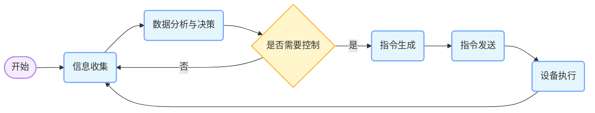

# 智能家居中的AI Agent控制中心

> 关键词：智能家居、AI Agent、控制中心、智能控制、物联网

> 摘要：本文围绕智能家居中的AI Agent控制中心展开深入探讨。首先介绍了其背景，包括目的、预期读者、文档结构和相关术语。接着阐述了核心概念与联系，给出了原理和架构的示意图及流程图。详细讲解了核心算法原理，并使用Python代码进行说明，同时给出了相关数学模型和公式。通过项目实战，展示了开发环境搭建、源代码实现与解读。分析了实际应用场景，推荐了学习资源、开发工具框架和相关论文著作。最后总结了未来发展趋势与挑战，提供了常见问题解答和扩展阅读参考资料，旨在帮助读者全面了解智能家居中AI Agent控制中心的技术原理和应用。

## 1. 背景介绍 
### 1.1 目的和范围
智能家居的发展使得各种智能设备不断涌现，如何高效地管理和控制这些设备成为了关键问题。AI Agent控制中心的目的就是提供一个集中的、智能的管理平台，通过人工智能技术实现对智能家居设备的自动化、个性化控制。本文章的范围涵盖了AI Agent控制中心的核心概念、算法原理、数学模型、项目实战、应用场景等方面，旨在为读者全面介绍这一技术。

### 1.2 预期读者
本文预期读者包括智能家居领域的开发者、研究人员，对人工智能和物联网技术感兴趣的爱好者，以及希望了解智能家居系统架构和实现原理的相关从业人员。

### 1.3 文档结构概述
本文将按照以下结构进行阐述：首先介绍背景信息，包括目的、读者和文档结构；接着讲解核心概念与联系，包括原理和架构；然后详细介绍核心算法原理和具体操作步骤，给出Python代码示例；之后探讨数学模型和公式，并举例说明；通过项目实战展示代码实现和解读；分析实际应用场景；推荐相关的工具和资源；最后总结未来发展趋势与挑战，提供常见问题解答和扩展阅读参考资料。

### 1.4 术语表
#### 1.4.1 核心术语定义
- **智能家居**：利用物联网技术，将家中的各种设备（如照明系统、窗帘控制、空调控制、安防系统等）连接到一起，实现智能化的管理和控制。
- **AI Agent（人工智能代理）**：是一种能够感知环境、自主决策并采取行动的智能实体，在智能家居中可以理解为智能控制的执行者。
- **控制中心**：作为智能家居系统的核心，负责接收、处理设备信息，下达控制指令，实现对各种智能设备的集中管理。

#### 1.4.2 相关概念解释
- **物联网（IoT）**：通过各种信息传感设备，实时采集任何需要监控、连接、互动的物体或过程等各种需要的信息，与互联网结合形成的一个巨大网络。在智能家居中，物联网是实现设备互联互通的基础。
- **自动化控制**：根据预设的规则和条件，自动对智能家居设备进行控制，无需人工干预。例如，根据时间自动调节灯光亮度。
- **个性化控制**：根据用户的习惯、偏好和场景需求，为用户提供定制化的设备控制方案。

#### 1.4.3 缩略词列表
- **IoT**：Internet of Things（物联网）
- **AI**：Artificial Intelligence（人工智能）

## 2. 核心概念与联系 
### 核心概念原理
AI Agent控制中心在智能家居中扮演着核心角色。它通过传感器收集智能家居环境中的各种信息，如温度、湿度、光照强度等，以及设备的状态信息，如开关状态、运行模式等。然后，AI Agent利用这些信息进行分析和决策，根据预设的规则或机器学习模型，判断当前的环境状态和用户需求，从而生成相应的控制指令。最后，将这些指令发送给对应的智能设备，实现对设备的控制。

### 架构的文本示意图
```plaintext
+---------------------+
|    AI Agent控制中心    |
+---------------------+
|  信息收集模块       |
|  数据分析与决策模块 |
|  指令生成与发送模块 |
+---------------------+
        |               |
        v               v
+----------------+  +----------------+
|  传感器网络    |  |  智能设备网络  |
+----------------+  +----------------+
```
### Mermaid流程图


## 3. 核心算法原理 & 具体操作步骤 
### 核心算法原理
AI Agent控制中心的核心算法主要包括规则引擎和机器学习算法。规则引擎根据预设的规则对收集到的信息进行匹配和判断，例如，如果温度高于30摄氏度，则打开空调。机器学习算法则通过对大量历史数据的学习，建立模型来预测用户的需求和环境的变化，从而实现更智能的决策。

### 具体操作步骤
1. **信息收集**：通过传感器网络收集环境信息和设备状态信息。
2. **数据预处理**：对收集到的数据进行清洗、归一化等处理，以便后续分析。
3. **规则匹配**：使用规则引擎对预处理后的数据进行匹配，判断是否满足预设的规则。
4. **机器学习预测**：如果规则匹配不满足或需要更智能的决策，使用机器学习模型进行预测。
5. **指令生成**：根据规则匹配结果或机器学习预测结果，生成相应的控制指令。
6. **指令发送**：将生成的控制指令发送给对应的智能设备。

### Python源代码实现
```python
# 模拟信息收集
def collect_information():
    # 这里可以连接实际的传感器获取数据
    temperature = 25  # 模拟温度数据
    humidity = 60  # 模拟湿度数据
    return temperature, humidity

# 规则引擎
def rule_engine(temperature, humidity):
    if temperature > 30:
        return "打开空调"
    elif humidity > 70:
        return "打开除湿器"
    else:
        return "无操作"

# 主函数
def main():
    temperature, humidity = collect_information()
    command = rule_engine(temperature, humidity)
    print(f"当前温度: {temperature} 摄氏度，当前湿度: {humidity}%，指令: {command}")

if __name__ == "__main__":
    main()
```

## 4. 数学模型和公式 & 详细讲解 & 举例说明 
### 数学模型
在AI Agent控制中心中，机器学习模型可以使用线性回归、逻辑回归、决策树等。以线性回归为例，其数学模型可以表示为：
$$y = \theta_0 + \theta_1x_1 + \theta_2x_2 + \cdots + \theta_nx_n$$
其中，$y$ 是预测值，$x_1, x_2, \cdots, x_n$ 是输入特征，$\theta_0, \theta_1, \cdots, \theta_n$ 是模型的参数。

### 公式详细讲解
线性回归的目标是找到一组最优的参数 $\theta$，使得预测值 $y$ 与实际值之间的误差最小。误差通常使用均方误差（MSE）来衡量，其公式为：
$$MSE = \frac{1}{m}\sum_{i=1}^{m}(y^{(i)} - \hat{y}^{(i)})^2$$
其中，$m$ 是样本数量，$y^{(i)}$ 是第 $i$ 个样本的实际值，$\hat{y}^{(i)}$ 是第 $i$ 个样本的预测值。

为了找到最优的参数 $\theta$，可以使用梯度下降算法。梯度下降算法的更新公式为：
$$\theta_j := \theta_j - \alpha\frac{\partial}{\partial\theta_j}MSE(\theta)$$
其中，$\alpha$ 是学习率，控制参数更新的步长。

### 举例说明
假设我们要根据温度和湿度来预测是否需要打开空调。我们有以下样本数据：

| 温度 ($x_1$) | 湿度 ($x_2$) | 是否打开空调 ($y$) |
| ------------ | ------------ | ------------------ |
| 25           | 60           | 0                  |
| 32           | 70           | 1                  |
| 28           | 65           | 0                  |

我们可以使用线性回归模型来进行预测。首先，初始化参数 $\theta_0, \theta_1, \theta_2$，然后使用梯度下降算法不断更新参数，直到误差最小。

```python
import numpy as np

# 样本数据
X = np.array([[1, 25, 60], [1, 32, 70], [1, 28, 65]])
y = np.array([0, 1, 0])

# 初始化参数
theta = np.zeros(3)

# 学习率
alpha = 0.01

# 迭代次数
iterations = 1000

# 梯度下降算法
for _ in range(iterations):
    predictions = np.dot(X, theta)
    error = predictions - y
    gradient = np.dot(X.T, error) / len(y)
    theta = theta - alpha * gradient

# 预测新数据
new_X = np.array([1, 30, 68])
prediction = np.dot(new_X, theta)
print(f"预测结果: {prediction}")
```

## 5. 项目实战：代码实际案例和详细解释说明 
### 5.1  开发环境搭建
#### 硬件环境
- 树莓派：作为AI Agent控制中心的硬件平台，负责运行控制程序。
- 传感器模块：如温度传感器、湿度传感器、光照传感器等，用于收集环境信息。
- 智能设备：如智能灯泡、智能插座、智能空调等，用于实现设备控制。

#### 软件环境
- 操作系统：Raspbian（树莓派官方操作系统）
- 编程语言：Python 3.x
- 开发框架：Flask（用于搭建Web服务器）

### 5.2  源代码详细实现和代码解读
```python
from flask import Flask, jsonify, request
import random

app = Flask(__name__)

# 模拟设备状态
devices = {
    "light": False,
    "air_conditioner": False
}

# 获取设备状态
@app.route('/devices/status', methods=['GET'])
def get_device_status():
    return jsonify(devices)

# 控制设备
@app.route('/devices/control', methods=['POST'])
def control_device():
    data = request.get_json()
    device = data.get('device')
    action = data.get('action')

    if device in devices:
        if action == 'on':
            devices[device] = True
        elif action == 'off':
            devices[device] = False
        return jsonify({"message": f"{device} {action} successfully"})
    else:
        return jsonify({"message": "Device not found"})

if __name__ == '__main__':
    app.run(host='0.0.0.0', port=5000)
```

### 代码解读与分析
- **导入模块**：导入Flask和相关模块，用于搭建Web服务器和处理HTTP请求。
- **模拟设备状态**：使用字典 `devices` 模拟智能设备的状态。
- **获取设备状态**：定义 `/devices/status` 接口，用于获取所有设备的状态信息。
- **控制设备**：定义 `/devices/control` 接口，用于接收设备控制指令，并更新设备状态。
- **运行服务器**：使用 `app.run()` 启动Flask服务器，监听来自客户端的请求。

## 6. 实际应用场景 
### 家庭自动化
AI Agent控制中心可以实现家庭设备的自动化控制。例如，根据时间自动调节灯光亮度，早上逐渐增加亮度，晚上逐渐降低亮度；根据室内温度自动调节空调的运行模式，保持室内温度舒适。

### 能源管理
通过对家庭设备的智能控制，AI Agent控制中心可以实现能源的优化管理。例如，根据太阳能板的发电情况和家庭用电需求，自动控制电器设备的开启和关闭，降低能源消耗。

### 安全监控
结合安防设备，如摄像头、门窗传感器等，AI Agent控制中心可以实现家庭安全监控。当检测到异常情况时，如门窗被非法打开，自动发送警报信息给用户。

### 场景模式
用户可以根据自己的需求设置不同的场景模式，如“回家模式”、“睡眠模式”、“聚会模式”等。AI Agent控制中心根据用户选择的场景模式，自动控制相应的设备，提供个性化的服务。

## 7. 工具和资源推荐
### 7.1 学习资源推荐
#### 7.1.1 书籍推荐
- 《智能家居系统设计与实现》：详细介绍了智能家居系统的架构、设计和实现方法，包括硬件选型、软件编程和系统集成等方面。
- 《Python机器学习实战》：通过实际案例介绍了Python在机器学习领域的应用，包括数据处理、模型训练和评估等内容。
- 《物联网技术导论》：全面介绍了物联网的基本概念、技术原理和应用场景，为学习智能家居技术提供了基础。

#### 7.1.2 在线课程
- Coursera上的“人工智能基础”课程：由知名高校教授授课，系统介绍了人工智能的基本概念、算法和应用。
- edX上的“物联网基础”课程：涵盖了物联网的技术架构、通信协议和应用开发等方面的知识。
- 慕课网上的“智能家居开发实战”课程：通过实际项目，详细介绍了智能家居系统的开发流程和技术实现。

#### 7.1.3 技术博客和网站
- 物联网世界：提供了物联网领域的最新技术动态、行业资讯和应用案例。
- 开源中国：汇聚了大量的开源项目和技术文章，对于学习智能家居开发有很大的帮助。
- 博客园：许多开发者在博客园分享自己的技术经验和项目实践，是学习和交流的好平台。

### 7.2 开发工具框架推荐
#### 7.2.1 IDE和编辑器
- PyCharm：一款专业的Python集成开发环境，提供了代码编辑、调试、版本控制等功能，适合Python开发。
- Visual Studio Code：一款轻量级的代码编辑器，支持多种编程语言和插件扩展，方便快捷。
- Sublime Text：一款简洁高效的代码编辑器，具有快速打开文件、语法高亮等特点。

#### 7.2.2 调试和性能分析工具
- Flask Debug Toolbar：用于调试Flask应用程序，提供了请求信息、性能分析等功能。
- Py-Spy：一个性能分析工具，可以实时监测Python程序的CPU使用率和函数调用情况。
- Chrome开发者工具：可以用于调试Web应用程序，包括网络请求、页面性能等方面的分析。

#### 7.2.3 相关框架和库
- Flask：一个轻量级的Python Web框架，适合快速开发Web应用程序。
- TensorFlow：一个开源的机器学习框架，提供了丰富的工具和算法，用于构建和训练机器学习模型。
- MQTT Python Client：用于实现MQTT协议的Python客户端库，方便与物联网设备进行通信。

### 7.3 相关论文著作推荐
#### 7.3.1 经典论文
- "A Survey on Internet of Things: Architecture, Enabling Technologies, Security and Privacy, and Applications"：全面介绍了物联网的架构、技术、安全和应用等方面的内容，是物联网领域的经典论文。
- "Artificial Intelligence in the Internet of Things: A Survey"：探讨了人工智能在物联网中的应用和发展趋势，对于理解AI Agent控制中心的技术原理有很大的帮助。

#### 7.3.2 最新研究成果
- 在IEEE Xplore、ACM Digital Library等学术数据库中搜索关于智能家居和AI Agent的最新研究成果，了解该领域的前沿技术和发展动态。

#### 7.3.3 应用案例分析
- 参考一些知名企业的智能家居应用案例，如谷歌智能家居、小米智能家居等，分析它们的系统架构、技术实现和用户体验，从中获取灵感和经验。

## 8. 总结：未来发展趋势与挑战
### 未来发展趋势
- **智能化程度不断提高**：随着人工智能技术的不断发展，AI Agent控制中心将具备更强的学习和推理能力，能够更好地理解用户的需求和环境的变化，提供更加智能、个性化的服务。
- **与其他技术的融合**：AI Agent控制中心将与大数据、云计算、区块链等技术深度融合，实现数据的高效处理和共享，提高系统的安全性和可靠性。
- **跨平台和互联互通**：未来的智能家居系统将支持更多的设备和平台，实现不同品牌、不同类型设备之间的互联互通，为用户提供更加便捷的使用体验。

### 挑战
- **数据安全和隐私保护**：智能家居系统涉及大量的用户数据，如个人信息、生活习惯等，如何保障数据的安全和隐私是一个重要的挑战。
- **标准和协议不统一**：目前智能家居领域缺乏统一的标准和协议，不同品牌的设备之间难以实现互联互通，影响了智能家居系统的发展。
- **用户接受度**：部分用户对智能家居系统的安全性和可靠性存在疑虑，如何提高用户的接受度和信任度是推广智能家居系统的关键。

## 9. 附录：常见问题与解答
### 问题1：AI Agent控制中心如何保证数据的安全性？
答：可以采用多种安全措施，如数据加密、访问控制、身份认证等。对收集到的数据进行加密处理，防止数据在传输和存储过程中被窃取；设置严格的访问权限，只有授权用户才能访问和管理数据；使用身份认证技术，确保用户的身份真实可靠。

### 问题2：不同品牌的智能设备如何接入AI Agent控制中心？
答：可以通过中间件或网关来实现不同品牌设备的接入。中间件或网关可以将不同品牌设备的通信协议进行转换，使其能够与AI Agent控制中心进行通信。一些开源的物联网平台也提供了设备接入的功能，可以方便地实现不同品牌设备的集成。

### 问题3：AI Agent控制中心的运行需要消耗大量的资源吗？
答：这取决于控制中心的功能和规模。对于一些简单的控制中心，如只实现基本的设备控制功能，对资源的需求相对较小，可以在普通的硬件平台上运行。而对于一些复杂的控制中心，如需要进行大规模的数据处理和机器学习模型训练，可能需要更高性能的硬件设备和云计算资源。

## 10. 扩展阅读 & 参考资料
- 《智能家居安全技术》
- 《人工智能与物联网融合发展研究报告》
- 智能家居行业白皮书
- 相关的技术论坛和社区

作者：AI天才研究院/AI Genius Institute & 禅与计算机程序设计艺术 /Zen And The Art of Computer Programming