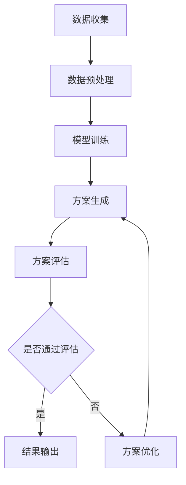

# 智能家族信托规划助手

> 关键词：智能家族信托规划助手、家族信托、人工智能、金融规划、算法模型

> 摘要：本文深入探讨了智能家族信托规划助手这一创新技术在金融领域的应用。详细介绍了其背景，包括目的、预期读者等内容。阐述了核心概念、算法原理、数学模型等基础知识，通过Python代码进行算法实现的讲解。给出项目实战案例，涵盖开发环境搭建、源代码实现与解读。分析了其实际应用场景，推荐了相关学习资源、开发工具和论文著作。最后总结了未来发展趋势与挑战，并提供常见问题解答和扩展阅读参考资料，旨在为读者全面了解和运用智能家族信托规划助手提供深入的技术指导和理论支持。

## 1. 背景介绍 
### 1.1 目的和范围
家族信托作为一种重要的财富管理和传承工具，在高净值人群中越来越受到关注。然而，家族信托的规划涉及到复杂的法律、金融、税务等多方面知识，需要专业的规划师进行综合考量。智能家族信托规划助手的目的在于利用人工智能技术，为家族信托规划提供智能化的支持，帮助规划师和客户更高效、准确地制定家族信托方案。

其范围涵盖了家族信托规划的各个环节，包括客户信息收集、需求分析、方案设计、风险评估、收益预测等。通过对大量数据的分析和学习，智能家族信托规划助手能够根据客户的具体情况，提供个性化的家族信托规划建议。

### 1.2 预期读者
本文的预期读者主要包括以下几类人群：
- 金融行业从业者，如家族信托规划师、理财顾问等，他们可以通过本文了解智能家族信托规划助手的技术原理和应用方法，提升自己的专业能力。
- 高净值客户，对于有家族信托规划需求的客户，本文可以帮助他们了解智能家族信托规划助手的作用和优势，更好地参与家族信托规划过程。
- 技术开发者，包括人工智能工程师、金融科技开发者等，他们可以从本文中获取智能家族信托规划助手的技术实现细节，为相关项目的开发提供参考。
- 研究人员，对家族信托和人工智能交叉领域感兴趣的研究人员，本文可以为他们的研究提供理论和实践基础。

### 1.3 文档结构概述
本文将按照以下结构进行详细阐述：
- 核心概念与联系：介绍智能家族信托规划助手的核心概念、原理和架构，并通过文本示意图和Mermaid流程图进行直观展示。
- 核心算法原理 & 具体操作步骤：讲解智能家族信托规划助手所使用的核心算法原理，并使用Python源代码详细阐述具体操作步骤。
- 数学模型和公式 & 详细讲解 & 举例说明：给出智能家族信托规划助手涉及的数学模型和公式，并进行详细讲解和举例说明。
- 项目实战：通过实际案例，介绍智能家族信托规划助手的开发环境搭建、源代码详细实现和代码解读。
- 实际应用场景：分析智能家族信托规划助手在实际中的应用场景。
- 工具和资源推荐：推荐相关的学习资源、开发工具框架和论文著作。
- 总结：未来发展趋势与挑战：总结智能家族信托规划助手的未来发展趋势和面临的挑战。
- 附录：常见问题与解答：提供智能家族信托规划助手相关的常见问题解答。
- 扩展阅读 & 参考资料：列出相关的扩展阅读材料和参考资料。

### 1.4 术语表
#### 1.4.1 核心术语定义
- **家族信托**：是一种信托机构受个人或家族的委托，代为管理、处置家庭财产的财产管理方式，以实现富人的财富规划及传承目标。
- **智能家族信托规划助手**：利用人工智能技术，为家族信托规划提供智能化支持的系统或工具。
- **风险评估**：对家族信托规划方案可能面临的各种风险进行评估和分析的过程。
- **收益预测**：根据历史数据和相关模型，对家族信托规划方案的预期收益进行预测的过程。

#### 1.4.2 相关概念解释
- **人工智能**：是研究、开发用于模拟、延伸和扩展人的智能的理论、方法、技术及应用系统的一门新的技术科学。在智能家族信托规划助手中，人工智能主要用于数据处理、模型训练和决策支持等方面。
- **机器学习**：是一门多领域交叉学科，涉及概率论、统计学、逼近论、凸分析、算法复杂度理论等多门学科。它专门研究计算机怎样模拟或实现人类的学习行为，以获取新的知识或技能，重新组织已有的知识结构使之不断改善自身的性能。在智能家族信托规划助手中，机器学习算法用于对大量的家族信托数据进行学习和分析，从而为规划方案的制定提供依据。
- **自然语言处理**：是计算机科学领域与人工智能领域中的一个重要方向。它研究能实现人与计算机之间用自然语言进行有效通信的各种理论和方法。在智能家族信托规划助手中，自然语言处理技术用于处理客户的自然语言输入，理解客户的需求，并生成自然语言的规划建议。

#### 1.4.3 缩略词列表
- **AI**：Artificial Intelligence，人工智能
- **ML**：Machine Learning，机器学习
- **NLP**：Natural Language Processing，自然语言处理

## 2. 核心概念与联系 
### 核心概念原理
智能家族信托规划助手的核心原理是将人工智能技术与家族信托规划业务相结合。通过收集和分析大量的家族信托数据，包括客户信息、市场数据、法律法规等，利用机器学习算法建立预测模型和决策模型，为家族信托规划提供智能化的支持。

具体来说，智能家族信托规划助手的工作流程如下：
1. **数据收集**：收集客户的基本信息、财务状况、家族情况、投资偏好等数据，以及市场数据、法律法规等外部数据。
2. **数据预处理**：对收集到的数据进行清洗、转换和归一化等处理，以提高数据的质量和可用性。
3. **模型训练**：利用机器学习算法对预处理后的数据进行训练，建立预测模型和决策模型。预测模型用于预测家族信托的收益和风险，决策模型用于根据客户的需求和情况，生成最优的家族信托规划方案。
4. **方案生成**：根据客户的输入和训练好的模型，生成个性化的家族信托规划方案。
5. **方案评估**：对生成的家族信托规划方案进行评估，包括收益评估、风险评估、合规性评估等。
6. **方案优化**：根据评估结果，对家族信托规划方案进行优化，以提高方案的质量和可行性。
7. **结果输出**：将优化后的家族信托规划方案以可视化的方式输出给客户和规划师。

### 架构的文本示意图
智能家族信托规划助手的架构主要包括以下几个部分：
- **数据层**：负责收集、存储和管理各种数据，包括客户数据、市场数据、法律法规数据等。
- **算法层**：包含各种机器学习算法和人工智能技术，用于数据处理、模型训练和决策支持。
- **模型层**：存储训练好的预测模型和决策模型，为方案生成和评估提供支持。
- **应用层**：提供用户界面和交互功能，方便客户和规划师使用智能家族信托规划助手。
- **服务层**：提供各种服务，如数据服务、模型服务、方案评估服务等。

### Mermaid流程图


## 3. 核心算法原理 & 具体操作步骤 
### 核心算法原理
智能家族信托规划助手主要使用以下几种核心算法：
- **线性回归算法**：用于预测家族信托的收益。线性回归是一种基于最小二乘法的统计分析方法，通过建立自变量和因变量之间的线性关系，来预测因变量的值。在家族信托规划中，自变量可以包括市场指数、利率、客户的投资偏好等，因变量为家族信托的预期收益。
- **逻辑回归算法**：用于风险评估。逻辑回归是一种广义线性回归模型，用于处理二分类问题。在家族信托规划中，逻辑回归可以用于评估家族信托方案是否存在高风险，例如是否可能出现亏损等情况。
- **决策树算法**：用于方案生成。决策树是一种基于树结构进行决策的算法，通过对数据进行划分和决策，生成最优的决策方案。在家族信托规划中，决策树可以根据客户的需求和情况，生成个性化的家族信托规划方案。

### 具体操作步骤（Python源代码）
以下是一个简单的示例，演示如何使用Python实现线性回归算法来预测家族信托的收益：

```python
import numpy as np
from sklearn.linear_model import LinearRegression

# 生成示例数据
# 假设自变量为市场指数和利率
X = np.array([[100, 0.05], [110, 0.06], [120, 0.07], [130, 0.08], [140, 0.09]])
# 因变量为家族信托的预期收益
y = np.array([10, 12, 14, 16, 18])

# 创建线性回归模型
model = LinearRegression()

# 训练模型
model.fit(X, y)

# 预测新的数据
new_X = np.array([[150, 0.1]])
predicted_y = model.predict(new_X)

print("预测的家族信托收益为:", predicted_y[0])
```

### 代码解释
1. **数据生成**：使用`numpy`库生成示例数据，包括自变量`X`和因变量`y`。
2. **模型创建**：使用`sklearn`库中的`LinearRegression`类创建线性回归模型。
3. **模型训练**：使用`fit`方法对模型进行训练，将自变量`X`和因变量`y`作为输入。
4. **预测**：使用`predict`方法对新的数据进行预测，将新的自变量`new_X`作为输入，得到预测的因变量`predicted_y`。
5. **结果输出**：打印预测的家族信托收益。

## 4. 数学模型和公式 & 详细讲解 & 举例说明 
### 线性回归模型
线性回归模型的数学公式为：
$$y = \beta_0 + \beta_1x_1 + \beta_2x_2 + \cdots + \beta_nx_n + \epsilon$$
其中，$y$ 是因变量，$x_1, x_2, \cdots, x_n$ 是自变量，$\beta_0, \beta_1, \beta_2, \cdots, \beta_n$ 是回归系数，$\epsilon$ 是误差项。

线性回归的目标是通过最小化误差项的平方和，来估计回归系数 $\beta_0, \beta_1, \beta_2, \cdots, \beta_n$ 的值。误差项的平方和可以表示为：
$$SSE = \sum_{i=1}^{m}(y_i - \hat{y}_i)^2$$
其中，$m$ 是样本数量，$y_i$ 是实际的因变量值，$\hat{y}_i$ 是预测的因变量值。

通过最小化 $SSE$，可以得到回归系数的估计值：
$$\hat{\beta} = (X^TX)^{-1}X^Ty$$
其中，$X$ 是自变量矩阵，$y$ 是因变量向量。

### 举例说明
假设我们有以下数据：
| 市场指数 $x_1$ | 利率 $x_2$ | 家族信托收益 $y$ |
| --- | --- | --- |
| 100 | 0.05 | 10 |
| 110 | 0.06 | 12 |
| 120 | 0.07 | 14 |
| 130 | 0.08 | 16 |
| 140 | 0.09 | 18 |

我们可以使用线性回归模型来预测当市场指数为 150，利率为 0.1 时，家族信托的收益。

首先，我们需要将数据转换为矩阵形式：
$$X = \begin{bmatrix}
1 & 100 & 0.05 \\
1 & 110 & 0.06 \\
1 & 120 & 0.07 \\
1 & 130 & 0.08 \\
1 & 140 & 0.09
\end{bmatrix}$$
$$y = \begin{bmatrix}
10 \\
12 \\
14 \\
16 \\
18
\end{bmatrix}$$

然后，我们可以计算回归系数的估计值：
$$\hat{\beta} = (X^TX)^{-1}X^Ty$$

最后，我们可以使用回归系数的估计值来预测新的数据：
$$\hat{y} = \hat{\beta}_0 + \hat{\beta}_1x_1 + \hat{\beta}_2x_2$$

### 逻辑回归模型
逻辑回归模型的数学公式为：
$$P(y = 1|x) = \frac{1}{1 + e^{-(\beta_0 + \beta_1x_1 + \beta_2x_2 + \cdots + \beta_nx_n)}}$$
其中，$P(y = 1|x)$ 是在自变量 $x$ 的条件下，因变量 $y$ 等于 1 的概率，$\beta_0, \beta_1, \beta_2, \cdots, \beta_n$ 是回归系数。

逻辑回归的目标是通过最大化似然函数，来估计回归系数 $\beta_0, \beta_1, \beta_2, \cdots, \beta_n$ 的值。似然函数可以表示为：
$$L(\beta) = \prod_{i=1}^{m}P(y_i|x_i)^{y_i}(1 - P(y_i|x_i))^{1 - y_i}$$
其中，$m$ 是样本数量，$y_i$ 是实际的因变量值，$P(y_i|x_i)$ 是在自变量 $x_i$ 的条件下，因变量 $y_i$ 的概率。

通过最大化 $L(\beta)$，可以得到回归系数的估计值。

### 决策树模型
决策树模型是一种基于树结构进行决策的模型。决策树的每个内部节点是一个属性上的测试，每个分支是一个测试输出，每个叶节点是一个类别或值。

决策树的构建过程主要包括以下几个步骤：
1. **选择最优属性**：从所有属性中选择一个最优属性作为当前节点的划分属性。
2. **划分数据集**：根据最优属性的不同取值，将数据集划分为不同的子集。
3. **递归构建子树**：对每个子集递归地构建子树，直到满足停止条件。

常用的决策树算法有 ID3、C4.5 和 CART 等。

## 5. 项目实战：代码实际案例和详细解释说明 
### 5.1  开发环境搭建
#### 安装Python
首先，需要安装 Python 环境。可以从 Python 官方网站（https://www.python.org/downloads/） 下载适合自己操作系统的 Python 安装包，并按照安装向导进行安装。

#### 安装必要的库
在开发智能家族信托规划助手时，需要使用一些 Python 库，如`numpy`、`pandas`、`scikit-learn`等。可以使用`pip`命令来安装这些库：
```sh
pip install numpy pandas scikit-learn
```

### 5.2  源代码详细实现和代码解读
以下是一个简单的智能家族信托规划助手的代码示例：

```python
import numpy as np
import pandas as pd
from sklearn.linear_model import LinearRegression
from sklearn.tree import DecisionTreeRegressor
from sklearn.model_selection import train_test_split
from sklearn.metrics import mean_squared_error

# 生成示例数据
data = {
    'market_index': [100, 110, 120, 130, 140],
    'interest_rate': [0.05, 0.06, 0.07, 0.08, 0.09],
    'trust_income': [10, 12, 14, 16, 18]
}
df = pd.DataFrame(data)

# 划分自变量和因变量
X = df[['market_index', 'interest_rate']]
y = df['trust_income']

# 划分训练集和测试集
X_train, X_test, y_train, y_test = train_test_split(X, y, test_size=0.2, random_state=42)

# 创建线性回归模型
linear_model = LinearRegression()

# 训练线性回归模型
linear_model.fit(X_train, y_train)

# 预测测试集
linear_predictions = linear_model.predict(X_test)

# 计算线性回归模型的均方误差
linear_mse = mean_squared_error(y_test, linear_predictions)
print("线性回归模型的均方误差:", linear_mse)

# 创建决策树回归模型
tree_model = DecisionTreeRegressor()

# 训练决策树回归模型
tree_model.fit(X_train, y_train)

# 预测测试集
tree_predictions = tree_model.predict(X_test)

# 计算决策树回归模型的均方误差
tree_mse = mean_squared_error(y_test, tree_predictions)
print("决策树回归模型的均方误差:", tree_mse)

# 选择最优模型
if linear_mse < tree_mse:
    best_model = linear_model
else:
    best_model = tree_model

# 预测新的数据
new_X = np.array([[150, 0.1]])
predicted_income = best_model.predict(new_X)
print("预测的家族信托收益为:", predicted_income[0])
```

### 5.3  代码解读与分析
1. **数据生成**：使用`pandas`库生成示例数据，并将其存储在`DataFrame`对象中。
2. **数据划分**：使用`train_test_split`函数将数据集划分为训练集和测试集，其中测试集占总数据集的 20%。
3. **模型创建与训练**：分别创建线性回归模型和决策树回归模型，并使用训练集对模型进行训练。
4. **模型评估**：使用`mean_squared_error`函数计算线性回归模型和决策树回归模型的均方误差，均方误差越小，模型的性能越好。
5. **最优模型选择**：比较线性回归模型和决策树回归模型的均方误差，选择均方误差较小的模型作为最优模型。
6. **预测新的数据**：使用最优模型对新的数据进行预测，并输出预测结果。

## 6. 实际应用场景 
### 客户需求分析
智能家族信托规划助手可以帮助规划师更好地了解客户的需求。通过收集客户的基本信息、财务状况、家族情况、投资偏好等数据，利用自然语言处理技术对客户的需求进行分析和理解。例如，客户可能会提出“我希望在保证资产安全的前提下，实现一定的资产增值”，智能家族信托规划助手可以通过分析这句话，提取出客户的核心需求是资产安全和增值，并根据客户的具体情况，提供相应的家族信托规划建议。

### 方案设计与优化
智能家族信托规划助手可以根据客户的需求和情况，生成个性化的家族信托规划方案。通过对大量的家族信托数据进行分析和学习，利用机器学习算法建立预测模型和决策模型，为方案设计提供支持。例如，根据客户的资产规模、投资偏好、风险承受能力等因素，智能家族信托规划助手可以推荐适合客户的信托产品和投资组合。同时，智能家族信托规划助手还可以对生成的方案进行评估和优化，根据评估结果，调整方案的参数和策略，以提高方案的质量和可行性。

### 风险评估与预警
智能家族信托规划助手可以对家族信托规划方案可能面临的各种风险进行评估和分析。通过建立风险评估模型，对市场风险、信用风险、流动性风险等进行量化分析，为规划师和客户提供风险预警。例如，当市场指数出现大幅波动时，智能家族信托规划助手可以及时提醒规划师和客户，调整家族信托规划方案，以降低风险。

### 收益预测与监控
智能家族信托规划助手可以根据历史数据和相关模型，对家族信托规划方案的预期收益进行预测。通过建立收益预测模型，考虑市场因素、投资策略等因素，为规划师和客户提供收益预测报告。同时，智能家族信托规划助手还可以对家族信托的实际收益进行监控，实时更新收益数据，为规划师和客户提供决策支持。

## 7. 工具和资源推荐
### 7.1 学习资源推荐
#### 7.1.1 书籍推荐
- 《Python 数据分析实战》：本书介绍了如何使用 Python 进行数据分析，包括数据清洗、数据可视化、机器学习等内容，对于智能家族信托规划助手的开发具有重要的参考价值。
- 《机器学习》：周志华著，本书是机器学习领域的经典教材，系统地介绍了机器学习的基本概念、算法和应用，对于理解智能家族信托规划助手中的机器学习算法具有重要的帮助。
- 《人工智能：现代方法》：本书是人工智能领域的权威教材，全面介绍了人工智能的各个方面，包括知识表示、推理、搜索、机器学习、自然语言处理等，对于深入理解智能家族信托规划助手的技术原理具有重要的意义。

#### 7.1.2 在线课程
- Coursera 上的《机器学习》课程：由斯坦福大学的 Andrew Ng 教授授课，是一门非常经典的机器学习课程，适合初学者学习。
- edX 上的《人工智能导论》课程：由伯克利大学的 Pieter Abbeel 教授授课，系统地介绍了人工智能的基本概念、算法和应用。
- 中国大学 MOOC 上的《Python 语言程序设计》课程：由北京理工大学的嵩天教授授课，适合初学者学习 Python 语言。

#### 7.1.3 技术博客和网站
- 博客园：是一个技术博客平台，上面有很多关于人工智能、机器学习、数据分析等方面的技术文章，可以帮助开发者了解最新的技术动态和解决方案。
- 开源中国：是一个开源技术社区，上面有很多开源项目和技术文章，对于智能家族信托规划助手的开发具有重要的参考价值。
- Kaggle：是一个数据科学竞赛平台，上面有很多数据科学和机器学习的竞赛和数据集，可以帮助开发者提高自己的数据分析和机器学习能力。

### 7.2 开发工具框架推荐
#### 7.2.1 IDE和编辑器
- PyCharm：是一款专门为 Python 开发设计的集成开发环境，具有代码编辑、调试、版本控制等功能，非常适合智能家族信托规划助手的开发。
- Jupyter Notebook：是一个交互式的开发环境，可以在浏览器中编写和运行 Python 代码，支持代码、文本、图像等多种格式的输出，非常适合数据分析和机器学习的开发。
- Visual Studio Code：是一款轻量级的代码编辑器，支持多种编程语言和插件扩展，具有代码编辑、调试、版本控制等功能，也可以用于智能家族信托规划助手的开发。

#### 7.2.2 调试和性能分析工具
- Py-Spy：是一个 Python 性能分析工具，可以实时监控 Python 程序的性能，找出性能瓶颈。
- PDB：是 Python 自带的调试器，可以帮助开发者调试 Python 代码，找出代码中的错误。
- TensorBoard：是 TensorFlow 提供的一个可视化工具，可以用于可视化机器学习模型的训练过程和性能指标。

#### 7.2.3 相关框架和库
- NumPy：是 Python 中用于科学计算的基础库，提供了高效的多维数组对象和各种数学函数，对于智能家族信托规划助手中的数据处理和计算具有重要的作用。
- Pandas：是 Python 中用于数据分析的库，提供了高效的数据结构和数据处理工具，对于智能家族信托规划助手中的数据清洗和分析具有重要的作用。
- Scikit-learn：是 Python 中用于机器学习的库，提供了各种机器学习算法和工具，对于智能家族信托规划助手中的模型训练和预测具有重要的作用。
- TensorFlow：是 Google 开发的一个开源机器学习框架，提供了高效的深度学习模型训练和部署工具，对于智能家族信托规划助手中的深度学习应用具有重要的作用。

### 7.3 相关论文著作推荐
#### 7.3.1 经典论文
- 《A Decision-Theoretic Generalization of On-Line Learning and an Application to Boosting》：这篇论文介绍了 AdaBoost 算法，是机器学习领域的经典论文之一。
- 《Gradient-Based Learning Applied to Document Recognition》：这篇论文介绍了卷积神经网络（CNN）在图像识别中的应用，是深度学习领域的经典论文之一。
- 《Long Short-Term Memory》：这篇论文介绍了长短期记忆网络（LSTM），是深度学习领域的经典论文之一。

#### 7.3.2 最新研究成果
- 《Attention Is All You Need》：这篇论文介绍了 Transformer 模型，是自然语言处理领域的最新研究成果之一。
- 《BERT: Pre-training of Deep Bidirectional Transformers for Language Understanding》：这篇论文介绍了 BERT 模型，是自然语言处理领域的最新研究成果之一。
- 《Generative Adversarial Nets》：这篇论文介绍了生成对抗网络（GAN），是深度学习领域的最新研究成果之一。

#### 7.3.3 应用案例分析
- 《应用人工智能技术优化家族信托规划的案例研究》：这篇论文通过实际案例，分析了如何应用人工智能技术优化家族信托规划，具有重要的参考价值。
- 《智能家族信托规划系统的设计与实现》：这篇论文介绍了智能家族信托规划系统的设计与实现过程，对于智能家族信托规划助手的开发具有重要的参考意义。
- 《基于机器学习的家族信托风险评估模型研究》：这篇论文研究了基于机器学习的家族信托风险评估模型，对于智能家族信托规划助手中的风险评估具有重要的参考价值。

## 8. 总结：未来发展趋势与挑战
### 未来发展趋势
- **智能化程度不断提高**：随着人工智能技术的不断发展，智能家族信托规划助手的智能化程度将不断提高。未来，智能家族信托规划助手将能够更加准确地理解客户的需求，提供更加个性化的家族信托规划方案。
- **与区块链技术结合**：区块链技术具有去中心化、不可篡改、安全可靠等特点，与家族信托规划相结合，可以提高家族信托的透明度和安全性。未来，智能家族信托规划助手可能会与区块链技术相结合，实现家族信托的数字化管理和交易。
- **多领域融合**：智能家族信托规划助手将不仅仅局限于金融领域，还将与法律、税务、医疗等领域进行融合，为客户提供更加全面的服务。例如，智能家族信托规划助手可以与法律专家系统相结合，为客户提供法律咨询和合规性评估服务。

### 面临的挑战
- **数据安全与隐私保护**：智能家族信托规划助手需要收集和处理大量的客户数据，包括个人信息、财务状况等，数据安全和隐私保护是一个重要的挑战。如何确保客户数据的安全和隐私，防止数据泄露和滥用，是智能家族信托规划助手开发者需要解决的问题。
- **算法可解释性**：人工智能算法通常是黑盒模型，难以解释其决策过程和结果。在家族信托规划中，客户和规划师需要了解算法的决策依据，以便做出合理的决策。如何提高算法的可解释性，是智能家族信托规划助手面临的一个挑战。
- **法律法规和监管**：家族信托规划涉及到复杂的法律法规和监管要求，智能家族信托规划助手需要遵守相关的法律法规和监管要求。如何确保智能家族信托规划助手的合法性和合规性，是开发者需要考虑的问题。

## 9. 附录：常见问题与解答
### 问题 1：智能家族信托规划助手可以完全替代人工规划师吗？
答：目前智能家族信托规划助手还不能完全替代人工规划师。虽然智能家族信托规划助手可以利用人工智能技术提供智能化的支持，帮助规划师更高效、准确地制定家族信托方案，但家族信托规划涉及到复杂的法律、金融、税务等多方面知识，还需要考虑客户的情感因素和个性化需求。人工规划师具有丰富的经验和专业知识，能够与客户进行面对面的沟通和交流，提供更加人性化的服务。因此，智能家族信托规划助手和人工规划师应该相互配合，共同为客户提供优质的家族信托规划服务。

### 问题 2：智能家族信托规划助手的预测结果准确吗？
答：智能家族信托规划助手的预测结果受到多种因素的影响，包括数据质量、模型选择、市场变化等。虽然智能家族信托规划助手可以利用机器学习算法对大量的数据进行分析和学习，建立预测模型，但预测结果仍然存在一定的不确定性。因此，在使用智能家族信托规划助手的预测结果时，需要结合实际情况进行综合考虑，不能完全依赖预测结果做出决策。

### 问题 3：智能家族信托规划助手的安全性如何保障？
答：智能家族信托规划助手的安全性保障主要包括以下几个方面：
- **数据加密**：对客户的敏感数据进行加密处理，防止数据在传输和存储过程中被窃取和篡改。
- **访问控制**：设置严格的访问权限，只有授权人员才能访问客户数据和系统功能。
- **安全审计**：对系统的操作和访问进行审计，及时发现和处理安全问题。
- **备份和恢复**：定期对客户数据进行备份，以防止数据丢失和损坏。同时，建立数据恢复机制，确保在出现问题时能够及时恢复数据。

## 10. 扩展阅读 & 参考资料
### 扩展阅读
- 《金融科技前沿》：这本书介绍了金融科技的最新发展趋势和应用案例，对于了解智能家族信托规划助手在金融科技领域的应用具有重要的参考价值。
- 《人工智能时代的金融变革》：这本书探讨了人工智能技术对金融行业的影响和变革，对于理解智能家族信托规划助手的发展背景和趋势具有重要的帮助。
- 《家族财富传承》：这本书介绍了家族财富传承的理论和实践，对于了解家族信托规划的目的和意义具有重要的参考价值。

### 参考资料
- [Python 官方文档](https://docs.python.org/3/)
- [Scikit-learn 官方文档](https://scikit-learn.org/stable/documentation.html)
- [TensorFlow 官方文档](https://www.tensorflow.org/api_docs)

作者：AI天才研究院/AI Genius Institute & 禅与计算机程序设计艺术 /Zen And The Art of Computer Programming