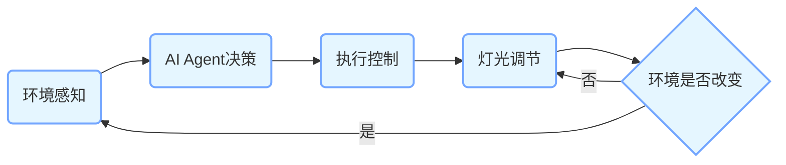

# 智能工作台灯：AI Agent的照明优化与护眼模式

> 关键词：智能工作台灯、AI Agent、照明优化、护眼模式、人工智能

> 摘要：本文围绕智能工作台灯中AI Agent的照明优化与护眼模式展开深入探讨。首先介绍了相关背景知识，包括目的范围、预期读者等。接着详细阐述了核心概念与联系，给出了原理和架构的文本示意图及Mermaid流程图。对核心算法原理和具体操作步骤使用Python代码进行了讲解，同时引入数学模型和公式并举例说明。通过项目实战，展示了代码实际案例并进行详细解释。分析了智能工作台灯在不同场景下的实际应用，推荐了学习、开发相关的工具和资源，最后总结了未来发展趋势与挑战，还提供了常见问题解答和扩展阅读参考资料，旨在为智能工作台灯的研究和应用提供全面的技术指导。

## 1. 背景介绍 
### 1.1 目的和范围
随着科技的不断发展，人们对于生活品质的要求越来越高，照明设备也从传统的功能型向智能化、人性化方向转变。智能工作台灯作为一种新型的照明设备，旨在为用户提供更加舒适、健康、高效的照明环境。本文章的目的是深入研究智能工作台灯中AI Agent的照明优化与护眼模式，详细探讨其技术原理、实现方法以及实际应用场景。范围涵盖了从核心概念的介绍到具体算法的实现，从项目实战到未来发展趋势的分析，为智能工作台灯的开发和应用提供全面的技术参考。

### 1.2 预期读者
本文预期读者包括但不限于智能照明领域的开发者、研究人员，对人工智能在照明领域应用感兴趣的技术爱好者，以及从事相关产品设计和市场推广的专业人士。通过阅读本文，读者可以了解智能工作台灯中AI Agent的工作原理和实现方法，掌握相关的技术知识和开发技巧，为实际工作和研究提供有益的参考。

### 1.3 文档结构概述
本文将按照以下结构进行组织：首先介绍智能工作台灯的背景知识，包括目的范围、预期读者和文档结构概述等；接着阐述核心概念与联系，给出原理和架构的文本示意图及Mermaid流程图；然后详细讲解核心算法原理和具体操作步骤，使用Python代码进行说明；引入数学模型和公式并举例说明；通过项目实战展示代码实际案例并进行详细解释；分析智能工作台灯的实际应用场景；推荐学习、开发相关的工具和资源；最后总结未来发展趋势与挑战，提供常见问题解答和扩展阅读参考资料。

### 1.4 术语表
#### 1.4.1 核心术语定义
- **智能工作台灯**：一种具备智能化功能的工作台灯，能够根据环境条件和用户需求自动调节照明参数。
- **AI Agent**：人工智能代理，是一种能够感知环境、做出决策并采取行动的智能实体，在智能工作台灯中用于实现照明优化和护眼模式。
- **照明优化**：通过对灯光的亮度、色温、颜色等参数进行调整，使照明效果达到最佳状态，满足用户的视觉需求和场景要求。
- **护眼模式**：根据人体视觉生理特点和用眼环境，对灯光进行特殊处理，减少眼睛疲劳和伤害，保护眼睛健康。

#### 1.4.2 相关概念解释
- **环境感知**：智能工作台灯通过各种传感器（如光线传感器、人体传感器等）获取周围环境的信息，包括光照强度、颜色温度、人员活动等。
- **决策模型**：AI Agent根据环境感知信息和预设的规则或算法，对灯光参数进行决策，以实现照明优化和护眼模式。
- **自适应调节**：智能工作台灯能够根据环境变化和用户行为自动调整灯光参数，保持照明效果的稳定性和舒适性。

#### 1.4.3 缩略词列表
- **AI**：Artificial Intelligence，人工智能
- **LED**：Light Emitting Diode，发光二极管

## 2. 核心概念与联系 
### 核心概念原理
智能工作台灯的核心在于AI Agent的应用，它通过环境感知、决策模型和执行控制三个主要环节实现照明优化和护眼模式。

环境感知是整个系统的基础，智能工作台灯配备了多种传感器，如光线传感器用于检测周围环境的光照强度和颜色温度，人体传感器用于检测人员的活动情况。这些传感器将采集到的环境信息实时传输给AI Agent。

决策模型是AI Agent的核心部分，它根据环境感知信息和预设的规则或算法进行分析和决策。例如，当光线传感器检测到环境光照强度较低时，决策模型会根据用户的使用习惯和场景需求，计算出合适的灯光亮度和色温，并将控制指令发送给执行控制模块。

执行控制模块负责根据决策模型发出的指令，对智能工作台灯的灯光参数进行调整。它通过控制LED驱动电路，实现对灯光亮度、色温、颜色等参数的精确调节。

### 架构的文本示意图
```plaintext
智能工作台灯系统架构

|----------------------|
|  环境感知模块        |
|  - 光线传感器        |
|  - 人体传感器        |
|----------------------|
           |
           v
|----------------------|
|  AI Agent决策模块    |
|  - 规则引擎          |
|  - 机器学习模型      |
|----------------------|
           |
           v
|----------------------|
|  执行控制模块        |
|  - LED驱动电路       |
|----------------------|
```

### Mermaid流程图


## 3. 核心算法原理 & 具体操作步骤 
### 核心算法原理
在智能工作台灯的照明优化和护眼模式中，我们可以使用基于规则的算法和机器学习算法相结合的方法。

#### 基于规则的算法
基于规则的算法是根据预设的规则对灯光参数进行调整。例如，当环境光照强度低于某个阈值时，将灯光亮度提高到一定水平；当用户处于阅读状态时，将灯光色温调整到适合阅读的范围。

以下是一个简单的基于规则的算法示例：
```python
# 环境光照强度阈值
LIGHT_INTENSITY_THRESHOLD = 300

# 阅读状态下的色温范围
READING_COLOR_TEMPERATURE_MIN = 4000
READING_COLOR_TEMPERATURE_MAX = 5000

def rule_based_algorithm(light_intensity, user_status):
    if light_intensity < LIGHT_INTENSITY_THRESHOLD:
        # 增加灯光亮度
        brightness = 80  # 假设亮度范围为0-100
    else:
        brightness = 50
    
    if user_status == "reading":
        # 调整色温到阅读范围
        color_temperature = (READING_COLOR_TEMPERATURE_MIN + READING_COLOR_TEMPERATURE_MAX) // 2
    else:
        color_temperature = 3500
    
    return brightness, color_temperature

# 示例调用
light_intensity = 200
user_status = "reading"
brightness, color_temperature = rule_based_algorithm(light_intensity, user_status)
print(f"亮度: {brightness}, 色温: {color_temperature}K")
```

#### 机器学习算法
机器学习算法可以通过对大量数据的学习，自动发现环境因素和灯光参数之间的关系，从而实现更加智能的照明优化。例如，我们可以使用回归分析算法来预测合适的灯光亮度和色温。

以下是一个简单的线性回归模型示例：
```python
import numpy as np
from sklearn.linear_model import LinearRegression

# 生成一些示例数据
X = np.array([[100, 1], [200, 0], [300, 1], [400, 0]])  # 特征：环境光照强度和用户状态（1表示阅读，0表示其他）
y_brightness = np.array([80, 50, 60, 40])  # 目标：灯光亮度
y_color_temperature = np.array([4500, 3500, 4200, 3200])  # 目标：灯光色温

# 训练亮度预测模型
brightness_model = LinearRegression()
brightness_model.fit(X, y_brightness)

# 训练色温预测模型
color_temperature_model = LinearRegression()
color_temperature_model.fit(X, y_color_temperature)

# 示例预测
new_light_intensity = 250
new_user_status = 1
new_features = np.array([[new_light_intensity, new_user_status]])
predicted_brightness = brightness_model.predict(new_features)
predicted_color_temperature = color_temperature_model.predict(new_features)

print(f"预测亮度: {predicted_brightness[0]}, 预测色温: {predicted_color_temperature[0]}K")
```

### 具体操作步骤
1. **数据采集**：使用光线传感器和人体传感器等设备，实时采集环境光照强度、颜色温度和用户活动情况等数据。
2. **数据预处理**：对采集到的数据进行清洗、归一化等处理，以提高数据质量和算法的准确性。
3. **算法选择和训练**：根据实际需求选择合适的算法（如基于规则的算法或机器学习算法），并使用历史数据对算法进行训练。
4. **实时决策和控制**：将实时采集到的数据输入到训练好的算法中，得到合适的灯光参数，并通过执行控制模块对智能工作台灯的灯光进行调整。
5. **反馈和优化**：定期对算法的性能进行评估和优化，根据用户的反馈和实际使用情况调整算法参数，以提高照明优化和护眼模式的效果。

## 4. 数学模型和公式 & 详细讲解 & 举例说明 
### 线性回归模型
线性回归是一种常见的机器学习算法，用于建立自变量和因变量之间的线性关系。在智能工作台灯的照明优化中，我们可以使用线性回归模型来预测灯光亮度和色温。

线性回归模型的一般形式为：
$$y = \beta_0 + \beta_1x_1 + \beta_2x_2 + \cdots + \beta_nx_n + \epsilon$$
其中，$y$ 是因变量（如灯光亮度或色温），$x_1, x_2, \cdots, x_n$ 是自变量（如环境光照强度、用户状态等），$\beta_0, \beta_1, \cdots, \beta_n$ 是模型的系数，$\epsilon$ 是误差项。

### 详细讲解
线性回归的目标是找到一组最优的系数 $\beta_0, \beta_1, \cdots, \beta_n$，使得预测值 $\hat{y}$ 与实际值 $y$ 之间的误差最小。常用的误差度量方法是均方误差（Mean Squared Error，MSE）：
$$MSE = \frac{1}{m}\sum_{i=1}^{m}(y_i - \hat{y}_i)^2$$
其中，$m$ 是样本数量，$y_i$ 是第 $i$ 个样本的实际值，$\hat{y}_i$ 是第 $i$ 个样本的预测值。

为了找到最优的系数，我们可以使用最小二乘法。最小二乘法的原理是通过对均方误差求偏导数，并令偏导数等于零，得到一组方程组，解这个方程组就可以得到最优的系数。

### 举例说明
假设我们有以下数据集：
| 环境光照强度 ($x_1$) | 用户状态 ($x_2$) | 灯光亮度 ($y$) |
|---------------------|------------------|----------------|
| 100                 | 1                | 80             |
| 200                 | 0                | 50             |
| 300                 | 1                | 60             |
| 400                 | 0                | 40             |

我们可以使用线性回归模型来预测灯光亮度。首先，将数据集表示为矩阵形式：
$$X = \begin{bmatrix}
1 & 100 & 1 \\
1 & 200 & 0 \\
1 & 300 & 1 \\
1 & 400 & 0
\end{bmatrix}$$
$$y = \begin{bmatrix}
80 \\
50 \\
60 \\
40
\end{bmatrix}$$

然后，使用最小二乘法求解系数 $\beta$：
$$\beta = (X^TX)^{-1}X^Ty$$

以下是使用Python实现的代码：
```python
import numpy as np

# 定义数据集
X = np.array([[1, 100, 1], [1, 200, 0], [1, 300, 1], [1, 400, 0]])
y = np.array([80, 50, 60, 40])

# 求解系数
beta = np.linalg.inv(X.T @ X) @ X.T @ y

print(f"系数: {beta}")
```

运行上述代码，我们可以得到模型的系数。然后，我们可以使用这些系数来预测新的灯光亮度。例如，当环境光照强度为 250，用户状态为 1 时：
```python
new_x = np.array([1, 250, 1])
predicted_y = new_x @ beta

print(f"预测灯光亮度: {predicted_y}")
```

## 5. 项目实战：代码实际案例和详细解释说明 
### 5.1  开发环境搭建
#### 硬件准备
- 智能工作台灯（支持灯光亮度和色温调节）
- 光线传感器（如BH1750）
- 人体传感器（如HC-SR501）
- 开发板（如Arduino或Raspberry Pi）

#### 软件准备
- Arduino IDE（如果使用Arduino开发板）或Raspberry Pi OS（如果使用Raspberry Pi）
- Python 3.x
- 相关的Python库，如`smbus`（用于与传感器通信）、`pyserial`（用于与开发板通信）

### 5.2  源代码详细实现和代码解读
以下是一个基于Arduino和Python的智能工作台灯项目的示例代码：

#### Arduino代码（用于读取传感器数据并控制灯光）
```cpp
#include <Wire.h>
#include <BH1750.h>

// 定义传感器引脚
const int PIR_PIN = 2;
BH1750 lightMeter;

// 定义LED控制引脚
const int BRIGHTNESS_PIN = 9;
const int COLOR_TEMPERATURE_PIN = 10;

void setup() {
  // 初始化串口通信
  Serial.begin(9600);
  
  // 初始化I2C总线
  Wire.begin();
  
  // 初始化光线传感器
  lightMeter.begin();
  
  // 初始化人体传感器引脚
  pinMode(PIR_PIN, INPUT);
  
  // 初始化LED控制引脚
  pinMode(BRIGHTNESS_PIN, OUTPUT);
  pinMode(COLOR_TEMPERATURE_PIN, OUTPUT);
}

void loop() {
  // 读取光线强度
  uint16_t lightLevel = lightMeter.readLightLevel();
  
  // 读取人体传感器状态
  int pirState = digitalRead(PIR_PIN);
  
  // 发送传感器数据到串口
  Serial.print(lightLevel);
  Serial.print(",");
  Serial.println(pirState);
  
  // 等待Python程序发送控制指令
  if (Serial.available() > 0) {
    String command = Serial.readStringUntil('\n');
    int brightness = command.substring(0, command.indexOf(',')).toInt();
    int colorTemperature = command.substring(command.indexOf(',') + 1).toInt();
    
    // 控制灯光亮度和色温
    analogWrite(BRIGHTNESS_PIN, brightness);
    analogWrite(COLOR_TEMPERATURE_PIN, colorTemperature);
  }
  
  delay(1000);
}
```

#### Python代码（用于处理传感器数据并发送控制指令）
```python
import serial
import time

# 打开串口通信
ser = serial.Serial('/dev/ttyACM0', 9600)

# 环境光照强度阈值
LIGHT_INTENSITY_THRESHOLD = 300

# 阅读状态下的色温范围
READING_COLOR_TEMPERATURE_MIN = 4000
READING_COLOR_TEMPERATURE_MAX = 5000

while True:
    # 读取传感器数据
    if ser.in_waiting > 0:
        data = ser.readline().decode('utf-8').rstrip()
        light_intensity, user_status = map(int, data.split(','))
        
        # 基于规则的算法
        if light_intensity < LIGHT_INTENSITY_THRESHOLD:
            brightness = 200  # 假设PWM范围为0-255
        else:
            brightness = 100
        
        if user_status == 1:
            color_temperature = (READING_COLOR_TEMPERATURE_MIN + READING_COLOR_TEMPERATURE_MAX) // 2
        else:
            color_temperature = 3500
        
        # 发送控制指令到Arduino
        command = f"{brightness},{color_temperature}"
        ser.write(command.encode('utf-8'))
        ser.write(b'\n')
    
    time.sleep(1)
```

### 5.3  代码解读与分析
#### Arduino代码解读
- **初始化部分**：在`setup()`函数中，我们初始化了串口通信、I2C总线、光线传感器、人体传感器和LED控制引脚。
- **循环部分**：在`loop()`函数中，我们读取光线强度和人体传感器状态，并将数据发送到串口。然后等待Python程序发送控制指令，根据指令控制灯光亮度和色温。

#### Python代码解读
- **串口通信**：使用`serial.Serial()`函数打开串口通信。
- **传感器数据读取**：通过`ser.readline()`函数读取Arduino发送的传感器数据，并解析出光线强度和人体传感器状态。
- **基于规则的算法**：根据光线强度和人体传感器状态，使用基于规则的算法计算合适的灯光亮度和色温。
- **控制指令发送**：将计算得到的灯光亮度和色温发送到Arduino。

通过以上代码，我们实现了一个简单的智能工作台灯系统，能够根据环境光照强度和用户活动情况自动调节灯光亮度和色温。

## 6. 实际应用场景 
### 学习场景
在学习场景中，智能工作台灯的照明优化和护眼模式可以为用户提供良好的视觉环境。例如，当用户在阅读书籍时，灯光会自动调整到适合阅读的亮度和色温，减少眼睛疲劳。同时，当环境光照强度发生变化时，灯光也会及时做出调整，保持照明效果的稳定性。

### 工作场景
在工作场景中，智能工作台灯可以根据用户的工作内容和环境条件进行个性化的照明调节。例如，当用户进行精细的手工操作时，灯光会提高亮度和对比度，以便用户更清晰地观察工作对象。当用户长时间工作感到疲劳时，护眼模式可以自动开启，调整灯光参数，缓解眼睛压力。

### 休闲场景
在休闲场景中，智能工作台灯可以营造出舒适的氛围。例如，当用户在晚上休息时，灯光可以调暗并调整到暖色调，帮助用户放松身心，进入睡眠状态。

## 7. 工具和资源推荐
### 7.1 学习资源推荐
#### 7.1.1 书籍推荐
- 《人工智能：一种现代的方法》：全面介绍了人工智能的基本概念、算法和应用，是学习人工智能的经典教材。
- 《Python机器学习》：详细讲解了Python在机器学习中的应用，包括数据处理、模型训练和评估等方面的内容。
- 《智能照明技术与应用》：专注于智能照明领域的技术和应用，涵盖了智能灯具的设计、控制和优化等方面的知识。

#### 7.1.2 在线课程
- Coursera上的“人工智能基础”课程：由知名高校的教授授课，系统地介绍了人工智能的基础知识和算法。
- edX上的“Python数据科学”课程：帮助学习者掌握Python在数据科学领域的应用，包括数据分析、机器学习等方面的技能。
- 中国大学MOOC上的“智能照明系统设计与应用”课程：结合实际案例，讲解智能照明系统的设计和开发方法。

#### 7.1.3 技术博客和网站
- Medium：有许多人工智能和智能照明领域的技术博客，提供了最新的研究成果和实践经验。
- IEEE Xplore：电气和电子工程师协会（IEEE）的数字图书馆，包含了大量的学术论文和技术报告。
- 开源中国：国内知名的开源技术社区，有许多关于智能硬件和人工智能的技术文章和项目分享。

### 7.2 开发工具框架推荐
#### 7.2.1 IDE和编辑器
- PyCharm：专业的Python集成开发环境，提供了丰富的代码编辑、调试和分析功能。
- Arduino IDE：专门用于Arduino开发板的集成开发环境，简单易用，适合初学者。
- Visual Studio Code：轻量级的代码编辑器，支持多种编程语言和插件扩展，可用于智能工作台灯项目的开发。

#### 7.2.2 调试和性能分析工具
- PuTTY：用于串口通信调试的工具，可以方便地查看和发送串口数据。
- Wireshark：网络协议分析工具，可用于分析智能工作台灯与其他设备之间的通信数据。
- TensorBoard：TensorFlow的可视化工具，可用于查看机器学习模型的训练过程和性能指标。

#### 7.2.3 相关框架和库
- TensorFlow：开源的机器学习框架，提供了丰富的工具和算法，可用于开发智能工作台灯的机器学习模型。
- PyTorch：另一个流行的机器学习框架，具有动态计算图和易于使用的特点。
- OpenCV：开源的计算机视觉库，可用于处理智能工作台灯中的图像和视频数据。

### 7.3 相关论文著作推荐
#### 7.3.1 经典论文
- "Artificial Intelligence: A New Synthesis" by Nils J. Nilsson：对人工智能的发展和现状进行了全面的综述，提出了许多重要的理论和方法。
- "A Logical Calculus of the Ideas Immanent in Nervous Activity" by Warren S. McCulloch and Walter Pitts：奠定了神经网络的理论基础，是人工智能领域的经典论文之一。
- "The Use of Knowledge in Society" by Friedrich A. Hayek：探讨了知识在社会中的作用和利用方式，对智能系统的设计和应用具有重要的启示意义。

#### 7.3.2 最新研究成果
- 每年在人工智能和智能照明领域的国际会议（如ACM SIGKDD、IEEE IROS等）上都会发表许多最新的研究成果，这些论文代表了该领域的前沿技术和发展趋势。
- 相关的学术期刊（如Artificial Intelligence、Journal of Intelligent Lighting等）也会刊登一些高质量的研究论文，可供深入学习和参考。

#### 7.3.3 应用案例分析
- 一些知名企业（如飞利浦、小米等）的官方网站会发布智能照明产品的应用案例和技术白皮书，这些案例可以帮助我们了解智能工作台灯在实际应用中的解决方案和效果。
- 一些行业报告和市场研究机构（如艾瑞咨询、Gartner等）也会发布关于智能照明市场和应用的分析报告，对智能工作台灯的发展趋势和市场前景进行深入分析。

## 8. 总结：未来发展趋势与挑战
### 未来发展趋势
#### 智能化程度不断提高
随着人工智能技术的不断发展，智能工作台灯的智能化程度将不断提高。未来的智能工作台灯将能够更加准确地感知环境和用户需求，自动调整灯光参数，实现更加个性化的照明服务。例如，通过结合人脸识别技术，智能工作台灯可以根据用户的身份和习惯，自动设置合适的灯光模式。

#### 与其他智能设备的互联互通
智能工作台灯将与其他智能设备（如智能手机、智能音箱、智能家居系统等）实现更加紧密的互联互通。用户可以通过手机APP或语音指令远程控制智能工作台灯，也可以与其他智能设备进行联动，实现更加智能化的家居场景。例如，当用户打开智能音箱播放音乐时，智能工作台灯可以根据音乐的节奏和氛围自动调整灯光颜色和亮度。

#### 健康照明功能的强化
未来的智能工作台灯将更加注重健康照明功能的强化。除了现有的护眼模式外，还将引入更多的健康照明技术，如模拟自然光、调节生物钟等。例如，智能工作台灯可以根据一天中不同的时间段，模拟自然光的颜色和强度变化，帮助用户调节生物钟，提高睡眠质量。

### 挑战
#### 数据隐私和安全问题
智能工作台灯在运行过程中会收集大量的用户数据，如环境信息、用户行为等。这些数据的隐私和安全问题是需要解决的重要挑战。如果数据被泄露或滥用，可能会给用户带来不必要的风险和损失。因此，需要采取有效的数据加密和安全防护措施，确保用户数据的安全。

#### 技术标准和规范的统一
目前，智能照明行业缺乏统一的技术标准和规范，不同品牌和型号的智能工作台灯之间可能存在兼容性问题。这给用户的使用和市场的发展带来了一定的困扰。因此，需要加强行业标准的制定和推广，促进智能照明产品的互联互通和互操作性。

#### 成本和市场接受度
智能工作台灯的研发和生产成本相对较高，这使得产品的价格也相对较贵。对于一些消费者来说，可能难以接受较高的价格。因此，需要通过技术创新和规模生产，降低智能工作台灯的成本，提高产品的性价比，从而提高市场接受度。

## 9. 附录：常见问题与解答
### 问题1：智能工作台灯的照明优化和护眼模式有什么区别？
照明优化是指通过对灯光的亮度、色温、颜色等参数进行调整，使照明效果达到最佳状态，满足用户的视觉需求和场景要求。而护眼模式是根据人体视觉生理特点和用眼环境，对灯光进行特殊处理，减少眼睛疲劳和伤害，保护眼睛健康。可以说，护眼模式是照明优化的一种特殊应用，更加注重对眼睛的保护。

### 问题2：智能工作台灯的传感器有哪些作用？
智能工作台灯的传感器主要用于感知周围环境的信息，如光照强度、颜色温度、人员活动等。这些信息是AI Agent进行决策的基础，通过对传感器数据的分析和处理，AI Agent可以根据环境变化和用户需求自动调整灯光参数，实现照明优化和护眼模式。

### 问题3：如何选择适合自己的智能工作台灯？
在选择智能工作台灯时，可以考虑以下几个方面：
- **照明效果**：包括灯光的亮度、色温、均匀度等指标，选择能够提供舒适、自然照明效果的产品。
- **功能特点**：如是否具备照明优化、护眼模式、远程控制等功能，根据自己的需求选择合适的产品。
- **品牌和质量**：选择知名品牌和质量可靠的产品，以确保产品的性能和稳定性。
- **价格**：根据自己的预算选择合适价格的产品。

### 问题4：智能工作台灯的使用寿命有多长？
智能工作台灯的使用寿命主要取决于LED灯珠和其他电子元件的质量和使用情况。一般来说，优质的LED灯珠可以使用数万小时以上。同时，合理的使用和维护也可以延长智能工作台灯的使用寿命。例如，避免频繁开关灯、保持灯具清洁等。

## 10. 扩展阅读 & 参考资料
### 扩展阅读
- 《智能家居技术与应用》：全面介绍了智能家居的相关技术和应用，包括智能照明、智能安防、智能家电等方面的内容，有助于进一步了解智能工作台灯在智能家居系统中的地位和作用。
- 《人工智能算法导论》：深入讲解了人工智能的各种算法原理和实现方法，对于理解智能工作台灯中AI Agent的决策模型和算法有很大的帮助。
- 《照明设计手册》：详细介绍了照明设计的原则、方法和技巧，对于智能工作台灯的照明优化和设计具有重要的参考价值。

### 参考资料
- [Philips Lighting Official Website](https://www.philips.com.cn/c-m-li/lighting)：飞利浦照明官方网站，提供了智能照明产品的详细信息和技术资料。
- [IEEE Transactions on Intelligent Transportation Systems](https://ieeexplore.ieee.org/xpl/RecentIssue.jsp?punumber=6979)：电气和电子工程师协会（IEEE）关于智能交通系统的学术期刊，其中也有一些关于智能照明和人工智能应用的研究论文。
- [ACM SIGKDD Conference Proceedings](https://www.kdd.org/kdd2023/)：ACM SIGKDD会议论文集，包含了数据挖掘和知识发现领域的最新研究成果，对于智能工作台灯的数据分析和决策模型的研究有一定的参考价值。

作者：AI天才研究院/AI Genius Institute & 禅与计算机程序设计艺术 /Zen And The Art of Computer Programming