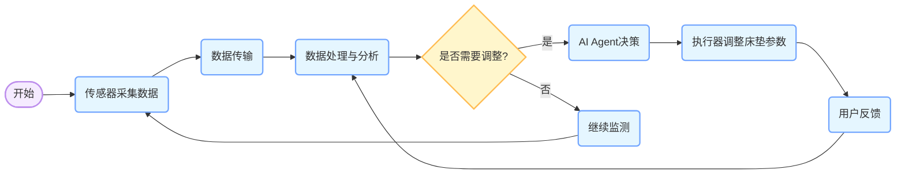

# 智能床垫：AI Agent的睡眠周期优化

> 关键词：智能床垫、AI Agent、睡眠周期优化、传感器技术、机器学习

> 摘要：本文围绕智能床垫中AI Agent对睡眠周期的优化展开深入探讨。首先介绍了智能床垫及睡眠周期优化的背景知识，明确目的、范围和预期读者。接着阐述核心概念与联系，分析AI Agent在智能床垫中的工作原理和架构。详细讲解核心算法原理及操作步骤，并通过Python代码示例进行说明。给出相关数学模型和公式，结合实例加深理解。通过项目实战展示开发环境搭建、代码实现与解读。探讨实际应用场景，推荐学习资源、开发工具框架和相关论文著作。最后总结未来发展趋势与挑战，解答常见问题并提供扩展阅读和参考资料，旨在为智能床垫领域的技术发展和应用提供全面的技术指导和理论支持。

## 1. 背景介绍 
### 1.1 目的和范围
目的在于深入研究如何利用AI Agent技术对智能床垫进行优化，以更好地适应人体睡眠周期，提高睡眠质量。范围涵盖智能床垫的硬件设计、传感器技术、数据采集与处理、AI算法应用以及与用户的交互等多个方面，旨在全面阐述智能床垫实现睡眠周期优化的原理、方法和实际应用。

### 1.2 预期读者
本文预期读者包括智能硬件开发者、人工智能研究者、睡眠健康领域的专业人士、对智能家居感兴趣的技术爱好者以及关注睡眠质量提升的普通消费者。希望通过本文的讲解，能为不同背景的读者提供有价值的信息和技术参考。

### 1.3 文档结构概述
本文首先介绍智能床垫及睡眠周期优化的相关背景知识，包括目的、预期读者和文档结构等。接着阐述核心概念与联系，通过文本示意图和Mermaid流程图展示AI Agent在智能床垫中的工作原理和架构。详细讲解核心算法原理及操作步骤，并给出Python代码示例。介绍相关数学模型和公式，结合实例进行说明。通过项目实战展示开发环境搭建、代码实现与解读。探讨智能床垫在实际生活中的应用场景。推荐学习智能床垫和AI Agent技术的相关资源、开发工具框架以及论文著作。最后总结未来发展趋势与挑战，解答常见问题并提供扩展阅读和参考资料。

### 1.4 术语表
#### 1.4.1 核心术语定义
- **智能床垫**：集成了多种传感器和智能控制系统的床垫，能够实时监测人体睡眠状态和环境信息，并根据这些信息进行相应的调整和优化。
- **AI Agent**：人工智能代理，是一种能够感知环境、自主决策并采取行动以实现特定目标的智能实体。在智能床垫中，AI Agent可以根据传感器采集的数据，分析用户的睡眠状态，调整床垫的各项参数，以优化睡眠周期。
- **睡眠周期**：人体睡眠过程中经历的不同阶段，包括浅睡眠、深睡眠和快速眼动睡眠（REM）等阶段，每个周期大约持续90 - 120分钟。

#### 1.4.2 相关概念解释
- **传感器技术**：用于采集人体睡眠状态和环境信息的技术，常见的传感器包括压力传感器、温度传感器、湿度传感器等。
- **机器学习**：人工智能的一个分支，通过让计算机从数据中学习模式和规律，从而实现预测和决策。在智能床垫中，机器学习算法可以用于分析传感器采集的数据，识别用户的睡眠状态和模式。
- **数据分析**：对采集到的数据进行清洗、处理和分析的过程，以提取有价值的信息和知识。在智能床垫中，数据分析可以帮助AI Agent了解用户的睡眠习惯和需求，从而进行个性化的睡眠周期优化。

#### 1.4.3 缩略词列表
- **REM**：Rapid Eye Movement，快速眼动睡眠
- **AI**：Artificial Intelligence，人工智能
- **ML**：Machine Learning，机器学习

## 2. 核心概念与联系 
### 核心概念原理
智能床垫的睡眠周期优化主要基于AI Agent的感知、决策和执行能力。智能床垫通过各种传感器实时采集人体睡眠状态和环境信息，如压力分布、心率、呼吸频率、体动、温度、湿度等。AI Agent对这些数据进行分析和处理，利用机器学习算法识别用户的睡眠阶段和模式，判断用户的睡眠质量和需求。根据分析结果，AI Agent做出决策，调整床垫的各项参数，如硬度、倾斜度、温度、湿度等，以提供更舒适的睡眠环境，优化睡眠周期。

### 架构的文本示意图
智能床垫的整体架构可以分为以下几个部分：
1. **传感器层**：负责采集人体睡眠状态和环境信息，包括压力传感器、温度传感器、湿度传感器、心率传感器、呼吸传感器等。
2. **数据传输层**：将传感器采集到的数据传输到数据处理中心，可以采用有线或无线传输方式，如蓝牙、Wi-Fi、ZigBee等。
3. **数据处理中心**：对采集到的数据进行清洗、处理和分析，利用机器学习算法识别用户的睡眠阶段和模式，判断睡眠质量和需求。
4. **AI Agent决策层**：根据数据处理中心的分析结果，做出决策，生成控制指令。
5. **执行器层**：根据AI Agent的控制指令，调整床垫的各项参数，如硬度调节装置、倾斜度调节装置、温度调节装置、湿度调节装置等。
6. **用户交互层**：提供用户与智能床垫之间的交互界面，用户可以通过手机APP、遥控器等方式设置睡眠偏好、查看睡眠报告等。

### Mermaid流程图


## 3. 核心算法原理 & 具体操作步骤 
### 核心算法原理
智能床垫的睡眠周期优化主要涉及到机器学习算法，如决策树、支持向量机、神经网络等。以神经网络为例，其基本原理是通过构建多层神经元网络，模拟人类大脑的学习和决策过程。神经网络可以自动从大量的睡眠数据中学习到睡眠阶段和模式的特征，从而实现对睡眠状态的准确识别。

### 具体操作步骤
1. **数据采集**：使用传感器采集人体睡眠状态和环境信息，如压力分布、心率、呼吸频率、体动、温度、湿度等。
2. **数据预处理**：对采集到的数据进行清洗、归一化等处理，去除噪声和异常值，将数据转换为适合机器学习算法处理的格式。
3. **特征提取**：从预处理后的数据中提取有代表性的特征，如心率的平均值、标准差，体动的频率等。
4. **模型训练**：使用训练数据集对神经网络模型进行训练，调整模型的参数，使其能够准确地识别睡眠阶段和模式。
5. **模型评估**：使用测试数据集对训练好的模型进行评估，计算模型的准确率、召回率等指标，评估模型的性能。
6. **实时预测**：将训练好的模型部署到智能床垫的数据处理中心，实时对传感器采集到的数据进行预测，识别用户的睡眠状态。
7. **决策与控制**：根据实时预测结果，AI Agent做出决策，生成控制指令，调整床垫的各项参数，以优化睡眠周期。

### Python源代码示例
```python
import numpy as np
import pandas as pd
from sklearn.model_selection import train_test_split
from sklearn.neural_network import MLPClassifier
from sklearn.preprocessing import StandardScaler
from sklearn.metrics import accuracy_score

# 假设我们有一个包含睡眠数据的CSV文件
data = pd.read_csv('sleep_data.csv')

# 提取特征和标签
X = data.drop('sleep_stage', axis=1)
y = data['sleep_stage']

# 数据预处理：归一化
scaler = StandardScaler()
X_scaled = scaler.fit_transform(X)

# 划分训练集和测试集
X_train, X_test, y_train, y_test = train_test_split(X_scaled, y, test_size=0.2, random_state=42)

# 创建神经网络模型
model = MLPClassifier(hidden_layer_sizes=(100, 50), activation='relu', solver='adam', random_state=42)

# 模型训练
model.fit(X_train, y_train)

# 模型预测
y_pred = model.predict(X_test)

# 模型评估
accuracy = accuracy_score(y_test, y_pred)
print(f"模型准确率: {accuracy}")

# 实时预测示例
new_data = np.array([[1.2, 2.3, 3.4, 4.5, 5.6]])  # 假设这是新的传感器数据
new_data_scaled = scaler.transform(new_data)
predicted_stage = model.predict(new_data_scaled)
print(f"预测的睡眠阶段: {predicted_stage}")
```

## 4. 数学模型和公式 & 详细讲解 & 举例说明 
### 神经网络的数学模型
神经网络由输入层、隐藏层和输出层组成。对于一个简单的多层感知器（MLP），第 $l$ 层的第 $j$ 个神经元的输出 $a_j^{(l)}$ 可以通过以下公式计算：

$$
a_j^{(l)} = f\left(\sum_{i=0}^{n_{l-1}} w_{ji}^{(l)} a_i^{(l-1)} + b_j^{(l)}\right)
$$

其中，$n_{l-1}$ 是第 $l-1$ 层的神经元数量，$w_{ji}^{(l)}$ 是第 $l$ 层的第 $j$ 个神经元与第 $l-1$ 层的第 $i$ 个神经元之间的权重，$b_j^{(l)}$ 是第 $l$ 层的第 $j$ 个神经元的偏置，$f$ 是激活函数，常见的激活函数有 sigmoid 函数、ReLU 函数等。

### 损失函数
在神经网络的训练过程中，需要定义一个损失函数来衡量模型的预测结果与真实标签之间的差异。常用的损失函数有交叉熵损失函数，对于多分类问题，交叉熵损失函数的公式如下：

$$
L(y, \hat{y}) = -\frac{1}{N} \sum_{i=1}^{N} \sum_{k=1}^{K} y_{ik} \log(\hat{y}_{ik})
$$

其中，$N$ 是样本数量，$K$ 是类别数量，$y_{ik}$ 是第 $i$ 个样本的真实标签的第 $k$ 个分量，$\hat{y}_{ik}$ 是第 $i$ 个样本的预测标签的第 $k$ 个分量。

### 梯度下降算法
为了最小化损失函数，需要使用梯度下降算法来更新模型的权重和偏置。梯度下降算法的更新公式如下：

$$
w_{ji}^{(l)} = w_{ji}^{(l)} - \eta \frac{\partial L}{\partial w_{ji}^{(l)}}
$$

$$
b_j^{(l)} = b_j^{(l)} - \eta \frac{\partial L}{\partial b_j^{(l)}}
$$

其中，$\eta$ 是学习率，控制每次更新的步长。

### 举例说明
假设我们有一个简单的神经网络，包含一个输入层（2个神经元）、一个隐藏层（3个神经元）和一个输出层（2个神经元）。输入数据为 $x = [x_1, x_2]$，隐藏层的权重矩阵为 $W^{(1)} \in \mathbb{R}^{3 \times 2}$，偏置向量为 $b^{(1)} \in \mathbb{R}^{3}$，输出层的权重矩阵为 $W^{(2)} \in \mathbb{R}^{2 \times 3}$，偏置向量为 $b^{(2)} \in \mathbb{R}^{2}$。激活函数使用 ReLU 函数：

$$
f(x) = \max(0, x)
$$

首先，计算隐藏层的输入：

$$
z^{(1)} = W^{(1)} x + b^{(1)}
$$

然后，计算隐藏层的输出：

$$
a^{(1)} = f(z^{(1)})
$$

接着，计算输出层的输入：

$$
z^{(2)} = W^{(2)} a^{(1)} + b^{(2)}
$$

最后，计算输出层的输出：

$$
\hat{y} = f(z^{(2)})
$$

假设真实标签为 $y$，则可以计算交叉熵损失函数 $L(y, \hat{y})$，并使用梯度下降算法更新权重和偏置。

## 5. 项目实战：代码实际案例和详细解释说明 
### 5.1  开发环境搭建
#### 硬件环境
- **智能床垫**：选择一款支持传感器数据采集和参数调节的智能床垫，确保床垫具备压力传感器、温度传感器、湿度传感器等必要的传感器。
- **开发板**：如 Raspberry Pi、Arduino 等，用于数据采集和处理。
- **传感器模块**：根据智能床垫的需求，选择合适的压力传感器、温度传感器、湿度传感器、心率传感器、呼吸传感器等。
- **执行器模块**：如硬度调节装置、倾斜度调节装置、温度调节装置、湿度调节装置等。

#### 软件环境
- **操作系统**：选择适合开发板的操作系统，如 Raspbian、Arduino IDE 等。
- **编程语言**：Python，用于编写数据处理、机器学习和控制逻辑的代码。
- **开发工具**：PyCharm、Jupyter Notebook 等，用于编写和调试 Python 代码。
- **机器学习库**：Scikit-learn、TensorFlow、Keras 等，用于构建和训练机器学习模型。

### 5.2  源代码详细实现和代码解读
#### 数据采集代码
```python
import time
import board
import busio
import adafruit_bme280

# 初始化I2C总线和BME280传感器
i2c = busio.I2C(board.SCL, board.SDA)
bme280 = adafruit_bme280.Adafruit_BME280_I2C(i2c)

while True:
    temperature = bme280.temperature
    humidity = bme280.humidity
    pressure = bme280.pressure
    
    print(f"温度: {temperature} °C")
    print(f"湿度: {humidity} %")
    print(f"气压: {pressure} hPa")
    
    time.sleep(1)
```
**代码解读**：这段代码使用 Python 语言和 Adafruit BME280 传感器库，通过 I2C 总线读取 BME280 传感器的温度、湿度和气压数据，并每秒打印一次数据。

#### 数据处理和机器学习代码
```python
import pandas as pd
from sklearn.model_selection import train_test_split
from sklearn.neural_network import MLPClassifier
from sklearn.preprocessing import StandardScaler
from sklearn.metrics import accuracy_score

# 假设我们有一个包含睡眠数据的CSV文件
data = pd.read_csv('sleep_data.csv')

# 提取特征和标签
X = data.drop('sleep_stage', axis=1)
y = data['sleep_stage']

# 数据预处理：归一化
scaler = StandardScaler()
X_scaled = scaler.fit_transform(X)

# 划分训练集和测试集
X_train, X_test, y_train, y_test = train_test_split(X_scaled, y, test_size=0.2, random_state=42)

# 创建神经网络模型
model = MLPClassifier(hidden_layer_sizes=(100, 50), activation='relu', solver='adam', random_state=42)

# 模型训练
model.fit(X_train, y_train)

# 模型预测
y_pred = model.predict(X_test)

# 模型评估
accuracy = accuracy_score(y_test, y_pred)
print(f"模型准确率: {accuracy}")
```
**代码解读**：这段代码使用 Python 语言和 Scikit-learn 机器学习库，对睡眠数据进行预处理、划分训练集和测试集、构建神经网络模型、训练模型、预测和评估模型。

#### 控制逻辑代码
```python
import RPi.GPIO as GPIO
import time

# 设置GPIO模式
GPIO.setmode(GPIO.BCM)

# 定义控制引脚
control_pin = 18

# 设置控制引脚为输出模式
GPIO.setup(control_pin, GPIO.OUT)

# 模拟根据睡眠状态控制床垫参数
def control_mattress(sleep_stage):
    if sleep_stage == 0:  # 浅睡眠
        GPIO.output(control_pin, GPIO.HIGH)
        print("床垫硬度调软")
    elif sleep_stage == 1:  # 深睡眠
        GPIO.output(control_pin, GPIO.LOW)
        print("床垫硬度调硬")

# 模拟实时预测和控制
while True:
    # 假设这里进行实时预测，得到睡眠阶段
    predicted_stage = 0  # 模拟预测结果
    
    control_mattress(predicted_stage)
    
    time.sleep(5)
```
**代码解读**：这段代码使用 Python 语言和 Raspberry Pi 的 GPIO 库，根据睡眠状态控制床垫的硬度调节装置。通过模拟实时预测结果，调用 `control_mattress` 函数来控制床垫的硬度。

### 5.3  代码解读与分析
- **数据采集代码**：通过传感器读取环境数据，为后续的数据分析和处理提供基础。使用循环不断采集数据，确保数据的实时性。
- **数据处理和机器学习代码**：对采集到的数据进行预处理，包括归一化处理，以提高模型的训练效果。使用神经网络模型进行睡眠阶段的分类预测，并评估模型的准确率。
- **控制逻辑代码**：根据预测的睡眠阶段，控制床垫的执行器，实现对床垫参数的调整。通过循环不断进行实时预测和控制，确保床垫能够根据用户的睡眠状态实时调整。

## 6. 实际应用场景 
### 家庭睡眠监测与优化
智能床垫可以安装在家庭卧室中，实时监测用户的睡眠状态和环境信息。通过AI Agent的分析和决策，调整床垫的硬度、温度、湿度等参数，为用户提供个性化的睡眠体验，提高睡眠质量。同时，用户可以通过手机APP查看睡眠报告，了解自己的睡眠习惯和健康状况。

### 酒店住宿体验提升
酒店可以为客人提供智能床垫，根据客人的睡眠偏好和习惯，自动调整床垫的参数，为客人提供更加舒适的睡眠环境。客人还可以通过客房内的控制面板或手机APP自主设置床垫的参数，满足个性化的需求。此外，酒店管理人员可以通过后台系统查看客人的睡眠数据，了解客人的满意度，为酒店的服务优化提供依据。

### 医疗康复护理
在医疗康复领域，智能床垫可以用于监测患者的睡眠状态和身体状况。例如，对于患有睡眠呼吸暂停综合征的患者，智能床垫可以实时监测患者的呼吸频率和心率，当检测到异常情况时，及时发出警报，提醒医护人员进行处理。同时，智能床垫还可以根据患者的康复需求，调整床垫的倾斜度和硬度，帮助患者缓解疼痛，促进康复。

### 科研实验研究
智能床垫可以为睡眠科学研究提供大量的实验数据。科研人员可以通过智能床垫采集不同人群的睡眠数据，分析睡眠周期、睡眠质量与各种因素之间的关系，为睡眠科学的研究提供有力的支持。此外，智能床垫还可以用于药物疗效评估、睡眠障碍治疗等方面的研究。

## 7. 工具和资源推荐
### 7.1 学习资源推荐
#### 7.1.1 书籍推荐
- 《Python机器学习》：本书详细介绍了Python在机器学习领域的应用，包括数据预处理、模型选择、算法实现等方面的内容，适合初学者入门。
- 《深度学习》：由深度学习领域的三位顶尖专家 Ian Goodfellow、Yoshua Bengio 和 Aaron Courville 撰写，全面介绍了深度学习的理论和实践，是深度学习领域的经典著作。
- 《睡眠医学原理与实践》：本书涵盖了睡眠医学的各个方面，包括睡眠生理学、睡眠障碍的诊断和治疗等内容，为睡眠科学研究提供了坚实的理论基础。

#### 7.1.2 在线课程
- Coursera 上的《机器学习》课程：由斯坦福大学教授 Andrew Ng 授课，是机器学习领域的经典课程，通过视频讲解、作业和考试等方式，帮助学员系统地学习机器学习的基本概念和算法。
- edX 上的《深度学习》课程：由加州大学伯克利分校教授 Pieter Abbeel 授课，深入介绍了深度学习的理论和实践，包括神经网络、卷积神经网络、循环神经网络等内容。
- 中国大学MOOC上的《睡眠医学》课程：由国内知名睡眠医学专家授课，介绍了睡眠医学的基础知识、睡眠障碍的诊断和治疗方法等内容，适合医学专业学生和睡眠健康领域的从业人员学习。

#### 7.1.3 技术博客和网站
- Medium：一个技术博客平台，上面有很多关于人工智能、机器学习、智能硬件等领域的文章，作者来自世界各地的技术专家和爱好者，可以从中获取最新的技术动态和实践经验。
- GitHub：全球最大的开源代码托管平台，上面有很多关于智能床垫、AI Agent等相关的开源项目，可以学习他人的代码实现和项目架构。
- 睡眠研究网：专注于睡眠科学研究的网站，提供睡眠医学的最新研究成果、学术会议信息、专家讲座视频等内容，是睡眠科学研究领域的重要资源平台。

### 7.2 开发工具框架推荐
#### 7.2.1 IDE和编辑器
- PyCharm：一款专门为Python开发设计的集成开发环境，提供代码编辑、调试、版本控制等功能，支持多种Python库和框架，是Python开发的首选工具。
- Jupyter Notebook：一个基于Web的交互式开发环境，支持多种编程语言，适合数据探索、模型训练和可视化等工作。可以方便地将代码、文本、图表等内容整合在一起，形成交互式的文档。
- Visual Studio Code：一款轻量级的代码编辑器，支持多种编程语言和插件扩展，具有丰富的代码编辑和调试功能，是很多开发者喜欢使用的工具之一。

#### 7.2.2 调试和性能分析工具
- PySnooper：一个简单易用的Python调试工具，可以自动记录函数的输入输出和局部变量的值，帮助开发者快速定位代码中的问题。
- cProfile：Python自带的性能分析工具，可以分析代码的运行时间和函数调用次数，帮助开发者找出代码中的性能瓶颈。
- TensorBoard：TensorFlow提供的可视化工具，可以用于可视化模型的训练过程、网络结构、损失函数等信息，帮助开发者更好地理解和优化模型。

#### 7.2.3 相关框架和库
- Scikit-learn：一个简单易用的Python机器学习库，提供了各种机器学习算法和工具，包括分类、回归、聚类、降维等算法，适合初学者和快速开发。
- TensorFlow：一个开源的深度学习框架，由Google开发，提供了丰富的深度学习模型和工具，支持分布式训练和部署，广泛应用于图像识别、自然语言处理等领域。
- Keras：一个高级神经网络API，基于TensorFlow、Theano等后端，提供了简单易用的接口，适合快速搭建和训练神经网络模型。

### 7.3 相关论文著作推荐
#### 7.3.1 经典论文
- 《Learning Representations by Back-propagating Errors》：由 David E. Rumelhart、Geoffrey E. Hinton 和 Ronald J. Williams 撰写，首次提出了反向传播算法，为神经网络的训练提供了有效的方法，是神经网络领域的经典论文。
- 《Gradient-based learning applied to document recognition》：由 Yann LeCun、Leon Bottou、Yoshua Bengio 和 Patrick Haffner 撰写，介绍了卷积神经网络（CNN）在手写数字识别中的应用，推动了深度学习在计算机视觉领域的发展。
- 《Long Short-Term Memory》：由 Sepp Hochreiter 和 Jürgen Schmidhuber 撰写，提出了长短期记忆网络（LSTM），解决了传统循环神经网络（RNN）中的梯度消失和梯度爆炸问题，在自然语言处理等领域取得了广泛的应用。

#### 7.3.2 最新研究成果
- 《Sleep staging using deep convolutional neural networks on raw single-channel EEG》：该论文提出了一种基于深度卷积神经网络的睡眠分期方法，直接对原始单通道脑电图（EEG）信号进行处理，取得了较好的睡眠分期效果。
- 《A smart mattress system for sleep monitoring and analysis》：介绍了一种智能床垫系统，通过多种传感器采集睡眠数据，并利用机器学习算法进行睡眠监测和分析，为睡眠质量评估提供了新的方法。
- 《Personalized sleep environment optimization based on machine learning and smart home technology》：探讨了如何利用机器学习和智能家居技术实现个性化的睡眠环境优化，提高睡眠质量。

#### 7.3.3 应用案例分析
- 《Application of smart mattress technology in elderly care institutions》：分析了智能床垫技术在养老机构中的应用案例，介绍了智能床垫如何帮助养老机构监测老年人的睡眠状态和健康状况，提高养老服务质量。
- 《Smart mattress in hotel industry: A case study》：通过一个酒店的实际应用案例，展示了智能床垫如何提升酒店的住宿体验，增加客人的满意度和忠诚度。
- 《Clinical application of smart mattress in sleep disorder diagnosis and treatment》：介绍了智能床垫在睡眠障碍诊断和治疗中的临床应用案例，为睡眠障碍的治疗提供了新的思路和方法。

## 8. 总结：未来发展趋势与挑战
### 未来发展趋势
#### 个性化定制
未来的智能床垫将更加注重个性化定制，根据用户的身体特征、睡眠习惯和健康状况，提供更加个性化的睡眠解决方案。例如，通过分析用户的基因数据、运动数据等，为用户量身定制床垫的硬度、弹性、温度等参数，实现真正意义上的个性化睡眠体验。

#### 多模态融合
智能床垫将融合更多的传感器技术和数据来源，实现多模态数据的融合分析。除了现有的压力、温度、湿度等传感器外，还将集成生物电传感器、光学传感器等，采集更多的生理和环境信息。通过多模态数据的融合分析，可以更全面、准确地了解用户的睡眠状态和需求，提供更加精准的睡眠优化方案。

#### 与智能家居系统的深度融合
智能床垫将与智能家居系统实现深度融合，成为智能家居生态系统的重要组成部分。通过与智能灯光、智能窗帘、智能空调等设备的联动，根据用户的睡眠状态自动调整家居环境，创造更加舒适、安全的睡眠空间。例如，当智能床垫检测到用户进入睡眠状态时，自动调暗灯光、关闭窗帘、调节空调温度，为用户营造一个安静、舒适的睡眠环境。

#### 健康管理与医疗应用拓展
智能床垫在健康管理和医疗应用方面将有更广阔的发展空间。除了睡眠监测和睡眠周期优化外，还可以用于疾病的早期筛查和健康状况的长期跟踪。例如，通过监测用户的心率、呼吸频率、体动等生理指标，及时发现潜在的健康问题，并提供相应的健康建议和预警。此外，智能床垫还可以与医疗机构的信息系统连接，为医生提供更全面的患者睡眠数据，辅助疾病的诊断和治疗。

### 挑战
#### 数据隐私和安全问题
智能床垫采集的大量用户睡眠数据涉及到用户的个人隐私和健康信息，数据的隐私和安全问题至关重要。如何确保数据的安全存储和传输，防止数据泄露和滥用，是智能床垫发展面临的重要挑战。需要采用先进的加密技术、访问控制技术和数据脱敏技术，保障用户数据的隐私和安全。

#### 算法准确性和可靠性
智能床垫的睡眠周期优化依赖于机器学习算法的准确性和可靠性。由于睡眠状态的复杂性和个体差异，如何提高算法的准确性和泛化能力，是智能床垫技术发展的关键。需要大量的实验数据和深入的研究，不断优化算法模型，提高算法的性能和可靠性。

#### 硬件成本和可靠性
智能床垫集成了多种传感器和执行器，硬件成本较高，这在一定程度上限制了智能床垫的普及。此外，硬件的可靠性也是一个重要问题，如何确保传感器和执行器的长期稳定运行，减少故障和维修成本，是智能床垫制造商需要解决的难题。需要不断改进硬件设计和制造工艺，提高硬件的质量和可靠性。

#### 用户接受度和使用习惯
智能床垫作为一种新兴的产品，用户对其功能和使用方法的了解还不够深入，用户接受度有待提高。此外，用户的使用习惯也需要一定的时间来培养。如何通过有效的市场推广和用户教育，提高用户对智能床垫的认知度和接受度，引导用户养成良好的使用习惯，是智能床垫市场拓展面临的挑战。

## 9. 附录：常见问题与解答
### 智能床垫的传感器数据准确吗？
智能床垫的传感器数据准确性受到多种因素的影响，如传感器的质量、安装位置、环境干扰等。一般来说，优质的传感器和合理的安装方式可以保证数据的准确性。此外，智能床垫通常会采用数据融合和滤波等技术，对采集到的数据进行处理和优化，提高数据的可靠性。

### 智能床垫的AI Agent是如何学习和优化的？
智能床垫的AI Agent通过机器学习算法进行学习和优化。在训练阶段，AI Agent会使用大量的睡眠数据进行模型训练，调整模型的参数，使其能够准确地识别睡眠阶段和模式。在实际应用中，AI Agent会根据实时采集到的数据进行预测和决策，并根据用户的反馈和实际效果对模型进行更新和优化。

### 智能床垫可以治疗睡眠障碍吗？
智能床垫不能直接治疗睡眠障碍，但可以通过监测睡眠状态和优化睡眠环境，帮助改善睡眠质量，缓解睡眠障碍的症状。例如，智能床垫可以根据用户的睡眠阶段调整床垫的硬度和温度，提供更舒适的睡眠环境，促进用户进入深度睡眠。对于严重的睡眠障碍，建议及时就医，接受专业的治疗。

### 智能床垫的使用寿命有多长？
智能床垫的使用寿命受到多种因素的影响，如床垫的材质、使用频率、维护保养等。一般来说，优质的智能床垫可以使用5 - 10年左右。为了延长智能床垫的使用寿命，建议定期清洁和维护床垫，避免过度使用和暴力损坏。

### 智能床垫的价格贵吗？
智能床垫的价格因品牌、功能、材质等因素而异。一般来说，智能床垫的价格比普通床垫要高一些，但随着技术的不断发展和市场的竞争，智能床垫的价格也在逐渐下降。消费者可以根据自己的需求和预算选择适合自己的智能床垫。

## 10. 扩展阅读 & 参考资料
### 扩展阅读
- 《智能家居技术与应用》：本书全面介绍了智能家居的相关技术和应用，包括智能家电、智能安防、智能照明等方面的内容，对于了解智能床垫在智能家居生态系统中的应用具有重要的参考价值。
- 《睡眠的科学》：深入探讨了睡眠的生理机制、睡眠与健康的关系、睡眠障碍的成因和治疗等方面的内容，为智能床垫的睡眠监测和优化提供了理论基础。
- 《人工智能：现代方法》：一本经典的人工智能教材，介绍了人工智能的基本概念、算法和应用，对于理解智能床垫中AI Agent的工作原理和实现方法具有重要的帮助。

### 参考资料
- [1] Goodfellow, I., Bengio, Y., & Courville, A. (2016). Deep Learning. MIT Press.
- [2] LeCun, Y., Bottou, L., Bengio, Y., & Haffner, P. (1998). Gradient-based learning applied to document recognition. Proceedings of the IEEE, 86(11), 2278-2324.
- [3] Hochreiter, S., & Schmidhuber, J. (1997). Long short-term memory. Neural computation, 9(8), 1735-1780.
- [4] Rumelhart, D. E., Hinton, G. E., & Williams, R. J. (1986). Learning representations by back-propagating errors. Nature, 323(6088), 533-536.

作者：AI天才研究院/AI Genius Institute & 禅与计算机程序设计艺术 /Zen And The Art of Computer Programming