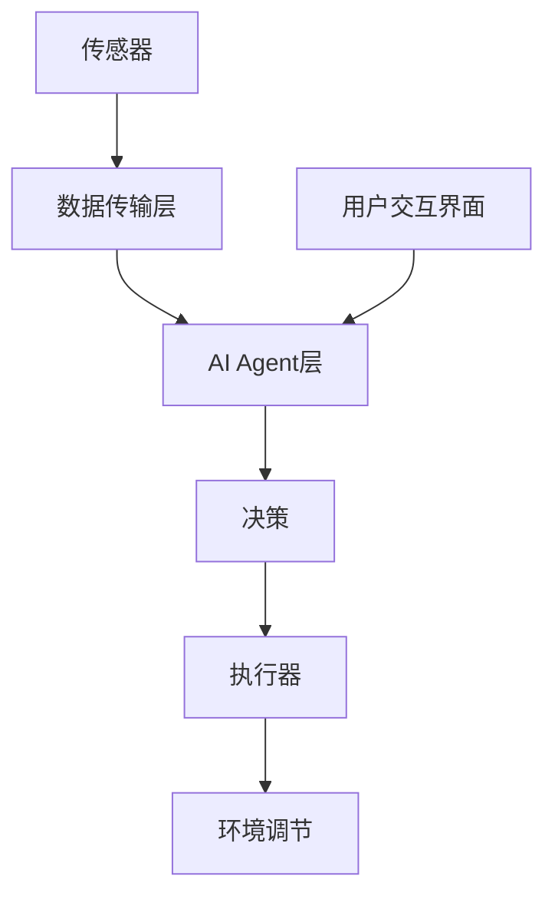

# 智能床头柜：AI Agent的睡眠环境优化

> 关键词：智能床头柜、AI Agent、睡眠环境优化、传感器、智能家居

> 摘要：本文聚焦于智能床头柜借助AI Agent实现睡眠环境优化这一前沿课题。详细介绍了智能床头柜的背景，包括其目的、预期读者和文档结构等。深入剖析了核心概念与联系，阐述了AI Agent的原理和架构，以流程图呈现其工作流程。通过Python代码阐述核心算法原理和具体操作步骤，借助数学模型和公式进行理论支持。结合项目实战，给出代码实际案例并详细解释。探讨了智能床头柜在不同场景下的实际应用，推荐了相关学习资源、开发工具框架和论文著作。最后总结了其未来发展趋势与挑战，解答常见问题并提供扩展阅读和参考资料，旨在为读者全面呈现智能床头柜借助AI Agent优化睡眠环境的技术全貌。

## 1. 背景介绍 
### 1.1 目的和范围
睡眠是人类生活中至关重要的一部分，良好的睡眠质量对于身体健康和日常工作学习效率有着深远的影响。然而，现代社会中，各种因素如噪音、光线、温度、湿度等都会干扰人们的睡眠。智能床头柜作为智能家居的一部分，旨在通过集成多种传感器和执行器，并结合AI Agent技术，实时感知睡眠环境的各项参数，自动调节环境因素，为用户创造一个舒适、安静、适宜的睡眠环境。

本文章的范围涵盖智能床头柜的核心概念、AI Agent的工作原理、相关算法实现、数学模型、实际项目案例以及应用场景等方面，全面深入地探讨智能床头柜如何借助AI Agent实现睡眠环境的优化。

### 1.2 预期读者
本文预期读者包括智能家居爱好者、AI技术开发者、电子工程师、计算机科学专业的学生以及对改善睡眠质量感兴趣的普通消费者。对于智能家居爱好者，本文可以让他们更深入地了解智能床头柜的技术原理和优势；AI技术开发者可以从中获取关于AI Agent在实际应用中的算法实现和优化思路；电子工程师能够学习到智能床头柜的硬件集成和传感器应用知识；计算机科学专业的学生可以将其作为一个综合性的项目案例进行学习和研究；普通消费者则可以通过本文了解智能床头柜如何为他们的睡眠带来改善。

### 1.3 文档结构概述
本文将按照以下结构进行阐述：首先介绍智能床头柜的背景信息，包括目的、预期读者和文档结构概述等；接着深入探讨核心概念与联系，包括AI Agent的原理和架构；然后详细讲解核心算法原理和具体操作步骤，并通过Python代码进行实现；之后介绍相关的数学模型和公式，并举例说明；再结合实际项目案例，展示代码的实现和详细解释；随后探讨智能床头柜的实际应用场景；推荐相关的工具和资源；总结未来发展趋势与挑战；最后在附录中解答常见问题并提供扩展阅读和参考资料。

### 1.4 术语表
#### 1.4.1 核心术语定义
- **智能床头柜**：集成了多种传感器和执行器，能够通过网络与其他设备进行通信，借助AI技术实现自动化控制和环境调节的床头柜。
- **AI Agent**：人工智能代理，是一种能够感知环境、进行决策并采取行动的智能实体。在智能床头柜中，AI Agent通过分析传感器数据，做出调节环境的决策。
- **传感器**：用于感知环境参数的设备，如温度传感器、湿度传感器、光线传感器、噪音传感器等。
- **执行器**：根据AI Agent的决策执行相应动作的设备，如调节灯光亮度的调光器、控制风扇转速的调速器、调节窗帘开合的电机等。

#### 1.4.2 相关概念解释
- **智能家居**：利用先进的计算机技术、网络通信技术、综合布线技术，将与家居生活有关的各种子系统有机地结合在一起，通过统筹管理，让家居生活更加舒适、安全、有效。智能床头柜是智能家居系统的一个组成部分。
- **机器学习**：一门多领域交叉学科，涉及概率论、统计学、逼近论、凸分析、算法复杂度理论等多门学科。它专门研究计算机怎样模拟或实现人类的学习行为，以获取新的知识或技能，重新组织已有的知识结构使之不断改善自身的性能。在智能床头柜中，机器学习算法可用于分析传感器数据，预测用户的睡眠习惯和需求。

#### 1.4.3 缩略词列表
- **AI**：Artificial Intelligence，人工智能
- **IoT**：Internet of Things，物联网

## 2. 核心概念与联系 
智能床头柜借助AI Agent实现睡眠环境优化的核心在于传感器、AI Agent和执行器之间的协同工作。传感器负责实时采集睡眠环境的各项参数，如温度、湿度、光线、噪音等，并将这些数据传输给AI Agent。AI Agent对这些数据进行分析和处理，根据预设的规则或通过机器学习算法学习到的用户睡眠习惯，做出相应的决策。执行器则根据AI Agent的决策，对睡眠环境进行调节，如调节灯光亮度、控制风扇转速、调节窗帘开合等。

以下是其原理和架构的文本示意图：

智能床头柜系统主要由硬件层、数据传输层、AI Agent层和应用层组成。硬件层包括各种传感器和执行器，负责数据采集和环境调节。数据传输层将传感器采集到的数据传输到AI Agent层，通常采用无线通信技术，如Wi-Fi、蓝牙等。AI Agent层是系统的核心，负责对数据进行分析和处理，做出决策。应用层则为用户提供交互界面，用户可以通过手机APP或其他终端设备对智能床头柜进行控制和设置。

下面是Mermaid流程图：


## 3. 核心算法原理 & 具体操作步骤 
### 核心算法原理
智能床头柜的核心算法主要包括数据采集、数据处理、决策制定和动作执行四个部分。数据采集部分通过传感器实时采集睡眠环境的各项参数。数据处理部分对采集到的数据进行清洗、归一化等预处理，然后利用机器学习算法对数据进行分析，提取有用的信息。决策制定部分根据分析结果和预设的规则，做出相应的决策。动作执行部分将决策转化为具体的指令，发送给执行器，实现对睡眠环境的调节。

### 具体操作步骤及Python源代码实现
以下是一个简单的示例，演示了如何使用Python实现智能床头柜的核心算法：

```python
import random

# 模拟传感器数据采集
def sensor_data_collection():
    temperature = random.uniform(20, 30)  # 模拟温度传感器数据，范围20-30摄氏度
    humidity = random.uniform(40, 60)  # 模拟湿度传感器数据，范围40-60%
    light = random.uniform(0, 100)  # 模拟光线传感器数据，范围0-100lux
    noise = random.uniform(30, 70)  # 模拟噪音传感器数据，范围30-70dB
    return temperature, humidity, light, noise

# 数据预处理
def data_preprocessing(temperature, humidity, light, noise):
    # 简单的归一化处理
    normalized_temperature = (temperature - 20) / (30 - 20)
    normalized_humidity = (humidity - 40) / (60 - 40)
    normalized_light = light / 100
    normalized_noise = (noise - 30) / (70 - 30)
    return normalized_temperature, normalized_humidity, normalized_light, normalized_noise

# 决策制定
def decision_making(normalized_temperature, normalized_humidity, normalized_light, normalized_noise):
    if normalized_temperature > 0.7:
        fan_speed = 2  # 风扇高速运转
    elif normalized_temperature > 0.4:
        fan_speed = 1  # 风扇中速运转
    else:
        fan_speed = 0  # 风扇停止运转

    if normalized_light > 0.3:
        curtain_status = 1  # 窗帘关闭
    else:
        curtain_status = 0  # 窗帘打开

    if normalized_noise > 0.6:
        noise_reduction_mode = 1  # 开启降噪模式
    else:
        noise_reduction_mode = 0  # 关闭降噪模式

    return fan_speed, curtain_status, noise_reduction_mode

# 动作执行
def action_execution(fan_speed, curtain_status, noise_reduction_mode):
    print(f"风扇转速: {fan_speed}")
    print(f"窗帘状态: {'关闭' if curtain_status else '打开'}")
    print(f"降噪模式: {'开启' if noise_reduction_mode else '关闭'}")

# 主程序
if __name__ == "__main__":
    temperature, humidity, light, noise = sensor_data_collection()
    normalized_temperature, normalized_humidity, normalized_light, normalized_noise = data_preprocessing(temperature, humidity, light, noise)
    fan_speed, curtain_status, noise_reduction_mode = decision_making(normalized_temperature, normalized_humidity, normalized_light, normalized_noise)
    action_execution(fan_speed, curtain_status, noise_reduction_mode)
```

### 代码解释
- `sensor_data_collection` 函数模拟了传感器数据的采集过程，随机生成温度、湿度、光线和噪音数据。
- `data_preprocessing` 函数对采集到的数据进行归一化处理，将数据映射到0-1的范围内，方便后续的分析和处理。
- `decision_making` 函数根据归一化后的数据，按照预设的规则做出决策，确定风扇转速、窗帘状态和降噪模式。
- `action_execution` 函数将决策转化为具体的指令，通过打印信息模拟执行器的动作。
- 主程序依次调用上述函数，完成数据采集、处理、决策和执行的整个流程。

## 4. 数学模型和公式 & 详细讲解 & 举例说明 
### 数据归一化公式
在数据预处理阶段，我们使用了归一化处理，将传感器采集到的数据映射到0-1的范围内。归一化公式如下：

$$x_{norm}=\frac{x - x_{min}}{x_{max}-x_{min}}$$

其中，$x$ 是原始数据，$x_{min}$ 是数据的最小值，$x_{max}$ 是数据的最大值，$x_{norm}$ 是归一化后的数据。

### 举例说明
假设温度传感器采集到的原始数据为25摄氏度，温度数据的最小值为20摄氏度，最大值为30摄氏度。根据归一化公式，归一化后的温度数据为：

$$x_{norm}=\frac{25 - 20}{30 - 20}=\frac{5}{10}=0.5$$

### 机器学习模型中的数学模型
在实际应用中，我们可以使用机器学习模型来分析传感器数据，预测用户的睡眠习惯和需求。以线性回归模型为例，线性回归模型的数学表达式为：

$$y = \theta_0+\theta_1x_1+\theta_2x_2+\cdots+\theta_nx_n$$

其中，$y$ 是预测值，$x_1,x_2,\cdots,x_n$ 是输入特征，$\theta_0,\theta_1,\cdots,\theta_n$ 是模型的参数。

在智能床头柜中，我们可以将温度、湿度、光线、噪音等传感器数据作为输入特征，用户的睡眠质量评分作为预测值，通过训练线性回归模型，找到最优的参数 $\theta_0,\theta_1,\cdots,\theta_n$，从而实现对用户睡眠质量的预测。

### 模型训练的目标函数
在训练线性回归模型时，我们通常使用均方误差（Mean Squared Error，MSE）作为目标函数，其数学表达式为：

$$MSE=\frac{1}{m}\sum_{i = 1}^{m}(y^{(i)}-\hat{y}^{(i)})^2$$

其中，$m$ 是样本数量，$y^{(i)}$ 是第 $i$ 个样本的真实值，$\hat{y}^{(i)}$ 是第 $i$ 个样本的预测值。

我们的目标是通过调整模型的参数 $\theta_0,\theta_1,\cdots,\theta_n$，使得均方误差最小化。通常使用梯度下降算法来求解最优参数。

## 5. 项目实战：代码实际案例和详细解释说明 
### 5.1  开发环境搭建
#### 硬件环境
- **智能床头柜硬件平台**：可以选择树莓派作为智能床头柜的主控板，它具有丰富的接口和强大的计算能力。
- **传感器**：温度传感器（如DHT11）、湿度传感器（如DHT11）、光线传感器（如光敏电阻）、噪音传感器（如麦克风模块）。
- **执行器**：调光器、调速器、电机等。

#### 软件环境
- **操作系统**：Raspbian（树莓派官方操作系统）
- **开发语言**：Python
- **开发工具**：PyCharm（可选）

### 5.2  源代码详细实现和代码解读
以下是一个基于树莓派和实际传感器、执行器的完整代码示例：

```python
import Adafruit_DHT
import RPi.GPIO as GPIO
import time

# 传感器引脚定义
DHT_PIN = 4  # DHT11传感器引脚
LIGHT_PIN = 17  # 光线传感器引脚
NOISE_PIN = 27  # 噪音传感器引脚

# 执行器引脚定义
FAN_PIN = 18  # 风扇控制引脚
CURTAIN_PIN = 22  # 窗帘控制引脚
NOISE_REDUCTION_PIN = 23  # 降噪设备控制引脚

# 初始化GPIO
GPIO.setmode(GPIO.BCM)
GPIO.setup(FAN_PIN, GPIO.OUT)
GPIO.setup(CURTAIN_PIN, GPIO.OUT)
GPIO.setup(NOISE_REDUCTION_PIN, GPIO.OUT)

# 传感器数据采集
def sensor_data_collection():
    humidity, temperature = Adafruit_DHT.read_retry(Adafruit_DHT.DHT11, DHT_PIN)
    light = GPIO.input(LIGHT_PIN)
    noise = GPIO.input(NOISE_PIN)
    return temperature, humidity, light, noise

# 数据预处理
def data_preprocessing(temperature, humidity, light, noise):
    # 简单的归一化处理
    if temperature is not None:
        normalized_temperature = (temperature - 20) / (30 - 20) if temperature > 20 else 0
    else:
        normalized_temperature = 0

    if humidity is not None:
        normalized_humidity = (humidity - 40) / (60 - 40) if humidity > 40 else 0
    else:
        normalized_humidity = 0

    normalized_light = light
    normalized_noise = noise
    return normalized_temperature, normalized_humidity, normalized_light, normalized_noise

# 决策制定
def decision_making(normalized_temperature, normalized_humidity, normalized_light, normalized_noise):
    if normalized_temperature > 0.7:
        fan_speed = 1  # 风扇开启
    else:
        fan_speed = 0  # 风扇关闭

    if normalized_light > 0.3:
        curtain_status = 1  # 窗帘关闭
    else:
        curtain_status = 0  # 窗帘打开

    if normalized_noise > 0.6:
        noise_reduction_mode = 1  # 开启降噪模式
    else:
        noise_reduction_mode = 0  # 关闭降噪模式

    return fan_speed, curtain_status, noise_reduction_mode

# 动作执行
def action_execution(fan_speed, curtain_status, noise_reduction_mode):
    GPIO.output(FAN_PIN, fan_speed)
    GPIO.output(CURTAIN_PIN, curtain_status)
    GPIO.output(NOISE_REDUCTION_PIN, noise_reduction_mode)

# 主程序
if __name__ == "__main__":
    try:
        while True:
            temperature, humidity, light, noise = sensor_data_collection()
            normalized_temperature, normalized_humidity, normalized_light, normalized_noise = data_preprocessing(temperature, humidity, light, noise)
            fan_speed, curtain_status, noise_reduction_mode = decision_making(normalized_temperature, normalized_humidity, normalized_light, normalized_noise)
            action_execution(fan_speed, curtain_status, noise_reduction_mode)
            time.sleep(5)  # 每隔5秒采集一次数据
    except KeyboardInterrupt:
        GPIO.cleanup()
```

### 5.3  代码解读与分析
- **传感器数据采集**：使用 `Adafruit_DHT` 库读取DHT11传感器的温度和湿度数据，使用 `GPIO.input` 函数读取光线传感器和噪音传感器的数据。
- **数据预处理**：对采集到的数据进行归一化处理，处理温度和湿度数据时，考虑到可能读取失败的情况，进行了异常处理。
- **决策制定**：根据归一化后的数据，按照预设的规则做出决策，确定风扇转速、窗帘状态和降噪模式。
- **动作执行**：使用 `GPIO.output` 函数将决策转化为具体的指令，控制风扇、窗帘和降噪设备的状态。
- **主程序**：使用 `while True` 循环不断采集数据、处理数据、做出决策并执行动作，每隔5秒采集一次数据。当用户按下 `Ctrl+C` 时，程序会执行 `GPIO.cleanup()` 函数，清理GPIO引脚状态。

## 6. 实际应用场景 
### 家庭卧室
在家庭卧室中，智能床头柜可以根据用户的睡眠习惯和环境变化自动调节睡眠环境。例如，在晚上用户准备睡觉时，智能床头柜可以自动关闭灯光、拉上窗帘，降低室内光线强度；当室内温度过高时，自动开启风扇或空调，调节室内温度；当外界噪音过大时，自动开启降噪设备，