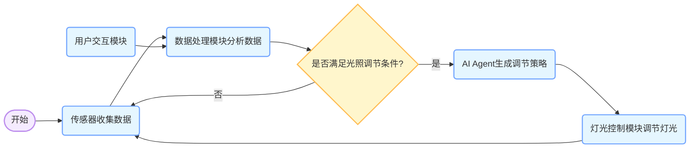

# 智能床头灯：AI Agent的生理节律光照调节

> 关键词：智能床头灯、AI Agent、生理节律、光照调节、健康照明

> 摘要：本文聚焦于智能床头灯借助AI Agent实现生理节律光照调节这一前沿技术。详细阐述了其核心概念、算法原理、数学模型，并通过实际项目案例展示了具体实现过程。深入探讨了该技术在实际生活中的应用场景，推荐了相关的学习资源、开发工具和研究论文。最后对其未来发展趋势与挑战进行了总结，旨在为读者全面呈现智能床头灯在生理节律光照调节方面的技术魅力与应用前景。

## 1. 背景介绍 
### 1.1 目的和范围
随着人们对健康生活的关注度不断提高，照明对人体生理节律的影响逐渐成为研究热点。智能床头灯作为一种贴近人们睡眠和休息场景的照明设备，具有极大的潜力通过调节光照来改善人们的生理节律。本文的目的在于深入探讨如何利用AI Agent技术实现智能床头灯的生理节律光照调节，涵盖了从核心概念、算法原理到实际应用的各个方面。范围包括技术的理论基础、具体实现步骤、实际案例分析以及未来发展趋势等。

### 1.2 预期读者
本文预期读者主要包括对智能家居、人工智能、健康照明等领域感兴趣的技术爱好者、研究人员、开发人员以及相关行业的从业者。对于希望了解智能床头灯新技术的消费者也具有一定的参考价值。

### 1.3 文档结构概述
本文将按照以下结构进行阐述：首先介绍核心概念与联系，明确智能床头灯、AI Agent和生理节律光照调节之间的关系；接着详细讲解核心算法原理和具体操作步骤，并结合Python代码进行说明；然后给出数学模型和公式，通过举例加深理解；之后进行项目实战，包括开发环境搭建、源代码实现和代码解读；再探讨实际应用场景；推荐相关的工具和资源；最后总结未来发展趋势与挑战，并提供常见问题解答和扩展阅读参考资料。

### 1.4 术语表
#### 1.4.1 核心术语定义
- **智能床头灯**：具备智能化控制功能的床头照明设备，可通过多种方式（如手机APP、语音控制等）调节灯光的亮度、颜色、色温等参数。
- **AI Agent**：人工智能代理，是一种能够感知环境、自主决策并采取行动以实现特定目标的软件实体。在本文中，AI Agent用于根据用户的生理节律信息和环境条件调节智能床头灯的光照。
- **生理节律**：人体内部的一种自然节律，包括昼夜节律、睡眠 - 觉醒节律等，受光照、生物钟等多种因素影响。
- **光照调节**：根据不同的需求和场景，对灯光的亮度、颜色、色温等参数进行调整。

#### 1.4.2 相关概念解释
- **生物钟**：人体内部的一种计时机制，能够调节生理和行为的节律。光照是影响生物钟的重要外部因素之一。
- **色温**：表示光的颜色温度，单位为开尔文（K）。较低的色温（如2700K - 3000K）产生暖黄色光，类似烛光；较高的色温（如5000K - 6500K）产生冷白色光，类似自然光。

#### 1.4.3 缩略词列表
- **AI**：Artificial Intelligence，人工智能
- **APP**：Application，应用程序

## 2. 核心概念与联系 

### 核心概念原理
智能床头灯的生理节律光照调节核心在于利用AI Agent对人体生理节律和环境光照条件进行感知和分析，然后根据分析结果动态调整床头灯的光照参数。人体的生理节律受到光照的显著影响，例如，早晨的蓝光可以抑制褪黑素的分泌，帮助人们清醒；而晚上的暖光则有助于促进褪黑素的分泌，诱导睡眠。AI Agent通过收集用户的睡眠习惯、作息时间、环境光照强度等信息，结合预设的生理节律模型，生成适合用户的光照调节策略。

### 架构的文本示意图
智能床头灯的生理节律光照调节系统主要由以下几个部分组成：
1. **传感器模块**：包括光照传感器、人体传感器等，用于收集环境光照强度、人体活动等信息。
2. **数据处理模块**：对传感器收集到的数据进行处理和分析，提取有用的信息。
3. **AI Agent模块**：根据数据处理模块提供的信息和预设的生理节律模型，生成光照调节策略。
4. **灯光控制模块**：根据AI Agent模块生成的策略，控制智能床头灯的亮度、颜色、色温等参数。
5. **用户交互模块**：用户可以通过手机APP、语音控制等方式与系统进行交互，设置个人偏好和作息时间。

### Mermaid流程图


## 3. 核心算法原理 & 具体操作步骤 

### 核心算法原理
本文采用基于规则的算法结合机器学习算法来实现智能床头灯的生理节律光照调节。基于规则的算法根据预设的生理节律模型和用户的作息时间，制定基本的光照调节规则。例如，在早晨起床时间前半小时，逐渐增加灯光亮度和色温，模拟日出的效果；在晚上睡觉时间前一小时，逐渐降低灯光亮度和色温，模拟日落的效果。

机器学习算法用于对用户的睡眠习惯和光照偏好进行建模。通过收集用户在不同光照条件下的睡眠质量数据，使用回归分析等算法，建立光照参数与睡眠质量之间的关系模型。根据这个模型，AI Agent可以根据用户的实时睡眠状态和环境条件，动态调整光照参数，以提高用户的睡眠质量。

### 具体操作步骤及Python代码实现

#### 步骤1：数据收集
使用传感器收集环境光照强度、人体活动等信息。以下是一个简单的Python代码示例，模拟光照传感器的数据收集：
```python
import random

def collect_light_data():
    # 模拟光照传感器收集数据，范围在0 - 1000 lux之间
    light_intensity = random.randint(0, 1000)
    return light_intensity

# 测试数据收集函数
light = collect_light_data()
print(f"当前光照强度: {light} lux")
```

#### 步骤2：数据处理
对收集到的数据进行处理和分析，提取有用的信息。例如，计算一段时间内的平均光照强度：
```python
def process_light_data(data):
    # 计算平均光照强度
    if len(data) == 0:
        return 0
    total = sum(data)
    average = total / len(data)
    return average

# 模拟收集一段时间内的光照数据
light_data = [collect_light_data() for _ in range(10)]
average_light = process_light_data(light_data)
print(f"平均光照强度: {average_light} lux")
```

#### 步骤3：AI Agent决策
根据数据处理模块提供的信息和预设的生理节律模型，AI Agent生成光照调节策略。以下是一个简单的基于规则的决策函数：
```python
def ai_agent_decision(current_light, time):
    # 假设早晨6:00 - 8:00需要增加光照强度
    if 6 <= time.hour < 8:
        if current_light < 500:
            return "增加亮度"
    # 假设晚上22:00 - 24:00需要降低光照强度
    elif 22 <= time.hour < 24:
        if current_light > 100:
            return "降低亮度"
    return "保持不变"

import datetime
current_time = datetime.datetime.now()
decision = ai_agent_decision(average_light, current_time)
print(f"AI Agent决策: {decision}")
```

#### 步骤4：灯光控制
根据AI Agent生成的策略，控制智能床头灯的亮度、颜色、色温等参数。以下是一个简单的模拟灯光控制函数：
```python
def control_light(decision):
    if decision == "增加亮度":
        print("增加床头灯亮度")
    elif decision == "降低亮度":
        print("降低床头灯亮度")
    else:
        print("保持床头灯亮度不变")

control_light(decision)
```

## 4. 数学模型和公式 & 详细讲解 & 举例说明 

### 生理节律模型
人体的生理节律可以用一个周期性的函数来表示。例如，褪黑素的分泌量可以用一个正弦函数来近似模拟：
$$M(t) = A \sin(\omega t + \varphi) + B$$
其中，$M(t)$ 表示在时间 $t$ 时的褪黑素分泌量，$A$ 是振幅，表示褪黑素分泌量的变化范围；$\omega$ 是角频率，与生理节律的周期有关；$\varphi$ 是相位，决定了函数的起始位置；$B$ 是直流分量，表示褪黑素的基础分泌量。

### 光照与褪黑素的关系
光照对褪黑素的分泌有抑制作用。可以用一个线性函数来表示光照强度 $L$ 与褪黑素分泌抑制率 $R$ 之间的关系：
$$R = kL$$
其中，$k$ 是比例系数，表示光照强度对褪黑素分泌抑制的敏感程度。

### 举例说明
假设一个人的褪黑素分泌模型为 $M(t) = 5 \sin(\frac{2\pi}{24}t - \frac{\pi}{2}) + 10$，其中 $t$ 表示时间（小时），$M(t)$ 的单位是纳克/毫升。在早晨6点时，$t = 6$，代入公式可得：
$$M(6) = 5 \sin(\frac{2\pi}{24} \times 6 - \frac{\pi}{2}) + 10 = 5 \sin(\frac{\pi}{2} - \frac{\pi}{2}) + 10 = 10$$
即早晨6点时，褪黑素分泌量为10纳克/毫升。

假设比例系数 $k = 0.01$，当光照强度 $L = 500$ lux 时，褪黑素分泌抑制率 $R = 0.01 \times 500 = 5$，即褪黑素分泌量将减少5纳克/毫升。此时，实际的褪黑素分泌量为 $10 - 5 = 5$ 纳克/毫升。

## 5. 项目实战：代码实际案例和详细解释说明 

### 5.1  开发环境搭建
#### 硬件准备
- 智能床头灯：支持通过串口、蓝牙或Wi-Fi等方式进行控制的床头灯。
- 光照传感器：用于收集环境光照强度信息。
- 开发板：如Arduino、Raspberry Pi等，用于处理传感器数据和控制床头灯。

#### 软件准备
- Python环境：安装Python 3.x版本，并安装必要的库，如 `pyserial`、`requests` 等。
- 开发工具：使用Visual Studio Code、PyCharm等集成开发环境。

### 5.2  源代码详细实现和代码解读
以下是一个完整的Python代码示例，实现智能床头灯的生理节律光照调节：
```python
import serial
import time
import datetime

# 串口通信配置
ser = serial.Serial('COM3', 9600, timeout=1)

# 模拟光照传感器数据收集
def collect_light_data():
    # 这里可以替换为实际的光照传感器读取代码
    light_intensity = random.randint(0, 1000)
    return light_intensity

# 数据处理
def process_light_data(data):
    if len(data) == 0:
        return 0
    total = sum(data)
    average = total / len(data)
    return average

# AI Agent决策
def ai_agent_decision(current_light, time):
    if 6 <= time.hour < 8:
        if current_light < 500:
            return "增加亮度"
    elif 22 <= time.hour < 24:
        if current_light > 100:
            return "降低亮度"
    return "保持不变"

# 灯光控制
def control_light(decision):
    if decision == "增加亮度":
        ser.write(b'1')  # 发送增加亮度的指令
        print("增加床头灯亮度")
    elif decision == "降低亮度":
        ser.write(b'0')  # 发送降低亮度的指令
        print("降低床头灯亮度")
    else:
        print("保持床头灯亮度不变")

# 主循环
light_data = []
while True:
    # 收集光照数据
    light = collect_light_data()
    light_data.append(light)
    if len(light_data) > 10:
        light_data.pop(0)
    
    # 处理数据
    average_light = process_light_data(light_data)
    
    # 获取当前时间
    current_time = datetime.datetime.now()
    
    # AI Agent决策
    decision = ai_agent_decision(average_light, current_time)
    
    # 控制灯光
    control_light(decision)
    
    time.sleep(60)  # 每分钟更新一次
```

### 代码解读与分析
- **串口通信配置**：使用 `serial.Serial` 函数配置串口通信，确保开发板与计算机之间能够正常通信。
- **光照数据收集**：`collect_light_data` 函数模拟光照传感器的数据收集，实际应用中可以替换为真实的传感器读取代码。
- **数据处理**：`process_light_data` 函数计算一段时间内的平均光照强度。
- **AI Agent决策**：`ai_agent_decision` 函数根据当前光照强度和时间，生成光照调节策略。
- **灯光控制**：`control_light` 函数根据决策结果，通过串口发送相应的指令来控制床头灯的亮度。
- **主循环**：不断收集光照数据，进行数据处理和决策，然后控制灯光。每分钟更新一次，确保光照调节的及时性。

## 6. 实际应用场景 
### 家庭卧室
在家庭卧室中，智能床头灯的生理节律光照调节功能可以帮助人们改善睡眠质量。早晨，床头灯逐渐增加亮度和色温，模拟日出的效果，唤醒用户，使其自然地从睡眠状态过渡到清醒状态；晚上，床头灯逐渐降低亮度和色温，模拟日落的效果，促进褪黑素的分泌，帮助用户放松身心，进入睡眠状态。

### 酒店客房
酒店可以为客人提供配备智能床头灯的客房，根据客人的入住时间和作息习惯，自动调节床头灯的光照，为客人创造舒适的睡眠环境。这不仅可以提高客人的满意度，还可以提升酒店的服务品质。

### 医院病房
在医院病房中，智能床头灯的生理节律光照调节功能可以帮助患者调整生理节律，促进康复。对于失眠患者，适当的光照调节可以改善睡眠质量；对于昼夜节律紊乱的患者，如倒时差的患者，光照调节可以帮助他们尽快恢复正常的生理节律。

## 7. 工具和资源推荐
### 7.1 学习资源推荐
#### 7.1.1 书籍推荐
- 《智能家居技术与应用》：全面介绍了智能家居的相关技术和应用案例，包括智能照明系统。
- 《人工智能基础教程》：系统讲解了人工智能的基本概念、算法和应用，为理解AI Agent技术提供了理论基础。
- 《生理节律与健康》：深入探讨了人体生理节律的机制和影响因素，以及如何通过光照等方式调节生理节律。

#### 7.1.2 在线课程
- Coursera上的“智能家居系统设计与开发”课程：介绍了智能家居系统的设计原则、开发方法和实际应用案例。
- edX上的“人工智能导论”课程：由知名高校的教授授课，系统讲解了人工智能的基本原理和算法。
- 中国大学MOOC上的“生物节律与健康”课程：详细介绍了生物节律的相关知识和研究进展。

#### 7.1.3 技术博客和网站
- 智能家居网：提供智能家居行业的最新动态、技术文章和产品评测。
- AI研习社：专注于人工智能领域的技术分享和交流，有大量关于AI Agent的技术文章和案例。
- 中国照明网：提供照明行业的技术资讯、标准规范和产品信息。

### 7.2 开发工具框架推荐
#### 7.2.1 IDE和编辑器
- Visual Studio Code：一款轻量级的开源代码编辑器，支持多种编程语言和插件扩展，适合开发智能床头灯的控制程序。
- PyCharm：专业的Python集成开发环境，提供丰富的代码编辑、调试和测试功能。
- Arduino IDE：专门用于Arduino开发板的集成开发环境，简单易用，适合初学者。

#### 7.2.2 调试和性能分析工具
- Wireshark：网络数据包分析工具，可以用于调试智能床头灯与其他设备之间的网络通信。
- Profiler：Python性能分析工具，可以帮助开发者找出代码中的性能瓶颈。
- Serial Monitor：串口调试工具，用于调试开发板与计算机之间的串口通信。

#### 7.2.3 相关框架和库
- Home Assistant：开源的智能家居平台，支持多种智能设备的集成和控制，可以用于开发智能床头灯的控制应用。
- TensorFlow：谷歌开发的开源机器学习框架，可用于构建AI Agent的机器学习模型。
- PySerial：Python的串口通信库，方便开发者实现与开发板的串口通信。

### 7.3 相关论文著作推荐
#### 7.3.1 经典论文
- "Circadian Rhythms in Health and Disease"：发表于《New England Journal of Medicine》，系统阐述了生理节律与健康和疾病的关系。
- "Lighting for Health: A Review of the Impact of Light on Human Well - being"：发表于《Journal of Environmental Psychology》，综述了光照对人体健康的影响。
- "Artificial Intelligence Agents for Smart Home Automation"：发表于《IEEE Transactions on Smart Grid》，探讨了AI Agent在智能家居自动化中的应用。

#### 7.3.2 最新研究成果
- 关注《Science》、《Nature》等顶级科学期刊，以及《IEEE Transactions on Biomedical Engineering》、《Journal of Circadian Rhythms》等专业期刊，获取关于生理节律、光照调节和AI Agent的最新研究成果。

#### 7.3.3 应用案例分析
- 可以参考一些智能家居展会的报告和案例分析，了解智能床头灯在实际应用中的成功案例和经验教训。

## 8. 总结：未来发展趋势与挑战
### 未来发展趋势
- **个性化定制**：未来的智能床头灯将能够根据每个用户的独特生理节律和光照偏好，提供更加个性化的光照调节方案。通过收集用户的更多数据，如睡眠监测数据、健康指标等，AI Agent可以实现更加精准的光照调节。
- **多模态交互**：除了现有的手机APP和语音控制方式，智能床头灯将支持更多的交互方式，如手势识别、面部识别等。用户可以通过更加自然和便捷的方式与床头灯进行交互。
- **与其他智能家居设备的集成**：智能床头灯将与其他智能家居设备，如智能窗帘、智能空调等进行深度集成，实现更加智能化的家居环境控制。例如，当床头灯调节光照时，智能窗帘可以自动调整开合程度，以配合光照效果。

### 挑战
- **数据隐私和安全**：智能床头灯在收集用户数据的过程中，涉及到用户的个人隐私和安全问题。如何保障数据的安全存储和传输，防止数据泄露和滥用，是一个亟待解决的问题。
- **算法的准确性和可靠性**：AI Agent的决策算法需要不断优化和改进，以提高其准确性和可靠性。由于人体生理节律的复杂性和个体差异，算法需要考虑更多的因素，才能实现更加精准的光照调节。
- **成本和普及度**：目前，智能床头灯的成本相对较高，限制了其普及度。如何降低成本，提高产品的性价比，是推动智能床头灯市场发展的关键。

## 9. 附录：常见问题与解答
### Q1：智能床头灯的光照调节对所有人都有效吗？
A：虽然光照调节对大多数人的生理节律有一定的影响，但由于个体差异，效果可能会有所不同。例如，一些人可能对光照的敏感度较低，光照调节的效果可能不明显。此外，某些疾病或药物也可能影响人体的生理节律，从而降低光照调节的效果。

### Q2：智能床头灯需要一直联网吗？
A：不一定。一些智能床头灯可以通过本地控制实现基本的光照调节功能，不需要联网。但如果需要使用远程控制、数据同步等功能，则需要连接网络。

### Q3：智能床头灯的光照调节会影响眼睛健康吗？
A：合理的光照调节不会对眼睛健康造成影响。智能床头灯的光照调节是根据人体生理节律和环境条件进行的，通常会采用柔和、舒适的光照参数。但如果光照调节不当，如光照强度过高或过低，可能会对眼睛造成一定的伤害。

### Q4：如何设置智能床头灯的个人偏好和作息时间？
A：一般可以通过手机APP或语音控制的方式设置智能床头灯的个人偏好和作息时间。在APP中，通常会有相应的设置选项，用户可以根据自己的需求进行设置。语音控制则可以通过与智能音箱进行交互，直接告诉音箱自己的设置需求。

## 10. 扩展阅读 & 参考资料
- 《智能照明技术与应用》，作者：[作者姓名]，出版社：[出版社名称]
- "Smart Lighting Systems for Energy Efficiency and Human Well - being"，发表于《Energy and Buildings》
- 智能家居行业白皮书，发布机构：[发布机构名称]

作者：AI天才研究院/AI Genius Institute & 禅与计算机程序设计艺术 /Zen And The Art of Computer Programming