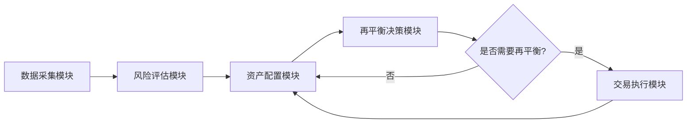

# 智能投资组合再平衡策略优化

> 关键词：智能投资组合、再平衡策略、优化、风险控制、收益最大化

> 摘要：本文围绕智能投资组合再平衡策略优化展开深入探讨。首先介绍了投资组合再平衡的背景知识，包括其目的、适用读者群体等。接着阐述了核心概念及联系，通过文本示意图和 Mermaid 流程图清晰呈现。详细讲解了核心算法原理并给出 Python 源代码示例，同时介绍了相关数学模型和公式。通过项目实战，展示了代码的实际案例及详细解释。分析了该策略在不同场景下的实际应用，推荐了学习资源、开发工具框架以及相关论文著作。最后总结了未来发展趋势与挑战，还提供了常见问题解答和扩展阅读参考资料，旨在为投资者和相关从业者提供全面且深入的智能投资组合再平衡策略优化的知识体系和实践指导。

## 1. 背景介绍 
### 1.1 目的和范围
投资组合再平衡是投资管理中的重要环节，其目的在于确保投资组合的资产配置与投资者的风险偏好和投资目标保持一致。随着市场的不断变化，资产的价值会发生波动，导致投资组合的实际配置偏离初始设定。通过再平衡策略，可以及时调整资产比例，降低风险并有可能提高收益。

本文的范围涵盖了智能投资组合再平衡策略的基本概念、核心算法、数学模型、实际应用以及优化方法等方面。旨在为投资者和金融从业者提供全面的理论和实践指导，帮助他们更好地理解和应用投资组合再平衡策略。

### 1.2 预期读者
本文预期读者包括但不限于以下几类人群：
- 投资者：无论是个人投资者还是机构投资者，都可以从本文中获取有关投资组合再平衡策略的知识，以优化自己的投资决策，提高投资收益。
- 金融从业者：如基金经理、投资顾问等，通过深入了解智能投资组合再平衡策略的优化方法，提升自己的专业能力和服务水平。
- 金融科技爱好者：对金融领域的新技术、新方法感兴趣的读者，可以通过本文了解智能投资组合再平衡策略的相关技术和应用。
- 研究人员：从事金融工程、投资学等领域研究的学者，可以从本文中获取相关的研究思路和方法，为进一步的研究提供参考。

### 1.3 文档结构概述
本文的结构如下：
- 核心概念与联系：介绍智能投资组合再平衡策略的核心概念、原理和架构，并通过文本示意图和 Mermaid 流程图进行展示。
- 核心算法原理 & 具体操作步骤：详细讲解核心算法原理，并使用 Python 源代码进行阐述，同时给出具体的操作步骤。
- 数学模型和公式 & 详细讲解 & 举例说明：介绍相关的数学模型和公式，并进行详细讲解，通过具体例子加深读者的理解。
- 项目实战：代码实际案例和详细解释说明：通过实际的项目案例，展示智能投资组合再平衡策略的代码实现和详细解释。
- 实际应用场景：分析智能投资组合再平衡策略在不同场景下的实际应用。
- 工具和资源推荐：推荐学习资源、开发工具框架以及相关论文著作。
- 总结：未来发展趋势与挑战：总结智能投资组合再平衡策略的未来发展趋势和面临的挑战。
- 附录：常见问题与解答：提供常见问题的解答，帮助读者解决遇到的问题。
- 扩展阅读 & 参考资料：提供扩展阅读的建议和相关参考资料，方便读者进一步深入学习。

### 1.4 术语表
#### 1.4.1 核心术语定义
- **投资组合**：由多种资产组成的集合，投资者通过投资组合来分散风险和实现投资目标。
- **再平衡**：定期或不定期地调整投资组合中各资产的比例，使其恢复到初始设定的目标比例。
- **风险偏好**：投资者对风险的承受能力和意愿，不同的风险偏好会影响投资组合的资产配置。
- **收益最大化**：在一定的风险水平下，通过合理的资产配置和再平衡策略，使投资组合的收益达到最大。
- **智能投资组合**：利用先进的技术和算法，对投资组合进行动态管理和优化的投资组合。

#### 1.4.2 相关概念解释
- **资产配置**：将资金分配到不同类型的资产中，如股票、债券、现金等，以实现风险和收益的平衡。
- **市场波动**：市场价格的变化，包括上涨和下跌，市场波动会导致投资组合的资产价值发生变化。
- **风险控制**：通过合理的资产配置和再平衡策略，降低投资组合的风险，确保投资者的资产安全。
- **动态调整**：根据市场变化和投资者的需求，及时调整投资组合的资产配置和再平衡策略。

#### 1.4.3 缩略词列表
- **ETF**：交易型开放式指数基金（Exchange Traded Fund）
- **VAR**：风险价值（Value at Risk）
- **CAPM**：资本资产定价模型（Capital Asset Pricing Model）
- **MPT**：现代投资组合理论（Modern Portfolio Theory）

## 2. 核心概念与联系 
### 核心概念原理
智能投资组合再平衡策略的核心原理基于现代投资组合理论（MPT）。MPT 认为，通过分散投资可以降低非系统性风险，从而在一定的风险水平下实现收益最大化。投资组合再平衡的目的是在市场波动的情况下，保持投资组合的资产配置与投资者的风险偏好和投资目标一致。

具体来说，当市场发生变化时，投资组合中各资产的价值会发生波动，导致资产比例偏离初始设定的目标比例。此时，通过再平衡策略，可以卖出部分价值上涨的资产，买入部分价值下跌的资产，使资产比例恢复到目标比例。这样可以避免投资组合过度偏向某一类资产，降低风险。

### 架构的文本示意图
智能投资组合再平衡策略的架构主要包括以下几个部分：
1. **数据采集模块**：负责收集市场数据，如资产价格、收益率等。
2. **风险评估模块**：根据市场数据，评估投资组合的风险水平，如风险价值（VAR）等。
3. **资产配置模块**：根据投资者的风险偏好和投资目标，确定投资组合的资产配置比例。
4. **再平衡决策模块**：根据市场变化和资产配置比例，判断是否需要进行再平衡操作。
5. **交易执行模块**：根据再平衡决策，执行相应的交易操作，调整投资组合的资产比例。

### Mermaid 流程图


## 3. 核心算法原理 & 具体操作步骤 
### 核心算法原理
智能投资组合再平衡策略的核心算法主要基于均值 - 方差优化模型。该模型的目标是在一定的风险水平下，使投资组合的预期收益率达到最大。

假设投资组合中包含 $n$ 种资产，第 $i$ 种资产的预期收益率为 $r_i$，权重为 $w_i$，资产之间的协方差矩阵为 $\Sigma$。则投资组合的预期收益率 $R_p$ 和方差 $\sigma_p^2$ 可以表示为：

$R_p = \sum_{i=1}^{n} w_i r_i$

$\sigma_p^2 = \mathbf{w}^T \Sigma \mathbf{w}$

其中，$\mathbf{w} = [w_1, w_2, \cdots, w_n]^T$ 是资产权重向量。

均值 - 方差优化模型的目标是在给定的风险水平 $\sigma_0^2$ 下，最大化投资组合的预期收益率 $R_p$，即：

$\max_{w} R_p = \sum_{i=1}^{n} w_i r_i$

subject to:

$\mathbf{w}^T \Sigma \mathbf{w} \leq \sigma_0^2$

$\sum_{i=1}^{n} w_i = 1$

$w_i \geq 0, \quad i = 1, 2, \cdots, n$

### 具体操作步骤
1. **数据收集**：收集市场数据，包括资产价格、收益率等。
2. **计算预期收益率和协方差矩阵**：根据历史数据，计算每种资产的预期收益率和资产之间的协方差矩阵。
3. **确定风险水平**：根据投资者的风险偏好，确定投资组合的风险水平 $\sigma_0^2$。
4. **求解均值 - 方差优化模型**：使用优化算法求解均值 - 方差优化模型，得到最优的资产权重向量 $\mathbf{w}^*$。
5. **再平衡决策**：定期或不定期地检查投资组合的实际资产比例与目标资产比例的差异。如果差异超过一定的阈值，则进行再平衡操作。
6. **交易执行**：根据再平衡决策，执行相应的交易操作，调整投资组合的资产比例。

### Python 源代码示例
```python
import numpy as np
from scipy.optimize import minimize

# 示例数据
n = 3  # 资产数量
r = np.array([0.1, 0.15, 0.08])  # 预期收益率
Sigma = np.array([[0.04, 0.02, 0.01],
                  [0.02, 0.09, 0.03],
                  [0.01, 0.03, 0.06]])  # 协方差矩阵
sigma0_squared = 0.05  # 风险水平

# 定义目标函数
def objective(w):
    return -np.dot(w, r)  # 最大化预期收益率

# 定义约束条件
def constraint1(w):
    return np.dot(np.dot(w, Sigma), w) - sigma0_squared  # 风险约束

def constraint2(w):
    return np.sum(w) - 1  # 权重和为 1

# 初始权重
w0 = np.ones(n) / n

# 约束条件列表
cons = [{'type': 'ineq', 'fun': constraint1},
        {'type': 'eq', 'fun': constraint2}]

# 边界条件
bnds = [(0, None) for i in range(n)]

# 求解优化问题
result = minimize(objective, w0, method='SLSQP', bounds=bnds, constraints=cons)

# 最优权重
w_opt = result.x

print("最优权重:", w_opt)
```

## 4. 数学模型和公式 & 详细讲解 & 举例说明 
### 数学模型和公式
#### 投资组合的预期收益率
投资组合的预期收益率 $R_p$ 是各资产预期收益率的加权平均值，公式为：

$R_p = \sum_{i=1}^{n} w_i r_i$

其中，$w_i$ 是第 $i$ 种资产的权重，$r_i$ 是第 $i$ 种资产的预期收益率。

#### 投资组合的方差
投资组合的方差 $\sigma_p^2$ 反映了投资组合的风险水平，公式为：

$\sigma_p^2 = \mathbf{w}^T \Sigma \mathbf{w}$

其中，$\mathbf{w} = [w_1, w_2, \cdots, w_n]^T$ 是资产权重向量，$\Sigma$ 是资产之间的协方差矩阵。

#### 均值 - 方差优化模型
均值 - 方差优化模型的目标是在给定的风险水平 $\sigma_0^2$ 下，最大化投资组合的预期收益率 $R_p$，即：

$\max_{w} R_p = \sum_{i=1}^{n} w_i r_i$

subject to:

$\mathbf{w}^T \Sigma \mathbf{w} \leq \sigma_0^2$

$\sum_{i=1}^{n} w_i = 1$

$w_i \geq 0, \quad i = 1, 2, \cdots, n$

### 详细讲解
- **预期收益率**：预期收益率是对资产未来收益的一种估计，通常根据历史数据或市场预测来确定。投资组合的预期收益率是各资产预期收益率的加权平均值，权重反映了各资产在投资组合中的占比。
- **方差**：方差是衡量随机变量离散程度的指标，在投资组合中，方差反映了投资组合的风险水平。方差越大，投资组合的风险越高。
- **均值 - 方差优化模型**：该模型通过求解最优的资产权重向量，在给定的风险水平下实现投资组合的预期收益率最大化。约束条件包括风险约束、权重和为 1 以及权重非负。

### 举例说明
假设投资组合中包含两种资产：股票和债券。股票的预期收益率为 $r_1 = 0.15$，方差为 $\sigma_1^2 = 0.09$；债券的预期收益率为 $r_2 = 0.08$，方差为 $\sigma_2^2 = 0.04$。两种资产之间的协方差为 $\sigma_{12} = 0.02$。投资者的风险偏好为 $\sigma_0^2 = 0.05$。

首先，计算协方差矩阵：

$\Sigma = \begin{bmatrix}
\sigma_1^2 & \sigma_{12} \\
\sigma_{12} & \sigma_2^2
\end{bmatrix} = \begin{bmatrix}
0.09 & 0.02 \\
0.02 & 0.04
\end{bmatrix}$

然后，使用均值 - 方差优化模型求解最优的资产权重向量。设股票的权重为 $w_1$，债券的权重为 $w_2 = 1 - w_1$。

目标函数为：

$\max_{w_1} R_p = w_1 r_1 + (1 - w_1) r_2 = 0.15 w_1 + 0.08 (1 - w_1) = 0.07 w_1 + 0.08$

约束条件为：

$w_1^2 \sigma_1^2 + 2 w_1 (1 - w_1) \sigma_{12} + (1 - w_1)^2 \sigma_2^2 \leq 0.05$

$w_1 + w_2 = 1$

$w_1 \geq 0, w_2 \geq 0$

通过求解上述优化问题，可以得到最优的资产权重向量。

## 5. 项目实战：代码实际案例和详细解释说明 
### 5.1  开发环境搭建
#### 安装 Python
首先，需要安装 Python 环境。可以从 Python 官方网站（https://www.python.org/downloads/） 下载适合自己操作系统的 Python 版本，并按照安装向导进行安装。

#### 安装必要的库
在项目中，需要使用一些 Python 库，如 `numpy`、`pandas`、`scipy` 等。可以使用 `pip` 命令进行安装：

```sh
pip install numpy pandas scipy
```

### 5.2  源代码详细实现和代码解读
以下是一个完整的智能投资组合再平衡策略的 Python 代码示例：

```python
import numpy as np
import pandas as pd
from scipy.optimize import minimize

# 数据采集模块
def collect_data():
    # 模拟市场数据
    data = pd.DataFrame({
        'stock1': [100, 102, 105, 103, 106],
        'stock2': [50, 51, 53, 52, 54],
        'bond': [80, 81, 82, 83, 84]
    })
    return data

# 计算预期收益率和协方差矩阵
def calculate_stats(data):
    returns = data.pct_change().dropna()
    mean_returns = returns.mean()
    cov_matrix = returns.cov()
    return mean_returns, cov_matrix

# 定义目标函数
def objective(w, r):
    return -np.dot(w, r)  # 最大化预期收益率

# 定义约束条件
def constraint1(w, Sigma, sigma0_squared):
    return np.dot(np.dot(w, Sigma), w) - sigma0_squared  # 风险约束

def constraint2(w):
    return np.sum(w) - 1  # 权重和为 1

# 求解均值 - 方差优化模型
def optimize_portfolio(r, Sigma, sigma0_squared):
    n = len(r)
    w0 = np.ones(n) / n
    cons = [{'type': 'ineq', 'fun': constraint1, 'args': (Sigma, sigma0_squared)},
            {'type': 'eq', 'fun': constraint2}]
    bnds = [(0, None) for i in range(n)]
    result = minimize(objective, w0, args=(r,), method='SLSQP', bounds=bnds, constraints=cons)
    return result.x

# 再平衡决策
def rebalance_decision(current_weights, target_weights, threshold):
    diff = np.abs(current_weights - target_weights)
    if np.max(diff) > threshold:
        return True
    else:
        return False

# 交易执行
def execute_trades(current_weights, target_weights, portfolio_value):
    trade_amounts = (target_weights - current_weights) * portfolio_value
    return trade_amounts

# 主函数
def main():
    # 数据采集
    data = collect_data()
    
    # 计算预期收益率和协方差矩阵
    mean_returns, cov_matrix = calculate_stats(data)
    
    # 确定风险水平
    sigma0_squared = 0.05
    
    # 求解均值