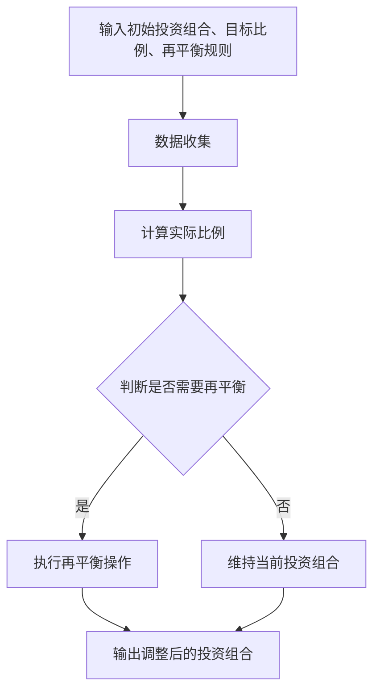

# 智能投资组合再平衡算法

> 关键词：智能投资组合、再平衡算法、资产配置、风险管理、投资优化

> 摘要：本文深入探讨了智能投资组合再平衡算法，旨在帮助投资者在动态的市场环境中实现资产的合理配置与有效管理。首先介绍了该算法的背景，包括目的、预期读者、文档结构和相关术语。接着阐述了核心概念与联系，通过文本示意图和Mermaid流程图展示其原理和架构。详细讲解了核心算法原理及具体操作步骤，使用Python代码进行了说明。还给出了数学模型和公式，并举例说明。通过项目实战，展示了开发环境搭建、源代码实现及代码解读。分析了实际应用场景，推荐了学习资源、开发工具框架和相关论文著作。最后总结了未来发展趋势与挑战，并提供了常见问题解答和扩展阅读参考资料。

## 1. 背景介绍 
### 1.1 目的和范围
在投资领域，投资组合的构建和管理是至关重要的。投资者通常会将资金分散投资于不同的资产，如股票、债券、基金等，以降低风险并实现一定的收益目标。然而，随着市场的波动，投资组合中各资产的价值会发生变化，导致资产配置偏离最初的目标。智能投资组合再平衡算法的目的就是通过定期或根据特定条件对投资组合进行调整，使资产配置重新回到目标比例，从而实现风险管理和投资优化。

本文的范围涵盖了智能投资组合再平衡算法的基本概念、核心算法原理、数学模型、实际应用案例以及相关的工具和资源推荐等方面，旨在为投资者和相关技术人员提供全面而深入的了解。

### 1.2 预期读者
本文的预期读者包括但不限于以下几类人群：
- 投资者：希望了解如何运用智能算法来优化投资组合，实现资产的稳健增长。
- 金融分析师：需要深入研究投资组合管理的方法和技术，为客户提供专业的投资建议。
- 程序员和软件开发者：对金融科技领域感兴趣，希望学习如何实现智能投资组合再平衡算法。
- 学术研究人员：从事金融工程、风险管理等相关领域的研究，需要参考相关的理论和实践案例。

### 1.3 文档结构概述
本文将按照以下结构进行组织：
- 核心概念与联系：介绍智能投资组合再平衡算法的基本概念，包括投资组合、再平衡的定义，以及它们之间的关系，并通过文本示意图和Mermaid流程图展示其原理和架构。
- 核心算法原理 & 具体操作步骤：详细讲解常见的智能投资组合再平衡算法原理，如定期再平衡、阈值再平衡等，并使用Python代码实现具体的操作步骤。
- 数学模型和公式 & 详细讲解 & 举例说明：给出智能投资组合再平衡算法的数学模型和公式，解释其含义，并通过具体的例子进行说明。
- 项目实战：代码实际案例和详细解释说明：通过一个实际的项目案例，展示如何搭建开发环境，实现智能投资组合再平衡算法的源代码，并对代码进行详细的解读和分析。
- 实际应用场景：分析智能投资组合再平衡算法在不同投资场景中的应用，如个人投资、机构投资等。
- 工具和资源推荐：推荐相关的学习资源、开发工具框架和论文著作，帮助读者进一步深入学习和研究。
- 总结：未来发展趋势与挑战：总结智能投资组合再平衡算法的发展趋势和面临的挑战。
- 附录：常见问题与解答：解答读者在学习和应用智能投资组合再平衡算法过程中可能遇到的常见问题。
- 扩展阅读 & 参考资料：提供相关的扩展阅读资料和参考文献，方便读者进一步探索。

### 1.4 术语表
#### 1.4.1 核心术语定义
- **投资组合（Portfolio）**：由多种资产组成的集合，投资者通过投资组合来分散风险并实现收益目标。
- **再平衡（Rebalancing）**：对投资组合中的资产进行调整，使各资产的比例重新回到目标比例的过程。
- **目标比例（Target Allocation）**：投资者预先设定的投资组合中各资产的理想比例。
- **实际比例（Actual Allocation）**：投资组合中各资产当前的实际比例。
- **阈值（Threshold）**：用于判断是否需要进行再平衡的界限值，当实际比例与目标比例的偏差超过阈值时，触发再平衡操作。

#### 1.4.2 相关概念解释
- **资产配置（Asset Allocation）**：根据投资者的风险承受能力、投资目标等因素，将资金分配到不同的资产类别中，是投资组合管理的重要环节。
- **风险管理（Risk Management）**：通过各种方法和手段，识别、评估和控制投资过程中的风险，以保护投资者的资产安全。
- **投资优化（Investment Optimization）**：在给定的风险水平下，寻求投资组合的最大收益，或在给定的收益目标下，寻求最小的风险。

#### 1.4.3 缩略词列表
- **ETF**：交易型开放式指数基金（Exchange-Traded Fund）
- **VAR**：风险价值（Value at Risk）
- **CVAR**：条件风险价值（Conditional Value at Risk）

## 2. 核心概念与联系 
### 核心概念原理
智能投资组合再平衡算法的核心原理是基于投资组合理论和风险管理的思想。投资者通过构建投资组合，将资金分散投资于不同的资产，以降低单一资产波动带来的风险。然而，随着市场的变化，投资组合中各资产的价值会发生变化，导致资产配置偏离最初的目标。再平衡算法的作用就是通过定期或根据特定条件对投资组合进行调整，使资产配置重新回到目标比例。

例如，投资者最初设定的投资组合目标比例为股票60%、债券40%。一段时间后，由于股票市场上涨，股票的价值占比上升到70%，债券的价值占比下降到30%。此时，再平衡算法会根据设定的规则，卖出部分股票，买入部分债券，使股票和债券的比例重新回到60%和40%。

### 架构的文本示意图
```plaintext
投资组合再平衡算法架构

输入：
- 初始投资组合：包含各资产的初始数量和价格
- 目标比例：各资产的理想配置比例
- 再平衡规则：如定期再平衡、阈值再平衡等

处理过程：
1. 数据收集：定期收集各资产的最新价格
2. 计算实际比例：根据最新价格计算各资产的实际比例
3. 判断是否需要再平衡：根据再平衡规则判断实际比例与目标比例的偏差是否超过阈值
4. 执行再平衡操作：如果需要再平衡，计算调整的数量，进行买卖操作

输出：
- 调整后的投资组合：包含各资产的新数量和价格
```

### Mermaid流程图


## 3. 核心算法原理 & 具体操作步骤 
### 定期再平衡算法原理
定期再平衡是一种简单而常用的再平衡方法。它规定在固定的时间间隔（如每月、每季度、每年）对投资组合进行再平衡。具体步骤如下：
1. 确定再平衡的时间间隔，如每月的最后一个交易日。
2. 在每个再平衡时间点，收集各资产的最新价格。
3. 计算各资产的实际比例。
4. 根据目标比例和实际比例的差异，计算需要调整的资产数量。
5. 执行买卖操作，使各资产的比例重新回到目标比例。

### Python代码实现
```python
import pandas as pd

# 初始投资组合
initial_portfolio = {
    'stock': 100,  # 股票数量
    'bond': 200    # 债券数量
}

# 目标比例
target_allocation = {
    'stock': 0.6,
    'bond': 0.4
}

# 初始价格
initial_prices = {
    'stock': 50,
    'bond': 100
}

# 再平衡时间间隔（每月）
rebalance_interval = 'M'

# 模拟一段时间的价格数据
dates = pd.date_range(start='2023-01-01', end='2023-12-31', freq='D')
stock_prices = pd.Series([50 + i for i in range(len(dates))], index=dates)
bond_prices = pd.Series([100 - i/2 for i in range(len(dates))], index=dates)

# 定期再平衡函数
def periodic_rebalance(portfolio, prices, target_allocation, interval):
    rebalanced_portfolios = []
    current_portfolio = portfolio.copy()
    for date in pd.date_range(start=prices.index[0], end=prices.index[-1], freq=interval):
        # 获取当前价格
        current_prices = {
            'stock': prices['stock'][date],
            'bond': prices['bond'][date]
        }
        # 计算当前投资组合价值
        portfolio_value = current_portfolio['stock'] * current_prices['stock'] + current_portfolio['bond'] * current_prices['bond']
        # 计算实际比例
        actual_allocation = {
            'stock': current_portfolio['stock'] * current_prices['stock'] / portfolio_value,
            'bond': current_portfolio['bond'] * current_prices['bond'] / portfolio_value
        }
        # 计算需要调整的数量
        target_stock_value = target_allocation['stock'] * portfolio_value
        target_bond_value = target_allocation['bond'] * portfolio_value
        adjust_stock = (target_stock_value / current_prices['stock']) - current_portfolio['stock']
        adjust_bond = (target_bond_value / current_prices['bond']) - current_portfolio['bond']
        # 执行调整
        current_portfolio['stock'] += adjust_stock
        current_portfolio['bond'] += adjust_bond
        rebalanced_portfolios.append((date, current_portfolio.copy()))
    return rebalanced_portfolios

# 合并价格数据
prices = pd.DataFrame({
    'stock': stock_prices,
    'bond': bond_prices
})

# 执行定期再平衡
rebalanced_portfolios = periodic_rebalance(initial_portfolio, prices, target_allocation, rebalance_interval)

# 输出结果
for date, portfolio in rebalanced_portfolios:
    print(f"Date: {date}, Portfolio: {portfolio}")
```

### 阈值再平衡算法原理
阈值再平衡是根据资产比例的偏差来决定是否进行再平衡。当某一资产的实际比例与目标比例的偏差超过设定的阈值时，触发再平衡操作。具体步骤如下：
1. 设定各资产的阈值。
2. 定期收集各资产的最新价格。
3. 计算各资产的实际比例。
4. 检查各资产的实际比例与目标比例的偏差是否超过阈值。
5. 如果有资产的偏差超过阈值，计算需要调整的资产数量。
6. 执行买卖操作，使各资产的比例重新回到目标比例。

### Python代码实现
```python
# 阈值
threshold = {
    'stock': 0.05,
    'bond': 0.05
}

# 阈值再平衡函数
def threshold_rebalance(portfolio, prices, target_allocation, threshold):
    rebalanced_portfolios = []
    current_portfolio = portfolio.copy()
    for date in prices.index:
        # 获取当前价格
        current_prices = {
            'stock': prices['stock'][date],
            'bond': prices['bond'][date]
        }
        # 计算当前投资组合价值
        portfolio_value = current_portfolio['stock'] * current_prices['stock'] + current_portfolio['bond'] * current_prices['bond']
        # 计算实际比例
        actual_allocation = {
            'stock': current_portfolio['stock'] * current_prices['stock'] / portfolio_value,
            'bond': current_portfolio['bond'] * current_prices['bond'] / portfolio_value
        }
        # 检查是否需要再平衡
        need_rebalance = False
        for asset in target_allocation.keys():
            if abs(actual_allocation[asset] - target_allocation[asset]) > threshold[asset]:
                need_rebalance = True
                break
        if need_rebalance:
            # 计算需要调整的数量
            target_stock_value = target_allocation['stock'] * portfolio_value
            target_bond_value = target_allocation['bond'] * portfolio_value
            adjust_stock = (target_stock_value / current_prices['stock']) - current_portfolio['stock']
            adjust_bond = (target_bond_value / current_prices['bond']) - current_portfolio['bond']
            # 执行调整
            current_portfolio['stock'] += adjust_stock
            current_portfolio['bond'] += adjust_bond
            rebalanced_portfolios.append((date, current_portfolio.copy()))
    return rebalanced_portfolios

# 执行阈值再平衡
rebalanced_portfolios_threshold = threshold_rebalance(initial_portfolio, prices, target_allocation, threshold)

# 输出结果
for date, portfolio in rebalanced_portfolios_threshold:
    print(f"Date: {date}, Portfolio: {portfolio}")
```

## 4. 数学模型和公式 & 详细讲解 & 举例说明 
### 投资组合价值计算
投资组合的价值可以通过以下公式计算：
$$V = \sum_{i=1}^{n} w_i p_i$$
其中，$V$ 表示投资组合的价值，$n$ 表示资产的数量，$w_i$ 表示第 $i$ 种资产的数量，$p_i$ 表示第 $i$ 种资产的价格。

例如，假设投资组合中有两种资产：股票和债券，股票数量为 100，价格为 50 元；债券数量为 200，价格为 100 元。则投资组合的价值为：
$$V = 100 \times 50 + 200 \times 100 = 25000$$

### 资产实际比例计算
第 $i$ 种资产的实际比例可以通过以下公式计算：
$$a_i = \frac{w_i p_i}{V}$$
其中，$a_i$ 表示第 $i$ 种资产的实际比例。

继续以上面的例子为例，股票的实际比例为：
$$a_{stock} = \frac{100 \times 50}{25000} = 0.2$$
债券的实际比例为：
$$a_{bond} = \frac{200 \times 100}{25000} = 0.8$$

### 再平衡调整数量计算
假设目标比例为 $t_i$，则第 $i$ 种资产需要调整的数量 $\Delta w_i$ 可以通过以下公式计算：
$$\Delta w_i = \frac{t_i V}{p_i} - w_i$$

例如，假设目标比例为股票 0.6，债券 0.4，投资组合价值为 25000 元，股票价格为 50 元，债券价格为 100 元。则股票需要调整的数量为：
$$\Delta w_{stock} = \frac{0.6 \times 25000}{50} - 100 = 200$$
债券需要调整的数量为：
$$\Delta w_{bond} = \frac{0.4 \times 25000}{100} - 200 = -100$$

这意味着需要买入 200 股股票，卖出 100 份债券。

## 5. 项目实战：代码实际案例和详细解释说明 
### 5.1  开发环境搭建
为了实现智能投资组合再平衡算法，我们需要搭建以下开发环境：
- **Python环境**：建议使用Python 3.7及以上版本。可以从Python官方网站（https://www.python.org/downloads/）下载并安装。
- **开发工具**：推荐使用Jupyter Notebook或PyCharm等集成开发环境。Jupyter Notebook可以方便地进行代码的编写、调试和可视化，PyCharm则提供了强大的代码编辑和调试功能。
- **相关库**：需要安装pandas、numpy等库，用于数据处理和分析。可以使用以下命令进行安装：
```sh
pip install pandas numpy
```

### 5.2  源代码详细实现和代码解读
以下是一个完整的智能投资组合再平衡算法的Python代码示例：
```python
import pandas as pd
import numpy as np

# 初始投资组合
initial_portfolio = {
    'stock': 100,
    'bond': 200
}

# 目标比例
target_allocation = {
    'stock': 0.6,
    'bond': 0.4
}

# 阈值
threshold = {
    'stock': 0.05,
    'bond': 0.05
}

# 模拟一段时间的价格数据
dates = pd.date_range(start='2023-01-01', end='2023-12-31', freq='D')
stock_prices = pd.Series(np.random.randn(len(dates)).cumsum() + 50, index=dates)
bond_prices = pd.Series(np.random.randn(len(dates)).cumsum() + 100, index=dates)

# 合并价格数据
prices = pd.DataFrame({
    'stock': stock_prices,
    'bond': bond_prices
})

# 阈值再平衡函数
def threshold_rebalance(portfolio, prices, target_allocation, threshold):
    rebalanced_portfolios = []
    current_portfolio = portfolio.copy()
    for date in prices.index:
        # 获取当前价格
        current_prices = {
            'stock': prices['stock'][date],
            'bond': prices['bond'][date]
        }
        # 计算当前投资组合价值
        portfolio_value = current_portfolio['stock'] * current_prices['stock'] + current_portfolio['bond'] * current_prices['bond']
        # 计算实际比例
        actual_allocation = {
            'stock': current_portfolio['stock'] * current_prices['stock'] / portfolio_value,
            'bond': current_portfolio['bond'] * current_prices['bond'] / portfolio_value
        }
        # 检查是否需要再平衡
        need_rebalance = False
        for asset in target_allocation.keys():
            if abs(actual_allocation[asset] - target_allocation[asset]) > threshold[asset]:
                need_rebalance = True
                break
        if need_rebalance:
            # 计算需要调整的数量
            target_stock_value = target_allocation['stock'] * portfolio_value
            target_bond_value = target_allocation['bond'] * portfolio_value
            adjust_stock = (target_stock_value / current_prices['stock']) - current_portfolio['stock']
            adjust_bond = (target_bond_value / current_prices['bond']) - current_portfolio['bond']
            # 执行调整
            current_portfolio['stock'] += adjust_stock
            current_portfolio['bond'] += adjust_bond
            rebalanced_portfolios.append((date, current_portfolio.copy()))
    return rebalanced_portfolios

# 执行阈值再平衡
rebalanced_portfolios = threshold_rebalance(initial_portfolio, prices, target_allocation, threshold)

# 输出结果
for date, portfolio in rebalanced_portfolios:
    print(f"Date: {date}, Portfolio: {portfolio}")
```
### 代码解读与分析
1. **数据初始化**：定义了初始投资组合、目标比例、阈值和模拟的价格数据。
2. **阈值再平衡函数**：`threshold_rebalance` 函数实现了阈值再平衡算法。在每个时间点，计算当前投资组合的价值和实际比例，检查是否需要再平衡，如果需要则计算调整数量并执行调整。
3. **执行再平衡**：调用 `threshold_rebalance` 函数执行阈值再平衡，并输出每次再平衡的日期和调整后的投资组合。

通过这个项目实战，我们可以看到如何使用Python实现智能投资组合再平衡算法，并对代码进行详细的解读和分析。

## 6. 实际应用场景 
### 个人投资
对于个人投资者来说，智能投资组合再平衡算法可以帮助他们实现资产的合理配置和风险管理。个人投资者通常没有专业的金融知识和时间来频繁调整投资组合，通过设置合适的再平衡规则，如定期再平衡或阈值再平衡，可以自动保持投资组合的资产配置在目标比例附近。例如，一位投资者将资金分配到股票和债券上，设定目标比例为股票 60%、债券 40%，并设置阈值为 5%。当股票市场上涨导致股票比例超过 65% 时，算法会自动卖出部分股票，买入部分债券，使投资组合重新回到目标比例。

### 机构投资
机构投资者，如基金公司、保险公司等，管理着大量的资金，需要更加精细的投资组合管理。智能投资组合再平衡算法可以帮助机构投资者优化资产配置，降低风险，提高投资收益。例如，基金公司可以根据市场情况和投资策略，定期对基金的投资组合进行再平衡，确保基金的资产配置符合基金的投资目标。同时，再平衡算法还可以结合风险管理模型，如VAR、CVAR等，对投资组合的风险进行实时监控和控制。

### 量化投资
在量化投资领域，智能投资组合再平衡算法是一个重要的组成部分。量化投资者通过使用数学模型和算法来进行投资决策，再平衡算法可以帮助他们实现投资组合的自动化管理。例如，量化投资者可以根据市场数据和交易信号，动态调整投资组合的资产配置，通过再平衡算法确保投资组合的风险和收益在可控范围内。

## 7. 工具和资源推荐
### 7.1 学习资源推荐
#### 7.1.1 书籍推荐
- 《投资组合管理：理论与应用》：全面介绍了投资组合管理的理论和方法，包括资产配置、风险管理、再平衡等内容。
- 《量化投资：策略与技术》：详细讲解了量化投资的策略和技术，包括投资组合优化、再平衡算法等方面的知识。
- 《金融数学》：介绍了金融领域的数学模型和方法，对于理解智能投资组合再平衡算法的数学原理有很大帮助。

#### 7.1.2 在线课程
- Coursera上的“投资组合管理”课程：由知名大学的教授授课，系统地介绍了投资组合管理的理论和实践。
- edX上的“量化投资策略”课程：提供了量化投资的基础知识和实践案例，包括投资组合再平衡算法的实现。
- 中国大学MOOC上的“金融数学”课程：讲解了金融数学的基本概念和方法，有助于深入理解智能投资组合再平衡算法的数学模型。

#### 7.1.3 技术博客和网站
- 金融界网站：提供了丰富的金融资讯和投资分析文章，对于了解市场动态和投资策略有很大帮助。
- 量化投资网：专注于量化投资领域的技术和策略分享，有很多关于投资组合再平衡算法的实践案例和技术文章。
- 雪球网：一个投资交流社区，投资者可以在这里分享投资经验和见解，了解其他投资者的投资组合管理方法。

### 7.2 开发工具框架推荐
#### 7.2.1 IDE和编辑器
- Jupyter Notebook：一个交互式的开发环境，适合进行数据分析和代码调试，对于实现智能投资组合再平衡算法非常方便。
- PyCharm：一款专业的Python集成开发环境，提供了强大的代码编辑、调试和版本控制功能。
- Visual Studio Code：一款轻量级的代码编辑器，支持多种编程语言和插件扩展，可用于Python代码的开发。

#### 7.2.2 调试和性能分析工具
- IPython：一个增强的Python交互式解释器，提供了强大的调试和代码执行功能，可用于调试智能投资组合再平衡算法的代码。
- cProfile：Python标准库中的性能分析工具，可以帮助分析代码的性能瓶颈，优化算法的执行效率。
- Py-Spy：一个轻量级的Python性能分析工具，无需修改代码即可进行性能分析，非常适合快速定位性能问题。

#### 7.2.3 相关框架和库
- Pandas：一个强大的数据处理和分析库，可用于处理投资组合的价格数据和计算资产比例。
- Numpy：一个用于科学计算的Python库，提供了高效的数组操作和数学函数，可用于实现投资组合再平衡算法的数学计算。
- Scikit-learn：一个机器学习库，可用于构建风险管理模型和投资组合优化模型。

### 7.3 相关论文著作推荐
#### 7.3.1 经典论文
- Markowitz, H. M. (1952). Portfolio Selection. The Journal of Finance, 7(1), 77-91. 这篇论文提出了现代投资组合理论，为投资组合管理奠定了基础。
- Sharpe, W. F. (1964). Capital Asset Prices: A Theory of Market Equilibrium under Conditions of Risk. The Journal of Finance, 19(3), 425-442. 该论文提出了资本资产定价模型（CAPM），对投资组合的风险和收益进行了量化分析。

#### 7.3.2 最新研究成果
- 近年来，关于智能投资组合再平衡算法的研究不断涌现，涉及到机器学习、深度学习等技术的应用。可以通过学术数据库，如IEEE Xplore、ACM Digital Library等，搜索相关的最新研究论文。

#### 7.3.3 应用案例分析
- 一些金融机构和研究机构会发布投资组合管理的应用案例分析报告，可以关注这些报告，了解智能投资组合再平衡算法在实际应用中的效果和经验。

## 8. 总结：未来发展趋势与挑战
### 未来发展趋势
- **智能化和自动化程度提高**：随着人工智能和机器学习技术的不断发展，智能投资组合再平衡算法将更加智能化和自动化。算法可以通过学习市场数据和投资者的行为模式，自动调整再平衡策略，提高投资组合的管理效率和收益水平。
- **多资产和多策略融合**：未来的投资组合将更加多元化，包括股票、债券、期货、期权等多种资产。智能投资组合再平衡算法需要能够处理多资产的复杂情况，并融合多种投资策略，如趋势跟踪、均值回归等，以实现更好的风险控制和收益优化。
- **与风险管理深度结合**：风险管理是投资组合管理的重要环节，未来的智能投资组合再平衡算法将与风险管理模型更加紧密地结合。算法可以根据投资组合的风险水平和市场情况，动态调整再平衡的频率和幅度，确保投资组合的风险在可控范围内。

### 挑战
- **数据质量和准确性**：智能投资组合再平衡算法依赖于大量的市场数据和投资者数据，数据的质量和准确性直接影响算法的性能和效果。因此，如何获取高质量、准确的数据，并进行有效的数据清洗和预处理，是一个重要的挑战。
- **模型复杂度和解释性**：随着算法的智能化和复杂化，模型的复杂度也在不断提高。复杂的模型可能会导致过拟合和难以解释的问题，影响投资者对算法的信任和使用。因此，如何在保证模型性能的前提下，提高模型的解释性，是一个需要解决的问题。
- **市场不确定性和黑天鹅事件**：金融市场充满了不确定性，黑天鹅事件时有发生。智能投资组合再平衡算法需要具备应对市场不确定性和黑天鹅事件的能力，如何在极端市场情况下保证投资组合的稳定性和安全性，是一个巨大的挑战。

## 9. 附录：常见问题与解答
### 问题1：再平衡会增加交易成本吗？
解答：再平衡通常会涉及到买卖操作，因此会产生一定的交易成本，如佣金、印花税等。但是，通过合理设置再平衡规则，如适当调整再平衡的频率和阈值，可以在一定程度上降低交易成本。同时，再平衡可以帮助投资者控制风险，实现资产的长期稳健增长，从长期来看，其带来的收益可能会超过交易成本。

### 问题2：如何确定目标比例和阈值？
解答：目标比例和阈值的确定需要考虑投资者的风险承受能力、投资目标、投资期限等因素。一般来说，风险承受能力较高的投资者可以将更多的资金分配到股票等风险资产上；投资期限较长的投资者可以适当提高股票的比例。阈值的设置可以根据市场的波动情况和投资者的偏好来确定，一般在 5% - 10% 之间。

### 问题3：再平衡算法适用于所有投资者吗？
解答：再平衡算法并不是适用于所有投资者。对于一些短期投资者或追求高风险高收益的投资者来说，可能更倾向于采用主动投资策略，而不是依赖再平衡算法进行投资组合管理。再平衡算法更适合那些追求资产稳健增长、风险承受能力适中的中长期投资者。

## 10. 扩展阅读 & 参考资料
### 扩展阅读
- 《聪明的投资者》：由本杰明·格雷厄姆所著，是一本经典的投资书籍，对于投资者树立正确的投资理念有很大帮助。
- 《漫步华尔街》：介绍了各种投资策略和市场理论，帮助投资者了解市场的运行规律和投资的基本原则。

### 参考资料
- Markowitz, H. M. (1952). Portfolio Selection. The Journal of Finance, 7(1), 77-91.
- Sharpe, W. F. (1964). Capital Asset Prices: A Theory of Market Equilibrium under Conditions of Risk. The Journal of Finance, 19(3), 425-442.
- 博迪, 凯恩, 马库斯. (2017). 投资学（原书第10版）. 机械工业出版社.

作者：AI天才研究院/AI Genius Institute & 禅与计算机程序设计艺术 /Zen And The Art of Computer Programming