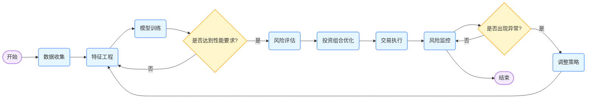

# 智能投资组合尾部风险管理

> 关键词：智能投资组合、尾部风险、风险管理、量化分析、金融科技

> 摘要：本文聚焦于智能投资组合的尾部风险管理，全面深入地探讨了该领域的核心概念、算法原理、数学模型以及实际应用。首先介绍了智能投资组合尾部风险管理的背景，包括目的、预期读者和文档结构等内容。接着详细阐述了核心概念及相互联系，给出了相应的原理和架构示意图与流程图。通过Python代码详细讲解了核心算法原理和具体操作步骤，运用数学公式进行深入分析并举例说明。以实际项目为案例，展示了开发环境搭建、源代码实现及代码解读。同时探讨了该技术在金融市场中的实际应用场景，推荐了相关的学习资源、开发工具框架和论文著作。最后对未来发展趋势与挑战进行总结，并提供了常见问题解答和扩展阅读参考资料，旨在为投资者和金融从业者提供全面而深入的智能投资组合尾部风险管理知识体系。

## 1. 背景介绍 
### 1.1 目的和范围
智能投资组合尾部风险管理旨在降低投资组合在极端市场条件下的损失风险，确保投资者的资产安全和稳定收益。传统的投资组合管理方法往往侧重于均值 - 方差分析，而忽略了尾部风险的影响。然而，在实际金融市场中，极端事件（如金融危机、市场崩溃等）时有发生，这些事件可能对投资组合造成巨大的损失。因此，对智能投资组合进行尾部风险管理具有重要的现实意义。

本文的范围涵盖了智能投资组合尾部风险管理的各个方面，包括核心概念、算法原理、数学模型、实际应用案例以及相关的工具和资源推荐。通过对这些内容的详细阐述，帮助读者全面了解和掌握智能投资组合尾部风险管理的理论和实践方法。

### 1.2 预期读者
本文的预期读者主要包括金融从业者、投资者、量化分析师、金融科技开发者以及对智能投资组合和风险管理感兴趣的研究人员。无论是专业的金融人士还是初学者，都可以从本文中获取有价值的信息和知识，提升自己在智能投资组合尾部风险管理方面的能力和水平。

### 1.3 文档结构概述
本文将按照以下结构进行组织：
1. **背景介绍**：介绍智能投资组合尾部风险管理的目的、范围、预期读者和文档结构，以及相关的术语和概念。
2. **核心概念与联系**：详细阐述智能投资组合、尾部风险、风险管理等核心概念，并给出它们之间的相互联系和原理架构示意图。
3. **核心算法原理 & 具体操作步骤**：通过Python代码详细讲解智能投资组合尾部风险管理的核心算法原理和具体操作步骤。
4. **数学模型和公式 & 详细讲解 & 举例说明**：运用数学公式对智能投资组合尾部风险管理进行深入分析，并通过具体的例子进行说明。
5. **项目实战：代码实际案例和详细解释说明**：以实际项目为案例，展示智能投资组合尾部风险管理的开发环境搭建、源代码实现和代码解读。
6. **实际应用场景**：探讨智能投资组合尾部风险管理在金融市场中的实际应用场景。
7. **工具和资源推荐**：推荐相关的学习资源、开发工具框架和论文著作，帮助读者进一步深入学习和研究。
8. **总结：未来发展趋势与挑战**：对智能投资组合尾部风险管理的未来发展趋势和挑战进行总结和展望。
9. **附录：常见问题与解答**：提供常见问题的解答，帮助读者解决在学习和实践过程中遇到的问题。
10. **扩展阅读 & 参考资料**：列出相关的扩展阅读资料和参考文献，供读者进一步深入学习和研究。

### 1.4 术语表
#### 1.4.1 核心术语定义
- **智能投资组合**：利用人工智能和机器学习技术构建的投资组合，通过对大量数据的分析和挖掘，实现投资决策的自动化和智能化。
- **尾部风险**：指在投资组合的收益分布中，极端事件（如大幅下跌）发生的概率和可能造成的损失。
- **风险管理**：通过识别、评估和控制风险，降低投资组合在各种市场条件下的损失风险，确保投资者的资产安全和稳定收益。
- **风险度量指标**：用于衡量投资组合风险的指标，如方差、标准差、VaR（Value at Risk）、CVaR（Conditional Value at Risk）等。
- **投资组合优化**：在给定的风险约束下，通过调整投资组合中各个资产的权重，实现投资组合收益的最大化。

#### 1.4.2 相关概念解释
- **正态分布**：一种常见的概率分布，其特点是数据集中在均值附近，两侧呈对称分布。在金融市场中，资产收益率通常假设服从正态分布，但实际情况中往往存在尾部风险，即极端事件发生的概率高于正态分布的预测。
- **肥尾分布**：与正态分布相比，肥尾分布的尾部更厚，意味着极端事件发生的概率更高。在金融市场中，肥尾分布更能准确地描述资产收益率的实际分布情况。
- **风险分散化**：通过投资于不同的资产类别和市场，降低投资组合的整体风险。风险分散化的原理是不同资产之间的收益率往往存在一定的相关性，通过合理配置资产，可以降低投资组合对单一资产或市场的依赖。

#### 1.4.3 缩略词列表
- **VaR**：Value at Risk，风险价值，指在一定的置信水平下，投资组合在未来一段时间内可能遭受的最大损失。
- **CVaR**：Conditional Value at Risk，条件风险价值，指在一定的置信水平下，投资组合在损失超过VaR时的平均损失。
- **ETF**：Exchange - Traded Fund，交易型开放式指数基金，一种在证券交易所上市交易的开放式基金，通常跟踪特定的指数。
- **AI**：Artificial Intelligence，人工智能，指计算机系统能够执行通常需要人类智能才能完成的任务，如学习、推理、决策等。
- **ML**：Machine Learning，机器学习，人工智能的一个分支，通过让计算机系统从数据中学习模式和规律，实现对未来事件的预测和决策。

## 2. 核心概念与联系 
### 核心概念原理
#### 智能投资组合
智能投资组合是基于人工智能和机器学习技术构建的投资组合。其原理是通过收集和分析大量的金融数据，包括资产价格、宏观经济指标、公司财务报表等，利用机器学习算法挖掘数据中的模式和规律，从而预测资产的未来收益率和风险。根据预测结果，智能投资组合系统可以自动调整投资组合中各个资产的权重，实现投资组合的优化和动态管理。

#### 尾部风险
尾部风险是指投资组合在极端市场条件下可能遭受的损失。在金融市场中，资产收益率的分布往往不是正态分布，而是具有肥尾特征，即极端事件发生的概率高于正态分布的预测。尾部风险的存在意味着投资组合在某些情况下可能会遭受巨大的损失，因此需要对其进行有效的管理。

#### 风险管理
风险管理是指通过识别、评估和控制风险，降低投资组合在各种市场条件下的损失风险。风险管理的过程包括风险识别、风险评估、风险控制和风险监控等环节。在智能投资组合尾部风险管理中，风险管理的重点是识别和评估尾部风险，并采取相应的措施进行控制和防范。

### 架构的文本示意图
```plaintext
智能投资组合尾部风险管理系统架构

数据层
|-- 金融市场数据（资产价格、成交量等）
|-- 宏观经济数据（GDP、利率等）
|-- 公司财务数据（营收、利润等）

特征工程层
|-- 数据清洗和预处理
|-- 特征提取和选择
|-- 特征转换和归一化

模型层
|-- 机器学习模型（如神经网络、决策树等）
|-- 风险度量模型（VaR、CVaR等）
|-- 投资组合优化模型

决策层
|-- 投资组合权重调整
|-- 风险控制策略制定
|-- 交易指令生成

监控层
|-- 实时风险监控
|-- 模型性能评估
|-- 异常情况预警
```

### Mermaid 流程图


## 3. 核心算法原理 & 具体操作步骤 
### 核心算法原理
#### 风险度量算法 - VaR
VaR（Value at Risk）是一种常用的风险度量指标，用于衡量在一定的置信水平下，投资组合在未来一段时间内可能遭受的最大损失。VaR的计算方法有多种，这里介绍历史模拟法。

历史模拟法的基本思想是利用历史数据来估计投资组合的未来收益分布。具体步骤如下：
1. 收集投资组合中各个资产的历史价格数据。
2. 计算每个资产的历史收益率。
3. 根据投资组合中各个资产的权重，计算投资组合的历史收益率。
4. 将投资组合的历史收益率按照从小到大的顺序排序。
5. 根据给定的置信水平，确定对应的分位数，该分位数对应的收益率即为VaR。

#### 投资组合优化算法 - 均值 - 方差模型
均值 - 方差模型是由哈里·马科维茨（Harry Markowitz）提出的一种经典的投资组合优化模型，其目标是在给定的风险水平下，实现投资组合收益的最大化，或者在给定的收益水平下，实现投资组合风险的最小化。

均值 - 方差模型的数学表达式为：
$$
\begin{align*}
\min_{w} &\quad w^T\Sigma w \\
\text{s.t.} &\quad w^T\mu \geq R \\
&\quad \sum_{i = 1}^{n} w_i = 1 \\
&\quad w_i \geq 0, \quad i = 1,2,\cdots,n
\end{align*}
$$
其中，$w$ 是投资组合中各个资产的权重向量，$\Sigma$ 是资产收益率的协方差矩阵，$\mu$ 是资产收益率的均值向量，$R$ 是给定的预期收益率。

### 具体操作步骤及Python代码实现
```python
import numpy as np
import pandas as pd
from scipy.optimize import minimize

# 生成示例数据
np.random.seed(0)
n_assets = 3
n_periods = 100
returns = pd.DataFrame(np.random.randn(n_periods, n_assets) * 0.01)

# 计算资产收益率的均值和协方差矩阵
mu = returns.mean().values
Sigma = returns.cov().values

# 定义目标函数：最小化投资组合的方差
def portfolio_variance(w, Sigma):
    return np.dot(np.dot(w.T, Sigma), w)

# 定义约束条件
def weight_constraint(w):
    return np.sum(w) - 1

# 定义边界条件
bounds = [(0, 1) for _ in range(n_assets)]

# 初始权重
initial_weights = np.ones(n_assets) / n_assets

# 给定预期收益率
target_return = 0.005

# 定义收益率约束条件
def return_constraint(w, mu, target_return):
    return np.dot(w.T, mu) - target_return

# 约束条件列表
constraints = [
    {'type': 'eq', 'fun': weight_constraint},
    {'type': 'ineq', 'fun': lambda w: return_constraint(w, mu, target_return)}
]

# 优化投资组合权重
result = minimize(portfolio_variance, initial_weights, args=(Sigma,),
                  bounds=bounds, constraints=constraints)

# 最优权重
optimal_weights = result.x

# 计算VaR
confidence_level = 0.95
portfolio_returns = np.dot(returns.values, optimal_weights)
sorted_returns = np.sort(portfolio_returns)
var_index = int((1 - confidence_level) * len(sorted_returns))
var = -sorted_returns[var_index]

print("最优投资组合权重:", optimal_weights)
print("VaR (置信水平 {}): {}".format(confidence_level, var))
```

### 代码解释
1. **数据生成**：使用 `numpy` 生成示例的资产收益率数据。
2. **计算均值和协方差矩阵**：使用 `pandas` 的 `mean()` 和 `cov()` 方法计算资产收益率的均值和协方差矩阵。
3. **定义目标函数**：定义 `portfolio_variance` 函数，用于计算投资组合的方差。
4. **定义约束条件**：定义 `weight_constraint` 和 `return_constraint` 函数，分别用于保证投资组合权重之和为1和达到给定的预期收益率。
5. **优化投资组合权重**：使用 `scipy.optimize.minimize` 函数求解均值 - 方差模型，得到最优投资组合权重。
6. **计算VaR**：根据最优投资组合权重计算投资组合的历史收益率，对收益率进行排序，根据置信水平确定VaR。

## 4. 数学模型和公式 & 详细讲解 & 举例说明 
### VaR 数学模型和公式
#### 历史模拟法
设投资组合在 $T$ 个历史时期的收益率为 $r_1, r_2, \cdots, r_T$，将这些收益率按照从小到大的顺序排序得到 $r_{(1)} \leq r_{(2)} \leq \cdots \leq r_{(T)}$。在置信水平 $\alpha$ 下，VaR 的计算公式为：
$$
VaR_{\alpha} = -r_{(k)}
$$
其中，$k = \lfloor (1 - \alpha)T \rfloor$，$\lfloor \cdot \rfloor$ 表示向下取整。

#### 举例说明
假设我们有一个投资组合，其在过去 100 个交易日的收益率数据如下：
```python
import numpy as np

# 生成示例收益率数据
np.random.seed(0)
returns = np.random.randn(100) * 0.01

# 置信水平
confidence_level = 0.95

# 对收益率进行排序
sorted_returns = np.sort(returns)

# 计算VaR
k = int((1 - confidence_level) * len(sorted_returns))
var = -sorted_returns[k]

print("VaR (置信水平 {}): {}".format(confidence_level, var))
```
在这个例子中，我们使用历史模拟法计算了投资组合在置信水平为 0.95 下的 VaR。首先，我们生成了 100 个随机收益率数据，然后对这些数据进行排序，根据置信水平确定对应的分位数，最后得到 VaR 的值。

### 均值 - 方差模型数学模型和公式
#### 模型推导
设投资组合中包含 $n$ 种资产，其权重向量为 $w = (w_1, w_2, \cdots, w_n)^T$，资产收益率的均值向量为 $\mu = (\mu_1, \mu_2, \cdots, \mu_n)^T$，协方差矩阵为 $\Sigma = (\sigma_{ij})_{n \times n}$，其中 $\sigma_{ij}$ 表示资产 $i$ 和资产 $j$ 的收益率的协方差。

投资组合的预期收益率为：
$$
E(R_p) = w^T\mu = \sum_{i = 1}^{n} w_i\mu_i
$$
投资组合的方差为：
$$
\sigma_p^2 = w^T\Sigma w = \sum_{i = 1}^{n} \sum_{j = 1}^{n} w_iw_j\sigma_{ij}
$$

均值 - 方差模型的目标是在给定的预期收益率 $R$ 下，最小化投资组合的方差，即：
$$
\begin{align*}
\min_{w} &\quad w^T\Sigma w \\
\text{s.t.} &\quad w^T\mu \geq R \\
&\quad \sum_{i = 1}^{n} w_i = 1 \\
&\quad w_i \geq 0, \quad i = 1,2,\cdots,n
\end{align*}
$$

#### 举例说明
假设我们有三种资产，其预期收益率分别为 $\mu_1 = 0.05$，$\mu_2 = 0.08$，$\mu_3 = 0.1$，协方差矩阵为：
$$
\Sigma = \begin{bmatrix}
0.01 & 0.005 & 0.003 \\
0.005 & 0.02 & 0.006 \\
0.003 & 0.006 & 0.03
\end{bmatrix}
$$
我们希望在预期收益率不低于 0.07 的情况下，最小化投资组合的方差。

```python
import numpy as np
from scipy.optimize import minimize

# 资产预期收益率
mu = np.array([0.05, 0.08, 0.1])

# 协方差矩阵
Sigma = np.array([
    [0.01, 0.005, 0.003],
    [0.005, 0.02, 0.006],
    [0.003, 0.006, 0.03]
])

# 目标函数：最小化投资组合的方差
def portfolio_variance(w, Sigma):
    return np.dot(np.dot(w.T, Sigma), w)

# 约束条件
def weight_constraint(w):
    return np.sum(w) - 1

# 边界条件
bounds = [(0, 1) for _ in range(len(mu))]

# 初始权重
initial_weights = np.ones(len(mu)) / len(mu)

# 给定预期收益率
target_return = 0.07

# 收益率约束条件
def return_constraint(w, mu, target_return):
    return np.dot(w.T, mu) - target_return

# 约束条件列表
constraints = [
    {'type': 'eq', 'fun': weight_constraint},
    {'type': 'ineq', 'fun': lambda w: return_constraint(w, mu, target_return)}
]

# 优化投资组合权重
result = minimize(portfolio_variance, initial_weights, args=(Sigma,),
                  bounds=bounds, constraints=constraints)

# 最优权重
optimal_weights = result.x

print("最优投资组合权重:", optimal_weights)
```
在这个例子中，我们使用 `scipy.optimize.minimize` 函数求解均值 - 方差模型，得到了在预期收益率不低于 0.07 的情况下，投资组合的最优权重。

## 5. 项目实战：代码实际案例和详细解释说明 
### 5.1  开发环境搭建
#### 安装Python
首先，需要安装Python编程语言。建议使用Python 3.7及以上版本，可以从Python官方网站（https://www.python.org/downloads/）下载并安装。

#### 安装必要的库
在项目中，我们需要使用一些Python库来进行数据处理、模型训练和优化等操作。可以使用 `pip` 来安装这些库：
```sh
pip install numpy pandas scipy matplotlib
```
- `numpy`：用于进行数值计算和数组操作。
- `pandas`：用于数据处理和分析。
- `scipy`：用于科学计算和优化。
- `matplotlib`：用于数据可视化。

### 5.2  源代码详细实现和代码解读
#### 数据获取和预处理
```python
import pandas as pd
import yfinance as yf

# 定义股票代码
tickers = ['AAPL', 'MSFT', 'GOOG']

# 获取股票历史数据
start_date = '2020-01-01'
end_date = '2021-01-01'
data = yf.download(tickers, start=start_date, end=end_date)['AdjClose']

# 计算收益率
returns = data.pct_change().dropna()

print("收益率数据:")
print(returns.head())
```
**代码解读**：
1. **导入必要的库**：导入 `pandas` 和 `yfinance` 库，`yfinance` 用于从雅虎财经获取股票历史数据。
2. **定义股票代码**：定义要获取数据的股票代码列表。
3. **获取股票历史数据**：使用 `yf.download` 函数获取指定日期范围内的股票调整后收盘价数据。
4. **计算收益率**：使用 `pct_change()` 方法计算股票的日收益率，并去除缺失值。

#### 风险度量和投资组合优化
```python
import numpy as np
from scipy.optimize import minimize

# 计算资产收益率的均值和协方差矩阵
mu = returns.mean().values
Sigma = returns.cov().values

# 定义目标函数：最小化投资组合的方差
def portfolio_variance(w, Sigma):
    return np.dot(np.dot(w.T, Sigma), w)

# 定义约束条件
def weight_constraint(w):
    return np.sum(w) - 1

# 定义边界条件
bounds = [(0, 1) for _ in range(len(mu))]

# 初始权重
initial_weights = np.ones(len(mu)) / len(mu)

# 给定预期收益率
target_return = 0.001

# 定义收益率约束条件
def return_constraint(w, mu, target_return):
    return np.dot(w.T, mu) - target_return

# 约束条件列表
constraints = [
    {'type': 'eq', 'fun': weight_constraint},
    {'type': 'ineq', 'fun': lambda w: return_constraint(w, mu, target_return)}
]

# 优化投资组合权重
result = minimize(portfolio_variance, initial_weights, args=(Sigma,),
                  bounds=bounds, constraints=constraints)

# 最优权重
optimal_weights = result.x

# 计算VaR
confidence_level = 0.95
portfolio_returns = np.dot(returns.values, optimal_weights)
sorted_returns = np.sort(portfolio_returns)
var_index = int((1 - confidence_level) * len(sorted_returns))
var = -sorted_returns[var_index]

print("最优投资组合权重:", optimal_weights)
print("VaR (置信水平 {}): {}".format(confidence_level, var))
```
**代码解读**：
1. **计算均值和协方差矩阵**：使用 `pandas` 的 `mean()` 和 `cov()` 方法计算资产收益率的均值和协方差矩阵。
2. **定义目标函数**：定义 `portfolio_variance` 函数，用于计算投资组合的方差。
3. **定义约束条件**：定义 `weight_constraint` 和 `return_constraint` 函数，分别用于保证投资组合权重之和为1和达到给定的预期收益率。
4. **优化投资组合权重**：使用 `scipy.optimize.minimize` 函数求解均值 - 方差模型，得到最优投资组合权重。
5. **计算VaR**：根据最优投资组合权重计算投资组合的历史收益率，对收益率进行排序，根据置信水平确定VaR。

### 5.3  代码解读与分析
#### 数据获取和预处理部分
- 使用 `yfinance` 库可以方便地从雅虎财经获取股票历史数据，避免了手动收集和整理数据的繁琐过程。
- 计算收益率时，使用 `pct_change()` 方法可以直接计算相邻日期之间的百分比变化，得到股票的日收益率。去除缺失值是为了保证数据的质量，避免在后续计算中出现错误。

#### 风险度量和投资组合优化部分
- 均值 - 方差模型通过最小化投资组合的方差来实现风险的最小化，同时保证投资组合的预期收益率不低于给定的目标收益率。
- 使用 `scipy.optimize.minimize` 函数求解优化问题时，需要定义目标函数、约束条件和边界条件。目标函数是要最小化的投资组合方差，约束条件包括权重之和为1和预期收益率不低于目标收益率，边界条件是权重的取值范围在 0 到 1 之间。
- 计算VaR时，使用历史模拟法根据投资组合的历史收益率数据来估计未来可能的最大损失。

## 6. 实际应用场景 
### 资产管理公司
资产管理公司负责管理客户的资产，需要对投资组合进行有效的风险管理。智能投资组合尾部风险管理可以帮助资产管理公司识别和评估投资组合的尾部风险，通过优化投资组合权重和制定风险控制策略，降低投资组合在极端市场条件下的损失风险，提高客户资产的安全性和收益稳定性。

### 对冲基金
对冲基金通常采用高风险的投资策略，追求高收益。然而，高风险也意味着可能面临更大的尾部风险。智能投资组合尾部风险管理可以帮助对冲基金更好地管理风险，通过使用先进的风险度量指标和投资组合优化算法，在追求高收益的同时，有效地控制尾部风险，提高基金的绩效和竞争力。

### 银行和金融机构
银行和金融机构在进行投资和信贷业务时，需要对风险进行全面的评估和管理。智能投资组合尾部风险管理可以帮助银行和金融机构识别和评估投资组合和信贷资产的尾部风险，通过合理配置资产和制定风险缓释措施，降低潜在的损失风险，保障金融机构的稳健运营。

### 个人投资者
个人投资者在进行投资时，也需要关注投资组合的尾部风险。智能投资组合尾部风险管理可以帮助个人投资者更好地了解自己的投资风险，通过使用简单易用的投资工具和平台，实现投资组合的优化和风险管理，提高个人资产的保值增值能力。

## 7. 工具和资源推荐
### 7.1 学习资源推荐
#### 7.1.1 书籍推荐
- 《投资组合理论与资本市场》（*Portfolio Theory and Capital Markets*），作者：哈里·马科维茨（Harry Markowitz）。这本书是现代投资组合理论的经典著作，介绍了均值 - 方差模型和有效前沿等重要概念，对理解投资组合优化和风险管理具有重要的指导意义。
- 《金融风险管理师手册》（*FRM Handbook*），作者：菲利普·乔瑞（Philippe Jorion）。这本书是金融风险管理领域的权威教材，涵盖了风险度量、风险建模、投资组合管理等多个方面的内容，适合金融从业者和学生学习。
- 《Python金融数据分析实战》（*Python for Finance: Analyze Big Financial Data*），作者：Yves Hilpisch。这本书介绍了如何使用Python进行金融数据分析和建模，包括数据获取、数据处理、风险度量、投资组合优化等内容，适合Python编程爱好者和金融从业者学习。

#### 7.1.2 在线课程
- Coursera上的“金融风险管理”（*Financial Risk Management*）课程，由纽约大学斯特恩商学院的教授授课，介绍了金融风险管理的基本概念、方法和工具，包括市场风险、信用风险、操作风险等方面的内容。
- edX上的“Python for Data Science and Machine Learning Bootcamp”课程，介绍了如何使用Python进行数据分析和机器学习，包括数据处理、数据可视化、机器学习算法等内容，适合初学者学习。

#### 7.1.3 技术博客和网站
- QuantNet（https://www.quantnet.com/）：一个专注于量化金融领域的社区，提供了丰富的量化金融知识、技术文章、论坛讨论等资源。
- Towards Data Science（https://towardsdatascience.com/）：一个数据科学和机器学习领域的博客平台，发布了大量的技术文章和教程，包括金融数据分析、投资组合管理等方面的内容。

### 7.2 开发工具框架推荐
#### 7.2.1 IDE和编辑器
- PyCharm：一个专业的Python集成开发环境，提供了代码编辑、调试、版本控制等功能，适合Python开发人员使用。
- Jupyter Notebook：一个交互式的开发环境，支持Python、R等多种编程语言，适合数据科学家和分析师进行数据分析和建模。

#### 7.2.2 调试和性能分析工具
- PDB：Python自带的调试器，可以帮助开发人员定位和解决代码中的问题。
- cProfile：Python的性能分析工具，可以分析代码的运行时间和函数调用情况，帮助开发人员优化代码性能。

#### 7.2.3 相关框架和库
- NumPy：一个用于进行数值计算和数组操作的Python库，提供了高效的数组对象和各种数学函数。
- Pandas：一个用于数据处理和分析的Python库，提供了DataFrame和Series等数据结构，方便进行数据清洗、转换和分析。
- Scikit-learn：一个用于机器学习的Python库，提供了各种机器学习算法和工具，包括分类、回归、聚类等方面的内容。

### 7.3 相关论文著作推荐
#### 7.3.1 经典论文
- Markowitz, H. M. (1952). "Portfolio Selection". The Journal of Finance, 7(1): 77 - 91. 这篇论文提出了均值 - 方差模型，奠定了现代投资组合理论的基础。
- Jorion, P. (1996). "Value - at - Risk: The New Benchmark for Managing Financial Risk". McGraw - Hill. 这本书介绍了VaR的概念和计算方法，对金融风险管理产生了深远的影响。

#### 7.3.2 最新研究成果
- Giglio, S., Kelly, B. T., & Pruitt, S. (2021). "Replicating Anomalies". The Journal of Finance, 76(3): 1177 - 1233. 这篇论文研究了金融市场中的异常现象，并提出了一种复制异常现象的方法。
- Cochrane, J. H. (2021). "The Dog That Did Not Bark: A Defense of Return Predictability". Journal of Financial Economics, 140(1): 1 - 30. 这篇论文讨论了股票收益率的可预测性问题，并提出了一些新的观点和方法。

#### 7.3.3 应用案例分析
- “Risk Management at Long - Term Capital Management”，该案例分析了长期资本管理公司（LTCM）的风险管理失败案例，探讨了尾部风险和杠杆效应在金融市场中的影响。
- “The 2008 Financial Crisis: A Case Study in Risk Management”，该案例分析了2008年金融危机的原因和影响，以及金融机构在风险管理方面存在的问题和教训。

## 8. 总结：未来发展趋势与挑战
### 未来发展趋势
#### 人工智能和机器学习的应用
随着人工智能和机器学习技术的不断发展，智能投资组合尾部风险管理将越来越多地应用这些技术。例如，使用深度学习算法来预测资产收益率和风险，使用强化学习算法来优化投资组合策略等。这些技术的应用将提高风险管理的准确性和效率，为投资者提供更好的服务。

#### 多维度数据的融合
未来的智能投资组合尾部风险管理将不仅仅依赖于传统的金融数据，还将融合更多的多维度数据，如社交媒体数据、新闻数据、宏观经济数据等。通过对这些数据的分析和挖掘，可以更全面地了解市场动态和投资者情绪，提高风险管理的效果。

#### 个性化风险管理
随着投资者需求的不断多样化，未来的智能投资组合尾部风险管理将更加注重个性化。根据投资者的风险偏好、投资目标和资产状况等因素，为投资者提供个性化的风险管理方案，满足不同投资者的需求。

### 挑战
#### 数据质量和隐私问题
智能投资组合尾部风险管理需要大量的高质量数据来支持模型的训练和预测。然而，数据质量和隐私问题是当前面临的主要挑战之一。如何确保数据的准确性、完整性和安全性，以及如何保护投资者的隐私，是需要解决的重要问题。

#### 模型的可解释性和可靠性
人工智能和机器学习模型通常具有较高的复杂性，其决策过程往往难以解释。在智能投资组合尾部风险管理中，模型的可解释性和可靠性至关重要。如何提高模型的可解释性，让投资者和监管机构能够理解模型的决策过程，以及如何确保模型在不同市场条件下的可靠性，是需要解决的另一个重要问题。

#### 监管和合规问题
智能投资组合尾部风险管理涉及到金融市场的稳定和投资者的利益，因此需要受到严格的监管和合规要求。如何在满足监管要求的前提下，推动智能投资组合尾部风险管理的创新和发展，是金融机构和监管机构需要共同面对的挑战。

## 9. 附录：常见问题与解答
### 1. 什么是智能投资组合？
智能投资组合是利用人工智能和机器学习技术构建的投资组合。通过对大量金融数据的分析和挖掘，智能投资组合系统可以自动调整投资组合中各个资产的权重，实现投资决策的自动化和智能化。

### 2. 什么是尾部风险？
尾部风险是指在投资组合的收益分布中，极端事件（如大幅下跌）发生的概率和可能造成的损失。在金融市场中，资产收益率的分布往往具有肥尾特征，即极端事件发生的概率高于正态分布的预测。

### 3. 为什么要进行智能投资组合尾部风险管理？
传统的投资组合管理方法往往侧重于均值 - 方差分析，而忽略了尾部风险的影响。然而，在实际金融市场中，极端事件时有发生，这些事件可能对投资组合造成巨大的损失。因此，对智能投资组合进行尾部风险管理可以降低投资组合在极端市场条件下的损失风险，确保投资者的资产安全和稳定收益。

### 4. 如何计算VaR？
VaR的计算方法有多种，常见的方法包括历史模拟法、参数法和蒙特卡罗模拟法。历史模拟法是利用历史数据来估计投资组合的未来收益分布，根据给定的置信水平确定对应的分位数，该分位数对应的收益率即为VaR。

### 5. 均值 - 方差模型的原理是什么？
均值 - 方差模型的目标是在给定的风险水平下，实现投资组合收益的最大化，或者在给定的收益水平下，实现投资组合风险的最小化。该模型通过计算投资组合的预期收益率和方差，利用优化算法求解最优投资组合权重。

## 10. 扩展阅读 & 参考资料
### 扩展阅读
- 《黑天鹅：如何应对不可预知的未来》（*The Black Swan: The Impact of the Highly Improbable*），作者：纳西姆·尼古拉斯·塔勒布（Nassim Nicholas Taleb）。这本书介绍了黑天鹅事件的概念和影响，以及如何应对不可预知的未来。
- 《反脆弱：从不确定性中获益》（*Antifragile: Things That Gain from Disorder*），作者：纳西姆·尼古拉斯·塔勒布（Nassim Nicholas Taleb）。这本书探讨了反脆弱性的概念和应用，提出了在不确定性环境中如何使事物变得更强大的方法。

### 参考资料
- Markowitz, H. M. (1952). "Portfolio Selection". The Journal of Finance, 7(1): 77 - 91.
- Jorion, P. (1996). "Value - at - Risk: The New Benchmark for Managing Financial Risk". McGraw - Hill.
- Giglio, S., Kelly, B. T., & Pruitt, S. (2021). "Replicating Anomalies". The Journal of Finance, 76(3): 1177 - 1233.
- Cochrane, J. H. (2021). "The Dog That Did Not Bark: A Defense of Return Predictability". Journal of Financial Economics, 140(1): 1 - 30.

作者：AI天才研究院/AI Genius Institute & 禅与计算机程序设计艺术 /Zen And The Art of Computer Programming