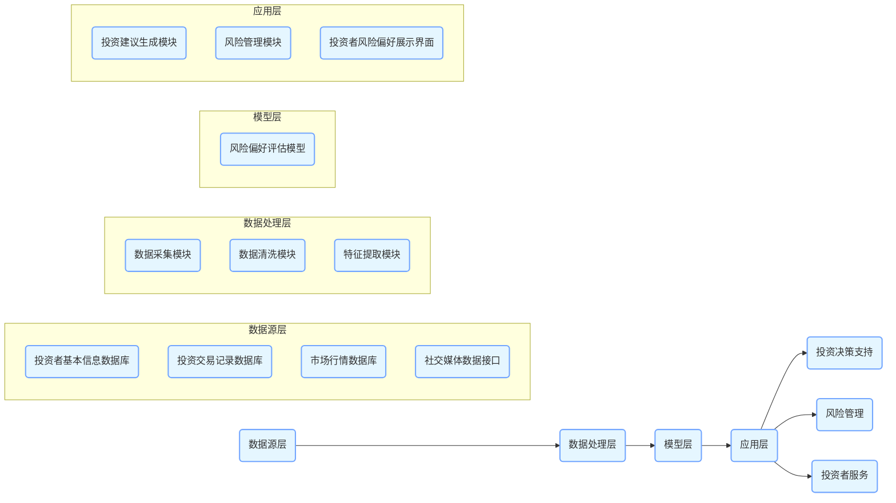

# 智能投资者风险偏好动态评估系统

> 关键词：智能投资者、风险偏好、动态评估系统、机器学习、金融科技

> 摘要：本文围绕智能投资者风险偏好动态评估系统展开深入探讨。该系统旨在通过对投资者多维度数据的分析，实时、准确地评估投资者的风险偏好，为金融机构提供更精准的投资建议和风险管理支持。文章详细介绍了系统的背景、核心概念、算法原理、数学模型、项目实战案例、实际应用场景等内容，同时推荐了相关的学习资源、开发工具和论文著作。最后对系统的未来发展趋势与挑战进行了总结，并提供了常见问题解答和扩展阅读参考资料。

## 1. 背景介绍 
### 1.1 目的和范围
随着金融市场的不断发展和复杂化，投资者面临着越来越多的投资选择和风险。准确了解投资者的风险偏好对于金融机构制定个性化的投资策略、进行有效的风险管理至关重要。智能投资者风险偏好动态评估系统的目的在于利用先进的信息技术和数据分析方法，实时、动态地评估投资者的风险偏好，为金融机构提供科学、准确的决策依据。

本系统的范围涵盖了投资者的基本信息、投资历史数据、市场数据、社交媒体数据等多个维度的数据，通过对这些数据的挖掘和分析，构建风险偏好评估模型，实现对投资者风险偏好的动态评估。

### 1.2 预期读者
本文的预期读者主要包括金融机构的从业人员，如投资顾问、风险管理人员、金融分析师等；信息技术领域的专业人士，如数据科学家、软件开发工程师、人工智能专家等；以及对金融科技和投资者风险偏好评估感兴趣的研究人员和学者。

### 1.3 文档结构概述
本文将按照以下结构进行组织：首先介绍系统的背景信息，包括目的、范围、预期读者和文档结构概述；接着阐述系统的核心概念与联系，包括核心概念的原理和架构，并通过文本示意图和 Mermaid 流程图进行直观展示；然后详细讲解系统所涉及的核心算法原理和具体操作步骤，同时使用 Python 源代码进行阐述；之后介绍系统的数学模型和公式，并结合具体例子进行详细说明；再通过项目实战案例，展示系统的开发环境搭建、源代码实现和代码解读；接着探讨系统的实际应用场景；推荐相关的学习资源、开发工具和论文著作；最后总结系统的未来发展趋势与挑战，提供常见问题解答和扩展阅读参考资料。

### 1.4 术语表
#### 1.4.1 核心术语定义
- **智能投资者**：指具备一定投资知识和经验，能够理性做出投资决策的投资者。
- **风险偏好**：投资者在面对投资风险时的态度和倾向，包括风险厌恶、风险中性和风险偏好三种类型。
- **动态评估**：指在不同时间点对投资者的风险偏好进行实时、持续的评估，以反映投资者风险偏好的变化。
- **机器学习**：一门多领域交叉学科，涉及概率论、统计学、逼近论、凸分析、算法复杂度理论等多门学科。它专门研究计算机怎样模拟或实现人类的学习行为，以获取新的知识或技能，重新组织已有的知识结构使之不断改善自身的性能。
- **金融科技**：是指技术带来的金融创新，它能创造新的业务模式、应用、流程或产品，从而对金融市场、金融机构或金融服务的提供方式产生重大影响。

#### 1.4.2 相关概念解释
- **投资组合理论**：由美国经济学家马科维茨（Harry Markowitz）于 1952 年提出，该理论认为投资者可以通过分散投资来降低风险，即在一定的预期收益率下，选择风险最小的投资组合。
- **行为金融学**：将心理学、社会学等学科的研究成果引入金融学领域，研究投资者在金融市场中的决策行为和心理特征，解释金融市场中的异常现象。
- **大数据分析**：指对海量数据进行采集、存储、管理、分析和可视化的过程，以发现数据中的规律和价值。

#### 1.4.3 缩略词列表
- **AI**：Artificial Intelligence，人工智能
- **ML**：Machine Learning，机器学习
- **API**：Application Programming Interface，应用程序编程接口
- **ETF**：Exchange Traded Fund，交易型开放式指数基金

## 2. 核心概念与联系 

### 核心概念原理
智能投资者风险偏好动态评估系统的核心原理是通过对投资者多维度数据的收集、整理和分析，构建风险偏好评估模型，实现对投资者风险偏好的动态评估。系统主要涉及以下几个核心概念：

- **数据采集**：从多个数据源收集投资者的相关数据，包括基本信息、投资历史数据、市场数据、社交媒体数据等。
- **数据预处理**：对采集到的数据进行清洗、转换和特征提取，以提高数据的质量和可用性。
- **模型构建**：利用机器学习算法构建风险偏好评估模型，根据投资者的数据特征预测其风险偏好。
- **动态评估**：在不同时间点对投资者的数据进行更新，重新评估其风险偏好，以反映投资者风险偏好的变化。

### 架构的文本示意图
```plaintext
智能投资者风险偏好动态评估系统架构

数据源层：
- 投资者基本信息数据库
- 投资交易记录数据库
- 市场行情数据库
- 社交媒体数据接口

数据处理层：
- 数据采集模块
- 数据清洗模块
- 特征提取模块

模型层：
- 风险偏好评估模型（机器学习算法）

应用层：
- 投资建议生成模块
- 风险管理模块
- 投资者风险偏好展示界面
```

### Mermaid 流程图


## 3. 核心算法原理 & 具体操作步骤 

### 核心算法原理
在智能投资者风险偏好动态评估系统中，我们可以使用多种机器学习算法来构建风险偏好评估模型，如逻辑回归、决策树、随机森林、支持向量机等。这里以逻辑回归算法为例进行详细讲解。

逻辑回归是一种广义线性回归模型，主要用于二分类问题。在风险偏好评估中，我们可以将投资者的风险偏好分为高风险偏好和低风险偏好两类。逻辑回归通过对输入特征进行线性组合，然后使用逻辑函数将线性组合的结果映射到 0 到 1 之间的概率值，根据概率值来判断投资者的风险偏好类型。

逻辑回归的数学表达式为：

$$P(y=1|x)=\frac{1}{1 + e^{-(w_0 + w_1x_1 + w_2x_2 + \cdots + w_nx_n)}}$$

其中，$P(y=1|x)$ 表示在输入特征 $x$ 下，投资者属于高风险偏好类型（$y = 1$）的概率；$w_0, w_1, w_2, \cdots, w_n$ 是模型的参数；$x_1, x_2, \cdots, x_n$ 是输入特征。

### 具体操作步骤
以下是使用 Python 实现逻辑回归算法进行风险偏好评估的具体操作步骤：

```python
import pandas as pd
from sklearn.model_selection import train_test_split
from sklearn.linear_model import LogisticRegression
from sklearn.metrics import accuracy_score

# 步骤 1：数据加载
data = pd.read_csv('investor_data.csv')

# 步骤 2：数据预处理
# 分离特征和标签
X = data.drop('risk_preference', axis=1)
y = data['risk_preference']

# 划分训练集和测试集
X_train, X_test, y_train, y_test = train_test_split(X, y, test_size=0.2, random_state=42)

# 步骤 3：模型训练
# 创建逻辑回归模型
model = LogisticRegression()

# 训练模型
model.fit(X_train, y_train)

# 步骤 4：模型预测
# 在测试集上进行预测
y_pred = model.predict(X_test)

# 步骤 5：模型评估
# 计算准确率
accuracy = accuracy_score(y_test, y_pred)
print(f"模型准确率: {accuracy}")
```

### 代码解释
1. **数据加载**：使用 `pandas` 库的 `read_csv` 函数从 CSV 文件中加载投资者数据。
2. **数据预处理**：分离特征和标签，然后使用 `train_test_split` 函数将数据集划分为训练集和测试集。
3. **模型训练**：创建逻辑回归模型对象，并使用训练集数据对模型进行训练。
4. **模型预测**：使用训练好的模型对测试集数据进行预测。
5. **模型评估**：使用 `accuracy_score` 函数计算模型的准确率，评估模型的性能。

## 4. 数学模型和公式 & 详细讲解 & 举例说明 

### 逻辑回归模型的数学原理
逻辑回归模型的核心是逻辑函数（也称为 sigmoid 函数），其数学表达式为：

$$\sigma(z)=\frac{1}{1 + e^{-z}}$$

其中，$z$ 是线性组合的结果，即 $z = w_0 + w_1x_1 + w_2x_2 + \cdots + w_nx_n$。

逻辑函数的图像是一个 S 形曲线，其取值范围在 0 到 1 之间。当 $z$ 趋近于正无穷时，$\sigma(z)$ 趋近于 1；当 $z$ 趋近于负无穷时，$\sigma(z)$ 趋近于 0。

逻辑回归模型的目标是找到一组最优的参数 $w_0, w_1, w_2, \cdots, w_n$，使得模型对训练数据的预测概率尽可能接近真实标签。为了实现这一目标，我们通常使用最大似然估计方法来求解模型的参数。

最大似然估计的基本思想是：给定一组训练数据 $(x_1, y_1), (x_2, y_2), \cdots, (x_m, y_m)$，我们希望找到一组参数 $w$，使得这组数据出现的概率最大。逻辑回归模型的似然函数可以表示为：

$$L(w)=\prod_{i=1}^{m}P(y_i|x_i;w)$$

其中，$P(y_i|x_i;w)$ 表示在输入特征 $x_i$ 和参数 $w$ 下，样本 $i$ 的真实标签 $y_i$ 出现的概率。

为了方便计算，我们通常对似然函数取对数，得到对数似然函数：

$$\ln L(w)=\sum_{i=1}^{m}\ln P(y_i|x_i;w)$$

最大似然估计的目标是最大化对数似然函数，即：

$$\max_{w}\ln L(w)$$

在实际应用中，我们通常使用梯度下降法等优化算法来求解最大似然估计问题，找到最优的参数 $w$。

### 举例说明
假设我们有一个简单的投资者数据集，包含两个特征：年龄和投资经验，以及一个标签：风险偏好（0 表示低风险偏好，1 表示高风险偏好）。数据集如下：

| 年龄 | 投资经验（年） | 风险偏好 |
|------|----------------|----------|
| 25   | 2              | 1        |
| 30   | 5              | 1        |
| 40   | 10             | 0        |
| 50   | 15             | 0        |

我们可以使用逻辑回归模型来预测投资者的风险偏好。以下是使用 Python 实现的代码：

```python
import numpy as np
from sklearn.linear_model import LogisticRegression

# 定义特征和标签
X = np.array([[25, 2], [30, 5], [40, 10], [50, 15]])
y = np.array([1, 1, 0, 0])

# 创建逻辑回归模型
model = LogisticRegression()

# 训练模型
model.fit(X, y)

# 预测新投资者的风险偏好
new_investor = np.array([[35, 7]])
prediction = model.predict(new_investor)
print(f"新投资者的风险偏好预测结果: {prediction[0]}")
```

在这个例子中，我们使用逻辑回归模型对新投资者的风险偏好进行了预测。根据模型的预测结果，我们可以为投资者提供相应的投资建议。

## 5. 项目实战：代码实际案例和详细解释说明 

### 5.1  开发环境搭建
在进行智能投资者风险偏好动态评估系统的开发之前，我们需要搭建相应的开发环境。以下是具体的搭建步骤：

1. **安装 Python**：建议使用 Python 3.7 及以上版本。可以从 Python 官方网站（https://www.python.org/downloads/）下载并安装 Python。
2. **安装必要的库**：使用 `pip` 命令安装以下必要的库：
```bash
pip install pandas numpy scikit-learn matplotlib seaborn
```
3. **选择开发工具**：可以选择使用 PyCharm、Jupyter Notebook 等开发工具进行代码编写和调试。

### 5.2  源代码详细实现和代码解读
以下是一个完整的智能投资者风险偏好动态评估系统的源代码实现：

```python
import pandas as pd
import numpy as np
from sklearn.model_selection import train_test_split
from sklearn.linear_model import LogisticRegression
from sklearn.metrics import accuracy_score, classification_report
import matplotlib.pyplot as plt
import seaborn as sns

# 步骤 1：数据加载
data = pd.read_csv('investor_data.csv')

# 步骤 2：数据探索与可视化
# 查看数据基本信息
print("数据基本信息：")
data.info()

# 查看数据集行数和列数
rows, columns = data.shape

if rows < 100:
    # 小样本数据（行数少于100）查看全量数据信息
    print("数据全部内容信息：")
    print(data.to_csv(sep='\t', na_rep='nan'))
else:
    # 大样本数据查看数据前几行信息
    print("数据前几行内容信息：")
    print(data.head().to_csv(sep='\t', na_rep='nan'))

# 查看数据集行数和列数
rows, columns = data.shape

# 分离特征和标签
X = data.drop('risk_preference', axis=1)
y = data['risk_preference']

# 步骤 3：数据预处理
# 划分训练集和测试集
X_train, X_test, y_train, y_test = train_test_split(X, y, test_size=0.2, random_state=42)

# 步骤 4：模型训练
# 创建逻辑回归模型
model = LogisticRegression()

# 训练模型
model.fit(X_train, y_train)

# 步骤 5：模型预测
# 在测试集上进行预测
y_pred = model.predict(X_test)

# 步骤 6：模型评估
# 计算准确率
accuracy = accuracy_score(y_test, y_pred)
print(f"模型准确率: {accuracy}")

# 打印分类报告
print("分类报告:")
print(classification_report(y_test, y_pred))

# 步骤 7：可视化
# 绘制混淆矩阵
from sklearn.metrics import confusion_matrix
cm = confusion_matrix(y_test, y_pred)
plt.figure(figsize=(8, 6))
sns.heatmap(cm, annot=True, fmt='d', cmap='Blues')
plt.xlabel('预测标签')
plt.ylabel('真实标签')
plt.title('混淆矩阵')
plt.show()
```

### 代码解读与分析
1. **数据加载**：使用 `pandas` 库的 `read_csv` 函数从 CSV 文件中加载投资者数据。
2. **数据探索与可视化**：查看数据的基本信息和前几行内容，对数据有一个初步的了解。
3. **数据预处理**：分离特征和标签，然后使用 `train_test_split` 函数将数据集划分为训练集和测试集。
4. **模型训练**：创建逻辑回归模型对象，并使用训练集数据对模型进行训练。
5. **模型预测**：使用训练好的模型对测试集数据进行预测。
6. **模型评估**：使用 `accuracy_score` 函数计算模型的准确率，使用 `classification_report` 函数打印分类报告，评估模型的性能。
7. **可视化**：使用 `confusion_matrix` 函数计算混淆矩阵，并使用 `seaborn` 库的 `heatmap` 函数绘制混淆矩阵的热力图，直观地展示模型的预测结果。

## 6. 实际应用场景 
智能投资者风险偏好动态评估系统在金融领域有着广泛的实际应用场景，以下是一些主要的应用场景：

### 投资顾问服务
金融机构可以使用该系统对投资者的风险偏好进行动态评估，为投资者提供个性化的投资建议。根据投资者的风险偏好，投资顾问可以为投资者推荐适合的投资产品和投资组合，提高投资的成功率和回报率。

### 风险管理
金融机构可以利用该系统实时监测投资者的风险偏好变化，及时调整投资组合，降低投资风险。例如，当投资者的风险偏好发生变化时，金融机构可以及时调整投资组合的资产配置，以适应投资者的新风险偏好。

### 产品设计与营销
金融机构可以根据投资者的风险偏好数据，设计出更符合投资者需求的金融产品。同时，在产品营销过程中，金融机构可以根据投资者的风险偏好进行精准营销，提高营销效果和客户满意度。

### 投资者教育
该系统可以为投资者提供风险偏好评估报告，帮助投资者了解自己的风险承受能力和投资风格。通过投资者教育，投资者可以更加理性地进行投资决策，避免盲目投资和过度冒险。

## 7. 工具和资源推荐
### 7.1 学习资源推荐
#### 7.1.1 书籍推荐
- 《机器学习》（周志华著）：这本书是机器学习领域的经典教材，全面介绍了机器学习的基本概念、算法和应用。
- 《Python 数据分析实战》（Sebastian Raschka 著）：本书通过实际案例介绍了如何使用 Python 进行数据分析，包括数据处理、数据可视化、机器学习等方面的内容。
- 《金融科技：应用与创新》（谢平、邹传伟著）：本书介绍了金融科技的基本概念、技术和应用，包括区块链、人工智能、大数据等在金融领域的应用。

#### 7.1.2 在线课程
- Coursera 上的“机器学习”课程（Andrew Ng 教授主讲）：这是一门非常经典的机器学习在线课程，系统地介绍了机器学习的基本概念、算法和应用。
- edX 上的“Python 数据科学”课程：该课程介绍了如何使用 Python 进行数据科学研究，包括数据处理、数据分析、机器学习等方面的内容。
- 中国大学 MOOC 上的“金融科技概论”课程：该课程介绍了金融科技的基本概念、技术和应用，适合对金融科技感兴趣的初学者。

#### 7.1.3 技术博客和网站
- Medium：这是一个技术博客平台，上面有很多关于机器学习、金融科技等领域的优质文章。
- Towards Data Science：这是一个专注于数据科学和机器学习的博客网站，上面有很多关于数据科学和机器学习的技术文章和案例分析。
- 金融科技前沿：这是一个专注于金融科技领域的网站，上面有很多关于金融科技的最新动态、研究报告和案例分析。

### 7.2 开发工具框架推荐
#### 7.2.1 IDE和编辑器
- PyCharm：这是一款专门为 Python 开发设计的集成开发环境（IDE），具有代码编辑、调试、版本控制等功能，非常适合 Python 开发。
- Jupyter Notebook：这是一个交互式的开发环境，支持多种编程语言，包括 Python、R 等。它可以方便地进行数据探索、数据分析和模型训练。
- Visual Studio Code：这是一款轻量级的代码编辑器，支持多种编程语言和插件扩展，具有丰富的功能和良好的用户体验。

#### 7.2.2 调试和性能分析工具
- PySnooper：这是一个简单易用的 Python 调试工具，可以自动记录函数的执行过程和变量的值，方便调试代码。
- cProfile：这是 Python 内置的性能分析工具，可以分析代码的执行时间和函数调用情况，帮助优化代码性能。
- TensorBoard：这是 TensorFlow 提供的一个可视化工具，可以用于可视化模型的训练过程、损失函数曲线、模型结构等，方便调试和优化模型。

#### 7.2.3 相关框架和库
- Pandas：这是一个强大的数据分析库，提供了高效的数据结构和数据处理工具，适合进行数据清洗、转换和分析。
- NumPy：这是一个基础的科学计算库，提供了高效的多维数组对象和数学函数，适合进行数值计算和矩阵运算。
- Scikit-learn：这是一个简单易用的机器学习库，提供了丰富的机器学习算法和工具，适合进行机器学习模型的训练和评估。

### 7.3 相关论文著作推荐
#### 7.3.1 经典论文
- Markowitz, H. M. (1952). Portfolio selection. The journal of finance, 7(1), 77-91. 这篇论文提出了投资组合理论，为现代金融理论的发展奠定了基础。
- Fama, E. F., & French, K. R. (1992). The cross-section of expected stock returns. The Journal of Finance, 47(2), 427-465. 这篇论文提出了 Fama-French 三因子模型，用于解释股票收益率的横截面差异。
- Kahneman, D., & Tversky, A. (1979). Prospect theory: An analysis of decision under risk. Econometrica: Journal of the Econometric Society, 263-291. 这篇论文提出了前景理论，解释了人们在面对风险时的决策行为。

#### 7.3.2 最新研究成果
- Barberis, N., & Huang, M. (2008). Stocks as lotteries: The implications of probability weighting for security prices. American Economic Review, 98(5), 2066-2100. 这篇论文研究了概率加权对股票价格的影响，为行为金融学的研究提供了新的视角。
- Giglio, S., Maggiori, M., & Stroebel, J. (2019). Rare disasters and asset markets: An empirical exploration. Journal of Financial Economics, 134(2), 271-298. 这篇论文实证研究了罕见灾难对资产市场的影响，为风险管理提供了新的思路。
- Bengio, Y., Goodfellow, I. J., & Courville, A. (2016). Deep learning. MIT press. 这本书全面介绍了深度学习的基本概念、算法和应用，是深度学习领域的经典著作。

#### 7.3.3 应用案例分析
- “蚂蚁金服的智能投顾服务”：蚂蚁金服利用智能投资者风险偏好动态评估系统，为用户提供个性化的投资建议和资产配置方案，提高了用户的投资体验和回报率。
- “招商银行的风险管理系统”：招商银行利用该系统实时监测客户的风险偏好变化，及时调整投资组合，降低了投资风险，提高了风险管理水平。

## 8. 总结：未来发展趋势与挑战
### 未来发展趋势
- **多模态数据融合**：未来的智能投资者风险偏好动态评估系统将不仅仅依赖于传统的金融数据，还将融合社交媒体数据、传感器数据等多模态数据，以更全面、准确地评估投资者的风险偏好。
- **深度学习技术的应用**：深度学习技术在图像识别、自然语言处理等领域取得了巨大的成功，未来将在投资者风险偏好评估领域得到更广泛的应用。例如，使用深度学习模型对投资者的文本数据进行情感分析，以更好地了解投资者的情绪和风险偏好。
- **个性化服务的提升**：随着人工智能技术的不断发展，未来的系统将能够为投资者提供更加个性化的服务。例如，根据投资者的风险偏好和投资目标，为投资者定制专属的投资策略和投资组合。
- **与区块链技术的结合**：区块链技术具有去中心化、不可篡改、安全可靠等特点，未来的系统可能会与区块链技术相结合，实现投资者数据的安全共享和可信交易。

### 挑战
- **数据质量和隐私问题**：智能投资者风险偏好动态评估系统需要大量的高质量数据来进行模型训练和评估。然而，数据质量问题和隐私保护问题一直是制约系统发展的重要因素。如何保证数据的准确性、完整性和安全性，以及如何在保护投资者隐私的前提下进行数据挖掘和分析，是未来需要解决的重要问题。
- **模型解释性问题**：机器学习模型，尤其是深度学习模型，往往被视为“黑匣子”，其决策过程难以解释。在金融领域，模型的解释性非常重要，因为投资者需要了解模型的决策依据，以便做出合理的投资决策。如何提高模型的解释性，是未来需要解决的另一个重要问题。
- **技术更新换代快**：信息技术领域的技术更新换代非常快，新的算法和模型不断涌现。智能投资者风险偏好动态评估系统需要不断跟进技术发展的步伐，及时采用新的技术和方法，以提高系统的性能和竞争力。

## 9. 附录：常见问题与解答
### 问题 1：智能投资者风险偏好动态评估系统的评估结果准确吗？
答：系统的评估结果准确性受到多种因素的影响，包括数据质量、模型选择和参数调整等。在实际应用中，我们可以通过不断优化数据和模型，提高评估结果的准确性。同时，评估结果也可以作为参考，结合人工判断和其他信息，做出更合理的投资决策。

### 问题 2：系统需要哪些类型的数据？
答：系统需要投资者的基本信息、投资历史数据、市场数据、社交媒体数据等多维度的数据。这些数据可以从金融机构的数据库、第三方数据提供商、社交媒体平台等渠道获取。

### 问题 3：如何保证投资者数据的安全和隐私？
答：在数据采集和处理过程中，我们采用了多种安全技术和措施，如数据加密、访问控制、匿名化处理等，以保证投资者数据的安全和隐私。同时，我们也严格遵守相关的法律法规和行业规范，确保数据的合法使用。

### 问题 4：系统可以应用于哪些金融机构？
答：系统可以应用于银行、证券、基金、保险等各类金融机构。金融机构可以根据自身的业务需求和特点，对系统进行定制化开发和应用，以提高投资决策的科学性和风险管理的有效性。

## 10. 扩展阅读 & 参考资料
- 《人工智能：现代方法》（Stuart Russell、Peter Norvig 著）
- 《金融科技时代的风险管理》（陈忠阳著）
- Kaggle 网站上的金融数据分析竞赛项目
- arXiv 上关于金融科技和机器学习的研究论文

作者：AI天才研究院/AI Genius Institute & 禅与计算机程序设计艺术 /Zen And The Art of Computer Programming