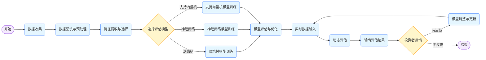

# 智能投资者风险承受能力动态评估

> 关键词：智能投资者、风险承受能力、动态评估、金融科技、机器学习

> 摘要：本文聚焦于智能投资者风险承受能力的动态评估。在金融市场复杂多变的背景下，准确且动态地评估投资者的风险承受能力对于投资决策、资产配置以及金融机构的风险管理至关重要。文章首先介绍了研究的背景、目的、预期读者和文档结构等信息，接着阐述了核心概念及其联系，详细讲解了核心算法原理和具体操作步骤，通过数学模型和公式进行深入分析并举例说明。然后通过项目实战展示代码案例及解读，探讨了实际应用场景。此外，还推荐了相关的学习资源、开发工具框架和论文著作。最后总结了未来发展趋势与挑战，并提供常见问题解答和扩展阅读参考资料，旨在为金融从业者、投资者和相关研究人员提供全面而深入的关于智能投资者风险承受能力动态评估的知识和方法。

## 1. 背景介绍 
### 1.1 目的和范围
在当今金融市场中，投资者面临着各种各样的投资选择和风险。准确评估投资者的风险承受能力是实现合理资产配置、保障投资者利益和维护金融市场稳定的关键。传统的风险承受能力评估方法往往是静态的，难以适应市场的快速变化和投资者自身情况的动态调整。本研究的目的在于开发一种智能的、动态的投资者风险承受能力评估方法，以更精准地反映投资者在不同时间和市场环境下的风险承受能力。

本研究的范围涵盖了多种投资领域，包括股票、债券、基金等常见金融产品。研究将综合考虑投资者的个人特征、财务状况、投资经验、市场环境等多方面因素，运用先进的数据分析和机器学习技术构建动态评估模型。

### 1.2 预期读者
本文的预期读者主要包括以下几类：
- **金融从业者**：如投资顾问、理财经理、金融分析师等，他们需要准确评估客户的风险承受能力，为客户提供个性化的投资建议和资产配置方案。
- **投资者**：无论是个人投资者还是机构投资者，了解自身的风险承受能力动态变化有助于做出更明智的投资决策。
- **金融科技公司开发者**：致力于开发智能投资相关产品和服务的技术人员，可从本文中获取关于风险承受能力动态评估的技术思路和方法。
- **学术研究人员**：对金融风险管理、行为金融学等领域感兴趣的学者，可将本文作为研究参考，进一步探索相关理论和方法。

### 1.3 文档结构概述
本文将按照以下结构展开：
- 核心概念与联系：介绍与智能投资者风险承受能力动态评估相关的核心概念，包括风险承受能力、动态评估等，并阐述它们之间的联系，同时提供文本示意图和 Mermaid 流程图。
- 核心算法原理 & 具体操作步骤：详细讲解用于动态评估的核心算法原理，并用 Python 源代码进行阐述，同时给出具体的操作步骤。
- 数学模型和公式 & 详细讲解 & 举例说明：运用数学模型和公式对动态评估过程进行描述和分析，并通过具体例子进行说明。
- 项目实战：代码实际案例和详细解释说明，包括开发环境搭建、源代码详细实现和代码解读。
- 实际应用场景：探讨智能投资者风险承受能力动态评估在金融领域的实际应用场景。
- 工具和资源推荐：推荐相关的学习资源、开发工具框架和论文著作。
- 总结：未来发展趋势与挑战：总结智能投资者风险承受能力动态评估的发展趋势，并分析面临的挑战。
- 附录：常见问题与解答：对常见问题进行解答，帮助读者更好地理解和应用相关知识。
- 扩展阅读 & 参考资料：提供扩展阅读的建议和参考资料，方便读者进一步深入研究。

### 1.4 术语表
#### 1.4.1 核心术语定义
- **智能投资者**：具备一定投资知识和经验，能够运用智能技术和数据分析方法进行投资决策的投资者。
- **风险承受能力**：投资者在面对投资风险时所能承受的最大损失程度，通常与投资者的个人特征、财务状况、投资目标等因素相关。
- **动态评估**：随着时间和市场环境的变化，对投资者风险承受能力进行实时、连续的评估和更新。
- **资产配置**：根据投资者的风险承受能力和投资目标，将资金分配到不同的资产类别（如股票、债券、基金等）中，以实现风险和收益的平衡。

#### 1.4.2 相关概念解释
- **风险偏好**：投资者对风险的态度和倾向，可分为保守型、稳健型、激进型等不同类型。风险偏好与风险承受能力密切相关，但两者并不完全相同。风险偏好更多地反映投资者的主观意愿，而风险承受能力则更侧重于投资者的客观承受能力。
- **市场环境**：指金融市场的整体状况，包括市场行情、利率水平、宏观经济数据等因素。市场环境的变化会对投资者的风险承受能力产生影响。
- **机器学习**：一门多领域交叉学科，涉及概率论、统计学、逼近论、凸分析、算法复杂度理论等多门学科。它专门研究计算机怎样模拟或实现人类的学习行为，以获取新的知识或技能，重新组织已有的知识结构使之不断改善自身的性能。在本研究中，机器学习技术将用于构建风险承受能力动态评估模型。

#### 1.4.3 缩略词列表
- **AI**：Artificial Intelligence，人工智能
- **ML**：Machine Learning，机器学习
- **VAR**：Value at Risk，风险价值

## 2. 核心概念与联系 
### 核心概念原理
智能投资者风险承受能力动态评估的核心在于综合考虑多个因素，实时反映投资者在不同情境下的风险承受能力。其原理基于以下几个方面：
- **多因素综合考量**：投资者的风险承受能力受到多种因素的影响，包括个人特征（如年龄、性别、职业等）、财务状况（如收入、资产、负债等）、投资经验（如投资年限、投资品种等）和市场环境（如市场波动、利率变化等）。通过对这些因素的综合分析，可以更全面地了解投资者的风险承受能力。
- **动态更新机制**：由于投资者的情况和市场环境都在不断变化，因此风险承受能力评估需要建立动态更新机制。通过实时收集和分析相关数据，及时调整评估结果，以反映最新的风险承受能力状况。
- **智能算法应用**：运用机器学习、人工智能等智能算法对大量的历史数据和实时数据进行分析和建模，挖掘数据中的潜在规律和模式，从而提高评估的准确性和可靠性。

### 架构的文本示意图
```plaintext
智能投资者风险承受能力动态评估系统架构

数据源层：
|-- 投资者个人信息数据库（年龄、性别、职业等）
|-- 投资者财务信息数据库（收入、资产、负债等）
|-- 投资者投资记录数据库（投资年限、投资品种、交易记录等）
|-- 市场数据接口（股票价格、债券收益率、宏观经济数据等）

数据处理层：
|-- 数据清洗与预处理（去除噪声、缺失值处理、数据标准化等）
|-- 特征提取与选择（从原始数据中提取有价值的特征，并选择最相关的特征用于模型训练）

模型构建层：
|-- 机器学习模型（如决策树、神经网络、支持向量机等）
|-- 模型训练与优化（使用历史数据对模型进行训练，并通过交叉验证等方法优化模型参数）

评估结果输出层：
|-- 实时风险承受能力评估结果（以数值或等级形式呈现）
|-- 评估结果可视化（通过图表、报表等形式直观展示评估结果）

反馈与调整层：
|-- 投资者反馈信息收集（投资者对评估结果的意见和建议）
|-- 模型调整与更新（根据投资者反馈和市场变化，对模型进行调整和更新）
```

### Mermaid 流程图


## 3. 核心算法原理 & 具体操作步骤 
### 核心算法原理
在智能投资者风险承受能力动态评估中，我们可以使用多种机器学习算法，这里以决策树算法为例进行详细讲解。

决策树是一种基于树结构进行决策的模型，它通过对数据的特征进行划分，逐步构建出一个决策树。每个内部节点表示一个特征上的测试，每个分支表示测试输出，每个叶节点表示一个类别或值。决策树算法的核心思想是通过递归地选择最优特征进行划分，使得划分后的子集尽可能地“纯”，即属于同一类别的样本尽可能地集中在一起。

在风险承受能力动态评估中，我们可以将投资者的各种特征（如年龄、收入、投资经验等）作为输入，将风险承受能力等级（如保守型、稳健型、激进型等）作为输出，构建一个决策树模型。通过对历史数据的学习，决策树模型可以找到特征与风险承受能力等级之间的关系，从而对新的投资者进行风险承受能力评估。

### Python 源代码实现
```python
import pandas as pd
from sklearn.tree import DecisionTreeClassifier
from sklearn.model_selection import train_test_split
from sklearn.metrics import accuracy_score

# 加载数据集
data = pd.read_csv('investor_data.csv')

# 分离特征和标签
X = data.drop('risk_tolerance', axis=1)
y = data['risk_tolerance']

# 划分训练集和测试集
X_train, X_test, y_train, y_test = train_test_split(X, y, test_size=0.2, random_state=42)

# 创建决策树分类器
clf = DecisionTreeClassifier()

# 训练模型
clf.fit(X_train, y_train)

# 预测测试集
y_pred = clf.predict(X_test)

# 计算准确率
accuracy = accuracy_score(y_test, y_pred)
print(f"模型准确率: {accuracy}")
```

### 具体操作步骤
1. **数据收集**：收集投资者的相关数据，包括个人信息、财务信息、投资记录等，并将其整理成结构化的数据文件（如 CSV 文件）。
2. **数据预处理**：对收集到的数据进行清洗和预处理，包括去除噪声、处理缺失值、数据标准化等操作，以提高数据的质量和可用性。
3. **特征提取与选择**：从预处理后的数据中提取有价值的特征，并选择最相关的特征用于模型训练。可以使用相关性分析、特征重要性排序等方法进行特征选择。
4. **模型训练**：使用训练集数据对决策树模型进行训练，通过调整模型的参数（如树的深度、最小样本数等）来优化模型的性能。
5. **模型评估**：使用测试集数据对训练好的模型进行评估，计算模型的准确率、召回率、F1 值等指标，以评估模型的性能。
6. **动态评估**：将实时收集到的投资者数据输入到训练好的模型中，进行动态评估，输出投资者的风险承受能力等级。
7. **模型更新**：根据投资者的反馈和市场变化，定期对模型进行更新和调整，以保证模型的准确性和可靠性。

## 4. 数学模型和公式 & 详细讲解 & 举例说明 
### 信息熵
在决策树算法中，信息熵是一个重要的概念，用于衡量数据的不确定性。信息熵的计算公式如下：
$$
H(X) = -\sum_{i=1}^{n} p(x_i) \log_2 p(x_i)
$$
其中，$X$ 是一个离散随机变量，$p(x_i)$ 是 $X$ 取值为 $x_i$ 的概率，$n$ 是 $X$ 的取值个数。

信息熵越大，说明数据的不确定性越大；信息熵越小，说明数据的纯度越高。

### 信息增益
信息增益是决策树算法中用于选择最优特征的指标，它表示在使用某个特征进行划分后，数据的不确定性减少的程度。信息增益的计算公式如下：
$$
IG(D, A) = H(D) - \sum_{v \in Values(A)} \frac{|D^v|}{|D|} H(D^v)
$$
其中，$D$ 是数据集，$A$ 是特征，$Values(A)$ 是特征 $A$ 的取值集合，$D^v$ 是数据集 $D$ 中特征 $A$ 取值为 $v$ 的子集，$|D|$ 表示数据集 $D$ 的样本数量，$|D^v|$ 表示子集 $D^v$ 的样本数量。

信息增益越大，说明使用该特征进行划分后，数据的纯度提高得越多，因此该特征越适合作为划分特征。

### 详细讲解
在决策树的构建过程中，我们通过递归地选择信息增益最大的特征进行划分，直到满足终止条件（如树的深度达到最大、样本数量小于某个阈值等）。具体步骤如下：
1. 计算数据集的信息熵 $H(D)$。
2. 对于每个特征 $A$，计算其信息增益 $IG(D, A)$。
3. 选择信息增益最大的特征作为当前节点的划分特征。
4. 根据该特征的取值将数据集划分为多个子集。
5. 对每个子集递归地重复步骤 1 - 4，直到满足终止条件。

### 举例说明
假设我们有一个包含 10 个样本的数据集，每个样本有两个特征 $A$ 和 $B$，以及一个类别标签 $C$，如下表所示：

| 样本编号 | 特征 A | 特征 B | 类别标签 C |
|----------|--------|--------|------------|
| 1        | 0      | 1      | 0          |
| 2        | 0      | 0      | 0          |
| 3        | 1      | 1      | 1          |
| 4        | 1      | 0      | 1          |
| 5        | 0      | 1      | 0          |
| 6        | 0      | 0      | 0          |
| 7        | 1      | 1      | 1          |
| 8        | 1      | 0      | 1          |
| 9        | 0      | 1      | 0          |
| 10       | 0      | 0      | 0          |

首先，计算数据集的信息熵 $H(D)$：
$$
p(C = 0) = \frac{6}{10} = 0.6
$$
$$
p(C = 1) = \frac{4}{10} = 0.4
$$
$$
H(D) = -0.6 \log_2 0.6 - 0.4 \log_2 0.4 \approx 0.971
$$

然后，分别计算特征 $A$ 和特征 $B$ 的信息增益：

对于特征 $A$：
$$
|D^{A = 0}| = 6, |D^{A = 1}| = 4
$$
$$
p(C = 0 | A = 0) = \frac{6}{6} = 1, p(C = 1 | A = 0) = 0
$$
$$
p(C = 0 | A = 1) = 0, p(C = 1 | A = 1) = \frac{4}{4} = 1
$$
$$
H(D^{A = 0}) = -1 \log_2 1 - 0 \log_2 0 = 0
$$
$$
H(D^{A = 1}) = -0 \log_2 0 - 1 \log_2 1 = 0
$$
$$
IG(D, A) = H(D) - \frac{6}{10} H(D^{A = 0}) - \frac{4}{10} H(D^{A = 1}) = 0.971 - \frac{6}{10} \times 0 - \frac{4}{10} \times 0 = 0.971
$$

对于特征 $B$：
$$
|D^{B = 0}| = 5, |D^{B = 1}| = 5
$$
$$
p(C = 0 | B = 0) = \frac{4}{5} = 0.8, p(C = 1 | B = 0) = \frac{1}{5} = 0.2
$$
$$
p(C = 0 | B = 1) = \frac{2}{5} = 0.4, p(C = 1 | B = 1) = \frac{3}{5} = 0.6
$$
$$
H(D^{B = 0}) = -0.8 \log_2 0.8 - 0.2 \log_2 0.2 \approx 0.722
$$
$$
H(D^{B = 1}) = -0.4 \log_2 0.4 - 0.6 \log_2 0.6 \approx 0.971
$$
$$
IG(D, B) = H(D) - \frac{5}{10} H(D^{B = 0}) - \frac{5}{10} H(D^{B = 1}) = 0.971 - \frac{5}{10} \times 0.722 - \frac{5}{10} \times 0.971 \approx 0.124
$$

由于 $IG(D, A) > IG(D, B)$，因此选择特征 $A$ 作为根节点的划分特征。

## 5. 项目实战：代码实际案例和详细解释说明 
### 5.1  开发环境搭建
#### 安装 Python
首先，需要安装 Python 环境。建议使用 Python 3.7 及以上版本，可以从 Python 官方网站（https://www.python.org/downloads/）下载适合自己操作系统的安装包进行安装。

#### 安装必要的库
在项目中，我们需要使用一些 Python 库，如 Pandas、Scikit-learn 等。可以使用以下命令进行安装：
```bash
pip install pandas scikit-learn
```

### 5.2  源代码详细实现和代码解读
```python
import pandas as pd
from sklearn.tree import DecisionTreeClassifier
from sklearn.model_selection import train_test_split
from sklearn.metrics import accuracy_score
import matplotlib.pyplot as plt
from sklearn.tree import plot_tree

# 加载数据集
data = pd.read_csv('investor_data.csv')

# 查看数据集基本信息
print("数据集基本信息：")
data.info()

# 查看数据集行数和列数
rows, columns = data.shape

if rows < 10:
    # 行数少于10则打印全量数据信息
    print("数据全部内容信息：")
    print(data.to_csv(sep='\t', na_rep='nan'))
else:
    # 行数多于等于10则打印数据前几行信息
    print("数据前几行内容信息：")
    print(data.head().to_csv(sep='\t', na_rep='nan'))

# 分离特征和标签
X = data.drop('risk_tolerance', axis=1)
y = data['risk_tolerance']

# 划分训练集和测试集
X_train, X_test, y_train, y_test = train_test_split(X, y, test_size=0.2, random_state=42)

# 创建决策树分类器
clf = DecisionTreeClassifier()

# 训练模型
clf.fit(X_train, y_train)

# 预测测试集
y_pred = clf.predict(X_test)

# 计算准确率
accuracy = accuracy_score(y_test, y_pred)
print(f"模型准确率: {accuracy}")

# 绘制决策树
plt.figure(figsize=(12, 8))
plot_tree(clf, feature_names=X.columns, class_names=y.unique().astype(str), filled=True)
plt.show()
```

### 5.3  代码解读与分析
1. **数据加载**：使用 `pandas` 库的 `read_csv` 函数加载数据集。
2. **数据查看**：使用 `info` 方法查看数据集的基本信息，使用 `head` 方法查看数据集的前几行信息。
3. **特征和标签分离**：使用 `drop` 方法将目标变量 `risk_tolerance` 从数据集中分离出来，得到特征矩阵 `X` 和标签向量 `y`。
4. **数据集划分**：使用 `train_test_split` 函数将数据集划分为训练集和测试集，测试集占比为 20%。
5. **模型创建与训练**：创建一个决策树分类器 `DecisionTreeClassifier`，并使用训练集数据对其进行训练。
6. **模型预测与评估**：使用训练好的模型对测试集进行预测，得到预测结果 `y_pred`，并使用 `accuracy_score` 函数计算模型的准确率。
7. **决策树可视化**：使用 `plot_tree` 函数绘制决策树，直观展示模型的决策过程。

通过以上代码，我们可以完成一个简单的投资者风险承受能力动态评估模型的训练和评估，并可视化决策树的结构。

## 6. 实际应用场景 
### 金融机构投资顾问服务
金融机构的投资顾问可以利用智能投资者风险承受能力动态评估系统，为客户提供更精准的投资建议和资产配置方案。通过实时评估客户的风险承受能力，投资顾问可以根据市场变化及时调整客户的投资组合，确保客户的投资目标与风险承受能力相匹配。

### 在线投资平台个性化推荐
在线投资平台可以根据投资者的风险承受能力动态评估结果，为投资者提供个性化的投资产品推荐。例如，对于风险承受能力较低的投资者，平台可以推荐债券基金、货币基金等低风险产品；对于风险承受能力较高的投资者，平台可以推荐股票基金、股票等较高风险产品。

### 金融监管机构风险管理
金融监管机构可以利用智能投资者风险承受能力动态评估技术，对金融市场的风险进行监测和管理。通过分析投资者的风险承受能力分布和变化情况，监管机构可以及时发现潜在的风险隐患，采取相应的监管措施，维护金融市场的稳定。

### 投资者自我评估与决策
投资者可以使用智能投资者风险承受能力动态评估工具，定期对自己的风险承受能力进行评估，了解自己在不同市场环境下的风险承受能力变化情况。这有助于投资者做出更明智的投资决策，避免因盲目投资而造成损失。

## 7. 工具和资源推荐
### 7.1 学习资源推荐
#### 7.1.1 书籍推荐
- 《机器学习》（周志华）：全面介绍了机器学习的基本概念、算法和应用，是机器学习领域的经典教材。
- 《Python 数据分析实战》（韦斯·麦金尼）：详细介绍了使用 Python 进行数据分析的方法和技巧，包括数据处理、可视化、机器学习等方面。
- 《金融科技：框架与实践》（谢平、邹传伟等）：探讨了金融科技的发展趋势、技术应用和监管问题，对金融从业者和研究者具有重要的参考价值。

#### 7.1.2 在线课程
- Coursera 上的 “机器学习” 课程（Andrew Ng 教授授课）：该课程是机器学习领域的经典在线课程，系统地介绍了机器学习的基本概念、算法和应用。
- edX 上的 “金融科技基础” 课程：该课程介绍了金融科技的基本概念、技术和应用，适合金融从业者和对金融科技感兴趣的人士学习。
- 网易云课堂上的 “Python 数据分析与机器学习实战” 课程：该课程结合实际案例，详细介绍了使用 Python 进行数据分析和机器学习的方法和技巧。

#### 7.1.3 技术博客和网站
- 机器之心（https://www.alienz.cn/）：专注于人工智能、机器学习等领域的技术报道和分析，提供了丰富的技术文章和资源。
- 数据派（https://www.datapi.cn/）：聚焦于数据分析、数据挖掘等领域，分享了大量的数据分析案例和技术文章。
- 金融科技前沿（https://www.fintechnews.net/）：关注金融科技的最新发展动态和趋势，提供了金融科技领域的行业资讯和研究报告。

### 7.2 开发工具框架推荐
#### 7.2.1 IDE和编辑器
- PyCharm：一款专业的 Python 集成开发环境，提供了代码编辑、调试、版本控制等功能，适合开发大型 Python 项目。
- Jupyter Notebook：一个交互式的开发环境，支持 Python、R 等多种编程语言，方便进行数据分析和模型开发。
- Visual Studio Code：一款轻量级的代码编辑器，支持多种编程语言和插件扩展，具有良好的开发体验。

#### 7.2.2 调试和性能分析工具
- PDB：Python 自带的调试器，可以帮助开发者在代码中设置断点、查看变量值等，进行代码调试。
- cProfile：Python 标准库中的性能分析工具，可以分析代码的执行时间和函数调用情况，帮助开发者优化代码性能。
- Scikit-learn 中的 `GridSearchCV` 和 `RandomizedSearchCV`：用于模型参数调优的工具，可以通过网格搜索和随机搜索的方式找到最优的模型参数。

#### 7.2.3 相关框架和库
- Pandas：一个强大的数据分析库，提供了数据结构和数据处理工具，方便进行数据清洗、转换和分析。
- Scikit-learn：一个常用的机器学习库，提供了丰富的机器学习算法和工具，如分类、回归、聚类等。
- TensorFlow 和 PyTorch：两个流行的深度学习框架，用于构建和训练深度学习模型，如神经网络、卷积神经网络等。

### 7.3 相关论文著作推荐
#### 7.3.1 经典论文
- 《A Decision-Theoretic Generalization of On-Line Learning and an Application to Boosting》（Yoav Freund 和 Robert E. Schapire）：提出了 AdaBoost 算法，是机器学习领域的经典论文之一。
- 《Gradient-Based Learning Applied to Document Recognition》（Yann LeCun 等）：介绍了卷积神经网络（CNN）在手写数字识别中的应用，开创了深度学习在图像识别领域的先河。
- 《Risk Tolerance and Asset Allocation: An Empirical Analysis》（John Y. Campbell 和 Luis M. Viceira）：对投资者的风险承受能力和资产配置进行了实证分析，为金融投资领域的研究提供了重要的参考。

#### 7.3.2 最新研究成果
- 《Dynamic Risk Tolerance and Portfolio Choice》（Harrison Hong 等）：研究了投资者风险承受能力的动态变化及其对投资组合选择的影响。
- 《Using Machine Learning to Predict Investor Risk Tolerance》（Richard Deaves 等）：探讨了使用机器学习技术预测投资者风险承受能力的方法和效果。
- 《Fintech and the Future of Finance》（Claudio Borio 等）：分析了金融科技对金融行业的影响和未来发展趋势。

#### 7.3.3 应用案例分析
- 《Case Studies in Financial Technology: Innovations in Payments, Lending, and Investing》（David L. Yermack）：通过实际案例分析了金融科技在支付、借贷和投资等领域的应用和创新。
- 《Financial Technology and the Transformation of the Financial Industry: A Case Study Approach》（Geoffrey Parker 等）：以案例研究的方式探讨了金融科技如何改变金融行业的商业模式和竞争格局。
- 《Risk Management in the Digital Age: Case Studies and Best Practices》（Andrew W. Lo 等）：介绍了数字化时代金融风险管理的案例和最佳实践，为金融机构的风险管理提供了借鉴。

## 8. 总结：未来发展趋势与挑战
### 未来发展趋势
- **多模态数据融合**：未来的智能投资者风险承受能力动态评估将不仅仅依赖于传统的结构化数据（如财务信息、投资记录等），还将融合多模态数据，如投资者的社交媒体数据、行为数据、生理数据等，以更全面、准确地评估投资者的风险承受能力。
- **深度学习和强化学习的应用**：随着深度学习和强化学习技术的不断发展，它们将在智能投资者风险承受能力动态评估中得到更广泛的应用。深度学习可以自动提取数据中的复杂特征，强化学习可以根据投资者的反馈和市场变化实时调整评估模型，提高评估的准确性和适应性。
- **个性化和定制化服务**：金融机构将更加注重为投资者提供个性化和定制化的风险承受能力评估服务。根据投资者的不同需求和偏好，为其提供专属的评估模型和投资建议，满足投资者的多样化需求。
- **与区块链技术的结合**：区块链技术具有去中心化、不可篡改、安全可靠等特点，将其与智能投资者风险承受能力动态评估相结合，可以提高数据的安全性和可信度，防止数据被篡改和泄露，同时实现数据的共享和流通。

### 挑战
- **数据质量和隐私保护**：多模态数据的融合需要收集大量的投资者数据，这面临着数据质量和隐私保护的挑战。如何确保数据的准确性、完整性和一致性，以及如何保护投资者的隐私和数据安全，是需要解决的重要问题。
- **模型可解释性**：深度学习和强化学习模型通常具有较高的复杂度和黑盒性，难以解释模型的决策过程和结果。在金融领域，模型的可解释性至关重要，因为投资者和监管机构需要了解模型是如何评估风险承受能力的。因此，如何提高模型的可解释性是一个亟待解决的问题。
- **市场不确定性和复杂性**：金融市场具有高度的不确定性和复杂性，市场环境的变化可能会导致投资者的风险承受能力发生变化。如何在复杂多变的市场环境中准确地评估投资者的风险承受能力，是智能投资者风险承受能力动态评估面临的一大挑战。
- **技术人才短缺**：智能投资者风险承受能力动态评估需要具备跨学科知识和技能的技术人才，包括金融、数学、统计学、计算机科学等领域。目前，这类技术人才相对短缺，如何培养和吸引更多的技术人才是推动该领域发展的关键。

## 9. 附录：常见问题与解答
### 问题 1：如何选择合适的机器学习算法进行风险承受能力评估？
答：选择合适的机器学习算法需要考虑多个因素，如数据的特点、模型的复杂度、可解释性等。对于小规模数据集和简单问题，可以选择决策树、逻辑回归等算法；对于大规模数据集和复杂问题，可以选择神经网络、支持向量机等算法。同时，还可以通过交叉验证等方法对不同算法进行比较和评估，选择性能最优的算法。

### 问题 2：动态评估模型需要多久更新一次？
答：动态评估模型的更新频率取决于多个因素，如市场变化的速度、投资者情况的变化程度等。一般来说，对于市场变化较快的情况，可以每周或每月更新一次模型；对于市场变化较慢的情况，可以每季度或每年更新一次模型。此外，当投资者的重要信息发生变化（如收入、资产、投资目标等）时，也需要及时更新模型。

### 问题 3：如何提高模型的准确率？
答：提高模型的准确率可以从以下几个方面入手：
- **数据预处理**：对数据进行清洗、缺失值处理、数据标准化等操作，提高数据的质量和可用性。
- **特征工程**：选择最相关的特征用于模型训练，并通过特征组合、特征变换等方法提取更有价值的特征。
- **模型选择和调优**：选择合适的机器学习算法，并通过交叉验证、网格搜索等方法对模型的参数进行调优。
- **集成学习**：使用集成学习方法（如随机森林、梯度提升等）将多个模型组合起来，提高模型的性能。

### 问题 4：风险承受能力评估结果的可靠性如何保证？
答：为了保证风险承受能力评估结果的可靠性，可以采取以下措施：
- **数据质量控制**：确保收集到的数据准确、完整、一致，避免数据噪声和错误对评估结果的影响。
- **模型验证和评估**：使用交叉验证、测试集评估等方法对模型进行验证和评估，确保模型的性能稳定可靠。
- **多模型融合**：使用多个不同的模型进行评估，并将评估结果进行综合分析，提高评估结果的准确性和可靠性。
- **专家经验和人工干预**：在评估过程中，结合专家的经验和判断，对评估结果进行人工干预和调整，确保评估结果符合实际情况。

## 10. 扩展阅读 & 参考资料
### 扩展阅读
- 《人工智能：现代方法》（Stuart Russell 和 Peter Norvig）：全面介绍了人工智能的基本概念、算法和应用，是人工智能领域的经典教材。
- 《金融市场学》（张亦春、郑振龙等）：系统地介绍了金融市场的基本原理、运行机制和金融工具，为理解金融投资和风险管理提供了理论基础。
- 《行为金融学》（饶育蕾、盛虎）：探讨了投资者的心理和行为对金融市场的影响，有助于深入理解投资者的风险承受能力和投资决策行为。

### 参考资料
- 《中国金融科技发展报告》：由中国金融学会金融科技专业委员会编写，对中国金融科技的发展现状、趋势和政策进行了深入分析和研究。
- 《全球金融科技发展报告》：由毕马威等机构发布，对全球金融科技的发展情况进行了跟踪和分析，提供了全球金融科技领域的最新动态和数据。
- 相关学术期刊和会议论文：如《Journal of Financial Economics》、《Review of Financial Studies》、《ACM SIGKDD Conference on Knowledge Discovery and Data Mining》等，这些期刊和会议论文发表了大量关于金融风险管理、机器学习、人工智能等领域的最新研究成果。

作者：AI天才研究院/AI Genius Institute & 禅与计算机程序设计艺术 /Zen And The Art of Computer Programming