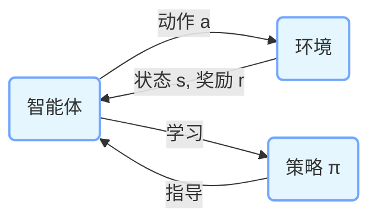

# 智能推理路径规划中强化学习的创新算法

> 关键词：智能推理、路径规划、强化学习、创新算法、马尔可夫决策过程

> 摘要：本文围绕智能推理路径规划中强化学习的创新算法展开深入研究。首先介绍了该研究的背景，包括目的、预期读者、文档结构和相关术语。接着阐述了核心概念与联系，通过文本示意图和Mermaid流程图清晰展示。详细讲解了核心算法原理及具体操作步骤，并给出Python源代码示例。同时，对数学模型和公式进行了详细讲解和举例说明。通过项目实战，给出代码实际案例并进行详细解释。分析了该算法在实际中的应用场景，推荐了相关的学习资源、开发工具框架和论文著作。最后总结了未来发展趋势与挑战，解答了常见问题，并提供了扩展阅读和参考资料，旨在为智能推理路径规划领域的研究者和开发者提供全面且深入的技术指导。

## 1. 背景介绍 
### 1.1 目的和范围
智能推理路径规划在许多领域都有着广泛的应用，如机器人导航、自动驾驶、游戏开发等。传统的路径规划算法在处理复杂环境和动态变化时往往存在一定的局限性。强化学习作为一种能够在环境中通过试错学习来优化策略的方法，为智能推理路径规划提供了新的思路和解决方案。本文的目的在于介绍智能推理路径规划中强化学习的创新算法，探讨其原理、实现步骤以及在实际应用中的效果。范围涵盖了强化学习的基本概念、核心算法原理、数学模型、项目实战以及实际应用场景等方面。

### 1.2 预期读者
本文预期读者包括计算机科学、人工智能、自动化控制等领域的研究人员、开发者以及对智能推理路径规划和强化学习感兴趣的爱好者。对于有一定编程基础和机器学习知识的读者，能够更深入地理解本文所介绍的内容；而对于初学者，通过本文也可以对该领域有一个全面的认识。

### 1.3 文档结构概述
本文将按照以下结构进行组织：首先介绍核心概念与联系，包括强化学习、智能推理路径规划等概念的原理和架构；接着详细阐述核心算法原理及具体操作步骤，并给出Python源代码示例；然后讲解数学模型和公式，并举例说明；通过项目实战展示代码实际案例并进行详细解释；分析实际应用场景；推荐相关的工具和资源；最后总结未来发展趋势与挑战，解答常见问题，并提供扩展阅读和参考资料。

### 1.4 术语表
#### 1.4.1 核心术语定义
- **强化学习（Reinforcement Learning）**：一种机器学习范式，智能体通过与环境进行交互，根据环境反馈的奖励信号来学习最优策略，以最大化长期累积奖励。
- **智能推理路径规划（Intelligent Reasoning Path Planning）**：在复杂环境中，利用智能推理方法寻找从起始点到目标点的最优或次优路径的过程。
- **马尔可夫决策过程（Markov Decision Process，MDP）**：一种用于描述强化学习问题的数学模型，由状态集、动作集、状态转移概率、奖励函数和折扣因子组成。
- **策略（Policy）**：智能体在每个状态下选择动作的规则，通常表示为 $\pi(s,a)$，表示在状态 $s$ 下选择动作 $a$ 的概率。
- **价值函数（Value Function）**：用于评估在某个状态或状态 - 动作对下的长期累积奖励，包括状态价值函数 $V(s)$ 和动作价值函数 $Q(s,a)$。

#### 1.4.2 相关概念解释
- **环境（Environment）**：智能体所处的外部世界，智能体通过与环境进行交互来获取状态信息和奖励信号。
- **智能体（Agent）**：在环境中进行决策和行动的实体，通过学习不断优化自己的策略以获得更多的奖励。
- **奖励（Reward）**：环境在智能体执行某个动作后给予的反馈信号，用于指导智能体的学习过程，正奖励表示该动作是有益的，负奖励表示该动作是不利的。
- **探索与利用（Exploration and Exploitation）**：强化学习中的一个重要问题，探索是指智能体尝试不同的动作以发现新的最优策略，利用是指智能体选择当前已知的最优动作以获得最大奖励。

#### 1.4.3 缩略词列表
- **MDP**：Markov Decision Process（马尔可夫决策过程）
- **Q - learning**：一种无模型的强化学习算法，用于学习动作价值函数 $Q(s,a)$
- **SARSA**：State - Action - Reward - State - Action，一种基于策略的强化学习算法

## 2. 核心概念与联系 
### 核心概念原理
#### 强化学习原理
强化学习的核心思想是智能体通过与环境进行交互，不断尝试不同的动作，并根据环境反馈的奖励信号来调整自己的策略，以最大化长期累积奖励。智能体在每个时间步 $t$ 观察到环境的状态 $s_t$，根据当前策略 $\pi$ 选择一个动作 $a_t$ 执行，环境接收到动作后转移到新的状态 $s_{t + 1}$，并给予智能体一个奖励 $r_{t+1}$。智能体的目标是学习一个最优策略 $\pi^*$，使得从任意初始状态开始，长期累积奖励的期望最大。

#### 智能推理路径规划原理
智能推理路径规划的目标是在复杂环境中找到从起始点到目标点的最优或次优路径。在强化学习的框架下，将路径规划问题转化为一个马尔可夫决策过程。环境的状态可以表示为智能体当前的位置和周围环境的信息，动作可以表示智能体在当前位置可以采取的移动方向，奖励可以根据智能体是否接近目标点、是否碰撞障碍物等因素来设计。智能体通过不断学习，找到在每个状态下的最优动作，从而逐步规划出一条到达目标点的路径。

### 架构示意图

该流程图展示了智能体与环境之间的交互过程。智能体根据当前策略选择动作并执行，环境接收到动作后返回新的状态和奖励，智能体根据奖励信号进行学习，更新自己的策略，然后继续与环境进行交互。

## 3. 核心算法原理 & 具体操作步骤 
### Q - learning 算法原理
Q - learning 是一种无模型的强化学习算法，用于学习动作价值函数 $Q(s,a)$。动作价值函数 $Q(s,a)$ 表示在状态 $s$ 下执行动作 $a$ 后，按照最优策略继续执行所能获得的长期累积奖励的期望。Q - learning 算法通过不断更新 $Q$ 值来逼近最优动作价值函数 $Q^*$。

Q - learning 算法的更新公式为：
$$Q(s_t,a_t) \leftarrow Q(s_t,a_t) + \alpha [r_{t + 1} + \gamma \max_{a} Q(s_{t + 1},a) - Q(s_t,a_t)]$$
其中，$\alpha$ 是学习率，控制每次更新的步长；$\gamma$ 是折扣因子，用于权衡当前奖励和未来奖励的重要性；$r_{t + 1}$ 是在状态 $s_t$ 执行动作 $a_t$ 后获得的即时奖励；$\max_{a} Q(s_{t + 1},a)$ 表示在新状态 $s_{t + 1}$ 下所有可能动作的最大 $Q$ 值。

### 具体操作步骤
1. **初始化**：初始化 $Q$ 表，将所有状态 - 动作对的 $Q$ 值初始化为 0。设置学习率 $\alpha$、折扣因子 $\gamma$ 和探索率 $\epsilon$。
2. **循环训练**：
    - 初始化环境，获取初始状态 $s_0$。
    - 当未达到终止条件时：
        - 根据 $\epsilon$ - 贪心策略选择动作 $a_t$：以 $\epsilon$ 的概率随机选择一个动作，以 $1 - \epsilon$ 的概率选择当前状态下 $Q$ 值最大的动作。
        - 执行动作 $a_t$，环境转移到新状态 $s_{t + 1}$，并获得奖励 $r_{t + 1}$。
        - 根据 Q - learning 更新公式更新 $Q(s_t,a_t)$。
        - 更新当前状态 $s_t = s_{t + 1}$。
3. **结束训练**：当达到最大训练步数或满足其他终止条件时，结束训练。

### Python 源代码示例
```python
import numpy as np

# 定义环境参数
num_states = 10
num_actions = 4
alpha = 0.1
gamma = 0.9
epsilon = 0.1
max_episodes = 1000

# 初始化 Q 表
Q = np.zeros((num_states, num_actions))

# 定义环境交互函数
def get_next_state_and_reward(state, action):
    # 这里简单模拟环境，实际应用中需要根据具体环境实现
    next_state = (state + action) % num_states
    if next_state == 5:
        reward = 1
    else:
        reward = -0.1
    return next_state, reward

# Q - learning 训练过程
for episode in range(max_episodes):
    state = 0
    done = False
    while not done:
        # epsilon - 贪心策略选择动作
        if np.random.uniform(0, 1) < epsilon:
            action = np.random.choice(num_actions)
        else:
            action = np.argmax(Q[state, :])
        
        # 执行动作，获取新状态和奖励
        next_state, reward = get_next_state_and_reward(state, action)
        
        # Q - learning 更新公式
        Q[state, action] = Q[state, action] + alpha * (reward + gamma * np.max(Q[next_state, :]) - Q[state, action])
        
        # 更新当前状态
        state = next_state
        
        # 判断是否达到终止条件
        if state == 5:
            done = True

# 输出最终的 Q 表
print("Final Q - table:")
print(Q)
```

## 4. 数学模型和公式 & 详细讲解 & 举例说明 
### 马尔可夫决策过程（MDP）
马尔可夫决策过程是用于描述强化学习问题的数学模型，由一个五元组 $(S,A,P,R,\gamma)$ 组成：
- $S$：状态集，表示环境所有可能的状态。
- $A$：动作集，表示智能体在每个状态下可以采取的动作。
- $P(s'|s,a)$：状态转移概率，表示在状态 $s$ 下执行动作 $a$ 后转移到状态 $s'$ 的概率。
- $R(s,a,s')$：奖励函数，表示在状态 $s$ 下执行动作 $a$ 并转移到状态 $s'$ 后获得的奖励。
- $\gamma$：折扣因子，$0 \leq \gamma \leq 1$，用于权衡当前奖励和未来奖励的重要性。

### 价值函数
#### 状态价值函数
状态价值函数 $V^\pi(s)$ 表示在策略 $\pi$ 下，从状态 $s$ 开始，按照策略 $\pi$ 执行所能获得的长期累积奖励的期望：
$$V^\pi(s) = \mathbb{E}_\pi \left[ \sum_{t = 0}^{\infty} \gamma^t r_{t + 1} \mid s_0 = s \right]$$

#### 动作价值函数
动作价值函数 $Q^\pi(s,a)$ 表示在策略 $\pi$ 下，从状态 $s$ 开始，执行动作 $a$ 后，再按照策略 $\pi$ 执行所能获得的长期累积奖励的期望：
$$Q^\pi(s,a) = \mathbb{E}_\pi \left[ \sum_{t = 0}^{\infty} \gamma^t r_{t + 1} \mid s_0 = s, a_0 = a \right]$$

### 贝尔曼方程
#### 状态价值函数的贝尔曼方程
$$V^\pi(s) = \sum_{a \in A} \pi(s,a) \sum_{s' \in S} P(s'|s,a) [R(s,a,s') + \gamma V^\pi(s')]$$

#### 动作价值函数的贝尔曼方程
$$Q^\pi(s,a) = \sum_{s' \in S} P(s'|s,a) [R(s,a,s') + \gamma \sum_{a' \in A} \pi(s',a') Q^\pi(s',a')]$$

### 举例说明
考虑一个简单的网格世界环境，智能体在一个 $3 \times 3$ 的网格中移动，目标是从左上角的起点 $(0,0)$ 移动到右下角的终点 $(2,2)$。智能体可以采取上、下、左、右四个动作。如果智能体移动到障碍物或超出网格边界，会得到一个负奖励；如果到达终点，会得到一个正奖励。

假设状态 $s$ 表示智能体在网格中的位置，动作 $a$ 表示移动方向，状态转移概率 $P(s'|s,a)$ 在没有障碍物的情况下为 1（即确定性转移），奖励函数 $R(s,a,s')$ 根据智能体是否到达终点或碰撞障碍物来设定。

初始时，所有状态 - 动作对的 $Q$ 值都为 0。随着智能体不断与环境交互，根据 Q - learning 算法更新 $Q$ 值。例如，当智能体从状态 $(0,0)$ 执行动作“右”到达状态 $(0,1)$ 时，根据奖励函数获得一个即时奖励 $r$，然后根据 Q - learning 更新公式更新 $Q((0,0),\text{右})$ 的值。

## 5. 项目实战：代码实际案例和详细解释说明 
### 5.1  开发环境搭建
为了实现智能推理路径规划中强化学习的创新算法，我们可以使用 Python 作为开发语言，并借助一些常用的库。以下是搭建开发环境的步骤：
1. **安装 Python**：可以从 Python 官方网站（https://www.python.org/downloads/）下载并安装最新版本的 Python。
2. **安装必要的库**：使用 pip 命令安装所需的库，如 `numpy`、`matplotlib` 等。
```bash
pip install numpy matplotlib
```

### 5.2  源代码详细实现和代码解读
以下是一个基于 Q - learning 算法的简单网格世界路径规划的完整代码示例：
```python
import numpy as np
import matplotlib.pyplot as plt

# 定义网格世界环境
class GridWorld:
    def __init__(self, rows, cols, start, goal, obstacles):
        self.rows = rows
        self.cols = cols
        self.start = start
        self.goal = goal
        self.obstacles = obstacles
        self.state = start
    
    def reset(self):
        self.state = self.start
        return self.state
    
    def step(self, action):
        row, col = self.state
        if action == 0:  # 上
            new_row = max(row - 1, 0)
            new_col = col
        elif action == 1:  # 下
            new_row = min(row + 1, self.rows - 1)
            new_col = col
        elif action == 2:  # 左
            new_row = row
            new_col = max(col - 1, 0)
        elif action == 3:  # 右
            new_row = row
            new_col = min(col + 1, self.cols - 1)
        
        new_state = (new_row, new_col)
        if new_state in self.obstacles:
            reward = -1
            done = False
        elif new_state == self.goal:
            reward = 10
            done = True
        else:
            reward = -0.1
            done = False
        
        self.state = new_state
        return new_state, reward, done

# 定义 Q - learning 算法
def q_learning(env, num_episodes, alpha, gamma, epsilon):
    num_states = env.rows * env.cols
    num_actions = 4
    Q = np.zeros((num_states, num_actions))
    
    episode_rewards = []
    for episode in range(num_episodes):
        state = env.reset()
        state_index = state[0] * env.cols + state[1]
        total_reward = 0
        done = False
        while not done:
            if np.random.uniform(0, 1) < epsilon:
                action = np.random.choice(num_actions)
            else:
                action = np.argmax(Q[state_index, :])
            
            next_state, reward, done = env.step(action)
            next_state_index = next_state[0] * env.cols + next_state[1]
            
            Q[state_index, action] = Q[state_index, action] + alpha * (reward + gamma * np.max(Q[next_state_index, :]) - Q[state_index, action])
            
            state_index = next_state_index
            total_reward += reward
        
        episode_rewards.append(total_reward)
    
    return Q, episode_rewards

# 主程序
if __name__ == "__main__":
    rows = 5
    cols = 5
    start = (0, 0)
    goal = (4, 4)
    obstacles = [(1, 1), (2, 2), (3, 3)]
    
    env = GridWorld(rows, cols, start, goal, obstacles)
    num_episodes = 1000
    alpha = 0.1
    gamma = 0.9
    epsilon = 0.1
    
    Q, episode_rewards = q_learning(env, num_episodes, alpha, gamma, epsilon)
    
    # 绘制奖励曲线
    plt.plot(episode_rewards)
    plt.xlabel('Episode')
    plt.ylabel('Total Reward')
    plt.title('Q - learning Training Rewards')
    plt.show()
```

### 5.3  代码解读与分析
#### 网格世界环境类 `GridWorld`
- `__init__` 方法：初始化网格世界的行数、列数、起点、终点和障碍物信息，并将智能体的初始状态设置为起点。
- `reset` 方法：将智能体的状态重置为起点，并返回当前状态。
- `step` 方法：根据智能体选择的动作更新智能体的状态，计算奖励和判断是否到达终止条件，并返回新状态、奖励和终止标志。

#### Q - learning 算法函数 `q_learning`
- 初始化 $Q$ 表，将所有状态 - 动作对的 $Q$ 值初始化为 0。
- 循环训练多个回合，每个回合中智能体与环境进行交互，根据 $\epsilon$ - 贪心策略选择动作，执行动作后更新 $Q$ 值。
- 记录每个回合的总奖励，最后返回训练好的 $Q$ 表和每个回合的总奖励列表。

#### 主程序
- 创建网格世界环境对象，设置训练参数。
- 调用 `q_learning` 函数进行训练，得到训练好的 $Q$ 表和奖励列表。
- 使用 `matplotlib` 库绘制奖励曲线，直观展示智能体在训练过程中的学习效果。

通过分析奖励曲线，我们可以观察到智能体在训练初期的奖励较低，随着训练的进行，奖励逐渐增加并趋于稳定，说明智能体逐渐学习到了最优策略。

## 6. 实际应用场景 
### 机器人导航
在机器人导航领域，智能推理路径规划中强化学习的创新算法可以帮助机器人在复杂的环境中找到最优的移动路径。例如，在仓库中，机器人需要在货架之间穿梭，将货物从一个位置搬运到另一个位置。通过强化学习，机器人可以根据当前的位置、周围的障碍物信息和目标位置，学习到最优的移动策略，避免碰撞障碍物并快速到达目标位置。

### 自动驾驶
在自动驾驶领域，强化学习可以用于车辆的路径规划和决策。车辆需要在不同的道路条件和交通状况下选择最优的行驶路径，同时要考虑安全、效率和舒适性等因素。通过将自动驾驶问题建模为强化学习问题，车辆可以根据实时的传感器数据（如摄像头、雷达等）和交通规则，学习到最优的驾驶策略，实现智能的路径规划和决策。

### 游戏开发
在游戏开发中，强化学习可以用于实现智能的游戏角色。例如，在策略游戏中，游戏角色需要根据当前的游戏状态和对手的行动，选择最优的策略来取得胜利。通过强化学习，游戏角色可以在不断的游戏过程中学习到最优的策略，提高游戏的趣味性和挑战性。

### 物流配送
在物流配送领域，强化学习可以用于优化配送路线。物流公司需要将货物从仓库配送到各个客户手中，同时要考虑配送时间、成本和车辆的负载等因素。通过将物流配送问题建模为强化学习问题，物流公司可以根据实时的订单信息和交通状况，学习到最优的配送路线，提高物流效率和降低成本。

## 7. 工具和资源推荐
### 7.1 学习资源推荐
#### 7.1.1 书籍推荐
- 《Reinforcement Learning: An Introduction》（《强化学习：原理与Python实现》）：这是一本强化学习领域的经典教材，全面介绍了强化学习的基本概念、算法和应用，适合初学者和有一定基础的读者。
- 《Deep Reinforcement Learning Hands - On》（《深度强化学习实战》）：本书结合实际案例，详细介绍了深度强化学习的算法和实现，对于想要深入学习深度强化学习的读者非常有帮助。

#### 7.1.2 在线课程
- Coursera上的“Reinforcement Learning Specialization”：由美国斯坦福大学的教授授课，系统地介绍了强化学习的理论和实践，包括马尔可夫决策过程、动态规划、蒙特卡罗方法、时序差分学习等内容。
- Udemy上的“Complete Reinforcement Learning Course with Python”：该课程通过大量的代码示例，详细介绍了强化学习的算法和应用，适合想要通过实践学习强化学习的读者。

#### 7.1.3 技术博客和网站
- OpenAI Blog（https://openai.com/blog/）：OpenAI 发布的关于人工智能和强化学习的最新研究成果和技术文章。
- Medium上的“Towards Data Science”：该网站上有很多关于强化学习的技术博客文章，涵盖了强化学习的各个方面，包括算法原理、应用案例和实践经验等。

### 7.2 开发工具框架推荐
#### 7.2.1 IDE和编辑器
- PyCharm：一款功能强大的 Python 集成开发环境，提供了代码编辑、调试、版本控制等功能，适合开发大型的 Python 项目。
- Jupyter Notebook：一种交互式的开发环境，可以方便地编写和运行 Python 代码，同时支持 markdown 文本和可视化展示，适合进行数据分析和机器学习实验。

#### 7.2.2 调试和性能分析工具
- PDB：Python 内置的调试器，可以帮助开发者在代码中设置断点、单步执行、查看变量值等，方便调试代码。
- cProfile：Python 内置的性能分析工具，可以分析代码的运行时间和函数调用次数，帮助开发者找出代码中的性能瓶颈。

#### 7.2.3 相关框架和库
- Gym：OpenAI 开发的一个用于开发和比较强化学习算法的工具包，提供了各种环境和接口，方便开发者进行强化学习实验。
- Stable - Baselines3：一个基于 PyTorch 的强化学习库，提供了多种预训练的强化学习算法和工具，方便开发者快速实现和测试强化学习算法。

### 7.3 相关论文著作推荐
#### 7.3.1 经典论文
- “Q - learning” by Watkins and Dayan：该论文首次提出了 Q - learning 算法，是强化学习领域的经典论文之一。
- “Playing Atari with Deep Reinforcement Learning” by Mnih et al.：该论文提出了深度 Q 网络（DQN）算法，将深度学习和强化学习相结合，在 Atari 游戏中取得了很好的效果，开启了深度强化学习的时代。

#### 7.3.2 最新研究成果
- 可以关注每年的人工智能顶级会议，如 NeurIPS（神经信息处理系统大会）、ICML（国际机器学习会议）、AAAI（美国人工智能协会年会）等，这些会议上会发布很多关于强化学习的最新研究成果。

#### 7.3.3 应用案例分析
- 可以参考一些实际应用案例的论文，如在机器人导航、自动驾驶、游戏开发等领域的应用案例，了解强化学习在实际场景中的应用方法和效果。

## 8. 总结：未来发展趋势与挑战
### 未来发展趋势
#### 深度强化学习的融合
随着深度学习技术的不断发展，深度强化学习将在智能推理路径规划中发挥越来越重要的作用。通过将深度学习的强大表示能力与强化学习的决策能力相结合，可以处理更加复杂的环境和任务，如在高维图像数据下的路径规划。

#### 多智能体强化学习
在许多实际应用场景中，往往存在多个智能体需要协同工作的情况。多智能体强化学习将成为未来的一个重要研究方向，通过让多个智能体之间进行协作和竞争，实现更加高效和智能的路径规划。

#### 强化学习与其他技术的融合
强化学习可以与其他技术如计算机视觉、自然语言处理等相结合，实现更加智能和综合的系统。例如，在自动驾驶中，强化学习可以与计算机视觉技术相结合，根据摄像头采集的图像信息进行路径规划和决策。

### 挑战
#### 样本效率问题
强化学习通常需要大量的样本进行训练，才能学习到较好的策略。在实际应用中，获取大量的样本可能会受到时间、成本等因素的限制。因此，提高强化学习的样本效率是一个亟待解决的问题。

#### 环境建模问题
在复杂的实际环境中，准确地对环境进行建模是非常困难的。环境的不确定性和动态变化可能会导致强化学习算法的性能下降。如何在不确定的环境中有效地学习和决策是一个挑战。

#### 可解释性问题
强化学习算法通常是基于神经网络等黑盒模型，其决策过程难以解释。在一些对安全性和可靠性要求较高的应用场景中，如自动驾驶和医疗领域，需要算法具有较好的可解释性。因此，提高强化学习算法的可解释性是一个重要的研究方向。

## 9. 附录：常见问题与解答
### Q1：强化学习和监督学习有什么区别？
A1：监督学习是基于有标签的数据进行学习，通过最小化预测值和真实值之间的误差来训练模型。而强化学习是通过智能体与环境进行交互，根据环境反馈的奖励信号来学习最优策略，不需要有标签的数据。

### Q2：如何选择合适的学习率和折扣因子？
A2：学习率 $\alpha$ 控制每次更新的步长，通常取值在 0.01 到 0.1 之间。折扣因子 $\gamma$ 用于权衡当前奖励和未来奖励的重要性，通常取值在 0.9 到 0.99 之间。可以通过实验的方法，尝试不同的学习率和折扣因子，选择性能最好的一组参数。

### Q3：什么是探索与利用的平衡问题？
A3：在强化学习中，探索是指智能体尝试不同的动作以发现新的最优策略，利用是指智能体选择当前已知的最优动作以获得最大奖励。探索与利用的平衡问题是指如何在探索新的动作和利用已知的最优动作之间找到一个合适的平衡点，以避免过早收敛到局部最优解。

## 10. 扩展阅读 & 参考资料
### 扩展阅读
- Sutton, R. S., & Barto, A. G. (2018). Reinforcement Learning: An Introduction. The MIT Press.
- Lillicrap, T. P., et al. (2015). Continuous control with deep reinforcement learning. arXiv preprint arXiv:1509.02971.

### 参考资料
- OpenAI Gym documentation: https://gym.openai.com/docs/
- Stable - Baselines3 documentation: https://stable - baselines3.readthedocs.io/en/master/

作者：AI天才研究院/AI Genius Institute & 禅与计算机程序设计艺术 /Zen And The Art of Computer Programming