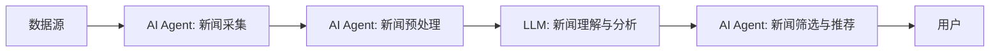

# 智能新闻聚合AI Agent：LLM驱动的信息整合与分析

> 关键词：智能新闻聚合、AI Agent、大语言模型（LLM）、信息整合、信息分析

> 摘要：本文聚焦于智能新闻聚合AI Agent这一前沿技术，探讨其在大语言模型（LLM）驱动下实现信息整合与分析的原理、方法及应用。详细介绍了相关核心概念，包括智能新闻聚合、AI Agent和LLM的原理与联系，阐述了核心算法原理和具体操作步骤，通过数学模型和公式深入剖析其工作机制。同时给出项目实战案例，涵盖开发环境搭建、源代码实现与解读。分析了实际应用场景，并推荐了学习资源、开发工具框架和相关论文著作。最后对未来发展趋势与挑战进行总结，为读者全面了解和应用这一技术提供了深入且系统的指导。

## 1. 背景介绍 
### 1.1 目的和范围
随着互联网信息的爆炸式增长，新闻资讯的数量呈指数级上升。用户在获取有价值的新闻信息时面临着信息过载、筛选困难等问题。智能新闻聚合AI Agent旨在利用先进的人工智能技术，尤其是大语言模型（LLM），实现对海量新闻信息的高效整合与深度分析，为用户提供精准、个性化的新闻服务。本文的范围将涵盖智能新闻聚合AI Agent的核心概念、算法原理、数学模型、项目实战、应用场景以及未来发展趋势等方面。

### 1.2 预期读者
本文预期读者包括对人工智能技术在新闻领域应用感兴趣的研究人员、从事新闻技术开发的程序员、新闻行业的从业者以及希望了解智能新闻聚合技术的普通读者。通过阅读本文，读者将能够深入理解智能新闻聚合AI Agent的工作原理和实现方法，为相关领域的研究、开发和应用提供有益的参考。

### 1.3 文档结构概述
本文将按照以下结构进行阐述：首先介绍相关的核心概念，包括智能新闻聚合、AI Agent和LLM，并说明它们之间的联系；接着详细讲解核心算法原理和具体操作步骤，通过Python代码进行示例；然后给出数学模型和公式，并结合具体例子进行说明；之后通过项目实战展示代码的实际应用和详细解释；再分析智能新闻聚合AI Agent的实际应用场景；推荐相关的学习资源、开发工具框架和论文著作；最后对未来发展趋势与挑战进行总结，并提供常见问题的解答和扩展阅读参考资料。

### 1.4 术语表
#### 1.4.1 核心术语定义
- **智能新闻聚合**：指利用人工智能技术，自动从多个新闻源收集、整理和筛选新闻信息，以一种更加高效、个性化的方式呈现给用户的过程。
- **AI Agent**：即人工智能代理，是一种能够感知环境、自主决策并采取行动以实现特定目标的智能实体。在智能新闻聚合中，AI Agent可以自动完成新闻的采集、处理、分析和推送等任务。
- **大语言模型（LLM）**：是一种基于深度学习的语言模型，通过在大规模文本数据上进行训练，学习语言的模式和规律，能够生成自然流畅的文本，进行语言理解和推理等任务。在智能新闻聚合中，LLM可以用于新闻内容的理解、摘要生成、情感分析等。

#### 1.4.2 相关概念解释
- **信息整合**：将来自不同来源、不同格式的新闻信息进行收集、清理、转换和融合，使其成为一个统一、有序的信息集合的过程。
- **信息分析**：对整合后的新闻信息进行深入挖掘和分析，提取有价值的信息和知识，如主题分类、情感倾向、事件关联等。

#### 1.4.3 缩略词列表
- **LLM**：Large Language Model（大语言模型）
- **AI**：Artificial Intelligence（人工智能）

## 2. 核心概念与联系 

### 智能新闻聚合
智能新闻聚合是一种借助先进技术实现新闻信息高效整合与呈现的方法。传统的新闻聚合往往只是简单地将不同来源的新闻进行堆砌，而智能新闻聚合则更加注重对新闻内容的理解和处理。它可以根据用户的兴趣、偏好和需求，自动筛选和推荐相关的新闻，提高用户获取信息的效率。

### AI Agent
AI Agent是一种具有自主性和智能性的实体。在智能新闻聚合中，AI Agent可以扮演多个角色。它可以作为新闻采集器，自动从各种新闻网站、社交媒体等数据源获取新闻信息；也可以作为新闻处理器，对采集到的新闻进行清洗、分类和摘要生成等操作；还可以作为新闻推送器，根据用户的个性化设置将合适的新闻推送给用户。

### 大语言模型（LLM）
大语言模型是智能新闻聚合的核心驱动力之一。LLM具有强大的语言理解和生成能力，可以对新闻内容进行深入分析。例如，它可以理解新闻的主题、情感倾向，生成新闻的摘要，甚至可以根据已有新闻信息进行事件预测。

### 三者的联系
智能新闻聚合是目标，AI Agent是实现这一目标的执行体，而LLM则为AI Agent提供了强大的语言处理能力。AI Agent利用LLM的能力对新闻信息进行处理和分析，实现智能新闻聚合的功能。具体流程如下：



## 3. 核心算法原理 & 具体操作步骤 

### 核心算法原理
智能新闻聚合AI Agent的核心算法主要包括新闻采集算法、新闻预处理算法、基于LLM的新闻分析算法和新闻推荐算法。

#### 新闻采集算法
新闻采集算法的目标是从各种新闻源获取新闻信息。常见的方法是使用网络爬虫，通过HTTP请求访问新闻网站的页面，解析HTML内容，提取新闻的标题、正文、发布时间等信息。以下是一个简单的Python爬虫示例：

```python
import requests
from bs4 import BeautifulSoup

def get_news(url):
    try:
        response = requests.get(url)
        response.raise_for_status()
        soup = BeautifulSoup(response.text, 'html.parser')
        # 假设新闻标题在<h1>标签中
        title = soup.find('h1').text
        # 假设新闻正文在<p>标签中
        paragraphs = soup.find_all('p')
        content = ' '.join([p.text for p in paragraphs])
        return title, content
    except Exception as e:
        print(f"Error fetching news: {e}")
        return None, None

# 示例使用
url = 'https://example.com/news'
title, content = get_news(url)
if title and content:
    print(f"Title: {title}")
    print(f"Content: {content}")
```

#### 新闻预处理算法
新闻预处理算法主要包括数据清洗、分词和去除停用词等操作。数据清洗是去除新闻文本中的噪声信息，如HTML标签、特殊字符等。分词是将新闻文本分割成单个的词语，方便后续的处理。去除停用词是去除一些对文本分析没有实际意义的词语，如“的”、“是”、“在”等。以下是一个简单的新闻预处理示例：

```python
import re
import jieba
from sklearn.feature_extraction.text import ENGLISH_STOP_WORDS

def preprocess_text(text):
    # 去除HTML标签
    text = re.sub(r'<[^>]+>', '', text)
    # 去除特殊字符
    text = re.sub(r'[^\w\s]', '', text)
    # 分词
    words = jieba.lcut(text)
    # 去除停用词
    stop_words = set(ENGLISH_STOP_WORDS)
    filtered_words = [word for word in words if word not in stop_words]
    return ' '.join(filtered_words)

# 示例使用
news_content = "<p>这是一条示例新闻，包含一些特殊字符！</p>"
processed_content = preprocess_text(news_content)
print(processed_content)
```

#### 基于LLM的新闻分析算法
基于LLM的新闻分析算法主要利用大语言模型的能力对新闻内容进行理解和分析。例如，可以使用LLM进行新闻的主题分类、情感分析和摘要生成等。以下是一个使用Hugging Face的Transformers库进行新闻摘要生成的示例：

```python
from transformers import pipeline

# 加载摘要生成模型
summarizer = pipeline("summarization", model="t5-small")

# 示例新闻内容
news_text = "这是一条关于科技发展的新闻，近年来，科技领域取得了许多重要的突破。人工智能、大数据、区块链等技术正在改变我们的生活。"

# 生成新闻摘要
summary = summarizer(news_text, max_length=30, min_length=10, do_sample=False)
print(summary[0]['summary_text'])
```

#### 新闻推荐算法
新闻推荐算法的目标是根据用户的兴趣和偏好，为用户推荐相关的新闻。常见的方法是使用协同过滤算法、基于内容的推荐算法和深度学习推荐算法等。以下是一个简单的基于内容的新闻推荐示例：

```python
from sklearn.feature_extraction.text import TfidfVectorizer
from sklearn.metrics.pairwise import cosine_similarity

def recommend_news(user_history, news_list, top_n=3):
    vectorizer = TfidfVectorizer()
    all_text = user_history + [news[1] for news in news_list]
    tfidf_matrix = vectorizer.fit_transform(all_text)
    user_vector = tfidf_matrix[0]
    news_vectors = tfidf_matrix[1:]
    similarities = cosine_similarity(user_vector, news_vectors)
    sorted_indices = similarities.argsort()[0][::-1]
    top_indices = sorted_indices[:top_n]
    recommended_news = [news_list[i] for i in top_indices]
    return recommended_news

# 示例使用
user_history = ["用户之前阅读过的新闻内容"]
news_list = [("新闻标题1", "新闻内容1"), ("新闻标题2", "新闻内容2"), ("新闻标题3", "新闻内容3")]
recommended = recommend_news(user_history, news_list)
for news in recommended:
    print(f"Title: {news[0]}")
    print(f"Content: {news[1]}")
```

### 具体操作步骤
1. **新闻采集**：使用网络爬虫从各种新闻源获取新闻信息。
2. **新闻预处理**：对采集到的新闻进行数据清洗、分词和去除停用词等操作。
3. **基于LLM的新闻分析**：利用大语言模型对预处理后的新闻进行主题分类、情感分析和摘要生成等操作。
4. **新闻推荐**：根据用户的兴趣和偏好，使用新闻推荐算法为用户推荐相关的新闻。

## 4. 数学模型和公式 & 详细讲解 & 举例说明 

### TF-IDF模型
TF-IDF（Term Frequency-Inverse Document Frequency）是一种常用的文本特征提取方法，用于衡量一个词语在一篇文档中的重要性。其计算公式如下：

$$ TF-IDF(t, d, D) = TF(t, d) \times IDF(t, D) $$

其中，$TF(t, d)$ 表示词语 $t$ 在文档 $d$ 中的词频，即词语 $t$ 在文档 $d$ 中出现的次数除以文档 $d$ 中词语的总数；$IDF(t, D)$ 表示词语 $t$ 的逆文档频率，计算公式为：

$$ IDF(t, D) = \log \frac{|D|}{|{d \in D: t \in d}| + 1} $$

其中，$|D|$ 表示文档集合 $D$ 中文档的总数，$|{d \in D: t \in d}|$ 表示包含词语 $t$ 的文档数量。

#### 详细讲解
TF-IDF模型的核心思想是：如果一个词语在某篇文档中出现的频率很高，同时在其他文档中出现的频率很低，那么这个词语对于这篇文档来说就具有较高的重要性。TF部分衡量了词语在文档中的局部重要性，而IDF部分衡量了词语在整个文档集合中的全局重要性。

#### 举例说明
假设我们有一个文档集合 $D$ 包含三篇文档：

- $d_1$: "人工智能是未来科技的发展方向"
- $d_2$: "大数据和人工智能在各个领域都有应用"
- $d_3$: "区块链技术也在不断发展"

我们来计算词语“人工智能”在文档 $d_1$ 中的TF-IDF值。

首先，计算 $TF$ 值：文档 $d_1$ 中词语总数为7，“人工智能”出现了1次，所以 $TF$ 值为 $\frac{1}{7}$。

然后，计算 $IDF$ 值：文档集合 $D$ 中文档总数 $|D| = 3$，包含“人工智能”的文档有2篇，所以 $IDF$ 值为 $\log \frac{3}{2 + 1} = \log 1 = 0$。

最后，计算 $TF-IDF$ 值：$TF-IDF = \frac{1}{7} \times 0 = 0$。

### 余弦相似度
余弦相似度是一种常用的计算两个向量之间相似度的方法，其计算公式如下：

$$ \cos(\theta) = \frac{\mathbf{A} \cdot \mathbf{B}}{\|\mathbf{A}\| \|\mathbf{B}\|} $$

其中，$\mathbf{A}$ 和 $\mathbf{B}$ 是两个向量，$\mathbf{A} \cdot \mathbf{B}$ 表示两个向量的点积，$\|\mathbf{A}\|$ 和 $\|\mathbf{B}\|$ 分别表示两个向量的模。

#### 详细讲解
余弦相似度的取值范围是 $[-1, 1]$，值越接近1表示两个向量越相似，值越接近 -1 表示两个向量越不相似。在新闻推荐中，我们可以将新闻文本转换为向量，然后使用余弦相似度计算新闻之间的相似度，从而为用户推荐相似的新闻。

#### 举例说明
假设我们有两个新闻文本的向量表示：

- $\mathbf{A} = [1, 2, 3]$
- $\mathbf{B} = [2, 4, 6]$

首先，计算点积：$\mathbf{A} \cdot \mathbf{B} = 1 \times 2 + 2 \times 4 + 3 \times 6 = 2 + 8 + 18 = 28$。

然后，计算向量的模：$\|\mathbf{A}\| = \sqrt{1^2 + 2^2 + 3^2} = \sqrt{14}$，$\|\mathbf{B}\| = \sqrt{2^2 + 4^2 + 6^2} = \sqrt{56} = 2\sqrt{14}$。

最后，计算余弦相似度：$\cos(\theta) = \frac{28}{\sqrt{14} \times 2\sqrt{14}} = \frac{28}{28} = 1$。

这表明两个向量完全相似。

## 5. 项目实战：代码实际案例和详细解释说明 

### 5.1  开发环境搭建
#### 操作系统
建议使用Linux或macOS系统，因为它们对Python开发环境的支持较好。Windows系统也可以使用，但可能需要进行一些额外的配置。

#### Python环境
安装Python 3.7及以上版本。可以从Python官方网站（https://www.python.org/downloads/）下载并安装。

#### 依赖库安装
使用pip安装以下依赖库：
```sh
pip install requests beautifulsoup4 jieba scikit-learn transformers
```

### 5.2  源代码详细实现和代码解读
以下是一个完整的智能新闻聚合AI Agent的代码示例：

```python
import requests
from bs4 import BeautifulSoup
import re
import jieba
from sklearn.feature_extraction.text import TfidfVectorizer
from sklearn.metrics.pairwise import cosine_similarity
from transformers import pipeline

# 新闻采集函数
def get_news(url):
    try:
        response = requests.get(url)
        response.raise_for_status()
        soup = BeautifulSoup(response.text, 'html.parser')
        title = soup.find('h1').text
        paragraphs = soup.find_all('p')
        content = ' '.join([p.text for p in paragraphs])
        return title, content
    except Exception as e:
        print(f"Error fetching news: {e}")
        return None, None

# 新闻预处理函数
def preprocess_text(text):
    text = re.sub(r'<[^>]+>', '', text)
    text = re.sub(r'[^\w\s]', '', text)
    words = jieba.lcut(text)
    stop_words = set(['的', '是', '在', '等'])
    filtered_words = [word for word in words if word not in stop_words]
    return ' '.join(filtered_words)

# 基于LLM的新闻摘要生成函数
def generate_summary(text):
    summarizer = pipeline("summarization", model="t5-small")
    summary = summarizer(text, max_length=30, min_length=10, do_sample=False)
    return summary[0]['summary_text']

# 新闻推荐函数
def recommend_news(user_history, news_list, top_n=3):
    vectorizer = TfidfVectorizer()
    all_text = user_history + [news[1] for news in news_list]
    tfidf_matrix = vectorizer.fit_transform(all_text)
    user_vector = tfidf_matrix[0]
    news_vectors = tfidf_matrix[1:]
    similarities = cosine_similarity(user_vector, news_vectors)
    sorted_indices = similarities.argsort()[0][::-1]
    top_indices = sorted_indices[:top_n]
    recommended_news = [news_list[i] for i in top_indices]
    return recommended_news

# 主函数
def main():
    # 示例新闻源
    news_urls = ['https://example.com/news1', 'https://example.com/news2', 'https://example.com/news3']
    news_list = []
    for url in news_urls:
        title, content = get_news(url)
        if title and content:
            processed_content = preprocess_text(content)
            summary = generate_summary(processed_content)
            news_list.append((title, processed_content, summary))

    # 示例用户历史
    user_history = ["用户之前阅读过的新闻内容"]
    recommended = recommend_news(user_history, news_list)

    print("推荐新闻：")
    for news in recommended:
        print(f"标题: {news[0]}")
        print(f"摘要: {news[2]}")
        print()

if __name__ == "__main__":
    main()
```

### 5.3  代码解读与分析
- **新闻采集**：`get_news` 函数使用 `requests` 库发送HTTP请求获取新闻页面的内容，然后使用 `BeautifulSoup` 库解析HTML内容，提取新闻的标题和正文。
- **新闻预处理**：`preprocess_text` 函数使用正则表达式去除HTML标签和特殊字符，使用 `jieba` 库进行分词，然后去除停用词。
- **基于LLM的新闻摘要生成**：`generate_summary` 函数使用Hugging Face的 `transformers` 库加载预训练的摘要生成模型，对新闻内容进行摘要生成。
- **新闻推荐**：`recommend_news` 函数使用 `TfidfVectorizer` 将新闻文本转换为TF-IDF向量，然后使用 `cosine_similarity` 计算用户历史和新闻之间的余弦相似度，根据相似度排序并推荐前 `top_n` 条新闻。
- **主函数**：`main` 函数调用上述函数完成新闻采集、预处理、摘要生成和推荐的整个流程，并输出推荐的新闻。

## 6. 实际应用场景 
### 新闻客户端
智能新闻聚合AI Agent可以应用于新闻客户端，为用户提供个性化的新闻推荐服务。通过分析用户的阅读历史、兴趣偏好等信息，AI Agent可以自动筛选和推荐符合用户需求的新闻，提高用户的阅读体验。

### 媒体机构
媒体机构可以利用智能新闻聚合AI Agent对海量的新闻信息进行整合和分析，挖掘有价值的新闻线索和热点话题。同时，AI Agent还可以辅助编辑进行新闻写作和审核，提高新闻生产的效率和质量。

### 企业情报分析
企业可以使用智能新闻聚合AI Agent收集和分析与自身相关的新闻信息，了解行业动态、竞争对手情况和市场趋势。这有助于企业制定战略决策，提高市场竞争力。

### 政府舆情监测
政府部门可以借助智能新闻聚合AI Agent对社会舆论进行监测和分析，及时了解公众的关注点和意见建议。这有助于政府制定科学合理的政策，提高政府的公信力和治理能力。

## 7. 工具和资源推荐
### 7.1 学习资源推荐
#### 7.1.1 书籍推荐
- 《Python网络爬虫从入门到实践》：详细介绍了Python网络爬虫的原理和实现方法，对于新闻采集部分的学习非常有帮助。
- 《自然语言处理入门》：系统讲解了自然语言处理的基本概念、算法和技术，适合初学者了解新闻预处理和分析的相关知识。
- 《深度学习》：深度学习是大语言模型的基础，这本书对于理解LLM的原理和应用有很大的帮助。

#### 7.1.2 在线课程
- Coursera上的“Natural Language Processing Specialization”：由顶尖大学的教授授课，全面介绍了自然语言处理的各个方面，包括文本分类、情感分析、机器翻译等。
- edX上的“Introduction to Artificial Intelligence”：讲解了人工智能的基本概念、算法和应用，对于理解AI Agent的工作原理有很大的帮助。

#### 7.1.3 技术博客和网站
- Hugging Face官方博客：提供了关于大语言模型和自然语言处理的最新研究成果和应用案例。
- Medium上的“Towards Data Science”：有很多关于数据科学、机器学习和自然语言处理的高质量文章。

### 7.2 开发工具框架推荐
#### 7.2.1 IDE和编辑器
- PyCharm：功能强大的Python集成开发环境，提供了代码编辑、调试、版本控制等一系列功能，适合开发大型Python项目。
- Visual Studio Code：轻量级的代码编辑器，支持多种编程语言和插件扩展，对于快速开发和调试Python代码非常方便。

#### 7.2.2 调试和性能分析工具
- PDB：Python自带的调试器，可以帮助开发者定位和解决代码中的问题。
- cProfile：Python的性能分析工具，可以分析代码的运行时间和内存使用情况，帮助开发者优化代码性能。

#### 7.2.3 相关框架和库
- Requests：用于发送HTTP请求，是新闻采集的常用库。
- BeautifulSoup：用于解析HTML和XML内容，方便提取新闻信息。
- Jieba：中文分词库，在新闻预处理中非常有用。
- Scikit-learn：机器学习库，提供了各种机器学习算法和工具，可用于新闻分类、推荐等任务。
- Transformers：Hugging Face开发的深度学习库，提供了丰富的预训练模型，可用于新闻摘要生成、情感分析等任务。

### 7.3 相关论文著作推荐
#### 7.3.1 经典论文
- “Attention Is All You Need”：介绍了Transformer架构，是大语言模型的基础。
- “BERT: Pre-training of Deep Bidirectional Transformers for Language Understanding”：提出了BERT模型，在自然语言处理领域取得了巨大的成功。

#### 7.3.2 最新研究成果
- 关注顶级学术会议如ACL（Association for Computational Linguistics）、EMNLP（Conference on Empirical Methods in Natural Language Processing）上的最新研究论文，了解智能新闻聚合和大语言模型的最新发展趋势。

#### 7.3.3 应用案例分析
- 一些知名科技公司如Google、Microsoft等会发布关于智能新闻聚合和自然语言处理的应用案例，可以参考学习它们的实践经验。

## 8. 总结：未来发展趋势与挑战
### 未来发展趋势
- **更强大的语言理解能力**：随着大语言模型的不断发展，智能新闻聚合AI Agent将具备更强大的语言理解能力，能够更准确地理解新闻的语义和情感，为用户提供更精准的新闻服务。
- **多模态信息整合**：未来的智能新闻聚合AI Agent将不仅局限于文本信息，还将整合图像、视频等多模态信息，为用户提供更丰富、更全面的新闻体验。
- **个性化程度更高**：通过更深入地分析用户的行为和偏好，AI Agent将能够为用户提供更加个性化的新闻推荐，满足用户的多样化需求。
- **与其他技术的融合**：智能新闻聚合AI Agent将与区块链、物联网等技术进行融合，提高新闻信息的可信度和安全性，拓展新闻的应用场景。

### 挑战
- **数据隐私和安全**：在收集和处理新闻信息的过程中，涉及到大量的用户数据和敏感信息，如何保障数据的隐私和安全是一个重要的挑战。
- **模型复杂度和计算资源**：大语言模型通常具有很高的复杂度，需要大量的计算资源进行训练和推理。如何在有限的计算资源下提高模型的性能是一个亟待解决的问题。
- **新闻真实性和可信度**：随着虚假新闻的泛滥，如何确保智能新闻聚合AI Agent推荐的新闻的真实性和可信度是一个重要的挑战。需要开发有效的算法和技术来识别和过滤虚假新闻。
- **伦理和法律问题**：智能新闻聚合AI Agent的应用可能会引发一些伦理和法律问题，如算法偏见、信息传播的责任等。需要建立相应的伦理和法律规范来引导和规范其发展。

## 9. 附录：常见问题与解答
### 问题1：智能新闻聚合AI Agent会取代新闻编辑吗？
解答：不会。虽然智能新闻聚合AI Agent可以自动完成新闻的采集、处理和推荐等任务，但新闻编辑的工作不仅仅是信息的整理和筛选，还包括新闻的策划、采访、写作和审核等环节。新闻编辑具有专业的知识和判断力，能够提供有深度、有价值的新闻报道。智能新闻聚合AI Agent可以作为新闻编辑的辅助工具，提高工作效率，但不能完全取代新闻编辑。

### 问题2：如何确保智能新闻聚合AI Agent推荐的新闻符合用户的兴趣？
解答：可以通过多种方式来确保推荐的新闻符合用户的兴趣。首先，可以收集用户的历史阅读数据，分析用户的兴趣偏好，建立用户画像。然后，根据用户画像使用推荐算法为用户推荐相关的新闻。此外，还可以提供用户反馈机制，让用户对推荐的新闻进行评价和反馈，根据用户的反馈不断调整推荐策略，提高推荐的准确性。

### 问题3：智能新闻聚合AI Agent在处理多语言新闻时会遇到哪些问题？
解答：在处理多语言新闻时，智能新闻聚合AI Agent可能会遇到以下问题：语言差异导致的分词、词性标注等自然语言处理任务的难度增加；不同语言的语法和语义结构不同，影响新闻内容的理解和分析；缺乏足够的多语言训练数据，导致模型在处理某些语言时性能下降。为了解决这些问题，可以使用多语言预训练模型，收集和整理多语言的训练数据，以及针对不同语言进行优化和调整。

### 问题4：智能新闻聚合AI Agent的开发成本高吗？
解答：智能新闻聚合AI Agent的开发成本相对较高。主要原因包括：需要使用强大的计算资源进行模型训练和推理；需要收集和整理大量的新闻数据，数据标注和清洗的成本较高；大语言模型的使用可能需要支付一定的费用。然而，随着技术的发展和开源资源的增加，开发成本也在逐渐降低。可以选择合适的开源框架和模型，优化算法和架构，降低开发成本。

## 10. 扩展阅读 & 参考资料
- 《人工智能时代的新闻业变革》
- 《自然语言处理实战》
- Hugging Face官方文档：https://huggingface.co/docs
- Scikit-learn官方文档：https://scikit-learn.org/stable/documentation.html

作者：AI天才研究院/AI Genius Institute & 禅与计算机程序设计艺术 /Zen And The Art of Computer Programming