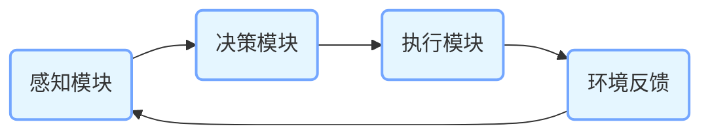

# 智能校园：AI Agent的全方位教育管理

> 关键词：智能校园、AI Agent、教育管理、人工智能、全方位服务

> 摘要：本文聚焦于智能校园中AI Agent的全方位教育管理应用。详细阐述了AI Agent在智能校园中的核心概念、算法原理、数学模型等基础知识，通过项目实战展示了其具体实现过程，分析了实际应用场景，推荐了相关的工具和资源。同时探讨了未来发展趋势与挑战，旨在为智能校园的建设和教育管理的智能化提供全面且深入的技术参考和实践指导。

## 1. 背景介绍 
### 1.1 目的和范围
随着人工智能技术的飞速发展，教育领域也在不断探索智能化的管理模式。智能校园的建设成为了当前教育改革的重要方向之一。本文的目的在于深入探讨AI Agent在智能校园全方位教育管理中的应用，包括学生管理、教学管理、校园资源管理等多个方面。范围涵盖了从AI Agent的基本概念、核心算法到实际项目应用的全流程，旨在为教育机构和相关开发者提供全面的技术指导和实践经验。

### 1.2 预期读者
本文预期读者包括教育行业的管理者、教师、教育技术研究者、人工智能开发者以及对智能校园建设感兴趣的相关人员。教育管理者可以从中了解如何利用AI Agent提升教育管理的效率和质量；教师可以学习如何借助AI Agent优化教学过程；研究者可以获取最新的技术动态和研究方向；开发者则可以参考具体的算法和代码实现，进行相关项目的开发。

### 1.3 文档结构概述
本文将按照以下结构进行阐述：首先介绍AI Agent在智能校园中的核心概念和相互联系，包括其原理和架构；接着详细讲解核心算法原理和具体操作步骤，并使用Python源代码进行说明；然后介绍相关的数学模型和公式，并举例说明；通过项目实战展示AI Agent在智能校园中的具体应用，包括开发环境搭建、源代码实现和代码解读；分析AI Agent在智能校园中的实际应用场景；推荐相关的学习资源、开发工具框架和论文著作；最后总结未来发展趋势与挑战，并提供常见问题解答和扩展阅读参考资料。

### 1.4 术语表
#### 1.4.1 核心术语定义
- **AI Agent**：人工智能代理，是一种能够感知环境、根据环境信息做出决策并执行相应动作的智能实体。在智能校园中，AI Agent可以根据学生的学习情况、教师的教学需求和校园的管理要求，自动执行各种任务。
- **智能校园**：利用现代信息技术手段，实现校园管理、教学、科研等各个环节的智能化，提高教育教学质量和管理效率的校园形态。
- **教育管理**：对教育活动进行计划、组织、指挥、协调和控制等一系列活动的总称，包括学生管理、教学管理、校园资源管理等方面。

#### 1.4.2 相关概念解释
- **机器学习**：是一门多领域交叉学科，涉及概率论、统计学、逼近论、凸分析、算法复杂度理论等多门学科。它专门研究计算机怎样模拟或实现人类的学习行为，以获取新的知识或技能，重新组织已有的知识结构使之不断改善自身的性能。在AI Agent中，机器学习用于训练模型，使其能够根据输入的数据做出准确的决策。
- **自然语言处理**：是计算机科学领域与人工智能领域中的一个重要方向。它研究能实现人与计算机之间用自然语言进行有效通信的各种理论和方法。在智能校园中，自然语言处理可以用于智能问答、作业批改等应用场景。

#### 1.4.3 缩略词列表
- **AI**：Artificial Intelligence，人工智能
- **ML**：Machine Learning，机器学习
- **NLP**：Natural Language Processing，自然语言处理

## 2. 核心概念与联系 
### 2.1 AI Agent在智能校园中的角色
在智能校园中，AI Agent可以扮演多种角色，如学生学习助手、教师教学辅助工具、校园管理者的决策支持系统等。

作为学生学习助手，AI Agent可以根据学生的学习进度和学习习惯，为学生提供个性化的学习计划和学习资源推荐。例如，通过分析学生的作业和考试成绩，了解学生的薄弱知识点，为学生提供针对性的练习题和学习资料。

作为教师教学辅助工具，AI Agent可以帮助教师进行教学管理，如自动批改作业、分析学生的学习情况、生成教学报告等。同时，AI Agent还可以为教师提供教学建议，帮助教师优化教学过程。

作为校园管理者的决策支持系统，AI Agent可以收集和分析校园内的各种数据，如学生的出勤情况、教师的教学质量、校园资源的使用情况等，为管理者提供决策依据。

### 2.2 AI Agent的架构
AI Agent的架构通常包括感知模块、决策模块和执行模块。

感知模块用于收集环境信息，如学生的学习数据、教师的教学数据、校园的管理数据等。感知模块可以通过各种传感器和数据接口获取这些信息，如学习管理系统、智能教室设备等。

决策模块根据感知模块收集到的信息，进行分析和推理，做出相应的决策。决策模块通常采用机器学习和深度学习算法，如神经网络、决策树等，对数据进行建模和预测。

执行模块根据决策模块做出的决策，执行相应的动作。执行模块可以与校园内的各种系统和设备进行交互，如发送通知、调整教学计划、分配校园资源等。

以下是AI Agent架构的Mermaid流程图：


### 2.3 AI Agent与智能校园各系统的联系
AI Agent与智能校园中的各个系统密切相关，如学习管理系统、教学资源管理系统、校园安防系统等。

与学习管理系统的联系：AI Agent可以从学习管理系统中获取学生的学习数据，如作业成绩、考试成绩、学习时长等，为学生提供个性化的学习建议。同时，AI Agent还可以将学生的学习情况反馈给学习管理系统，帮助教师更好地了解学生的学习进度。

与教学资源管理系统的联系：AI Agent可以根据教师的教学需求，从教学资源管理系统中推荐合适的教学资源，如课件、教案、视频等。同时，AI Agent还可以对教学资源进行分类和标注，方便教师和学生查找和使用。

与校园安防系统的联系：AI Agent可以与校园安防系统进行集成，实时监控校园内的安全情况。例如，通过分析监控视频，检测校园内的异常行为，并及时通知相关人员进行处理。

## 3. 核心算法原理 & 具体操作步骤 
### 3.1 机器学习算法在AI Agent中的应用
在AI Agent中，机器学习算法用于训练模型，使其能够根据输入的数据做出准确的决策。常见的机器学习算法包括线性回归、逻辑回归、决策树、支持向量机、神经网络等。

以线性回归为例，线性回归是一种用于预测连续数值的机器学习算法。假设我们要根据学生的学习时长预测学生的考试成绩，我们可以使用线性回归模型。

以下是使用Python实现线性回归的代码示例：
```python
import numpy as np
from sklearn.linear_model import LinearRegression

# 生成示例数据
X = np.array([[1], [2], [3], [4], [5]])
y = np.array([2, 4, 6, 8, 10])

# 创建线性回归模型
model = LinearRegression()

# 训练模型
model.fit(X, y)

# 预测新数据
new_X = np.array([[6]])
prediction = model.predict(new_X)

print("预测结果:", prediction)
```

### 3.2 具体操作步骤
#### 3.2.1 数据收集
首先需要收集智能校园中的各种数据，如学生的学习数据、教师的教学数据、校园的管理数据等。数据可以从学习管理系统、教学资源管理系统、校园安防系统等各个系统中获取。

#### 3.2.2 数据预处理
收集到的数据可能存在噪声、缺失值等问题，需要进行数据预处理。数据预处理包括数据清洗、数据归一化、特征选择等步骤。

#### 3.2.3 模型训练
使用预处理后的数据训练机器学习模型。根据具体的应用场景选择合适的机器学习算法，如线性回归、逻辑回归、决策树等。

#### 3.2.4 模型评估
使用测试数据对训练好的模型进行评估，评估指标包括准确率、召回率、F1值等。如果模型的评估结果不理想，需要调整模型的参数或更换机器学习算法。

#### 3.2.5 模型部署
将训练好的模型部署到智能校园系统中，使其能够实时处理新的数据，并做出相应的决策。

## 4. 数学模型和公式 & 详细讲解 & 举例说明 
### 4.1 线性回归模型
线性回归模型用于预测连续数值，其数学模型可以表示为：
$$y = \theta_0 + \theta_1x_1 + \theta_2x_2 + \cdots + \theta_nx_n + \epsilon$$
其中，$y$ 是预测值，$x_1, x_2, \cdots, x_n$ 是输入特征，$\theta_0, \theta_1, \cdots, \theta_n$ 是模型的参数，$\epsilon$ 是误差项。

线性回归的目标是找到一组最优的参数 $\theta_0, \theta_1, \cdots, \theta_n$，使得预测值 $y$ 与真实值之间的误差最小。常用的误差度量方法是均方误差（MSE）：
$$MSE = \frac{1}{m}\sum_{i=1}^{m}(y^{(i)} - \hat{y}^{(i)})^2$$
其中，$m$ 是样本数量，$y^{(i)}$ 是第 $i$ 个样本的真实值，$\hat{y}^{(i)}$ 是第 $i$ 个样本的预测值。

为了找到最优的参数，可以使用最小二乘法或梯度下降法。

### 4.2 举例说明
假设我们要根据学生的学习时长预测学生的考试成绩，我们可以使用线性回归模型。

假设我们有以下数据集：
| 学习时长（小时） | 考试成绩 |
| --- | --- |
| 1 | 20 |
| 2 | 40 |
| 3 | 60 |
| 4 | 80 |
| 5 | 100 |

我们可以将学习时长作为输入特征 $x$，考试成绩作为预测值 $y$。使用线性回归模型进行训练，得到模型的参数 $\theta_0$ 和 $\theta_1$。

假设我们得到的参数为 $\theta_0 = 0$，$\theta_1 = 20$，则线性回归模型可以表示为：
$$y = 20x$$

当学生的学习时长为 6 小时时，我们可以使用该模型预测学生的考试成绩：
$$y = 20 \times 6 = 120$$

## 5. 项目实战：代码实际案例和详细解释说明 
### 5.1  开发环境搭建
#### 5.1.1 安装Python
首先需要安装Python，可以从Python官方网站（https://www.python.org/downloads/）下载适合自己操作系统的Python版本，并按照安装向导进行安装。

#### 5.1.2 安装必要的库
在Python中，有许多用于机器学习和数据分析的库，如NumPy、Pandas、Scikit-learn等。可以使用以下命令安装这些库：
```sh
pip install numpy pandas scikit-learn
```

### 5.2  源代码详细实现和代码解读
以下是一个使用Python实现基于线性回归的学生成绩预测的代码示例：
```python
import numpy as np
import pandas as pd
from sklearn.linear_model import LinearRegression
from sklearn.model_selection import train_test_split
from sklearn.metrics import mean_squared_error

# 读取数据
data = pd.read_csv('student_scores.csv')

# 提取特征和标签
X = data[['study_hours']].values
y = data['exam_scores'].values

# 划分训练集和测试集
X_train, X_test, y_train, y_test = train_test_split(X, y, test_size=0.2, random_state=42)

# 创建线性回归模型
model = LinearRegression()

# 训练模型
model.fit(X_train, y_train)

# 预测测试集
y_pred = model.predict(X_test)

# 计算均方误差
mse = mean_squared_error(y_test, y_pred)
print("均方误差:", mse)

# 预测新数据
new_X = np.array([[6]])
prediction = model.predict(new_X)
print("预测结果:", prediction)
```

### 5.3  代码解读与分析
- **数据读取**：使用Pandas库的 `read_csv` 函数读取存储学生学习时长和考试成绩的CSV文件。
- **特征提取**：从数据中提取学习时长作为特征 $X$，考试成绩作为标签 $y$。
- **数据集划分**：使用Scikit-learn库的 `train_test_split` 函数将数据集划分为训练集和测试集，其中测试集占总数据集的20%。
- **模型创建和训练**：创建线性回归模型，并使用训练集对模型进行训练。
- **模型评估**：使用测试集对训练好的模型进行评估，计算均方误差。
- **新数据预测**：使用训练好的模型对新的学习时长数据进行预测。

## 6. 实际应用场景 
### 6.1 学生学习管理
- **个性化学习计划制定**：AI Agent可以根据学生的学习进度、学习能力和学习习惯，为学生制定个性化的学习计划。例如，对于学习能力较强的学生，可以提供更具挑战性的学习任务；对于学习能力较弱的学生，可以提供更多的基础练习和辅导。
- **学习资源推荐**：AI Agent可以根据学生的学习需求和兴趣，为学生推荐合适的学习资源，如在线课程、学习资料、学术论文等。同时，AI Agent还可以对学习资源进行评价和推荐，帮助学生选择最适合自己的学习资源。
- **学习效果评估**：AI Agent可以实时监测学生的学习效果，如作业完成情况、考试成绩、学习时长等。通过对这些数据的分析，AI Agent可以及时发现学生的学习问题，并提供相应的解决方案。

### 6.2 教师教学管理
- **教学计划优化**：AI Agent可以根据学生的学习情况和教学目标，为教师提供教学计划优化建议。例如，根据学生的薄弱知识点，调整教学内容和教学方法；根据学生的学习进度，合理安排教学时间和教学任务。
- **教学资源管理**：AI Agent可以帮助教师管理教学资源，如课件、教案、视频等。AI Agent可以对教学资源进行分类和标注，方便教师查找和使用。同时，AI Agent还可以根据教学需求，为教师推荐合适的教学资源。
- **教学质量评估**：AI Agent可以通过分析学生的学习数据和教师的教学行为，对教师的教学质量进行评估。评估指标包括教学效果、教学方法、教学态度等。AI Agent可以为教师提供详细的教学质量报告，帮助教师发现自己的教学问题，并及时进行改进。

### 6.3 校园资源管理
- **教室资源分配**：AI Agent可以根据课程安排和学生人数，合理分配教室资源。例如，对于大型课程，可以安排在大教室；对于小型课程，可以安排在小教室。同时，AI Agent还可以实时监测教室的使用情况，避免教室资源的浪费。
- **设备资源管理**：AI Agent可以对校园内的设备资源进行管理，如电脑、投影仪、实验设备等。AI Agent可以实时监测设备的使用情况和维护状态，及时安排设备的维修和保养。同时，AI Agent还可以根据教学需求，为教师和学生提供设备使用指导。
- **图书资源管理**：AI Agent可以帮助图书馆管理图书资源，如图书分类、图书借阅、图书归还等。AI Agent可以通过分析读者的借阅记录和阅读兴趣，为读者推荐合适的图书。同时，AI Agent还可以实时监测图书的库存情况，及时采购短缺的图书。

## 7. 工具和资源推荐
### 7.1 学习资源推荐
#### 7.1.1 书籍推荐
- 《机器学习》（周志华）：本书是机器学习领域的经典教材，系统地介绍了机器学习的基本概念、算法和应用。
- 《深度学习》（Ian Goodfellow、Yoshua Bengio和Aaron Courville）：本书是深度学习领域的权威著作，全面介绍了深度学习的理论和实践。
- 《Python机器学习实战》（Sebastian Raschka）：本书通过实际案例介绍了如何使用Python进行机器学习开发，适合初学者入门。

#### 7.1.2 在线课程
- Coursera上的“机器学习”课程（Andrew Ng教授）：该课程是机器学习领域的经典在线课程，由斯坦福大学的Andrew Ng教授授课，系统地介绍了机器学习的基本概念、算法和应用。
- edX上的“深度学习”课程（MIT）：该课程由麻省理工学院（MIT）开设，深入介绍了深度学习的理论和实践。
- 中国大学MOOC上的“人工智能基础”课程：该课程由国内多所高校的教授联合授课，系统地介绍了人工智能的基本概念、算法和应用。

#### 7.1.3 技术博客和网站
- Medium：Medium上有许多关于人工智能和机器学习的技术博客，如Towards Data Science等，这些博客提供了最新的技术动态和实践经验。
- Kaggle：Kaggle是一个数据科学竞赛平台，上面有许多关于机器学习和数据分析的项目和案例，可以学习到实际的应用经验。
- 机器之心：机器之心是一个专注于人工智能领域的媒体平台，提供了最新的技术新闻、研究成果和应用案例。

### 7.2 开发工具框架推荐
#### 7.2.1 IDE和编辑器
- PyCharm：PyCharm是一款专门为Python开发设计的集成开发环境（IDE），提供了代码编辑、调试、版本控制等功能，适合Python开发者使用。
- Jupyter Notebook：Jupyter Notebook是一个交互式的开发环境，支持Python、R等多种编程语言。它可以将代码、文本、图表等内容集成在一起，方便进行数据分析和机器学习开发。
- Visual Studio Code：Visual Studio Code是一款轻量级的代码编辑器，支持多种编程语言和插件。它提供了丰富的代码编辑和调试功能，适合初学者和有经验的开发者使用。

#### 7.2.2 调试和性能分析工具
- PySnooper：PySnooper是一个简单易用的Python调试工具，它可以自动记录函数的调用过程和变量的值，方便进行调试。
- cProfile：cProfile是Python标准库中的一个性能分析工具，它可以统计函数的调用次数、执行时间等信息，帮助开发者找出性能瓶颈。
- TensorBoard：TensorBoard是TensorFlow的可视化工具，它可以可视化神经网络的训练过程、模型结构、数据分布等信息，方便进行模型调试和优化。

#### 7.2.3 相关框架和库
- Scikit-learn：Scikit-learn是一个用于机器学习的Python库，提供了丰富的机器学习算法和工具，如分类、回归、聚类等。
- TensorFlow：TensorFlow是一个开源的深度学习框架，由Google开发。它提供了丰富的深度学习模型和工具，如神经网络、卷积神经网络、循环神经网络等。
- PyTorch：PyTorch是一个开源的深度学习框架，由Facebook开发。它提供了动态图机制，方便进行模型开发和调试。

### 7.3 相关论文著作推荐
#### 7.3.1 经典论文
- “Gradient-Based Learning Applied to Document Recognition”（Yann LeCun、Léon Bottou、Yoshua Bengio和Patrick Haffner）：该论文介绍了卷积神经网络（CNN）在手写数字识别中的应用，是CNN领域的经典论文。
- “Long Short-Term Memory”（Sepp Hochreiter和Jürgen Schmidhuber）：该论文介绍了长短期记忆网络（LSTM），是循环神经网络（RNN）领域的经典论文。
- “Attention Is All You Need”（Ashish Vaswani等人）：该论文介绍了Transformer模型，是自然语言处理领域的重要突破。

#### 7.3.2 最新研究成果
- arXiv：arXiv是一个预印本平台，上面有许多关于人工智能和机器学习的最新研究成果。可以通过搜索关键词，获取最新的研究论文。
- NeurIPS、ICML、CVPR等学术会议：这些学术会议是人工智能和机器学习领域的顶级会议，每年都会发布许多最新的研究成果。

#### 7.3.3 应用案例分析
- 《智能教育：人工智能时代的教育变革与创新》：本书介绍了人工智能在教育领域的应用案例和实践经验，包括智能教学、智能评估、智能管理等方面。
- 《教育大数据：理论、技术与应用》：本书介绍了教育大数据的理论、技术和应用案例，包括数据采集、数据存储、数据分析等方面。

## 8. 总结：未来发展趋势与挑战
### 8.1 未来发展趋势
- **更加个性化的教育服务**：随着AI Agent技术的不断发展，智能校园将能够为每个学生提供更加个性化的教育服务。AI Agent可以根据学生的学习进度、学习能力、学习兴趣等因素，为学生制定个性化的学习计划和学习资源推荐。
- **跨学科融合的教育模式**：未来的智能校园将更加注重跨学科融合的教育模式。AI Agent可以帮助教师和学生整合不同学科的知识和资源，开展跨学科的项目和研究。
- **智能化的校园管理**：AI Agent将在校园管理中发挥更加重要的作用。未来的智能校园将实现智能化的校园资源管理、智能化的校园安防管理、智能化的校园后勤管理等。

### 8.2 挑战
- **数据隐私和安全问题**：智能校园中涉及大量的学生和教师的个人数据，如学习数据、健康数据、社交数据等。如何保护这些数据的隐私和安全，是智能校园建设面临的重要挑战。
- **技术标准和规范问题**：目前，智能校园领域还缺乏统一的技术标准和规范。不同的厂商和开发者使用的技术和接口不同，导致智能校园系统之间的兼容性和互操作性较差。
- **教师和学生的接受度问题**：智能校园的建设需要教师和学生的积极参与和配合。然而，一些教师和学生可能对新技术存在抵触情绪，不愿意接受智能校园的新教育模式和管理方式。

## 9. 附录：常见问题与解答
### 9.1 AI Agent在智能校园中的应用是否会取代教师的工作？
不会。AI Agent在智能校园中的应用主要是为了辅助教师的教学工作，提高教学效率和质量。教师仍然是教育过程中的核心角色，他们具有丰富的教学经验和人文关怀，能够给予学生个性化的指导和支持。AI Agent可以帮助教师处理一些繁琐的教学管理任务，如作业批改、教学数据分析等，让教师有更多的时间和精力关注学生的学习和成长。

### 9.2 如何确保AI Agent在智能校园中的决策是公正和准确的？
为了确保AI Agent在智能校园中的决策是公正和准确的，需要从以下几个方面入手：
- **数据质量**：确保收集到的数据准确、完整、无偏见。在数据收集过程中，要注意数据的来源和采集方法，避免数据的偏差和错误。
- **算法设计**：选择合适的机器学习算法，并对算法进行优化和改进。在算法设计过程中，要考虑算法的公正性和透明度，避免算法出现歧视和偏见。
- **模型评估**：使用多种评估指标对训练好的模型进行评估，确保模型的准确性和可靠性。同时，要对模型进行定期的更新和维护，以适应不断变化的环境和数据。
- **人工监督**：在AI Agent的决策过程中，要引入人工监督机制。当AI Agent的决策出现异常或不合理时，要及时进行人工干预和调整。

### 9.3 智能校园建设需要投入多少资金？
智能校园建设的资金投入取决于多个因素，如校园的规模、建设的目标、采用的技术和设备等。一般来说，智能校园建设的资金投入包括硬件设备采购、软件系统开发、网络基础设施建设、人员培训等方面。具体的资金投入需要根据实际情况进行评估和预算。

## 10. 扩展阅读 & 参考资料
- 《人工智能：现代方法》（Stuart Russell和Peter Norvig）
- 《数据挖掘：概念与技术》（Jiawei Han、Jian Pei和Jianwen Yin）
- 《教育信息化2.0行动计划》
- 《中国教育现代化2035》

作者：AI天才研究院/AI Genius Institute & 禅与计算机程序设计艺术 /Zen And The Art of Computer Programming