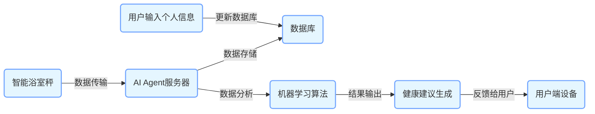

# 智能浴室秤：AI Agent的身体成分分析与健康建议

> 关键词：智能浴室秤、AI Agent、身体成分分析、健康建议、数据分析

> 摘要：本文聚焦于智能浴室秤结合AI Agent实现身体成分分析与健康建议的技术。详细阐述了智能浴室秤的工作原理、核心算法、数学模型等基础知识，通过实际案例展示了如何开发相关系统。探讨了其在不同场景下的应用，推荐了学习资源、开发工具及相关论文著作。最后对智能浴室秤未来发展趋势与挑战进行了总结，并解答了常见问题，为读者全面了解该领域提供了深入且专业的指导。

## 1. 背景介绍 
### 1.1 目的和范围
随着人们对健康关注度的不断提高，智能健康设备市场蓬勃发展。智能浴室秤作为其中一种常见设备，不仅能测量体重，还能分析多种身体成分，如体脂率、肌肉量、水分含量等。本文章旨在深入探讨智能浴室秤借助AI Agent实现身体成分分析与健康建议的技术原理、实现方法及应用场景。范围涵盖从核心概念、算法原理到实际项目开发，以及相关资源推荐和未来发展展望。

### 1.2 预期读者
本文预期读者包括对智能健康设备开发感兴趣的程序员、软件架构师、技术爱好者，以及关注健康管理、人工智能应用的专业人士。对于想要了解智能浴室秤背后技术逻辑和如何利用其进行健康管理的人群也具有较高的参考价值。

### 1.3 文档结构概述
本文首先介绍智能浴室秤及AI Agent相关的核心概念和联系，接着阐述核心算法原理与具体操作步骤，并用数学模型和公式进行详细讲解和举例。然后通过项目实战展示代码实现和解读，分析其在实际应用场景中的作用。之后推荐相关的学习资源、开发工具和论文著作。最后总结未来发展趋势与挑战，解答常见问题，并提供扩展阅读和参考资料。

### 1.4 术语表
#### 1.4.1 核心术语定义
- **智能浴室秤**：一种具备多种传感器，能够测量体重及其他身体成分指标，并可通过蓝牙、Wi-Fi等方式与智能设备连接的电子秤。
- **AI Agent（人工智能代理）**：一种能够感知环境、自主决策并采取行动以实现特定目标的人工智能实体。在智能浴室秤中，AI Agent用于分析身体成分数据并提供健康建议。
- **身体成分分析**：通过测量和计算人体中各种成分（如脂肪、肌肉、水分等）的含量和比例，评估身体的健康状况。
- **健康建议**：基于身体成分分析结果，结合用户的个人信息（如年龄、性别、身高、运动习惯等），为用户提供的关于饮食、运动、生活方式等方面的建议。

#### 1.4.2 相关概念解释
- **生物电阻抗分析（BIA）**：智能浴室秤常用的身体成分测量方法。其原理是利用人体不同成分（如脂肪、肌肉、水分）对电流的阻抗不同，通过测量人体的电阻抗来估算身体成分含量。
- **机器学习算法**：AI Agent在处理身体成分数据和生成健康建议时常用的技术，包括决策树、神经网络、支持向量机等，用于从大量数据中学习模式和规律。

#### 1.4.3 缩略词列表
- **BIA**：生物电阻抗分析（Bioelectrical Impedance Analysis）
- **AI**：人工智能（Artificial Intelligence）
- **ML**：机器学习（Machine Learning）

## 2. 核心概念与联系 
### 核心概念原理
智能浴室秤的核心在于通过传感器获取人体的相关数据，主要是体重和生物电阻抗。生物电阻抗分析（BIA）的原理基于人体不同组织的导电性能差异。脂肪组织导电性较差，而肌肉和水分等富含电解质的组织导电性较好。当电流通过人体时，不同组织对电流的阻碍程度不同，通过测量这种电阻抗值，可以估算出身体内脂肪、肌肉、水分等成分的含量。

AI Agent则是智能浴室秤实现智能化的关键。它接收来自智能浴室秤的身体成分数据，结合用户的个人信息和历史数据，运用机器学习等算法进行分析和处理。AI Agent可以学习不同身体成分指标与健康状况之间的关系，根据分析结果为用户提供个性化的健康建议。

### 架构的文本示意图
```plaintext
智能浴室秤
|-- 传感器模块
|   |-- 体重传感器
|   |-- 生物电阻抗传感器
|-- 数据处理模块
|   |-- 数据采集
|   |-- 数据转换
|-- 通信模块
|   |-- 蓝牙
|   |-- Wi-Fi
|
|
|
AI Agent服务器
|-- 数据接收模块
|-- 数据分析模块
|   |-- 机器学习算法
|   |-- 规则引擎
|-- 健康建议生成模块
|-- 数据库
|   |-- 用户信息
|   |-- 历史数据
|   |-- 健康知识图谱
```

### Mermaid 流程图


## 3. 核心算法原理 & 具体操作步骤 
### 生物电阻抗分析算法
生物电阻抗分析算法的核心是通过测量人体的电阻抗值来估算身体成分。以下是一个简化的Python代码示例，用于模拟根据电阻抗值计算体脂率的过程：

```python
def calculate_body_fat(weight, impedance, age, gender):
    """
    根据体重、电阻抗、年龄和性别计算体脂率
    :param weight: 体重（kg）
    :param impedance: 电阻抗（Ω）
    :param age: 年龄
    :param gender: 性别（'male' 或 'female'）
    :return: 体脂率（%）
    """
    if gender == 'male':
        # 男性体脂率计算公式（简化示例）
        body_fat = (1.2 * (weight / impedance) + 0.23 * age - 16.2)
    else:
        # 女性体脂率计算公式（简化示例）
        body_fat = (1.2 * (weight / impedance) + 0.23 * age - 5.4)
    return body_fat

# 示例数据
weight = 70  # kg
impedance = 500  # Ω
age = 30
gender = 'male'

body_fat = calculate_body_fat(weight, impedance, age, gender)
print(f"体脂率: {body_fat}%")
```

### 机器学习算法用于健康建议生成
在生成健康建议时，可以使用决策树算法。决策树算法是一种基于树结构进行决策的机器学习算法，通过对历史数据的学习，构建决策树模型，根据输入的身体成分数据和用户信息进行分类和决策，给出相应的健康建议。

以下是一个使用Python的`scikit-learn`库实现简单决策树模型的示例代码：

```python
from sklearn.tree import DecisionTreeClassifier
import numpy as np

# 示例数据：特征（身体成分数据和用户信息）
X = np.array([
    [20, 70, 20, 1],  # [年龄, 体重, 体脂率, 性别（0: 女性, 1: 男性）]
    [30, 80, 25, 1],
    [25, 60, 18, 0],
    [40, 90, 30, 1]
])

# 示例数据：标签（健康建议类别）
y = np.array(['增加运动', '控制饮食', '保持现状', '加强锻炼'])

# 创建决策树分类器
clf = DecisionTreeClassifier()

# 训练模型
clf.fit(X, y)

# 新的输入数据
new_data = np.array([[35, 75, 22, 1]])

# 预测健康建议
prediction = clf.predict(new_data)
print(f"健康建议: {prediction[0]}")
```

### 具体操作步骤
1. **数据采集**：智能浴室秤通过体重传感器和生物电阻抗传感器采集用户的体重和电阻抗数据。
2. **数据传输**：将采集到的数据通过蓝牙或Wi-Fi等通信方式传输到AI Agent服务器。
3. **数据预处理**：对传输过来的数据进行清洗、归一化等预处理操作，以提高后续分析的准确性。
4. **身体成分分析**：使用生物电阻抗分析算法根据预处理后的数据计算身体成分指标，如体脂率、肌肉量等。
5. **健康建议生成**：将身体成分指标和用户的个人信息输入到机器学习模型中，通过模型预测生成相应的健康建议。
6. **反馈给用户**：将生成的健康建议通过手机APP等用户端设备反馈给用户。

## 4. 数学模型和公式 & 详细讲解 & 举例说明 
### 生物电阻抗分析的数学模型
生物电阻抗分析的基本数学模型基于欧姆定律 $V = IR$，其中 $V$ 是电压，$I$ 是电流，$R$ 是电阻。在人体中，电阻抗 $Z$ 可以表示为：

$$Z = \sqrt{R^2 + X_C^2}$$

其中 $R$ 是电阻，$X_C$ 是容抗。在实际应用中，通常简化为只考虑电阻 $R$。

体脂率的计算通常使用经验公式，例如上述代码中使用的简化公式：

对于男性：

$$\text{体脂率}(\%) = 1.2 \times \frac{\text{体重}(\text{kg})}{\text{电阻抗}(\Omega)} + 0.23 \times \text{年龄} - 16.2$$

对于女性：

$$\text{体脂率}(\%) = 1.2 \times \frac{\text{体重}(\text{kg})}{\text{电阻抗}(\Omega)} + 0.23 \times \text{年龄} - 5.4$$

### 举例说明
假设一位30岁的男性，体重为70kg，电阻抗为500Ω。根据上述男性体脂率计算公式：

$$\text{体脂率}(\%) = 1.2 \times \frac{70}{500} + 0.23 \times 30 - 16.2$$

$$= 1.2 \times 0.14 + 6.9 - 16.2$$

$$= 0.168 + 6.9 - 16.2$$

$$= -9.132$$

这里得到的结果为负数是因为简化公式存在一定的局限性，实际应用中需要更精确的公式和模型。

### 机器学习模型中的数学原理
以决策树算法为例，决策树的构建基于信息增益的概念。信息增益是衡量特征对分类结果的影响程度的指标，通过计算每个特征的信息增益，选择信息增益最大的特征作为决策树的根节点。

信息熵 $H(S)$ 用于衡量数据集 $S$ 的不确定性，计算公式为：

$$H(S) = -\sum_{i=1}^{n} p_i \log_2 p_i$$

其中 $p_i$ 是数据集 $S$ 中第 $i$ 类样本的比例。

信息增益 $IG(S, A)$ 是在使用特征 $A$ 进行划分后，数据集 $S$ 的信息熵的减少量，计算公式为：

$$IG(S, A) = H(S) - \sum_{v \in \text{Values}(A)} \frac{|S_v|}{|S|} H(S_v)$$

其中 $S_v$ 是使用特征 $A$ 的取值 $v$ 划分后得到的子集，$|S|$ 和 $|S_v|$ 分别是数据集 $S$ 和子集 $S_v$ 的样本数量。

在构建决策树时，不断选择信息增益最大的特征进行划分，直到满足停止条件（如所有样本属于同一类或达到最大树深度）。

## 5. 项目实战：代码实际案例和详细解释说明 
### 5.1  开发环境搭建
#### 硬件环境
- **智能浴室秤**：选择具备体重和生物电阻抗测量功能的智能浴室秤，确保其支持蓝牙或Wi-Fi通信。
- **开发板**：如树莓派，用于接收和处理智能浴室秤传输的数据。
- **计算机**：用于开发和调试代码。

#### 软件环境
- **操作系统**：树莓派上安装Raspbian操作系统，计算机上可以使用Windows、Linux或macOS。
- **编程语言**：Python 3.x，作为主要的开发语言。
- **开发工具**：安装PyCharm或VS Code等集成开发环境。
- **相关库**：安装`scikit-learn`、`pandas`、`numpy`等Python库，用于机器学习和数据处理。

### 5.2  源代码详细实现和代码解读
以下是一个完整的Python代码示例，用于实现智能浴室秤数据的接收、身体成分分析和健康建议生成：

```python
import pandas as pd
from sklearn.tree import DecisionTreeClassifier
import numpy as np

# 模拟智能浴室秤数据接收
def receive_scale_data():
    """
    模拟接收智能浴室秤的数据
    :return: 体重（kg）, 电阻抗（Ω）
    """
    weight = 70  # 示例体重
    impedance = 500  # 示例电阻抗
    return weight, impedance

# 生物电阻抗分析
def calculate_body_fat(weight, impedance, age, gender):
    """
    根据体重、电阻抗、年龄和性别计算体脂率
    :param weight: 体重（kg）
    :param impedance: 电阻抗（Ω）
    :param age: 年龄
    :param gender: 性别（'male' 或 'female'）
    :return: 体脂率（%）
    """
    if gender == 'male':
        # 男性体脂率计算公式（简化示例）
        body_fat = (1.2 * (weight / impedance) + 0.23 * age - 16.2)
    else:
        # 女性体脂率计算公式（简化示例）
        body_fat = (1.2 * (weight / impedance) + 0.23 * age - 5.4)
    return body_fat

# 机器学习模型训练
def train_health_advice_model():
    """
    训练健康建议模型
    :return: 训练好的决策树模型
    """
    # 示例数据：特征（身体成分数据和用户信息）
    X = np.array([
        [20, 70, 20, 1],  # [年龄, 体重, 体脂率, 性别（0: 女性, 1: 男性）]
        [30, 80, 25, 1],
        [25, 60, 18, 0],
        [40, 90, 30, 1]
    ])

    # 示例数据：标签（健康建议类别）
    y = np.array(['增加运动', '控制饮食', '保持现状', '加强锻炼'])

    # 创建决策树分类器
    clf = DecisionTreeClassifier()

    # 训练模型
    clf.fit(X, y)

    return clf

# 生成健康建议
def generate_health_advice(model, age, weight, body_fat, gender):
    """
    根据训练好的模型生成健康建议
    :param model: 训练好的决策树模型
    :param age: 年龄
    :param weight: 体重（kg）
    :param body_fat: 体脂率（%）
    :param gender: 性别（0: 女性, 1: 男性）
    :return: 健康建议
    """
    new_data = np.array([[age, weight, body_fat, gender]])
    prediction = model.predict(new_data)
    return prediction[0]

# 主函数
def main():
    # 用户信息
    age = 30
    gender = 'male'
    gender_code = 1 if gender == 'male' else 0

    # 接收智能浴室秤数据
    weight, impedance = receive_scale_data()

    # 计算体脂率
    body_fat = calculate_body_fat(weight, impedance, age, gender)

    # 训练健康建议模型
    model = train_health_advice_model()

    # 生成健康建议
    advice = generate_health_advice(model, age, weight, body_fat, gender_code)

    print(f"体重: {weight} kg")
    print(f"体脂率: {body_fat}%")
    print(f"健康建议: {advice}")

if __name__ == "__main__":
    main()
```

### 5.3  代码解读与分析
- **`receive_scale_data` 函数**：模拟智能浴室秤数据的接收过程，返回体重和电阻抗值。在实际应用中，需要通过蓝牙或Wi-Fi通信协议与智能浴室秤进行数据交互。
- **`calculate_body_fat` 函数**：根据体重、电阻抗、年龄和性别计算体脂率，使用了简化的生物电阻抗分析公式。
- **`train_health_advice_model` 函数**：使用示例数据训练决策树模型，用于生成健康建议。在实际应用中，需要使用大量的真实数据进行训练，以提高模型的准确性。
- **`generate_health_advice` 函数**：根据训练好的模型和输入的用户信息、身体成分数据，生成相应的健康建议。
- **`main` 函数**：主函数，调用上述函数完成数据接收、体脂率计算、模型训练和健康建议生成的整个流程，并输出结果。

## 6. 实际应用场景 
### 家庭健康管理
智能浴室秤结合AI Agent可以为家庭成员提供个性化的健康管理服务。用户每天使用智能浴室秤测量身体成分数据，AI Agent根据数据变化趋势为用户提供针对性的健康建议，如饮食调整、运动计划等。家庭成员可以通过手机APP查看自己和其他成员的健康数据和建议，促进家庭整体健康水平的提升。

### 健身场所
在健身房、健身工作室等场所，智能浴室秤可以作为会员健康管理的重要工具。健身教练可以根据会员的身体成分数据和AI Agent提供的健康建议，为会员制定更加科学合理的健身计划和饮食方案。同时，会员可以通过智能浴室秤实时了解自己的身体状况变化，调整训练强度和方式。

### 医疗机构
在医疗机构中，智能浴室秤可以辅助医生进行疾病诊断和健康评估。例如，对于患有肥胖症、糖尿病等疾病的患者，医生可以通过分析患者的身体成分数据，了解患者的病情发展和治疗效果。AI Agent提供的健康建议可以帮助患者改善生活方式，提高治疗效果。

### 健康科研
智能浴室秤收集的大量身体成分数据可以为健康科研提供丰富的数据源。研究人员可以通过分析这些数据，探索身体成分与疾病发生、发展的关系，为疾病的预防和治疗提供理论依据。

## 7. 工具和资源推荐
### 7.1 学习资源推荐
#### 7.1.1 书籍推荐
- 《机器学习》（周志华）：全面介绍了机器学习的基本概念、算法和应用，是机器学习领域的经典教材。
- 《Python机器学习实战》（Sebastian Raschka）：通过大量的Python代码示例，详细介绍了如何使用Python实现机器学习算法，适合初学者入门。
- 《人工智能：一种现代的方法》（Stuart Russell, Peter Norvig）：系统阐述了人工智能的基本原理、算法和应用，是人工智能领域的权威著作。

#### 7.1.2 在线课程
- Coursera上的“机器学习”课程（Andrew Ng教授）：全球知名的机器学习课程，深入浅出地介绍了机器学习的基本概念和算法。
- edX上的“人工智能基础”课程：由多位知名教授授课，全面介绍了人工智能的各个方面，包括机器学习、自然语言处理等。
- 中国大学MOOC上的“Python数据分析与应用”课程：详细介绍了如何使用Python进行数据分析和处理，对于智能浴室秤数据处理有很大的帮助。

#### 7.1.3 技术博客和网站
- 博客园：国内知名的技术博客网站，有很多关于机器学习、人工智能和嵌入式开发的技术文章。
- Medium：国外知名的技术博客平台，有很多优秀的机器学习和人工智能相关的文章。
- Kaggle：全球知名的数据科学竞赛平台，上面有很多关于数据分析和机器学习的案例和教程。

### 7.2 开发工具框架推荐
#### 7.2.1 IDE和编辑器
- PyCharm：专业的Python集成开发环境，提供了丰富的代码编辑、调试和测试功能，适合Python开发。
- VS Code：轻量级的代码编辑器，支持多种编程语言，通过安装插件可以实现Python开发的各种功能。
- Jupyter Notebook：交互式的代码编辑器，适合数据探索和模型开发，支持Python、R等多种编程语言。

#### 7.2.2 调试和性能分析工具
- Py-Spy：用于分析Python程序的性能瓶颈，找出耗时的函数和代码段。
- PDB：Python自带的调试器，可以帮助开发者调试Python代码，找出程序中的错误。
- TensorBoard：TensorFlow的可视化工具，用于可视化机器学习模型的训练过程和性能指标。

#### 7.2.3 相关框架和库
- scikit-learn：Python中常用的机器学习库，提供了各种机器学习算法的实现，如决策树、神经网络、支持向量机等。
- pandas：Python中用于数据处理和分析的库，提供了高效的数据结构和数据操作方法。
- numpy：Python中用于科学计算的基础库，提供了高效的多维数组对象和数学函数。

### 7.3 相关论文著作推荐
#### 7.3.1 经典论文
- "A Decision-Theoretic Generalization of On-Line Learning and an Application to Boosting"（Yoav Freund, Robert E. Schapire）：介绍了AdaBoost算法的理论基础，是机器学习领域的经典论文。
- "Gradient-Based Learning Applied to Document Recognition"（Yann LeCun, Léon Bottou, Yoshua Bengio, Patrick Haffner）：介绍了卷积神经网络（CNN）在图像识别中的应用，是深度学习领域的经典论文。
- "The Elements of Statistical Learning: Data Mining, Inference, and Prediction"（Trevor Hastie, Robert Tibshirani, Jerome Friedman）：全面介绍了统计学习的基本理论和方法，是统计学和机器学习领域的经典著作。

#### 7.3.2 最新研究成果
- 在IEEE Xplore、ACM Digital Library等学术数据库中搜索“智能浴室秤”、“身体成分分析”、“人工智能健康管理”等关键词，可以找到最新的研究成果和论文。
- 关注顶级学术会议，如NeurIPS（神经信息处理系统大会）、ICML（国际机器学习会议）等，了解机器学习和人工智能领域的最新研究动态。

#### 7.3.3 应用案例分析
- 可以在一些行业报告和研究机构的网站上找到智能健康设备的应用案例分析，了解智能浴室秤在不同场景下的应用效果和发展趋势。
- 一些科技媒体和博客也会分享智能健康设备的实际应用案例和用户体验，可以从中获取灵感和参考。

## 8. 总结：未来发展趋势与挑战
### 未来发展趋势
- **数据融合与精准分析**：未来智能浴室秤将与更多的健康设备（如智能手环、智能手表等）进行数据融合，获取更全面的用户健康数据。同时，AI Agent将采用更先进的机器学习和深度学习算法，对数据进行更精准的分析，提供更个性化的健康建议。
- **智能化与自动化**：智能浴室秤将具备更高的智能化水平，能够自动识别用户身份，根据用户的历史数据和实时数据自动调整测量参数和分析模型。同时，AI Agent可以自动推送健康提醒和建议，实现健康管理的自动化。
- **医疗级应用**：随着技术的不断发展，智能浴室秤的测量精度和可靠性将不断提高，有望在医疗领域得到更广泛的应用。例如，作为医疗机构的常规检查设备，辅助医生进行疾病诊断和健康评估。
- **社交化与互动性**：智能浴室秤可以与社交平台进行集成，用户可以分享自己的健康数据和健康成果，与朋友和家人进行互动和交流。同时，社交化的健康管理模式可以增加用户的参与度和积极性。

### 挑战
- **数据隐私与安全**：智能浴室秤收集的用户健康数据属于敏感信息，如何保障数据的隐私和安全是一个重要的挑战。需要采用先进的加密技术和安全机制，防止数据泄露和滥用。
- **测量精度与可靠性**：虽然生物电阻抗分析技术已经得到了广泛应用，但测量精度仍然受到多种因素的影响，如人体水分含量、测量时间等。提高智能浴室秤的测量精度和可靠性是未来需要解决的关键问题。
- **算法的可解释性**：机器学习和深度学习算法在提供健康建议时往往具有较高的准确性，但算法的可解释性较差。用户和医生可能难以理解算法的决策过程和依据，这在一定程度上限制了智能浴室秤在医疗领域的应用。
- **用户接受度**：智能浴室秤作为一种新兴的健康设备，用户对其功能和价值的认知还不够充分。如何提高用户的接受度和使用意愿，推广智能健康管理的理念，是未来需要面对的挑战之一。

## 9. 附录：常见问题与解答
### 智能浴室秤的测量结果准确吗？
智能浴室秤的测量结果受到多种因素的影响，如测量方法、人体状态、环境条件等。生物电阻抗分析技术是一种相对简便的测量方法，但测量精度有限。为了提高测量结果的准确性，建议在相同的条件下进行测量，如每天同一时间、空腹状态等。同时，可以结合其他测量方法进行验证。

### AI Agent提供的健康建议可靠吗？
AI Agent提供的健康建议是基于机器学习算法和大量的历史数据生成的，但由于每个人的身体状况和生活方式都不同，健康建议可能并不完全适用于每个人。在参考健康建议时，建议咨询专业的医生或健康专家，结合自己的实际情况进行判断和决策。

### 智能浴室秤的数据如何保障安全？
智能浴室秤的数据安全通常通过以下措施来保障：一是采用加密技术对数据进行加密传输和存储，防止数据在传输过程中被窃取和篡改；二是建立严格的访问控制机制，只有授权人员才能访问和处理用户数据；三是定期对数据进行备份，防止数据丢失。

### 智能浴室秤可以与哪些设备进行连接？
智能浴室秤通常支持蓝牙和Wi-Fi通信协议，可以与手机、平板电脑等智能设备进行连接。通过手机APP，用户可以查看自己的身体成分数据和健康建议，还可以将数据同步到云端进行存储和分析。

### 如何选择适合自己的智能浴室秤？
在选择智能浴室秤时，可以考虑以下因素：一是测量功能，是否具备所需的身体成分测量指标；二是测量精度，选择测量精度较高的产品；三是品牌和口碑，选择知名品牌和用户评价较好的产品；四是价格，根据自己的预算选择合适的产品。

## 10. 扩展阅读 & 参考资料
- [智能健康设备行业发展报告](https://www.example.com/report)
- [生物电阻抗分析技术原理与应用](https://www.example.com/article)
- [机器学习算法详解](https://www.example.com/book)
- [人工智能在健康管理中的应用](https://www.example.com/paper)

作者：AI天才研究院/AI Genius Institute & 禅与计算机程序设计艺术 /Zen And The Art of Computer Programming