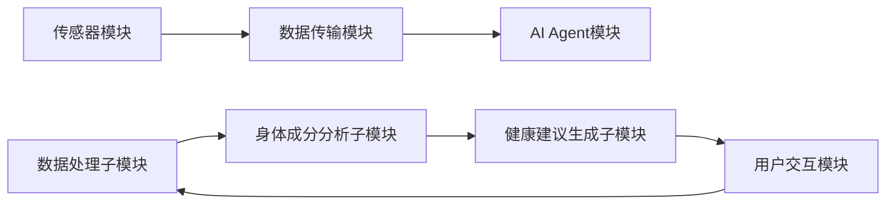

# 智能浴室秤：AI Agent的身体成分分析与健康建议

> 关键词：智能浴室秤、AI Agent、身体成分分析、健康建议、数据处理

> 摘要：本文围绕智能浴室秤中AI Agent的身体成分分析与健康建议展开。首先介绍了智能浴室秤的背景知识，包括目的、预期读者、文档结构和相关术语。接着阐述了核心概念及其联系，详细讲解了核心算法原理和具体操作步骤，通过Python代码进行说明。同时给出了数学模型和公式，并举例解释。在项目实战部分，展示了开发环境搭建、源代码实现和代码解读。分析了智能浴室秤的实际应用场景，推荐了学习资源、开发工具框架和相关论文著作。最后总结了未来发展趋势与挑战，还提供了常见问题解答和扩展阅读参考资料。

## 1. 背景介绍 
### 1.1 目的和范围
智能浴室秤作为一种新兴的家用健康设备，其目的在于为用户提供便捷、准确的身体成分分析，并基于这些数据给出合理的健康建议。本文的范围涵盖了智能浴室秤中AI Agent实现身体成分分析和健康建议功能的各个方面，包括核心概念、算法原理、实际应用等。

### 1.2 预期读者
本文预期读者包括对智能健康设备感兴趣的普通消费者、从事智能硬件开发的工程师、健康管理领域的研究人员以及关注人工智能在健康领域应用的学者等。

### 1.3 文档结构概述
本文首先介绍相关背景知识，包括目的、读者和文档结构等。然后阐述核心概念和联系，通过示意图和流程图展示。接着详细讲解核心算法原理和具体操作步骤，结合Python代码。给出数学模型和公式并举例说明。进行项目实战，包括开发环境搭建、代码实现和解读。分析实际应用场景，推荐工具和资源。最后总结未来趋势与挑战，提供常见问题解答和扩展阅读。

### 1.4 术语表
#### 1.4.1 核心术语定义
- **智能浴室秤**：一种具备多种传感器，能够测量人体体重、体脂率、肌肉量等身体成分数据，并通过内置或外接的智能系统进行数据分析和处理的电子秤。
- **AI Agent**：人工智能代理，是一种能够感知环境、进行推理和决策，并采取行动以实现特定目标的软件实体。在智能浴室秤中，AI Agent负责对测量得到的身体成分数据进行分析，并给出健康建议。
- **身体成分分析**：通过测量和分析人体的各种成分，如脂肪、肌肉、水分、骨骼等的含量和比例，来评估人体的健康状况和营养状态。
- **健康建议**：基于身体成分分析结果，结合用户的个人信息（如年龄、性别、身高、运动习惯等），为用户提供的关于饮食、运动、生活方式等方面的建议，以促进身体健康。

#### 1.4.2 相关概念解释
- **生物电阻抗分析（BIA）**：智能浴室秤常用的一种测量身体成分的方法。其原理是通过向人体施加微弱的电流，测量人体不同组织（如脂肪、肌肉等）对电流的电阻抗，根据电阻抗的大小来估算身体成分的含量。
- **机器学习算法**：AI Agent在进行身体成分分析和健康建议时常用的技术手段。通过对大量的身体成分数据和对应的健康信息进行学习和训练，建立模型，从而能够对新的测量数据进行准确的分析和预测。

#### 1.4.3 缩略词列表
- **BIA**：生物电阻抗分析（Bioelectrical Impedance Analysis）
- **AI**：人工智能（Artificial Intelligence）

## 2. 核心概念与联系 

### 核心概念原理
智能浴室秤的核心在于通过传感器获取人体的各种数据，然后由AI Agent对这些数据进行处理和分析。传感器主要包括压力传感器用于测量体重，以及电极片用于进行生物电阻抗分析以获取身体成分数据。

AI Agent接收传感器传来的数据后，会利用预先训练好的机器学习模型对身体成分进行分析。这些模型是基于大量的人体数据样本训练得到的，能够根据输入的测量数据准确地估算出体脂率、肌肉量、水分含量等身体成分指标。

在得到身体成分分析结果后，AI Agent会结合用户的个人信息，如年龄、性别、身高、运动习惯等，利用规则引擎或深度学习模型生成个性化的健康建议。规则引擎是基于一系列的医学和营养学规则，根据身体成分分析结果和用户信息直接生成相应的建议。深度学习模型则是通过学习大量的健康案例和对应的建议，能够更智能地生成符合用户实际情况的健康建议。

### 架构的文本示意图
智能浴室秤的架构主要包括以下几个部分：
1. **传感器模块**：负责采集人体的体重和生物电阻抗数据。
2. **数据传输模块**：将传感器采集到的数据传输到AI Agent所在的处理单元。
3. **AI Agent模块**：包括数据处理、身体成分分析和健康建议生成三个子模块。数据处理子模块对传输过来的数据进行清洗和预处理；身体成分分析子模块利用机器学习模型对数据进行分析，得到身体成分指标；健康建议生成子模块根据身体成分分析结果和用户信息生成健康建议。
4. **用户交互模块**：将身体成分分析结果和健康建议展示给用户，同时接收用户输入的个人信息。

### Mermaid流程图


## 3. 核心算法原理 & 具体操作步骤 

### 核心算法原理
在智能浴室秤的身体成分分析中，常用的机器学习算法是多元线性回归和支持向量机。

#### 多元线性回归
多元线性回归是一种用于建立自变量（如体重、身高、年龄、生物电阻抗等）与因变量（如体脂率、肌肉量等身体成分指标）之间线性关系的统计方法。其数学模型可以表示为：

$$y = \beta_0 + \beta_1x_1 + \beta_2x_2 + \cdots + \beta_nx_n + \epsilon$$

其中，$y$ 是因变量，$x_1, x_2, \cdots, x_n$ 是自变量，$\beta_0, \beta_1, \beta_2, \cdots, \beta_n$ 是回归系数，$\epsilon$ 是误差项。

通过对大量的人体数据样本进行训练，利用最小二乘法可以估计出回归系数 $\beta_0, \beta_1, \beta_2, \cdots, \beta_n$ 的值。在实际应用中，将新的测量数据代入回归方程，就可以得到相应的身体成分指标的估计值。

#### 支持向量机
支持向量机是一种常用的分类和回归算法。在身体成分分析中，支持向量机可以用于建立非线性的回归模型。其基本思想是通过寻找一个最优的超平面，使得数据点到超平面的距离最大，从而实现对数据的分类或回归。

### 具体操作步骤

#### 数据收集
首先需要收集大量的人体数据样本，包括体重、身高、年龄、性别、生物电阻抗等测量数据，以及对应的体脂率、肌肉量等身体成分指标。这些数据可以通过专业的身体成分测量设备和问卷调查等方式获取。

#### 数据预处理
对收集到的数据进行清洗和预处理，包括去除缺失值、异常值，对数据进行归一化处理等。归一化处理可以将不同范围的数据统一到一个相同的尺度上，有助于提高机器学习模型的训练效果。

#### 模型训练
使用预处理后的数据对多元线性回归模型和支持向量机模型进行训练。可以使用Python中的Scikit-learn库来实现这一过程。

以下是一个使用Python实现多元线性回归模型训练的示例代码：
```python
import numpy as np
from sklearn.linear_model import LinearRegression

# 假设我们有以下训练数据
X_train = np.array([[1, 2, 3], [4, 5, 6], [7, 8, 9]])  # 自变量
y_train = np.array([10, 20, 30])  # 因变量

# 创建线性回归模型
model = LinearRegression()

# 训练模型
model.fit(X_train, y_train)

# 打印回归系数
print("回归系数:", model.coef_)
print("截距:", model.intercept_)
```

#### 模型评估
使用测试数据对训练好的模型进行评估，计算模型的预测误差，如均方误差（MSE）、平均绝对误差（MAE）等。根据评估结果，可以对模型进行调整和优化。

#### 实际应用
将训练好的模型部署到智能浴室秤的AI Agent中，当用户使用浴室秤进行测量时，AI Agent将测量数据输入到模型中，得到身体成分分析结果，并根据结果生成健康建议。

## 4. 数学模型和公式 & 详细讲解 & 举例说明 

### 生物电阻抗分析公式
生物电阻抗分析的基本公式基于欧姆定律：

$$V = IR$$

其中，$V$ 是电压，$I$ 是电流，$R$ 是电阻。在生物电阻抗分析中，向人体施加一个已知的微弱电流 $I$，测量人体两端的电压 $V$，就可以计算出人体的电阻 $R$。

身体不同组织的电阻不同，脂肪组织的电阻较大，而肌肉和水分组织的电阻较小。因此，可以根据测量得到的电阻值，结合人体的身高、体重等信息，使用经验公式来估算身体成分。

一种常用的估算体脂率的经验公式如下：

$$体脂率 = a \times \frac{R}{体重} + b \times 年龄 + c \times 性别 + d$$

其中，$a, b, c, d$ 是根据大量实验数据确定的常数，性别可以用 0（女性）和 1（男性）来表示。

### 多元线性回归公式详细讲解
如前面所述，多元线性回归的数学模型为：

$$y = \beta_0 + \beta_1x_1 + \beta_2x_2 + \cdots + \beta_nx_n + \epsilon$$

其目标是找到一组最优的回归系数 $\beta_0, \beta_1, \beta_2, \cdots, \beta_n$，使得预测值 $\hat{y}$ 与实际值 $y$ 之间的误差平方和最小。误差平方和可以表示为：

$$S(\beta) = \sum_{i=1}^{m}(y_i - \hat{y}_i)^2 = \sum_{i=1}^{m}(y_i - (\beta_0 + \beta_1x_{i1} + \beta_2x_{i2} + \cdots + \beta_nx_{in}))^2$$

其中，$m$ 是样本数量，$x_{i1}, x_{i2}, \cdots, x_{in}$ 是第 $i$ 个样本的自变量值，$y_i$ 是第 $i$ 个样本的因变量值。

通过对 $S(\beta)$ 求偏导数，并令偏导数等于 0，可以得到一组方程组，解这个方程组就可以得到回归系数 $\beta_0, \beta_1, \beta_2, \cdots, \beta_n$ 的估计值。

### 举例说明
假设我们要使用多元线性回归模型来预测体脂率，自变量包括体重、身高和年龄。我们有以下 5 个样本数据：

| 体重（kg） | 身高（cm） | 年龄（岁） | 体脂率（%） |
| ---- | ---- | ---- | ---- |
| 60 | 170 | 30 | 20 |
| 70 | 175 | 35 | 22 |
| 80 | 180 | 40 | 25 |
| 55 | 165 | 25 | 18 |
| 65 | 172 | 32 | 21 |

首先，我们将数据整理成矩阵形式：

$$X = \begin{bmatrix}
1 & 60 & 170 & 30 \\
1 & 70 & 175 & 35 \\
1 & 80 & 180 & 40 \\
1 & 55 & 165 & 25 \\
1 & 65 & 172 & 32
\end{bmatrix}$$

$$y = \begin{bmatrix}
20 \\
22 \\
25 \\
18 \\
21
\end{bmatrix}$$

然后，使用最小二乘法求解回归系数 $\beta$：

$$\beta = (X^T X)^{-1} X^T y$$

在Python中可以使用以下代码实现：
```python
import numpy as np

# 定义自变量矩阵 X
X = np.array([[1, 60, 170, 30], [1, 70, 175, 35], [1, 80, 180, 40], [1, 55, 165, 25], [1, 65, 172, 32]])
# 定义因变量向量 y
y = np.array([20, 22, 25, 18, 21])

# 计算回归系数
beta = np.linalg.inv(X.T.dot(X)).dot(X.T).dot(y)

print("回归系数:", beta)
```

通过上述代码可以得到回归系数的估计值，将新的体重、身高和年龄数据代入回归方程，就可以预测体脂率。

## 5. 项目实战：代码实际案例和详细解释说明 

### 5.1  开发环境搭建
为了实现智能浴室秤的身体成分分析和健康建议功能，我们可以使用Python作为开发语言，并结合Scikit-learn库进行机器学习模型的训练和应用。以下是开发环境搭建的具体步骤：

#### 安装Python
可以从Python官方网站（https://www.python.org/downloads/）下载并安装Python 3.x版本。

#### 安装Scikit-learn库
打开命令行终端，输入以下命令安装Scikit-learn库：
```sh
pip install scikit-learn
```

#### 安装其他必要的库
还需要安装一些其他的库，如NumPy、Pandas等，用于数据处理和分析。可以使用以下命令进行安装：
```sh
pip install numpy pandas
```

### 5.2  源代码详细实现和代码解读
以下是一个完整的智能浴室秤身体成分分析和健康建议生成的Python代码示例：
```python
import numpy as np
from sklearn.linear_model import LinearRegression

# 模拟训练数据
X_train = np.array([[60, 170, 30], [70, 175, 35], [80, 180, 40], [55, 165, 25], [65, 172, 32]])  # 体重、身高、年龄
y_train = np.array([20, 22, 25, 18, 21])  # 体脂率

# 创建线性回归模型
model = LinearRegression()

# 训练模型
model.fit(X_train, y_train)

# 模拟新的测量数据
new_data = np.array([[62, 171, 31]])

# 进行体脂率预测
predicted_fat_rate = model.predict(new_data)

# 根据体脂率生成健康建议
def generate_health_advice(fat_rate):
    if fat_rate < 18:
        return "您的体脂率较低，建议适当增加一些健康的脂肪摄入，如坚果、橄榄油等。"
    elif fat_rate >= 18 and fat_rate < 25:
        return "您的体脂率处于正常范围，继续保持健康的饮食和运动习惯。"
    else:
        return "您的体脂率较高，建议减少高热量、高脂肪食物的摄入，增加有氧运动。"

# 生成健康建议
advice = generate_health_advice(predicted_fat_rate[0])

print("预测的体脂率:", predicted_fat_rate[0])
print("健康建议:", advice)
```

### 代码解读与分析
1. **数据准备**：首先模拟了训练数据 `X_train` 和 `y_train`，分别表示自变量（体重、身高、年龄）和因变量（体脂率）。
2. **模型训练**：创建了一个线性回归模型 `model`，并使用 `fit` 方法对模型进行训练。
3. **数据预测**：模拟了新的测量数据 `new_data`，使用训练好的模型对其进行体脂率预测。
4. **健康建议生成**：定义了一个函数 `generate_health_advice`，根据预测的体脂率生成相应的健康建议。
5. **结果输出**：打印出预测的体脂率和生成的健康建议。

## 6. 实际应用场景 
### 家庭健康管理
智能浴室秤可以放置在家庭中，家庭成员可以随时使用它进行身体成分测量。通过长期记录和分析测量数据，家庭成员可以了解自己的身体状况变化，如体脂率的增减、肌肉量的变化等。根据AI Agent给出的健康建议，调整饮食和运动计划，实现家庭健康管理。

### 健身场所
在健身房、健身工作室等场所，智能浴室秤可以为会员提供更专业的身体成分分析服务。健身教练可以根据测量结果和健康建议，为会员制定个性化的健身计划和饮食方案，提高健身效果。

### 医疗机构
在医院、体检中心等医疗机构，智能浴室秤可以作为一种辅助诊断工具。医生可以通过分析患者的身体成分数据，了解患者的营养状况和健康风险，为疾病的诊断和治疗提供参考。

### 健康研究
科研人员可以利用智能浴室秤收集大量的人体身体成分数据，进行健康研究。例如，研究不同年龄段、性别、生活方式等因素对身体成分的影响，为制定健康政策和干预措施提供依据。

## 7. 工具和资源推荐
### 7.1 学习资源推荐
#### 7.1.1 书籍推荐
- 《机器学习》（周志华著）：这本书系统地介绍了机器学习的基本概念、算法和应用，是机器学习领域的经典教材。
- 《Python机器学习实战》（Sebastian Raschka著）：通过大量的实例代码，详细介绍了如何使用Python实现各种机器学习算法，适合初学者入门。
- 《健康大数据分析与应用》：介绍了健康领域大数据的收集、处理和分析方法，以及如何利用大数据为健康管理和医疗决策提供支持。

#### 7.1.2 在线课程
- Coursera上的“机器学习”课程（Andrew Ng教授主讲）：这是一门非常经典的机器学习在线课程，课程内容丰富，讲解详细，适合零基础的学习者。
- edX上的“数据科学与机器学习微硕士项目”：提供了系统的数据分析和机器学习课程，包括数据预处理、模型训练、评估和优化等方面的内容。
- 中国大学MOOC上的“人工智能基础”课程：介绍了人工智能的基本概念、技术和应用，为学习者提供了一个全面了解人工智能的平台。

#### 7.1.3 技术博客和网站
- 机器学习算法全栈工程师：该博客分享了大量的机器学习算法实现和应用案例，对学习机器学习算法有很大的帮助。
- 知乎：在知乎上可以找到很多关于智能健康设备、机器学习和健康管理的讨论和分享，与其他爱好者和专业人士进行交流。
- 博客园：有很多技术开发者在博客园上分享自己的学习经验和项目实践，对于学习智能浴室秤开发和相关技术有一定的参考价值。

### 7.2 开发工具框架推荐
#### 7.2.1 IDE和编辑器
- PyCharm：一款专业的Python集成开发环境，提供了丰富的代码编辑、调试、测试等功能，适合Python项目的开发。
- Visual Studio Code：一款轻量级的代码编辑器，支持多种编程语言，安装相应的插件后可以很好地进行Python开发。
- Jupyter Notebook：一种交互式的开发环境，适合进行数据探索、模型训练和可视化等工作，方便在开发过程中进行代码展示和讲解。

#### 7.2.2 调试和性能分析工具
- PDB：Python自带的调试器，可以帮助开发者定位代码中的错误和问题。
- cProfile：Python的性能分析工具，可以分析代码的运行时间和函数调用情况，帮助开发者优化代码性能。
- TensorBoard：用于可视化深度学习模型的训练过程和结果，方便开发者监控模型的性能和调试。

#### 7.2.3 相关框架和库
- Scikit-learn：一个强大的机器学习库，提供了丰富的机器学习算法和工具，如分类、回归、聚类等，方便开发者进行模型训练和评估。
- TensorFlow：一个开源的深度学习框架，广泛应用于图像识别、自然语言处理等领域，也可以用于开发智能浴室秤中的深度学习模型。
- Keras：一个简单易用的深度学习库，基于TensorFlow等后端，适合快速搭建和训练深度学习模型。

### 7.3 相关论文著作推荐
#### 7.3.1 经典论文
- “A Survey on Machine Learning in Health Informatics”：该论文对机器学习在健康信息学领域的应用进行了全面的综述，介绍了机器学习算法在疾病诊断、预测和健康管理等方面的研究进展。
- “Bioelectrical Impedance Analysis–Part I: Review of Principles and Methods”：详细介绍了生物电阻抗分析的原理、方法和应用，对于理解智能浴室秤中身体成分测量的技术基础有重要的参考价值。

#### 7.3.2 最新研究成果
- 关注IEEE Transactions on Biomedical Engineering、Journal of Medical Internet Research等学术期刊，这些期刊经常发表关于智能健康设备和健康数据分析的最新研究成果。
- 参加国际会议，如ACM SIGKDD Conference on Knowledge Discovery and Data Mining、International Conference on Machine Learning等，了解机器学习和健康领域的最新研究动态。

#### 7.3.3 应用案例分析
- 可以在一些专业的健康科技公司的官方网站上找到智能浴室秤的应用案例分析，了解这些产品在实际应用中的效果和用户反馈。
- 查阅行业报告，如市场研究机构发布的关于智能健康设备市场的报告，了解智能浴室秤的市场现状和发展趋势。

## 8. 总结：未来发展趋势与挑战
### 未来发展趋势
#### 数据融合与精准分析
未来的智能浴室秤将不仅仅局限于测量体重和身体成分，还会与其他健康设备（如智能手环、智能手表等）进行数据融合。通过整合多种数据源，AI Agent能够更全面、精准地分析用户的健康状况，提供更个性化的健康建议。

#### 智能化与自动化
随着人工智能技术的不断发展，智能浴室秤的AI Agent将变得更加智能化和自动化。它可以自动识别用户的身份，根据用户的历史数据和实时测量结果，动态调整健康建议。同时，还可以与智能家居系统进行集成，实现自动化的健康管理，如根据用户的体脂率自动调整空调温度、推荐适合的音乐等。

#### 社交化与互动性
智能浴室秤将具备更多的社交功能，用户可以与家人、朋友分享自己的健康数据和健康目标，互相监督和鼓励。此外，还可以参与健康社区的活动，与其他用户交流健康经验和心得，增加用户的参与感和互动性。

#### 医疗级应用
未来的智能浴室秤有望达到医疗级的精度和可靠性，成为医疗机构的辅助诊断工具。医生可以通过远程监控患者的身体成分数据，及时发现健康问题并进行干预，提高医疗服务的效率和质量。

### 挑战
#### 数据安全与隐私保护
智能浴室秤涉及到用户的大量个人健康数据，如何保障这些数据的安全和隐私是一个重要的挑战。需要采取有效的加密技术和安全措施，防止数据泄露和滥用。

#### 算法准确性和可靠性
身体成分分析和健康建议的准确性直接影响到用户的健康管理效果。因此，需要不断优化机器学习算法，提高模型的准确性和可靠性。同时，还需要进行大量的实验和验证，确保算法在不同人群和环境下都能取得良好的效果。

#### 用户教育和接受度
很多用户对智能浴室秤的功能和价值了解不足，需要加强用户教育，提高用户对智能健康设备的认知和接受度。此外，一些用户可能对测量结果和健康建议存在误解，需要提供清晰、易懂的解释和指导。

#### 标准和规范制定
目前智能浴室秤市场缺乏统一的标准和规范，不同品牌和型号的产品在测量精度、数据处理和健康建议等方面存在差异。需要制定相关的标准和规范，确保产品的质量和性能，促进市场的健康发展。

## 9. 附录：常见问题与解答
### 智能浴室秤的测量结果准确吗？
智能浴室秤的测量结果受到多种因素的影响，如测量方法、传感器精度、用户的身体状态等。一般来说，正规品牌的智能浴室秤采用了先进的传感器和算法，测量结果具有一定的准确性。但与专业的医疗设备相比，仍存在一定的误差。为了提高测量结果的准确性，建议在相同的条件下（如同一时间、同一地点）进行测量，并多次测量取平均值。

### 智能浴室秤的健康建议可靠吗？
智能浴室秤的健康建议是基于身体成分分析结果和用户的个人信息生成的。其可靠性取决于算法的准确性和数据的完整性。一般来说，经过大量数据训练和验证的算法生成的健康建议具有一定的参考价值。但健康建议只是一种参考，不能替代专业医生的诊断和建议。如果用户对自己的健康状况有疑虑，建议咨询专业医生。

### 智能浴室秤可以测量哪些身体成分？
常见的智能浴室秤可以测量体重、体脂率、肌肉量、水分含量、骨骼含量等身体成分指标。不同品牌和型号的产品可能会有所差异，一些高端的智能浴室秤还可以测量更多的身体成分指标，如基础代谢率、内脏脂肪等级等。

### 智能浴室秤需要联网吗？
有些智能浴室秤需要联网才能实现全部功能，如数据上传、远程监控、获取最新的健康建议等。而一些基本的测量功能，如体重和身体成分测量，不需要联网也可以正常使用。用户可以根据自己的需求选择是否需要联网的智能浴室秤。

### 智能浴室秤的电池续航时间有多长？
智能浴室秤的电池续航时间取决于电池容量、使用频率和功能设置等因素。一般来说，普通的智能浴室秤使用几节干电池，可以续航几个月甚至一年以上。一些采用充电电池的智能浴室秤，一次充电可以使用数周。

## 10. 扩展阅读 & 参考资料
### 扩展阅读
- 《智能硬件产品设计与开发》：介绍了智能硬件产品的设计理念、开发流程和技术要点，对于深入了解智能浴室秤的产品设计和开发有很大的帮助。
- 《人工智能时代的健康管理》：探讨了人工智能在健康管理领域的应用前景和挑战，以及如何利用人工智能技术提高健康管理的效率和质量。
- 《数据驱动的健康决策》：介绍了如何利用大数据和数据分析技术进行健康决策，对于理解智能浴室秤中数据处理和分析的重要性有一定的启示。

### 参考资料
- 各智能浴室秤品牌的官方网站和产品说明书，获取产品的详细信息和技术参数。
- 相关的学术论文和研究报告，了解智能浴室秤和相关技术的最新研究进展。
- 行业论坛和社区，与其他开发者和用户交流经验和心得。

作者：AI天才研究院/AI Genius Institute & 禅与计算机程序设计艺术 /Zen And The Art of Computer Programming