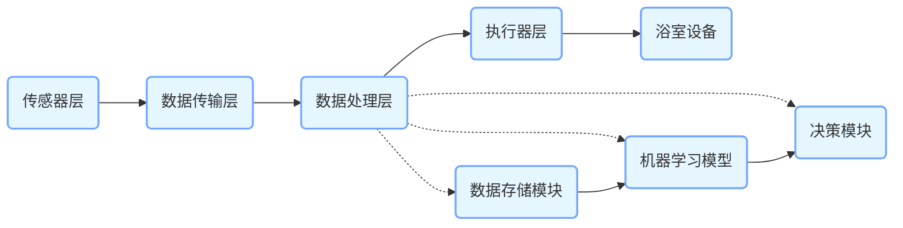

# 智能浴室系统：AI Agent的用水习惯优化

> 关键词：智能浴室系统、AI Agent、用水习惯优化、机器学习、传感器技术

> 摘要：本文聚焦于智能浴室系统中利用AI Agent对用户用水习惯进行优化的相关技术。首先介绍了智能浴室系统和用水习惯优化的背景知识，包括目的、预期读者等。接着详细阐述了核心概念、算法原理、数学模型等内容。通过项目实战案例，展示了如何开发一个基于AI Agent的智能浴室系统来优化用水习惯。还探讨了该技术的实际应用场景，推荐了学习资源、开发工具和相关论文著作。最后对未来发展趋势与挑战进行了总结，并提供了常见问题解答和扩展阅读参考资料，旨在为相关领域的研究者和开发者提供全面的技术指导。

## 1. 背景介绍 
### 1.1 目的和范围
随着人们对生活品质要求的提高以及对水资源保护意识的增强，智能浴室系统逐渐成为家居智能化的重要组成部分。本文章的目的在于详细介绍如何利用AI Agent对智能浴室系统中的用水习惯进行优化，以达到节约用水、提高用户舒适度的双重目标。范围涵盖了从核心概念的讲解、算法原理的阐述、数学模型的构建，到实际项目的开发和应用场景的探讨等多个方面。

### 1.2 预期读者
本文预期读者包括但不限于计算机科学、人工智能、智能家居等领域的研究者、开发者，对智能浴室系统和用水优化感兴趣的爱好者，以及从事相关行业的技术人员和管理人员。

### 1.3 文档结构概述
本文将按照以下结构进行阐述：首先介绍核心概念与联系，包括智能浴室系统和AI Agent的原理和架构；接着讲解核心算法原理和具体操作步骤，并用Python代码进行详细说明；然后给出数学模型和公式，并举例说明；通过项目实战展示代码的实际应用和详细解释；探讨该技术的实际应用场景；推荐相关的学习资源、开发工具和论文著作；最后总结未来发展趋势与挑战，提供常见问题解答和扩展阅读参考资料。

### 1.4 术语表
#### 1.4.1 核心术语定义
- **智能浴室系统**：集成了各种传感器、控制器和执行器的浴室设备系统，能够感知浴室环境和用户行为，并根据预设规则或智能算法自动调节设备运行状态。
- **AI Agent**：具有自主决策能力的人工智能实体，能够感知环境信息，根据自身目标和知识进行推理和决策，并采取相应的行动。
- **用水习惯优化**：通过分析用户的用水行为数据，利用智能算法调整浴室设备的运行参数，以达到节约用水、提高用水舒适度的目的。

#### 1.4.2 相关概念解释
- **机器学习**：是一门多领域交叉学科，涉及概率论、统计学、逼近论、凸分析、算法复杂度理论等多门学科。它专门研究计算机怎样模拟或实现人类的学习行为，以获取新的知识或技能，重新组织已有的知识结构使之不断改善自身的性能。
- **传感器技术**：是关于从自然信源获取信息，并对之进行处理（变换）和识别的一门多学科交叉的现代科学与工程技术，它涉及传感器（又称换能器）、信息处理和识别的规划设计、开发、制造（建造）、测试、应用及评价改进等活动。

#### 1.4.3 缩略词列表
- **AI**：Artificial Intelligence，人工智能
- **ML**：Machine Learning，机器学习

## 2. 核心概念与联系 

### 核心概念原理
#### 智能浴室系统原理
智能浴室系统主要由传感器层、数据传输层、数据处理层和执行器层组成。传感器层负责收集浴室环境信息和用户用水行为数据，如水温、水位、水流速度、用户使用时间等；数据传输层将传感器收集到的数据传输到数据处理层；数据处理层对数据进行分析和处理，根据预设规则或智能算法生成控制指令；执行器层根据控制指令调节浴室设备的运行状态，如水龙头的开关、水温的调节等。

#### AI Agent原理
AI Agent通过感知环境信息，利用自身的知识和推理能力进行决策。在智能浴室系统中，AI Agent可以根据用户的历史用水数据和当前环境信息，预测用户的用水需求，并自动调整浴室设备的运行参数。例如，根据用户的洗澡时间和水温偏好，提前调节好水温，使用户能够享受到舒适的洗澡体验。

### 架构的文本示意图
```plaintext
智能浴室系统架构
|-- 传感器层
|   |-- 水温传感器
|   |-- 水位传感器
|   |-- 水流速度传感器
|   |-- 时间传感器
|-- 数据传输层
|   |-- 无线通信模块（如Wi-Fi、蓝牙）
|-- 数据处理层
|   |-- AI Agent
|   |   |-- 数据存储模块
|   |   |-- 机器学习模型
|   |   |-- 决策模块
|-- 执行器层
|   |-- 水龙头控制器
|   |-- 热水器控制器
```

### Mermaid 流程图


## 3. 核心算法原理 & 具体操作步骤 

### 核心算法原理
在智能浴室系统中，我们可以使用机器学习算法来分析用户的用水习惯，从而实现用水习惯的优化。这里我们选择使用基于时间序列分析的算法，因为用水习惯通常具有一定的时间规律性。具体来说，我们可以使用长短期记忆网络（LSTM）来预测用户的用水需求。

LSTM是一种特殊的循环神经网络（RNN），能够处理序列数据中的长期依赖关系。在智能浴室系统中，我们可以将用户的历史用水数据作为输入，训练LSTM模型，使其能够预测用户未来的用水时间和用水量。

### 具体操作步骤
#### 步骤1：数据收集
使用传感器收集用户的用水数据，包括水温、水位、水流速度、使用时间等。将数据存储在数据库中，以便后续分析。

#### 步骤2：数据预处理
对收集到的数据进行清洗和预处理，包括去除噪声数据、处理缺失值、归一化等操作。将处理后的数据划分为训练集和测试集。

#### 步骤3：模型训练
使用训练集数据训练LSTM模型。设置模型的超参数，如学习率、批次大小、训练轮数等。训练过程中，不断调整模型的参数，使模型的预测误差最小化。

#### 步骤4：模型评估
使用测试集数据评估训练好的模型的性能。计算模型的预测误差，如均方误差（MSE）、平均绝对误差（MAE）等。根据评估结果，调整模型的超参数，直到模型的性能达到满意的水平。

#### 步骤5：模型部署
将训练好的模型部署到智能浴室系统中。实时收集用户的用水数据，输入到模型中进行预测。根据预测结果，自动调整浴室设备的运行参数，实现用水习惯的优化。

### Python源代码实现
```python
import numpy as np
import pandas as pd
from sklearn.preprocessing import MinMaxScaler
from tensorflow.keras.models import Sequential
from tensorflow.keras.layers import LSTM, Dense

# 步骤1：数据收集
# 假设我们已经从传感器收集到了用水数据，并存储在CSV文件中
data = pd.read_csv('water_usage_data.csv')

# 步骤2：数据预处理
# 提取需要的特征
features = data[['water_temperature', 'water_level', 'water_flow_rate', 'usage_time']].values

# 归一化处理
scaler = MinMaxScaler()
scaled_features = scaler.fit_transform(features)

# 划分训练集和测试集
train_size = int(len(scaled_features) * 0.8)
train_data = scaled_features[:train_size]
test_data = scaled_features[train_size:]

# 准备训练数据
def create_sequences(data, seq_length):
    X = []
    y = []
    for i in range(len(data) - seq_length):
        X.append(data[i:i+seq_length])
        y.append(data[i+seq_length, -1])
    return np.array(X), np.array(y)

seq_length = 10
X_train, y_train = create_sequences(train_data, seq_length)
X_test, y_test = create_sequences(test_data, seq_length)

# 步骤3：模型训练
model = Sequential()
model.add(LSTM(50, return_sequences=True, input_shape=(seq_length, X_train.shape[2])))
model.add(LSTM(50, return_sequences=False))
model.add(Dense(1))

model.compile(optimizer='adam', loss='mse')
model.fit(X_train, y_train, batch_size=32, epochs=50)

# 步骤4：模型评估
predictions = model.predict(X_test)
mse = np.mean((predictions - y_test) ** 2)
print(f"Mean Squared Error: {mse}")

# 步骤5：模型部署
# 在实际应用中，实时收集数据，进行预处理，输入到模型中进行预测
# 根据预测结果调整浴室设备的运行参数
```

## 4. 数学模型和公式 & 详细讲解 & 举例说明 

### 长短期记忆网络（LSTM）数学模型
LSTM单元由输入门 $i_t$、遗忘门 $f_t$、输出门 $o_t$ 和细胞状态 $C_t$ 组成。其数学公式如下：

#### 遗忘门
$$f_t = \sigma(W_f[h_{t-1}, x_t] + b_f)$$
其中，$\sigma$ 是 sigmoid 函数，$W_f$ 是遗忘门的权重矩阵，$h_{t-1}$ 是上一时刻的隐藏状态，$x_t$ 是当前时刻的输入，$b_f$ 是遗忘门的偏置。

#### 输入门
$$i_t = \sigma(W_i[h_{t-1}, x_t] + b_i)$$
$$\tilde{C}_t = \tanh(W_C[h_{t-1}, x_t] + b_C)$$
其中，$W_i$ 是输入门的权重矩阵，$b_i$ 是输入门的偏置，$W_C$ 是细胞状态更新的权重矩阵，$b_C$ 是细胞状态更新的偏置，$\tanh$ 是双曲正切函数。

#### 细胞状态更新
$$C_t = f_t \odot C_{t-1} + i_t \odot \tilde{C}_t$$
其中，$\odot$ 表示逐元素相乘。

#### 输出门
$$o_t = \sigma(W_o[h_{t-1}, x_t] + b_o)$$
$$h_t = o_t \odot \tanh(C_t)$$
其中，$W_o$ 是输出门的权重矩阵，$b_o$ 是输出门的偏置。

### 详细讲解
遗忘门决定了上一时刻的细胞状态 $C_{t-1}$ 有多少信息需要被遗忘；输入门决定了当前时刻的输入 $x_t$ 有多少信息需要被添加到细胞状态中；细胞状态更新是根据遗忘门和输入门的输出对细胞状态进行更新；输出门决定了当前时刻的细胞状态 $C_t$ 有多少信息需要被输出到隐藏状态 $h_t$ 中。

### 举例说明
假设我们有一个简单的用水数据序列，每个时间步的输入 $x_t$ 包含水温、水位、水流速度和使用时间四个特征。我们使用 LSTM 模型对这个序列进行预测。在每个时间步，LSTM 单元根据当前输入 $x_t$ 和上一时刻的隐藏状态 $h_{t-1}$ 计算遗忘门、输入门、细胞状态更新和输出门的输出。最终，模型输出对下一个时间步用水量的预测。

## 5. 项目实战：代码实际案例和详细解释说明 

### 5.1  开发环境搭建
#### 硬件环境
- 树莓派（作为数据处理和控制中心）
- 水温传感器、水位传感器、水流速度传感器、时间传感器（用于收集用水数据）
- 水龙头控制器、热水器控制器（用于调节浴室设备的运行状态）

#### 软件环境
- Python 3.x
- TensorFlow 2.x
- Pandas
- NumPy
- Scikit-learn

### 5.2  源代码详细实现和代码解读
```python
import numpy as np
import pandas as pd
from sklearn.preprocessing import MinMaxScaler
from tensorflow.keras.models import Sequential
from tensorflow.keras.layers import LSTM, Dense
import time
import RPi.GPIO as GPIO  # 树莓派GPIO控制库

# 初始化GPIO
GPIO.setmode(GPIO.BCM)
GPIO.setup(17, GPIO.OUT)  # 假设水龙头控制器连接到GPIO 17
GPIO.setup(18, GPIO.OUT)  # 假设热水器控制器连接到GPIO 18

# 步骤1：数据收集
def collect_data():
    # 模拟从传感器收集数据
    temperature = np.random.uniform(20, 50)
    level = np.random.uniform(0, 100)
    flow_rate = np.random.uniform(0, 10)
    usage_time = time.time()
    return [temperature, level, flow_rate, usage_time]

# 步骤2：数据预处理
def preprocess_data(data):
    scaler = MinMaxScaler()
    scaled_data = scaler.fit_transform(np.array(data).reshape(-1, 4))
    return scaled_data

# 步骤3：模型训练
def train_model():
    # 假设我们已经有了历史数据
    data = pd.read_csv('water_usage_data.csv')
    features = data[['water_temperature', 'water_level', 'water_flow_rate', 'usage_time']].values
    scaler = MinMaxScaler()
    scaled_features = scaler.fit_transform(features)
    train_size = int(len(scaled_features) * 0.8)
    train_data = scaled_features[:train_size]
    seq_length = 10
    X_train, y_train = create_sequences(train_data, seq_length)
    model = Sequential()
    model.add(LSTM(50, return_sequences=True, input_shape=(seq_length, X_train.shape[2])))
    model.add(LSTM(50, return_sequences=False))
    model.add(Dense(1))
    model.compile(optimizer='adam', loss='mse')
    model.fit(X_train, y_train, batch_size=32, epochs=50)
    return model

# 准备训练数据
def create_sequences(data, seq_length):
    X = []
    y = []
    for i in range(len(data) - seq_length):
        X.append(data[i:i+seq_length])
        y.append(data[i+seq_length, -1])
    return np.array(X), np.array(y)

# 步骤4：模型预测
def predict(model, data):
    seq_length = 10
    X = data[-seq_length:].reshape(1, seq_length, 4)
    prediction = model.predict(X)
    return prediction

# 步骤5：控制浴室设备
def control_devices(prediction):
    if prediction > 0.5:
        GPIO.output(17, GPIO.HIGH)  # 打开水龙头
        GPIO.output(18, GPIO.HIGH)  # 打开热水器
    else:
        GPIO.output(17, GPIO.LOW)  # 关闭水龙头
        GPIO.output(18, GPIO.LOW)  # 关闭热水器

# 主程序
if __name__ == "__main__":
    model = train_model()
    data = []
    while True:
        new_data = collect_data()
        data.append(new_data)
        if len(data) >= 10:
            scaled_data = preprocess_data(data)
            prediction = predict(model, scaled_data)
            control_devices(prediction)
        time.sleep(1)
```

### 5.3  代码解读与分析
- **数据收集**：`collect_data` 函数模拟从传感器收集用水数据，实际应用中需要根据具体的传感器进行修改。
- **数据预处理**：`preprocess_data` 函数使用 `MinMaxScaler` 对数据进行归一化处理，将数据缩放到 [0, 1] 范围内。
- **模型训练**：`train_model` 函数使用历史数据训练 LSTM 模型，设置模型的结构和超参数，并进行训练。
- **模型预测**：`predict` 函数根据输入的数据进行预测，输出对下一个时间步用水量的预测。
- **控制浴室设备**：`control_devices` 函数根据预测结果控制水龙头和热水器的开关状态。
- **主程序**：在主程序中，不断收集数据，进行预处理，输入到模型中进行预测，根据预测结果控制浴室设备的运行状态。

## 6. 实际应用场景 
### 家庭浴室
在家庭浴室中，智能浴室系统可以根据家庭成员的用水习惯自动调节水温、水流速度和用水量。例如，根据用户的洗澡时间和水温偏好，提前调节好水温，使用户能够享受到舒适的洗澡体验。同时，通过优化用水习惯，还可以节约用水，降低家庭用水成本。

### 酒店浴室
在酒店浴室中，智能浴室系统可以根据不同客人的用水习惯提供个性化的服务。例如，客人可以通过手机APP设置自己的用水偏好，系统会根据客人的设置自动调节浴室设备的运行状态。此外，智能浴室系统还可以实时监测用水情况，及时发现漏水等问题，提高酒店的管理效率。

### 公共浴室
在公共浴室中，智能浴室系统可以通过优化用水习惯，提高水资源的利用效率。例如，系统可以根据人流量和用水时间，自动调节水龙头的开关和水流速度，避免不必要的水资源浪费。同时，系统还可以实时监测水质和水温，确保用户的用水安全。

## 7. 工具和资源推荐
### 7.1 学习资源推荐
#### 7.1.1 书籍推荐
- 《Python机器学习》：这本书详细介绍了Python在机器学习领域的应用，包括数据预处理、模型选择、模型评估等内容，适合初学者入门。
- 《深度学习》：由Ian Goodfellow、Yoshua Bengio和Aaron Courville合著，是深度学习领域的经典教材，全面介绍了深度学习的基本概念、算法和应用。
- 《智能家居技术与应用》：该书系统地介绍了智能家居的相关技术和应用案例，包括智能传感器、智能控制、智能交互等方面的内容。

#### 7.1.2 在线课程
- Coursera上的“机器学习”课程：由Andrew Ng教授授课，是机器学习领域的经典课程，涵盖了机器学习的基本概念、算法和应用。
- edX上的“深度学习基础”课程：由deeplearning.ai提供，介绍了深度学习的基本概念和常用算法，适合初学者学习。
- 中国大学MOOC上的“智能家居系统设计与实现”课程：该课程介绍了智能家居系统的设计原理、关键技术和实现方法，对于智能浴室系统的开发具有一定的参考价值。

#### 7.1.3 技术博客和网站
- Medium：是一个技术博客平台，上面有很多关于人工智能、机器学习和智能家居的文章，可以帮助读者了解最新的技术动态和研究成果。
- GitHub：是一个代码托管平台，上面有很多开源的智能浴室系统和机器学习项目，可以供读者参考和学习。
- 电子发烧友网：是一个专注于电子技术的网站，上面有很多关于传感器技术、嵌入式系统和智能家居的文章和资源。

### 7.2 开发工具框架推荐
#### 7.2.1 IDE和编辑器
- PyCharm：是一款专门为Python开发设计的集成开发环境（IDE），具有代码编辑、调试、代码分析等功能，适合Python开发者使用。
- Visual Studio Code：是一款轻量级的代码编辑器，支持多种编程语言，具有丰富的插件生态系统，可以根据需要安装各种插件来扩展功能。
- Jupyter Notebook：是一个交互式的笔记本环境，适合进行数据探索、模型训练和可视化等工作。

#### 7.2.2 调试和性能分析工具
- TensorBoard：是TensorFlow提供的一个可视化工具，可以帮助开发者可视化模型的训练过程、评估指标和网络结构等信息。
- Py-Spy：是一个Python性能分析工具，可以帮助开发者找出Python代码中的性能瓶颈。
- GDB：是一个通用的调试器，可以用于调试C、C++、Python等多种编程语言的代码。

#### 7.2.3 相关框架和库
- TensorFlow：是一个开源的机器学习框架，提供了丰富的工具和库，支持深度学习模型的开发和训练。
- PyTorch：是另一个开源的深度学习框架，具有动态图机制，适合快速迭代和实验。
- Pandas：是一个用于数据处理和分析的Python库，提供了高效的数据结构和数据操作方法。
- NumPy：是Python科学计算的基础库，提供了多维数组对象和各种数学函数。

### 7.3 相关论文著作推荐
#### 7.3.1 经典论文
- “Long Short-Term Memory”：由Sepp Hochreiter和Jürgen Schmidhuber发表，介绍了长短期记忆网络（LSTM）的基本原理和结构。
- “Gradient-based learning applied to document recognition”：由Yann LeCun等人发表，介绍了卷积神经网络（CNN）在文档识别中的应用。
- “Attention Is All You Need”：由Ashish Vaswani等人发表，介绍了Transformer模型的基本原理和结构，Transformer模型在自然语言处理领域取得了巨大的成功。

#### 7.3.2 最新研究成果
- 在IEEE Xplore、ACM Digital Library等学术数据库中，可以搜索到关于智能浴室系统、AI Agent和用水习惯优化的最新研究成果。
- 每年的国际人工智能会议（如AAAI、IJCAI）和机器学习会议（如ICML、NeurIPS）上，也会有相关的研究论文发表。

#### 7.3.3 应用案例分析
- 一些智能家居公司的官方网站和技术博客上，会分享他们在智能浴室系统和用水习惯优化方面的应用案例和实践经验。
- 相关的行业报告和研究机构的分析文章，也可以提供一些关于智能浴室系统市场和应用的案例分析。

## 8. 总结：未来发展趋势与挑战
### 未来发展趋势
- **更加智能化**：随着人工智能技术的不断发展，智能浴室系统将变得更加智能化。AI Agent将能够更加准确地预测用户的用水需求，提供更加个性化的服务。
- **与其他智能家居系统的融合**：智能浴室系统将与其他智能家居系统（如智能照明、智能安防等）进行深度融合，实现整个家居环境的智能化管理。
- **健康监测功能的增加**：未来的智能浴室系统可能会增加健康监测功能，如监测用户的心率、血压、体脂等健康指标，为用户提供更加全面的健康服务。

### 挑战
- **数据隐私和安全问题**：智能浴室系统需要收集用户的大量用水数据和个人信息，如何保护这些数据的隐私和安全是一个重要的挑战。
- **传感器技术的准确性和可靠性**：传感器是智能浴室系统的关键部件，其准确性和可靠性直接影响系统的性能。如何提高传感器的准确性和可靠性是一个需要解决的问题。
- **用户接受度**：智能浴室系统是一种新兴的技术，用户对其接受度还需要进一步提高。如何让用户了解和信任智能浴室系统，是推广该技术的关键。

## 9. 附录：常见问题与解答
### 问题1：智能浴室系统的安装复杂吗？
解答：智能浴室系统的安装复杂度取决于系统的具体配置和功能。一般来说，简单的智能浴室系统可以通过自行安装完成，而复杂的系统可能需要专业的技术人员进行安装。在安装前，建议仔细阅读安装说明书或咨询厂家的技术支持人员。

### 问题2：智能浴室系统的成本高吗？
解答：智能浴室系统的成本因系统的功能和配置而异。一般来说，基本的智能浴室系统价格相对较低，而具有高级功能（如AI Agent、健康监测等）的系统价格会相对较高。在选择智能浴室系统时，需要根据自己的需求和预算进行选择。

### 问题3：智能浴室系统的稳定性如何？
解答：智能浴室系统的稳定性取决于多个因素，如硬件质量、软件算法、网络环境等。一般来说，选择知名品牌和质量可靠的产品，可以提高系统的稳定性。同时，定期对系统进行维护和更新，也可以保证系统的正常运行。

### 问题4：智能浴室系统会受到网络故障的影响吗？
解答：如果智能浴室系统依赖网络进行数据传输和远程控制，那么网络故障可能会影响系统的正常运行。为了减少网络故障的影响，可以选择具有本地存储和处理功能的系统，或者使用备用网络（如移动数据网络）。

## 10. 扩展阅读 & 参考资料
### 扩展阅读
- 《人工智能：现代方法》：这本书全面介绍了人工智能的基本概念、算法和应用，是人工智能领域的经典教材。
- 《物联网：技术、应用与标准》：该书系统地介绍了物联网的相关技术、应用案例和标准规范，对于智能浴室系统的开发具有一定的参考价值。
- 《智能家居：从概念到实践》：这本书介绍了智能家居的发展历程、技术架构和应用场景，帮助读者了解智能家居的全貌。

### 参考资料
- 相关的学术论文和研究报告
- 智能浴室系统和传感器技术的产品说明书和技术文档
- 智能家居行业的标准和规范

作者：AI天才研究院/AI Genius Institute & 禅与计算机程序设计艺术 /Zen And The Art of Computer Programming