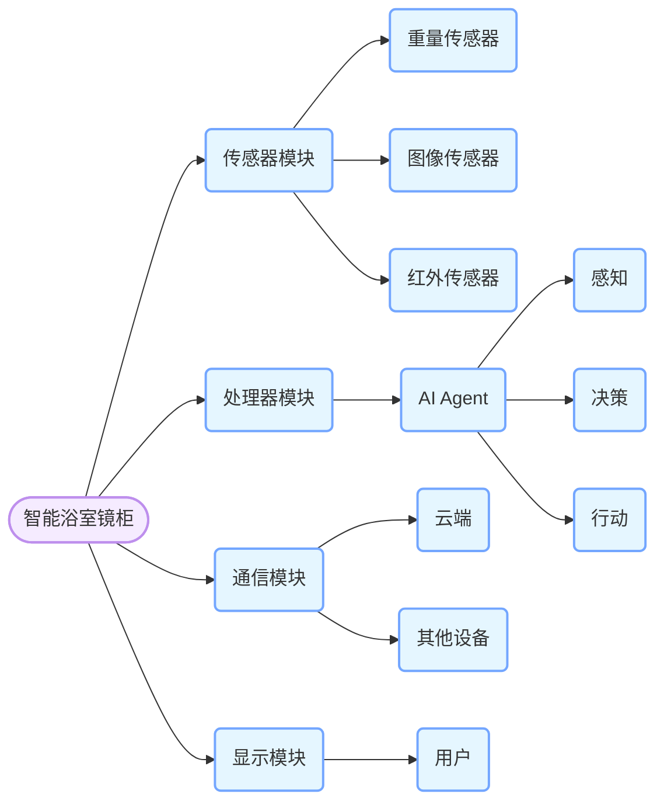

# 智能浴室镜柜：AI Agent的个人护理用品管理

> 关键词：智能浴室镜柜、AI Agent、个人护理用品管理、物联网、人工智能、传感器技术、数据分析

> 摘要：本文围绕智能浴室镜柜中AI Agent的个人护理用品管理展开深入探讨。首先介绍了智能浴室镜柜及AI Agent的相关背景知识，阐述了其研究目的、范围、预期读者和文档结构。接着详细剖析了核心概念与联系，包括智能浴室镜柜和AI Agent的原理与架构，并通过Mermaid流程图直观展示。然后讲解了核心算法原理及具体操作步骤，辅以Python源代码。在数学模型和公式部分，给出相关数学表达并举例说明。通过项目实战，介绍开发环境搭建、源代码实现及解读。分析了智能浴室镜柜在实际生活中的应用场景，推荐了学习、开发工具及相关论文著作。最后总结了未来发展趋势与挑战，还提供了常见问题解答和扩展阅读参考资料，旨在为智能浴室镜柜及个人护理用品管理领域的研究与实践提供全面且深入的参考。

## 1. 背景介绍 
### 1.1 目的和范围
随着人们生活水平的提高，对家居智能化的需求日益增长。智能浴室镜柜作为智能家居的一部分，不仅具备传统镜柜的收纳功能，还融入了先进的AI技术，实现对个人护理用品的智能管理。本文章的目的在于深入探讨智能浴室镜柜中AI Agent如何实现个人护理用品的有效管理，包括用品的识别、库存管理、使用记录分析等方面。范围涵盖智能浴室镜柜的技术原理、算法实现、实际应用场景以及未来发展趋势等内容。

### 1.2 预期读者
本文预期读者包括智能家居领域的开发者、研究人员，对智能生活感兴趣的爱好者，以及从事家居产品设计、制造的相关专业人士。通过阅读本文，他们可以了解智能浴室镜柜中AI Agent的个人护理用品管理的技术细节和应用前景，为相关的研发、设计和使用提供参考。

### 1.3 文档结构概述
本文共分为十个部分。第一部分背景介绍，阐述目的、范围、预期读者和文档结构，并给出术语表。第二部分讲解核心概念与联系，包括智能浴室镜柜和AI Agent的原理与架构，并通过流程图展示。第三部分介绍核心算法原理及具体操作步骤，使用Python源代码详细阐述。第四部分给出数学模型和公式，进行详细讲解并举例说明。第五部分是项目实战，包括开发环境搭建、源代码实现及解读。第六部分分析实际应用场景。第七部分推荐学习、开发工具及相关论文著作。第八部分总结未来发展趋势与挑战。第九部分为附录，提供常见问题与解答。第十部分给出扩展阅读和参考资料。

### 1.4 术语表
#### 1.4.1 核心术语定义
- **智能浴室镜柜**：一种集成了多种传感器、处理器和通信模块的浴室镜柜，能够与用户和其他设备进行交互，实现智能化的功能，如个人护理用品管理。
- **AI Agent（人工智能代理）**：一种能够感知环境、根据感知信息进行决策，并采取行动以实现特定目标的智能实体。在智能浴室镜柜中，AI Agent负责对个人护理用品进行管理。
- **个人护理用品**：用于个人清洁、护肤、化妆等方面的用品，如牙刷、牙膏、洗面奶、口红等。
- **物联网（IoT）**：通过各种信息传感器、射频识别技术、全球定位系统等各种装置与技术，实时采集任何需要监控、连接、互动的物体或过程，采集其声、光、热、电、力学、化学、生物、位置等各种需要的信息，通过各类可能的网络接入，实现物与物、物与人的泛在连接，实现对物品和过程的智能化感知、识别和管理。

#### 1.4.2 相关概念解释
- **传感器技术**：智能浴室镜柜中使用多种传感器，如重量传感器、图像传感器、红外传感器等，用于感知个人护理用品的状态和位置。重量传感器可以检测用品的重量变化，从而判断其使用情况；图像传感器可以识别用品的种类和外观；红外传感器可以检测用户的接近和动作。
- **数据分析**：AI Agent通过对传感器采集的数据进行分析，了解用户的使用习惯、用品的库存情况等信息。数据分析可以采用机器学习、深度学习等技术，挖掘数据中的潜在信息，为个人护理用品管理提供决策支持。

#### 1.4.3 缩略词列表
- **IoT**：Internet of Things（物联网）
- **AI**：Artificial Intelligence（人工智能）
- **RFID**：Radio Frequency Identification（射频识别）

## 2. 核心概念与联系 

### 智能浴室镜柜原理
智能浴室镜柜主要由镜柜本体、传感器模块、处理器模块、通信模块和显示模块组成。传感器模块负责采集个人护理用品的相关信息，如重量、图像、位置等；处理器模块对传感器采集的数据进行处理和分析，通过AI Agent实现个人护理用品的管理；通信模块将处理后的数据传输到云端或其他设备，实现数据的共享和交互；显示模块用于向用户展示个人护理用品的信息，如库存、使用记录等。

### AI Agent原理
AI Agent是智能浴室镜柜的核心，它具有感知、决策和行动三个基本功能。感知功能通过传感器模块获取个人护理用品的信息；决策功能根据感知到的信息，结合预设的规则和算法，对个人护理用品的管理做出决策，如提醒用户补充用品、推荐适合的用品等；行动功能通过控制镜柜的相关设备，如灯光、柜门等，实现对个人护理用品的管理操作。

### 核心概念架构示意图


从这个流程图可以看出，智能浴室镜柜的各个模块相互协作，共同实现个人护理用品的管理。传感器模块采集数据，处理器模块中的AI Agent进行分析和决策，通信模块实现数据的传输，显示模块向用户展示信息。

## 3. 核心算法原理 & 具体操作步骤 

### 核心算法原理
智能浴室镜柜中AI Agent的核心算法主要包括用品识别算法、库存管理算法和使用记录分析算法。

#### 用品识别算法
用品识别算法主要基于图像识别技术，通过训练好的深度学习模型对图像传感器采集的个人护理用品图像进行分类识别。常用的深度学习模型有卷积神经网络（CNN），如ResNet、VGG等。

以下是一个简单的使用Python和PyTorch实现的用品识别算法示例：
```python
import torch
import torch.nn as nn
import torch.optim as optim
from torchvision import datasets, transforms, models

# 数据预处理
transform = transforms.Compose([
    transforms.Resize((224, 224)),
    transforms.ToTensor(),
    transforms.Normalize(mean=[0.485, 0.456, 0.406], std=[0.229, 0.224, 0.225])
])

# 加载数据集
train_dataset = datasets.ImageFolder(root='train_data', transform=transform)
train_loader = torch.utils.data.DataLoader(train_dataset, batch_size=32, shuffle=True)

# 加载预训练模型
model = models.resnet18(pretrained=True)
num_ftrs = model.fc.in_features
model.fc = nn.Linear(num_ftrs, len(train_dataset.classes))

# 定义损失函数和优化器
criterion = nn.CrossEntropyLoss()
optimizer = optim.SGD(model.parameters(), lr=0.001, momentum=0.9)

# 训练模型
device = torch.device("cuda:0" if torch.cuda.is_available() else "cpu")
model.to(device)

for epoch in range(10):
    running_loss = 0.0
    for i, data in enumerate(train_loader, 0):
        inputs, labels = data[0].to(device), data[1].to(device)

        optimizer.zero_grad()

        outputs = model(inputs)
        loss = criterion(outputs, labels)
        loss.backward()
        optimizer.step()

        running_loss += loss.item()
    print(f'Epoch {epoch + 1}, Loss: {running_loss / len(train_loader)}')

print('Finished Training')
```

#### 库存管理算法
库存管理算法根据重量传感器采集的用品重量变化，实时更新用品的库存信息。当用品的重量低于预设的阈值时，AI Agent会提醒用户补充用品。

以下是一个简单的库存管理算法示例：
```python
# 假设每个用品的初始重量和阈值
item_weights = {
    'toothpaste': 200,
    'shampoo': 500
}
thresholds = {
    'toothpaste': 50,
    'shampoo': 100
}

# 模拟重量传感器采集的数据
current_weights = {
    'toothpaste': 40,
    'shampoo': 120
}

# 检查库存
for item in item_weights:
    if current_weights[item] < thresholds[item]:
        print(f'{item} is running low. Please replenish.')
```

#### 使用记录分析算法
使用记录分析算法通过分析用户的使用时间、使用频率等信息，了解用户的使用习惯，为用户提供个性化的推荐和建议。

以下是一个简单的使用记录分析算法示例：
```python
import pandas as pd

# 模拟使用记录数据
usage_records = {
    'date': ['2024-01-01', '2024-01-02', '2024-01-03'],
    'item': ['toothpaste', 'shampoo', 'toothpaste'],
    'time': ['08:00', '20:00', '08:10']
}

df = pd.DataFrame(usage_records)

# 分析使用频率
item_frequency = df['item'].value_counts()
print('Usage frequency:')
print(item_frequency)

# 分析使用时间
item_time = df.groupby('item')['time'].agg(lambda x: x.tolist())
print('Usage time:')
print(item_time)
```

### 具体操作步骤
1. **数据采集**：传感器模块实时采集个人护理用品的相关信息，如重量、图像、使用时间等。
2. **数据传输**：通信模块将采集到的数据传输到处理器模块。
3. **数据处理**：处理器模块中的AI Agent对数据进行处理和分析，使用上述核心算法实现用品识别、库存管理和使用记录分析。
4. **决策与行动**：根据分析结果，AI Agent做出决策，如提醒用户补充用品、推荐适合的用品等，并通过控制镜柜的相关设备实现相应的行动。
5. **信息展示**：显示模块将处理后的信息展示给用户，如库存信息、使用记录、推荐建议等。

## 4. 数学模型和公式 & 详细讲解 & 举例说明 

### 用品识别算法的数学模型
在用品识别算法中，使用卷积神经网络（CNN）进行图像分类。CNN的基本结构包括卷积层、池化层和全连接层。

#### 卷积层
卷积层的数学模型可以表示为：
$$y_{i,j}^l = \sum_{m=0}^{M-1}\sum_{n=0}^{N-1} x_{i+m,j+n}^{l-1} \cdot w_{m,n}^l + b^l$$
其中，$y_{i,j}^l$ 是第 $l$ 层卷积层的输出特征图中 $(i, j)$ 位置的值，$x_{i+m,j+n}^{l-1}$ 是第 $l - 1$ 层输入特征图中 $(i + m, j + n)$ 位置的值，$w_{m,n}^l$ 是第 $l$ 层的卷积核中 $(m, n)$ 位置的权重，$b^l$ 是第 $l$ 层的偏置，$M$ 和 $N$ 是卷积核的大小。

#### 池化层
池化层的主要作用是对特征图进行下采样，常用的池化方法有最大池化和平均池化。以最大池化为例，其数学模型可以表示为：
$$y_{i,j}^l = \max_{m=0}^{M-1}\max_{n=0}^{N-1} x_{i \times s + m,j \times s + n}^{l-1}$$
其中，$y_{i,j}^l$ 是第 $l$ 层池化层的输出特征图中 $(i, j)$ 位置的值，$x_{i \times s + m,j \times s + n}^{l-1}$ 是第 $l - 1$ 层输入特征图中 $(i \times s + m, j \times s + n)$ 位置的值，$s$ 是池化的步长，$M$ 和 $N$ 是池化窗口的大小。

#### 全连接层
全连接层的数学模型可以表示为：
$$y^l = \sigma(\sum_{k=0}^{K-1} w_{k}^l \cdot x_{k}^{l-1} + b^l)$$
其中，$y^l$ 是第 $l$ 层全连接层的输出，$x_{k}^{l-1}$ 是第 $l - 1$ 层的输入，$w_{k}^l$ 是第 $l$ 层的权重，$b^l$ 是第 $l$ 层的偏置，$\sigma$ 是激活函数，如ReLU、Sigmoid等。

### 库存管理算法的数学模型
库存管理算法主要基于重量传感器采集的用品重量变化来更新库存信息。设 $W_0$ 是用品的初始重量，$W_t$ 是 $t$ 时刻的重量，则 $t$ 时刻的库存比例 $P_t$ 可以表示为：
$$P_t = \frac{W_t}{W_0} \times 100\%$$
当 $P_t$ 低于预设的阈值 $\theta$ 时，AI Agent会提醒用户补充用品。

### 举例说明
#### 用品识别算法
假设我们有一个简单的CNN模型，输入图像的大小为 $32 \times 32$，有3个通道（RGB）。第一个卷积层的卷积核大小为 $3 \times 3$，有16个卷积核，步长为1，填充为1。则第一个卷积层的输出特征图的大小为 $32 \times 32$，通道数为16。

#### 库存管理算法
假设一支牙膏的初始重量 $W_0 = 200$ 克，$t$ 时刻的重量 $W_t = 50$ 克，则 $t$ 时刻的库存比例 $P_t = \frac{50}{200} \times 100\% = 25\%$。如果预设的阈值 $\theta = 30\%$，则此时AI Agent会提醒用户补充牙膏。

## 5. 项目实战：代码实际案例和详细解释说明 

### 5.1  开发环境搭建
#### 硬件环境
- **智能浴室镜柜**：选择具有传感器接口、处理器和通信模块的智能浴室镜柜。
- **传感器**：重量传感器、图像传感器、红外传感器等。
- **开发板**：如Raspberry Pi等，用于运行AI Agent程序。

#### 软件环境
- **操作系统**：Raspbian（基于Linux）
- **编程语言**：Python 3.x
- **深度学习框架**：PyTorch
- **数据处理库**：Pandas、NumPy
- **通信库**：MQTT、HTTP

### 5.2  源代码详细实现和代码解读
以下是一个简单的智能浴室镜柜AI Agent程序的实现示例：

```python
import time
import random
import pandas as pd
import torch
from torchvision import transforms, models

# 模拟传感器数据采集
class Sensor:
    def __init__(self, item):
        self.item = item
        self.initial_weight = random.randint(100, 500)
        self.current_weight = self.initial_weight

    def get_weight(self):
        # 模拟重量减少
        if self.current_weight > 0:
            self.current_weight -= random.randint(1, 10)
        return self.current_weight

    def get_image(self):
        # 模拟图像采集
        return None

# 用品识别模型
class ItemRecognizer:
    def __init__(self):
        self.model = models.resnet18(pretrained=True)
        num_ftrs = self.model.fc.in_features
        self.model.fc = torch.nn.Linear(num_ftrs, 10)  # 假设10种用品
        self.model.eval()
        self.transform = transforms.Compose([
            transforms.Resize((224, 224)),
            transforms.ToTensor(),