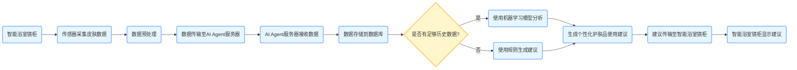

# 智能浴室镜柜：AI Agent的护肤品使用建议

> 关键词：智能浴室镜柜、AI Agent、护肤品使用建议、人工智能、皮肤分析

> 摘要：本文围绕智能浴室镜柜中AI Agent提供护肤品使用建议这一主题展开深入探讨。首先介绍了相关背景，包括目的、预期读者、文档结构和术语表。接着阐述了核心概念与联系，通过文本示意图和Mermaid流程图呈现其原理和架构。详细讲解了核心算法原理及具体操作步骤，并用Python源代码进行说明。分析了相关的数学模型和公式，并举例解释。通过项目实战，展示了开发环境搭建、源代码实现与解读。探讨了实际应用场景，推荐了学习资源、开发工具框架和相关论文著作。最后总结了未来发展趋势与挑战，还提供了常见问题解答和扩展阅读参考资料，旨在为读者全面剖析智能浴室镜柜结合AI Agent提供护肤品使用建议的技术和应用。

## 1. 背景介绍 
### 1.1 目的和范围
随着科技的不断发展，智能家居设备逐渐普及，智能浴室镜柜作为其中的一员，正日益受到消费者的关注。本文章的目的在于深入探讨如何利用AI Agent为智能浴室镜柜赋予提供护肤品使用建议的功能。具体范围涵盖了从核心概念的阐述、算法原理的分析、数学模型的构建，到实际项目的开发与应用，以及相关工具和资源的推荐等方面。通过全面的研究，旨在为相关领域的开发者、研究者以及对智能家居和护肤感兴趣的消费者提供有价值的参考。

### 1.2 预期读者
本文的预期读者主要包括以下几类人群：
- **智能家居开发者**：希望了解如何将AI技术应用于智能浴室镜柜，为产品增添新的功能和竞争力。
- **人工智能研究者**：对AI Agent在特定领域的应用感兴趣，通过研究智能浴室镜柜中的实际案例，探索AI技术的新应用场景。
- **护肤品行业从业者**：了解智能科技如何与护肤领域相结合，为产品的研发和推广提供新的思路。
- **普通消费者**：对智能浴室镜柜和个性化护肤建议感兴趣，希望了解其背后的技术原理和实际应用效果。

### 1.3 文档结构概述
本文将按照以下结构进行详细阐述：
- **核心概念与联系**：介绍智能浴室镜柜、AI Agent和护肤品使用建议的核心概念，并通过文本示意图和Mermaid流程图展示它们之间的联系和架构。
- **核心算法原理 & 具体操作步骤**：深入分析实现AI Agent提供护肤品使用建议的核心算法，并用Python源代码详细说明具体的操作步骤。
- **数学模型和公式 & 详细讲解 & 举例说明**：构建相关的数学模型，推导公式，并通过实际例子进行详细解释。
- **项目实战：代码实际案例和详细解释说明**：从开发环境搭建开始，逐步展示项目的源代码实现和详细解读，分析代码的功能和逻辑。
- **实际应用场景**：探讨智能浴室镜柜中AI Agent提供护肤品使用建议的实际应用场景和优势。
- **工具和资源推荐**：推荐学习相关技术的资源，包括书籍、在线课程、技术博客和网站，以及开发工具框架和相关论文著作。
- **总结：未来发展趋势与挑战**：总结智能浴室镜柜结合AI Agent提供护肤品使用建议的未来发展趋势，并分析可能面临的挑战。
- **附录：常见问题与解答**：解答读者在阅读过程中可能遇到的常见问题。
- **扩展阅读 & 参考资料**：提供相关的扩展阅读材料和参考资料，方便读者进一步深入研究。

### 1.4 术语表
#### 1.4.1 核心术语定义
- **智能浴室镜柜**：集成了多种智能功能的浴室镜柜，通常具备显示屏、传感器等设备，能够与用户进行交互。
- **AI Agent**：人工智能代理，是一种能够感知环境、进行决策并采取行动的智能实体。在本文中，AI Agent主要负责分析用户的皮肤状况，提供个性化的护肤品使用建议。
- **护肤品使用建议**：根据用户的皮肤状况、需求和偏好，为用户推荐适合的护肤品和使用方法。

#### 1.4.2 相关概念解释
- **皮肤分析**：通过各种技术手段，对用户的皮肤进行检测和评估，包括皮肤的水分含量、油脂分泌、皱纹情况等。
- **个性化推荐**：根据用户的个人信息和行为数据，为用户提供符合其特定需求和偏好的推荐内容。
- **机器学习**：一种让计算机通过数据学习模式和规律的技术，常用于构建AI Agent的算法模型。

#### 1.4.3 缩略词列表
- **AI**：Artificial Intelligence，人工智能
- **ML**：Machine Learning，机器学习
- **CNN**：Convolutional Neural Network，卷积神经网络
- **API**：Application Programming Interface，应用程序编程接口

## 2. 核心概念与联系 

### 核心概念原理
智能浴室镜柜结合AI Agent提供护肤品使用建议的核心原理是通过智能浴室镜柜中的传感器收集用户的皮肤数据，将这些数据传输给AI Agent进行分析和处理。AI Agent利用机器学习和深度学习算法，对皮肤数据进行建模和分析，结合用户的个人信息和历史护肤记录，为用户生成个性化的护肤品使用建议。

### 架构的文本示意图
```plaintext
智能浴室镜柜
|-- 传感器模块
|   |-- 摄像头：拍摄皮肤图像
|   |-- 水分传感器：检测皮肤水分含量
|   |-- 油脂传感器：检测皮肤油脂分泌
|-- 数据处理模块
|   |-- 数据采集：收集传感器数据
|   |-- 数据预处理：清洗、转换和特征提取
|-- 通信模块
|   |-- 与AI Agent服务器通信：传输数据和接收建议
|-- 显示模块
|   |-- 显示屏：展示护肤品使用建议

AI Agent服务器
|-- 数据存储模块
|   |-- 数据库：存储用户皮肤数据、个人信息和历史记录
|-- 模型训练模块
|   |-- 机器学习模型：如CNN、决策树等
|   |-- 模型训练：使用历史数据进行训练
|-- 建议生成模块
|   |-- 分析用户数据
|   |-- 结合模型和规则生成建议
|-- 通信模块
|   |-- 与智能浴室镜柜通信：接收数据和发送建议
```

### Mermaid流程图


## 3. 核心算法原理 & 具体操作步骤 

### 核心算法原理
实现AI Agent提供护肤品使用建议的核心算法主要包括以下几个方面：
- **皮肤图像分析**：使用卷积神经网络（CNN）对摄像头拍摄的皮肤图像进行分析，识别皮肤的纹理、颜色、斑点等特征，评估皮肤的健康状况。
- **数据融合**：将皮肤图像分析结果与水分传感器、油脂传感器等采集的数据进行融合，综合评估皮肤的水分含量、油脂分泌等情况。
- **机器学习模型**：使用决策树、支持向量机等机器学习模型，根据用户的皮肤数据、个人信息和历史护肤记录，预测用户适合的护肤品类型和使用方法。

### 具体操作步骤及Python源代码

#### 步骤1：数据采集
使用摄像头和传感器采集用户的皮肤数据，并将数据保存为文件。
```python
import cv2
import serial

# 摄像头采集皮肤图像
cap = cv2.VideoCapture(0)
ret, frame = cap.read()
if ret:
    cv2.imwrite('skin_image.jpg', frame)
cap.release()

# 传感器采集水分和油脂数据
ser = serial.Serial('COM3', 9600)  # 根据实际情况修改串口和波特率
moisture_data = ser.readline().decode().strip()
oil_data = ser.readline().decode().strip()
ser.close()

# 保存数据到文件
with open('skin_data.txt', 'w') as f:
    f.write(f'moisture: {moisture_data}\noil: {oil_data}')
```

#### 步骤2：数据预处理
对采集到的皮肤图像和传感器数据进行预处理，包括图像裁剪、归一化和数据清洗。
```python
import cv2
import numpy as np

# 读取皮肤图像
image = cv2.imread('skin_image.jpg')

# 图像裁剪
height, width, _ = image.shape
center_x, center_y = width // 2, height // 2
cropped_image = image[center_y - 100:center_y + 100, center_x - 100:center_x + 100]

# 图像归一化
normalized_image = cropped_image / 255.0

# 读取传感器数据
with open('skin_data.txt', 'r') as f:
    lines = f.readlines()
    moisture = float(lines[0].split(':')[1].strip())
    oil = float(lines[1].split(':')[1].strip())

# 数据清洗
if moisture < 0:
    moisture = 0
if oil < 0:
    oil = 0
```

#### 步骤3：皮肤图像分析
使用预训练的CNN模型对皮肤图像进行分析，提取皮肤特征。
```python
import tensorflow as tf

# 加载预训练的CNN模型
model = tf.keras.models.load_model('skin_analysis_model.h5')

# 调整图像尺寸以适应模型输入
input_image = cv2.resize(normalized_image, (224, 224))
input_image = np.expand_dims(input_image, axis=0)

# 进行图像分析
features = model.predict(input_image)
```

#### 步骤4：数据融合
将皮肤图像分析结果与传感器数据进行融合，生成综合的皮肤特征向量。
```python
# 融合图像特征和传感器数据
combined_features = np.concatenate((features.flatten(), [moisture, oil]))
```

#### 步骤5：机器学习模型预测
使用训练好的机器学习模型对综合皮肤特征向量进行预测，生成护肤品使用建议。
```python
import joblib

# 加载训练好的机器学习模型
ml_model = joblib.load('skincare_recommendation_model.pkl')

# 进行预测
recommendation = ml_model.predict([combined_features])

print(f'推荐的护肤品：{recommendation[0]}')
```

## 4. 数学模型和公式 & 详细讲解 & 举例说明 

### 皮肤图像分析的数学模型
在皮肤图像分析中，常用的卷积神经网络（CNN）的数学模型可以表示为：

$$
y = f(W * x + b)
$$

其中，$x$ 是输入的皮肤图像，$W$ 是卷积核的权重矩阵，$*$ 表示卷积操作，$b$ 是偏置项，$f$ 是激活函数，$y$ 是输出的特征图。

### 数据融合的数学模型
数据融合的过程可以使用加权求和的方法，将皮肤图像分析结果和传感器数据进行融合。假设皮肤图像分析结果的特征向量为 $x_1$，传感器数据的特征向量为 $x_2$，融合后的特征向量为 $x$，则有：

$$
x = \alpha x_1 + (1 - \alpha) x_2
$$

其中，$\alpha$ 是权重系数，取值范围为 $[0, 1]$，用于控制皮肤图像分析结果和传感器数据的相对重要性。

### 机器学习模型的数学模型
以决策树模型为例，决策树的每个节点可以表示为一个条件判断，根据输入特征的值决定下一步的分支。假设决策树的根节点的条件判断为 $x_i > t$，其中 $x_i$ 是输入特征的第 $i$ 个分量，$t$ 是阈值，则有：

$$
\text{if } x_i > t \text{ then } \text{go to left child node}
$$
$$
\text{else } \text{go to right child node}
$$

### 举例说明
假设我们有一个简单的皮肤图像分析任务，输入的皮肤图像是一个 $3 \times 3$ 的灰度图像：

$$
x = 
\begin{bmatrix}
1 & 2 & 3 \\
4 & 5 & 6 \\
7 & 8 & 9
\end{bmatrix}
$$

卷积核的权重矩阵为：

$$
W = 
\begin{bmatrix}
1 & 0 \\
0 & 1
\end{bmatrix}
$$

偏置项 $b = 1$，激活函数 $f(x) = \max(0, x)$（ReLU函数）。

首先进行卷积操作：

$$
W * x = 
\begin{bmatrix}
1 \times 1 + 0 \times 2 & 1 \times 2 + 0 \times 3 \\
0 \times 1 + 1 \times 4 & 0 \times 2 + 1 \times 5
\end{bmatrix}
= 
\begin{bmatrix}
1 & 2 \\
4 & 5
\end{bmatrix}
$$

然后加上偏置项：

$$
W * x + b = 
\begin{bmatrix}
1 + 1 & 2 + 1 \\
4 + 1 & 5 + 1
\end{bmatrix}
= 
\begin{bmatrix}
2 & 3 \\
5 & 6
\end{bmatrix}
$$

最后应用激活函数：

$$
y = f(W * x + b) = 
\begin{bmatrix}
2 & 3 \\
5 & 6
\end{bmatrix}
$$

在数据融合的例子中，假设皮肤图像分析结果的特征向量为 $x_1 = [0.2, 0.3]$，传感器数据的特征向量为 $x_2 = [0.5, 0.6]$，权重系数 $\alpha = 0.6$，则融合后的特征向量为：

$$
x = 0.6 \times [0.2, 0.3] + (1 - 0.6) \times [0.5, 0.6] = [0.2 \times 0.6 + 0.5 \times 0.4, 0.3 \times 0.6 + 0.6 \times 0.4] = [0.32, 0.42]
$$

## 5. 项目实战：代码实际案例和详细解释说明 

### 5.1  开发环境搭建
#### 硬件环境
- **智能浴室镜柜**：选择具备摄像头、水分传感器、油脂传感器和显示屏的智能浴室镜柜。
- **服务器**：可以使用云服务器或本地服务器，推荐使用配置较高的服务器以确保模型训练和推理的效率。

#### 软件环境
- **操作系统**：Windows、Linux或macOS均可。
- **编程语言**：Python 3.x
- **深度学习框架**：TensorFlow、PyTorch等
- **机器学习库**：Scikit-learn
- **数据库**：MySQL、MongoDB等

#### 安装依赖库
```bash
pip install tensorflow scikit-learn opencv-python serial
```

### 5.2  源代码详细实现和代码解读

#### 数据采集模块
```python
import cv2
import serial

def capture_skin_image():
    cap = cv2.VideoCapture(0)
    ret, frame = cap.read()
    if ret:
        cv2.imwrite('skin_image.jpg', frame)
    cap.release()

def collect_sensor_data():
    ser = serial.Serial('COM3', 9600)  # 根据实际情况修改串口和波特率
    moisture_data = ser.readline().decode().strip()
    oil_data = ser.readline().decode().strip()
    ser.close()
    return moisture_data, oil_data

if __name__ == '__main__':
    capture_skin_image()
    moisture, oil = collect_sensor_data()
    with open('skin_data.txt', 'w') as f:
        f.write(f'moisture: {moisture}\noil: {oil}')
```
**代码解读**：
- `capture_skin_image` 函数使用OpenCV库打开摄像头，拍摄皮肤图像并保存为 `skin_image.jpg`。
- `collect_sensor_data` 函数使用 `serial` 库从串口读取水分和油脂传感器的数据。
- 主程序调用这两个函数，将采集到的数据保存到 `skin_data.txt` 文件中。

#### 数据预处理模块
```python
import cv2
import numpy as np

def preprocess_image():
    image = cv2.imread('skin_image.jpg')
    height, width, _ = image.shape
    center_x, center_y = width // 2, height // 2
    cropped_image = image[center_y - 100:center_y + 100, center_x - 100:center_x + 100]
    normalized_image = cropped_image / 255.0
    return normalized_image

def preprocess_sensor_data():
    with open('skin_data.txt', 'r') as f:
        lines = f.readlines()
        moisture = float(lines[0].split(':')[1].strip())
        oil = float(lines[1].split(':')[1].strip())
    if moisture < 0:
        moisture = 0
    if oil < 0:
        oil = 0
    return moisture, oil

if __name__ == '__main__':
    image = preprocess_image()
    moisture, oil = preprocess_sensor_data()
    print(f'预处理后的图像形状：{image.shape}')
    print(f'水分含量：{moisture}，油脂含量：{oil}')
```
**代码解读**：
- `preprocess_image` 函数读取皮肤图像，进行裁剪和归一化处理。
- `preprocess_sensor_data` 函数读取传感器数据，进行数据清洗。
- 主程序调用这两个函数，输出预处理后的图像形状和传感器数据。

#### 皮肤图像分析模块
```python
import tensorflow as tf

def analyze_skin_image(image):
    model = tf.keras.models.load_model('skin_analysis_model.h5')
    input_image = cv2.resize(image, (224, 224))
    input_image = np.expand_dims(input_image, axis=0)
    features = model.predict(input_image)
    return features

if __name__ == '__main__':
    image = preprocess_image()
    features = analyze_skin_image(image)
    print(f'皮肤图像分析特征形状：{features.shape}')
```
**代码解读**：
- `analyze_skin_image` 函数加载预训练的CNN模型，对预处理后的皮肤图像进行分析，提取特征。
- 主程序调用该函数，输出皮肤图像分析特征的形状。

#### 数据融合模块
```python
import numpy as np

def fuse_data(image_features, moisture, oil):
    combined_features = np.concatenate((image_features.flatten(), [moisture, oil]))
    return combined_features

if __name__ == '__main__':
    image = preprocess_image()
    features = analyze_skin_image(image)
    moisture, oil = preprocess_sensor_data()
    combined_features = fuse_data(features, moisture, oil)
    print(f'融合后特征向量长度：{len(combined_features)}')
```
**代码解读**：
- `fuse_data` 函数将皮肤图像分析特征和传感器数据进行融合，生成综合的特征向量。
- 主程序调用该函数，输出融合后特征向量的长度。

#### 机器学习模型预测模块
```python
import joblib

def predict_skincare(features):
    ml_model = joblib.load('skincare_recommendation_model.pkl')
    recommendation = ml_model.predict([features])
    return recommendation

if __name__ == '__main__':
    image = preprocess_image()
    features = analyze_skin_image(image)
    moisture, oil = preprocess_sensor_data()
    combined_features = fuse_data(features, moisture, oil)
    recommendation = predict_skincare(combined_features)
    print(f'推荐的护肤品：{recommendation[0]}')
```
**代码解读**：
- `predict_skincare` 函数加载训练好的机器学习模型，对融合后的特征向量进行预测，生成护肤品使用建议。
- 主程序调用该函数，输出推荐的护肤品。

### 5.3  代码解读与分析
- **模块化设计**：代码采用模块化设计，将数据采集、预处理、图像分析、数据融合和预测等功能分别封装成独立的函数，提高了代码的可维护性和复用性。
- **数据处理流程**：整个代码遵循数据采集、预处理、分析和预测的流程，确保数据的准确性和可靠性。
- **模型使用**：使用预训练的CNN模型进行皮肤图像分析，训练好的机器学习模型进行护肤品推荐，提高了预测的准确性和效率。

## 6. 实际应用场景 
### 家庭护肤
在家庭环境中，用户可以使用智能浴室镜柜中的AI Agent获得个性化的护肤品使用建议。每天早上或晚上洗漱时，用户站在智能浴室镜柜前，摄像头和传感器会自动采集皮肤数据，AI Agent根据这些数据分析皮肤状况，为用户推荐适合当天皮肤状态的护肤品，如爽肤水、乳液、面霜等，并提供使用方法和注意事项。

### 美容院
美容院可以利用智能浴室镜柜和AI Agent为顾客提供更专业的护肤服务。顾客在美容院进行护肤护理前，先使用智能浴室镜柜进行皮肤检测，AI Agent生成详细的皮肤分析报告和护肤品使用建议。美容师可以根据这些建议为顾客制定个性化的护肤方案，提高护肤效果和顾客满意度。

### 护肤品销售
在护肤品销售场所，如商场专柜、化妆品店等，智能浴室镜柜可以作为一种营销工具。顾客可以通过智能浴室镜柜了解自己的皮肤状况，获得AI Agent提供的护肤品使用建议，从而更有针对性地选择适合自己的护肤品。这不仅可以提高顾客的购买转化率，还可以增加顾客对品牌的信任度。

## 7. 工具和资源推荐
### 7.1 学习资源推荐
#### 7.1.1 书籍推荐
- 《Python机器学习》：介绍了Python在机器学习领域的应用，包括各种机器学习算法的原理和实现。
- 《深度学习》：由深度学习领域的三位先驱Ian Goodfellow、Yoshua Bengio和Aaron Courville撰写，全面介绍了深度学习的理论和实践。
- 《计算机视觉：算法与应用》：详细讲解了计算机视觉的基本算法和应用，包括图像分析、目标检测等内容。

#### 7.1.2 在线课程
- Coursera上的“机器学习”课程：由斯坦福大学的Andrew Ng教授授课，是机器学习领域的经典课程。
- edX上的“深度学习”课程：提供了深度学习的基础知识和实践项目。
- 网易云课堂上的“计算机视觉实战”课程：通过实际项目介绍计算机视觉的应用和开发。

#### 7.1.3 技术博客和网站
- Medium：有许多关于人工智能、机器学习和计算机视觉的技术文章和博客。
- GitHub：可以找到各种开源的机器学习和计算机视觉项目，学习他人的代码和经验。
- Kaggle：一个数据科学竞赛平台，提供了丰富的数据集和竞赛项目，可以锻炼数据分析和建模能力。

### 7.2 开发工具框架推荐
#### 7.2.1 IDE和编辑器
- PyCharm：一款专业的Python集成开发环境，提供了丰富的代码编辑、调试和项目管理功能。
- Jupyter Notebook：一个交互式的开发环境，适合进行数据探索、模型训练和代码演示。
- Visual Studio Code：一款轻量级的代码编辑器，支持多种编程语言和插件扩展。

#### 7.2.2 调试和性能分析工具
- TensorBoard：TensorFlow提供的可视化工具，可以用于监控模型训练过程、分析模型性能。
- Py-Spy：一个Python性能分析工具，可以实时监测Python程序的CPU使用情况和函数调用时间。
- cProfile：Python标准库中的性能分析模块，可以对Python代码进行性能分析和优化。

#### 7.2.3 相关框架和库
- TensorFlow：一个开源的深度学习框架，提供了丰富的神经网络模型和工具，支持大规模分布式训练。
- PyTorch：另一个流行的深度学习框架，具有动态图和易于使用的特点，适合快速原型开发。
- Scikit-learn：一个简单易用的机器学习库，提供了各种机器学习算法和工具，如分类、回归、聚类等。

### 7.3 相关论文著作推荐
#### 7.3.1 经典论文
- LeCun, Y., Bottou, L., Bengio, Y., & Haffner, P. (1998). Gradient-based learning applied to document recognition. Proceedings of the IEEE, 86(11), 2278-2324. 介绍了卷积神经网络（CNN）在文档识别中的应用。
- Krizhevsky, A., Sutskever, I., & Hinton, G. E. (2012). ImageNet classification with deep convolutional neural networks. Advances in neural information processing systems, 1097-1105. 提出了AlexNet模型，开启了深度学习在计算机视觉领域的革命。
- Vapnik, V. N., & Chervonenkis, A. Y. (1971). On the uniform convergence of relative frequencies of events to their probabilities. Theory of Probability & Its Applications, 16(2), 264-280. 介绍了支持向量机（SVM）的理论基础。

#### 7.3.2 最新研究成果
- 关注顶级学术会议如NeurIPS、CVPR、ICML等的最新论文，了解人工智能和机器学习领域的最新研究动态。
- 查阅相关领域的学术期刊，如Journal of Artificial Intelligence Research、IEEE Transactions on Pattern Analysis and Machine Intelligence等。

#### 7.3.3 应用案例分析
- 可以参考一些实际应用案例的研究报告和论文，了解智能浴室镜柜、AI Agent和护肤品推荐等领域的实际应用情况和技术实现细节。

## 8. 总结：未来发展趋势与挑战
### 未来发展趋势
- **多模态数据融合**：未来的智能浴室镜柜将不仅仅依赖于摄像头和传感器采集的数据，还会结合用户的语音指令、健康数据等多模态信息，提供更全面、准确的护肤品使用建议。
- **个性化定制**：随着人工智能技术的不断发展，AI Agent将能够为用户提供更加个性化的护肤品推荐，考虑到用户的基因信息、生活习惯、环境因素等，实现真正的定制化护肤。
- **与物联网的融合**：智能浴室镜柜将与其他智能家居设备进行深度融合，如智能马桶、智能灯光等，实现整个浴室环境的智能化控制和协同工作。
- **虚拟试妆功能**：结合增强现实（AR）技术，智能浴室镜柜可以为用户提供虚拟试妆功能，让用户在购买护肤品前先体验不同的妆容效果。

### 挑战
- **数据隐私和安全**：智能浴室镜柜采集的用户皮肤数据和个人信息属于敏感信息，如何确保数据的隐私和安全是一个重要的挑战。需要采取有效的数据加密、访问控制等措施，防止数据泄露和滥用。
- **模型准确性和泛化能力**：AI Agent的护肤品推荐模型需要具备较高的准确性和泛化能力，以适应不同用户的皮肤状况和需求。需要大量的高质量数据进行模型训练，并不断优化模型算法。
- **技术成本和普及度**：智能浴室镜柜的研发和生产成本较高，导致产品价格相对较贵，限制了其普及度。需要降低技术成本，提高产品的性价比，以促进智能浴室镜柜的广泛应用。

## 9. 附录：常见问题与解答
### Q1：智能浴室镜柜中的传感器数据准确吗？
A1：智能浴室镜柜中的传感器数据的准确性受到多种因素的影响，如传感器的质量、使用方法、环境条件等。一般来说，正规品牌的智能浴室镜柜采用的传感器具有较高的精度，但在使用过程中仍可能存在一定的误差。为了提高数据的准确性，建议按照产品说明书正确使用传感器，并在稳定的环境条件下进行测量。

### Q2：AI Agent提供的护肤品使用建议可靠吗？
A2：AI Agent提供的护肤品使用建议是基于大量的数据和先进的算法模型生成的，但仍然存在一定的局限性。护肤品的效果受到多种因素的影响，如个人肤质的差异、护肤品的质量和成分等。因此，AI Agent的建议只能作为参考，用户在选择护肤品时还需要结合自己的实际情况和使用经验进行判断。

### Q3：智能浴室镜柜可以连接到手机吗？
A3：大多数智能浴室镜柜支持与手机进行连接，通过手机APP可以实现远程控制、数据查看、历史记录查询等功能。用户可以在手机上查看自己的皮肤数据和护肤品使用建议，还可以与智能浴室镜柜进行交互，提高使用的便利性。

### Q4：如何维护智能浴室镜柜？
A4：维护智能浴室镜柜需要注意以下几点：
- 定期清洁镜面和传感器，避免灰尘和污渍影响数据采集的准确性。
- 避免在潮湿、高温或强磁场环境下使用智能浴室镜柜，以免损坏设备。
- 按照产品说明书正确使用智能浴室镜柜，避免误操作导致设备故障。
- 定期检查设备的电源和连接线路，确保设备正常运行。

## 10. 扩展阅读 & 参考资料
### 扩展阅读
- 《智能家居技术与应用》：介绍了智能家居的整体技术架构和应用场景，包括智能浴室镜柜等设备的相关知识。
- 《人工智能在医疗和健康领域的应用》：探讨了人工智能在医疗和健康领域的应用案例，对理解AI Agent在护肤领域的应用有一定的参考价值。
- 《护肤科学与技术》：详细介绍了护肤品的成分、功效和使用方法，有助于深入了解护肤品的相关知识。

### 参考资料
- 相关智能浴室镜柜产品的官方网站和用户手册。
- 人工智能和机器学习领域的学术论文和研究报告。
- 护肤品行业的市场调研和分析报告。

作者：AI天才研究院/AI Genius Institute & 禅与计算机程序设计艺术 /Zen And The Art of Computer Programming