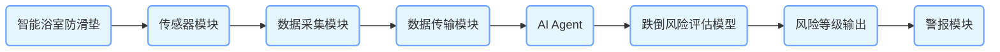

# 智能浴室防滑垫：AI Agent的跌倒风险评估

> 关键词：智能浴室防滑垫、AI Agent、跌倒风险评估、传感器技术、机器学习

> 摘要：本文聚焦于智能浴室防滑垫结合AI Agent进行跌倒风险评估这一前沿技术。首先介绍了该研究的背景，包括目的、预期读者、文档结构和相关术语。接着阐述了核心概念，通过示意图和流程图展示了其原理和架构。详细讲解了核心算法原理，并给出Python代码示例。分析了数学模型和公式，结合实际例子说明。通过项目实战，介绍开发环境搭建、源代码实现与解读。探讨了实际应用场景，推荐了学习资源、开发工具框架和相关论文著作。最后总结了未来发展趋势与挑战，并提供常见问题解答和扩展阅读参考资料，旨在为该领域的研究和应用提供全面而深入的指导。

## 1. 背景介绍 
### 1.1 目的和范围
在日常生活中，浴室是一个容易发生意外跌倒的场所。老年人、儿童以及行动不便者在浴室滑倒的风险尤其高，而滑倒可能导致严重的身体伤害，如骨折、脑震荡等。智能浴室防滑垫结合AI Agent进行跌倒风险评估的目的在于实时监测使用者在浴室防滑垫上的状态，通过先进的传感器技术和智能算法，准确评估跌倒风险，并在必要时发出警报，以预防跌倒事故的发生。

本研究的范围涵盖了智能浴室防滑垫的硬件设计、传感器数据采集、AI Agent的算法实现、跌倒风险评估模型的建立以及系统的实际应用和性能评估等方面。

### 1.2 预期读者
本文的预期读者包括从事智能家居、医疗健康监测、人工智能等领域的科研人员、工程师和开发者，以及对智能浴室产品感兴趣的行业从业者和消费者。对于科研人员和工程师，本文可以提供技术思路和研究方向；对于开发者，本文的代码示例和实现步骤可以作为项目开发的参考；对于行业从业者和消费者，本文可以帮助他们了解智能浴室防滑垫的工作原理和优势。

### 1.3 文档结构概述
本文将按照以下结构进行组织：首先介绍核心概念与联系，包括智能浴室防滑垫和AI Agent的原理和架构；接着详细讲解核心算法原理和具体操作步骤，并给出Python代码示例；然后分析数学模型和公式，并通过实际例子进行说明；之后进行项目实战，包括开发环境搭建、源代码实现和代码解读；再探讨实际应用场景；推荐相关的学习资源、开发工具框架和论文著作；最后总结未来发展趋势与挑战，提供常见问题解答和扩展阅读参考资料。

### 1.4 术语表
#### 1.4.1 核心术语定义
- **智能浴室防滑垫**：一种集成了多种传感器（如压力传感器、加速度传感器等），能够实时采集使用者在防滑垫上的相关数据，并通过内置的智能算法进行处理和分析的防滑垫。
- **AI Agent**：人工智能代理，是一种能够感知环境、根据环境信息做出决策并采取行动的智能实体。在本文中，AI Agent用于对智能浴室防滑垫采集的数据进行分析，评估跌倒风险。
- **跌倒风险评估**：通过对智能浴室防滑垫采集的多种数据进行综合分析，判断使用者在浴室滑倒的可能性，并给出相应的风险等级。

#### 1.4.2 相关概念解释
- **传感器技术**：传感器是智能浴室防滑垫的核心组成部分，用于采集各种物理量，如压力、加速度、倾斜角度等。常见的传感器包括压力传感器、加速度计、陀螺仪等。这些传感器将物理量转换为电信号，然后通过数据采集模块传输到智能处理单元。
- **机器学习**：机器学习是AI Agent实现跌倒风险评估的关键技术。通过对大量历史数据的学习和训练，机器学习算法可以建立跌倒风险评估模型，对新的传感器数据进行预测和分析。常见的机器学习算法包括决策树、支持向量机、神经网络等。

#### 1.4.3 缩略词列表
- **MEMS**：Micro-Electro-Mechanical Systems，微机电系统，常用于制造加速度计、陀螺仪等传感器。
- **ANN**：Artificial Neural Network，人工神经网络，一种模仿人类神经系统的机器学习算法。
- **SVM**：Support Vector Machine，支持向量机，一种常用的分类和回归算法。

## 2. 核心概念与联系 
### 核心概念原理
智能浴室防滑垫的核心原理是通过集成在防滑垫内部的传感器实时采集使用者在防滑垫上的各种数据，如压力分布、身体重心移动、运动加速度等。这些数据被传输到AI Agent进行处理和分析。AI Agent利用机器学习算法对采集的数据进行特征提取和模式识别，将当前的状态与预先训练好的跌倒风险模型进行比对，从而评估使用者的跌倒风险。

### 架构示意图


### 架构解释
- **智能浴室防滑垫**：作为整个系统的基础载体，集成了各种传感器，直接与使用者接触，负责采集数据。
- **传感器模块**：包含压力传感器、加速度传感器等多种传感器，用于感知使用者的各种状态信息。
- **数据采集模块**：将传感器采集到的模拟信号转换为数字信号，并进行初步的处理和存储。
- **数据传输模块**：将采集到的数据传输到AI Agent，可以通过有线或无线方式进行传输。
- **AI Agent**：作为系统的核心智能处理单元，利用机器学习算法对数据进行分析和处理。
- **跌倒风险评估模型**：通过对大量历史数据的学习和训练得到的模型，用于判断当前状态下的跌倒风险等级。
- **风险等级输出**：将评估得到的跌倒风险等级以直观的方式呈现给使用者或相关人员。
- **警报模块**：当跌倒风险等级超过设定的阈值时，发出警报信号，提醒使用者或相关人员采取措施。

## 3. 核心算法原理 & 具体操作步骤 
### 核心算法原理
本文采用人工神经网络（ANN）作为核心算法进行跌倒风险评估。人工神经网络是一种模仿人类神经系统的机器学习算法，由多个神经元组成的层次结构。在跌倒风险评估中，输入层接收智能浴室防滑垫采集的各种传感器数据，隐藏层对输入数据进行非线性变换和特征提取，输出层输出跌倒风险等级。

### 具体操作步骤
1. **数据采集**：智能浴室防滑垫通过传感器模块实时采集使用者的压力分布、加速度等数据。
2. **数据预处理**：对采集到的数据进行清洗、归一化等预处理操作，去除噪声和异常值，将数据转换为适合神经网络输入的格式。
3. **特征提取**：从预处理后的数据中提取有用的特征，如压力变化率、加速度峰值等。
4. **模型训练**：使用历史数据对人工神经网络进行训练，调整网络的权重和偏置，使网络能够准确地预测跌倒风险等级。
5. **实时评估**：将实时采集的数据输入到训练好的神经网络中，得到当前的跌倒风险等级。

### Python代码示例
```python
import numpy as np
import tensorflow as tf
from tensorflow.keras.models import Sequential
from tensorflow.keras.layers import Dense

# 生成示例数据
np.random.seed(42)
X_train = np.random.rand(100, 10)  # 100个样本，每个样本有10个特征
y_train = np.random.randint(0, 2, 100)  # 二分类问题，跌倒风险等级为0或1

# 构建人工神经网络模型
model = Sequential([
    Dense(64, activation='relu', input_shape=(10,)),
    Dense(32, activation='relu'),
    Dense(1, activation='sigmoid')
])

# 编译模型
model.compile(optimizer='adam', loss='binary_crossentropy', metrics=['accuracy'])

# 训练模型
model.fit(X_train, y_train, epochs=10, batch_size=32)

# 生成测试数据
X_test = np.random.rand(10, 10)

# 进行预测
predictions = model.predict(X_test)
print("预测结果:", predictions)
```

### 代码解释
- 首先，使用`numpy`生成示例训练数据`X_train`和标签`y_train`。
- 然后，使用`tensorflow.keras`构建一个简单的人工神经网络模型，包含输入层、两个隐藏层和输出层。
- 接着，使用`compile`方法编译模型，指定优化器、损失函数和评估指标。
- 再使用`fit`方法对模型进行训练。
- 最后，生成测试数据`X_test`，并使用训练好的模型进行预测。

## 4. 数学模型和公式 & 详细讲解 & 举例说明 
### 人工神经网络的数学模型
人工神经网络的基本单元是神经元，神经元的输出可以用以下公式表示：

$$
z = \sum_{i=1}^{n} w_i x_i + b
$$

其中，$x_i$ 是输入信号，$w_i$ 是对应的权重，$b$ 是偏置，$n$ 是输入信号的数量。

神经元的输出经过激活函数进行非线性变换，常用的激活函数有Sigmoid函数、ReLU函数等。以Sigmoid函数为例，其公式为：

$$
\sigma(z) = \frac{1}{1 + e^{-z}}
$$

整个神经网络的输出可以通过逐层计算得到。假设一个神经网络有 $L$ 层，第 $l$ 层的输出为 $a^{(l)}$，则第 $l+1$ 层的输入 $z^{(l+1)}$ 和输出 $a^{(l+1)}$ 可以表示为：

$$
z^{(l+1)} = W^{(l+1)} a^{(l)} + b^{(l+1)}
$$

$$
a^{(l+1)} = \sigma(z^{(l+1)})
$$

其中，$W^{(l+1)}$ 是第 $l+1$ 层的权重矩阵，$b^{(l+1)}$ 是第 $l+1$ 层的偏置向量。

### 损失函数和优化算法
在训练神经网络时，需要定义一个损失函数来衡量模型的预测结果与真实标签之间的差异。对于二分类问题，常用的损失函数是二元交叉熵损失函数，其公式为：

$$
L(y, \hat{y}) = -[y \log(\hat{y}) + (1 - y) \log(1 - \hat{y})]
$$

其中，$y$ 是真实标签，$\hat{y}$ 是模型的预测结果。

为了最小化损失函数，需要使用优化算法来更新神经网络的权重和偏置。常用的优化算法有随机梯度下降（SGD）、Adam等。以Adam算法为例，其更新公式为：

$$
m_{t+1} = \beta_1 m_t + (1 - \beta_1) g_t
$$

$$
v_{t+1} = \beta_2 v_t + (1 - \beta_2) g_t^2
$$

$$
\hat{m}_{t+1} = \frac{m_{t+1}}{1 - \beta_1^{t+1}}
$$

$$
\hat{v}_{t+1} = \frac{v_{t+1}}{1 - \beta_2^{t+1}}
$$

$$
\theta_{t+1} = \theta_t - \frac{\alpha}{\sqrt{\hat{v}_{t+1}} + \epsilon} \hat{m}_{t+1}
$$

其中，$m_t$ 和 $v_t$ 分别是一阶矩估计和二阶矩估计，$g_t$ 是损失函数关于参数 $\theta_t$ 的梯度，$\beta_1$ 和 $\beta_2$ 是衰减率，$\alpha$ 是学习率，$\epsilon$ 是一个很小的常数，用于避免分母为零。

### 举例说明
假设我们有一个简单的二分类问题，输入特征有两个，神经网络有一个隐藏层，包含两个神经元，输出层有一个神经元。输入数据 $x = [x_1, x_2]$，隐藏层的权重矩阵 $W^{(1)}$ 和偏置向量 $b^{(1)}$ 分别为：

$$
W^{(1)} = \begin{bmatrix}
w_{11}^{(1)} & w_{12}^{(1)} \\
w_{21}^{(1)} & w_{22}^{(1)}
\end{bmatrix}
$$

$$
b^{(1)} = \begin{bmatrix}
b_1^{(1)} \\
b_2^{(1)}
\end{bmatrix}
$$

输出层的权重向量 $W^{(2)}$ 和偏置 $b^{(2)}$ 分别为：

$$
W^{(2)} = \begin{bmatrix}
w_1^{(2)} & w_2^{(2)}
\end{bmatrix}
$$

$$
b^{(2)} = b
$$

首先，计算隐藏层的输入 $z^{(1)}$ 和输出 $a^{(1)}$：

$$
z^{(1)} = W^{(1)} x + b^{(1)} = \begin{bmatrix}
w_{11}^{(1)} x_1 + w_{12}^{(1)} x_2 + b_1^{(1)} \\
w_{21}^{(1)} x_1 + w_{22}^{(1)} x_2 + b_2^{(1)}
\end{bmatrix}
$$

$$
a^{(1)} = \sigma(z^{(1)}) = \begin{bmatrix}
\frac{1}{1 + e^{-(w_{11}^{(1)} x_1 + w_{12}^{(1)} x_2 + b_1^{(1)})}} \\
\frac{1}{1 + e^{-(w_{21}^{(1)} x_1 + w_{22}^{(1)} x_2 + b_2^{(1)})}}
\end{bmatrix}
$$

然后，计算输出层的输入 $z^{(2)}$ 和输出 $\hat{y}$：

$$
z^{(2)} = W^{(2)} a^{(1)} + b^{(2)} = w_1^{(2)} \frac{1}{1 + e^{-(w_{11}^{(1)} x_1 + w_{12}^{(1)} x_2 + b_1^{(1)})}} + w_2^{(2)} \frac{1}{1 + e^{-(w_{21}^{(1)} x_1 + w_{22}^{(1)} x_2 + b_2^{(1)})}} + b
$$

$$
\hat{y} = \sigma(z^{(2)}) = \frac{1}{1 + e^{-z^{(2)}}}
$$

最后，根据真实标签 $y$ 计算损失函数 $L(y, \hat{y})$，并使用优化算法更新权重和偏置。

## 5. 项目实战：代码实际案例和详细解释说明 
### 5.1  开发环境搭建
#### 硬件环境
- **智能浴室防滑垫**：选择集成了压力传感器和加速度传感器的防滑垫，确保传感器能够准确采集数据。
- **数据采集模块**：可以使用Arduino等开发板作为数据采集模块，将传感器采集到的数据进行处理和传输。
- **服务器**：选择一台性能稳定的服务器，用于运行AI Agent和存储数据。可以使用云服务器，如阿里云、腾讯云等。

#### 软件环境
- **操作系统**：服务器可以选择Linux操作系统，如Ubuntu、CentOS等。开发环境可以使用Windows、Mac OS等操作系统。
- **编程语言**：使用Python作为主要的编程语言，因为Python具有丰富的机器学习库和工具。
- **机器学习库**：安装TensorFlow、Keras等机器学习库，用于构建和训练人工神经网络模型。
- **数据处理库**：安装NumPy、Pandas等数据处理库，用于数据的预处理和分析。

### 5.2  源代码详细实现和代码解读
#### 数据采集代码
```python
import serial

# 打开串口
ser = serial.Serial('COM3', 9600)

try:
    while True:
        # 读取串口数据
        data = ser.readline().decode('utf-8').strip()
        print("采集到的数据:", data)
except KeyboardInterrupt:
    # 关闭串口
    ser.close()
```

#### 代码解读
这段代码使用`serial`库打开串口，从串口读取传感器采集到的数据，并将数据打印输出。在实际应用中，可以将采集到的数据保存到文件或数据库中。

#### 数据预处理代码
```python
import numpy as np
import pandas as pd
from sklearn.preprocessing import StandardScaler

# 读取数据
data = pd.read_csv('sensor_data.csv')

# 分离特征和标签
X = data.drop('label', axis=1)
y = data['label']

# 数据归一化
scaler = StandardScaler()
X_scaled = scaler.fit_transform(X)
```

#### 代码解读
这段代码使用`pandas`库读取传感器数据文件，使用`sklearn`库的`StandardScaler`类对数据进行归一化处理，将特征数据缩放到均值为0，标准差为1的范围。

#### 模型训练代码
```python
import tensorflow as tf
from tensorflow.keras.models import Sequential
from tensorflow.keras.layers import Dense
from sklearn.model_selection import train_test_split

# 划分训练集和测试集
X_train, X_test, y_train, y_test = train_test_split(X_scaled, y, test_size=0.2, random_state=42)

# 构建人工神经网络模型
model = Sequential([
    Dense(64, activation='relu', input_shape=(X_train.shape[1],)),
    Dense(32, activation='relu'),
    Dense(1, activation='sigmoid')
])

# 编译模型
model.compile(optimizer='adam', loss='binary_crossentropy', metrics=['accuracy'])

# 训练模型
model.fit(X_train, y_train, epochs=10, batch_size=32, validation_data=(X_test, y_test))
```

#### 代码解读
这段代码使用`sklearn`库的`train_test_split`函数将数据集划分为训练集和测试集，使用`tensorflow.keras`构建人工神经网络模型，编译模型并进行训练。

#### 实时评估代码
```python
# 加载训练好的模型
model = tf.keras.models.load_model('fall_risk_model.h5')

# 模拟实时数据
real_time_data = np.random.rand(1, X_train.shape[1])

# 数据预处理
real_time_data_scaled = scaler.transform(real_time_data)

# 进行预测
prediction = model.predict(real_time_data_scaled)
print("实时跌倒风险评估结果:", prediction)
```

#### 代码解读
这段代码加载训练好的模型，模拟实时数据，对数据进行预处理后使用模型进行预测，输出实时跌倒风险评估结果。

### 5.3  代码解读与分析
- **数据采集代码**：通过串口通信从传感器采集数据，确保数据的实时性和准确性。
- **数据预处理代码**：对采集到的数据进行归一化处理，消除不同特征之间的量纲差异，提高模型的训练效果。
- **模型训练代码**：使用人工神经网络模型对数据进行训练，通过多次迭代调整模型的权重和偏置，使模型能够准确地预测跌倒风险等级。
- **实时评估代码**：加载训练好的模型，对实时采集的数据进行预处理和预测，输出跌倒风险评估结果，实现实时监测的功能。

## 6. 实际应用场景 
### 家庭应用
在家庭浴室中，智能浴室防滑垫可以为老年人、儿童和行动不便者提供跌倒风险评估服务。当使用者在浴室滑倒的风险较高时，防滑垫会发出警报，提醒家人及时采取措施，避免跌倒事故的发生。同时，防滑垫还可以记录使用者的使用数据，为家人提供健康监测和预防建议。

### 医疗机构应用
在医院、养老院等医疗机构中，智能浴室防滑垫可以作为一种辅助护理设备，帮助医护人员实时监测患者的跌倒风险。当患者的跌倒风险超过设定的阈值时，系统会自动通知医护人员，及时对患者进行护理和干预，减少跌倒事故的发生，提高护理质量和效率。

### 公共场所应用
在酒店、游泳馆等公共场所的浴室中，智能浴室防滑垫可以提高顾客的安全性。当顾客在浴室滑倒的风险较高时，防滑垫会发出警报，提醒工作人员及时处理，避免发生意外事故，提升公共场所的服务质量和形象。

## 7. 工具和资源推荐
### 7.1 学习资源推荐
#### 7.1.1 书籍推荐
- 《深度学习》（Deep Learning）：由Ian Goodfellow、Yoshua Bengio和Aaron Courville合著，是深度学习领域的经典教材，全面介绍了深度学习的理论和实践。
- 《Python机器学习》（Python Machine Learning）：由Sebastian Raschka和Vahid Mirjalili合著，详细介绍了使用Python进行机器学习的方法和技巧。
- 《传感器技术基础》：介绍了各种传感器的原理、结构和应用，对于理解智能浴室防滑垫的传感器技术有很大帮助。

#### 7.1.2 在线课程
- Coursera上的“深度学习专项课程”（Deep Learning Specialization）：由Andrew Ng教授授课，涵盖了深度学习的各个方面，包括神经网络、卷积神经网络、循环神经网络等。
- edX上的“人工智能基础”（Introduction to Artificial Intelligence）：介绍了人工智能的基本概念、算法和应用，为学习AI Agent提供了基础知识。
- 中国大学MOOC上的“传感器原理与应用”：详细讲解了传感器的原理、设计和应用，适合对传感器技术感兴趣的学习者。

#### 7.1.3 技术博客和网站
- Medium：一个技术博客平台，上面有很多关于人工智能、机器学习和智能家居的文章，可以了解到最新的技术动态和研究成果。
- arXiv：一个预印本服务器，提供了大量的学术论文，包括人工智能、传感器技术等领域的最新研究成果。
- 开源中国：国内的技术社区，上面有很多关于开源项目和技术实践的文章，对于开发者有很大的参考价值。

### 7.2 开发工具框架推荐
#### 7.2.1 IDE和编辑器
- PyCharm：一款专门为Python开发设计的集成开发环境，具有代码编辑、调试、版本控制等功能，提高开发效率。
- Jupyter Notebook：一个交互式的开发环境，适合进行数据探索、模型训练和可视化，方便快速验证想法和进行实验。
- Visual Studio Code：一款轻量级的代码编辑器，支持多种编程语言和插件扩展，具有丰富的功能和良好的用户体验。

#### 7.2.2 调试和性能分析工具
- TensorBoard：TensorFlow的可视化工具，可以实时监控模型的训练过程，查看损失函数、准确率等指标的变化情况，帮助调试和优化模型。
- cProfile：Python的性能分析工具，可以分析代码的运行时间和内存使用情况，找出性能瓶颈。
- Py-Spy：一个轻量级的Python性能分析工具，可以实时查看Python程序的CPU使用情况和函数调用栈，方便进行性能优化。

#### 7.2.3 相关框架和库
- TensorFlow：一个开源的机器学习框架，提供了丰富的工具和库，用于构建和训练各种深度学习模型。
- Keras：一个高级神经网络API，基于TensorFlow、Theano等后端，简化了深度学习模型的构建和训练过程。
- Scikit-learn：一个常用的机器学习库，提供了各种机器学习算法和工具，如分类、回归、聚类等，方便进行数据处理和模型训练。

### 7.3 相关论文著作推荐
#### 7.3.1 经典论文
- “Gradient-based learning applied to document recognition”：由Yann LeCun等人发表，介绍了卷积神经网络（CNN）在手写字符识别中的应用，开创了深度学习在计算机视觉领域的先河。
- “Long Short-Term Memory”：由Sepp Hochreiter和Jürgen Schmidhuber发表，提出了长短期记忆网络（LSTM），解决了循环神经网络（RNN）中的梯度消失和梯度爆炸问题。
- “Support-Vector Networks”：由Corinna Cortes和Vladimir Vapnik发表，介绍了支持向量机（SVM）的原理和应用，是机器学习领域的经典论文之一。

#### 7.3.2 最新研究成果
- 在IEEE Transactions on Biomedical Engineering、ACM Transactions on Sensor Networks等学术期刊上发表的关于智能健康监测和传感器技术的最新研究成果。
- 在NeurIPS、ICML等机器学习顶级会议上发表的关于人工智能和机器学习算法的最新研究成果。

#### 7.3.3 应用案例分析
- 一些关于智能家居、医疗健康监测等领域的应用案例分析报告，可以了解智能浴室防滑垫在实际应用中的效果和挑战。
- 相关企业的技术白皮书和产品介绍，如小米、华为等公司在智能家居领域的技术和产品应用案例。

## 8. 总结：未来发展趋势与挑战
### 未来发展趋势
- **多传感器融合**：未来的智能浴室防滑垫将集成更多类型的传感器，如温度传感器、湿度传感器等，实现多传感器融合，获取更全面的使用者状态信息，提高跌倒风险评估的准确性。
- **智能化程度提升**：AI Agent将不断进化，采用更先进的机器学习算法和深度学习模型，实现更智能的决策和分析。同时，防滑垫可以与其他智能家居设备进行联动，实现更智能化的服务。
- **个性化服务**：根据使用者的个体特征和健康状况，提供个性化的跌倒风险评估和预防建议，满足不同用户的需求。

### 挑战
- **数据隐私和安全**：智能浴室防滑垫采集的使用者数据包含大量的个人隐私信息，如何保证数据的安全和隐私是一个重要的挑战。需要采用先进的加密技术和安全机制，防止数据泄露和滥用。
- **算法准确性和可靠性**：跌倒风险评估的准确性和可靠性直接关系到使用者的安全。需要不断优化机器学习算法，提高模型的泛化能力和鲁棒性，减少误判和漏判的情况。
- **成本和市场推广**：智能浴室防滑垫的研发和生产成本较高，如何降低成本，提高产品的性价比，是推广该产品的关键。同时，需要加强市场宣传和推广，提高消费者对智能浴室防滑垫的认知度和接受度。

## 9. 附录：常见问题与解答
### 智能浴室防滑垫的传感器精度如何保证？
智能浴室防滑垫的传感器精度可以通过以下方法保证：选择高精度的传感器产品，对传感器进行定期校准和维护，采用多传感器融合技术，通过数据处理和算法优化来提高传感器数据的准确性。

### AI Agent的跌倒风险评估模型如何更新？
可以定期收集新的传感器数据，对跌倒风险评估模型进行重新训练和优化。同时，可以采用在线学习的方法，让模型在实时运行过程中不断学习和更新，以适应不同用户和环境的变化。

### 智能浴室防滑垫在潮湿环境下的稳定性如何？
智能浴室防滑垫在设计和制造过程中会考虑潮湿环境的影响，采用防水、防潮的材料和工艺。同时，对电子元件进行密封处理，确保在潮湿环境下能够稳定运行。

### 智能浴室防滑垫与其他智能家居设备如何联动？
可以通过蓝牙、Wi-Fi等无线通信协议，将智能浴室防滑垫与其他智能家居设备进行连接。例如，当防滑垫检测到跌倒风险较高时，可以向智能音箱发送警报信息，提醒使用者或家人；也可以与智能门锁联动，当发生紧急情况时自动解锁，方便救援人员进入。

## 10. 扩展阅读 & 参考资料
### 扩展阅读
- 《智能家居技术与应用》：全面介绍了智能家居的技术原理、系统架构和应用案例，对于了解智能浴室防滑垫在智能家居中的应用有很大帮助。
- 《人工智能简史》：回顾了人工智能的发展历程，介绍了人工智能的主要流派和算法，为理解AI Agent的技术背景提供了历史视角。
- 《传感器网络原理与应用》：深入探讨了传感器网络的原理、协议和应用，对于理解智能浴室防滑垫的数据采集和传输机制有很大帮助。

### 参考资料
- 相关学术论文和研究报告，如在IEEE、ACM等学术数据库中搜索到的关于智能健康监测、机器学习和传感器技术的论文。
- 智能浴室防滑垫产品的技术文档和用户手册，如小米、华为等公司的相关产品资料。
- 开源项目的代码和文档，如在GitHub上搜索到的与智能健康监测和机器学习相关的开源项目。

作者：AI天才研究院/AI Genius Institute & 禅与计算机程序设计艺术 /Zen And The Art of Computer Programming