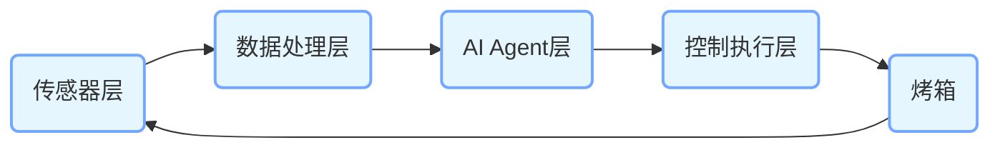

# 智能烤箱：AI Agent的烘焙参数自动调节

> 关键词：智能烤箱、AI Agent、烘焙参数、自动调节、机器学习

> 摘要：本文围绕智能烤箱中AI Agent对烘焙参数的自动调节展开深入探讨。详细介绍了相关的背景知识，包括目的、预期读者等内容。阐述了智能烤箱和AI Agent的核心概念及联系，分析了实现烘焙参数自动调节的核心算法原理，并给出具体操作步骤及Python代码示例。同时，探讨了相关的数学模型和公式，通过项目实战展示了代码的实际应用和详细解读。还介绍了智能烤箱在不同场景下的实际应用，推荐了学习资源、开发工具框架以及相关论文著作。最后总结了未来发展趋势与挑战，并对常见问题进行了解答，为智能烤箱领域的研究和开发提供了全面而深入的参考。

## 1. 背景介绍 
### 1.1 目的和范围
随着人们生活水平的提高，对烘焙食品的质量和便利性有了更高的要求。传统烤箱需要用户手动设置烘焙参数，这对于缺乏经验的用户来说，很难烤出理想的食品。智能烤箱结合AI Agent技术，旨在实现烘焙参数的自动调节，根据不同的食材、烘焙类型和用户偏好，精准地控制烤箱的温度、时间等参数，从而提高烘焙的成功率和食品的质量。

本文的范围涵盖了智能烤箱中AI Agent烘焙参数自动调节的各个方面，包括核心概念、算法原理、数学模型、项目实战、实际应用场景等内容，为相关领域的研究和开发提供全面的技术指导。

### 1.2 预期读者
本文的预期读者包括对智能家电、人工智能技术感兴趣的科研人员、工程师、学生，以及从事智能烤箱研发和生产的企业技术人员。同时，对于希望了解智能烤箱工作原理和技术细节的普通消费者也具有一定的参考价值。

### 1.3 文档结构概述
本文将按照以下结构进行阐述：首先介绍智能烤箱和AI Agent的核心概念及它们之间的联系；接着详细讲解实现烘焙参数自动调节的核心算法原理，并给出具体的操作步骤和Python代码示例；然后探讨相关的数学模型和公式，并通过实际例子进行说明；之后进行项目实战，展示代码的实际应用和详细解读；再介绍智能烤箱在不同场景下的实际应用；推荐学习资源、开发工具框架以及相关论文著作；最后总结未来发展趋势与挑战，解答常见问题，并提供扩展阅读和参考资料。

### 1.4 术语表
#### 1.4.1 核心术语定义
- **智能烤箱**：一种具备智能化功能的烤箱，能够通过传感器收集数据，并结合AI Agent技术实现烘焙参数的自动调节。
- **AI Agent**：人工智能代理，是一种能够感知环境、做出决策并采取行动的智能实体。在智能烤箱中，AI Agent根据收集到的食材信息、烘焙类型等数据，自动调节烤箱的烘焙参数。
- **烘焙参数**：指烤箱在烘焙过程中需要控制的参数，如温度、时间、风速等。
- **机器学习**：一门多领域交叉学科，涉及概率论、统计学、逼近论、凸分析、算法复杂度理论等多门学科。它专门研究计算机怎样模拟或实现人类的学习行为，以获取新的知识或技能，重新组织已有的知识结构使之不断改善自身的性能。

#### 1.4.2 相关概念解释
- **传感器**：用于收集烤箱内部和外部环境信息的设备，如温度传感器、湿度传感器、重量传感器等。这些传感器将收集到的数据传输给AI Agent，作为调节烘焙参数的依据。
- **数据预处理**：在将传感器收集到的数据输入到AI Agent之前，需要对数据进行清洗、转换、归一化等处理，以提高数据的质量和可用性。
- **模型训练**：使用机器学习算法对历史数据进行训练，得到一个能够准确预测烘焙参数的模型。训练过程中需要不断调整模型的参数，以提高模型的性能。

#### 1.4.3 缩略词列表
- **AI**：Artificial Intelligence，人工智能
- **ML**：Machine Learning，机器学习
- **ANN**：Artificial Neural Network，人工神经网络

## 2. 核心概念与联系 
### 核心概念原理
智能烤箱的核心在于通过各种传感器收集与烘焙相关的数据，如食材的重量、大小、初始温度，烤箱内部的温度、湿度等信息。AI Agent作为智能决策的核心，接收这些传感器数据，并结合预设的烘焙规则和机器学习模型，对烘焙参数进行自动调节。

AI Agent的工作原理基于感知 - 决策 - 行动的循环。首先，它通过传感器感知烤箱的环境状态和食材的特性；然后，根据这些信息，利用机器学习算法或预设的规则进行决策，确定最佳的烘焙参数；最后，将决策结果发送给烤箱的控制系统，实现对烤箱温度、时间等参数的调节。

### 架构的文本示意图
智能烤箱的架构主要由以下几个部分组成：
1. **传感器层**：负责收集烤箱内部和外部的环境信息，包括温度传感器、湿度传感器、重量传感器、图像传感器等。这些传感器将收集到的数据传输给数据处理层。
2. **数据处理层**：对传感器收集到的数据进行预处理，包括数据清洗、转换、归一化等操作，以提高数据的质量和可用性。处理后的数据将被发送给AI Agent层。
3. **AI Agent层**：AI Agent接收数据处理层传来的数据，并结合预设的烘焙规则和机器学习模型进行决策。决策结果将被发送给控制执行层。
4. **控制执行层**：根据AI Agent的决策结果，控制烤箱的各个部件，如加热元件、风扇等，实现对烘焙参数的调节。

### Mermaid流程图


## 3. 核心算法原理 & 具体操作步骤 
### 核心算法原理
在智能烤箱中，常用的核心算法是机器学习算法，如人工神经网络（ANN）。人工神经网络是一种模仿人类神经系统的计算模型，由大量的神经元组成。每个神经元接收输入信号，经过加权求和和激活函数处理后，输出一个结果。通过多层神经元的连接和计算，人工神经网络可以学习到输入数据和输出结果之间的复杂关系。

在烘焙参数自动调节的应用中，人工神经网络的输入可以是传感器收集到的食材信息（如重量、大小、初始温度等）和烤箱环境信息（如温度、湿度等），输出则是最佳的烘焙参数（如温度、时间等）。通过对大量的历史烘焙数据进行训练，人工神经网络可以学习到不同食材和环境条件下的最佳烘焙参数，从而实现对烘焙过程的精准控制。

### 具体操作步骤及Python代码示例
以下是使用Python和TensorFlow库实现一个简单的人工神经网络来预测烘焙参数的示例代码：

```python
import tensorflow as tf
import numpy as np

# 生成一些示例数据
# 假设输入数据是食材的重量、大小和初始温度
# 输出数据是烘焙温度和时间
# 这里只是示例数据，实际应用中需要使用真实的历史数据
X = np.array([[100, 5, 20], [200, 8, 22], [150, 6, 21]])
y = np.array([[180, 30], [200, 40], [190, 35]])

# 构建人工神经网络模型
model = tf.keras.Sequential([
    tf.keras.layers.Dense(10, activation='relu', input_shape=(3,)),
    tf.keras.layers.Dense(2)
])

# 编译模型
model.compile(optimizer='adam', loss='mse')

# 训练模型
model.fit(X, y, epochs=100, batch_size=1)

# 预测新的烘焙参数
new_input = np.array([[120, 7, 23]])
predicted_params = model.predict(new_input)
print("预测的烘焙参数：", predicted_params)
```

### 代码解释
1. **数据生成**：使用`numpy`库生成一些示例输入数据`X`和输出数据`y`。实际应用中，需要使用真实的历史烘焙数据。
2. **模型构建**：使用`tf.keras.Sequential`构建一个简单的人工神经网络模型。模型包含一个输入层、一个隐藏层和一个输出层。隐藏层使用`ReLU`激活函数，输出层不使用激活函数。
3. **模型编译**：使用`adam`优化器和均方误差（MSE）损失函数编译模型。
4. **模型训练**：使用`fit`方法对模型进行训练，训练100个epoch，每个batch包含1个样本。
5. **预测**：使用训练好的模型对新的输入数据进行预测，并输出预测结果。

## 4. 数学模型和公式 & 详细讲解 & 举例说明 
### 人工神经网络的数学模型
人工神经网络的基本单元是神经元，其数学模型可以表示为：

$$
z = \sum_{i=1}^{n} w_i x_i + b
$$

其中，$x_i$ 是输入信号，$w_i$ 是对应的权重，$b$ 是偏置，$z$ 是加权求和的结果。

神经元的输出可以通过激活函数进行处理，常用的激活函数有`ReLU`函数：

$$
y = \max(0, z)
$$

在多层人工神经网络中，前一层神经元的输出作为后一层神经元的输入，通过不断的加权求和和激活函数处理，最终得到网络的输出。

### 损失函数和优化算法
在训练人工神经网络时，需要定义一个损失函数来衡量模型的预测结果与真实值之间的差异。常用的损失函数是均方误差（MSE）：

$$
MSE = \frac{1}{m} \sum_{i=1}^{m} (y_i - \hat{y}_i)^2
$$

其中，$m$ 是样本数量，$y_i$ 是真实值，$\hat{y}_i$ 是模型的预测值。

为了最小化损失函数，需要使用优化算法来更新模型的参数。常用的优化算法是随机梯度下降（SGD）及其变种，如`Adam`优化器。`Adam`优化器结合了动量和自适应学习率的思想，能够更快地收敛到最优解。

### 举例说明
假设我们有一个简单的人工神经网络，包含一个输入层（2个神经元）、一个隐藏层（3个神经元）和一个输出层（1个神经元）。输入数据为 $x = [x_1, x_2]$，隐藏层的权重矩阵为 $W_1$，偏置向量为 $b_1$，输出层的权重矩阵为 $W_2$，偏置向量为 $b_2$。

首先，计算隐藏层的输入：

$$
z_1 = W_1 x + b_1
$$

然后，使用`ReLU`激活函数计算隐藏层的输出：

$$
a_1 = \max(0, z_1)
$$

接着，计算输出层的输入：

$$
z_2 = W_2 a_1 + b_2
$$

最后，得到网络的输出：

$$
\hat{y} = z_2
$$

假设真实值为 $y$，则可以计算均方误差损失：

$$
MSE = (y - \hat{y})^2
$$

使用`Adam`优化器更新模型的参数 $W_1$、$b_1$、$W_2$ 和 $b_2$，不断迭代，直到损失函数收敛到一个较小的值。

## 5. 项目实战：代码实际案例和详细解释说明 
### 5.1  开发环境搭建
#### 硬件环境
- 智能烤箱：支持数据采集和参数调节功能。
- 传感器：温度传感器、湿度传感器、重量传感器等，用于收集烤箱内部和食材的信息。
- 开发板：如树莓派，用于运行AI Agent程序和控制烤箱。

#### 软件环境
- 操作系统：Raspbian（树莓派操作系统）
- 编程语言：Python 3.x
- 深度学习框架：TensorFlow、Keras
- 其他库：NumPy、Pandas、Scikit-learn等

### 5.2  源代码详细实现和代码解读
以下是一个完整的智能烤箱烘焙参数自动调节项目的代码示例：

```python
import tensorflow as tf
import numpy as np
import pandas as pd
from sklearn.preprocessing import StandardScaler
from sklearn.model_selection import train_test_split

# 加载数据集
data = pd.read_csv('baking_data.csv')
X = data.drop(['temperature', 'time'], axis=1).values
y = data[['temperature', 'time']].values

# 数据预处理
scaler_X = StandardScaler()
scaler_y = StandardScaler()
X = scaler_X.fit_transform(X)
y = scaler_y.fit_transform(y)

# 划分训练集和测试集
X_train, X_test, y_train, y_test = train_test_split(X, y, test_size=0.2, random_state=42)

# 构建人工神经网络模型
model = tf.keras.Sequential([
    tf.keras.layers.Dense(64, activation='relu', input_shape=(X_train.shape[1],)),
    tf.keras.layers.Dense(32, activation='relu'),
    tf.keras.layers.Dense(2)
])

# 编译模型
model.compile(optimizer='adam', loss='mse')

# 训练模型
history = model.fit(X_train, y_train, epochs=100, batch_size=32, validation_data=(X_test, y_test))

# 评估模型
test_loss = model.evaluate(X_test, y_test)
print("测试集损失：", test_loss)

# 预测新的烘焙参数
new_input = np.array([[130, 6, 22]])  # 示例输入
new_input = scaler_X.transform(new_input)
predicted_params = model.predict(new_input)
predicted_params = scaler_y.inverse_transform(predicted_params)
print("预测的烘焙参数：", predicted_params)
```

### 代码解读与分析
1. **数据加载**：使用`pandas`库加载包含历史烘焙数据的CSV文件，并将输入特征和目标变量分别存储在`X`和`y`中。
2. **数据预处理**：使用`StandardScaler`对输入特征和目标变量进行标准化处理，以提高模型的训练效果。
3. **数据集划分**：使用`train_test_split`函数将数据集划分为训练集和测试集，测试集占比为20%。
4. **模型构建**：使用`tf.keras.Sequential`构建一个包含两个隐藏层的人工神经网络模型。隐藏层使用`ReLU`激活函数，输出层不使用激活函数。
5. **模型编译**：使用`adam`优化器和均方误差（MSE）损失函数编译模型。
6. **模型训练**：使用`fit`方法对模型进行训练，训练100个epoch，每个batch包含32个样本。同时，使用测试集进行验证。
7. **模型评估**：使用`evaluate`方法评估模型在测试集上的损失。
8. **预测**：对新的输入数据进行预处理，使用训练好的模型进行预测，并将预测结果进行反标准化处理，得到实际的烘焙参数。

## 6. 实际应用场景 
### 家庭烘焙
在家庭烘焙场景中，智能烤箱的AI Agent可以根据用户选择的烘焙食谱和放入烤箱的食材信息，自动调节烘焙参数。例如，当用户选择制作蛋糕时，AI Agent会根据蛋糕的种类、大小和重量，自动设置合适的温度和时间，确保蛋糕烤得均匀、美味。

### 商业烘焙
在商业烘焙店中，智能烤箱可以提高烘焙效率和产品质量的稳定性。AI Agent可以根据不同的订单需求，快速调整烘焙参数，同时可以实时监测烤箱的运行状态和烘焙过程，及时发现并解决问题，减少废品率。

### 餐饮行业
在餐厅、酒店等餐饮场所，智能烤箱可以为厨师提供更精准的烘焙支持。厨师可以根据菜品的要求，让AI Agent自动调节烘焙参数，确保菜品的口感和质量。

## 7. 工具和资源推荐
### 7.1 学习资源推荐
#### 7.1.1 书籍推荐
- 《深度学习》（Deep Learning）：由Ian Goodfellow、Yoshua Bengio和Aaron Courville合著，是深度学习领域的经典教材，涵盖了深度学习的基本概念、算法和应用。
- 《Python机器学习》（Python Machine Learning）：由Sebastian Raschka和Vahid Mirjalili合著，介绍了使用Python进行机器学习的方法和技术，包括数据预处理、模型训练和评估等内容。
- 《智能时代》：由吴军博士所著，探讨了人工智能在各个领域的应用和发展趋势，对理解智能烤箱等智能设备的发展背景有很大帮助。

#### 7.1.2 在线课程
- Coursera上的“深度学习专项课程”（Deep Learning Specialization）：由Andrew Ng教授授课，包括深度学习的基础知识、卷积神经网络、循环神经网络等内容，是学习深度学习的优质课程。
- edX上的“人工智能基础”（Introduction to Artificial Intelligence）：介绍了人工智能的基本概念、算法和应用，适合初学者入门。
- 中国大学MOOC上的“机器学习”课程：由国内知名高校的教授授课，内容丰富，讲解详细。

#### 7.1.3 技术博客和网站
- Medium：上面有很多关于人工智能、机器学习的技术博客文章，涵盖了最新的研究成果和应用案例。
- Towards Data Science：专注于数据科学和机器学习领域的技术博客，提供了很多实用的教程和案例。
- 机器之心：国内知名的人工智能媒体，报道了人工智能领域的最新动态和技术进展。

### 7.2 开发工具框架推荐
#### 7.2.1 IDE和编辑器
- PyCharm：是一款专门为Python开发设计的集成开发环境，具有代码编辑、调试、自动完成等功能，非常适合Python项目的开发。
- Jupyter Notebook：是一个交互式的开发环境，支持多种编程语言，适合进行数据探索、模型训练和可视化等工作。
- Visual Studio Code：是一款轻量级的代码编辑器，支持多种编程语言和插件，具有丰富的扩展功能。

#### 7.2.2 调试和性能分析工具
- TensorBoard：是TensorFlow提供的可视化工具，可以用于可视化模型的训练过程、损失函数曲线、网络结构等信息，帮助开发者进行调试和性能分析。
- Py-Spy：是一个Python性能分析工具，可以实时监测Python程序的CPU使用情况和函数调用时间，帮助开发者找出性能瓶颈。
- cProfile：是Python标准库中的性能分析模块，可以用于分析Python程序的执行时间和函数调用次数。

#### 7.2.3 相关框架和库
- TensorFlow：是一个开源的深度学习框架，由Google开发，支持多种深度学习模型的构建和训练，具有高效、灵活的特点。
- Keras：是一个高级神经网络API，基于TensorFlow、Theano等后端，提供了简单易用的接口，适合快速搭建和训练深度学习模型。
- Scikit-learn：是一个开源的机器学习库，提供了丰富的机器学习算法和工具，包括数据预处理、模型选择、评估等功能。

### 7.3 相关论文著作推荐
#### 7.3.1 经典论文
- “Gradient-based learning applied to document recognition”：由Yann LeCun等人发表，介绍了卷积神经网络（CNN）在手写数字识别中的应用，是CNN领域的经典论文。
- “Long Short-Term Memory”：由Sepp Hochreiter和Jürgen Schmidhuber发表，提出了长短期记忆网络（LSTM），解决了循环神经网络（RNN）中的梯度消失问题。
- “Attention Is All You Need”：由Ashish Vaswani等人发表，提出了Transformer模型，在自然语言处理领域取得了巨大的成功。

#### 7.3.2 最新研究成果
- 在IEEE Transactions on Industrial Electronics、ACM Transactions on Intelligent Systems and Technology等学术期刊上，经常发表关于智能家电、人工智能应用的最新研究成果。
- 每年的NeurIPS（神经信息处理系统大会）、ICML（国际机器学习会议）等学术会议上，也会有很多关于深度学习和人工智能的最新研究报告。

#### 7.3.3 应用案例分析
- 可以参考一些智能家电企业的官方网站和技术博客，了解他们在智能烤箱等产品中应用AI Agent技术的案例和经验。
- 一些行业报告和市场研究机构的分析报告，也会提供智能烤箱等智能家电的应用案例和市场趋势分析。

## 8. 总结：未来发展趋势与挑战
### 未来发展趋势
- **智能化程度不断提高**：随着人工智能技术的不断发展，智能烤箱的AI Agent将具备更强的学习和决策能力，能够更好地适应不同的食材、烘焙类型和用户偏好，实现更加精准的烘焙参数调节。
- **与其他智能设备的互联互通**：智能烤箱将与智能家居系统中的其他设备实现互联互通，如智能冰箱、智能炉灶等。用户可以通过手机APP或语音助手，远程控制烤箱的烘焙过程，同时可以获取其他设备提供的食材信息，实现更加智能化的烹饪体验。
- **个性化定制服务**：根据用户的健康数据、口味偏好等信息，智能烤箱可以为用户提供个性化的烘焙食谱和参数建议，满足不同用户的需求。

### 挑战
- **数据安全和隐私问题**：智能烤箱在运行过程中会收集大量的用户数据，如食材信息、烘焙习惯等。如何保障这些数据的安全和隐私，防止数据泄露和滥用，是一个亟待解决的问题。
- **模型的可解释性**：目前的机器学习模型，如人工神经网络，往往是一个“黑匣子”，难以解释其决策过程和结果。在智能烤箱中，用户希望了解AI Agent是如何调节烘焙参数的，因此需要提高模型的可解释性。
- **成本和可靠性**：智能烤箱的研发和生产成本相对较高，同时需要保证设备的可靠性和稳定性。如何在降低成本的同时，提高设备的性能和质量，是智能烤箱制造商面临的挑战。

## 9. 附录：常见问题与解答
### 问题1：智能烤箱的AI Agent是如何学习烘焙参数的？
解答：AI Agent通过对大量的历史烘焙数据进行学习和训练，使用机器学习算法（如人工神经网络）来建立输入数据（如食材信息、烤箱环境信息）和输出数据（如烘焙参数）之间的映射关系。在实际应用中，AI Agent根据传感器收集到的实时数据，结合训练好的模型，预测出最佳的烘焙参数。

### 问题2：智能烤箱的烘焙效果是否比传统烤箱好？
解答：一般来说，智能烤箱的烘焙效果会更好。因为智能烤箱的AI Agent可以根据不同的食材和烘焙类型，自动调节烘焙参数，避免了因人为设置不当而导致的烘焙失败。同时，智能烤箱还可以实时监测烤箱的运行状态和烘焙过程，及时调整参数，确保烘焙效果的稳定性和一致性。

### 问题3：智能烤箱的价格是否比传统烤箱贵？
解答：智能烤箱的价格通常会比传统烤箱贵一些。这是因为智能烤箱需要配备更多的传感器和智能控制系统，同时研发和生产成本也相对较高。但是，随着技术的不断发展和市场的竞争，智能烤箱的价格也在逐渐下降，越来越多的消费者可以接受。

### 问题4：智能烤箱的AI Agent是否会受到环境因素的影响？
解答：智能烤箱的AI Agent会受到环境因素的影响。例如，烤箱周围的温度、湿度等环境因素可能会影响传感器的测量精度，从而影响AI Agent对烘焙参数的调节。为了减少环境因素的影响，智能烤箱通常会采用一些补偿算法和校准技术，提高传感器的测量精度和可靠性。

## 10. 扩展阅读 & 参考资料
### 扩展阅读
- 《智能家居技术与应用》：介绍了智能家居的各种技术和应用场景，包括智能家电的控制和管理。
- 《人工智能：现代方法》：是人工智能领域的经典教材，涵盖了人工智能的各个方面，包括知识表示、推理、机器学习、自然语言处理等内容。

### 参考资料
- [TensorFlow官方文档](https://www.tensorflow.org/api_docs)
- [Keras官方文档](https://keras.io/api/)
- [Scikit-learn官方文档](https://scikit-learn.org/stable/documentation.html)

作者：AI天才研究院/AI Genius Institute & 禅与计算机程序设计艺术 /Zen And The Art of Computer Programming