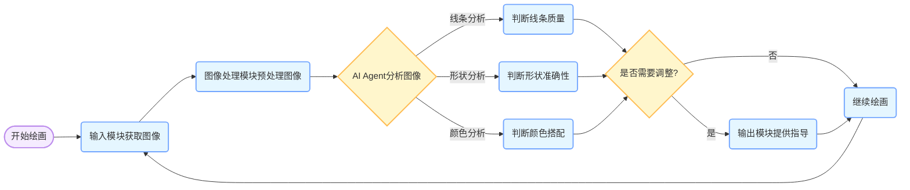

# 智能画架：AI Agent的绘画技巧指导

> 关键词：智能画架、AI Agent、绘画技巧指导、计算机视觉、机器学习

> 摘要：本文围绕智能画架这一创新概念，深入探讨了AI Agent在绘画技巧指导方面的应用。详细介绍了相关核心概念、算法原理、数学模型，通过项目实战展示了具体的实现过程和代码解读。分析了智能画架在实际场景中的应用，推荐了学习、开发所需的工具和资源，最后对未来发展趋势与挑战进行了总结，并提供了常见问题解答和参考资料。旨在为读者全面呈现智能画架结合AI Agent进行绘画技巧指导的技术全貌和应用前景。

## 1. 背景介绍 
### 1.1 目的和范围
在当今数字化时代，艺术创作与科技的融合愈发紧密。智能画架结合AI Agent进行绘画技巧指导的目的在于为绘画爱好者和专业艺术家提供一种全新的、高效的学习和创作辅助方式。它利用先进的人工智能技术，对绘画过程进行实时分析和反馈，帮助用户提升绘画技能。本文的范围涵盖了智能画架的核心概念、算法原理、数学模型、实际应用案例以及相关的工具和资源推荐等方面。

### 1.2 预期读者
本文预期读者包括对人工智能在艺术领域应用感兴趣的科技爱好者、希望借助技术提升绘画水平的绘画学习者、从事相关领域研究的科研人员以及有意开发智能绘画辅助工具的程序员和软件开发者。

### 1.3 文档结构概述
本文将按照以下结构进行阐述：首先介绍核心概念与联系，包括智能画架和AI Agent的定义以及它们之间的关系；接着详细讲解核心算法原理和具体操作步骤，通过Python代码进行说明；然后介绍相关的数学模型和公式，并举例说明；之后通过项目实战展示智能画架的具体实现过程和代码解读；再分析智能画架在实际场景中的应用；推荐学习和开发所需的工具和资源；最后总结未来发展趋势与挑战，提供常见问题解答和参考资料。

### 1.4 术语表
#### 1.4.1 核心术语定义
- **智能画架**：一种集成了人工智能技术的绘画工具，能够对绘画过程进行感知、分析和提供反馈，辅助用户进行绘画创作。
- **AI Agent**：人工智能代理，是一种能够感知环境、做出决策并采取行动的智能实体。在智能画架中，AI Agent负责分析绘画图像、提供技巧指导等任务。
- **计算机视觉**：让计算机从图像或视频中获取有意义信息的领域，在智能画架中用于识别绘画元素和分析绘画风格。
- **机器学习**：一门多领域交叉学科，涉及概率论、统计学、逼近论、凸分析、算法复杂度理论等多门学科。它专门研究计算机怎样模拟或实现人类的学习行为，以获取新的知识或技能，重新组织已有的知识结构使之不断改善自身的性能。在智能画架中用于训练模型以识别绘画特征和提供指导。

#### 1.4.2 相关概念解释
- **图像识别**：计算机视觉的一个重要分支，通过算法对图像中的物体、场景等进行识别和分类。在智能画架中，用于识别绘画中的元素，如线条、形状、颜色等。
- **风格迁移**：将一种艺术风格应用到另一种图像上的技术。智能画架可以利用风格迁移技术，让用户尝试不同的绘画风格。
- **实时反馈**：在绘画过程中，AI Agent实时分析绘画情况并提供相应的建议和指导，帮助用户及时调整绘画策略。

#### 1.4.3 缩略词列表
- **CNN**：Convolutional Neural Network，卷积神经网络，一种常用于图像识别和处理的深度学习模型。
- **GAN**：Generative Adversarial Network，生成对抗网络，用于生成新的图像或进行风格迁移。
- **API**：Application Programming Interface，应用程序编程接口，用于不同软件之间的交互和数据传输。

## 2. 核心概念与联系 
### 核心概念原理
智能画架结合了计算机视觉和机器学习技术，通过摄像头或其他输入设备获取绘画图像，然后利用AI Agent对图像进行分析。AI Agent可以识别绘画中的元素，如线条的质量、形状的准确性、颜色的搭配等，并根据预设的规则或训练好的模型提供相应的绘画技巧指导。

例如，当用户绘制一条线条时，AI Agent可以分析线条的流畅度、粗细变化等特征，如果线条不够流畅，它可以提示用户调整绘画的速度或力度。同时，AI Agent还可以根据绘画的主题和风格，提供一些创意和构图方面的建议。

### 架构的文本示意图
智能画架的架构主要包括以下几个部分：
1. **输入模块**：负责获取绘画图像，如摄像头、数位板等。
2. **图像处理模块**：对输入的图像进行预处理，如降噪、增强对比度等，以提高后续分析的准确性。
3. **AI Agent模块**：核心模块，利用计算机视觉和机器学习算法对处理后的图像进行分析，识别绘画元素和特征，并根据预设的规则或训练好的模型提供绘画技巧指导。
4. **输出模块**：将AI Agent的指导信息以可视化或语音的方式反馈给用户，如在屏幕上显示提示信息、通过扬声器播放语音指导等。

### Mermaid流程图


## 3. 核心算法原理 & 具体操作步骤 
### 核心算法原理
智能画架的核心算法主要包括图像识别和机器学习算法。其中，卷积神经网络（CNN）是一种常用的图像识别算法，它可以自动提取图像中的特征，用于识别绘画中的元素。

以下是一个简单的CNN模型的Python代码示例：
```python
import tensorflow as tf
from tensorflow.keras import layers, models

# 构建CNN模型
model = models.Sequential()
model.add(layers.Conv2D(32, (3, 3), activation='relu', input_shape=(150, 150, 3)))
model.add(layers.MaxPooling2D((2, 2)))
model.add(layers.Conv2D(64, (3, 3), activation='relu'))
model.add(layers.MaxPooling2D((2, 2)))
model.add(layers.Conv2D(128, (3, 3), activation='relu'))
model.add(layers.MaxPooling2D((2, 2)))
model.add(layers.Flatten())
model.add(layers.Dense(128, activation='relu'))
model.add(layers.Dense(1, activation='sigmoid'))

# 编译模型
model.compile(optimizer='adam',
              loss='binary_crossentropy',
              metrics=['accuracy'])
```
### 具体操作步骤
1. **数据收集**：收集大量的绘画图像数据，并进行标注，如标注线条的类型、形状的名称、颜色的类别等。
2. **模型训练**：使用收集到的数据对CNN模型进行训练，调整模型的参数，使其能够准确地识别绘画元素。
3. **图像输入**：通过输入模块获取用户的绘画图像，并进行预处理。
4. **特征提取**：将预处理后的图像输入到训练好的CNN模型中，提取图像的特征。
5. **分析和指导**：根据提取的特征，AI Agent进行分析，并根据预设的规则或训练好的模型提供绘画技巧指导。
6. **反馈输出**：将指导信息通过输出模块反馈给用户。

## 4. 数学模型和公式 & 详细讲解 & 举例说明 
### 卷积神经网络的数学模型
卷积神经网络（CNN）主要由卷积层、池化层和全连接层组成。

#### 卷积层
卷积层的核心操作是卷积运算，其数学公式为：
$$y_{i,j}^l = \sum_{m=0}^{M-1} \sum_{n=0}^{N-1} x_{i+m,j+n}^{l-1} \cdot w_{m,n}^l + b^l$$
其中，$y_{i,j}^l$ 是第 $l$ 层卷积层输出特征图中 $(i,j)$ 位置的值，$x_{i+m,j+n}^{l-1}$ 是第 $l-1$ 层输入特征图中 $(i+m,j+n)$ 位置的值，$w_{m,n}^l$ 是卷积核中 $(m,n)$ 位置的权重，$b^l$ 是偏置项，$M$ 和 $N$ 是卷积核的大小。

#### 池化层
池化层的作用是对特征图进行下采样，常用的池化操作有最大池化和平均池化。

最大池化的数学公式为：
$$y_{i,j}^l = \max_{m=0}^{M-1} \max_{n=0}^{N-1} x_{iM+m,jN+n}^{l-1}$$
其中，$y_{i,j}^l$ 是第 $l$ 层池化层输出特征图中 $(i,j)$ 位置的值，$x_{iM+m,jN+n}^{l-1}$ 是第 $l-1$ 层输入特征图中 $(iM+m,jN+n)$ 位置的值，$M$ 和 $N$ 是池化窗口的大小。

#### 全连接层
全连接层将卷积层和池化层提取的特征进行整合，其数学公式为：
$$y^l = f(\sum_{k=0}^{K-1} w_{k}^l \cdot x_{k}^{l-1} + b^l)$$
其中，$y^l$ 是第 $l$ 层全连接层的输出，$x_{k}^{l-1}$ 是第 $l-1$ 层的输入，$w_{k}^l$ 是权重，$b^l$ 是偏置项，$f$ 是激活函数。

### 举例说明
假设我们有一个输入图像的大小为 $10 \times 10$，卷积核的大小为 $3 \times 3$，步长为 1。在卷积层中，对于输出特征图的第一个位置 $(0,0)$，我们需要计算输入图像中 $3 \times 3$ 区域与卷积核的卷积结果：
$$y_{0,0}^l = x_{0,0}^{l-1} \cdot w_{0,0}^l + x_{0,1}^{l-1} \cdot w_{0,1}^l + x_{0,2}^{l-1} \cdot w_{0,2}^l + x_{1,0}^{l-1} \cdot w_{1,0}^l + x_{1,1}^{l-1} \cdot w_{1,1}^l + x_{1,2}^{l-1} \cdot w_{1,2}^l + x_{2,0}^{l-1} \cdot w_{2,0}^l + x_{2,1}^{l-1} \cdot w_{2,1}^l + x_{2,2}^{l-1} \cdot w_{2,2}^l + b^l$$

然后，我们可以通过滑动卷积核，计算输出特征图的其他位置的值。

在池化层中，如果我们使用 $2 \times 2$ 的最大池化窗口，步长为 2，对于输出特征图的第一个位置 $(0,0)$，我们需要取输入特征图中 $2 \times 2$ 区域的最大值作为输出：
$$y_{0,0}^l = \max(x_{0,0}^{l-1}, x_{0,1}^{l-1}, x_{1,0}^{l-1}, x_{1,1}^{l-1})$$

## 5. 项目实战：代码实际案例和详细解释说明 
### 5.1  开发环境搭建
#### 安装Python
首先，确保你已经安装了Python 3.x版本。你可以从Python官方网站（https://www.python.org/downloads/）下载并安装。

#### 安装必要的库
使用以下命令安装所需的库：
```sh
pip install tensorflow opencv-python numpy matplotlib
```
### 5.2  源代码详细实现和代码解读
```python
import cv2
import numpy as np
import tensorflow as tf
from tensorflow.keras.models import load_model

# 加载训练好的模型
model = load_model('painting_model.h5')

# 打开摄像头
cap = cv2.VideoCapture(0)

while True:
    # 读取一帧图像
    ret, frame = cap.read()
    if not ret:
        break
    
    # 调整图像大小
    resized_frame = cv2.resize(frame, (150, 150))
    resized_frame = np.expand_dims(resized_frame, axis=0)
    
    # 进行预测
    prediction = model.predict(resized_frame)
    
    # 根据预测结果提供指导
    if prediction[0][0] > 0.5:
        cv2.putText(frame, '线条质量较好', (10, 30), cv2.FONT_HERSHEY_SIMPLEX, 1, (0, 255, 0), 2)
    else:
        cv2.putText(frame, '线条质量有待提高', (10, 30), cv2.FONT_HERSHEY_SIMPLEX, 1, (0, 0, 255), 2)
    
    # 显示图像
    cv2.imshow('智能画架', frame)
    
    # 按 'q' 键退出
    if cv2.waitKey(1) & 0xFF == ord('q'):
        break

# 释放摄像头并关闭窗口
cap.release()
cv2.destroyAllWindows()
```
### 代码解读与分析
1. **加载模型**：使用 `load_model` 函数加载训练好的CNN模型。
2. **打开摄像头**：使用 `cv2.VideoCapture(0)` 打开默认摄像头。
3. **读取图像**：在循环中使用 `cap.read()` 读取一帧图像。
4. **调整图像大小**：将读取的图像调整为模型输入所需的大小，并添加一个维度。
5. **进行预测**：使用 `model.predict` 函数对调整后的图像进行预测。
6. **提供指导**：根据预测结果，在图像上显示相应的指导信息。
7. **显示图像**：使用 `cv2.imshow` 函数显示带有指导信息的图像。
8. **退出循环**：按 'q' 键退出循环。
9. **释放资源**：释放摄像头并关闭所有窗口。

## 6. 实际应用场景 
### 绘画学习
对于绘画初学者来说，智能画架可以提供实时的绘画技巧指导，帮助他们快速掌握基本的绘画技能。例如，智能画架可以指导初学者如何绘制线条、形状和颜色的搭配，提高他们的绘画水平。

### 专业创作辅助
对于专业艺术家来说，智能画架可以作为一种创作辅助工具，提供创意和构图方面的建议。例如，智能画架可以分析艺术家的绘画风格，并推荐一些与之匹配的艺术风格或元素，帮助艺术家拓展创作思路。

### 艺术教育
在艺术教育领域，智能画架可以作为一种教学工具，为教师提供更丰富的教学手段。教师可以利用智能画架的分析功能，对学生的绘画作品进行评估和反馈，提高教学效果。

### 娱乐和互动体验
智能画架还可以用于娱乐和互动体验，例如在科技馆、艺术展览等场所设置智能画架，让观众可以亲身体验绘画的乐趣，并获得实时的指导和反馈。

## 7. 工具和资源推荐
### 7.1 学习资源推荐
#### 7.1.1 书籍推荐
- 《深度学习》（Deep Learning）：由Ian Goodfellow、Yoshua Bengio和Aaron Courville撰写，是深度学习领域的经典教材，涵盖了卷积神经网络、循环神经网络等内容。
- 《Python计算机视觉编程》（Programming Computer Vision with Python）：介绍了如何使用Python进行计算机视觉任务，包括图像识别、特征提取等。
- 《艺术与视知觉》（Art and Visual Perception）：由鲁道夫·阿恩海姆撰写，探讨了艺术与视觉感知之间的关系，对于理解绘画技巧和艺术创作有很大的帮助。

#### 7.1.2 在线课程
- Coursera上的“深度学习专项课程”（Deep Learning Specialization）：由Andrew Ng教授授课，包括神经网络和深度学习、改善深层神经网络等多个课程。
- edX上的“计算机视觉基础”（Foundations of Computer Vision）：介绍了计算机视觉的基本概念和算法，如卷积神经网络、图像滤波等。
- Udemy上的“Python绘画技巧与人工智能”（Python Painting Skills and Artificial Intelligence）：专门讲解如何使用Python和人工智能技术进行绘画技巧指导。

#### 7.1.3 技术博客和网站
- Medium：有很多关于人工智能和艺术创作的技术博客文章，可以从中获取最新的研究成果和实践经验。
- Towards Data Science：专注于数据科学和人工智能领域的技术博客，提供了很多关于计算机视觉和机器学习的教程和案例。
- 机器之心：国内知名的人工智能媒体，报道了很多人工智能在各个领域的应用案例和技术动态。

### 7.2 开发工具框架推荐
#### 7.2.1 IDE和编辑器
- PyCharm：一款专业的Python集成开发环境，提供了代码编辑、调试、版本控制等功能，适合Python开发。
- Jupyter Notebook：一种交互式的开发环境，可以在浏览器中编写和运行代码，方便进行数据分析和模型训练。
- Visual Studio Code：一款轻量级的代码编辑器，支持多种编程语言，具有丰富的插件生态系统。

#### 7.2.2 调试和性能分析工具
- TensorBoard：TensorFlow提供的可视化工具，可以用于监控模型训练过程、查看模型结构和性能指标。
- Py-Spy：一个Python性能分析工具，可以帮助你找出代码中的性能瓶颈。
- OpenCV的调试工具：OpenCV提供了一些调试工具，如cv2.imshow和cv2.waitKey，可以帮助你查看图像和调试代码。

#### 7.2.3 相关框架和库
- TensorFlow：一个开源的机器学习框架，提供了丰富的工具和函数，用于构建和训练深度学习模型。
- PyTorch：另一个流行的深度学习框架，具有动态图的优势，适合快速迭代和实验。
- OpenCV：一个开源的计算机视觉库，提供了各种图像处理和计算机视觉算法，如图像滤波、特征提取等。

### 7.3 相关论文著作推荐
#### 7.3.1 经典论文
- “Gradient-Based Learning Applied to Document Recognition”：由Yann LeCun等人撰写，介绍了卷积神经网络的经典架构LeNet，开启了深度学习在图像识别领域的应用。
- “Generative Adversarial Nets”：由Ian Goodfellow等人撰写，提出了生成对抗网络（GAN）的概念，为图像生成和风格迁移提供了新的方法。
- “ImageNet Classification with Deep Convolutional Neural Networks”：由Alex Krizhevsky等人撰写，介绍了AlexNet模型，在ImageNet图像分类竞赛中取得了优异的成绩，推动了深度学习的发展。

#### 7.3.2 最新研究成果
- 关注arXiv.org上关于计算机视觉和人工智能在艺术领域应用的最新论文，了解最新的研究进展和技术趋势。
- 参加相关的学术会议，如CVPR（计算机视觉与模式识别会议）、ICCV（国际计算机视觉会议）等，获取最新的研究成果和交流机会。

#### 7.3.3 应用案例分析
- 研究一些实际的智能绘画辅助工具的应用案例，分析它们的技术实现和市场推广策略，为自己的项目提供参考。
- 关注一些艺术工作室和艺术家的创作实践，了解他们如何使用人工智能技术进行艺术创作。

## 8. 总结：未来发展趋势与挑战
### 未来发展趋势
- **更精准的指导**：随着人工智能技术的不断发展，智能画架将能够提供更精准的绘画技巧指导。例如，通过更深入的图像分析和机器学习算法，能够准确识别绘画中的细微问题，并提供针对性的解决方案。
- **个性化服务**：智能画架将根据用户的绘画风格、水平和偏好，提供个性化的学习和创作建议。例如，为初学者提供基础的绘画教程，为专业艺术家提供更高级的创意和构图指导。
- **多模态交互**：未来的智能画架将支持多模态交互方式，如语音交互、手势交互等。用户可以通过语音指令获取指导信息，或者通过手势控制智能画架的功能。
- **与虚拟现实和增强现实结合**：智能画架可能会与虚拟现实（VR）和增强现实（AR）技术结合，为用户提供更加沉浸式的绘画体验。例如，在VR环境中创建虚拟的绘画场景和工具，让用户仿佛置身于真实的艺术工作室中。

### 挑战
- **数据隐私和安全**：智能画架需要收集用户的绘画图像数据，这些数据可能包含用户的个人信息和创作隐私。因此，如何保护用户的数据隐私和安全是一个重要的挑战。
- **算法的可解释性**：深度学习算法通常是黑盒模型，难以解释其决策过程。在智能画架中，用户需要了解AI Agent提供的指导信息是如何得出的，因此提高算法的可解释性是一个亟待解决的问题。
- **艺术创作的主观性**：艺术创作具有很强的主观性，不同的人对艺术的理解和评价标准不同。智能画架如何在尊重艺术创作主观性的前提下，提供合理的指导和建议，是一个需要深入研究的问题。
- **技术成本和普及度**：目前，智能画架的技术成本较高，限制了其普及度。如何降低技术成本，让更多的人能够使用智能画架，是推动其发展的关键。

## 9. 附录：常见问题与解答
### 1. 智能画架需要什么样的硬件设备？
智能画架可以基于普通的计算机和摄像头实现，也可以使用专门设计的硬件设备。如果使用计算机和摄像头，需要确保计算机的性能足够强大，能够运行深度学习模型，摄像头的分辨率和帧率能够满足图像采集的要求。

### 2. 智能画架可以支持哪些绘画类型？
智能画架可以支持多种绘画类型，如素描、水彩画、油画等。不同的绘画类型可能需要不同的特征提取和分析方法，因此需要根据具体情况进行调整。

### 3. 如何训练智能画架的模型？
训练智能画架的模型需要收集大量的绘画图像数据，并进行标注。然后使用这些数据对深度学习模型进行训练，调整模型的参数，使其能够准确地识别绘画元素和特征。训练过程需要使用专业的机器学习框架，如TensorFlow或PyTorch。

### 4. 智能画架的指导信息准确吗？
智能画架的指导信息的准确性取决于模型的训练质量和数据的多样性。通过不断优化模型和增加训练数据，可以提高指导信息的准确性。但是，由于艺术创作的主观性，智能画架的指导信息只能作为参考，最终的创作决策还是要由用户自己做出。

### 5. 智能画架可以与其他软件或设备集成吗？
智能画架可以通过API与其他软件或设备集成。例如，可以与绘画软件集成，将智能画架的指导信息直接显示在绘画软件中；也可以与智能音箱集成，通过语音方式获取指导信息。

## 10. 扩展阅读 & 参考资料
- Goodfellow, I., Bengio, Y., & Courville, A. (2016). Deep Learning. MIT Press.
- Szeliski, R. (2010). Computer Vision: Algorithms and Applications. Springer.
- 阿恩海姆, R. (1984). 艺术与视知觉. 中国社会科学出版社.
- TensorFlow官方文档：https://www.tensorflow.org/
- PyTorch官方文档：https://pytorch.org/
- OpenCV官方文档：https://opencv.org/

作者：AI天才研究院/AI Genius Institute & 禅与计算机程序设计艺术 /Zen And The Art of Computer Programming