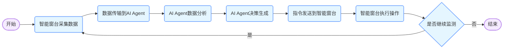

# 智能窗台：AI Agent的室内空气质量监测

> 关键词：智能窗台、AI Agent、室内空气质量监测、传感器技术、数据分析

> 摘要：本文聚焦于智能窗台结合AI Agent进行室内空气质量监测的相关技术。详细介绍了该技术的背景知识，包括目的、预期读者等。深入剖析了核心概念与联系，阐述了核心算法原理及具体操作步骤，并给出了相应的Python代码示例。同时，讲解了相关的数学模型和公式，通过项目实战展示了代码的实际应用和详细解释。探讨了该技术的实际应用场景，推荐了学习资源、开发工具框架以及相关论文著作。最后总结了未来发展趋势与挑战，还设置了常见问题解答和扩展阅读参考资料。

## 1. 背景介绍 
### 1.1 目的和范围
室内空气质量对人们的健康和生活质量有着至关重要的影响。长期处于空气质量不佳的环境中，可能会引发各种呼吸道疾病、过敏反应等健康问题。智能窗台结合AI Agent进行室内空气质量监测的目的在于实时、准确地获取室内空气质量数据，并通过智能分析为用户提供改善空气质量的建议，以保障室内人员的健康和舒适。

本文章的范围涵盖了从智能窗台硬件设备的原理，到AI Agent对数据处理和分析的整个过程，包括相关的算法、数学模型，以及实际项目中的应用和代码实现。

### 1.2 预期读者
本文预期读者包括对智能家居、人工智能、环境监测等领域感兴趣的技术爱好者，从事相关领域研究和开发的专业人员，以及希望改善室内空气质量的普通用户。

### 1.3 文档结构概述
本文将首先介绍核心概念与联系，包括智能窗台和AI Agent的基本原理和它们之间的关系。接着阐述核心算法原理和具体操作步骤，通过Python代码进行详细说明。然后讲解相关的数学模型和公式，并举例说明。之后通过项目实战展示代码的实际应用和详细解释。再探讨该技术的实际应用场景，推荐学习资源、开发工具框架和相关论文著作。最后总结未来发展趋势与挑战，设置常见问题解答和扩展阅读参考资料。

### 1.4 术语表
#### 1.4.1 核心术语定义
- **智能窗台**：集成了多种传感器和智能设备的窗台系统，能够实时监测室内空气质量等环境参数，并具备一定的智能控制和数据传输功能。
- **AI Agent**：人工智能代理，是一种能够感知环境、自主决策并采取行动以实现特定目标的软件实体。在本文中，AI Agent主要用于处理和分析智能窗台采集到的空气质量数据。
- **室内空气质量监测**：通过各种传感器对室内空气中的污染物浓度、温湿度等参数进行实时测量和分析的过程。

#### 1.4.2 相关概念解释
- **传感器技术**：用于检测和测量各种物理量和化学量的技术。在智能窗台中，传感器用于采集室内空气质量相关的数据，如气体传感器用于检测有害气体浓度，温湿度传感器用于测量温度和湿度。
- **数据分析**：对采集到的数据进行处理、清洗、挖掘和分析，以提取有价值的信息和知识。AI Agent通过数据分析来评估室内空气质量状况，并提供相应的建议。

#### 1.4.3 缩略词列表
- **IAQ**：Indoor Air Quality，室内空气质量
- **PM2.5**：Particulate Matter 2.5，细颗粒物，指空气动力学当量直径小于等于2.5微米的颗粒物。
- **VOCs**：Volatile Organic Compounds，挥发性有机化合物

## 2. 核心概念与联系 

### 智能窗台的原理
智能窗台主要由传感器模块、数据处理模块、通信模块和控制模块组成。传感器模块包含多种传感器，如气体传感器（用于检测甲醛、苯等有害气体）、颗粒物传感器（用于检测PM2.5、PM10等）、温湿度传感器等，这些传感器实时采集室内空气质量相关的数据。数据处理模块对传感器采集到的数据进行初步处理和转换，将模拟信号转换为数字信号。通信模块负责将处理后的数据传输到云端或本地服务器，以便进一步分析和存储。控制模块则根据数据分析的结果，控制智能窗的开合、通风设备的运行等，以改善室内空气质量。

### AI Agent的原理
AI Agent是一种基于人工智能技术的智能实体，它具有感知、决策和行动的能力。在室内空气质量监测中，AI Agent通过接收智能窗台传输的数据，利用机器学习、深度学习等算法对数据进行分析和处理。它可以建立空气质量模型，预测空气质量的变化趋势，评估当前空气质量状况，并根据预设的规则或优化算法生成相应的控制策略。例如，当检测到室内甲醛浓度超标时，AI Agent可以自动控制智能窗打开，增加通风量，降低甲醛浓度。

### 智能窗台与AI Agent的联系
智能窗台和AI Agent是相互协作的关系。智能窗台作为数据采集和执行设备，为AI Agent提供了实时的室内空气质量数据；而AI Agent则作为数据分析和决策中心，根据智能窗台提供的数据进行分析和处理，并将决策结果反馈给智能窗台，控制其执行相应的操作。通过这种协作，实现了对室内空气质量的智能监测和调控。

### 文本示意图
```plaintext
智能窗台
|-- 传感器模块
|   |-- 气体传感器
|   |-- 颗粒物传感器
|   |-- 温湿度传感器
|-- 数据处理模块
|-- 通信模块
|-- 控制模块

AI Agent
|-- 数据接收
|-- 数据分析
|   |-- 机器学习算法
|   |-- 深度学习算法
|-- 决策生成
|-- 指令发送

智能窗台 <----数据传输----> AI Agent
```

### Mermaid流程图


## 3. 核心算法原理 & 具体操作步骤 

### 核心算法原理
在室内空气质量监测中，常用的核心算法包括机器学习算法和深度学习算法。下面以支持向量机（SVM）为例，介绍其原理。

支持向量机是一种二分类模型，其基本思想是在特征空间中找到一个最优的超平面，使得不同类别的样本能够被最大程度地分开。在室内空气质量监测中，可以将空气质量分为“良好”和“不佳”两类，通过训练SVM模型来对新的空气质量数据进行分类。

### Python代码实现
```python
import numpy as np
from sklearn import svm
from sklearn.model_selection import train_test_split
from sklearn.metrics import accuracy_score

# 生成示例数据
# 假设我们有两个特征：PM2.5浓度和甲醛浓度
X = np.array([[20, 0.05], [30, 0.08], [40, 0.12], [10, 0.03], [50, 0.15]])
y = np.array([1, 1, 0, 1, 0])  # 1表示良好，0表示不佳

# 划分训练集和测试集
X_train, X_test, y_train, y_test = train_test_split(X, y, test_size=0.2, random_state=42)

# 创建SVM模型
clf = svm.SVC(kernel='linear')

# 训练模型
clf.fit(X_train, y_train)

# 预测
y_pred = clf.predict(X_test)

# 计算准确率
accuracy = accuracy_score(y_test, y_pred)
print(f"模型准确率: {accuracy}")
```

### 具体操作步骤
1. **数据采集**：使用智能窗台的传感器模块采集室内空气质量数据，包括PM2.5浓度、甲醛浓度、温湿度等。
2. **数据预处理**：对采集到的数据进行清洗、归一化等处理，以提高模型的训练效果。
3. **模型训练**：使用预处理后的数据训练SVM模型，调整模型参数以获得最佳的分类效果。
4. **模型评估**：使用测试集对训练好的模型进行评估，计算准确率、召回率等指标。
5. **实时监测与决策**：将训练好的模型部署到AI Agent中，实时接收智能窗台传输的数据，进行分类预测，并根据预测结果生成相应的控制策略。

## 4. 数学模型和公式 & 详细讲解 & 举例说明 

### 支持向量机的数学模型
支持向量机的目标是找到一个超平面 $w^T x + b = 0$，使得不同类别的样本能够被最大程度地分开。具体来说，对于二分类问题，我们希望找到一组参数 $w$ 和 $b$，使得以下条件成立：

对于正类样本 $x_i$，有 $w^T x_i + b \geq 1$；

对于负类样本 $x_j$，有 $w^T x_j + b \leq -1$。

同时，我们希望最大化两个类别的间隔，即最大化 $\frac{2}{\|w\|}$，等价于最小化 $\frac{1}{2}\|w\|^2$。因此，支持向量机的优化问题可以表示为：

$$
\begin{aligned}
\min_{w, b} &\quad \frac{1}{2}\|w\|^2 \\
\text{s.t.} &\quad y_i(w^T x_i + b) \geq 1, \quad i = 1, 2, \cdots, n
\end{aligned}
$$

其中，$y_i$ 是样本 $x_i$ 的类别标签，$n$ 是样本数量。

### 拉格朗日乘子法求解
为了求解上述优化问题，我们可以使用拉格朗日乘子法。引入拉格朗日乘子 $\alpha_i \geq 0$，构造拉格朗日函数：

$$
L(w, b, \alpha) = \frac{1}{2}\|w\|^2 - \sum_{i=1}^{n} \alpha_i (y_i(w^T x_i + b) - 1)
$$

对 $w$ 和 $b$ 求偏导数并令其为零，得到：

$$
\begin{aligned}
\frac{\partial L}{\partial w} &= w - \sum_{i=1}^{n} \alpha_i y_i x_i = 0 \\
\frac{\partial L}{\partial b} &= -\sum_{i=1}^{n} \alpha_i y_i = 0
\end{aligned}
$$

将上述结果代入拉格朗日函数，得到对偶问题：

$$
\begin{aligned}
\max_{\alpha} &\quad \sum_{i=1}^{n} \alpha_i - \frac{1}{2} \sum_{i=1}^{n} \sum_{j=1}^{n} \alpha_i \alpha_j y_i y_j x_i^T x_j \\
\text{s.t.} &\quad \sum_{i=1}^{n} \alpha_i y_i = 0 \\
&\quad \alpha_i \geq 0, \quad i = 1, 2, \cdots, n
\end{aligned}
$$

求解对偶问题得到最优的拉格朗日乘子 $\alpha^*$，然后可以计算出最优的 $w^*$ 和 $b^*$：

$$
w^* = \sum_{i=1}^{n} \alpha_i^* y_i x_i
$$

$$
b^* = y_j - w^{*T} x_j, \quad \text{其中} \alpha_j^* > 0
$$

### 举例说明
假设我们有三个样本：$x_1 = [1, 1]^T$，$y_1 = 1$；$x_2 = [2, 2]^T$，$y_2 = 1$；$x_3 = [-1, -1]^T$，$y_3 = -1$。我们可以使用上述公式求解支持向量机的最优超平面。

首先，构造对偶问题：

$$
\begin{aligned}
\max_{\alpha} &\quad \alpha_1 + \alpha_2 + \alpha_3 - \frac{1}{2} \left( \alpha_1^2 + \alpha_2^2 + \alpha_3^2 + 2\alpha_1\alpha_2 + 2\alpha_1\alpha_3 + 2\alpha_2\alpha_3 \right) \\
\text{s.t.} &\quad \alpha_1 + \alpha_2 - \alpha_3 = 0 \\
&\quad \alpha_1 \geq 0, \quad \alpha_2 \geq 0, \quad \alpha_3 \geq 0
\end{aligned}
$$

通过求解对偶问题，得到最优的拉格朗日乘子 $\alpha_1^* = 0.5$，$\alpha_2^* = 0$，$\alpha_3^* = 0.5$。

然后，计算最优的 $w^*$ 和 $b^*$：

$$
w^* = 0.5 \times 1 \times [1, 1]^T + 0 \times 1 \times [2, 2]^T + 0.5 \times (-1) \times [-1, -1]^T = [1, 1]^T
$$

$$
b^* = 1 - [1, 1]^T \times [1, 1]^T = -1
$$

因此，最优超平面为 $x_1 + x_2 - 1 = 0$。

## 5. 项目实战：代码实际案例和详细解释说明 

### 5.1  开发环境搭建
- **硬件环境**：选择合适的智能窗台硬件设备，如集成了多种传感器的开发板，如Arduino、Raspberry Pi等。同时，确保设备具备网络通信功能，以便将数据传输到云端或本地服务器。
- **软件环境**：安装Python开发环境，推荐使用Anaconda来管理Python环境和安装相关的库。安装必要的Python库，如`numpy`、`pandas`、`scikit-learn`等。

### 5.2  源代码详细实现和代码解读
```python
import serial
import time
import numpy as np
from sklearn import svm
import requests

# 串口通信设置
ser = serial.Serial('COM3', 9600)  # 根据实际情况修改串口号和波特率

# 加载训练好的SVM模型
clf = svm.SVC(kernel='linear')
# 这里需要替换为实际的训练数据和模型训练代码
X_train = np.array([[20, 0.05], [30, 0.08], [40, 0.12], [10, 0.03], [50, 0.15]])
y_train = np.array([1, 1, 0, 1, 0])
clf.fit(X_train, y_train)

# 主循环
while True:
    try:
        # 读取串口数据
        data = ser.readline().decode('utf-8').strip()
        # 假设数据格式为 "PM2.5,甲醛浓度"
        pm25, formaldehyde = map(float, data.split(','))

        # 数据预处理
        input_data = np.array([[pm25, formaldehyde]])

        # 预测空气质量
        prediction = clf.predict(input_data)

        if prediction[0] == 1:
            print("室内空气质量良好")
        else:
            print("室内空气质量不佳，建议通风")
            # 可以在这里添加控制智能窗打开的代码
            # 例如，通过HTTP请求控制智能窗设备
            requests.get('http://192.168.1.100/open_window')

        time.sleep(1)  # 每隔1秒读取一次数据

    except Exception as e:
        print(f"发生错误: {e}")
```

### 5.3  代码解读与分析
1. **串口通信设置**：使用`serial.Serial`函数打开串口，设置串口号和波特率，以便与智能窗台硬件设备进行通信。
2. **加载训练好的SVM模型**：创建SVM模型并使用示例数据进行训练。在实际应用中，需要使用大量的真实数据进行训练，以提高模型的准确性。
3. **主循环**：不断读取串口数据，将数据转换为数值类型，并进行预处理。使用训练好的SVM模型对数据进行预测，根据预测结果输出相应的信息。如果空气质量不佳，发送HTTP请求控制智能窗打开。
4. **异常处理**：使用`try-except`语句捕获可能出现的异常，确保程序的稳定性。

## 6. 实际应用场景 
### 家庭环境
在家庭环境中，智能窗台结合AI Agent的室内空气质量监测系统可以实时监测室内空气质量，当检测到有害气体超标或空气质量不佳时，自动打开窗户通风或控制空气净化器运行，为家庭成员提供一个健康、舒适的居住环境。同时，用户可以通过手机APP远程查看室内空气质量数据和控制智能设备，方便快捷。

### 办公场所
在办公场所，该系统可以帮助企业管理者实时了解办公室的空气质量状况，及时采取措施改善空气质量，提高员工的工作效率和健康水平。例如，当室内二氧化碳浓度过高时，自动打开通风设备，增加新鲜空气的流通。

### 学校教室
在学校教室中，该系统可以监测教室的空气质量，保障学生的健康和学习效果。当室内空气质量不佳时，及时通知老师打开窗户通风或采取其他措施，为学生创造一个良好的学习环境。

## 7. 工具和资源推荐
### 7.1 学习资源推荐
#### 7.1.1 书籍推荐
- 《Python机器学习实战》：介绍了Python在机器学习领域的应用，包括各种机器学习算法的原理和实现。
- 《深度学习》：由深度学习领域的三位顶尖专家编写，系统地介绍了深度学习的理论和实践。
- 《传感器技术基础》：详细讲解了传感器的原理、分类和应用，对于理解智能窗台的传感器模块有很大帮助。

#### 7.1.2 在线课程
- Coursera上的“机器学习”课程：由斯坦福大学教授Andrew Ng主讲，是机器学习领域的经典课程。
- edX上的“深度学习基础”课程：提供了深度学习的基础知识和实践经验。
- 中国大学MOOC上的“传感器原理及应用”课程：介绍了传感器的基本原理和应用案例。

#### 7.1.3 技术博客和网站
- Medium：有许多关于人工智能、机器学习和智能家居的技术文章和教程。
- 博客园：国内知名的技术博客平台，有很多开发者分享的技术经验和项目案例。
- 开源中国：提供了丰富的开源项目和技术文章，对于学习和实践有很大帮助。

### 7.2 开发工具框架推荐
#### 7.2.1 IDE和编辑器
- PyCharm：一款功能强大的Python集成开发环境，提供了代码编辑、调试、版本控制等功能。
- Visual Studio Code：一款轻量级的代码编辑器，支持多种编程语言，有丰富的插件扩展。
- Jupyter Notebook：一种交互式的编程环境，适合进行数据分析和模型训练。

#### 7.2.2 调试和性能分析工具
- Py-Spy：一个轻量级的Python性能分析工具，可以实时监测Python程序的CPU使用率和函数调用情况。
- pdb：Python内置的调试器，可以帮助开发者定位和解决代码中的问题。

#### 7.2.3 相关框架和库
- scikit-learn：一个常用的机器学习库，提供了各种机器学习算法的实现和工具。
- TensorFlow：一个开源的深度学习框架，广泛应用于图像识别、自然语言处理等领域。
- Keras：一个简单易用的深度学习库，基于TensorFlow或Theano，适合初学者快速上手。

### 7.3 相关论文著作推荐
#### 7.3.1 经典论文
- Cortes, C., & Vapnik, V. (1995). Support-vector networks. Machine learning, 20(3), 273-297. 这篇论文首次提出了支持向量机的概念和算法。
- LeCun, Y., Bengio, Y., & Hinton, G. (2015). Deep learning. Nature, 521(7553), 436-444. 该论文介绍了深度学习的发展历程、基本原理和应用领域。

#### 7.3.2 最新研究成果
- 可以关注ACM SIGKDD、IEEE ICML等顶级学术会议的论文，了解室内空气质量监测和人工智能领域的最新研究成果。

#### 7.3.3 应用案例分析
- 可以参考一些智能家居领域的应用案例分析报告，了解智能窗台结合AI Agent进行室内空气质量监测的实际应用效果和经验教训。

## 8. 总结：未来发展趋势与挑战
### 未来发展趋势
- **多传感器融合**：未来的智能窗台将集成更多类型的传感器，如气味传感器、光照传感器等，实现对室内环境的全方位监测。
- **人工智能技术的深化应用**：除了机器学习和深度学习算法，未来可能会引入强化学习、迁移学习等更高级的人工智能技术，提高室内空气质量监测和调控的智能化水平。
- **与其他智能家居系统的集成**：智能窗台将与智能门锁、智能灯光、智能家电等其他智能家居系统进行深度集成，实现更高效的家居自动化控制。

### 挑战
- **数据隐私和安全**：智能窗台采集的室内空气质量数据涉及用户的隐私信息，如何保障数据的安全和隐私是一个重要的挑战。
- **传感器精度和可靠性**：传感器的精度和可靠性直接影响室内空气质量监测的准确性，如何提高传感器的性能是需要解决的问题。
- **算法的可解释性**：人工智能算法的可解释性是一个热点问题，如何让用户理解AI Agent的决策过程和结果是未来需要研究的方向。

## 9. 附录：常见问题与解答
### 问题1：智能窗台的传感器需要多久校准一次？
答：传感器的校准周期取决于传感器的类型和使用环境。一般来说，气体传感器建议每年校准一次，颗粒物传感器可以每半年校准一次。在使用过程中，如果发现传感器数据异常，应及时进行校准。

### 问题2：AI Agent的决策结果是否准确？
答：AI Agent的决策结果的准确性取决于训练数据的质量和模型的性能。在实际应用中，需要使用大量的真实数据进行训练，并不断优化模型参数，以提高决策结果的准确性。同时，还可以结合人工经验和其他监测手段进行综合判断。

### 问题3：智能窗台系统的安装复杂吗？
答：智能窗台系统的安装相对简单，一般只需要将传感器模块安装在窗台合适的位置，连接好通信线路和电源即可。在安装过程中，需要注意传感器的安装方向和环境要求，以确保传感器能够正常工作。

## 10. 扩展阅读 & 参考资料
- [智能家居技术与应用](https://book.douban.com/subject/30302243/)
- [人工智能：现代方法](https://book.douban.com/subject/2121075/)
- [IEEE Transactions on Smart Grid](https://ieeexplore.ieee.org/xpl/RecentIssue.jsp?punumber=5962385)
- [ACM Transactions on Sensor Networks](https://dl.acm.org/journal/tosn)

作者：AI天才研究院/AI Genius Institute & 禅与计算机程序设计艺术 /Zen And The Art of Computer Programming