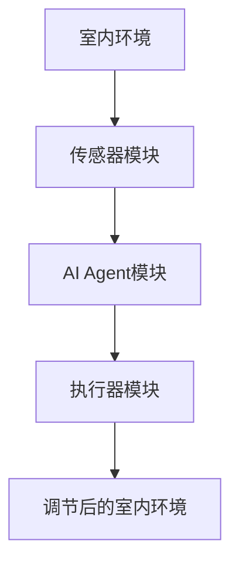

# 智能窗帘：AI Agent的室内环境全面调节

> 关键词：智能窗帘、AI Agent、室内环境调节、机器学习、传感器技术

> 摘要：本文围绕智能窗帘借助AI Agent实现室内环境全面调节展开深入探讨。首先介绍了智能窗帘在室内环境调节领域的研究背景、目的和适用读者群体等。详细阐述了智能窗帘及AI Agent的核心概念与架构联系，给出了相应的文本示意图和Mermaid流程图。深入讲解了相关核心算法原理，用Python代码进行详细说明，并介绍了其背后的数学模型和公式。通过项目实战，从开发环境搭建到源代码实现与解读，全面展示智能窗帘系统的构建过程。探讨了智能窗帘在不同场景下的实际应用，推荐了学习该领域知识的工具和资源，包括书籍、在线课程、开发工具等。最后对智能窗帘未来的发展趋势与挑战进行总结，并提供常见问题解答和扩展阅读参考资料，为智能窗帘的研究和应用提供了全面且深入的技术指导。

## 1. 背景介绍 
### 1.1 目的和范围
智能窗帘作为智能家居的重要组成部分，旨在通过先进的技术手段实现对室内环境的精细化调节。本文章的目的在于深入剖析智能窗帘如何借助AI Agent实现室内环境的全面调节，涵盖了从核心概念、算法原理到实际应用和未来发展等多个方面。研究范围包括智能窗帘的硬件系统、软件算法、与室内环境的交互机制，以及相关的机器学习和传感器技术等。通过对这些方面的研究，为智能窗帘的设计、开发和应用提供理论支持和实践指导。

### 1.2 预期读者
本文预期读者包括智能家居领域的开发者、研究人员，对人工智能和室内环境调节感兴趣的技术爱好者，以及从事智能建筑相关工作的工程师和设计师等。对于开发者而言，本文可以提供智能窗帘系统开发的详细技术指导；对于研究人员，有助于深入了解智能窗帘的技术原理和发展趋势；对于技术爱好者，能够拓宽其对智能家居技术的认知；对于工程师和设计师，可为智能建筑的设计和规划提供参考。

### 1.3 文档结构概述
本文将按照以下结构进行组织：首先介绍智能窗帘及AI Agent的背景知识，包括目的、预期读者和文档结构等；接着详细阐述核心概念与联系，给出相应的文本示意图和Mermaid流程图；然后讲解核心算法原理和具体操作步骤，并用Python代码进行说明；随后介绍相关的数学模型和公式，并举例说明；通过项目实战，展示智能窗帘系统的开发过程，包括环境搭建、源代码实现和代码解读；探讨智能窗帘在实际场景中的应用；推荐学习该领域知识的工具和资源；最后总结智能窗帘的未来发展趋势与挑战，提供常见问题解答和扩展阅读参考资料。

### 1.4 术语表
#### 1.4.1 核心术语定义
- **智能窗帘**：具备自动化控制和智能调节功能的窗帘系统，能够根据环境条件和用户需求自动调整窗帘的开合状态和程度。
- **AI Agent**：人工智能代理，是一种能够感知环境、做出决策并执行相应动作的智能实体。在智能窗帘系统中，AI Agent通过分析传感器数据，决定窗帘的调节策略。
- **室内环境调节**：通过调节室内的光照、温度、湿度等环境因素，创造舒适、健康的室内环境。
- **传感器技术**：用于感知室内外环境信息的技术，如光照传感器、温度传感器、湿度传感器等。
- **机器学习**：让计算机通过数据学习模式和规律，从而实现智能决策和预测的技术。在智能窗帘系统中，机器学习算法可用于分析传感器数据，优化调节策略。

#### 1.4.2 相关概念解释
- **智能家居**：利用先进的计算机技术、网络通信技术、传感器技术等，将家居设备智能化，实现家居设备的自动化控制和远程管理，提高家居生活的安全性、便利性和舒适性。
- **物联网（IoT）**：通过各种信息传感器、射频识别技术、全球定位系统等技术，将任何物品与互联网相连接，进行信息交换和通信，以实现对物品的智能化识别、定位、跟踪、监控和管理。智能窗帘是物联网在智能家居领域的典型应用之一。
- **自动化控制**：利用控制器和执行器，按照预定的规则和算法，自动调节设备的运行状态，实现设备的自动化操作。在智能窗帘系统中，自动化控制可实现窗帘的自动开合和调节。

#### 1.4.3 缩略词列表
- **AI**：Artificial Intelligence，人工智能
- **IoT**：Internet of Things，物联网
- **ML**：Machine Learning，机器学习

## 2. 核心概念与联系 

### 核心概念原理
智能窗帘借助AI Agent实现室内环境全面调节的核心原理是通过传感器实时感知室内外环境信息，如光照强度、温度、湿度等。AI Agent对这些传感器数据进行分析和处理，结合预设的规则和机器学习算法，做出决策，控制窗帘的开合状态和程度，以达到调节室内环境的目的。

智能窗帘系统主要由以下几个部分组成：
1. **传感器模块**：包括光照传感器、温度传感器、湿度传感器等，用于实时采集室内外环境信息。
2. **AI Agent模块**：接收传感器数据，进行数据分析和决策制定。AI Agent可以基于规则引擎、机器学习算法或深度学习模型实现。
3. **执行器模块**：控制窗帘的开合装置，根据AI Agent的决策执行相应的动作。
4. **通信模块**：实现传感器、AI Agent和执行器之间的数据传输和通信。

### 架构的文本示意图
```plaintext
+----------------------+
|      室内环境        |
| (光照、温度、湿度等) |
+----------------------+
           |
           v
+----------------------+
|     传感器模块       |
| (光照、温度、湿度传感器) |
+----------------------+
           |
           v
+----------------------+
|      AI Agent模块    |
| (数据分析、决策制定) |
+----------------------+
           |
           v
+----------------------+
|     执行器模块       |
| (窗帘开合装置)       |
+----------------------+
           |
           v
+----------------------+
|      调节后的室内环境 |
+----------------------+
```

### Mermaid流程图


## 3. 核心算法原理 & 具体操作步骤 

### 核心算法原理
智能窗帘系统中常用的核心算法包括基于规则的算法和机器学习算法。

#### 基于规则的算法
基于规则的算法是根据预设的规则来控制窗帘的开合。例如，如果光照强度超过一定阈值，则关闭窗帘；如果温度过高，则适当打开窗帘以通风降温。以下是一个简单的基于规则的算法示例：

```python
# 定义光照强度阈值
light_threshold = 500

# 模拟传感器数据
light_intensity = 600

# 根据规则判断是否关闭窗帘
if light_intensity > light_threshold:
    print("关闭窗帘")
else:
    print("保持窗帘状态")
```

#### 机器学习算法
机器学习算法可以通过学习历史数据，自动发现环境因素与窗帘调节之间的关系，从而实现更智能的调节策略。常用的机器学习算法包括决策树、支持向量机、神经网络等。以下是一个使用决策树算法的示例：

```python
import numpy as np
from sklearn.tree import DecisionTreeClassifier

# 模拟训练数据
# 特征：光照强度、温度
X = np.array([[300, 25], [600, 30], [200, 22], [700, 32]])
# 标签：0表示打开窗帘，1表示关闭窗帘
y = np.array([0, 1, 0, 1])

# 创建决策树分类器
clf = DecisionTreeClassifier()

# 训练模型
clf.fit(X, y)

# 模拟新的传感器数据
new_data = np.array([[500, 28]])

# 预测窗帘状态
prediction = clf.predict(new_data)

if prediction[0] == 0:
    print("打开窗帘")
else:
    print("关闭窗帘")
```

### 具体操作步骤
1. **数据采集**：通过传感器模块实时采集室内外环境信息，如光照强度、温度、湿度等。
2. **数据预处理**：对采集到的数据进行清洗、归一化等预处理操作，以提高数据质量和算法性能。
3. **算法选择和训练**：根据系统需求和数据特点，选择合适的算法（如基于规则的算法或机器学习算法），并使用历史数据进行训练。
4. **决策制定**：AI Agent根据实时采集的数据和训练好的算法模型，做出窗帘调节的决策。
5. **动作执行**：执行器模块根据AI Agent的决策，控制窗帘的开合状态和程度。

## 4. 数学模型和公式 & 详细讲解 & 举例说明 

### 基于规则的算法数学模型
基于规则的算法可以用条件判断语句来表示。假设光照强度为 $L$，光照强度阈值为 $L_{threshold}$，窗帘状态为 $S$（$S = 0$ 表示打开，$S = 1$ 表示关闭），则规则可以表示为：

$$
S = 
\begin{cases}
1, & \text{if } L > L_{threshold} \\
0, & \text{otherwise}
\end{cases}
$$

例如，当 $L_{threshold} = 500$，$L = 600$ 时，根据上述公式可得 $S = 1$，即关闭窗帘。

### 机器学习算法数学模型
以决策树算法为例，决策树是一种基于树结构进行决策的模型。决策树的每个内部节点表示一个特征上的测试，每个分支表示一个测试输出，每个叶节点表示一个类别或值。决策树的训练过程是通过寻找最优的划分特征和划分点，将数据集划分为不同的子集，使得每个子集内的数据尽可能属于同一类别。

决策树的分类过程可以用以下公式表示：

设决策树为 $T$，输入特征向量为 $x = (x_1, x_2, \cdots, x_n)$，则决策树的输出 $y$ 为：

$$
y = T(x)
$$

例如，在上述决策树算法示例中，输入特征向量 $x = [500, 28]$，通过训练好的决策树模型 $T$ 进行预测，得到输出 $y = 1$，即关闭窗帘。

## 5. 项目实战：代码实际案例和详细解释说明 

### 5.1  开发环境搭建
#### 硬件环境
- **智能窗帘套件**：包括窗帘电机、控制器等。
- **传感器模块**：光照传感器、温度传感器、湿度传感器等。
- **开发板**：如Arduino、Raspberry Pi等。

#### 软件环境
- **开发语言**：Python
- **开发框架**：如Flask（用于搭建Web服务器）、Scikit-learn（用于机器学习算法实现）
- **操作系统**：Windows、Linux或macOS

### 5.2  源代码详细实现和代码解读
以下是一个完整的智能窗帘系统的Python代码示例：

```python
import time
import random
from sklearn.tree import DecisionTreeClassifier

# 模拟传感器数据采集
def collect_sensor_data():
    light_intensity = random.randint(100, 1000)
    temperature = random.randint(20, 40)
    return light_intensity, temperature

# 模拟窗帘控制
def control_curtain(state):
    if state == 0:
        print("打开窗帘")
    else:
        print("关闭窗帘")

# 训练决策树模型
def train_model():
    # 模拟训练数据
    X = []
    y = []
    for _ in range(100):
        light_intensity = random.randint(100, 1000)
        temperature = random.randint(20, 40)
        if light_intensity > 500 or temperature > 30:
            state = 1
        else:
            state = 0
        X.append([light_intensity, temperature])
        y.append(state)

    # 创建决策树分类器
    clf = DecisionTreeClassifier()

    # 训练模型
    clf.fit(X, y)

    return clf

# 主循环
def main():
    # 训练模型
    model = train_model()

    while True:
        # 采集传感器数据
        light_intensity, temperature = collect_sensor_data()

        # 预测窗帘状态
        data = [[light_intensity, temperature]]
        prediction = model.predict(data)

        # 控制窗帘
        control_curtain(prediction[0])

        # 等待一段时间后再次采集数据
        time.sleep(5)

if __name__ == "__main__":
    main()
```

### 代码解读与分析
1. **collect_sensor_data函数**：模拟传感器数据采集，随机生成光照强度和温度数据。
2. **control_curtain函数**：模拟窗帘控制，根据输入的状态值（0表示打开，1表示关闭）控制窗帘的开合。
3. **train_model函数**：训练决策树模型。首先生成模拟训练数据，然后使用Scikit-learn库中的DecisionTreeClassifier类创建决策树分类器，并进行训练。
4. **main函数**：主循环，不断采集传感器数据，使用训练好的模型进行预测，并根据预测结果控制窗帘的开合。每次采集数据后，等待5秒再进行下一次采集。

## 6. 实际应用场景 
### 家庭住宅
在家庭住宅中，智能窗帘可以根据不同的时间段和环境条件自动调节。例如，在早晨，当光照强度逐渐增强时，智能窗帘可以自动打开，让阳光照进房间；在中午，当阳光过于强烈时，智能窗帘可以自动关闭，避免室内温度过高。此外，用户还可以通过手机APP远程控制窗帘的开合，方便快捷。

### 商业办公场所
在商业办公场所，智能窗帘可以根据室内人员的活动情况和环境需求进行调节。例如，在会议室中，当进行投影演示时，智能窗帘可以自动关闭，营造良好的演示环境；在办公区域，智能窗帘可以根据光照强度和温度自动调节，提高员工的工作舒适度。

### 酒店客房
在酒店客房中，智能窗帘可以为客人提供更加个性化的服务。客人可以通过客房内的控制面板或手机APP控制窗帘的开合，也可以设置定时开关功能。此外，智能窗帘还可以与酒店的其他智能设备（如空调、灯光等）联动，实现更加智能化的环境调节。

## 7. 工具和资源推荐
### 7.1 学习资源推荐
#### 7.1.1 书籍推荐
- 《智能家居技术与应用》：全面介绍了智能家居的相关技术和应用案例，包括智能窗帘系统的设计和开发。
- 《机器学习实战》：通过实际案例详细介绍了机器学习的算法和应用，对于理解智能窗帘系统中的机器学习算法有很大帮助。
- 《Python数据分析实战》：介绍了Python在数据分析和处理方面的应用，可用于智能窗帘系统中的数据预处理和分析。

#### 7.1.2 在线课程
- Coursera上的“人工智能基础”课程：系统介绍了人工智能的基本概念、算法和应用，为学习智能窗帘系统中的AI Agent技术提供了理论基础。
- edX上的“机器学习”课程：深入讲解了机器学习的各种算法和模型，适合对机器学习有一定基础的学习者。
- 中国大学MOOC上的“智能家居系统设计与实现”课程：结合实际案例，介绍了智能家居系统的设计和开发过程，包括智能窗帘系统的实现。

#### 7.1.3 技术博客和网站
- 开源中国（https://www.oschina.net/）：提供了丰富的开源项目和技术文章，可搜索智能窗帘相关的开源项目和技术分享。
- 博客园（https://www.cnblogs.com/）：有许多开发者分享的技术博客，可查找智能窗帘系统开发的经验和技巧。
- Medium（https://medium.com/）：国际知名的技术博客平台，有很多关于人工智能和智能家居的优质文章。

### 7.2 开发工具框架推荐
#### 7.2.1 IDE和编辑器
- PyCharm：功能强大的Python集成开发环境，提供代码编辑、调试、版本控制等功能，适合开发智能窗帘系统的Python代码。
- Visual Studio Code：轻量级的代码编辑器，支持多种编程语言和插件扩展，可用于智能窗帘系统的前端和后端开发。
- Arduino IDE：专门用于Arduino开发板的集成开发环境，可用于编写智能窗帘系统中传感器和执行器的控制代码。

#### 7.2.2 调试和性能分析工具
- Py-Spy：用于Python代码的性能分析工具，可以分析代码的运行时间和内存使用情况，帮助优化智能窗帘系统的性能。
- Wireshark：网络协议分析工具，可用于调试智能窗帘系统中的通信模块，分析数据传输过程中的问题。
- Arduino Serial Monitor：Arduino IDE自带的串口监视器，可用于调试Arduino开发板与传感器、执行器之间的通信。

#### 7.2.3 相关框架和库
- Scikit-learn：Python中常用的机器学习库，提供了丰富的机器学习算法和工具，可用于智能窗帘系统中的数据分析和决策制定。
- Flask：轻量级的Python Web框架，可用于搭建智能窗帘系统的Web服务器，实现远程控制和数据交互。
- MQTT Python Client：用于实现MQTT协议的Python库，可用于智能窗帘系统中的设备通信和数据传输。

### 7.3 相关论文著作推荐
#### 7.3.1 经典论文
- “A Survey on Smart Home Technologies”：对智能家居技术进行了全面的综述，包括智能窗帘系统的相关技术和应用。
- “Machine Learning for Home Automation: A Survey”：介绍了机器学习在家庭自动化中的应用，为智能窗帘系统中的机器学习算法应用提供了参考。
- “Sensor Networks for Smart Homes: A Survey”：探讨了传感器网络在智能家居中的应用，对于智能窗帘系统中的传感器技术有深入的分析。

#### 7.3.2 最新研究成果
- 可通过IEEE Xplore、ACM Digital Library等学术数据库搜索智能窗帘和智能家居领域的最新研究成果，了解该领域的前沿技术和发展趋势。

#### 7.3.3 应用案例分析
- 可以参考一些智能家居领域的实际应用案例，如三星、小米等公司的智能家居解决方案，了解智能窗帘系统在实际应用中的设计和实现方法。

## 8. 总结：未来发展趋势与挑战
### 未来发展趋势
- **智能化程度不断提高**：随着人工智能技术的不断发展，智能窗帘将具备更强的学习和适应能力，能够根据用户的习惯和环境变化自动调整调节策略，实现更加个性化的室内环境调节。
- **与其他智能设备深度融合**：智能窗帘将与智能家居中的其他设备（如空调、灯光、安防系统等）实现更深度的融合，形成一个整体的智能家居生态系统，为用户提供更加便捷、舒适的家居生活体验。
- **节能环保**：智能窗帘可以根据光照强度和温度等环境因素自动调节，减少能源消耗，实现节能环保的目标。未来，智能窗帘将在节能环保方面发挥更大的作用。
- **外观设计更加多样化**：除了功能上的不断提升，智能窗帘的外观设计也将更加多样化，满足不同用户的审美需求。

### 挑战
- **数据安全和隐私问题**：智能窗帘系统需要采集和处理大量的用户数据，如室内环境信息、用户使用习惯等。如何保障这些数据的安全和隐私，防止数据泄露和滥用，是智能窗帘系统面临的重要挑战。
- **标准和协议不统一**：目前智能家居领域的标准和协议不统一，不同品牌和厂商的智能窗帘系统可能存在兼容性问题。这给用户的选择和使用带来了不便，也限制了智能窗帘系统的发展。
- **成本较高**：智能窗帘系统的研发、生产和安装成本相对较高，这使得智能窗帘的价格普遍较贵，限制了其市场普及程度。如何降低成本，提高智能窗帘的性价比，是推动其市场发展的关键。

## 9. 附录：常见问题与解答
### 问题1：智能窗帘的安装复杂吗？
解答：智能窗帘的安装相对传统窗帘会复杂一些，需要安装电机、控制器和传感器等设备，并进行布线和调试。不过，现在很多智能窗帘产品都提供了详细的安装说明书和视频教程，用户也可以选择专业的安装服务人员进行安装。

### 问题2：智能窗帘的使用寿命有多长？
解答：智能窗帘的使用寿命主要取决于电机、控制器等关键部件的质量和使用频率。一般来说，优质的智能窗帘产品使用寿命可以达到5 - 10年。

### 问题3：智能窗帘在停电时能否正常使用？
解答：大部分智能窗帘在停电时无法实现自动控制功能，但一些产品配备了手动操作装置，用户可以通过手动方式开合窗帘。

### 问题4：智能窗帘的安全性如何？
解答：正规厂家生产的智能窗帘产品都经过了严格的安全检测，具备过载保护、漏电保护等安全功能。同时，在使用过程中，用户也应该注意正确操作，避免发生安全事故。

## 10. 扩展阅读 & 参考资料
### 扩展阅读
- 《智能家居革命：从概念到实践》：深入探讨了智能家居的发展历程、技术应用和未来趋势，为智能窗帘的研究和应用提供了更广阔的视野。
- 《人工智能时代的家居生活》：介绍了人工智能技术在家居领域的应用，包括智能窗帘、智能家电等，展示了未来家居生活的智能化场景。

### 参考资料
- 智能家居相关行业报告，如艾瑞咨询发布的《中国智能家居行业研究报告》等，提供了智能家居市场的发展现状和趋势分析。
- 智能窗帘产品的官方文档和技术资料，可了解具体产品的功能、性能和使用方法。

作者：AI天才研究院/AI Genius Institute & 禅与计算机程序设计艺术 /Zen And The Art of Computer Programming