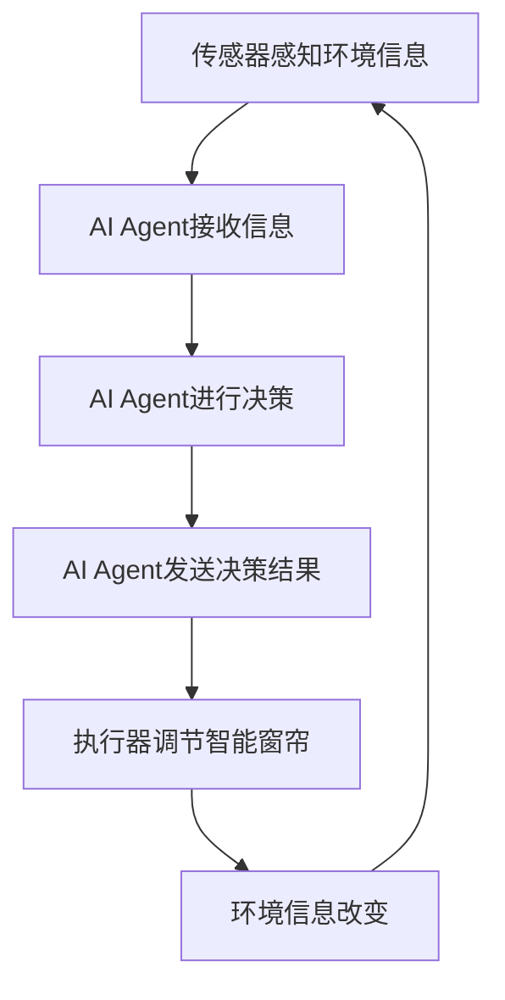

# 智能窗帘：AI Agent的日光优化调节

> 关键词：智能窗帘、AI Agent、日光优化调节、传感器、机器学习

> 摘要：本文聚焦于智能窗帘借助AI Agent实现日光优化调节这一前沿技术。首先介绍了该技术的背景，包括目的、预期读者、文档结构和相关术语。接着阐述了核心概念，给出了原理和架构的示意图与流程图。详细讲解了核心算法原理，通过Python代码进行说明，并分析了相关数学模型和公式。通过项目实战，展示了开发环境搭建、源代码实现与解读。探讨了实际应用场景，推荐了学习资源、开发工具和相关论文著作。最后总结了未来发展趋势与挑战，还设置了常见问题解答和扩展阅读参考资料，旨在为读者全面呈现智能窗帘日光优化调节技术的全貌。

## 1. 背景介绍 
### 1.1 目的和范围
智能窗帘的日光优化调节技术旨在利用先进的人工智能技术，根据不同的环境条件和用户需求，自动调节窗帘的开合程度，以实现室内日光的优化利用。其范围涵盖了家庭、办公室、商业场所等各种室内空间，通过合理控制日光的进入量，不仅可以提高室内的舒适度，还能降低能源消耗，达到节能环保的目的。

### 1.2 预期读者
本文预期读者包括智能家居爱好者、人工智能技术开发者、建筑设计师、能源管理专家以及对节能环保感兴趣的人士。对于智能家居爱好者，本文可以帮助他们了解智能窗帘日光优化调节的原理和优势，以便在家庭装修中做出更合理的选择；对于人工智能技术开发者，提供了具体的算法实现和项目实战案例，有助于他们进行相关技术的研究和开发；建筑设计师可以从中获取灵感，将智能窗帘技术融入到建筑设计中；能源管理专家可以通过该技术优化建筑的能源消耗；而对节能环保感兴趣的人士则可以了解到一种新的节能方式。

### 1.3 文档结构概述
本文将按照以下结构进行阐述：首先介绍核心概念与联系，包括智能窗帘、AI Agent和日光优化调节的原理和架构；接着详细讲解核心算法原理和具体操作步骤，并给出Python代码示例；然后分析相关的数学模型和公式，并举例说明；通过项目实战展示开发环境搭建、源代码实现和代码解读；探讨该技术的实际应用场景；推荐学习资源、开发工具和相关论文著作；最后总结未来发展趋势与挑战，设置常见问题解答和扩展阅读参考资料。

### 1.4 术语表
#### 1.4.1 核心术语定义
- **智能窗帘**：具备自动控制功能的窗帘系统，可通过传感器、网络等技术实现远程或自动控制。
- **AI Agent**：人工智能代理，是一种能够感知环境、进行决策并采取行动的智能实体，在本文中用于实现智能窗帘的日光优化调节。
- **日光优化调节**：根据室内外环境条件和用户需求，自动调节智能窗帘的开合程度，以达到最佳的日光利用效果。
- **传感器**：用于感知环境信息的设备，如光照传感器、温度传感器等，为AI Agent提供决策依据。

#### 1.4.2 相关概念解释
- **机器学习**：AI Agent实现日光优化调节的重要技术手段，通过对大量数据的学习和分析，建立预测模型，从而实现智能决策。
- **物联网（IoT）**：将智能窗帘与其他设备通过网络连接起来，实现信息的交互和共享，方便用户进行远程控制和管理。
- **节能**：通过合理调节智能窗帘，减少人工照明和空调的使用，降低能源消耗，达到节能环保的目的。

#### 1.4.3 缩略词列表
- **AI**：Artificial Intelligence，人工智能
- **IoT**：Internet of Things，物联网
- **ML**：Machine Learning，机器学习

## 2. 核心概念与联系 
### 核心概念原理
智能窗帘的日光优化调节主要基于以下原理：通过传感器实时感知室内外的环境信息，如光照强度、温度、时间等。AI Agent根据这些信息，结合机器学习算法和预设的规则，对智能窗帘的开合程度进行决策。然后，将决策结果发送给智能窗帘执行器，实现窗帘的自动调节。

### 架构的文本示意图
```plaintext
+---------------------+
|   传感器模块        |
|  (光照、温度等)      |
+---------------------+
          |
          v
+---------------------+
|   AI Agent模块      |
|  (机器学习算法)     |
+---------------------+
          |
          v
+---------------------+
|   执行器模块        |
|  (智能窗帘电机)     |
+---------------------+
```

### Mermaid 流程图


## 3. 核心算法原理 & 具体操作步骤 
### 核心算法原理
AI Agent实现日光优化调节的核心算法主要基于机器学习中的回归算法。回归算法可以根据历史数据建立输入（环境信息）和输出（窗帘开合程度）之间的关系模型。常用的回归算法有线性回归、决策树回归、随机森林回归等。

以线性回归为例，假设我们有一组训练数据 $(x_1, y_1), (x_2, y_2), \cdots, (x_n, y_n)$，其中 $x_i$ 是环境信息向量（如光照强度、温度等），$y_i$ 是对应的窗帘开合程度。线性回归模型的目标是找到一组权重 $w_0, w_1, \cdots, w_m$，使得预测值 $\hat{y}_i = w_0 + w_1x_{i1} + w_2x_{i2} + \cdots + w_mx_{im}$ 与真实值 $y_i$ 之间的误差最小。误差通常使用均方误差（MSE）来衡量：

$$MSE = \frac{1}{n} \sum_{i=1}^{n} (y_i - \hat{y}_i)^2$$

通过最小化MSE，我们可以得到最优的权重 $w$。

### 具体操作步骤
1. **数据收集**：使用传感器收集室内外的环境信息和对应的窗帘开合程度，形成训练数据集。
2. **数据预处理**：对收集到的数据进行清洗、归一化等处理，以提高模型的训练效果。
3. **模型训练**：选择合适的回归算法，使用训练数据集对模型进行训练。
4. **模型评估**：使用测试数据集对训练好的模型进行评估，计算评估指标（如MSE、RMSE等）。
5. **实时决策**：在实际应用中，传感器实时收集环境信息，将其输入到训练好的模型中，得到预测的窗帘开合程度，并发送给执行器进行调节。

### Python源代码实现
```python
import numpy as np
from sklearn.linear_model import LinearRegression
from sklearn.model_selection import train_test_split
from sklearn.metrics import mean_squared_error

# 生成示例数据
np.random.seed(42)
X = np.random.rand(100, 2)  # 环境信息（光照强度、温度）
y = 2 * X[:, 0] + 3 * X[:, 1] + np.random.randn(100) * 0.1  # 窗帘开合程度

# 划分训练集和测试集
X_train, X_test, y_train, y_test = train_test_split(X, y, test_size=0.2, random_state=42)

# 创建线性回归模型
model = LinearRegression()

# 模型训练
model.fit(X_train, y_train)

# 模型预测
y_pred = model.predict(X_test)

# 模型评估
mse = mean_squared_error(y_test, y_pred)
print(f"均方误差: {mse}")

# 实时决策示例
new_X = np.array([[0.5, 0.6]])
predicted_y = model.predict(new_X)
print(f"预测的窗帘开合程度: {predicted_y[0]}")
```

## 4. 数学模型和公式 & 详细讲解 & 举例说明 
### 线性回归模型
线性回归模型的一般形式为：

$$\hat{y} = w_0 + w_1x_1 + w_2x_2 + \cdots + w_mx_m$$

其中，$\hat{y}$ 是预测值，$w_0$ 是截距，$w_1, w_2, \cdots, w_m$ 是权重，$x_1, x_2, \cdots, x_m$ 是输入特征。

### 最小化均方误差
均方误差（MSE）的公式为：

$$MSE = \frac{1}{n} \sum_{i=1}^{n} (y_i - \hat{y}_i)^2$$

为了找到最优的权重 $w$，我们需要最小化MSE。可以使用梯度下降法等优化算法来实现。

### 梯度下降法
梯度下降法是一种迭代优化算法，通过不断更新权重 $w$ 来逐步减小MSE。具体步骤如下：
1. 初始化权重 $w$。
2. 计算MSE关于 $w$ 的梯度 $\nabla MSE(w)$。
3. 更新权重 $w$：

$$w = w - \alpha \nabla MSE(w)$$

其中，$\alpha$ 是学习率，控制每次更新的步长。
4. 重复步骤2和3，直到MSE收敛或达到最大迭代次数。

### 举例说明
假设我们有以下训练数据：

| 光照强度 $x_1$ | 温度 $x_2$ | 窗帘开合程度 $y$ |
| --- | --- | --- |
| 0.1 | 0.2 | 0.5 |
| 0.2 | 0.3 | 0.7 |
| 0.3 | 0.4 | 0.9 |

我们可以使用线性回归模型来拟合这些数据。首先，我们将数据表示为矩阵形式：

$$X = \begin{bmatrix} 1 & 0.1 & 0.2 \\ 1 & 0.2 & 0.3 \\ 1 & 0.3 & 0.4 \end{bmatrix}, y = \begin{bmatrix} 0.5 \\ 0.7 \\ 0.9 \end{bmatrix}$$

然后，使用最小二乘法求解权重 $w$：

$$w = (X^T X)^{-1} X^T y$$

计算得到：

$$w = \begin{bmatrix} 0.1 \\ 2 \\ 1 \end{bmatrix}$$

因此，线性回归模型为：

$$\hat{y} = 0.1 + 2x_1 + x_2$$

当输入新的环境信息 $(x_1 = 0.4, x_2 = 0.5)$ 时，预测的窗帘开合程度为：

$$\hat{y} = 0.1 + 2 \times 0.4 + 0.5 = 1.4$$

## 5. 项目实战：代码实际案例和详细解释说明 
### 5.1  开发环境搭建
#### 硬件环境
- **智能窗帘执行器**：选择支持网络控制的智能窗帘电机，如小米智能窗帘电机。
- **传感器**：光照传感器、温度传感器等，可使用Arduino或Raspberry Pi连接传感器进行数据采集。
- **服务器**：可以使用云服务器或本地服务器，运行AI Agent程序。

#### 软件环境
- **操作系统**：推荐使用Linux系统，如Ubuntu。
- **编程语言**：Python 3.x。
- **机器学习库**：Scikit-learn、TensorFlow等。
- **物联网平台**：可选择阿里云物联网平台、腾讯云物联网平台等。

### 5.2  源代码详细实现和代码解读
```python
import time
import random
from sklearn.linear_model import LinearRegression

# 模拟传感器数据采集
def collect_sensor_data():
    light_intensity = random.uniform(0, 1000)  # 光照强度
    temperature = random.uniform(20, 30)  # 温度
    return [light_intensity, temperature]

# 模拟智能窗帘调节
def adjust_curtain(degree):
    print(f"调节窗帘开合程度为: {degree}")

# 训练线性回归模型
def train_model():
    # 生成示例训练数据
    X = []
    y = []
    for _ in range(100):
        light_intensity = random.uniform(0, 1000)
        temperature = random.uniform(20, 30)
        X.append([light_intensity, temperature])
        # 简单的线性关系
        degree = 0.1 * light_intensity + 0.2 * temperature + random.uniform(-10, 10)
        y.append(degree)
    
    model = LinearRegression()
    model.fit(X, y)
    return model

# 主程序
if __name__ == "__main__":
    model = train_model()
    
    while True:
        # 采集传感器数据
        sensor_data = collect_sensor_data()
        
        # 预测窗帘开合程度
        predicted_degree = model.predict([sensor_data])[0]
        
        # 调节窗帘
        adjust_curtain(predicted_degree)
        
        time.sleep(60)  # 每隔60秒采集一次数据
```

### 代码解读与分析
1. **数据采集**：`collect_sensor_data` 函数模拟了传感器数据的采集，返回光照强度和温度。
2. **窗帘调节**：`adjust_curtain` 函数模拟了智能窗帘的调节，打印出调节的开合程度。
3. **模型训练**：`train_model` 函数生成示例训练数据，并使用线性回归模型进行训练。
4. **主程序**：在主程序中，首先训练模型，然后进入一个无限循环，每隔60秒采集一次传感器数据，使用训练好的模型预测窗帘开合程度，并调用 `adjust_curtain` 函数进行调节。

## 6. 实际应用场景 
### 家庭场景
在家庭中，智能窗帘的日光优化调节可以提高居住的舒适度。例如，在早晨，根据光照强度自动打开窗帘，让阳光自然照亮房间；在中午阳光强烈时，适当关闭窗帘，减少室内温度升高，降低空调的使用频率；在晚上，自动关闭窗帘，保护隐私。

### 办公室场景
在办公室中，合理调节智能窗帘可以提高员工的工作效率。根据不同的时间段和光照条件，自动调节窗帘的开合程度，为员工创造一个舒适的工作环境。同时，还可以降低能源消耗，节约办公成本。

### 商业场所场景
在商场、酒店等商业场所，智能窗帘的日光优化调节可以提升场所的品质和形象。根据不同的营业时间和活动需求，自动调节窗帘的开合，营造出不同的氛围。例如，在举办活动时，打开窗帘让阳光充满整个场地，增加活动的氛围。

## 7. 工具和资源推荐
### 7.1 学习资源推荐
#### 7.1.1 书籍推荐
- 《Python机器学习》：介绍了Python在机器学习中的应用，包括线性回归、决策树等算法。
- 《人工智能：一种现代的方法》：全面介绍了人工智能的基本概念、算法和应用。
- 《智能家居实战》：讲解了智能家居系统的设计、开发和应用，包括智能窗帘技术。

#### 7.1.2 在线课程
- Coursera上的“机器学习”课程：由斯坦福大学教授Andrew Ng主讲，是机器学习领域的经典课程。
- 阿里云开发者社区的“物联网开发实战”课程：介绍了物联网的基本概念和开发流程，包括传感器数据采集、设备连接等。

#### 7.1.3 技术博客和网站
- 博客园：有许多关于人工智能、智能家居的技术文章和经验分享。
- 开源中国：提供了大量的开源项目和技术资料，可用于智能窗帘项目的开发。

### 7.2 开发工具框架推荐
#### 7.2.1 IDE和编辑器
- PyCharm：一款专业的Python集成开发环境，提供了丰富的代码编辑、调试和项目管理功能。
- Visual Studio Code：一款轻量级的代码编辑器，支持多种编程语言和插件扩展，适合快速开发。

#### 7.2.2 调试和性能分析工具
- TensorBoard：用于可视化深度学习模型的训练过程和性能指标。
- Scikit-learn的交叉验证工具：可用于评估机器学习模型的性能和选择最优参数。

#### 7.2.3 相关框架和库
- Scikit-learn：提供了丰富的机器学习算法和工具，如线性回归、决策树等。
- TensorFlow：一个开源的深度学习框架，可用于构建复杂的人工智能模型。
- MQTT：一种轻量级的物联网通信协议，可用于智能窗帘与服务器之间的数据传输。

### 7.3 相关论文著作推荐
#### 7.3.1 经典论文
- “Linear Regression for Machine Learning”：介绍了线性回归的基本原理和应用。
- “Internet of Things: A Survey”：对物联网的概念、架构和应用进行了全面的综述。

#### 7.3.2 最新研究成果
- 关注IEEE Transactions on Smart Grid、ACM Transactions on Sensor Networks等期刊，获取智能窗帘和物联网领域的最新研究成果。

#### 7.3.3 应用案例分析
- 可以参考一些智能家居企业的官方网站和技术报告，了解智能窗帘在实际应用中的案例和经验。

## 8. 总结：未来发展趋势与挑战
### 未来发展趋势
- **智能化程度不断提高**：随着人工智能技术的不断发展，AI Agent将具备更强的学习和决策能力，能够根据用户的习惯和环境变化，实现更加精准的日光优化调节。
- **与其他智能家居设备的集成**：智能窗帘将与智能照明、智能空调等设备实现更紧密的集成，形成一个完整的智能家居系统，实现更加智能化的能源管理和环境控制。
- **个性化定制**：用户可以根据自己的需求和喜好，对智能窗帘的日光优化调节策略进行个性化定制，满足不同用户的个性化需求。

### 挑战
- **数据安全和隐私问题**：智能窗帘需要收集和处理大量的用户数据，如环境信息、用户习惯等，如何保障数据的安全和隐私是一个重要的挑战。
- **算法的准确性和可靠性**：AI Agent的决策结果直接影响到智能窗帘的调节效果，如何提高算法的准确性和可靠性，确保在各种复杂环境下都能实现最优的日光调节，是需要解决的问题。
- **成本问题**：目前智能窗帘的成本相对较高，限制了其大规模普及。如何降低成本，提高性价比，是推动智能窗帘市场发展的关键。

## 9. 附录：常见问题与解答
### 智能窗帘的安装复杂吗？
智能窗帘的安装相对传统窗帘会复杂一些，需要考虑电机的安装、传感器的布置和网络连接等问题。一般建议由专业的安装人员进行安装。

### AI Agent的决策结果准确吗？
AI Agent的决策结果的准确性取决于多个因素，如训练数据的质量、算法的选择和模型的调优。通过不断优化数据和算法，可以提高决策结果的准确性。

### 智能窗帘可以远程控制吗？
可以，通过物联网平台，用户可以使用手机APP等方式对智能窗帘进行远程控制，实现随时随地的调节。

### 智能窗帘的使用寿命有多长？
智能窗帘的使用寿命取决于电机、传感器等部件的质量和使用频率。一般来说，优质的智能窗帘可以使用5-10年。

## 10. 扩展阅读 & 参考资料
- [智能家居技术发展报告](https://example.com/smart_home_report.pdf)
- [线性回归算法详解](https://example.com/linear_regression_explanation.pdf)
- [物联网安全技术研究](https://example.com/iot_security_research.pdf)

作者：AI天才研究院/AI Genius Institute & 禅与计算机程序设计艺术 /Zen And The Art of Computer Programming