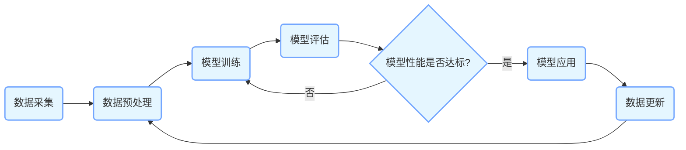

# 智能算法构建自适应估值模型

> 关键词：智能算法、自适应估值模型、数学模型、项目实战、应用场景

> 摘要：本文深入探讨了如何运用智能算法构建自适应估值模型。首先介绍了相关背景知识，包括目的、预期读者等。接着详细阐述了核心概念及其联系，给出了原理和架构的文本示意图与 Mermaid 流程图。对核心算法原理进行了讲解，并使用 Python 代码展示具体操作步骤。同时，给出了数学模型和公式，并举例说明。通过项目实战，展示了开发环境搭建、源代码实现及代码解读。分析了实际应用场景，推荐了相关的工具和资源。最后总结了未来发展趋势与挑战，提供了常见问题解答和扩展阅读参考资料，旨在为读者全面呈现智能算法构建自适应估值模型的技术全貌。

## 1. 背景介绍 
### 1.1 目的和范围
在当今复杂多变的经济和商业环境中，准确的估值对于投资决策、风险管理、资产定价等诸多领域至关重要。传统的估值模型往往基于固定的假设和参数，难以适应动态变化的市场条件和数据特征。智能算法构建自适应估值模型的目的在于利用先进的智能算法，如机器学习、深度学习等，使估值模型能够根据实时数据和市场变化自动调整参数和结构，从而提高估值的准确性和灵活性。

本文的范围涵盖了从核心概念的介绍、算法原理的讲解、数学模型的推导，到项目实战的演示以及实际应用场景的分析。同时，还会推荐相关的学习资源、开发工具和研究论文，为读者提供一个全面的技术学习和实践指南。

### 1.2 预期读者
本文预期读者包括但不限于以下几类人群：
- 金融从业者：如投资经理、分析师、风险管理人员等，希望通过智能算法提升估值的准确性和效率，为投资决策提供更可靠的依据。
- 数据科学家和机器学习工程师：对将智能算法应用于金融估值领域感兴趣，希望深入了解自适应估值模型的原理和实现方法。
- 科研人员：从事金融工程、机器学习等相关领域的研究，希望从本文中获取新的研究思路和方法。
- 学生：学习金融、计算机科学等相关专业的学生，希望通过本文了解智能算法在实际应用中的具体案例。

### 1.3 文档结构概述
本文将按照以下结构进行组织：
1. 背景介绍：阐述目的和范围、预期读者、文档结构概述以及术语表。
2. 核心概念与联系：介绍智能算法、自适应估值模型等核心概念，给出原理和架构的文本示意图与 Mermaid 流程图。
3. 核心算法原理 & 具体操作步骤：讲解核心算法原理，并使用 Python 代码展示具体操作步骤。
4. 数学模型和公式 & 详细讲解 & 举例说明：推导数学模型和公式，并举例说明其应用。
5. 项目实战：代码实际案例和详细解释说明，包括开发环境搭建、源代码实现和代码解读。
6. 实际应用场景：分析智能算法构建自适应估值模型在不同领域的实际应用场景。
7. 工具和资源推荐：推荐相关的学习资源、开发工具和研究论文。
8. 总结：未来发展趋势与挑战。
9. 附录：常见问题与解答。
10. 扩展阅读 & 参考资料。

### 1.4 术语表
#### 1.4.1 核心术语定义
- 智能算法：指具有学习、自适应和优化能力的算法，如机器学习算法（决策树、支持向量机等）、深度学习算法（神经网络等）。
- 自适应估值模型：一种能够根据输入数据的变化自动调整参数和结构，以适应不同市场条件和数据特征的估值模型。
- 机器学习：一门多领域交叉学科，涉及概率论、统计学、逼近论、凸分析、算法复杂度理论等多门学科。它专门研究计算机怎样模拟或实现人类的学习行为，以获取新的知识或技能，重新组织已有的知识结构使之不断改善自身的性能。
- 深度学习：机器学习的一个分支领域，它试图使用包含复杂结构或由多重非线性变换构成的多个处理层对数据进行高层抽象的算法。

#### 1.4.2 相关概念解释
- 模型训练：通过将历史数据输入到模型中，让模型学习数据中的规律和特征，从而调整模型的参数，使模型能够更好地拟合数据。
- 模型评估：使用评估指标（如均方误差、平均绝对误差等）来衡量模型在测试数据上的性能，以评估模型的准确性和泛化能力。
- 特征工程：从原始数据中提取和选择有用的特征，以提高模型的性能和可解释性。

#### 1.4.3 缩略词列表
- MSE：Mean Squared Error，均方误差
- MAE：Mean Absolute Error，平均绝对误差
- ANN：Artificial Neural Network，人工神经网络
- SVM：Support Vector Machine，支持向量机

## 2. 核心概念与联系 

### 核心概念原理
#### 智能算法
智能算法是构建自适应估值模型的核心驱动力。机器学习算法通过对大量历史数据的学习，能够发现数据中的潜在模式和规律。例如，决策树算法通过对数据进行递归划分，构建出一棵决策树，每个内部节点是一个属性上的测试，每个分支是一个测试输出，每个叶节点是一个类别或值。支持向量机则通过寻找最优的超平面，将不同类别的数据分隔开来。

深度学习算法，如人工神经网络，具有强大的非线性建模能力。它由多个神经元层组成，每个神经元接收输入信号，经过激活函数处理后输出结果。通过多层神经元的组合，神经网络能够学习到数据的复杂特征和模式。

#### 自适应估值模型
自适应估值模型的核心思想是根据实时数据和市场变化自动调整模型的参数和结构。在传统估值模型中，参数通常是固定的，无法适应市场的动态变化。而自适应估值模型能够根据新的数据不断更新模型，从而提高估值的准确性。例如，在股票估值中，自适应估值模型可以根据股票的实时价格、成交量、财务指标等数据，动态调整模型的参数，以反映市场的最新情况。

### 架构的文本示意图
智能算法构建自适应估值模型的架构主要包括以下几个部分：
1. **数据采集层**：负责收集各种相关的数据，如市场数据、财务数据、宏观经济数据等。
2. **数据预处理层**：对采集到的数据进行清洗、转换和特征工程，以提高数据的质量和可用性。
3. **模型训练层**：使用智能算法对预处理后的数据进行训练，得到自适应估值模型。
4. **模型评估层**：使用评估指标对训练好的模型进行评估，以验证模型的性能。
5. **模型应用层**：将训练好的模型应用于实际的估值任务中，并根据新的数据不断更新模型。

### Mermaid 流程图


## 3. 核心算法原理 & 具体操作步骤 

### 核心算法原理
#### 线性回归算法
线性回归是一种基本的机器学习算法，用于建立自变量和因变量之间的线性关系。假设我们有一组自变量 $X = [x_1, x_2,..., x_n]$ 和对应的因变量 $y$，线性回归模型可以表示为：

$$y = \theta_0 + \theta_1x_1 + \theta_2x_2 +... + \theta_nx_n + \epsilon$$

其中，$\theta_0, \theta_1,..., \theta_n$ 是模型的参数，$\epsilon$ 是误差项。线性回归的目标是找到一组最优的参数 $\theta$，使得预测值 $\hat{y}$ 与真实值 $y$ 之间的误差最小。通常使用最小二乘法来求解参数 $\theta$，即最小化以下损失函数：

$$J(\theta) = \frac{1}{2m}\sum_{i=1}^{m}(y^{(i)} - \hat{y}^{(i)})^2$$

其中，$m$ 是样本数量，$y^{(i)}$ 是第 $i$ 个样本的真实值，$\hat{y}^{(i)}$ 是第 $i$ 个样本的预测值。

#### 神经网络算法
神经网络是一种强大的深度学习算法，由多个神经元层组成。每个神经元接收输入信号，经过激活函数处理后输出结果。神经网络的训练过程通常使用反向传播算法，通过不断调整神经元之间的连接权重，使得模型的输出与真实值之间的误差最小。

### 具体操作步骤（Python 代码实现）
```python
import numpy as np
from sklearn.linear_model import LinearRegression
from sklearn.neural_network import MLPRegressor
from sklearn.model_selection import train_test_split
from sklearn.metrics import mean_squared_error

# 生成示例数据
np.random.seed(0)
X = np.random.rand(100, 5)
y = 2 * X[:, 0] + 3 * X[:, 1] + 0.5 * X[:, 2] + np.random.randn(100)

# 划分训练集和测试集
X_train, X_test, y_train, y_test = train_test_split(X, y, test_size=0.2, random_state=42)

# 线性回归模型
linear_model = LinearRegression()
linear_model.fit(X_train, y_train)
linear_pred = linear_model.predict(X_test)
linear_mse = mean_squared_error(y_test, linear_pred)
print(f"线性回归模型均方误差: {linear_mse}")

# 神经网络模型
nn_model = MLPRegressor(hidden_layer_sizes=(10, 10), max_iter=1000, random_state=42)
nn_model.fit(X_train, y_train)
nn_pred = nn_model.predict(X_test)
nn_mse = mean_squared_error(y_test, nn_pred)
print(f"神经网络模型均方误差: {nn_mse}")
```
### 代码解释
1. **数据生成**：使用 `numpy` 生成随机数据作为示例数据。
2. **数据划分**：使用 `train_test_split` 函数将数据划分为训练集和测试集。
3. **线性回归模型**：使用 `LinearRegression` 类创建线性回归模型，并使用训练集进行训练。然后使用测试集进行预测，并计算均方误差。
4. **神经网络模型**：使用 `MLPRegressor` 类创建神经网络模型，并使用训练集进行训练。然后使用测试集进行预测，并计算均方误差。

## 4. 数学模型和公式 & 详细讲解 & 举例说明 

### 线性回归数学模型和公式
线性回归模型的数学表达式为：

$$y = \theta_0 + \theta_1x_1 + \theta_2x_2 +... + \theta_nx_n + \epsilon$$

其中，$y$ 是因变量，$x_1, x_2,..., x_n$ 是自变量，$\theta_0, \theta_1,..., \theta_n$ 是模型的参数，$\epsilon$ 是误差项。

最小二乘法的目标是最小化损失函数 $J(\theta)$：

$$J(\theta) = \frac{1}{2m}\sum_{i=1}^{m}(y^{(i)} - \hat{y}^{(i)})^2$$

为了求解最优参数 $\theta$，可以对 $J(\theta)$ 求偏导数，并令偏导数等于 0：

$$\frac{\partial J(\theta)}{\partial \theta_j} = \frac{1}{m}\sum_{i=1}^{m}(y^{(i)} - \hat{y}^{(i)})(-x_j^{(i)}) = 0$$

通过求解上述方程组，可以得到最优参数 $\theta$ 的估计值。

### 举例说明
假设我们有以下数据集：

| $x_1$ | $x_2$ | $y$ |
| --- | --- | --- |
| 1 | 2 | 5 |
| 2 | 3 | 8 |
| 3 | 4 | 11 |

我们可以使用线性回归模型来拟合这些数据。设线性回归模型为：

$$y = \theta_0 + \theta_1x_1 + \theta_2x_2$$

将数据集代入损失函数 $J(\theta)$，并对 $\theta_0, \theta_1, \theta_2$ 求偏导数，令偏导数等于 0，求解方程组，得到最优参数 $\theta$ 的估计值。

### 神经网络数学模型和公式
神经网络的基本单元是神经元，神经元的输出可以表示为：

$$z = \sum_{i=1}^{n}w_ix_i + b$$

$$a = f(z)$$

其中，$x_1, x_2,..., x_n$ 是输入信号，$w_1, w_2,..., w_n$ 是连接权重，$b$ 是偏置，$z$ 是加权和，$f$ 是激活函数，$a$ 是神经元的输出。

神经网络的训练过程通常使用反向传播算法，通过计算损失函数对每个参数的梯度，然后使用梯度下降法更新参数。损失函数通常使用均方误差：

$$J(W, b) = \frac{1}{2m}\sum_{i=1}^{m}(y^{(i)} - \hat{y}^{(i)})^2$$

其中，$W$ 是连接权重矩阵，$b$ 是偏置向量，$m$ 是样本数量，$y^{(i)}$ 是第 $i$ 个样本的真实值，$\hat{y}^{(i)}$ 是第 $i$ 个样本的预测值。

梯度下降法的更新公式为：

$$W = W - \alpha\frac{\partial J(W, b)}{\partial W}$$

$$b = b - \alpha\frac{\partial J(W, b)}{\partial b}$$

其中，$\alpha$ 是学习率。

## 5. 项目实战：代码实际案例和详细解释说明 

### 5.1  开发环境搭建
#### 安装 Python
首先需要安装 Python 环境，建议使用 Python 3.7 及以上版本。可以从 Python 官方网站（https://www.python.org/downloads/）下载并安装。

#### 安装必要的库
使用 `pip` 安装以下必要的库：
```sh
pip install numpy pandas scikit-learn matplotlib
```

### 5.2  源代码详细实现和代码解读
以下是一个使用线性回归和神经网络构建自适应估值模型的完整代码示例：

```python
import numpy as np
import pandas as pd
from sklearn.model_selection import train_test_split
from sklearn.linear_model import LinearRegression
from sklearn.neural_network import MLPRegressor
from sklearn.metrics import mean_squared_error
import matplotlib.pyplot as plt

# 读取数据
data = pd.read_csv('data.csv')
X = data.drop('target', axis=1).values
y = data['target'].values

# 划分训练集和测试集
X_train, X_test, y_train, y_test = train_test_split(X, y, test_size=0.2, random_state=42)

# 线性回归模型
linear_model = LinearRegression()
linear_model.fit(X_train, y_train)
linear_pred = linear_model.predict(X_test)
linear_mse = mean_squared_error(y_test, linear_pred)
print(f"线性回归模型均方误差: {linear_mse}")

# 神经网络模型
nn_model = MLPRegressor(hidden_layer_sizes=(10, 10), max_iter=1000, random_state=42)
nn_model.fit(X_train, y_train)
nn_pred = nn_model.predict(X_test)
nn_mse = mean_squared_error(y_test, nn_pred)
print(f"神经网络模型均方误差: {nn_mse}")

# 可视化结果
plt.figure(figsize=(10, 6))
plt.scatter(range(len(y_test)), y_test, label='真实值')
plt.scatter(range(len(linear_pred)), linear_pred, label='线性回归预测值')
plt.scatter(range(len(nn_pred)), nn_pred, label='神经网络预测值')
plt.xlabel('样本编号')
plt.ylabel('目标值')
plt.title('自适应估值模型预测结果')
plt.legend()
plt.show()
```

### 代码解读与分析
1. **数据读取**：使用 `pandas` 库读取 CSV 文件中的数据，并将特征和目标值分别存储在 `X` 和 `y` 中。
2. **数据划分**：使用 `train_test_split` 函数将数据划分为训练集和测试集。
3. **线性回归模型**：使用 `LinearRegression` 类创建线性回归模型，并使用训练集进行训练。然后使用测试集进行预测，并计算均方误差。
4. **神经网络模型**：使用 `MLPRegressor` 类创建神经网络模型，并使用训练集进行训练。然后使用测试集进行预测，并计算均方误差。
5. **可视化结果**：使用 `matplotlib` 库绘制真实值、线性回归预测值和神经网络预测值的散点图，以便直观地比较模型的预测效果。

## 6. 实际应用场景 
### 金融领域
- **股票估值**：自适应估值模型可以根据股票的实时价格、成交量、财务指标等数据，动态调整模型的参数，以准确评估股票的价值。投资者可以根据估值结果做出投资决策。
- **债券估值**：通过考虑市场利率、债券的票面利率、到期时间等因素，自适应估值模型可以实时调整债券的估值，帮助投资者评估债券的风险和收益。

### 房地产领域
- **房产估值**：自适应估值模型可以根据房产的地理位置、面积、房龄、周边配套设施等因素，结合市场行情的变化，动态调整房产的估值。房地产开发商和投资者可以根据估值结果进行项目决策和投资分析。

### 企业估值
- **初创企业估值**：对于初创企业，由于缺乏历史数据和稳定的盈利模式，传统的估值方法往往难以准确评估其价值。自适应估值模型可以结合企业的技术创新能力、市场潜力、团队背景等因素，动态调整估值，为投资者提供更准确的决策依据。

## 7. 工具和资源推荐
### 7.1 学习资源推荐
#### 7.1.1 书籍推荐
- 《机器学习》（周志华）：全面介绍了机器学习的基本概念、算法和应用，是机器学习领域的经典教材。
- 《深度学习》（Ian Goodfellow、Yoshua Bengio、Aaron Courville）：深度学习领域的权威著作，深入讲解了深度学习的原理、算法和实践。
- 《Python 机器学习实战》（Sebastian Raschka）：通过实际案例介绍了如何使用 Python 进行机器学习项目的开发，适合初学者入门。

#### 7.1.2 在线课程
- Coursera 上的《机器学习》课程（Andrew Ng 教授）：经典的机器学习课程，讲解详细，适合初学者。
- edX 上的《深度学习》课程（由不同高校的教授授课）：涵盖了深度学习的各个方面，包括神经网络、卷积神经网络、循环神经网络等。
- 阿里云天池平台的机器学习实战课程：提供了丰富的实战项目和案例，帮助学习者提高实际应用能力。

#### 7.1.3 技术博客和网站
- Medium 上的 Towards Data Science：汇聚了众多数据科学家和机器学习工程师的文章，分享了最新的技术和研究成果。
- Kaggle 博客：Kaggle 是一个数据科学竞赛平台，其博客上有很多关于机器学习、数据分析的优秀文章和案例。
- 机器之心：专注于人工智能领域的资讯和技术分享，提供了丰富的行业动态和技术文章。

### 7.2 开发工具框架推荐
#### 7.2.1 IDE和编辑器
- PyCharm：功能强大的 Python 集成开发环境，提供了代码编辑、调试、版本控制等功能，适合大型项目的开发。
- Jupyter Notebook：交互式的开发环境，支持 Python、R 等多种编程语言，适合数据探索和模型实验。
- Visual Studio Code：轻量级的代码编辑器，支持多种编程语言和插件扩展，适合快速开发和调试。

#### 7.2.2 调试和性能分析工具
- Py-Spy：用于分析 Python 程序的性能瓶颈，通过采样的方式获取函数调用的时间和频率。
- cProfile：Python 内置的性能分析工具，可以统计函数的调用次数、执行时间等信息。
- TensorBoard：TensorFlow 提供的可视化工具，用于监控和分析深度学习模型的训练过程。

#### 7.2.3 相关框架和库
- Scikit-learn：简单易用的机器学习库，提供了各种机器学习算法和工具，如分类、回归、聚类等。
- TensorFlow：开源的深度学习框架，支持多种深度学习模型的构建和训练，具有高效的分布式计算能力。
- PyTorch：另一个流行的深度学习框架，具有动态图的特点，易于使用和调试。

### 7.3 相关论文著作推荐
#### 7.3.1 经典论文
- “Gradient-Based Learning Applied to Document Recognition”（Yann LeCun、Léon Bottou、Yoshua Bengio、Patrick Haffner）：介绍了卷积神经网络在文档识别中的应用，是深度学习领域的经典论文。
- “Learning Representations by Back-propagating Errors”（David E. Rumelhart、Geoffrey E. Hinton、Ronald J. Williams）：提出了反向传播算法，是神经网络训练的重要基础。

#### 7.3.2 最新研究成果
- 在 arXiv 上搜索“Adaptive Valuation Model”“Intelligent Algorithm for Valuation”等关键词，可以获取最新的研究论文和成果。

#### 7.3.3 应用案例分析
- 《金融科技前沿：智能估值与风险定价》：介绍了智能算法在金融估值和风险定价领域的应用案例和实践经验。

## 8. 总结：未来发展趋势与挑战
### 未来发展趋势
- **多模态数据融合**：未来的自适应估值模型将不仅仅依赖于结构化数据，还会融合图像、文本、音频等多模态数据，以更全面地评估资产的价值。
- **强化学习的应用**：强化学习可以使自适应估值模型在动态环境中自动调整策略，以最大化收益。未来，强化学习将在自适应估值模型中得到更广泛的应用。
- **可解释性增强**：随着人工智能技术的发展，人们对模型的可解释性要求越来越高。未来的自适应估值模型将更加注重可解释性，以便用户更好地理解模型的决策过程。

### 挑战
- **数据质量和隐私问题**：自适应估值模型需要大量的高质量数据进行训练，但数据质量和隐私问题一直是困扰数据科学领域的难题。如何获取高质量的数据，并保护数据的隐私和安全，是未来需要解决的重要问题。
- **模型复杂度和计算资源**：智能算法构建的自适应估值模型往往具有较高的复杂度，需要大量的计算资源进行训练和推理。如何在有限的计算资源下提高模型的性能和效率，是未来面临的挑战之一。
- **模型的泛化能力**：自适应估值模型需要在不同的市场条件和数据特征下都能保持良好的性能。如何提高模型的泛化能力，避免过拟合和欠拟合，是未来需要研究的重点。

## 9. 附录：常见问题与解答
### 问题 1：如何选择合适的智能算法构建自适应估值模型？
解答：选择合适的智能算法需要考虑多个因素，如数据的特点、问题的复杂度、模型的可解释性等。如果数据具有线性关系，线性回归算法可能是一个不错的选择；如果数据具有复杂的非线性关系，神经网络等深度学习算法可能更适合。同时，还可以通过交叉验证等方法比较不同算法的性能，选择最优的算法。

### 问题 2：自适应估值模型的训练时间过长怎么办？
解答：训练时间过长可能是由于数据量过大、模型复杂度高、计算资源不足等原因导致的。可以尝试以下方法来缩短训练时间：
- 减少数据量：可以通过采样等方法减少训练数据的规模。
- 简化模型结构：降低模型的复杂度，如减少神经网络的层数和神经元数量。
- 使用更高效的计算资源：如使用 GPU 进行加速计算。

### 问题 3：如何评估自适应估值模型的性能？
解答：可以使用多种评估指标来评估自适应估值模型的性能，如均方误差（MSE）、平均绝对误差（MAE）、决定系数（$R^2$）等。这些指标可以衡量模型的预测值与真实值之间的误差程度。同时，还可以通过交叉验证等方法来验证模型的泛化能力。

## 10. 扩展阅读 & 参考资料
- 《人工智能：一种现代的方法》（Stuart Russell、Peter Norvig）
- 《数据挖掘：概念与技术》（Jiawei Han、Jian Pei、Jianwen Yin）
- https://scikit-learn.org/
- https://www.tensorflow.org/
- https://pytorch.org/

作者：AI天才研究院/AI Genius Institute & 禅与计算机程序设计艺术 /Zen And The Art of Computer Programming