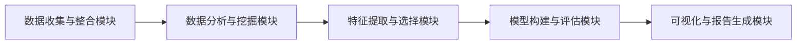

# 智能系统辅助公司护城河评估

> 关键词：智能系统、公司护城河评估、核心竞争力、数据分析、人工智能

> 摘要：本文围绕智能系统辅助公司护城河评估展开探讨。首先介绍了研究的背景、目的、预期读者和文档结构，对相关术语进行了解释。接着阐述了核心概念，包括公司护城河的内涵以及智能系统在评估中的作用，并给出了原理和架构的示意图与流程图。详细讲解了核心算法原理及具体操作步骤，通过 Python 代码进行说明。还介绍了相关数学模型和公式，并举例说明。通过项目实战，展示了开发环境搭建、源代码实现及代码解读。分析了智能系统辅助公司护城河评估的实际应用场景，推荐了学习资源、开发工具框架和相关论文著作。最后总结了未来发展趋势与挑战，提供了常见问题解答和扩展阅读参考资料，旨在为企业利用智能系统准确评估护城河提供全面的技术和理论支持。

## 1. 背景介绍 
### 1.1 目的和范围
在当今竞争激烈的商业环境中，准确评估公司的护城河（即公司抵御竞争对手的能力和可持续竞争优势）对于投资者、管理者和行业分析者都至关重要。传统的公司护城河评估方法往往依赖于人工分析和经验判断，存在主观性强、效率低且难以全面考虑各种复杂因素的问题。本研究的目的是探讨如何利用智能系统辅助进行公司护城河评估，以提高评估的准确性、客观性和效率。

研究范围涵盖了智能系统在公司护城河评估中的应用原理、核心算法、数学模型，以及实际项目中的开发和应用。同时，还将分析智能系统辅助评估在不同行业的应用场景，并推荐相关的学习资源、开发工具和研究论文。

### 1.2 预期读者
本文预期读者包括以下几类人群：
- **投资者**：希望借助智能系统更准确地评估公司的投资价值，识别具有强大护城河的公司，从而做出更明智的投资决策。
- **企业管理者**：利用智能系统评估自身公司的护城河，了解公司的竞争优势和劣势，制定相应的战略来强化护城河，提升公司的市场竞争力。
- **行业分析师**：通过智能系统获取更全面、客观的数据分析结果，撰写更有深度和价值的行业分析报告。
- **技术开发者**：对智能系统在商业评估领域的应用感兴趣，希望了解相关的技术原理、算法和开发实践，以便开发出更高效的智能评估系统。

### 1.3 文档结构概述
本文将按照以下结构展开：
- **核心概念与联系**：介绍公司护城河的核心概念以及智能系统在评估中的作用，给出原理和架构的示意图与流程图。
- **核心算法原理 & 具体操作步骤**：详细讲解用于公司护城河评估的核心算法，并用 Python 代码进行阐述。
- **数学模型和公式 & 详细讲解 & 举例说明**：介绍相关的数学模型和公式，并通过具体例子说明其应用。
- **项目实战：代码实际案例和详细解释说明**：展示一个智能系统辅助公司护城河评估的实际项目，包括开发环境搭建、源代码实现和代码解读。
- **实际应用场景**：分析智能系统辅助公司护城河评估在不同行业的实际应用场景。
- **工具和资源推荐**：推荐相关的学习资源、开发工具框架和研究论文。
- **总结：未来发展趋势与挑战**：总结智能系统辅助公司护城河评估的未来发展趋势和面临的挑战。
- **附录：常见问题与解答**：解答读者在学习和应用过程中可能遇到的常见问题。
- **扩展阅读 & 参考资料**：提供相关的扩展阅读材料和参考资料。

### 1.4 术语表
#### 1.4.1 核心术语定义
- **公司护城河**：指公司拥有的可持续竞争优势，能够使其在长期内抵御竞争对手的侵蚀，保持较高的盈利能力和市场份额。常见的护城河类型包括品牌优势、成本优势、转换成本、网络效应和专利技术等。
- **智能系统**：利用人工智能、机器学习、数据分析等技术构建的系统，能够自动处理和分析大量数据，从中提取有价值的信息，并做出决策或提供建议。
- **护城河评估**：对公司的护城河进行量化或定性的分析和评价，以确定公司护城河的强弱和可持续性。

#### 1.4.2 相关概念解释
- **机器学习**：是人工智能的一个分支，它使计算机能够通过数据学习模式和规律，而无需明确的编程指令。在公司护城河评估中，机器学习算法可以用于分析历史数据，预测公司未来的竞争优势。
- **数据分析**：指对大量数据进行收集、清洗、处理和分析的过程，以发现数据中的模式、趋势和关系。在智能系统辅助公司护城河评估中，数据分析是基础，通过对公司财务数据、市场数据、行业数据等的分析，为评估提供依据。
- **特征工程**：是机器学习中的一个重要步骤，它涉及从原始数据中提取和选择最具代表性和预测性的特征。在公司护城河评估中，特征工程用于选择与公司护城河相关的关键指标，如毛利率、市场份额、研发投入等。

#### 1.4.3 缩略词列表
- **AI**：Artificial Intelligence，人工智能
- **ML**：Machine Learning，机器学习
- **PCA**：Principal Component Analysis，主成分分析
- **LDA**：Linear Discriminant Analysis，线性判别分析

## 2. 核心概念与联系 

### 公司护城河的核心概念
公司护城河是由沃伦·巴菲特提出的一个重要概念，它代表了公司在市场竞争中所拥有的独特优势，能够保护公司的利润和市场地位。以下是几种常见的公司护城河类型：
- **品牌优势**：强大的品牌能够使消费者对公司的产品或服务产生信任和忠诚度，愿意为其支付更高的价格。例如，苹果公司的品牌在全球范围内具有极高的知名度和美誉度，消费者愿意为苹果产品支付较高的溢价。
- **成本优势**：公司通过优化生产流程、降低采购成本、提高运营效率等方式，能够以低于竞争对手的成本生产产品或提供服务。例如，沃尔玛通过高效的供应链管理和大规模采购，实现了较低的成本，从而能够以低价吸引消费者。
- **转换成本**：当消费者从一家公司的产品或服务转换到另一家公司时，需要付出一定的成本，如时间、金钱、精力等。这种转换成本越高，消费者就越不愿意更换供应商，从而为公司提供了护城河。例如，企业使用的办公软件系统，一旦更换会涉及到员工培训、数据迁移等成本，因此企业通常不会轻易更换。
- **网络效应**：当一个产品或服务的价值随着使用该产品或服务的用户数量的增加而增加时，就产生了网络效应。例如，社交网络平台（如 Facebook、微信）的用户越多，其价值就越大，因为用户可以与更多的人进行交流和互动。新进入者很难在短时间内建立起具有足够用户规模的网络，从而为现有平台提供了强大的护城河。
- **专利技术**：公司拥有的专利技术可以阻止竞争对手生产相同或类似的产品，从而为公司提供了一定时期的垄断优势。例如，制药公司研发的新药通常会获得专利保护，在专利有效期内，其他公司不能生产和销售相同的药物。

### 智能系统在公司护城河评估中的作用
智能系统可以通过以下方式辅助公司护城河评估：
- **数据收集与整合**：智能系统可以自动从各种数据源（如财务报表、新闻媒体、行业报告、社交媒体等）收集与公司相关的数据，并将其整合到一个统一的数据库中。这大大提高了数据收集的效率和准确性，避免了人工收集数据时可能出现的错误和遗漏。
- **数据分析与挖掘**：利用机器学习和数据分析技术，智能系统可以对收集到的数据进行深入分析和挖掘，发现数据中的模式、趋势和关系。例如，通过分析公司的财务数据，智能系统可以评估公司的盈利能力、偿债能力和运营效率；通过分析新闻媒体和社交媒体数据，智能系统可以了解市场对公司的评价和关注度。
- **特征提取与选择**：智能系统可以从大量的数据中提取和选择与公司护城河相关的关键特征。例如，通过主成分分析（PCA）或线性判别分析（LDA）等技术，智能系统可以将高维数据降维，提取出最具代表性和预测性的特征，从而减少数据的冗余和噪声，提高评估的准确性。
- **模型构建与评估**：智能系统可以利用机器学习算法构建公司护城河评估模型，并对模型进行评估和优化。常见的机器学习算法包括决策树、随机森林、支持向量机、神经网络等。通过对历史数据的训练和验证，智能系统可以选择最优的模型和参数，提高评估的准确性和可靠性。
- **可视化与报告生成**：智能系统可以将评估结果以直观的可视化方式展示出来，如图表、报表等。同时，智能系统还可以自动生成评估报告，为投资者、管理者和行业分析者提供决策支持。

### 核心概念原理和架构的文本示意图
```plaintext
+---------------------+
| 数据收集与整合模块 |
|                     |
| 从各种数据源收集   |
| 公司相关数据并整合 |
+---------------------+
           |
           v
+---------------------+
| 数据分析与挖掘模块 |
|                     |
| 利用机器学习和数   |
| 据分析技术分析数据 |
+---------------------+
           |
           v
+---------------------+
| 特征提取与选择模块 |
|                     |
| 提取和选择与公司   |
| 护城河相关的关键   |
| 特征                |
+---------------------+
           |
           v
+---------------------+
| 模型构建与评估模块 |
|                     |
| 利用机器学习算法   |
| 构建评估模型并评   |
| 估优化              |
+---------------------+
           |
           v
+---------------------+
| 可视化与报告生成模块|
|                     |
| 将评估结果可视化   |
| 并生成评估报告     |
+---------------------+
```

### Mermaid 流程图


## 3. 核心算法原理 & 具体操作步骤 

### 决策树算法原理
决策树是一种常用的机器学习算法，它通过对数据的属性进行递归划分，构建一个树形结构的分类或回归模型。决策树的每个内部节点代表一个属性上的测试，每个分支代表一个测试输出，每个叶节点代表一个类别或值。

决策树的构建过程可以分为以下几个步骤：
1. **选择最佳划分属性**：在每个节点上，从所有属性中选择一个最佳的属性进行划分，使得划分后的子集尽可能纯净（即同一子集中的样本属于同一类别）。常用的划分标准包括信息增益、信息增益率、基尼指数等。
2. **递归划分数据集**：根据选择的最佳划分属性，将数据集划分为多个子集。对于每个子集，重复步骤 1 和步骤 2，直到满足终止条件（如子集为空、所有样本属于同一类别、达到最大树深度等）。
3. **生成决策树**：当满足终止条件时，将当前节点标记为叶节点，并将该子集中的多数类别作为叶节点的类别。

### Python 代码实现决策树算法进行公司护城河评估
```python
import pandas as pd
from sklearn.model_selection import train_test_split
from sklearn.tree import DecisionTreeClassifier
from sklearn.metrics import accuracy_score

# 加载数据集
data = pd.read_csv('company_moat_data.csv')

# 分离特征和标签
X = data.drop('moat_strength', axis=1)
y = data['moat_strength']

# 划分训练集和测试集
X_train, X_test, y_train, y_test = train_test_split(X, y, test_size=0.2, random_state=42)

# 创建决策树分类器
clf = DecisionTreeClassifier()

# 训练模型
clf.fit(X_train, y_train)

# 预测测试集
y_pred = clf.predict(X_test)

# 计算准确率
accuracy = accuracy_score(y_test, y_pred)
print(f"决策树模型的准确率: {accuracy}")
```

### 具体操作步骤
1. **数据准备**：收集与公司护城河相关的数据，如财务数据、市场数据、行业数据等，并将其整理成 CSV 文件。确保数据集中包含特征列和标签列，标签列表示公司护城河的强度（如强、中、弱）。
2. **数据预处理**：对数据进行清洗、缺失值处理、特征编码等操作，以确保数据的质量和一致性。
3. **划分训练集和测试集**：使用 `train_test_split` 函数将数据集划分为训练集和测试集，通常将 80% 的数据作为训练集，20% 的数据作为测试集。
4. **创建决策树分类器**：使用 `DecisionTreeClassifier` 类创建一个决策树分类器。
5. **训练模型**：使用训练集对决策树分类器进行训练，调用 `fit` 方法。
6. **预测测试集**：使用训练好的模型对测试集进行预测，调用 `predict` 方法。
7. **评估模型**：使用 `accuracy_score` 函数计算模型的准确率，评估模型的性能。

## 4. 数学模型和公式 & 详细讲解 & 举例说明 

### 信息增益公式
信息增益是决策树算法中常用的划分标准之一，它衡量了在使用某个属性进行划分后，数据集的纯度提升程度。信息增益的计算公式如下：
$$
IG(D, A) = Ent(D) - \sum_{v=1}^{V} \frac{|D^v|}{|D|} Ent(D^v)
$$
其中：
- $IG(D, A)$ 表示使用属性 $A$ 对数据集 $D$ 进行划分的信息增益。
- $Ent(D)$ 表示数据集 $D$ 的信息熵，计算公式为：
$$
Ent(D) = -\sum_{k=1}^{K} p_k \log_2 p_k
$$
其中 $p_k$ 表示数据集 $D$ 中第 $k$ 类样本的比例。
- $V$ 表示属性 $A$ 的取值个数。
- $D^v$ 表示属性 $A$ 取值为 $v$ 的样本子集。
- $|D|$ 表示数据集 $D$ 的样本数量。
- $|D^v|$ 表示样本子集 $D^v$ 的样本数量。

### 详细讲解
信息熵是衡量数据集纯度的一个指标，信息熵越大，数据集的纯度越低；信息熵越小，数据集的纯度越高。信息增益表示在使用某个属性进行划分后，数据集的信息熵减少的程度，信息增益越大，说明使用该属性进行划分后，数据集的纯度提升得越多，该属性越适合作为划分属性。

### 举例说明
假设我们有一个数据集 $D$，包含 10 个样本，分为两类（正类和负类），其中正类样本有 6 个，负类样本有 4 个。则数据集 $D$ 的信息熵为：
$$
Ent(D) = -\frac{6}{10} \log_2 \frac{6}{10} - \frac{4}{10} \log_2 \frac{4}{10} \approx 0.971
$$
假设我们有一个属性 $A$，它有两个取值（$A_1$ 和 $A_2$），其中属性 $A$ 取值为 $A_1$ 的样本子集 $D^1$ 包含 4 个样本，其中正类样本有 3 个，负类样本有 1 个；属性 $A$ 取值为 $A_2$ 的样本子集 $D^2$ 包含 6 个样本，其中正类样本有 3 个，负类样本有 3 个。则样本子集 $D^1$ 和 $D^2$ 的信息熵分别为：
$$
Ent(D^1) = -\frac{3}{4} \log_2 \frac{3}{4} - \frac{1}{4} \log_2 \frac{1}{4} \approx 0.811
$$
$$
Ent(D^2) = -\frac{3}{6} \log_2 \frac{3}{6} - \frac{3}{6} \log_2 \frac{3}{6} = 1
$$
使用属性 $A$ 对数据集 $D$ 进行划分的信息增益为：
$$
IG(D, A) = Ent(D) - \frac{|D^1|}{|D|} Ent(D^1) - \frac{|D^2|}{|D|} Ent(D^2)
$$
$$
= 0.971 - \frac{4}{10} \times 0.811 - \frac{6}{10} \times 1 \approx 0.047
$$

## 5. 项目实战：代码实际案例和详细解释说明 

### 5.1  开发环境搭建
#### 安装 Python
首先，需要安装 Python 编程语言。可以从 Python 官方网站（https://www.python.org/downloads/）下载适合自己操作系统的 Python 安装包，并按照安装向导进行安装。建议安装 Python 3.7 及以上版本。

#### 安装必要的库
在安装好 Python 后，需要安装一些必要的库，包括 `pandas`、`numpy`、`scikit-learn`、`matplotlib` 等。可以使用 `pip` 命令进行安装：
```sh
pip install pandas numpy scikit-learn matplotlib
```

#### 准备数据集
收集与公司护城河相关的数据，如财务数据、市场数据、行业数据等，并将其整理成 CSV 文件。确保数据集中包含特征列和标签列，标签列表示公司护城河的强度（如强、中、弱）。

### 5.2  源代码详细实现和代码解读
```python
import pandas as pd
import numpy as np
from sklearn.model_selection import train_test_split
from sklearn.ensemble import RandomForestClassifier
from sklearn.metrics import accuracy_score, classification_report
import matplotlib.pyplot as plt

# 加载数据集
data = pd.read_csv('company_moat_data.csv')

# 分离特征和标签
X = data.drop('moat_strength', axis=1)
y = data['moat_strength']

# 划分训练集和测试集
X_train, X_test, y_train, y_test = train_test_split(X, y, test_size=0.2, random_state=42)

# 创建随机森林分类器
clf = RandomForestClassifier(n_estimators=100, random_state=42)

# 训练模型
clf.fit(X_train, y_train)

# 预测测试集
y_pred = clf.predict(X_test)

# 计算准确率
accuracy = accuracy_score(y_test, y_pred)
print(f"随机森林模型的准确率: {accuracy}")

# 打印分类报告
print("分类报告:")
print(classification_report(y_test, y_pred))

# 特征重要性分析
importances = clf.feature_importances_
feature_names = X.columns
indices = np.argsort(importances)[::-1]

plt.figure(figsize=(10, 6))
plt.title("特征重要性")
plt.bar(range(X_train.shape[1]), importances[indices])
plt.xticks(range(X_train.shape[1]), feature_names[indices], rotation=90)
plt.show()
```

### 5.3  代码解读与分析
1. **数据加载与预处理**：使用 `pandas` 库的 `read_csv` 函数加载数据集，并将特征和标签分离。使用 `train_test_split` 函数将数据集划分为训练集和测试集。
2. **模型创建与训练**：使用 `RandomForestClassifier` 类创建一个随机森林分类器，并使用训练集对其进行训练。
3. **模型预测与评估**：使用训练好的模型对测试集进行预测，并使用 `accuracy_score` 函数计算模型的准确率。使用 `classification_report` 函数打印分类报告，包括精确率、召回率、F1 值等指标。
4. **特征重要性分析**：使用 `feature_importances_` 属性获取每个特征的重要性得分，并使用 `matplotlib` 库绘制特征重要性柱状图，帮助我们了解哪些特征对公司护城河评估的影响最大。

## 6. 实际应用场景 
### 投资者决策
投资者可以利用智能系统辅助公司护城河评估，筛选出具有强大护城河的公司进行投资。通过对公司的财务数据、市场数据、行业数据等进行分析，智能系统可以评估公司的竞争优势和可持续性，为投资者提供更准确的投资建议。例如，投资者可以根据智能系统的评估结果，选择那些具有品牌优势、成本优势或网络效应的公司进行投资，从而降低投资风险，提高投资回报率。

### 企业战略规划
企业管理者可以使用智能系统评估自身公司的护城河，了解公司的竞争优势和劣势，制定相应的战略来强化护城河。例如，如果智能系统评估结果显示公司的品牌优势较弱，企业管理者可以加大品牌建设的投入，提高品牌知名度和美誉度；如果公司的成本优势不明显，企业管理者可以优化生产流程、降低采购成本，提高运营效率。

### 行业分析与研究
行业分析师可以借助智能系统对整个行业的公司护城河进行评估和比较，撰写更有深度和价值的行业分析报告。通过对行业内公司的护城河进行量化分析，行业分析师可以发现行业的竞争格局和发展趋势，为企业和投资者提供决策参考。例如，行业分析师可以分析某个行业内哪些公司的护城河在不断增强，哪些公司的护城河在逐渐削弱，从而为企业制定战略和投资者选择投资标的提供依据。

### 风险管理
金融机构和投资者可以利用智能系统辅助公司护城河评估，进行风险管理。通过对公司的护城河进行评估，金融机构可以判断公司的信用风险和违约概率，从而决定是否给予贷款或投资。例如，如果一家公司的护城河较弱，其面临的市场竞争压力较大，盈利能力和偿债能力可能不稳定，金融机构在给予贷款时可能会更加谨慎。

## 7. 工具和资源推荐
### 7.1 学习资源推荐
#### 7.1.1 书籍推荐
- 《机器学习》（周志华著）：这本书是机器学习领域的经典教材，全面介绍了机器学习的基本概念、算法和应用。
- 《Python 数据分析实战》（韦斯·麦金尼著）：该书详细介绍了使用 Python 进行数据分析的方法和技巧，包括数据处理、数据可视化、机器学习等方面。
- 《巴菲特的护城河》（帕特·多尔西著）：这本书深入阐述了公司护城河的概念和评估方法，结合大量的实际案例，为投资者和企业管理者提供了宝贵的经验和启示。

#### 7.1.2 在线课程
- Coursera 上的“机器学习”课程（由 Andrew Ng 教授授课）：这是一门非常受欢迎的机器学习在线课程，全面介绍了机器学习的基本概念、算法和应用。
- edX 上的“Python 数据科学入门”课程：该课程介绍了使用 Python 进行数据科学的基本方法和技巧，包括数据处理、数据分析、数据可视化等方面。
- 网易云课堂上的“人工智能基础课程”：这门课程涵盖了人工智能的基本概念、算法和应用，适合初学者学习。

#### 7.1.3 技术博客和网站
- Medium：这是一个技术博客平台，上面有很多关于机器学习、数据分析、人工智能等领域的优秀文章。
- Kaggle：这是一个数据科学竞赛平台，上面有很多数据集和优秀的数据分析项目，可以学习到很多实用的数据分析技巧和方法。
- Towards Data Science：这是一个专注于数据科学和机器学习的技术博客，上面有很多高质量的文章和教程。

### 7.2 开发工具框架推荐
#### 7.2.1 IDE和编辑器
- PyCharm：这是一款专门为 Python 开发设计的集成开发环境（IDE），具有强大的代码编辑、调试、自动补全、代码分析等功能。
- Jupyter Notebook：这是一个基于 Web 的交互式计算环境，支持多种编程语言，适合进行数据分析、机器学习等领域的实验和开发。
- Visual Studio Code：这是一款轻量级的代码编辑器，支持多种编程语言，具有丰富的插件生态系统，可以方便地进行 Python 开发。

#### 7.2.2 调试和性能分析工具
- pdb：这是 Python 自带的调试器，可以帮助开发者在代码中设置断点、单步执行代码、查看变量值等。
- cProfile：这是 Python 自带的性能分析工具，可以帮助开发者分析代码的运行时间和内存使用情况，找出代码中的性能瓶颈。
- TensorBoard：这是 TensorFlow 提供的一个可视化工具，可以帮助开发者可视化训练过程、模型结构、指标变化等信息。

#### 7.2.3 相关框架和库
- scikit-learn：这是一个常用的机器学习库，提供了丰富的机器学习算法和工具，包括分类、回归、聚类、降维等方面。
- TensorFlow：这是一个开源的深度学习框架，由 Google 开发，广泛应用于图像识别、自然语言处理、语音识别等领域。
- PyTorch：这是一个开源的深度学习框架，由 Facebook 开发，具有动态图、易于使用等特点，受到了很多研究者和开发者的喜爱。

### 7.3 相关论文著作推荐
#### 7.3.1 经典论文
- 《A Decision-Theoretic Generalization of On-Line Learning and an Application to Boosting》（Yoav Freund 和 Robert E. Schapire 著）：这篇论文提出了 AdaBoost 算法，是机器学习领域的经典论文之一。
- 《ImageNet Classification with Deep Convolutional Neural Networks》（Alex Krizhevsky、Ilya Sutskever 和 Geoffrey E. Hinton 著）：这篇论文提出了 AlexNet 模型，开创了深度学习在图像识别领域的先河。
- 《Attention Is All You Need》（Ashish Vaswani 等著）：这篇论文提出了 Transformer 模型，是自然语言处理领域的重要突破。

#### 7.3.2 最新研究成果
- 关注顶级学术会议（如 NeurIPS、ICML、CVPR、ACL 等）的论文，了解机器学习、深度学习、自然语言处理等领域的最新研究成果。
- 关注知名学术期刊（如 Journal of Machine Learning Research、Artificial Intelligence、IEEE Transactions on Pattern Analysis and Machine Intelligence 等）的论文，获取高质量的研究成果。

#### 7.3.3 应用案例分析
- 《Machine Learning for Business: What You Need to Know to Save Time, Money, and Increase Performance》（Tom Fawcett 著）：这本书介绍了机器学习在商业领域的应用案例，包括客户细分、预测分析、风险评估等方面。
- 《AI in Practice: How 50 Successful Companies Used Artificial Intelligence to Solve Problems》（Thomas H. Davenport 和 Rajeev Ronanki 著）：这本书介绍了 50 家成功应用人工智能解决实际问题的公司案例，包括医疗、金融、零售等行业。

## 8. 总结：未来发展趋势与挑战
### 未来发展趋势
- **多模态数据融合**：未来的智能系统将不仅依赖于财务数据和市场数据，还将融合文本数据、图像数据、音频数据等多模态数据，以更全面地评估公司的护城河。例如，通过分析新闻媒体的文本报道、公司的产品图片和宣传视频等，获取更多关于公司品牌形象、市场声誉和产品创新的信息。
- **深度学习的广泛应用**：深度学习技术在图像识别、自然语言处理等领域取得了巨大的成功，未来将在公司护城河评估中得到更广泛的应用。例如，使用深度学习模型对公司的财务报表进行分析，自动提取关键信息，提高评估的准确性和效率。
- **实时评估与动态监测**：随着数据的实时更新和计算能力的提升，智能系统将能够实现对公司护城河的实时评估和动态监测。企业管理者和投资者可以及时了解公司护城河的变化情况，做出相应的决策。
- **与区块链技术结合**：区块链技术具有去中心化、不可篡改、可追溯等特点，将智能系统与区块链技术结合，可以提高数据的安全性和可信度，为公司护城河评估提供更可靠的基础。例如，将公司的财务数据和交易记录存储在区块链上，确保数据的真实性和完整性。

### 挑战
- **数据质量和隐私问题**：智能系统的性能高度依赖于数据的质量和数量。然而，在实际应用中，数据可能存在缺失、错误、不一致等问题，影响评估的准确性。此外，数据隐私问题也是一个重要的挑战，如何在保护用户隐私的前提下，合理利用数据进行评估是需要解决的问题。
- **模型解释性和可解释性**：深度学习模型通常是黑盒模型，其决策过程难以解释。在公司护城河评估中，投资者和企业管理者需要了解模型的决策依据，以便做出合理的决策。因此，如何提高模型的解释性和可解释性是一个重要的研究方向。
- **行业差异和个性化需求**：不同行业的公司护城河的构成和评估方法可能存在差异，需要根据行业特点进行个性化的分析和评估。此外，不同投资者和企业管理者的需求也可能不同，如何满足个性化的需求是智能系统面临的挑战之一。
- **技术更新换代快**：人工智能和机器学习技术发展迅速，新的算法和模型不断涌现。智能系统需要不断更新和升级，以跟上技术的发展步伐，提高评估的准确性和效率。

## 9. 附录：常见问题与解答
### 问题 1：智能系统评估公司护城河的准确性如何保证？
解答：为了保证智能系统评估公司护城河的准确性，可以从以下几个方面入手：
- **数据质量**：确保收集到的数据准确、完整、一致，对数据进行清洗和预处理，去除噪声和异常值。
- **特征选择**：选择与公司护城河相关的关键特征，避免使用无关或冗余的特征，提高模型的泛化能力。
- **模型选择和调优**：选择合适的机器学习算法和模型，并对模型进行调优，如调整模型的参数、选择最优的超参数等。
- **交叉验证和评估**：使用交叉验证方法对模型进行评估，确保模型在不同数据集上的性能稳定。同时，使用多种评估指标（如准确率、精确率、召回率、F1 值等）对模型进行综合评估。

### 问题 2：智能系统可以替代人工进行公司护城河评估吗？
解答：智能系统可以辅助人工进行公司护城河评估，但不能完全替代人工。虽然智能系统可以处理大量的数据，发现数据中的模式和规律，提高评估的效率和准确性，但它缺乏人类的判断力、经验和洞察力。在实际应用中，需要将智能系统的评估结果与人工分析相结合，综合考虑各种因素，做出更合理的决策。

### 问题 3：如何选择适合的机器学习算法进行公司护城河评估？
解答：选择适合的机器学习算法进行公司护城河评估需要考虑以下几个因素：
- **数据类型和规模**：如果数据是结构化的，且规模较小，可以选择决策树、随机森林等算法；如果数据是非结构化的，且规模较大，可以选择深度学习算法。
- **问题类型**：如果是分类问题，可以选择分类算法（如决策树、支持向量机、神经网络等）；如果是回归问题，可以选择回归算法（如线性回归、岭回归、随机森林回归等）。
- **模型解释性**：如果需要模型具有较好的解释性，可以选择决策树、线性回归等算法；如果对模型解释性要求不高，可以选择深度学习算法。
- **计算资源和时间成本**：不同的机器学习算法对计算资源和时间成本的要求不同，需要根据实际情况选择合适的算法。

### 问题 4：智能系统评估公司护城河需要哪些数据？
解答：智能系统评估公司护城河需要收集以下几类数据：
- **财务数据**：包括公司的营业收入、净利润、毛利率、净利率、资产负债率、现金流等指标，反映公司的盈利能力、偿债能力和运营效率。
- **市场数据**：包括公司的市场份额、股价、市盈率、市净率等指标，反映公司在市场中的地位和估值水平。
- **行业数据**：包括行业的增长率、竞争格局、政策环境等信息，反映公司所处行业的发展趋势和竞争状况。
- **文本数据**：包括新闻媒体的报道、公司的公告、分析师的报告等，反映市场对公司的评价和关注度。
- **其他数据**：根据具体情况，还可以收集公司的专利数据、客户数据、供应商数据等，以更全面地评估公司的护城河。

## 10. 扩展阅读 & 参考资料
### 扩展阅读
- 《人工智能时代的竞争战略》：这本书探讨了人工智能技术对企业竞争战略的影响，以及企业如何在人工智能时代制定和实施有效的竞争战略。
- 《数据驱动的企业决策》：该书介绍了如何利用数据分析和人工智能技术进行企业决策，提高决策的科学性和准确性。
- 《智能商业》：这本书分析了智能商业的发展趋势和商业模式，探讨了企业如何利用智能技术实现转型升级。

### 参考资料
- 相关学术论文：在学术数据库（如 IEEE Xplore、ACM Digital Library、ScienceDirect 等）中搜索关于公司护城河评估、智能系统应用、机器学习算法等方面的学术论文。
- 行业报告：查阅知名咨询公司（如麦肯锡、波士顿咨询、贝恩咨询等）发布的关于行业发展趋势、企业竞争力分析等方面的行业报告。
- 官方文档：查阅 Python 库（如 pandas、numpy、scikit-learn、TensorFlow、PyTorch 等）的官方文档，了解其使用方法和功能。

作者：AI天才研究院/AI Genius Institute & 禅与计算机程序设计艺术 /Zen And The Art of Computer Programming