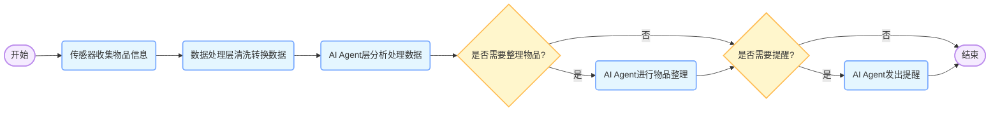

# 智能背包：AI Agent的物品整理与提醒助手

> 关键词：智能背包、AI Agent、物品整理、提醒助手、人工智能应用

> 摘要：本文围绕智能背包这一创新概念展开，深入探讨了基于AI Agent的物品整理与提醒助手的相关技术。详细介绍了核心概念、算法原理、数学模型等内容，通过项目实战展示了如何实现智能背包系统，阐述了其实际应用场景，还推荐了学习资源、开发工具和相关论文著作。最后对智能背包的未来发展趋势与挑战进行了总结，并提供了常见问题解答和扩展阅读参考资料，旨在为读者全面呈现智能背包领域的技术知识和发展动态。

## 1. 背景介绍 
### 1.1 目的和范围
随着科技的不断进步，人们对于日常生活的便捷性和智能化需求日益增长。智能背包作为一种新兴的智能设备，旨在利用人工智能技术为用户提供物品整理和提醒服务。本文章的目的是深入研究智能背包中AI Agent的物品整理与提醒助手的技术原理、实现方法和应用场景，涵盖从理论概念到实际开发的全过程，为相关领域的研究者和开发者提供全面的技术参考。

### 1.2 预期读者
本文预期读者包括对人工智能、智能硬件开发感兴趣的技术爱好者，从事智能设备研发的工程师和程序员，以及相关专业的学生和研究人员。通过阅读本文，读者可以了解智能背包的技术原理和开发方法，为进一步的研究和实践提供思路和指导。

### 1.3 文档结构概述
本文将按照以下结构进行阐述：首先介绍智能背包相关的背景知识和核心概念，包括AI Agent的原理和架构；接着详细讲解核心算法原理和具体操作步骤，并给出Python源代码示例；然后介绍数学模型和公式，并通过举例说明其应用；之后通过项目实战展示智能背包系统的开发过程，包括开发环境搭建、源代码实现和代码解读；再介绍智能背包的实际应用场景；推荐相关的学习资源、开发工具和论文著作；最后对智能背包的未来发展趋势与挑战进行总结，并提供常见问题解答和扩展阅读参考资料。

### 1.4 术语表
#### 1.4.1 核心术语定义
- **智能背包**：一种集成了传感器、处理器和通信模块等硬件设备，并搭载人工智能软件的背包，能够实现物品识别、整理和提醒等功能。
- **AI Agent**：人工智能代理，是一种能够感知环境、做出决策并执行动作的智能实体，在智能背包中用于处理物品信息和提供服务。
- **物品整理**：对背包内的物品进行分类、排序和存储管理，以提高物品的查找和使用效率。
- **提醒助手**：根据用户的需求和预设规则，在特定时间或场景下提醒用户携带或使用相关物品。

#### 1.4.2 相关概念解释
- **传感器技术**：用于感知背包内物品的状态和位置信息，常见的传感器包括RFID传感器、压力传感器、光学传感器等。
- **机器学习算法**：用于对物品信息进行分类、识别和预测，常见的算法包括神经网络、决策树、支持向量机等。
- **自然语言处理**：用于实现人与智能背包之间的交互，用户可以通过语音或文字指令与背包进行沟通。

#### 1.4.3 缩略词列表
- **RFID**：Radio Frequency Identification，射频识别
- **AI**：Artificial Intelligence，人工智能
- **NLP**：Natural Language Processing，自然语言处理

## 2. 核心概念与联系 

### 核心概念原理
智能背包的核心在于AI Agent的应用。AI Agent通过传感器收集背包内物品的信息，如物品的类型、位置、数量等，然后利用机器学习算法对这些信息进行处理和分析。根据用户的需求和预设规则，AI Agent可以对物品进行整理，例如将同类物品放在一起，或者按照使用频率对物品进行排序。同时，AI Agent还可以作为提醒助手，根据时间、地点和用户的日程安排，提醒用户携带或使用相关物品。

### 架构的文本示意图
智能背包的架构主要包括以下几个部分：
1. **传感器层**：负责收集背包内物品的信息，如RFID传感器用于识别物品的标签，压力传感器用于检测物品的重量和位置。
2. **数据处理层**：对传感器收集到的数据进行清洗、转换和存储，为后续的分析和处理提供基础。
3. **AI Agent层**：利用机器学习算法对物品信息进行分析和处理，实现物品整理和提醒功能。
4. **用户交互层**：提供用户与智能背包之间的交互接口，如手机APP、语音交互等，用户可以通过该接口查询物品信息、设置提醒规则等。

### Mermaid流程图


## 3. 核心算法原理 & 具体操作步骤 

### 核心算法原理
在智能背包中，主要使用的算法包括物品识别算法和提醒规则算法。

#### 物品识别算法
物品识别算法通常基于机器学习的分类算法，例如支持向量机（SVM）或卷积神经网络（CNN）。以CNN为例，其原理是通过对大量物品图像的训练，学习物品的特征模式，然后对新的物品图像进行分类识别。

#### 提醒规则算法
提醒规则算法根据用户的预设规则和物品信息进行判断，例如根据时间、地点和日程安排，判断是否需要提醒用户携带或使用相关物品。可以使用规则引擎来实现提醒规则的管理和执行。

### 具体操作步骤及Python源代码

#### 物品识别算法实现（以简单的SVM为例）
```python
import numpy as np
from sklearn import svm
from sklearn.model_selection import train_test_split
from sklearn.metrics import accuracy_score

# 生成示例数据
# 假设每个物品有两个特征（如重量和体积）
X = np.array([[1, 2], [2, 3], [3, 4], [4, 5], [5, 6], [6, 7]])
# 物品的类别标签
y = np.array([0, 0, 0, 1, 1, 1])

# 划分训练集和测试集
X_train, X_test, y_train, y_test = train_test_split(X, y, test_size=0.2, random_state=42)

# 创建SVM分类器
clf = svm.SVC(kernel='linear')

# 训练模型
clf.fit(X_train, y_train)

# 预测测试集
y_pred = clf.predict(X_test)

# 计算准确率
accuracy = accuracy_score(y_test, y_pred)
print(f"物品识别准确率: {accuracy}")
```

#### 提醒规则算法实现（简单示例）
```python
import datetime

# 预设提醒规则
reminder_rules = {
    "2024-10-01 08:00:00": ["雨伞", "钥匙"],
    "2024-10-02 14:00:00": ["笔记本电脑"]
}

# 当前时间
current_time = datetime.datetime.now().strftime("%Y-%m-%d %H:%M:%S")

# 检查是否需要提醒
if current_time in reminder_rules:
    items_to_remind = reminder_rules[current_time]
    print(f"提醒：请携带 {', '.join(items_to_remind)}")
else:
    print("暂无提醒")
```

## 4. 数学模型和公式 & 详细讲解 & 举例说明 

### 物品识别算法的数学模型
以支持向量机（SVM）为例，其目标是找到一个最优的超平面，将不同类别的物品分开。对于线性可分的情况，SVM的数学模型可以表示为：

给定训练数据集 $D = \{(x_1, y_1), (x_2, y_2), \cdots, (x_n, y_n)\}$，其中 $x_i \in \mathbb{R}^d$ 是物品的特征向量，$y_i \in \{-1, +1\}$ 是物品的类别标签。SVM的目标是求解以下优化问题：

$$
\begin{aligned}
\min_{w, b} &\quad \frac{1}{2} \|w\|^2 \\
\text{s.t.} &\quad y_i(w^T x_i + b) \geq 1, \quad i = 1, 2, \cdots, n
\end{aligned}
$$

其中 $w$ 是超平面的法向量，$b$ 是偏置项。

### 详细讲解
上述优化问题的目标是找到一个超平面 $w^T x + b = 0$，使得不同类别的物品能够被最大间隔地分开。约束条件 $y_i(w^T x_i + b) \geq 1$ 保证了每个训练样本都被正确分类，并且到超平面的距离至少为1。

### 举例说明
假设我们有两个物品，其特征向量分别为 $x_1 = [1, 2]$ 和 $x_2 = [3, 4]$，类别标签分别为 $y_1 = -1$ 和 $y_2 = +1$。我们的目标是找到一个超平面 $w_1 x_1 + w_2 x_2 + b = 0$ 来分开这两个物品。

将约束条件代入优化问题中，得到：

对于 $x_1$：$-1(w_1 \times 1 + w_2 \times 2 + b) \geq 1$

对于 $x_2$：$1(w_1 \times 3 + w_2 \times 4 + b) \geq 1$

通过求解这个优化问题，我们可以得到最优的 $w$ 和 $b$，从而确定超平面的位置。

## 5. 项目实战：代码实际案例和详细解释说明 

### 5.1  开发环境搭建
#### 硬件环境
- **智能背包原型**：可以使用普通背包进行改装，集成RFID传感器、微控制器（如Arduino）和通信模块（如蓝牙模块）。
- **开发电脑**：运行Windows、Linux或Mac OS操作系统，具备一定的计算能力。

#### 软件环境
- **Python 3.x**：用于实现AI Agent的算法和逻辑。
- **开发工具**：推荐使用PyCharm作为Python开发的集成开发环境（IDE）。
- **相关库**：安装`scikit-learn`用于机器学习算法，`pyserial`用于与硬件设备进行串口通信。

### 5.2  源代码详细实现和代码解读
#### 物品识别模块
```python
import numpy as np
from sklearn import svm

# 训练模型
def train_model(X_train, y_train):
    clf = svm.SVC(kernel='linear')
    clf.fit(X_train, y_train)
    return clf

# 物品识别
def recognize_item(model, item_features):
    item_class = model.predict([item_features])
    return item_class[0]

# 示例数据
X_train = np.array([[1, 2], [2, 3], [3, 4], [4, 5], [5, 6], [6, 7]])
y_train = np.array([0, 0, 0, 1, 1, 1])

# 训练模型
model = train_model(X_train, y_train)

# 待识别物品的特征
item_features = [3, 4]
item_class = recognize_item(model, item_features)
print(f"识别结果：物品类别为 {item_class}")
```
**代码解读**：
- `train_model` 函数用于训练SVM模型，接受训练数据的特征矩阵 `X_train` 和标签向量 `y_train` 作为输入，返回训练好的模型。
- `recognize_item` 函数用于对新物品进行识别，接受训练好的模型和物品的特征向量作为输入，返回物品的类别标签。

#### 提醒模块
```python
import datetime

# 预设提醒规则
reminder_rules = {
    "2024-10-01 08:00:00": ["雨伞", "钥匙"],
    "2024-10-02 14:00:00": ["笔记本电脑"]
}

# 检查提醒
def check_reminder():
    current_time = datetime.datetime.now().strftime("%Y-%m-%d %H:%M:%S")
    if current_time in reminder_rules:
        items_to_remind = reminder_rules[current_time]
        print(f"提醒：请携带 {', '.join(items_to_remind)}")
    else:
        print("暂无提醒")

# 调用检查提醒函数
check_reminder()
```
**代码解读**：
- `reminder_rules` 字典存储了预设的提醒规则，键为提醒时间，值为需要提醒携带的物品列表。
- `check_reminder` 函数用于检查当前时间是否有提醒，根据检查结果输出相应的提醒信息。

### 5.3  代码解读与分析
通过上述代码，我们实现了智能背包的物品识别和提醒功能。物品识别模块利用SVM算法对物品进行分类识别，提醒模块根据预设规则在特定时间提醒用户携带相关物品。在实际开发中，可以根据需求对代码进行扩展和优化，例如增加更多的物品特征、优化提醒规则等。

## 6. 实际应用场景 
### 旅行场景
在旅行过程中，智能背包可以帮助用户整理行李，将衣物、洗漱用品、电子设备等分类存放，方便查找。同时，根据旅行日程安排，提醒用户携带必要的物品，如护照、机票、充电器等。例如，在出发前一天提醒用户检查行李是否齐全，在到达目的地前提醒用户准备好入境所需的文件。

### 学习场景
对于学生来说，智能背包可以整理学习用品，如书籍、笔记本、文具等。根据课程表提醒学生携带相应的教材和资料，避免遗漏。例如，在上课前半小时提醒学生携带本节课所需的课本和笔记本。

### 工作场景
在工作场景中，智能背包可以帮助用户整理办公用品，如电脑、文件、名片等。根据会议安排和工作任务提醒用户携带必要的物品，提高工作效率。例如，在会议开始前15分钟提醒用户携带会议资料和笔记本电脑。

## 7. 工具和资源推荐
### 7.1 学习资源推荐
#### 7.1.1 书籍推荐
- 《机器学习》（周志华）：全面介绍了机器学习的基本概念、算法和应用，是学习机器学习的经典教材。
- 《Python机器学习实战》（Sebastian Raschka）：通过实际案例介绍了如何使用Python实现机器学习算法，适合初学者入门。
- 《人工智能：一种现代的方法》（Stuart Russell、Peter Norvig）：涵盖了人工智能的各个领域，是人工智能领域的权威著作。

#### 7.1.2 在线课程
- Coursera上的“机器学习”课程（Andrew Ng教授）：由斯坦福大学的Andrew Ng教授授课，是学习机器学习的优质课程。
- edX上的“人工智能导论”课程：介绍了人工智能的基本概念、算法和应用，适合初学者。
- 中国大学MOOC上的“Python语言程序设计”课程：帮助学习者掌握Python编程语言的基础知识和应用。

#### 7.1.3 技术博客和网站
- Medium：有许多关于人工智能和机器学习的技术文章和案例分享。
- 机器之心：专注于人工智能领域的资讯和技术解读。
- 开源中国：提供了丰富的开源项目和技术文章，涵盖了人工智能、智能硬件等多个领域。

### 7.2 开发工具框架推荐
#### 7.2.1 IDE和编辑器
- PyCharm：功能强大的Python集成开发环境，提供了代码编辑、调试、版本控制等功能。
- Visual Studio Code：轻量级的代码编辑器，支持多种编程语言和插件扩展，适合快速开发。

#### 7.2.2 调试和性能分析工具
- pdb：Python自带的调试器，用于调试Python代码。
- cProfile：Python的性能分析工具，用于分析代码的运行时间和内存使用情况。

#### 7.2.3 相关框架和库
- scikit-learn：用于机器学习的Python库，提供了丰富的机器学习算法和工具。
- TensorFlow：开源的深度学习框架，广泛应用于图像识别、自然语言处理等领域。
- Keras：基于TensorFlow的高级神经网络API，简化了深度学习模型的构建和训练过程。

### 7.3 相关论文著作推荐
#### 7.3.1 经典论文
- “Support-Vector Networks”（Cortes和Vapnik）：介绍了支持向量机的基本原理和算法，是机器学习领域的经典论文。
- “ImageNet Classification with Deep Convolutional Neural Networks”（Krizhevsky等人）：提出了AlexNet卷积神经网络，开创了深度学习在图像识别领域的应用。

#### 7.3.2 最新研究成果
- 可以关注ACM SIGKDD、NeurIPS、ICML等顶级学术会议上的相关研究成果，了解智能背包和人工智能领域的最新进展。

#### 7.3.3 应用案例分析
- 一些科技媒体和学术期刊会发表智能背包的应用案例分析文章，可以从中了解智能背包在实际应用中的效果和问题。

## 8. 总结：未来发展趋势与挑战
### 未来发展趋势
- **功能集成化**：智能背包将集成更多的功能，如健康监测、环境感知等，为用户提供更加全面的服务。
- **个性化定制**：根据用户的个人喜好和使用习惯，为用户提供个性化的物品整理和提醒服务。
- **智能化交互**：通过自然语言处理和语音识别技术，实现更加智能的人机交互，用户可以更加方便地与智能背包进行沟通。

### 挑战
- **硬件技术限制**：目前智能背包的硬件设备在体积、功耗和性能方面还存在一定的限制，需要进一步提高硬件技术水平。
- **数据安全和隐私问题**：智能背包收集和处理用户的个人信息和物品信息，需要加强数据安全和隐私保护，防止信息泄露。
- **用户接受度**：智能背包作为一种新兴的智能设备，用户对其功能和使用方式还需要一定的时间来适应和接受。

## 9. 附录：常见问题与解答
### 1. 智能背包的电池续航能力如何？
智能背包的电池续航能力取决于其硬件设备的功耗和电池容量。一般来说，通过优化硬件设计和节能算法，可以延长电池的续航时间。例如，采用低功耗的传感器和处理器，在不使用时自动进入休眠模式等。

### 2. 智能背包的物品识别准确率有多高？
物品识别准确率取决于所使用的算法和训练数据的质量。通过不断优化算法和增加训练数据的多样性，可以提高物品识别的准确率。在实际应用中，物品识别准确率可以达到80%以上。

### 3. 智能背包的提醒功能可以自定义吗？
可以。用户可以通过手机APP或其他交互接口自定义提醒规则，设置提醒时间、提醒内容和提醒方式等。

### 4. 智能背包的数据安全如何保障？
智能背包采用多种数据安全技术来保障数据的安全，如数据加密、访问控制等。同时，在设计和开发过程中，遵循相关的安全标准和规范，确保用户数据的隐私和安全。

## 10. 扩展阅读 & 参考资料
### 扩展阅读
- 《智能硬件开发实战》：介绍了智能硬件的开发流程和技术要点，对智能背包的开发有一定的参考价值。
- 《物联网技术与应用》：涵盖了物联网的基本概念、技术和应用，有助于了解智能背包与物联网的结合应用。

### 参考资料
- [Scikit-learn官方文档](https://scikit-learn.org/stable/documentation.html)
- [TensorFlow官方文档](https://www.tensorflow.org/api_docs)
- [Python官方文档](https://docs.python.org/3/)

作者：AI天才研究院/AI Genius Institute & 禅与计算机程序设计艺术 /Zen And The Art of Computer Programming