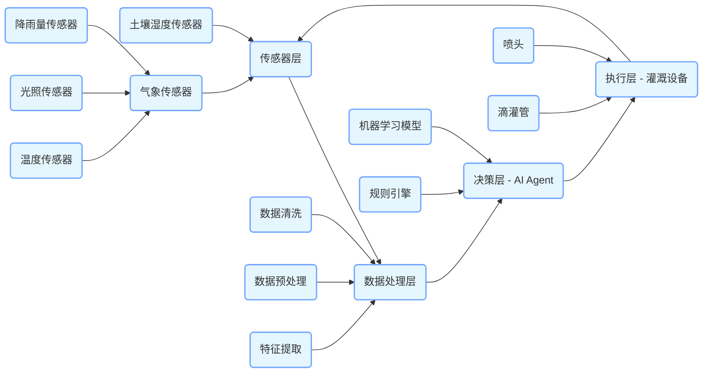

# 智能花园灌溉系统：AI Agent的精准浇水控制

> 关键词：智能花园灌溉系统、AI Agent、精准浇水控制、传感器技术、机器学习

> 摘要：本文聚焦于智能花园灌溉系统中AI Agent的精准浇水控制技术。详细阐述了智能花园灌溉系统的背景知识，包括其目的、预期读者和文档结构等。深入讲解了核心概念、算法原理、数学模型，通过Python代码进行了算法实现和解释。同时给出了项目实战案例，涵盖开发环境搭建、源代码实现与解读。分析了该系统的实际应用场景，推荐了相关的学习资源、开发工具框架以及论文著作。最后总结了其未来发展趋势与挑战，并提供了常见问题解答和扩展阅读参考资料，旨在为读者全面呈现智能花园灌溉系统利用AI Agent实现精准浇水控制的技术全貌。

## 1. 背景介绍 
### 1.1 目的和范围
随着水资源的日益紧张和人们对花园管理便捷性、高效性的需求不断提高，智能花园灌溉系统应运而生。本系统的主要目的是利用先进的AI Agent技术实现花园灌溉的精准控制，避免传统灌溉方式中存在的水资源浪费和灌溉不足等问题。其范围涵盖了从传感器数据采集、AI Agent决策到灌溉设备控制的整个流程，旨在为不同规模和类型的花园提供个性化、智能化的灌溉解决方案。

### 1.2 预期读者
本文的预期读者包括对智能花园灌溉系统感兴趣的技术爱好者、从事农业自动化和智能家居领域的工程师、相关专业的学生以及希望提升花园管理水平的园艺工作者和普通花园业主。通过阅读本文，读者可以深入了解智能花园灌溉系统中AI Agent精准浇水控制的原理、技术实现和实际应用。

### 1.3 文档结构概述
本文将按照以下结构展开：首先介绍智能花园灌溉系统的背景知识，包括目的、预期读者和文档结构等；接着详细阐述核心概念与联系，通过文本示意图和Mermaid流程图展示系统架构；然后讲解核心算法原理和具体操作步骤，并用Python代码进行详细阐述；之后介绍数学模型和公式，并通过举例说明；再通过项目实战给出代码实际案例和详细解释；分析该系统的实际应用场景；推荐相关的工具和资源；总结未来发展趋势与挑战；提供常见问题解答和扩展阅读参考资料。

### 1.4 术语表
#### 1.4.1 核心术语定义
- **智能花园灌溉系统**：一种集成了传感器技术、AI Agent决策和灌溉设备控制的自动化系统，旨在根据花园的实际需求精准地进行浇水操作。
- **AI Agent**：具有自主决策能力的人工智能实体，能够根据传感器采集的数据和预设的规则，对花园灌溉进行智能控制。
- **精准浇水控制**：根据花园中土壤湿度、气象条件等多种因素，精确地确定浇水的时间、水量和区域，以实现水资源的高效利用和植物的健康生长。

#### 1.4.2 相关概念解释
- **传感器技术**：用于采集花园环境数据的技术，包括土壤湿度传感器、气象传感器等，为AI Agent的决策提供数据支持。
- **机器学习**：AI Agent中常用的技术，通过对大量历史数据的学习，建立模型来预测花园的灌溉需求，提高浇水控制的准确性。

#### 1.4.3 缩略词列表
- **AI**：Artificial Intelligence，人工智能
- **IoT**：Internet of Things，物联网

## 2. 核心概念与联系 

### 核心概念原理
智能花园灌溉系统的核心是AI Agent的精准浇水控制。该系统主要由传感器层、数据处理层、决策层和执行层组成。传感器层负责采集花园的环境数据，如土壤湿度、温度、光照强度、降雨量等；数据处理层对传感器采集的数据进行清洗、预处理和特征提取；决策层利用AI Agent根据处理后的数据进行分析和决策，确定是否需要浇水、浇水的时间和水量；执行层根据决策层的指令控制灌溉设备进行浇水操作。

### 架构的文本示意图
```plaintext
智能花园灌溉系统
|-- 传感器层
|   |-- 土壤湿度传感器
|   |-- 气象传感器
|   |   |-- 温度传感器
|   |   |-- 光照传感器
|   |   |-- 降雨量传感器
|-- 数据处理层
|   |-- 数据清洗
|   |-- 数据预处理
|   |-- 特征提取
|-- 决策层
|   |-- AI Agent
|       |-- 机器学习模型
|       |-- 规则引擎
|-- 执行层
|   |-- 灌溉设备
|       |-- 喷头
|       |-- 滴灌管
```

### Mermaid流程图


## 3. 核心算法原理 & 具体操作步骤 

### 算法原理
本系统中AI Agent的核心算法采用机器学习中的决策树算法。决策树是一种基于树结构进行决策的算法，它通过对历史数据的学习，构建一棵决策树模型，根据输入的特征（如土壤湿度、温度等）进行决策。在智能花园灌溉系统中，决策树模型可以根据传感器采集的数据判断是否需要浇水以及浇水的水量。

### Python源代码实现
```python
import pandas as pd
from sklearn.tree import DecisionTreeClassifier
from sklearn.model_selection import train_test_split
from sklearn.metrics import accuracy_score

# 加载历史数据
data = pd.read_csv('garden_irrigation_data.csv')

# 提取特征和标签
X = data.drop('need_watering', axis=1)
y = data['need_watering']

# 划分训练集和测试集
X_train, X_test, y_train, y_test = train_test_split(X, y, test_size=0.2, random_state=42)

# 创建决策树模型
model = DecisionTreeClassifier()

# 训练模型
model.fit(X_train, y_train)

# 预测
y_pred = model.predict(X_test)

# 评估模型
accuracy = accuracy_score(y_test, y_pred)
print(f"模型准确率: {accuracy}")

# 模拟新数据进行预测
new_data = pd.DataFrame({
    'soil_moisture': [20],
    'temperature': [25],
    'light_intensity': [500],
    'rainfall': [0]
})

prediction = model.predict(new_data)
if prediction[0] == 1:
    print("需要浇水")
else:
    print("不需要浇水")
```

### 具体操作步骤
1. **数据收集**：使用传感器采集花园的环境数据，包括土壤湿度、温度、光照强度、降雨量等，并将数据存储在数据库中。
2. **数据预处理**：对采集到的数据进行清洗、去除异常值、归一化等操作，以提高数据的质量和可用性。
3. **模型训练**：使用历史数据训练决策树模型，将数据集划分为训练集和测试集，通过训练集训练模型，使用测试集评估模型的性能。
4. **实时预测**：在实际应用中，传感器实时采集花园的环境数据，将数据输入到训练好的模型中进行预测，根据预测结果控制灌溉设备进行浇水操作。
5. **模型更新**：定期收集新的数据，对模型进行更新和优化，以适应花园环境的变化。

## 4. 数学模型和公式 & 详细讲解 & 举例说明 

### 决策树算法的数学模型
决策树算法的核心是通过递归地划分数据集来构建决策树。在每个节点上，选择一个最优的特征进行划分，使得划分后的子集具有最小的不纯度。常用的不纯度度量方法有信息熵和基尼指数。

#### 信息熵
信息熵是衡量数据集纯度的一种指标，其计算公式为：
$$H(S) = -\sum_{i=1}^{n}p_i\log_2(p_i)$$
其中，$S$ 表示数据集，$p_i$ 表示数据集中第 $i$ 类样本的比例，$n$ 表示类别数。

#### 信息增益
信息增益是衡量特征划分数据集能力的指标，其计算公式为：
$$IG(S, A) = H(S) - \sum_{v\in Values(A)}\frac{|S_v|}{|S|}H(S_v)$$
其中，$S$ 表示数据集，$A$ 表示特征，$Values(A)$ 表示特征 $A$ 的取值集合，$S_v$ 表示特征 $A$ 取值为 $v$ 的子集。

#### 基尼指数
基尼指数也是衡量数据集纯度的一种指标，其计算公式为：
$$Gini(S) = 1 - \sum_{i=1}^{n}p_i^2$$

### 详细讲解
在决策树的构建过程中，选择信息增益最大或基尼指数最小的特征进行划分。具体步骤如下：
1. 计算数据集的初始不纯度（信息熵或基尼指数）。
2. 对于每个特征，计算其划分后的不纯度。
3. 计算每个特征的信息增益或基尼指数的减少量。
4. 选择信息增益最大或基尼指数减少量最大的特征进行划分。
5. 递归地对划分后的子集进行上述步骤，直到满足停止条件（如子集的样本数小于某个阈值或所有样本属于同一类别）。

### 举例说明
假设有一个简单的花园灌溉数据集，包含两个特征：土壤湿度（高、低）和温度（高、低），以及一个标签：是否需要浇水（是、否）。数据集如下：
| 土壤湿度 | 温度 | 是否需要浇水 |
| ---- | ---- | ---- |
| 高 | 高 | 否 |
| 高 | 低 | 否 |
| 低 | 高 | 是 |
| 低 | 低 | 是 |

首先，计算数据集的初始信息熵：
$$H(S) = -\frac{2}{4}\log_2(\frac{2}{4}) - \frac{2}{4}\log_2(\frac{2}{4}) = 1$$

然后，分别计算土壤湿度和温度特征的信息增益：
- 对于土壤湿度特征：
  - 当土壤湿度为高时，子集 $S_1$ 包含两个样本（否、否），信息熵 $H(S_1) = 0$。
  - 当土壤湿度为低时，子集 $S_2$ 包含两个样本（是、是），信息熵 $H(S_2) = 0$。
  - 信息增益 $IG(S, 土壤湿度) = 1 - (\frac{2}{4} \times 0 + \frac{2}{4} \times 0) = 1$

- 对于温度特征：
  - 当温度为高时，子集 $S_3$ 包含两个样本（否、是），信息熵 $H(S_3) = -\frac{1}{2}\log_2(\frac{1}{2}) - \frac{1}{2}\log_2(\frac{1}{2}) = 1$。
  - 当温度为低时，子集 $S_4$ 包含两个样本（否、是），信息熵 $H(S_4) = 1$。
  - 信息增益 $IG(S, 温度) = 1 - (\frac{2}{4} \times 1 + \frac{2}{4} \times 1) = 0$

由于土壤湿度特征的信息增益最大，因此选择土壤湿度作为根节点进行划分。划分后的决策树如下：
```plaintext
土壤湿度
|-- 高
|   |-- 不需要浇水
|-- 低
|   |-- 需要浇水
```

## 5. 项目实战：代码实际案例和详细解释说明 

### 5.1  开发环境搭建
#### 硬件环境
- **传感器**：选择合适的土壤湿度传感器、气象传感器（包括温度传感器、光照传感器、降雨量传感器），将其安装在花园的不同位置，确保能够准确采集花园的环境数据。
- **控制器**：使用单片机（如Arduino、Raspberry Pi）作为控制器，负责与传感器和灌溉设备进行通信，并运行AI Agent的决策程序。
- **灌溉设备**：选择合适的喷头、滴灌管等灌溉设备，根据花园的面积和植物类型进行合理布局。

#### 软件环境
- **操作系统**：在控制器上安装适合的操作系统，如Raspbian（适用于Raspberry Pi）。
- **编程语言**：使用Python作为开发语言，Python具有丰富的机器学习库和传感器驱动库，便于开发智能花园灌溉系统。
- **开发工具**：使用PyCharm、Visual Studio Code等集成开发环境进行代码编写和调试。

### 5.2  源代码详细实现和代码解读
```python
import time
import board
import busio
import adafruit_ads1x15.ads1115 as ADS
from adafruit_ads1x15.analog_in import AnalogIn
import RPi.GPIO as GPIO
from sklearn.tree import DecisionTreeClassifier
import pandas as pd

# 初始化传感器
i2c = busio.I2C(board.SCL, board.SDA)
ads = ADS.ADS1115(i2c)
chan = AnalogIn(ads, ADS.P0)

# 初始化灌溉设备
GPIO.setmode(GPIO.BCM)
GPIO.setup(18, GPIO.OUT)

# 加载训练好的模型
data = pd.read_csv('garden_irrigation_data.csv')
X = data.drop('need_watering', axis=1)
y = data['need_watering']
model = DecisionTreeClassifier()
model.fit(X, y)

while True:
    # 读取土壤湿度传感器数据
    soil_moisture = chan.value
    
    # 模拟获取其他环境数据
    temperature = 25
    light_intensity = 500
    rainfall = 0
    
    # 构建输入数据
    new_data = pd.DataFrame({
        'soil_moisture': [soil_moisture],
        'temperature': [temperature],
        'light_intensity': [light_intensity],
        'rainfall': [rainfall]
    })
    
    # 进行预测
    prediction = model.predict(new_data)
    
    if prediction[0] == 1:
        # 打开灌溉设备
        GPIO.output(18, GPIO.HIGH)
        print("正在浇水...")
    else:
        # 关闭灌溉设备
        GPIO.output(18, GPIO.LOW)
        print("不需要浇水")
    
    # 每隔一段时间进行一次检测
    time.sleep(60)
```

### 代码解读与分析
1. **传感器初始化**：使用`busio.I2C`和`adafruit_ads1x15`库初始化土壤湿度传感器，通过`AnalogIn`读取传感器的模拟值。
2. **灌溉设备初始化**：使用`RPi.GPIO`库初始化灌溉设备的控制引脚，设置为输出模式。
3. **模型加载**：加载训练好的决策树模型，使用历史数据进行训练。
4. **主循环**：在主循环中，不断读取土壤湿度传感器数据，并模拟获取其他环境数据。将数据输入到模型中进行预测，根据预测结果控制灌溉设备的开关。
5. **定时检测**：使用`time.sleep(60)`函数每隔60秒进行一次检测，避免频繁操作。

## 6. 实际应用场景 
### 家庭花园
对于家庭花园来说，智能花园灌溉系统可以根据花园中植物的种类和生长阶段，精准地进行浇水控制。例如，对于耐旱的多肉植物，可以减少浇水次数和水量；对于喜湿的花卉，可以增加浇水频率。同时，系统可以根据气象条件自动调整浇水计划，避免在雨天进行不必要的浇水，节省水资源。

### 商业园艺
在商业园艺领域，智能花园灌溉系统可以提高园艺生产的效率和质量。例如，在花卉种植基地，系统可以根据不同花卉的需求，精确地控制浇水时间和水量，确保花卉的生长环境稳定，提高花卉的品质和产量。同时，系统可以实现自动化管理，减少人工成本。

### 公共绿地
对于城市中的公共绿地，如公园、广场等，智能花园灌溉系统可以实现大面积的精准灌溉。通过传感器网络实时监测绿地的土壤湿度和气象条件，根据实际需求进行浇水，提高水资源的利用效率，减少对城市供水系统的压力。

## 7. 工具和资源推荐
### 7.1 学习资源推荐
#### 7.1.1 书籍推荐
- 《机器学习》（周志华著）：全面介绍了机器学习的基本概念、算法和应用，适合初学者入门。
- 《Python机器学习实战》（Sebastian Raschka著）：通过实际案例介绍了如何使用Python实现机器学习算法，具有很强的实践性。
- 《传感器技术基础》（张国雄主编）：详细介绍了各种传感器的原理、结构和应用，对于理解智能花园灌溉系统中的传感器技术有很大帮助。

#### 7.1.2 在线课程
- Coursera上的“机器学习”课程（Andrew Ng教授授课）：经典的机器学习入门课程，讲解深入浅出，适合初学者。
- edX上的“人工智能基础”课程：介绍了人工智能的基本概念和技术，包括机器学习、深度学习等。
- 中国大学MOOC上的“传感器原理及应用”课程：系统地介绍了传感器的原理、设计和应用，对于学习传感器技术有很大帮助。

#### 7.1.3 技术博客和网站
- Medium：上面有很多关于机器学习、物联网等领域的技术文章，能够及时了解行业最新动态。
- GitHub：可以找到很多开源的智能花园灌溉系统项目和相关代码，学习他人的经验和技术。
- 知乎：有很多关于智能花园灌溉系统的讨论和分享，可以与其他爱好者交流和学习。

### 7.2 开发工具框架推荐
#### 7.2.1 IDE和编辑器
- PyCharm：功能强大的Python集成开发环境，提供了代码编辑、调试、版本控制等功能，适合开发智能花园灌溉系统的Python代码。
- Visual Studio Code：轻量级的代码编辑器，支持多种编程语言和插件，具有丰富的扩展功能，方便进行代码开发和调试。

#### 7.2.2 调试和性能分析工具
- Jupyter Notebook：交互式的编程环境，适合进行数据探索、模型训练和调试。可以实时查看代码的运行结果和可视化图表，方便进行数据分析和调试。
- TensorBoard：用于可视化深度学习模型的训练过程和性能指标，帮助开发者监控模型的训练进度和优化模型。

#### 7.2.3 相关框架和库
- Scikit-learn：Python中常用的机器学习库，提供了丰富的机器学习算法和工具，如决策树、支持向量机、神经网络等，方便进行模型训练和预测。
- Pandas：用于数据处理和分析的Python库，提供了高效的数据结构和数据操作方法，如数据读取、清洗、转换等，方便进行数据预处理。
- Adafruit CircuitPython：用于微控制器的Python库，提供了丰富的传感器驱动和硬件控制接口，方便进行硬件开发和调试。

### 7.3 相关论文著作推荐
#### 7.3.1 经典论文
- “A Decision Tree Approach for Predictive Maintenance of Industrial Systems”：介绍了决策树算法在工业系统预测维护中的应用，对于理解决策树算法在智能花园灌溉系统中的应用有一定的参考价值。
- “Wireless Sensor Networks for Environmental Monitoring”：探讨了无线传感器网络在环境监测中的应用，为智能花园灌溉系统中的传感器网络设计提供了理论基础。

#### 7.3.2 最新研究成果
- “Deep Learning for Smart Irrigation Systems: A Review”：综述了深度学习在智能灌溉系统中的应用现状和发展趋势，为智能花园灌溉系统的研究和开发提供了新的思路和方法。
- “IoT-Enabled Smart Irrigation System for Sustainable Agriculture”：介绍了基于物联网技术的智能灌溉系统的设计和实现，对于开发智能花园灌溉系统具有一定的借鉴意义。

#### 7.3.3 应用案例分析
- “Implementation of a Smart Irrigation System in a Residential Garden”：详细介绍了在住宅花园中实现智能灌溉系统的过程和效果，为家庭花园应用智能灌溉系统提供了实际案例参考。
- “Smart Irrigation System for Commercial Greenhouses: A Case Study”：以商业温室为例，分析了智能灌溉系统的应用效果和经济效益，为商业园艺领域应用智能灌溉系统提供了实践经验。

## 8. 总结：未来发展趋势与挑战
### 未来发展趋势
- **融合更多技术**：智能花园灌溉系统将与物联网、大数据、云计算、人工智能等技术深度融合，实现更高效、更智能的灌溉控制。例如，通过云计算平台实现数据的存储和分析，利用大数据技术挖掘数据背后的规律，进一步提高浇水控制的准确性和智能化水平。
- **个性化定制**：根据不同用户的需求和花园的特点，提供个性化的灌溉解决方案。例如，针对不同植物的生长需求、不同地区的气候条件和不同用户的使用习惯，定制专属的灌溉计划。
- **远程监控和控制**：用户可以通过手机APP、网页等方式远程监控花园的环境数据和灌溉设备的运行状态，并进行远程控制。这将提高用户的使用便利性和管理效率。

### 挑战
- **数据质量和安全性**：智能花园灌溉系统依赖大量的传感器数据进行决策，数据的质量和安全性至关重要。如何确保传感器数据的准确性、可靠性和及时性，以及如何保护数据的安全和隐私，是需要解决的重要问题。
- **算法的优化和适应性**：随着花园环境的变化和植物生长的不同阶段，AI Agent的决策算法需要不断优化和调整，以适应不同的情况。如何提高算法的适应性和鲁棒性，是智能花园灌溉系统面临的挑战之一。
- **成本和推广**：智能花园灌溉系统的建设和维护需要一定的成本，包括硬件设备、软件系统、传感器等。如何降低系统的成本，提高系统的性价比，以及如何推广智能花园灌溉系统，让更多的用户接受和使用，是需要解决的实际问题。

## 9. 附录：常见问题与解答
### 1. 智能花园灌溉系统的安装复杂吗？
智能花园灌溉系统的安装复杂度取决于系统的规模和功能。对于小型的家庭花园，安装相对简单，只需要将传感器和灌溉设备安装在合适的位置，并连接到控制器即可。对于大型的商业园艺或公共绿地，安装可能会比较复杂，需要进行专业的规划和设计。

### 2. 系统的准确性如何保证？
系统的准确性主要通过以下几个方面来保证：一是选择高质量的传感器，确保数据采集的准确性；二是使用合适的机器学习算法和模型，对数据进行分析和决策；三是定期对系统进行校准和维护，确保系统的正常运行。

### 3. 系统的维护成本高吗？
系统的维护成本主要包括传感器的更换、灌溉设备的维修、软件系统的更新等。一般来说，维护成本相对较低，尤其是与传统灌溉方式相比，智能花园灌溉系统可以节省大量的水资源和人工成本。

### 4. 系统可以与其他智能家居系统集成吗？
可以。智能花园灌溉系统可以通过物联网技术与其他智能家居系统集成，实现统一的控制和管理。例如，可以将智能花园灌溉系统与智能气象站、智能门锁、智能照明等系统集成，提高家庭的智能化水平。

## 10. 扩展阅读 & 参考资料
- 《智能家居系统设计与实现》
- 《物联网技术与应用》
- 《机器学习实战：基于Scikit-learn、Keras和TensorFlow》
- 相关行业报告和研究论文

作者：AI天才研究院/AI Genius Institute & 禅与计算机程序设计艺术 /Zen And The Art of Computer Programming