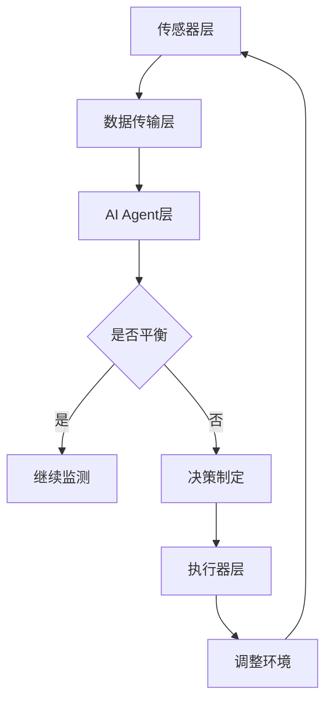

# 智能花园系统：AI Agent的生态平衡维护

> 关键词：智能花园系统、AI Agent、生态平衡维护、传感器技术、自动化控制

> 摘要：本文聚焦于智能花园系统中AI Agent对生态平衡的维护。首先介绍了智能花园系统的背景，包括其目的、预期读者、文档结构和相关术语。接着阐述了核心概念，如AI Agent与花园生态系统的联系，并给出了原理和架构的文本示意图与Mermaid流程图。详细讲解了核心算法原理，使用Python代码进行了示例说明。探讨了相关的数学模型和公式，并举例解释。通过项目实战，展示了开发环境搭建、源代码实现及代码解读。分析了智能花园系统的实际应用场景，推荐了学习资源、开发工具框架和相关论文著作。最后总结了未来发展趋势与挑战，提供了常见问题解答和扩展阅读参考资料，旨在为智能花园系统的研究和应用提供全面的技术指导。

## 1. 背景介绍 
### 1.1 目的和范围
随着人们对生活品质的追求和科技的不断进步，智能花园系统应运而生。智能花园系统旨在利用先进的技术手段，如传感器、自动化控制和人工智能，实现花园的智能化管理。本文章的目的是深入探讨智能花园系统中AI Agent如何维护花园的生态平衡，包括对土壤湿度、光照强度、温度等环境因素的监测和调控，以及对植物生长状态的评估和干预。文章的范围涵盖了智能花园系统的基本原理、核心算法、数学模型、实际应用和未来发展等方面。

### 1.2 预期读者
本文的预期读者包括对智能花园系统、人工智能、自动化控制等领域感兴趣的技术爱好者、科研人员、园艺工作者以及相关行业的从业者。对于想要了解智能花园系统如何实现生态平衡维护的读者，本文将提供详细的技术分析和实践指导。

### 1.3 文档结构概述
本文将按照以下结构进行组织：
1. 背景介绍：阐述智能花园系统的目的、预期读者、文档结构和相关术语。
2. 核心概念与联系：介绍智能花园系统的核心概念，如AI Agent、花园生态系统等，并展示它们之间的联系。
3. 核心算法原理 & 具体操作步骤：详细讲解AI Agent维护生态平衡的核心算法原理，并给出Python代码示例。
4. 数学模型和公式 & 详细讲解 & 举例说明：介绍相关的数学模型和公式，并通过具体例子进行解释。
5. 项目实战：代码实际案例和详细解释说明：通过一个实际的项目案例，展示智能花园系统的开发过程，包括开发环境搭建、源代码实现和代码解读。
6. 实际应用场景：分析智能花园系统在不同场景下的应用。
7. 工具和资源推荐：推荐学习资源、开发工具框架和相关论文著作。
8. 总结：未来发展趋势与挑战：总结智能花园系统的发展趋势和面临的挑战。
9. 附录：常见问题与解答：提供常见问题的解答。
10. 扩展阅读 & 参考资料：提供扩展阅读的建议和参考资料。

### 1.4 术语表
#### 1.4.1 核心术语定义
- **智能花园系统**：利用传感器、自动化控制和人工智能技术实现花园智能化管理的系统。
- **AI Agent**：人工智能代理，是一种能够感知环境、做出决策并采取行动的智能实体。
- **生态平衡**：花园生态系统中各种生物和非生物因素之间的相对稳定状态。
- **传感器**：用于监测花园环境参数的设备，如土壤湿度传感器、光照传感器等。
- **执行器**：根据AI Agent的决策执行相应操作的设备，如灌溉系统、遮阳帘等。

#### 1.4.2 相关概念解释
- **环境感知**：AI Agent通过传感器获取花园环境的信息，如温度、湿度、光照等。
- **决策制定**：AI Agent根据感知到的环境信息和预设的规则，制定相应的决策。
- **行动执行**：AI Agent通过执行器实施决策，如开启灌溉系统、调整遮阳帘等。

#### 1.4.3 缩略词列表
- **AI**：Artificial Intelligence，人工智能
- **IoT**：Internet of Things，物联网

## 2. 核心概念与联系 
### 核心概念原理
智能花园系统的核心是AI Agent，它通过传感器实时监测花园的环境参数，如土壤湿度、光照强度、温度等。根据这些信息，AI Agent利用预设的规则或机器学习算法进行决策，判断花园是否处于生态平衡状态。如果发现环境参数偏离了适宜植物生长的范围，AI Agent会通过执行器采取相应的措施，如开启灌溉系统、调整遮阳帘等，以恢复生态平衡。

### 架构的文本示意图
智能花园系统的架构主要包括以下几个部分：
1. **传感器层**：负责采集花园的环境信息，如土壤湿度传感器、光照传感器、温度传感器等。
2. **数据传输层**：将传感器采集到的数据传输到AI Agent。可以使用有线或无线通信技术，如Wi-Fi、蓝牙、ZigBee等。
3. **AI Agent层**：接收传感器数据，进行数据分析和决策制定。AI Agent可以是本地设备，也可以是云端服务器。
4. **执行器层**：根据AI Agent的决策执行相应的操作，如灌溉系统、遮阳帘、通风设备等。

### Mermaid流程图


## 3. 核心算法原理 & 具体操作步骤 
### 核心算法原理
AI Agent维护花园生态平衡的核心算法可以基于规则或机器学习。以下是基于规则的算法原理：
1. **设定阈值**：为每个环境参数设定适宜植物生长的阈值范围，如土壤湿度在30% - 70%之间。
2. **实时监测**：通过传感器实时获取环境参数的值。
3. **比较判断**：将获取的环境参数值与设定的阈值进行比较，如果超出阈值范围，则认为花园生态失衡。
4. **决策制定**：根据失衡的情况，制定相应的决策，如土壤湿度过低则开启灌溉系统。
5. **行动执行**：通过执行器实施决策，调整花园环境。

### 具体操作步骤及Python代码示例
```python
# 模拟传感器数据
class Sensor:
    def __init__(self, name, value):
        self.name = name
        self.value = value

    def get_value(self):
        return self.value

# 模拟执行器
class Actuator:
    def __init__(self, name):
        self.name = name
        self.status = False

    def turn_on(self):
        self.status = True
        print(f"{self.name} 已开启")

    def turn_off(self):
        self.status = False
        print(f"{self.name} 已关闭")

# AI Agent类
class AI_Agent:
    def __init__(self):
        # 设定土壤湿度阈值
        self.soil_moisture_threshold = (30, 70)
        self.sensors = []
        self.actuators = []

    def add_sensor(self, sensor):
        self.sensors.append(sensor)

    def add_actuator(self, actuator):
        self.actuators.append(actuator)

    def monitor_environment(self):
        for sensor in self.sensors:
            if sensor.name == "土壤湿度传感器":
                moisture = sensor.get_value()
                if moisture < self.soil_moisture_threshold[0]:
                    # 土壤湿度过低，开启灌溉系统
                    for actuator in self.actuators:
                        if actuator.name == "灌溉系统":
                            actuator.turn_on()
                elif moisture > self.soil_moisture_threshold[1]:
                    # 土壤湿度过高，关闭灌溉系统
                    for actuator in self.actuators:
                        if actuator.name == "灌溉系统":
                            actuator.turn_off()

# 创建传感器和执行器
soil_moisture_sensor = Sensor("土壤湿度传感器", 20)
irrigation_system = Actuator("灌溉系统")

# 创建AI Agent
agent = AI_Agent()
agent.add_sensor(soil_moisture_sensor)
agent.add_actuator(irrigation_system)

# 监测环境
agent.monitor_environment()
```

## 4. 数学模型和公式 & 详细讲解 & 举例说明 
### 数学模型
在智能花园系统中，可以使用线性回归模型来预测植物的生长状态与环境参数之间的关系。线性回归模型的一般形式为：

$$y = \beta_0 + \beta_1x_1 + \beta_2x_2 + \cdots + \beta_nx_n + \epsilon$$

其中，$y$ 是植物的生长指标（如高度、叶片数量等），$x_1, x_2, \cdots, x_n$ 是环境参数（如土壤湿度、光照强度、温度等），$\beta_0, \beta_1, \cdots, \beta_n$ 是模型的系数，$\epsilon$ 是误差项。

### 详细讲解
通过收集大量的植物生长数据和对应的环境参数数据，可以使用最小二乘法来估计模型的系数 $\beta_0, \beta_1, \cdots, \beta_n$。最小二乘法的目标是使预测值与实际值之间的误差平方和最小，即：

$$\min_{\beta_0, \beta_1, \cdots, \beta_n} \sum_{i=1}^{m} (y_i - (\beta_0 + \beta_1x_{i1} + \beta_2x_{i2} + \cdots + \beta_nx_{in}))^2$$

其中，$m$ 是样本数量，$y_i$ 是第 $i$ 个样本的实际值，$x_{i1}, x_{i2}, \cdots, x_{in}$ 是第 $i$ 个样本的环境参数值。

### 举例说明
假设我们要预测植物的高度 $y$ 与土壤湿度 $x_1$ 和光照强度 $x_2$ 之间的关系。我们收集了以下数据：

| 土壤湿度 $x_1$ | 光照强度 $x_2$ | 植物高度 $y$ |
| --- | --- | --- |
| 20 | 500 | 10 |
| 30 | 600 | 12 |
| 40 | 700 | 15 |
| 50 | 800 | 18 |

使用Python的 `scikit-learn` 库可以很方便地实现线性回归模型：

```python
import numpy as np
from sklearn.linear_model import LinearRegression

# 输入数据
X = np.array([[20, 500], [30, 600], [40, 700], [50, 800]])
y = np.array([10, 12, 15, 18])

# 创建线性回归模型
model = LinearRegression()

# 拟合模型
model.fit(X, y)

# 打印模型系数
print("截距:", model.intercept_)
print("系数:", model.coef_)

# 预测新的数据
new_X = np.array([[60, 900]])
predicted_y = model.predict(new_X)
print("预测的植物高度:", predicted_y)
```

通过这个例子，我们可以看到如何使用线性回归模型来预测植物的生长状态与环境参数之间的关系，从而为智能花园系统的决策提供依据。

## 5. 项目实战：代码实际案例和详细解释说明 
### 5.1  开发环境搭建
#### 硬件环境
- **传感器**：选择合适的传感器来监测花园的环境参数，如土壤湿度传感器、光照传感器、温度传感器等。可以使用Arduino、Raspberry Pi等开发板来连接传感器。
- **执行器**：根据需要选择执行器，如灌溉系统、遮阳帘、通风设备等。可以使用继电器来控制执行器的开关。
- **通信模块**：选择合适的通信模块来实现传感器和AI Agent之间的数据传输，如Wi-Fi模块、蓝牙模块等。

#### 软件环境
- **开发语言**：选择Python作为开发语言，因为Python具有丰富的库和工具，适合用于数据分析和机器学习。
- **开发框架**：可以使用Flask、Django等Web框架来搭建AI Agent的服务端。
- **数据库**：选择合适的数据库来存储传感器数据和系统配置信息，如MySQL、SQLite等。

### 5.2  源代码详细实现和代码解读
以下是一个完整的智能花园系统的Python代码示例：

```python
from flask import Flask, jsonify
import sqlite3
import random

# 创建Flask应用
app = Flask(__name__)

# 模拟传感器数据
def get_sensor_data():
    soil_moisture = random.randint(0, 100)
    light_intensity = random.randint(0, 1000)
    temperature = random.randint(10, 40)
    return soil_moisture, light_intensity, temperature

# 模拟执行器操作
def control_actuators(soil_moisture, light_intensity, temperature):
    irrigation_status = "关闭"
    shade_status = "关闭"
    ventilation_status = "关闭"

    if soil_moisture < 30:
        irrigation_status = "开启"
    if light_intensity > 800:
        shade_status = "开启"
    if temperature > 30:
        ventilation_status = "开启"

    return irrigation_status, shade_status, ventilation_status

# 存储传感器数据到数据库
def save_sensor_data(soil_moisture, light_intensity, temperature):
    conn = sqlite3.connect('garden.db')
    cursor = conn.cursor()
    cursor.execute("INSERT INTO sensor_data (soil_moisture, light_intensity, temperature) VALUES (?,?,?)",
                   (soil_moisture, light_intensity, temperature))
    conn.commit()
    conn.close()

# 获取传感器数据接口
@app.route('/sensor_data', methods=['GET'])
def get_sensor_data_api():
    soil_moisture, light_intensity, temperature = get_sensor_data()
    save_sensor_data(soil_moisture, light_intensity, temperature)
    return jsonify({
        "土壤湿度": soil_moisture,
        "光照强度": light_intensity,
        "温度": temperature
    })

# 获取执行器状态接口
@app.route('/actuator_status', methods=['GET'])
def get_actuator_status_api():
    soil_moisture, light_intensity, temperature = get_sensor_data()
    irrigation_status, shade_status, ventilation_status = control_actuators(soil_moisture, light_intensity, temperature)
    return jsonify({
        "灌溉系统状态": irrigation_status,
        "遮阳帘状态": shade_status,
        "通风设备状态": ventilation_status
    })

if __name__ == '__main__':
    # 创建数据库表
    conn = sqlite3.connect('garden.db')
    cursor = conn.cursor()
    cursor.execute('''CREATE TABLE IF NOT EXISTS sensor_data
                      (id INTEGER PRIMARY KEY AUTOINCREMENT,
                       soil_moisture REAL,
                       light_intensity REAL,
                       temperature REAL)''')
    conn.commit()
    conn.close()

    app.run(debug=True)
```

### 5.3  代码解读与分析
- **模拟传感器数据**：`get_sensor_data` 函数模拟了传感器采集数据的过程，随机生成土壤湿度、光照强度和温度的值。
- **模拟执行器操作**：`control_actuators` 函数根据传感器数据判断是否需要开启灌溉系统、遮阳帘和通风设备。
- **存储传感器数据**：`save_sensor_data` 函数将传感器数据存储到SQLite数据库中。
- **Flask接口**：通过Flask框架提供了两个接口，`/sensor_data` 用于获取传感器数据并存储到数据库，`/actuator_status` 用于获取执行器的状态。

## 6. 实际应用场景 
### 家庭花园
在家庭花园中，智能花园系统可以帮助主人轻松管理花园。通过实时监测土壤湿度、光照强度和温度等环境参数，系统可以自动控制灌溉系统、遮阳帘和通风设备，确保植物生长在适宜的环境中。主人可以通过手机APP随时随地查看花园的环境信息和执行器的状态，还可以远程控制执行器。

### 商业园艺
在商业园艺领域，智能花园系统可以提高生产效率和产品质量。大规模的花园种植需要精确的环境控制，智能花园系统可以实现自动化管理，减少人工成本。同时，通过对植物生长数据的分析，系统可以为种植者提供科学的种植建议，提高作物的产量和品质。

### 科研实验
在科研实验中，智能花园系统可以为研究人员提供准确的实验数据。研究人员可以通过系统精确控制实验环境的参数，如温度、湿度、光照等，从而更好地研究植物的生长规律和生态适应性。系统还可以记录实验数据，方便研究人员进行数据分析和总结。

## 7. 工具和资源推荐
### 7.1 学习资源推荐
#### 7.1.1 书籍推荐
- 《Python数据分析实战》：介绍了Python在数据分析领域的应用，包括数据处理、可视化和机器学习等方面的内容。
- 《人工智能：一种现代的方法》：经典的人工智能教材，全面介绍了人工智能的基本概念、算法和应用。
- 《物联网技术与应用》：详细介绍了物联网的技术原理和应用场景，对理解智能花园系统的架构有很大帮助。

#### 7.1.2 在线课程
- Coursera上的“人工智能基础”课程：由知名教授授课，系统地介绍了人工智能的基础知识和算法。
- edX上的“Python编程入门”课程：适合初学者学习Python编程语言。
- Udemy上的“物联网开发实战”课程：通过实际项目案例，讲解物联网的开发流程和技术。

#### 7.1.3 技术博客和网站
- Medium：有很多关于人工智能、物联网和智能花园系统的技术文章和案例分享。
- Hackster.io：提供了大量的开源硬件项目和教程，包括智能花园系统的相关项目。
- Arduino官方网站：提供了Arduino开发板的文档和教程，对于学习传感器和执行器的使用很有帮助。

### 7.2 开发工具框架推荐
#### 7.2.1 IDE和编辑器
- PyCharm：专业的Python集成开发环境，提供了丰富的代码编辑、调试和分析功能。
- Visual Studio Code：轻量级的代码编辑器，支持多种编程语言，并且有丰富的插件可以扩展功能。
- Arduino IDE：专门用于Arduino开发板的集成开发环境，方便进行传感器和执行器的编程。

#### 7.2.2 调试和性能分析工具
- Py-Spy：用于Python代码的性能分析工具，可以帮助开发者找出代码中的性能瓶颈。
- Wireshark：网络协议分析工具，可以用于调试传感器和AI Agent之间的数据传输。
- Arduino Serial Monitor：Arduino IDE自带的串口监视器，用于查看传感器数据和调试信息。

#### 7.2.3 相关框架和库
- Flask：轻量级的Python Web框架，适合快速搭建AI Agent的服务端。
- Django：功能强大的Python Web框架，提供了丰富的功能和工具，适合开发大型的智能花园系统。
- scikit-learn：Python的机器学习库，提供了多种机器学习算法和工具，可用于智能花园系统的数据分析和预测。

### 7.3 相关论文著作推荐
#### 7.3.1 经典论文
- “Artificial Intelligence: A Modern Approach”：人工智能领域的经典论文，对人工智能的发展和应用进行了全面的阐述。
- “The Internet of Things: A Survey”：物联网领域的经典论文，介绍了物联网的概念、架构和应用。
- “Machine Learning for Sensor Networks”：探讨了机器学习在传感器网络中的应用，对于智能花园系统的数据分析有很大的参考价值。

#### 7.3.2 最新研究成果
- 在IEEE Xplore、ACM Digital Library等学术数据库中搜索关于智能花园系统、AI Agent和生态平衡维护的最新研究论文。
- 关注相关的学术会议，如ACM SIGKDD、IEEE ICRA等，获取最新的研究成果和技术趋势。

#### 7.3.3 应用案例分析
- 参考一些实际的智能花园系统应用案例，了解它们的设计思路、技术实现和应用效果。可以在相关的技术博客、学术论文和行业报告中找到这些案例。

## 8. 总结：未来发展趋势与挑战
### 未来发展趋势
- **智能化程度不断提高**：随着人工智能技术的不断发展，AI Agent将具备更强的学习和决策能力，能够更加精准地维护花园的生态平衡。例如，通过深度学习算法，AI Agent可以自动识别植物的病虫害，并及时采取相应的防治措施。
- **与物联网的深度融合**：智能花园系统将与物联网技术更加紧密地结合，实现设备之间的互联互通和数据共享。用户可以通过手机APP或智能音箱等设备远程控制花园的各种设备，实现更加便捷的管理。
- **个性化定制服务**：根据不同用户的需求和花园的特点，智能花园系统将提供个性化的定制服务。例如，为不同的植物品种提供专属的生长方案，满足用户多样化的需求。

### 挑战
- **数据安全和隐私问题**：智能花园系统涉及大量的传感器数据和用户信息，数据安全和隐私保护是一个重要的挑战。需要采取有效的加密和安全措施，防止数据泄露和恶意攻击。
- **技术标准和互操作性**：目前智能花园系统的技术标准还不够完善，不同厂商的设备和系统之间可能存在互操作性问题。需要制定统一的技术标准，促进智能花园系统的规范化和标准化发展。
- **成本问题**：智能花园系统的建设和维护成本较高，包括传感器、执行器、通信模块和AI Agent等设备的采购和安装成本，以及数据处理和存储的成本。降低成本是推广智能花园系统的关键。

## 9. 附录：常见问题与解答
### 1. 智能花园系统需要哪些硬件设备？
智能花园系统通常需要传感器（如土壤湿度传感器、光照传感器、温度传感器等）、执行器（如灌溉系统、遮阳帘、通风设备等）、通信模块（如Wi-Fi模块、蓝牙模块等）和开发板（如Arduino、Raspberry Pi等）。

### 2. 如何选择合适的传感器？
选择传感器时需要考虑以下因素：测量精度、稳定性、可靠性、价格和适用性。根据花园的具体需求和应用场景，选择合适的传感器类型和规格。

### 3. 智能花园系统的安装和调试复杂吗？
智能花园系统的安装和调试难度取决于系统的规模和复杂度。对于简单的系统，安装和调试相对容易，可以按照说明书进行操作。对于复杂的系统，建议寻求专业人员的帮助。

### 4. 智能花园系统的运行成本高吗？
智能花园系统的运行成本主要包括传感器和执行器的能耗、通信费用和数据处理费用等。通过合理选择设备和优化系统设计，可以降低运行成本。

### 5. 智能花园系统可以与手机APP连接吗？
可以。通过开发手机APP，并与智能花园系统的服务端进行通信，可以实现手机APP对花园设备的远程控制和环境信息的实时查看。

## 10. 扩展阅读 & 参考资料
### 扩展阅读
- 《智能农业：技术与应用》：介绍了智能农业领域的最新技术和应用案例，对智能花园系统的进一步发展有一定的启发。
- 《机器学习实战》：通过实际项目案例，深入讲解了机器学习算法的应用，对于智能花园系统的数据分析和决策制定有很大的帮助。

### 参考资料
- 相关的学术论文和研究报告，可以在IEEE Xplore、ACM Digital Library等学术数据库中查找。
- 设备厂商的产品说明书和技术文档，如Arduino、Raspberry Pi等开发板的官方文档。
- 开源项目和代码库，如GitHub上的智能花园系统相关项目，可以参考学习其代码实现和设计思路。

作者：AI天才研究院/AI Genius Institute & 禅与计算机程序设计艺术 /Zen And The Art of Computer Programming