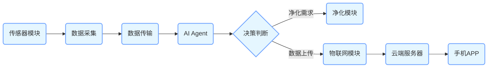

# 智能花瓶：AI Agent的室内空气净化监测

> 关键词：智能花瓶、AI Agent、室内空气净化、空气监测、物联网

> 摘要：本文围绕智能花瓶这一创新概念，深入探讨其借助AI Agent实现室内空气净化与监测的技术原理和应用。详细介绍了智能花瓶的核心概念、相关算法、数学模型，通过项目实战展示代码实现与解读，分析其实际应用场景，推荐了学习资源、开发工具和相关论文，最后总结了未来发展趋势与挑战，并解答常见问题。旨在为读者全面呈现智能花瓶在室内环境改善方面的技术魅力和应用价值。

## 1. 背景介绍 
### 1.1 目的和范围
随着人们生活水平的提高，对室内空气质量的关注度日益增加。室内空气污染可能会导致各种健康问题，如呼吸道疾病、过敏等。智能花瓶结合AI Agent技术，旨在实时监测室内空气质量，并通过内置的净化功能改善室内空气环境。本文的范围涵盖智能花瓶的核心概念、算法原理、数学模型、项目实战以及实际应用场景等方面，为开发者和研究人员提供全面的技术参考。

### 1.2 预期读者
本文预期读者包括计算机科学、环境科学、物联网等领域的开发者、研究人员，以及对智能硬件和室内环境改善感兴趣的爱好者。希望通过本文的介绍，读者能够深入了解智能花瓶的技术原理，并能够将相关技术应用到实际项目中。

### 1.3 文档结构概述
本文将按照以下结构进行阐述：首先介绍智能花瓶的核心概念与联系，包括其原理和架构；接着详细讲解核心算法原理和具体操作步骤，并使用Python代码进行示例；然后介绍相关的数学模型和公式，并举例说明；通过项目实战展示代码的实际案例和详细解释；分析智能花瓶的实际应用场景；推荐学习资源、开发工具和相关论文；最后总结未来发展趋势与挑战，并解答常见问题。

### 1.4 术语表
#### 1.4.1 核心术语定义
- **智能花瓶**：一种集成了空气监测和净化功能的智能硬件设备，通过AI Agent实现智能化控制。
- **AI Agent**：人工智能代理，能够感知环境、做出决策并采取行动的智能实体。
- **室内空气净化**：通过物理、化学或生物方法去除室内空气中的有害物质，改善空气质量。
- **空气监测**：对室内空气中的各种污染物浓度进行实时检测和分析。

#### 1.4.2 相关概念解释
- **物联网（IoT）**：通过各种信息传感器、射频识别技术、全球定位系统等各种装置与技术，实时采集任何需要监控、连接、互动的物体或过程，采集其声、光、热、电、力学、化学、生物、位置等各种需要的信息，通过各类可能的网络接入，实现物与物、物与人的泛在连接，实现对物品和过程的智能化感知、识别和管理。智能花瓶可以通过物联网技术将监测数据上传到云端，实现远程监控和管理。
- **机器学习**：一门多领域交叉学科，涉及概率论、统计学、逼近论、凸分析、算法复杂度理论等多门学科。它专门研究计算机怎样模拟或实现人类的学习行为，以获取新的知识或技能，重新组织已有的知识结构使之不断改善自身的性能。AI Agent可以利用机器学习算法对空气监测数据进行分析和预测，从而实现智能化的空气净化控制。

#### 1.4.3 缩略词列表
- **IoT**：Internet of Things（物联网）
- **PM2.5**：Particulate Matter 2.5（细颗粒物）
- **VOCs**：Volatile Organic Compounds（挥发性有机化合物）

## 2. 核心概念与联系 
### 核心概念原理
智能花瓶的核心原理是通过传感器实时监测室内空气质量，将监测数据传输给AI Agent。AI Agent对数据进行分析和处理，根据预设的规则或机器学习模型做出决策，控制净化模块进行空气净化操作。同时，智能花瓶还可以通过物联网技术将监测数据上传到云端，用户可以通过手机APP等终端设备实时查看室内空气质量信息，并对智能花瓶进行远程控制。

### 架构示意图


### 架构解释
- **传感器模块**：负责实时监测室内空气中的各种污染物浓度，如PM2.5、VOCs、甲醛等。
- **数据采集**：将传感器采集到的模拟信号转换为数字信号，并进行初步处理。
- **数据传输**：将处理后的数据传输给AI Agent。
- **AI Agent**：对数据进行分析和处理，根据预设的规则或机器学习模型做出决策。
- **净化模块**：根据AI Agent的决策，启动或停止空气净化操作。
- **物联网模块**：将监测数据上传到云端服务器。
- **云端服务器**：存储和管理监测数据，并提供数据查询和分析服务。
- **手机APP**：用户可以通过手机APP实时查看室内空气质量信息，并对智能花瓶进行远程控制。

## 3. 核心算法原理 & 具体操作步骤 
### 算法原理
智能花瓶的核心算法主要包括数据处理算法和决策算法。数据处理算法用于对传感器采集到的数据进行滤波、降噪等处理，提高数据的准确性和可靠性。决策算法用于根据处理后的数据做出净化决策，常见的决策算法有基于规则的决策算法和基于机器学习的决策算法。

### 基于规则的决策算法
基于规则的决策算法是根据预设的规则对空气质量数据进行判断，当空气质量指标超过设定的阈值时，启动净化模块进行空气净化。以下是一个基于Python的简单示例：

```python
# 定义空气质量阈值
PM25_THRESHOLD = 35
VOCS_THRESHOLD = 0.5

def air_quality_decision(pm25, vocs):
    if pm25 > PM25_THRESHOLD or vocs > VOCS_THRESHOLD:
        return True  # 启动净化
    else:
        return False  # 停止净化

# 模拟传感器数据
pm25_value = 40
vocs_value = 0.6

# 进行决策
decision = air_quality_decision(pm25_value, vocs_value)
if decision:
    print("启动净化模块")
else:
    print("停止净化模块")
```

### 基于机器学习的决策算法
基于机器学习的决策算法通过训练机器学习模型，让模型自动学习空气质量数据与净化决策之间的关系。以下是一个基于Python和Scikit-learn库的简单示例，使用逻辑回归模型进行决策：

```python
import numpy as np
from sklearn.linear_model import LogisticRegression

# 模拟训练数据
X_train = np.array([[20, 0.2], [40, 0.6], [10, 0.1], [50, 0.8]])  # 特征数据，[PM2.5, VOCs]
y_train = np.array([0, 1, 0, 1])  # 标签数据，0表示不启动净化，1表示启动净化

# 创建逻辑回归模型
model = LogisticRegression()

# 训练模型
model.fit(X_train, y_train)

# 模拟测试数据
pm25_test = 30
vocs_test = 0.4
X_test = np.array([[pm25_test, vocs_test]])

# 进行预测
prediction = model.predict(X_test)
if prediction[0] == 1:
    print("启动净化模块")
else:
    print("停止净化模块")
```

### 具体操作步骤
1. **数据采集**：通过传感器模块实时采集室内空气质量数据。
2. **数据处理**：对采集到的数据进行滤波、降噪等处理，提高数据的准确性和可靠性。
3. **决策判断**：使用基于规则或机器学习的决策算法对处理后的数据进行判断，做出净化决策。
4. **控制净化模块**：根据决策结果，控制净化模块启动或停止空气净化操作。
5. **数据上传**：将监测数据通过物联网模块上传到云端服务器。

## 4. 数学模型和公式 & 详细讲解 & 举例说明 
### 数学模型
智能花瓶的数学模型主要涉及数据处理和决策算法。在数据处理方面，常用的数学模型有移动平均滤波模型和卡尔曼滤波模型；在决策算法方面，常用的数学模型有逻辑回归模型和神经网络模型。

### 移动平均滤波模型
移动平均滤波是一种简单有效的数据滤波方法，它通过计算数据序列的滑动平均值来平滑数据，减少噪声的影响。移动平均滤波的公式如下：

$$
y_n = \frac{1}{N} \sum_{i=0}^{N-1} x_{n-i}
$$

其中，$y_n$ 是第 $n$ 个滤波后的输出值，$x_n$ 是第 $n$ 个输入值，$N$ 是移动平均的窗口大小。

以下是一个基于Python的移动平均滤波示例：

```python
import numpy as np

def moving_average_filter(data, window_size):
    filtered_data = []
    for i in range(len(data)):
        if i < window_size - 1:
            filtered_data.append(data[i])
        else:
            window = data[i - window_size + 1:i + 1]
            filtered_data.append(np.mean(window))
    return filtered_data

# 模拟原始数据
raw_data = [1, 2, 3, 4, 5, 6, 7, 8, 9, 10]
window_size = 3

# 进行滤波
filtered_data = moving_average_filter(raw_data, window_size)
print("原始数据:", raw_data)
print("滤波后的数据:", filtered_data)
```

### 逻辑回归模型
逻辑回归是一种常用的分类算法，它通过对输入特征进行线性组合，然后通过逻辑函数将线性组合的结果映射到 $[0, 1]$ 区间，从而实现分类。逻辑回归的数学模型如下：

$$
P(y = 1|x) = \frac{1}{1 + e^{-(w_0 + w_1x_1 + w_2x_2 + \cdots + w_nx_n)}}
$$

其中，$P(y = 1|x)$ 是样本 $x$ 属于正类的概率，$w_0, w_1, w_2, \cdots, w_n$ 是模型的参数，$x_1, x_2, \cdots, x_n$ 是样本的特征。

在智能花瓶的决策算法中，逻辑回归模型可以用于根据空气质量数据预测是否需要启动净化模块。具体步骤如下：
1. 收集训练数据，包括空气质量特征数据和对应的净化决策标签。
2. 训练逻辑回归模型，通过最小化损失函数来估计模型的参数。
3. 使用训练好的模型对新的空气质量数据进行预测，根据预测结果做出净化决策。

## 5. 项目实战：代码实际案例和详细解释说明 
### 5.1  开发环境搭建
#### 硬件环境
- **智能花瓶硬件平台**：可以选择基于Arduino、Raspberry Pi等开源硬件平台进行开发。
- **空气质量传感器**：如SDS011（用于监测PM2.5和PM10）、MQ-135（用于监测VOCs和有害气体）等。
- **净化模块**：如小型空气净化器、负离子发生器等。

#### 软件环境
- **开发语言**：Python
- **开发工具**：PyCharm、VS Code等
- **相关库**：Scikit-learn、Pandas、NumPy等

### 5.2  源代码详细实现和代码解读
以下是一个基于Raspberry Pi和Python的智能花瓶项目的完整代码示例：

```python
import time
import serial
from sklearn.linear_model import LogisticRegression
import numpy as np

# 定义串口通信参数
ser = serial.Serial('/dev/ttyUSB0', 9600, timeout=1)

# 模拟训练数据
X_train = np.array([[20, 0.2], [40, 0.6], [10, 0.1], [50, 0.8]])  # 特征数据，[PM2.5, VOCs]
y_train = np.array([0, 1, 0, 1])  # 标签数据，0表示不启动净化，1表示启动净化

# 创建逻辑回归模型
model = LogisticRegression()

# 训练模型
model.fit(X_train, y_train)

def read_sensor_data():
    """
    读取传感器数据
    """
    try:
        line = ser.readline().decode('utf-8').strip()
        if line:
            data = line.split(',')
            pm25 = float(data[0])
            vocs = float(data[1])
            return pm25, vocs
    except Exception as e:
        print(f"读取传感器数据出错: {e}")
    return None, None

def control_purifier(decision):
    """
    控制净化模块
    """
    if decision:
        print("启动净化模块")
        # 这里可以添加实际控制净化模块的代码
    else:
        print("停止净化模块")
        # 这里可以添加实际控制净化模块的代码

while True:
    pm25, vocs = read_sensor_data()
    if pm25 is not None and vocs is not None:
        X_test = np.array([[pm25, vocs]])
        prediction = model.predict(X_test)
        control_purifier(prediction[0])
    time.sleep(5)  # 每隔5秒读取一次数据
```

### 代码解读与分析
1. **串口通信**：使用`serial.Serial`函数初始化串口通信，用于读取传感器数据。
2. **模型训练**：使用逻辑回归模型对训练数据进行训练，得到一个可以根据空气质量数据预测净化决策的模型。
3. **数据读取**：定义`read_sensor_data`函数，用于从串口读取传感器数据，并将数据转换为PM2.5和VOCs的数值。
4. **净化控制**：定义`control_purifier`函数，根据决策结果控制净化模块的启动或停止。
5. **主循环**：使用`while True`循环不断读取传感器数据，对数据进行预测，并根据预测结果控制净化模块。每隔5秒读取一次数据，避免频繁读取造成资源浪费。

## 6. 实际应用场景 
### 家庭环境
在家庭环境中，智能花瓶可以实时监测室内空气质量，当空气质量不佳时自动启动净化模块，为家庭成员提供一个健康舒适的居住环境。用户可以通过手机APP随时随地查看室内空气质量信息，并对智能花瓶进行远程控制。

### 办公场所
在办公场所，智能花瓶可以帮助改善室内空气质量，提高员工的工作效率和健康水平。特别是在一些封闭的办公室环境中，智能花瓶可以及时发现并处理空气质量问题，减少员工因空气污染而导致的疾病发生率。

### 商业场所
在商场、酒店、餐厅等商业场所，智能花瓶可以作为一种增值服务，为顾客提供更好的购物和消费体验。同时，良好的室内空气质量也有助于提升商业场所的形象和竞争力。

## 7. 工具和资源推荐
### 7.1 学习资源推荐
#### 7.1.1 书籍推荐
- 《Python机器学习实战》：介绍了Python在机器学习领域的应用，包括各种机器学习算法的原理和实现。
- 《物联网开发实战》：详细介绍了物联网的相关技术和开发方法，适合初学者入门。
- 《传感器技术与应用》：讲解了各种传感器的原理、特性和应用，对于理解智能花瓶的传感器模块有很大帮助。

#### 7.1.2 在线课程
- Coursera上的“机器学习”课程：由斯坦福大学教授Andrew Ng主讲，是机器学习领域的经典课程。
- edX上的“物联网基础”课程：介绍了物联网的基本概念、技术和应用，适合初学者学习。
- 中国大学MOOC上的“Python语言程序设计”课程：帮助学习者快速掌握Python编程语言。

#### 7.1.3 技术博客和网站
- Medium：上面有很多关于人工智能、物联网等领域的技术文章和教程。
- Hackster.io：提供了大量的开源硬件项目案例和教程，对于智能花瓶的开发有很大的参考价值。
- 开源中国：国内知名的开源技术社区，有很多关于物联网和智能硬件的技术文章和讨论。

### 7.2 开发工具框架推荐
#### 7.2.1 IDE和编辑器
- PyCharm：专业的Python集成开发环境，提供了丰富的代码编辑、调试和项目管理功能。
- VS Code：轻量级的代码编辑器，支持多种编程语言，通过安装插件可以实现强大的开发功能。
- Arduino IDE：专门用于Arduino开发的集成开发环境，简单易用。

#### 7.2.2 调试和性能分析工具
- Py-Spy：Python性能分析工具，可以帮助开发者找出Python代码中的性能瓶颈。
- Wireshark：网络协议分析工具，用于调试物联网设备的网络通信问题。
- Arduino Serial Monitor：Arduino开发板的串口监视器，用于查看和调试串口通信数据。

#### 7.2.3 相关框架和库
- Scikit-learn：Python机器学习库，提供了各种机器学习算法的实现，方便开发者进行模型训练和预测。
- Pandas：Python数据处理库，用于数据的读取、清洗和分析。
- NumPy：Python科学计算库，提供了高效的数组操作和数学函数。

### 7.3 相关论文著作推荐
#### 7.3.1 经典论文
- 《Artificial Intelligence: A Modern Approach》：人工智能领域的经典教材，介绍了人工智能的基本概念、算法和应用。
- 《Machine Learning》：机器学习领域的经典教材，详细讲解了各种机器学习算法的原理和实现。
- 《Internet of Things: A Vision, Architectural Elements, and Future Directions》：物联网领域的经典论文，阐述了物联网的愿景、架构和未来发展方向。

#### 7.3.2 最新研究成果
- 可以关注IEEE Transactions on Industrial Informatics、ACM Transactions on Sensor Networks等顶级学术期刊，了解智能花瓶和室内空气质量监测领域的最新研究成果。

#### 7.3.3 应用案例分析
- 可以参考一些实际的智能硬件项目案例，如小米空气净化器、华为智能家居等，了解它们在室内空气质量监测和净化方面的技术应用和实践经验。

## 8. 总结：未来发展趋势与挑战
### 未来发展趋势
- **智能化程度不断提高**：随着人工智能技术的不断发展，智能花瓶的AI Agent将具备更强的学习和决策能力，能够根据不同的环境和用户需求自动调整净化策略。
- **功能集成化**：智能花瓶将不仅仅局限于空气净化和监测功能，还可能集成更多的功能，如温湿度调节、香薰功能、照明功能等，成为一个多功能的室内环境改善设备。
- **与智能家居系统的融合**：智能花瓶将与智能家居系统实现更深度的融合，用户可以通过智能家居平台统一管理和控制智能花瓶，实现更加便捷的家居生活体验。

### 挑战
- **传感器精度和可靠性**：传感器的精度和可靠性直接影响智能花瓶的监测和净化效果，需要不断提高传感器的性能和质量。
- **数据安全和隐私保护**：智能花瓶通过物联网技术将监测数据上传到云端，需要加强数据安全和隐私保护，防止数据泄露和滥用。
- **成本控制**：降低智能花瓶的生产成本，提高产品的性价比，是推广智能花瓶的关键。

## 9. 附录：常见问题与解答
### 问题1：智能花瓶的净化效果如何？
解答：智能花瓶的净化效果取决于净化模块的性能和室内空气质量的具体情况。一般来说，智能花瓶可以有效去除室内空气中的PM2.5、VOCs等有害物质，改善室内空气质量。

### 问题2：智能花瓶需要定期维护吗？
解答：是的，智能花瓶需要定期维护。主要包括清洁传感器和净化模块、更换滤网等，以保证智能花瓶的正常运行和净化效果。

### 问题3：智能花瓶可以连接多个传感器吗？
解答：可以，智能花瓶可以连接多个不同类型的传感器，以实现对室内空气质量的更全面监测。在开发过程中，只需要根据传感器的通信协议进行相应的编程即可。

### 问题4：智能花瓶的功耗高吗？
解答：智能花瓶的功耗主要取决于硬件配置和运行模式。一般来说，智能花瓶在正常运行时的功耗较低，不会对家庭或办公场所的用电造成太大影响。

## 10. 扩展阅读 & 参考资料
- 《智能家居系统设计与开发》
- 《人工智能算法原理与实践》
- https://www.arduino.cc/
- https://www.python.org/
- https://scikit-learn.org/

作者：AI天才研究院/AI Genius Institute & 禅与计算机程序设计艺术 /Zen And The Art of Computer Programming