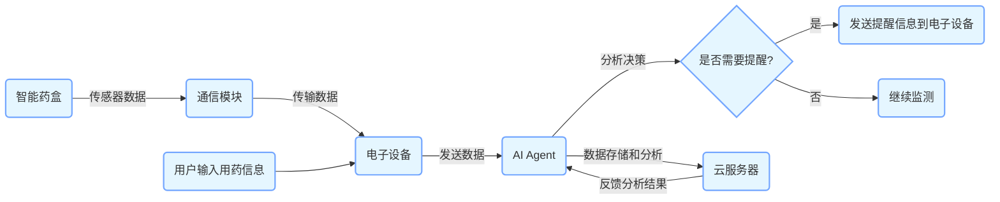

# 智能药盒：AI Agent的用药提醒与管理系统

> 关键词：智能药盒、AI Agent、用药提醒、用药管理系统、医疗科技

> 摘要：本文围绕智能药盒这一创新产品，详细探讨了基于AI Agent的用药提醒与管理系统。首先介绍了该系统产生的背景，包括目的、预期读者、文档结构等信息，并对相关术语进行了清晰定义。接着阐述了智能药盒及AI Agent的核心概念和它们之间的联系，通过文本示意图和Mermaid流程图直观展示其架构。深入剖析了核心算法原理，给出Python源代码进行详细说明，并辅以数学模型和公式进一步阐释。通过项目实战，展示了开发环境搭建、源代码实现及代码解读。分析了系统在实际中的应用场景，推荐了学习资源、开发工具框架以及相关论文著作。最后对系统未来发展趋势与挑战进行总结，并在附录中解答常见问题，提供扩展阅读和参考资料，旨在为智能药盒系统的研究和开发提供全面而深入的指导。

## 1. 背景介绍 
### 1.1 目的和范围
在当今社会，随着人口老龄化的加剧以及慢性疾病患者数量的不断增加，按时准确用药对于患者的健康至关重要。然而，由于各种原因，如记忆力减退、生活节奏快等，很多患者无法按时按量用药，这可能导致治疗效果不佳甚至病情恶化。智能药盒：AI Agent的用药提醒与管理系统旨在解决这一问题，通过智能化的手段帮助患者更好地管理用药。

本系统的范围涵盖了从用药信息的录入、提醒规则的设置到实时提醒、用药记录的保存和分析等多个方面。系统不仅可以针对个人用户，也可以为医疗机构、养老院等提供批量管理服务。

### 1.2 预期读者
本文的预期读者包括医疗科技领域的开发者、研究人员，对智能医疗产品感兴趣的技术爱好者，以及从事医疗信息化工作的相关人员。对于开发者来说，可以从本文中获取系统开发的详细技术方案和实现思路；研究人员可以了解智能药盒系统的前沿技术和发展趋势；技术爱好者可以通过阅读本文，对智能医疗产品有更深入的认识；医疗信息化工作者可以借鉴本文的经验，将智能药盒系统应用到实际的医疗服务中。

### 1.3 文档结构概述
本文将按照以下结构进行详细阐述：首先介绍智能药盒和AI Agent相关的核心概念及其联系，通过文本示意图和流程图展示系统架构；接着深入讲解核心算法原理，并给出Python源代码进行说明；然后介绍系统涉及的数学模型和公式，并举例说明；通过项目实战部分，展示开发环境的搭建、源代码的实现和代码解读；分析系统在实际中的应用场景；推荐相关的学习资源、开发工具框架和论文著作；最后对系统的未来发展趋势与挑战进行总结，并在附录中解答常见问题，提供扩展阅读和参考资料。

### 1.4 术语表
#### 1.4.1 核心术语定义
- **智能药盒**：一种具备智能化功能的药盒，它可以与电子设备相连，通过软件实现用药提醒、用药记录等功能。
- **AI Agent**：人工智能代理，是一种能够感知环境、自主决策并采取行动以实现特定目标的智能实体。在本系统中，AI Agent负责根据用户的用药信息和设置的规则，进行智能提醒和管理。
- **用药提醒**：系统根据用户设定的用药时间和剂量，通过声音、震动、短信等方式提醒用户按时用药。
- **用药管理系统**：对用户的用药信息进行全面管理的系统，包括用药计划的制定、用药记录的保存和分析等功能。

#### 1.4.2 相关概念解释
- **传感器技术**：智能药盒中通常会使用传感器来检测药盒的开合状态、药品的剩余量等信息。常见的传感器有红外传感器、重量传感器等。
- **机器学习算法**：AI Agent可以利用机器学习算法对用户的用药行为进行分析和预测，从而提供更加个性化的服务。例如，通过分析用户的用药历史数据，预测用户可能漏服药物的时间，并提前进行提醒。
- **云计算**：系统可以将用户的用药信息存储在云端，方便用户在不同设备上随时访问和管理。同时，云计算还可以提供强大的计算能力，支持系统进行复杂的数据分析和处理。

#### 1.4.3 缩略词列表
- **AI**：Artificial Intelligence，人工智能
- **IoT**：Internet of Things，物联网
- **API**：Application Programming Interface，应用程序编程接口

## 2. 核心概念与联系 

### 核心概念原理
智能药盒是整个系统的硬件载体，它通过内置的传感器收集药盒的状态信息，如药盒是否打开、药品是否被取出等。这些信息会通过无线通信技术（如蓝牙、Wi-Fi等）传输到与之相连的电子设备（如手机、平板电脑等）上。

AI Agent是系统的智能核心，它接收来自智能药盒和用户输入的各种信息，包括用药计划、用户的健康状况、历史用药记录等。AI Agent利用这些信息进行分析和决策，根据预设的规则和算法，判断是否需要提醒用户用药，并通过电子设备向用户发送提醒信息。同时，AI Agent还可以对用户的用药行为进行监测和分析，为用户提供个性化的用药建议和健康管理方案。

### 架构的文本示意图
```plaintext
+----------------+       +----------------+       +----------------+
|    智能药盒    | <----> |  通信模块（蓝牙、Wi-Fi）  | <----> |  电子设备（手机、平板）  |
+----------------+       +----------------+       +----------------+
                                                         |
                                                         v
                                               +----------------+
                                               |    AI Agent    |
                                               +----------------+
                                                         |
                                                         v
                                               +----------------+
                                               |  云服务器（存储、分析）  |
                                               +----------------+
```

### Mermaid流程图


## 3. 核心算法原理 & 具体操作步骤 

### 核心算法原理
本系统的核心算法主要包括用药提醒算法和用药行为分析算法。

#### 用药提醒算法
用药提醒算法的核心是根据用户设定的用药时间和剂量，结合当前时间判断是否需要提醒用户用药。具体步骤如下：
1. 获取用户设定的用药计划，包括用药时间、药品名称、剂量等信息。
2. 获取当前时间。
3. 比较当前时间与用药时间，如果当前时间接近或达到用药时间，则触发提醒机制。

#### 用药行为分析算法
用药行为分析算法主要用于分析用户的用药历史数据，预测用户可能漏服药物的情况，并提供相应的建议。具体步骤如下：
1. 收集用户的用药历史数据，包括用药时间、是否按时用药、药品剩余量等信息。
2. 对用药历史数据进行预处理，如数据清洗、特征提取等。
3. 使用机器学习算法（如决策树、神经网络等）对预处理后的数据进行训练，建立预测模型。
4. 根据预测模型，对用户未来的用药行为进行预测，并提供相应的建议。

### Python源代码详细阐述

```python
import datetime

# 定义用药计划类
class MedicationPlan:
    def __init__(self, medication_name, dosage, time):
        self.medication_name = medication_name
        self.dosage = dosage
        self.time = time

    def is_time_to_take(self):
        now = datetime.datetime.now().time()
        plan_time = self.time
        # 允许提前或延迟5分钟提醒
        time_difference = (datetime.datetime.combine(datetime.date.today(), now) - datetime.datetime.combine(datetime.date.today(), plan_time)).total_seconds()
        return abs(time_difference) <= 300

# 定义用药提醒函数
def medication_reminder(plans):
    for plan in plans:
        if plan.is_time_to_take():
            print(f"提醒：现在是服用 {plan.medication_name} {plan.dosage} 的时间了！")

# 示例用药计划
plan1 = MedicationPlan("阿司匹林", "1片", datetime.time(8, 0))
plan2 = MedicationPlan("降压药", "2片", datetime.time(12, 0))

plans = [plan1, plan2]

# 执行用药提醒
medication_reminder(plans)
```

### 具体操作步骤
1. **用药计划设置**：用户通过电子设备的应用程序输入用药计划，包括药品名称、剂量、用药时间等信息。
2. **数据传输**：电子设备将用户输入的用药计划数据通过通信模块发送到AI Agent。
3. **提醒判断**：AI Agent根据用药提醒算法，实时判断是否需要提醒用户用药。
4. **提醒发送**：如果需要提醒，AI Agent通过电子设备的应用程序向用户发送提醒信息，提醒方式可以包括声音、震动、弹窗等。
5. **用药记录**：用户用药后，智能药盒通过传感器检测药盒状态，并将用药记录传输到电子设备和AI Agent。
6. **行为分析**：AI Agent对用户的用药记录进行分析，根据用药行为分析算法，预测用户可能漏服药物的情况，并提供相应的建议。

## 4. 数学模型和公式 & 详细讲解 & 举例说明 

### 用药提醒判断公式
设 $T_{plan}$ 为用户设定的用药时间，$T_{now}$ 为当前时间，$\Delta T$ 为允许的时间误差（例如，$\Delta T = 5$ 分钟，换算为秒为 $\Delta T = 300$ 秒）。则判断是否需要提醒的公式为：

$$
\text{需要提醒} = 
\begin{cases}
\text{True}, & \text{if } |T_{now} - T_{plan}| \leq \Delta T \\
\text{False}, & \text{otherwise}
\end{cases}
$$

### 详细讲解
该公式的核心思想是比较当前时间与用药时间的差值，如果差值在允许的时间误差范围内，则认为需要提醒用户用药。其中，$|T_{now} - T_{plan}|$ 表示当前时间与用药时间的绝对差值，$\Delta T$ 是一个预先设定的阈值，用于控制提醒的精度。

### 举例说明
假设用户设定的用药时间 $T_{plan}$ 为上午 8:00，当前时间 $T_{now}$ 为上午 8:03，允许的时间误差 $\Delta T$ 为 5 分钟（即 300 秒）。则：

$T_{now} - T_{plan} = 8\text{:}03 - 8\text{:}00 = 3$ 分钟，换算为秒为 $3 \times 60 = 180$ 秒。

因为 $|180| \leq 300$，所以根据公式判断需要提醒用户用药。

### 用药行为分析模型
在用药行为分析中，我们可以使用逻辑回归模型来预测用户是否会漏服药物。逻辑回归模型的基本公式为：

$$
P(Y = 1|X) = \frac{1}{1 + e^{-(b_0 + b_1x_1 + b_2x_2 + \cdots + b_nx_n)}}
$$

其中，$P(Y = 1|X)$ 表示在给定特征向量 $X = (x_1, x_2, \cdots, x_n)$ 的情况下，用户漏服药物的概率；$b_0, b_1, \cdots, b_n$ 是模型的参数；$e$ 是自然常数。

### 详细讲解
逻辑回归模型是一种常用的分类模型，它通过将特征向量 $X$ 进行线性组合，并通过逻辑函数将其转换为概率值。在用药行为分析中，特征向量 $X$ 可以包括用户的用药历史、时间、天气等信息，模型的参数 $b_0, b_1, \cdots, b_n$ 可以通过训练数据进行学习得到。

### 举例说明
假设我们选择两个特征：$x_1$ 表示用户过去一周漏服药物的次数，$x_2$ 表示当前时间是否为周末（周末取值为 1，非周末取值为 0）。经过训练得到模型的参数 $b_0 = -1$，$b_1 = 0.5$，$b_2 = 0.2$。

如果用户过去一周漏服药物的次数 $x_1 = 2$，当前时间是周末 $x_2 = 1$，则可以计算用户漏服药物的概率为：

$$
P(Y = 1|X) = \frac{1}{1 + e^{-(-1 + 0.5 \times 2 + 0.2 \times 1)}} = \frac{1}{1 + e^{-0.2}} \approx 0.55
$$

这意味着在这种情况下，用户漏服药物的概率约为 55%。

## 5. 项目实战：代码实际案例和详细解释说明 

### 5.1  开发环境搭建
#### 硬件环境
- **智能药盒**：选择一款支持蓝牙或 Wi-Fi 通信的智能药盒，确保其内置有红外传感器或重量传感器，用于检测药盒的开合状态和药品的剩余量。
- **电子设备**：可以选择智能手机或平板电脑，要求设备支持蓝牙或 Wi-Fi 功能，并安装有相应的开发环境和应用程序。
- **服务器**：可以选择云服务器，如阿里云、腾讯云等，用于存储用户的用药信息和进行数据分析。

#### 软件环境
- **操作系统**：电子设备的操作系统可以选择 Android 或 iOS，服务器的操作系统可以选择 Linux（如 Ubuntu、CentOS 等）。
- **开发工具**：使用 Python 作为主要的开发语言，可以选择 PyCharm 作为集成开发环境（IDE）。
- **数据库**：选择 MySQL 或 MongoDB 作为数据库，用于存储用户的用药信息和历史记录。
- **通信框架**：使用 Bluetooth Low Energy（BLE）或 MQTT 作为通信框架，实现智能药盒与电子设备、电子设备与服务器之间的通信。

### 5.2  源代码详细实现和代码解读

#### 智能药盒端代码（Python 示例，使用 BLE 通信）
```python
import bluetooth
import time

# 蓝牙服务 UUID
SERVICE_UUID = "12345678-1234-5678-1234-56789abcdef0"
# 特征 UUID
CHARACTERISTIC_UUID = "87654321-4321-8765-4321-87654321abcd"

# 初始化蓝牙
ble = bluetooth.BLE()
ble.active(True)

# 连接到电子设备
while True:
    try:
        devices = ble.scan(5)
        for device in devices:
            if device.addr_type == bluetooth.ADDR_PUBLIC:
                conn = ble.gap_connect(device.addr_type, device.addr)
                if conn:
                    services = conn.gattc_services()
                    for service in services:
                        if service.uuid == SERVICE_UUID:
                            characteristics = service.gattc_characteristics()
                            for characteristic in characteristics:
                                if characteristic.uuid == CHARACTERISTIC_UUID:
                                    # 模拟药盒打开事件
                                    data = b'1'
                                    characteristic.write(data)
                                    print("药盒已打开，数据已发送")
                                    break
                    conn.disconnect()
                    break
    except Exception as e:
        print(f"连接失败：{e}")
    time.sleep(10)
```

**代码解读**：
- 首先，导入必要的库，包括 `bluetooth` 和 `time`。
- 定义蓝牙服务和特征的 UUID，用于识别电子设备上的服务和特征。
- 初始化蓝牙并激活它。
- 使用 `ble.scan` 函数扫描周围的蓝牙设备，找到目标设备后进行连接。
- 连接成功后，查找指定的服务和特征，并模拟药盒打开事件，将数据写入特征中。
- 最后，断开连接并等待一段时间后再次扫描。

#### 电子设备端代码（Python 示例，使用 BLE 通信）
```python
import bluetooth
import time

# 蓝牙服务 UUID
SERVICE_UUID = "12345678-1234-5678-1234-56789abcdef0"
# 特征 UUID
CHARACTERISTIC_UUID = "87654321-4321-8765-4321-87654321abcd"

# 初始化蓝牙
ble = bluetooth.BLE()
ble.active(True)

# 等待智能药盒连接
while True:
    try:
        conn = ble.gap_wait_for_connection()
        services = conn.gattc_services()
        for service in services:
            if service.uuid == SERVICE_UUID:
                characteristics = service.gattc_characteristics()
                for characteristic in characteristics:
                    if characteristic.uuid == CHARACTERISTIC_UUID:
                        data = characteristic.read()
                        if data == b'1':
                            print("收到药盒打开信号")
                            # 可以在这里添加发送用药记录到服务器的代码
        conn.disconnect()
    except Exception as e:
        print(f"连接失败：{e}")
    time.sleep(1)
```

**代码解读**：
- 同样导入必要的库，定义蓝牙服务和特征的 UUID。
- 初始化蓝牙并激活它。
- 使用 `ble.gap_wait_for_connection` 函数等待智能药盒的连接。
- 连接成功后，查找指定的服务和特征，并读取特征中的数据。
- 如果收到药盒打开信号（数据为 `b'1'`），则打印相应的信息，并可以在这里添加发送用药记录到服务器的代码。
- 最后，断开连接并等待下一次连接。

#### 服务器端代码（Python 示例，使用 Flask 和 MySQL）
```python
from flask import Flask, request
import mysql.connector

app = Flask(__name__)

# 连接到 MySQL 数据库
mydb = mysql.connector.connect(
    host="localhost",
    user="your_username",
    password="your_password",
    database="medication_management"
)

# 创建游标
mycursor = mydb.cursor()

# 定义 API 接口，用于接收用药记录
@app.route('/record_medication', methods=['POST'])
def record_medication():
    data = request.get_json()
    medication_name = data.get('medication_name')
    dosage = data.get('dosage')
    time = data.get('time')

    # 插入用药记录到数据库
    sql = "INSERT INTO medication_records (medication_name, dosage, time) VALUES (%s, %s, %s)"
    val = (medication_name, dosage, time)
    mycursor.execute(sql, val)
    mydb.commit()

    return "用药记录已保存"

if __name__ == '__main__':
    app.run(debug=True)
```

**代码解读**：
- 导入必要的库，包括 `Flask` 和 `mysql.connector`。
- 创建 Flask 应用实例，并连接到 MySQL 数据库。
- 定义一个 API 接口 `/record_medication`，用于接收电子设备发送的用药记录。
- 从请求中获取用药记录的信息，包括药品名称、剂量和时间。
- 将用药记录插入到数据库中，并提交事务。
- 最后返回保存成功的信息。

### 5.3  代码解读与分析
- **智能药盒端代码**：主要负责与电子设备进行蓝牙通信，检测药盒的开合状态，并将相应的数据发送给电子设备。代码中使用了蓝牙扫描和连接的功能，确保能够准确地与电子设备进行通信。
- **电子设备端代码**：等待智能药盒的连接，接收药盒发送的数据，并可以根据需要将用药记录发送到服务器。代码中使用了蓝牙等待连接和特征读取的功能，确保能够及时获取药盒的状态信息。
- **服务器端代码**：提供了一个 API 接口，用于接收电子设备发送的用药记录，并将其保存到数据库中。代码中使用了 Flask 框架和 MySQL 数据库，确保能够高效地处理和存储用药记录。

通过以上代码的实现，我们可以实现智能药盒、电子设备和服务器之间的通信和数据交互，从而完成用药提醒与管理系统的基本功能。

## 6. 实际应用场景 
### 个人用户场景
- **老年人用药管理**：对于老年人来说，记忆力可能会有所下降，容易忘记按时用药。智能药盒系统可以根据老年人的用药计划，按时提醒他们用药，并且可以通过传感器检测他们是否按时取药，为子女和护理人员提供用药情况的反馈。
- **慢性疾病患者用药管理**：慢性疾病患者需要长期按时服药，智能药盒系统可以帮助他们更好地管理用药，避免漏服或误服药物。同时，系统还可以对患者的用药数据进行分析，为医生提供参考，以便调整治疗方案。
- **忙碌人群用药管理**：对于工作繁忙的人群来说，可能会因为工作压力大而忘记用药。智能药盒系统可以通过多种方式提醒他们用药，如声音、震动、短信等，确保他们不会错过用药时间。

### 医疗机构场景
- **医院病房用药管理**：在医院病房中，护士需要为众多患者发放药物，容易出现错误。智能药盒系统可以与医院的信息系统集成，为每个患者定制用药计划，并通过智能药盒提醒患者按时用药。同时，系统还可以记录患者的用药情况，方便护士进行管理和统计。
- **社区医疗服务用药管理**：社区医疗服务机构可以为辖区内的患者提供智能药盒服务，帮助他们管理用药。系统可以与社区医生的诊疗系统相连，医生可以根据患者的用药情况及时进行随访和指导。

### 养老院场景
- **老人集中用药管理**：养老院通常有大量的老人需要用药，智能药盒系统可以实现对老人用药的集中管理。养老院工作人员可以通过系统为每个老人设置用药计划，并实时监控老人的用药情况。同时，系统还可以提供用药统计和分析功能，为养老院的管理提供数据支持。

## 7. 工具和资源推荐
### 7.1 学习资源推荐
#### 7.1.1 书籍推荐
- 《Python 机器学习实战》：本书详细介绍了 Python 在机器学习领域的应用，包括数据预处理、模型选择、算法实现等方面的内容，对于学习用药行为分析算法有很大的帮助。
- 《物联网技术与应用》：该书涵盖了物联网的基本概念、技术架构、通信协议等方面的知识，对于理解智能药盒与电子设备、服务器之间的通信原理有重要的参考价值。
- 《医疗信息系统设计与开发》：本书介绍了医疗信息系统的设计原则、开发方法和实践案例，对于开发智能药盒的用药提醒与管理系统具有指导意义。

#### 7.1.2 在线课程
- Coursera 上的 “人工智能基础” 课程：该课程由知名高校的教授授课，系统地介绍了人工智能的基本概念、算法和应用，对于学习 AI Agent 的相关知识非常有帮助。
- edX 上的 “Python 编程入门” 课程：适合初学者学习 Python 编程语言，掌握 Python 的基本语法和编程技巧，为后续的系统开发打下基础。
- Udemy 上的 “物联网开发实战” 课程：通过实际项目案例，介绍了物联网开发的流程和技术，对于开发智能药盒系统具有实际的指导作用。

#### 7.1.3 技术博客和网站
- 开源中国（https://www.oschina.net/）：提供了丰富的开源项目和技术文章，涵盖了人工智能、物联网等多个领域，可以在这里找到相关的技术资料和代码示例。
- 博客园（https://www.cnblogs.com/）：有很多技术开发者分享自己的开发经验和心得，对于解决开发过程中遇到的问题有很大的帮助。
- 知乎（https://www.zhihu.com/）：可以在知乎上搜索相关的话题，了解行业动态和最新技术趋势，还可以与其他开发者进行交流和讨论。

### 7.2 开发工具框架推荐
#### 7.2.1 IDE和编辑器
- PyCharm：是一款专门为 Python 开发设计的集成开发环境，具有代码自动补全、调试、版本控制等功能，能够提高开发效率。
- Visual Studio Code：是一款轻量级的代码编辑器，支持多种编程语言，并且有丰富的插件扩展，可以根据需要安装不同的插件来满足开发需求。

#### 7.2.2 调试和性能分析工具
- pdb：Python 自带的调试工具，可以在代码中设置断点，逐步执行代码，帮助开发者找出代码中的问题。
- cProfile：Python 标准库中的性能分析工具，可以分析代码的执行时间和函数调用次数，帮助开发者优化代码性能。

#### 7.2.3 相关框架和库
- Flask：是一个轻量级的 Python Web 框架，适合快速开发 Web 应用程序，如服务器端的 API 接口。
- Pandas：是一个强大的数据处理和分析库，提供了丰富的数据结构和数据操作方法，对于处理和分析用药数据非常有用。
- Scikit-learn：是一个常用的机器学习库，提供了多种机器学习算法和工具，如分类、回归、聚类等，可用于实现用药行为分析算法。

### 7.3 相关论文著作推荐
#### 7.3.1 经典论文
- “Machine Learning in Healthcare: A Review”：该论文对机器学习在医疗领域的应用进行了全面的综述，介绍了机器学习算法在疾病诊断、治疗方案推荐等方面的应用，对于理解机器学习在用药管理系统中的应用有重要的参考价值。
- “Internet of Things for Healthcare: A Comprehensive Survey”：论文详细介绍了物联网在医疗领域的应用现状和发展趋势，包括智能医疗设备、远程医疗监测等方面的内容，对于开发智能药盒系统具有指导意义。

#### 7.3.2 最新研究成果
- 可以关注顶级学术会议和期刊，如 ACM SIGKDD、IEEE Transactions on Biomedical Engineering 等，这些会议和期刊会发表最新的人工智能和医疗领域的研究成果，从中可以了解到智能药盒系统的前沿技术和发展方向。

#### 7.3.3 应用案例分析
- 可以查找一些实际的智能药盒系统应用案例分析报告，了解这些系统在实际应用中的效果和问题，为自己的系统开发提供参考和借鉴。

## 8. 总结：未来发展趋势与挑战
### 未来发展趋势
- **智能化程度不断提高**：随着人工智能技术的不断发展，AI Agent 将具备更强的学习和推理能力，能够根据用户的个性化需求提供更加精准的用药提醒和管理服务。例如，通过分析用户的基因数据、生活习惯等信息，为用户制定更加个性化的用药方案。
- **与其他医疗设备和系统的集成**：智能药盒系统将与其他医疗设备（如智能手环、血压计等）和医疗信息系统（如电子病历系统、医院信息系统等）进行集成，实现数据的共享和交互。这样可以为医生提供更加全面的患者信息，提高医疗服务的质量和效率。
- **拓展应用场景**：除了个人用户、医疗机构和养老院等场景，智能药盒系统还将拓展到更多的领域，如药品研发、药品监管等。例如，在药品研发过程中，智能药盒系统可以收集患者的用药反馈数据，为药品的优化和改进提供依据。

### 挑战
- **数据安全和隐私问题**：智能药盒系统涉及到用户的个人健康信息和用药数据，这些数据的安全和隐私保护至关重要。如何确保数据在传输和存储过程中的安全性，防止数据泄露和滥用，是系统开发和应用过程中需要解决的重要问题。
- **技术标准和规范缺乏**：目前，智能药盒系统的技术标准和规范还不够完善，不同厂家生产的智能药盒可能存在兼容性问题。制定统一的技术标准和规范，促进智能药盒系统的互联互通和互操作性，是推动该领域发展的关键。
- **用户接受度问题**：部分用户可能对智能药盒系统存在疑虑，担心使用不便或影响隐私。如何提高用户对智能药盒系统的接受度，让更多的人愿意使用该系统，是需要解决的另一个挑战。

## 9. 附录：常见问题与解答
### 1. 智能药盒的电池续航能力如何？
智能药盒的电池续航能力因产品而异，一般来说，一次充电可以使用数天到数周不等。具体的续航时间取决于药盒的功能、使用频率和电池容量等因素。一些智能药盒还支持使用充电底座或更换电池的方式来保持持续供电。

### 2. 智能药盒系统是否支持多语言？
大多数智能药盒系统支持多种语言，用户可以在电子设备的应用程序中选择自己熟悉的语言进行操作。这样可以方便不同地区和语言背景的用户使用。

### 3. 如果用户没有按时用药，系统会采取什么措施？
如果用户没有按时用药，系统会根据预先设置的规则进行提醒。提醒方式可以包括声音、震动、短信等。如果多次提醒后用户仍然没有用药，系统可以将信息发送给用户的紧急联系人或医生，以便他们进行干预。

### 4. 智能药盒系统的数据是否可以备份？
是的，智能药盒系统的数据通常可以备份到云服务器上。这样可以确保数据的安全性和可靠性，并且用户可以在不同的设备上随时访问和管理自己的用药信息。

### 5. 智能药盒系统是否可以与其他医疗应用程序集成？
一些智能药盒系统支持与其他医疗应用程序集成，如健康管理应用、电子病历应用等。通过集成，可以实现数据的共享和交互，为用户提供更加全面的医疗服务。具体的集成方式和支持的应用程序取决于智能药盒系统的开发者和相关的接口协议。

## 10. 扩展阅读 & 参考资料
### 扩展阅读
- 《智能医疗设备的设计与开发》：深入介绍了智能医疗设备的设计原理、开发方法和技术应用，对于进一步了解智能药盒系统的开发有很大的帮助。
- 《人工智能在医疗健康领域的应用案例分析》：通过实际案例分析，展示了人工智能在医疗健康领域的应用场景和效果，为智能药盒系统的应用和发展提供了参考。

### 参考资料
- [1] 李开复. 《人工智能》. 文化发展出版社, 2017.
- [2] 周志华. 《机器学习》. 清华大学出版社, 2016.
- [3] 谢希仁. 《计算机网络（第 5 版）》. 电子工业出版社, 2012.

作者：AI天才研究院/AI Genius Institute & 禅与计算机程序设计艺术 /Zen And The Art of Computer Programming