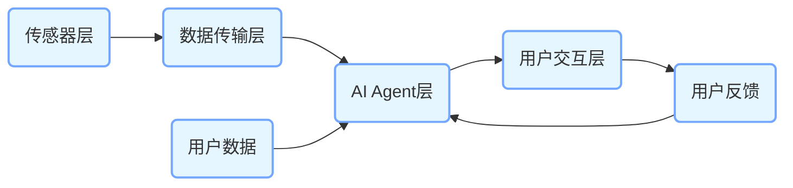

# 智能衣帽架：AI Agent的穿衣温度建议

> 关键词：智能衣帽架、AI Agent、穿衣温度建议、人工智能、传感器技术、机器学习

> 摘要：本文聚焦于智能衣帽架这一创新产品，深入探讨了其核心组成部分AI Agent如何提供穿衣温度建议。详细介绍了智能衣帽架的背景知识，包括目的、预期读者、文档结构和相关术语。阐述了核心概念及联系，给出了原理和架构的文本示意图与Mermaid流程图。对核心算法原理进行了Python代码详细阐述，同时分析了相关数学模型和公式。通过项目实战，展示了开发环境搭建、源代码实现与解读。探讨了实际应用场景，推荐了学习资源、开发工具框架和相关论文著作。最后总结了未来发展趋势与挑战，并提供了常见问题解答和扩展阅读参考资料。

## 1. 背景介绍 
### 1.1 目的和范围
智能衣帽架结合了人工智能技术与传统家居用品，旨在为用户提供更加便捷、个性化的穿衣建议。随着人们生活水平的提高，对于日常穿衣的舒适度和合理性有了更高的要求。传统的衣帽架仅仅具备挂放衣物的功能，而智能衣帽架通过内置的AI Agent，能够根据环境温度、天气状况以及用户的个人偏好等因素，为用户推荐合适的衣物搭配。本文的范围将涵盖智能衣帽架的技术原理、算法实现、实际应用以及未来发展等方面。

### 1.2 预期读者
本文适合对智能家居、人工智能技术感兴趣的技术爱好者、开发者以及相关行业的从业者阅读。对于想要了解智能产品背后技术原理的人员，以及希望在智能家居领域进行创新开发的开发者来说，本文将提供有价值的参考信息。

### 1.3 文档结构概述
本文将按照以下结构进行阐述：首先介绍智能衣帽架的背景知识，包括目的、预期读者和文档结构；接着讲解核心概念与联系，通过文本示意图和Mermaid流程图展示其原理和架构；然后详细阐述核心算法原理，并使用Python代码进行具体操作步骤的说明；分析相关的数学模型和公式，并举例说明；通过项目实战展示开发环境搭建、源代码实现和代码解读；探讨实际应用场景；推荐学习资源、开发工具框架和相关论文著作；最后总结未来发展趋势与挑战，提供常见问题解答和扩展阅读参考资料。

### 1.4 术语表
#### 1.4.1 核心术语定义
- **智能衣帽架**：一种融合了传感器、人工智能等技术的新型衣帽架，能够根据环境信息和用户数据提供穿衣建议。
- **AI Agent**：人工智能代理，是一种能够感知环境、做出决策并采取行动的智能实体。在智能衣帽架中，AI Agent负责分析各种数据并生成穿衣建议。
- **穿衣温度建议**：根据环境温度、天气状况、用户身体状况等因素，为用户推荐适合穿着的衣物类型和厚度。

#### 1.4.2 相关概念解释
- **传感器技术**：智能衣帽架通过各种传感器（如温度传感器、湿度传感器、光照传感器等）获取环境信息。温度传感器用于测量环境温度，湿度传感器用于检测空气湿度，光照传感器用于感知光照强度。
- **机器学习**：AI Agent利用机器学习算法对大量的历史数据进行学习和分析，以提高穿衣建议的准确性和个性化程度。常见的机器学习算法包括决策树、神经网络等。

#### 1.4.3 缩略词列表
- **AI**：Artificial Intelligence，人工智能
- **ML**：Machine Learning，机器学习

## 2. 核心概念与联系 
智能衣帽架的核心在于AI Agent与各种传感器的协同工作。传感器负责收集环境信息，如温度、湿度、光照等，将这些数据传输给AI Agent。AI Agent根据预设的算法和模型，对这些数据进行分析和处理，同时结合用户的个人偏好、历史穿衣记录等信息，生成适合用户的穿衣温度建议。

### 核心概念原理和架构的文本示意图
智能衣帽架的架构主要包括以下几个部分：
1. **传感器层**：由温度传感器、湿度传感器、光照传感器等组成，负责实时收集环境信息。
2. **数据传输层**：将传感器收集到的数据传输给AI Agent所在的处理单元。可以采用有线或无线传输方式，如WiFi、蓝牙等。
3. **AI Agent层**：是智能衣帽架的核心，负责对传感器数据和用户数据进行分析和处理，生成穿衣建议。
4. **用户交互层**：通过显示屏、语音提示等方式将穿衣建议反馈给用户，同时接收用户的反馈和设置信息。

### Mermaid流程图


该流程图展示了智能衣帽架的工作流程：传感器层收集环境信息，通过数据传输层将数据发送给AI Agent层。AI Agent层结合用户数据进行分析和处理，生成穿衣建议并通过用户交互层反馈给用户。用户可以提供反馈信息，这些反馈信息又会传回AI Agent层，用于优化后续的穿衣建议。

## 3. 核心算法原理 & 具体操作步骤 
### 核心算法原理
智能衣帽架的AI Agent主要采用机器学习算法来生成穿衣温度建议。一种常用的算法是决策树算法。决策树是一种基于树结构进行决策的模型，它通过对数据的学习和分析，构建一棵决策树，每个内部节点表示一个属性上的测试，每个分支表示一个测试输出，每个叶节点表示一个类别或值。

在智能衣帽架中，决策树的输入可以包括环境温度、湿度、天气状况、用户的年龄、性别、身体状况等因素，输出为适合的衣物类型和厚度。

### 具体操作步骤及Python源代码
以下是一个简单的使用Python实现的决策树算法示例，用于根据环境温度和天气状况生成穿衣建议：

```python
import pandas as pd
from sklearn.tree import DecisionTreeClassifier
from sklearn.model_selection import train_test_split
from sklearn.metrics import accuracy_score

# 准备数据
data = {
    '温度': [10, 20, 5, 25, 15],
    '天气状况': ['晴天', '晴天', '阴天', '雨天', '多云'],
    '穿衣建议': ['毛衣', '衬衫', '厚外套', '雨衣', '薄外套']
}
df = pd.DataFrame(data)

# 对天气状况进行编码
df['天气状况'] = df['天气状况'].map({'晴天': 0, '阴天': 1, '雨天': 2, '多云': 3})

# 划分特征和标签
X = df[['温度', '天气状况']]
y = df['穿衣建议']

# 划分训练集和测试集
X_train, X_test, y_train, y_test = train_test_split(X, y, test_size=0.2, random_state=42)

# 创建决策树模型
model = DecisionTreeClassifier()

# 训练模型
model.fit(X_train, y_train)

# 预测
y_pred = model.predict(X_test)

# 评估模型
accuracy = accuracy_score(y_test, y_pred)
print(f"模型准确率: {accuracy}")

# 新数据预测
new_data = [[12, 3]]  # 温度12度，多云天气
new_prediction = model.predict(new_data)
print(f"新数据的穿衣建议: {new_prediction[0]}")
```

### 代码解释
1. **数据准备**：使用`pandas`库创建一个包含温度、天气状况和穿衣建议的数据集。
2. **数据编码**：对天气状况进行编码，将字符串类型转换为数值类型，以便决策树模型能够处理。
3. **划分数据集**：使用`train_test_split`函数将数据集划分为训练集和测试集。
4. **创建和训练模型**：使用`DecisionTreeClassifier`创建决策树模型，并使用训练集进行训练。
5. **模型预测和评估**：使用测试集进行预测，并计算模型的准确率。
6. **新数据预测**：使用训练好的模型对新的温度和天气状况数据进行预测，得到穿衣建议。

## 4. 数学模型和公式 & 详细讲解 & 举例说明 
### 信息熵
信息熵是决策树算法中用于衡量数据纯度的一个重要概念。设数据集 $D$ 包含 $n$ 个样本，其中第 $i$ 类样本的数量为 $n_i$，则数据集 $D$ 的信息熵定义为：

$$
H(D) = -\sum_{i=1}^{k}p_i\log_2p_i
$$

其中，$k$ 是类别数，$p_i = \frac{n_i}{n}$ 是第 $i$ 类样本在数据集中所占的比例。

### 信息增益
信息增益是在决策树的节点划分过程中，用于选择最优划分属性的指标。设属性 $A$ 有 $v$ 个不同的取值 $\{a^1, a^2, \cdots, a^v\}$，根据属性 $A$ 的取值将数据集 $D$ 划分为 $v$ 个子集 $\{D^1, D^2, \cdots, D^v\}$，则属性 $A$ 对数据集 $D$ 的信息增益定义为：

$$
Gain(D, A) = H(D) - \sum_{v=1}^{V}\frac{|D^v|}{|D|}H(D^v)
$$

其中，$|D|$ 表示数据集 $D$ 的样本数量，$|D^v|$ 表示子集 $D^v$ 的样本数量。

### 举例说明
假设我们有一个包含10个样本的数据集，其中有6个正例和4个反例。则数据集的信息熵为：

$$
H(D) = -\frac{6}{10}\log_2\frac{6}{10} - \frac{4}{10}\log_2\frac{4}{10} \approx 0.971
$$

假设我们有一个属性 $A$，根据属性 $A$ 的取值将数据集划分为两个子集 $D^1$ 和 $D^2$，其中 $D^1$ 包含4个正例和1个反例，$D^2$ 包含2个正例和3个反例。则子集 $D^1$ 和 $D^2$ 的信息熵分别为：

$$
H(D^1) = -\frac{4}{5}\log_2\frac{4}{5} - \frac{1}{5}\log_2\frac{1}{5} \approx 0.722
$$

$$
H(D^2) = -\frac{2}{5}\log_2\frac{2}{5} - \frac{3}{5}\log_2\frac{3}{5} \approx 0.971
$$

属性 $A$ 对数据集 $D$ 的信息增益为：

$$
Gain(D, A) = 0.971 - (\frac{5}{10} \times 0.722 + \frac{5}{10} \times 0.971) \approx 0.124
$$

在决策树的节点划分过程中，我们会选择信息增益最大的属性作为划分属性，以构建更准确的决策树模型。

## 5. 项目实战：代码实际案例和详细解释说明 
### 5.1  开发环境搭建
#### 硬件环境
- **智能衣帽架硬件平台**：可以选择基于单片机（如Arduino、Raspberry Pi等）的开发板，连接温度传感器、湿度传感器、光照传感器等。
- **传感器**：选择合适的传感器，如DHT11温度湿度传感器、BH1750光照传感器等。
- **显示屏**：用于显示穿衣建议，可以选择LCD显示屏或OLED显示屏。

#### 软件环境
- **操作系统**：根据所选的硬件平台，安装相应的操作系统，如Raspbian（适用于Raspberry Pi）。
- **开发语言**：使用Python进行开发，Python具有丰富的库和工具，适合快速开发智能应用。
- **开发工具**：可以使用PyCharm、Visual Studio Code等集成开发环境。

### 5.2  源代码详细实现和代码解读
以下是一个完整的智能衣帽架项目的Python代码示例：

```python
import time
import Adafruit_DHT
import smbus
from sklearn.tree import DecisionTreeClassifier
import pandas as pd

# 初始化传感器
DHT_SENSOR = Adafruit_DHT.DHT11
DHT_PIN = 4
bus = smbus.SMBus(1)
DEVICE = 0x23  # 光照传感器地址
ONE_TIME_HIGH_RES_MODE_1 = 0x20

# 准备数据
data = {
    '温度': [10, 20, 5, 25, 15],
    '湿度': [60, 40, 70, 30, 50],
    '光照强度': [500, 1000, 200, 1500, 800],
    '穿衣建议': ['毛衣', '衬衫', '厚外套', '短袖', '薄外套']
}
df = pd.DataFrame(data)

# 划分特征和标签
X = df[['温度', '湿度', '光照强度']]
y = df['穿衣建议']

# 创建决策树模型
model = DecisionTreeClassifier()

# 训练模型
model.fit(X, y)

def read_light():
    """读取光照强度"""
    data = bus.read_i2c_block_data(DEVICE, ONE_TIME_HIGH_RES_MODE_1)
    result = (data[1] + (256 * data[0])) / 1.2
    return result

while True:
    humidity, temperature = Adafruit_DHT.read_retry(DHT_SENSOR, DHT_PIN)
    light = read_light()
    if humidity is not None and temperature is not None:
        new_data = [[temperature, humidity, light]]
        prediction = model.predict(new_data)
        print(f"当前温度: {temperature}°C, 湿度: {humidity}%, 光照强度: {light} lux")
        print(f"穿衣建议: {prediction[0]}")
    else:
        print("无法读取传感器数据")
    time.sleep(60)
```

### 5.3  代码解读与分析
1. **传感器初始化**：初始化温度湿度传感器和光照传感器，设置传感器的引脚和地址。
2. **数据准备和模型训练**：使用`pandas`库创建数据集，划分特征和标签，使用`DecisionTreeClassifier`创建决策树模型并进行训练。
3. **光照强度读取函数**：定义`read_light`函数，用于读取光照传感器的数据。
4. **主循环**：在主循环中，不断读取温度、湿度和光照强度数据，使用训练好的模型进行预测，并输出穿衣建议。每隔60秒进行一次数据读取和预测。

## 6. 实际应用场景 
### 家庭场景
在家庭中，智能衣帽架可以放置在玄关处，为家庭成员提供每天出门时的穿衣建议。根据室内外的温度、湿度和天气状况，推荐合适的衣物，让家庭成员能够更加舒适地出行。同时，智能衣帽架还可以记录家庭成员的穿衣偏好和历史记录，不断优化穿衣建议的准确性和个性化程度。

### 酒店场景
在酒店中，智能衣帽架可以放置在客房内，为客人提供贴心的服务。客人可以根据智能衣帽架的建议选择适合当地天气的衣物，提高旅行的舒适度。酒店还可以通过智能衣帽架收集客人的反馈信息，了解客人的需求和偏好，进一步提升服务质量。

### 商场场景
在商场中，智能衣帽架可以放置在服装店铺内。顾客可以通过智能衣帽架获取当前天气下的穿衣建议，同时结合店铺内的服装款式和风格，选择适合自己的衣物。商场管理者还可以根据智能衣帽架收集的数据，了解顾客的穿衣需求和消费趋势，优化商品陈列和营销策略。

## 7. 工具和资源推荐
### 7.1 学习资源推荐
#### 7.1.1 书籍推荐
- 《机器学习》（周志华著）：全面介绍了机器学习的基本概念、算法和应用，是机器学习领域的经典教材。
- 《Python机器学习实战》（Sebastian Raschka著）：通过实际案例介绍了如何使用Python进行机器学习开发，适合初学者入门。

#### 7.1.2 在线课程
- Coursera上的“机器学习”课程（Andrew Ng教授授课）：全球知名的机器学习课程，讲解深入浅出，适合零基础学习者。
- 网易云课堂上的“Python人工智能实战”课程：结合实际项目，介绍了Python在人工智能领域的应用。

#### 7.1.3 技术博客和网站
- 博客园：汇聚了大量的技术文章和经验分享，涵盖了人工智能、机器学习等多个领域。
- 知乎：可以在知乎上搜索相关的技术问题和讨论，获取不同的观点和见解。

### 7.2 开发工具框架推荐
#### 7.2.1 IDE和编辑器
- PyCharm：功能强大的Python集成开发环境，提供代码编辑、调试、版本控制等功能。
- Visual Studio Code：轻量级的代码编辑器，支持多种编程语言，具有丰富的插件生态系统。

#### 7.2.2 调试和性能分析工具
- Py-Spy：用于分析Python程序的性能，找出性能瓶颈。
- pdb：Python内置的调试工具，可以帮助开发者进行代码调试。

#### 7.2.3 相关框架和库
- Scikit-learn：Python中常用的机器学习库，提供了丰富的机器学习算法和工具。
- TensorFlow：谷歌开发的深度学习框架，广泛应用于人工智能领域。

### 7.3 相关论文著作推荐
#### 7.3.1 经典论文
- “A Decision-Theoretic Generalization of On-Line Learning and an Application to Boosting”（Yoav Freund和Robert E. Schapire著）：介绍了AdaBoost算法，是机器学习领域的经典论文。
- “ImageNet Classification with Deep Convolutional Neural Networks”（Alex Krizhevsky、Ilya Sutskever和Geoffrey E. Hinton著）：提出了AlexNet模型，开启了深度学习在计算机视觉领域的应用热潮。

#### 7.3.2 最新研究成果
- 关注顶级学术会议（如NeurIPS、ICML、CVPR等）上的最新研究论文，了解人工智能领域的最新技术和发展趋势。

#### 7.3.3 应用案例分析
- 一些知名企业（如谷歌、微软、亚马逊等）的技术博客会分享他们在人工智能领域的应用案例和实践经验，可以从中学习到实际应用中的技巧和方法。

## 8. 总结：未来发展趋势与挑战
### 未来发展趋势
- **智能化程度不断提高**：随着人工智能技术的不断发展，智能衣帽架的AI Agent将具备更强的学习和推理能力，能够根据更多的因素（如用户的健康状况、活动类型等）提供更加精准和个性化的穿衣建议。
- **与其他智能家居设备的融合**：智能衣帽架将与其他智能家居设备（如智能空调、智能窗帘等）实现互联互通，形成一个智能化的家居生态系统。例如，当智能衣帽架根据天气情况推荐用户穿厚衣服时，智能空调可以自动调整室内温度。
- **外观设计更加多样化**：除了功能上的提升，智能衣帽架的外观设计也将更加注重个性化和美观性，满足不同用户的审美需求。

### 挑战
- **数据隐私和安全问题**：智能衣帽架需要收集用户的个人数据（如穿衣偏好、身体状况等），如何保障这些数据的隐私和安全是一个重要的挑战。需要采用先进的加密技术和安全机制，防止数据泄露和滥用。
- **算法的准确性和可靠性**：虽然机器学习算法可以提供较为准确的穿衣建议，但在复杂的环境和用户需求下，算法的准确性和可靠性仍有待提高。需要不断优化算法，引入更多的数据和特征，提高模型的泛化能力。
- **成本和市场接受度**：智能衣帽架的研发和生产成本相对较高，如何降低成本并提高市场接受度是推广智能衣帽架的关键。需要通过技术创新和规模化生产来降低成本，同时加强市场宣传和推广，提高用户对智能衣帽架的认知和接受度。

## 9. 附录：常见问题与解答
### 问题1：智能衣帽架的穿衣建议准确吗？
答：智能衣帽架的穿衣建议是基于机器学习算法和大量的历史数据生成的，在大多数情况下可以提供较为准确的建议。但由于天气变化的复杂性和用户个体差异等因素，建议可能存在一定的误差。用户可以根据自己的实际感受进行调整。

### 问题2：智能衣帽架需要联网吗？
答：智能衣帽架可以选择联网或不联网。如果联网，它可以获取更准确的实时天气信息，提高穿衣建议的准确性。同时，联网还可以实现与其他智能家居设备的互联互通。如果不联网，智能衣帽架可以根据内置的传感器数据和本地模型提供穿衣建议。

### 问题3：智能衣帽架的传感器容易损坏吗？
答：一般来说，智能衣帽架所使用的传感器具有较高的可靠性和稳定性。但在使用过程中，仍需要注意避免碰撞、潮湿等情况，以延长传感器的使用寿命。如果传感器出现故障，可以联系厂家进行维修或更换。

### 问题4：智能衣帽架可以自定义穿衣建议吗？
答：一些智能衣帽架支持用户自定义穿衣建议。用户可以根据自己的喜好和需求，设置不同的温度、天气条件下的穿衣偏好。这样，智能衣帽架可以根据用户的自定义设置提供更加个性化的建议。

## 10. 扩展阅读 & 参考资料
### 扩展阅读
- 《智能家居技术与应用》：介绍了智能家居的各种技术和应用场景，包括智能安防、智能照明、智能家电等。
- 《人工智能：现代方法》：全面介绍了人工智能的基本概念、算法和应用，是人工智能领域的经典著作。

### 参考资料
- 相关传感器的数据手册和技术文档，用于了解传感器的工作原理和使用方法。
- 机器学习和人工智能领域的学术论文和研究报告，用于深入了解相关算法和技术的原理和应用。

作者：AI天才研究院/AI Genius Institute & 禅与计算机程序设计艺术 /Zen And The Art of Computer Programming