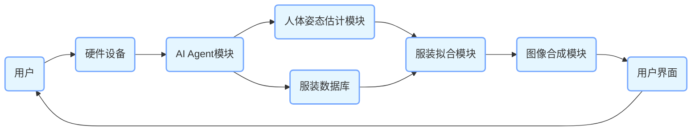

# 智能衣柜：AI Agent的虚拟试衣系统

> 关键词：智能衣柜、AI Agent、虚拟试衣系统、计算机视觉、深度学习

> 摘要：本文深入探讨了智能衣柜中基于AI Agent的虚拟试衣系统。首先介绍了该系统的背景，包括目的、预期读者、文档结构和相关术语。接着阐述了核心概念与联系，通过文本示意图和Mermaid流程图展示其架构原理。详细讲解了核心算法原理，并给出Python源代码示例。同时，运用数学模型和公式对系统进行了理论分析，结合实际案例说明其应用。在项目实战部分，从开发环境搭建到源代码实现与解读进行了全面介绍。此外，分析了该系统的实际应用场景，推荐了学习资源、开发工具框架以及相关论文著作。最后总结了系统的未来发展趋势与挑战，并给出常见问题解答和扩展阅读参考资料。

## 1. 背景介绍 
### 1.1 目的和范围
随着科技的不断发展，人们对于购物体验的要求越来越高。传统的试衣方式需要顾客亲自到店试穿，不仅浪费时间，而且在疫情等特殊情况下还存在一定的风险。智能衣柜的虚拟试衣系统旨在利用先进的人工智能技术，为用户提供便捷、高效、个性化的试衣体验。用户可以通过该系统在虚拟环境中试穿各种服装，无需实际试穿，节省时间和精力。

本系统的范围主要涵盖了智能衣柜的硬件设备、AI Agent的算法实现、虚拟试衣系统的软件界面设计以及与电商平台的集成等方面。通过将这些部分有机结合，实现一个完整的虚拟试衣解决方案。

### 1.2 预期读者
本文的预期读者包括对人工智能、计算机视觉、电子商务等领域感兴趣的技术人员，如程序员、软件架构师、算法工程师等。同时，也适合从事服装行业、零售行业的管理人员和创业者，他们可以从中了解虚拟试衣系统的技术原理和商业应用前景。此外，对于普通消费者来说，本文也可以帮助他们更好地理解智能衣柜和虚拟试衣系统的工作原理和优势。

### 1.3 文档结构概述
本文将按照以下结构进行组织：
1. **背景介绍**：介绍智能衣柜虚拟试衣系统的目的、预期读者和文档结构。
2. **核心概念与联系**：阐述系统的核心概念，如AI Agent、虚拟试衣等，并展示其架构原理。
3. **核心算法原理 & 具体操作步骤**：详细讲解系统所使用的核心算法，如人体姿态估计、服装拟合等，并给出Python源代码示例。
4. **数学模型和公式 & 详细讲解 & 举例说明**：运用数学模型和公式对系统进行理论分析，并结合实际案例说明其应用。
5. **项目实战：代码实际案例和详细解释说明**：从开发环境搭建到源代码实现与解读，全面介绍虚拟试衣系统的项目实战过程。
6. **实际应用场景**：分析系统在服装销售、时尚设计、个人造型等领域的实际应用场景。
7. **工具和资源推荐**：推荐学习资源、开发工具框架以及相关论文著作。
8. **总结：未来发展趋势与挑战**：总结系统的未来发展趋势和面临的挑战。
9. **附录：常见问题与解答**：解答用户在使用虚拟试衣系统过程中可能遇到的常见问题。
10. **扩展阅读 & 参考资料**：提供相关的扩展阅读资料和参考文献。

### 1.4 术语表
#### 1.4.1 核心术语定义
- **智能衣柜**：一种集成了人工智能技术的衣柜，具备自动识别衣物、智能推荐搭配、虚拟试衣等功能。
- **AI Agent**：人工智能代理，是一种能够感知环境、做出决策并采取行动的智能实体。在虚拟试衣系统中，AI Agent可以根据用户的需求和偏好，提供个性化的服装推荐和试衣体验。
- **虚拟试衣系统**：利用计算机图形学、计算机视觉和人工智能等技术，在虚拟环境中模拟用户试穿服装的过程。用户可以通过该系统看到自己穿上不同服装的效果，无需实际试穿。
- **人体姿态估计**：通过计算机视觉技术，对人体的姿态进行检测和分析，确定人体各个关节的位置和角度。在虚拟试衣系统中，人体姿态估计是实现服装拟合的关键步骤。
- **服装拟合**：将虚拟服装模型与人体模型进行匹配和融合，使服装能够准确地贴合人体的形状和姿态。服装拟合的效果直接影响虚拟试衣的真实感和用户体验。

#### 1.4.2 相关概念解释
- **计算机视觉**：是一门研究如何使计算机“看”的科学，即通过摄像机和计算机代替人眼对目标进行识别、跟踪和测量等。在虚拟试衣系统中，计算机视觉技术主要用于人体姿态估计、服装识别和图像合成等方面。
- **深度学习**：是一种基于人工神经网络的机器学习方法，通过构建多层神经网络来自动学习数据的特征和模式。在虚拟试衣系统中，深度学习技术可以用于训练人体姿态估计模型、服装分类模型和图像生成模型等。
- **虚拟现实（VR）/增强现实（AR）**：虚拟现实是一种创建和体验虚拟世界的计算机仿真系统，用户可以通过头戴式显示器等设备沉浸在虚拟环境中。增强现实是一种将虚拟信息与真实场景相结合的技术，用户可以通过手机、平板电脑等设备看到叠加在现实场景上的虚拟信息。在虚拟试衣系统中，VR/AR技术可以为用户提供更加沉浸式和真实的试衣体验。

#### 1.4.3 缩略词列表
- **AI**：Artificial Intelligence，人工智能
- **CV**：Computer Vision，计算机视觉
- **DL**：Deep Learning，深度学习
- **VR**：Virtual Reality，虚拟现实
- **AR**：Augmented Reality，增强现实

## 2. 核心概念与联系 

### 核心概念原理
智能衣柜的虚拟试衣系统主要基于以下几个核心概念：
1. **AI Agent**：作为系统的智能核心，AI Agent可以感知用户的需求和偏好，通过对用户的历史数据、行为模式和当前环境信息进行分析，为用户提供个性化的服装推荐和试衣建议。例如，AI Agent可以根据用户的身材、肤色、喜好等因素，推荐适合用户的服装款式和颜色。
2. **人体姿态估计**：通过计算机视觉技术，对用户的人体姿态进行实时检测和分析，确定人体各个关节的位置和角度。人体姿态估计是实现虚拟试衣的基础，只有准确地获取人体的姿态信息，才能将虚拟服装准确地贴合到人体上。
3. **服装拟合**：将虚拟服装模型与人体模型进行匹配和融合，使服装能够准确地贴合人体的形状和姿态。服装拟合的过程需要考虑到服装的材质、纹理、弹性等因素，以及人体的运动和变形。
4. **图像合成**：将虚拟服装图像与用户的真实图像进行合成，生成用户穿上虚拟服装的效果图。图像合成的过程需要保证合成后的图像具有良好的真实感和视觉效果。

### 架构的文本示意图
智能衣柜的虚拟试衣系统主要由以下几个部分组成：
1. **硬件设备**：包括智能衣柜、摄像头、传感器等，用于采集用户的图像和环境信息。
2. **AI Agent模块**：负责对用户的需求和偏好进行分析，提供个性化的服装推荐和试衣建议。
3. **人体姿态估计模块**：通过计算机视觉技术，对用户的人体姿态进行实时检测和分析。
4. **服装数据库**：存储各种服装的款式、颜色、尺码等信息，以及对应的虚拟服装模型。
5. **服装拟合模块**：将虚拟服装模型与人体模型进行匹配和融合，使服装能够准确地贴合人体的形状和姿态。
6. **图像合成模块**：将虚拟服装图像与用户的真实图像进行合成，生成用户穿上虚拟服装的效果图。
7. **用户界面**：提供用户与系统进行交互的界面，包括服装展示、试衣操作、效果预览等功能。

### Mermaid流程图


## 3. 核心算法原理 & 具体操作步骤 

### 人体姿态估计算法原理
人体姿态估计是虚拟试衣系统中的关键步骤，其目的是通过计算机视觉技术，对人体的姿态进行检测和分析，确定人体各个关节的位置和角度。目前，常用的人体姿态估计算法主要基于深度学习技术，如OpenPose、HRNet等。

以OpenPose算法为例，其基本原理是通过卷积神经网络（CNN）对输入的图像进行特征提取，然后通过多个阶段的网络结构，逐步预测人体各个关节的位置和置信度。具体步骤如下：
1. **特征提取**：使用预训练的CNN模型，如VGG16、ResNet等，对输入的图像进行特征提取，得到特征图。
2. **关节点预测**：在特征图上，通过多个卷积层和全连接层，预测人体各个关节的位置和置信度。
3. **肢体连接**：根据关节点的位置和置信度，通过贪心算法或图论算法，将相邻的关节点连接起来，形成人体的肢体骨架。

### Python源代码示例
```python
import cv2
import numpy as np
import os

# 加载OpenPose模型
proto_file = "pose_deploy_linevec_faster_4_stages.prototxt"
weights_file = "pose_iter_160000.caffemodel"
net = cv2.dnn.readNetFromCaffe(proto_file, weights_file)

# 读取输入图像
image = cv2.imread("test_image.jpg")
image_height, image_width, _ = image.shape

# 准备输入数据
blob = cv2.dnn.blobFromImage(image, 1.0 / 255, (368, 368), (0, 0, 0), swapRB=False, crop=False)
net.setInput(blob)

# 前向传播
output = net.forward()

# 解析输出结果
H, W = output.shape[2], output.shape[3]
points = []
for i in range(18):
    # 提取第i个关节点的置信度图
    prob_map = output[0, i, :, :]
    # 找到置信度最大的点
    min_val, prob, min_loc, point = cv2.minMaxLoc(prob_map)
    # 计算关节点在原始图像中的位置
    x = (image_width * point[0]) / W
    y = (image_height * point[1]) / H
    if prob > 0.1:
        points.append((int(x), int(y)))
    else:
        points.append(None)

# 绘制关节点和肢体骨架
for i in range(len(points)):
    if points[i] is not None:
        cv2.circle(image, points[i], 5, (0, 255, 0), thickness=-1, lineType=cv2.FILLED)

# 显示结果
cv2.imshow("Human Pose Estimation", image)
cv2.waitKey(0)
cv2.destroyAllWindows()
```

### 服装拟合算法原理
服装拟合是将虚拟服装模型与人体模型进行匹配和融合的过程，其目的是使服装能够准确地贴合人体的形状和姿态。常用的服装拟合算法主要基于物理模拟和机器学习技术，如基于弹簧质点模型的物理模拟方法、基于深度学习的服装变形模型等。

以基于弹簧质点模型的物理模拟方法为例，其基本原理是将服装看作由多个质点和弹簧组成的系统，通过模拟质点之间的相互作用力和弹簧的弹性变形，使服装能够自适应地贴合人体的形状和姿态。具体步骤如下：
1. **初始化服装模型**：将服装模型离散化为多个质点，并定义质点之间的连接关系和弹簧的弹性系数。
2. **计算质点受力**：根据人体的形状和姿态，计算每个质点所受到的外力，如重力、摩擦力等。
3. **更新质点位置**：根据质点所受到的外力和弹簧的弹性变形，更新每个质点的位置。
4. **重复步骤2和3**：直到服装模型达到稳定状态，即质点的位置不再发生明显变化。

### Python源代码示例
```python
import numpy as np

# 定义质点类
class Particle:
    def __init__(self, position, mass):
        self.position = np.array(position, dtype=np.float32)
        self.velocity = np.zeros(3, dtype=np.float32)
        self.mass = mass
        self.force = np.zeros(3, dtype=np.float32)

    def update(self, dt):
        # 根据牛顿第二定律更新质点的位置和速度
        acceleration = self.force / self.mass
        self.velocity += acceleration * dt
        self.position += self.velocity * dt
        self.force = np.zeros(3, dtype=np.float32)

# 定义弹簧类
class Spring:
    def __init__(self, particle1, particle2, rest_length, stiffness):
        self.particle1 = particle1
        self.particle2 = particle2
        self.rest_length = rest_length
        self.stiffness = stiffness

    def apply_force(self):
        # 计算弹簧的弹性力
        current_length = np.linalg.norm(self.particle1.position - self.particle2.position)
        force_direction = (self.particle1.position - self.particle2.position) / current_length
        force_magnitude = self.stiffness * (current_length - self.rest_length)
        force = force_direction * force_magnitude
        self.particle1.force -= force
        self.particle2.force += force

# 初始化服装模型
particles = [
    Particle([0, 0, 0], 1.0),
    Particle([1, 0, 0], 1.0),
    Particle([0, 1, 0], 1.0),
    Particle([1, 1, 0], 1.0)
]

springs = [
    Spring(particles[0], particles[1], 1.0, 100.0),
    Spring(particles[0], particles[2], 1.0, 100.0),
    Spring(particles[1], particles[3], 1.0, 100.0),
    Spring(particles[2], particles[3], 1.0, 100.0),
    Spring(particles[0], particles[3], np.sqrt(2), 100.0),
    Spring(particles[1], particles[2], np.sqrt(2), 100.0)
]

# 模拟服装拟合过程
dt = 0.01
num_steps = 100
for step in range(num_steps):
    # 应用弹簧的弹性力
    for spring in springs:
        spring.apply_force()
    # 更新质点的位置和速度
    for particle in particles:
        particle.update(dt)

# 输出拟合后的服装模型
for i, particle in enumerate(particles):
    print(f"Particle {i}: {particle.position}")
```

## 4. 数学模型和公式 & 详细讲解 & 举例说明 

### 人体姿态估计的数学模型
在人体姿态估计中，常用的数学模型是基于卷积神经网络（CNN）的回归模型。假设输入的图像为 $I \in \mathbb{R}^{H \times W \times C}$，其中 $H$、$W$ 和 $C$ 分别表示图像的高度、宽度和通道数。输出的关节点位置为 $\mathbf{p} = [p_1, p_2, \cdots, p_K] \in \mathbb{R}^{2K}$，其中 $K$ 表示关节点的数量，每个关节点的位置用二维坐标 $(x, y)$ 表示。

CNN模型可以表示为一个函数 $f: \mathbb{R}^{H \times W \times C} \to \mathbb{R}^{2K}$，通过训练CNN模型，使得输出的关节点位置 $\mathbf{p}$ 尽可能接近真实的关节点位置 $\mathbf{p}^*$。常用的损失函数是均方误差（MSE）损失函数：
$$
L(\mathbf{p}, \mathbf{p}^*) = \frac{1}{2K} \sum_{i=1}^{K} \| p_i - p_i^* \|^2
$$

### 服装拟合的数学模型
在基于弹簧质点模型的服装拟合中，质点的运动可以用牛顿第二定律来描述。假设第 $i$ 个质点的位置为 $\mathbf{r}_i \in \mathbb{R}^3$，质量为 $m_i$，所受到的外力为 $\mathbf{F}_i \in \mathbb{R}^3$，则质点的运动方程可以表示为：
$$
m_i \frac{d^2 \mathbf{r}_i}{dt^2} = \mathbf{F}_i
$$

弹簧的弹性力可以用胡克定律来描述。假设第 $j$ 个弹簧连接的两个质点为 $\mathbf{r}_{j1}$ 和 $\mathbf{r}_{j2}$，弹簧的原长为 $l_0$，弹性系数为 $k$，则弹簧的弹性力为：
$$
\mathbf{F}_{j} = k (\| \mathbf{r}_{j1} - \mathbf{r}_{j2} \| - l_0) \frac{\mathbf{r}_{j1} - \mathbf{r}_{j2}}{\| \mathbf{r}_{j1} - \mathbf{r}_{j2} \|}
$$

### 举例说明
假设我们有一个简单的人体姿态估计问题，输入的图像是一个包含单个人体的RGB图像，关节点的数量为18个。我们可以使用OpenPose算法来进行人体姿态估计，通过训练CNN模型，使得输出的关节点位置尽可能接近真实的关节点位置。在训练过程中，我们可以使用均方误差（MSE）损失函数来衡量模型的预测结果与真实结果之间的差异。

假设我们有一个简单的服装拟合问题，服装模型由4个质点和6个弹簧组成。我们可以使用基于弹簧质点模型的物理模拟方法来进行服装拟合，通过模拟质点之间的相互作用力和弹簧的弹性变形，使服装能够自适应地贴合人体的形状和姿态。在模拟过程中，我们可以使用牛顿第二定律和胡克定律来描述质点的运动和弹簧的弹性力。

## 5. 项目实战：代码实际案例和详细解释说明 

### 5.1  开发环境搭建
为了实现智能衣柜的虚拟试衣系统，我们需要搭建一个开发环境。以下是具体的搭建步骤：
1. **安装Python**：推荐使用Python 3.7或以上版本，可以从Python官方网站（https://www.python.org/downloads/）下载并安装。
2. **安装深度学习框架**：推荐使用TensorFlow或PyTorch，可以通过pip或conda进行安装。例如，使用pip安装TensorFlow：
```sh
pip install tensorflow
```
3. **安装计算机视觉库**：推荐使用OpenCV，可以通过pip进行安装：
```sh
pip install opencv-python
```
4. **安装其他依赖库**：根据具体的需求，可能还需要安装其他依赖库，如NumPy、Matplotlib等。可以通过pip进行安装：
```sh
pip install numpy matplotlib
```

### 5.2  源代码详细实现和代码解读
以下是一个简单的智能衣柜虚拟试衣系统的源代码示例：
```python
import cv2
import numpy as np
import tensorflow as tf

# 加载人体姿态估计模型
pose_model = tf.keras.models.load_model("pose_estimation_model.h5")

# 加载服装数据库
clothes_database = {
    "t-shirt": cv2.imread("t-shirt.png"),
    "jeans": cv2.imread("jeans.png")
}

# 读取输入图像
image = cv2.imread("test_image.jpg")
image_height, image_width, _ = image.shape

# 预处理输入图像
input_image = cv2.resize(image, (224, 224))
input_image = input_image / 255.0
input_image = np.expand_dims(input_image, axis=0)

# 进行人体姿态估计
pose_output = pose_model.predict(input_image)
pose_points = []
for i in range(18):
    x = int(pose_output[0, i * 2] * image_width)
    y = int(pose_output[0, i * 2 + 1] * image_height)
    pose_points.append((x, y))

# 选择要试穿的服装
selected_clothes = clothes_database["t-shirt"]

# 进行服装拟合（简单示例：直接将服装图像叠加到人体上）
clothes_height, clothes_width, _ = selected_clothes.shape
x_offset = pose_points[5][0] - clothes_width // 2
y_offset = pose_points[5][1] - clothes_height // 2
for i in range(clothes_height):
    for j in range(clothes_width):
        if selected_clothes[i, j, 3] > 0:
            image[y_offset + i, x_offset + j] = selected_clothes[i, j, :3]

# 显示结果
cv2.imshow("Virtual Try-On", image)
cv2.waitKey(0)
cv2.destroyAllWindows()
```
### 代码解读
1. **加载人体姿态估计模型**：使用`tf.keras.models.load_model`函数加载预训练的人体姿态估计模型。
2. **加载服装数据库**：将不同款式的服装图像存储在字典中，方便后续选择和使用。
3. **读取输入图像**：使用`cv2.imread`函数读取用户的图像。
4. **预处理输入图像**：将输入图像调整为模型所需的大小，并进行归一化处理。
5. **进行人体姿态估计**：使用加载的人体姿态估计模型对输入图像进行预测，得到人体各个关节的位置。
6. **选择要试穿的服装**：从服装数据库中选择要试穿的服装。
7. **进行服装拟合**：这里使用了一个简单的示例，直接将服装图像叠加到人体上。在实际应用中，需要使用更复杂的服装拟合算法。
8. **显示结果**：使用`cv2.imshow`函数显示虚拟试穿的结果。

### 5.3  代码解读与分析
上述代码实现了一个简单的智能衣柜虚拟试衣系统，主要包括人体姿态估计和服装拟合两个部分。人体姿态估计部分使用了预训练的深度学习模型，通过对输入图像进行预测，得到人体各个关节的位置。服装拟合部分使用了一个简单的叠加方法，将服装图像直接叠加到人体上。

在实际应用中，为了提高虚拟试衣的真实感和用户体验，需要对代码进行进一步的优化和改进。例如，可以使用更复杂的服装拟合算法，如基于物理模拟的方法或基于深度学习的方法，使服装能够更好地贴合人体的形状和姿态。同时，还可以增加更多的功能，如服装推荐、搭配建议等，为用户提供更加个性化的服务。

## 6. 实际应用场景 
智能衣柜的虚拟试衣系统具有广泛的实际应用场景，以下是一些主要的应用场景：
1. **服装销售**：在电商平台或实体店中，用户可以通过虚拟试衣系统试穿各种服装，无需实际试穿，节省时间和精力。同时，虚拟试衣系统还可以提供服装推荐和搭配建议，帮助用户更好地选择适合自己的服装。
2. **时尚设计**：设计师可以使用虚拟试衣系统来展示自己的设计作品，让客户在虚拟环境中试穿服装，提前了解服装的效果和穿着体验。这样可以减少样品制作的成本和时间，提高设计效率。
3. **个人造型**：用户可以使用虚拟试衣系统来进行个人造型，尝试不同的服装搭配和风格，找到最适合自己的造型。同时，虚拟试衣系统还可以提供美容、发型等方面的建议，帮助用户打造全方位的形象。
4. **虚拟现实/增强现实体验**：结合虚拟现实（VR）和增强现实（AR）技术，虚拟试衣系统可以为用户提供更加沉浸式和真实的试衣体验。用户可以通过头戴式显示器或手机等设备，在虚拟环境中试穿服装，感受仿佛置身于真实的购物场景中。
5. **服装租赁**：在服装租赁行业中，虚拟试衣系统可以帮助用户更好地选择适合自己的服装，减少租赁后的退换货率。同时，租赁公司也可以通过虚拟试衣系统展示更多的服装款式，提高客户的满意度和租赁业务的效率。

## 7. 工具和资源推荐
### 7.1 学习资源推荐
#### 7.1.1 书籍推荐
- 《深度学习》（Deep Learning）：由Ian Goodfellow、Yoshua Bengio和Aaron Courville所著，是深度学习领域的经典教材，涵盖了深度学习的基本概念、算法和应用。
- 《计算机视觉：算法与应用》（Computer Vision: Algorithms and Applications）：由Richard Szeliski所著，是计算机视觉领域的权威教材，介绍了计算机视觉的基本算法和应用。
- 《Python机器学习》（Python Machine Learning）：由Sebastian Raschka所著，介绍了Python在机器学习中的应用，包括数据预处理、模型选择、深度学习等方面的内容。

#### 7.1.2 在线课程
- Coursera上的“深度学习专项课程”（Deep Learning Specialization）：由Andrew Ng教授授课，包括深度学习的基础、卷积神经网络、循环神经网络等方面的内容。
- edX上的“计算机视觉基础”（Foundations of Computer Vision）：由UC Berkeley的教授授课，介绍了计算机视觉的基本概念、算法和应用。
- Kaggle上的“深度学习微课程”（Deep Learning Micro-Course）：提供了深度学习的入门教程和实践项目，适合初学者学习。

#### 7.1.3 技术博客和网站
- Medium：一个技术博客平台，上面有很多关于人工智能、计算机视觉、深度学习等领域的优秀文章。
- arXiv：一个预印本服务器，上面有很多最新的学术论文，包括人工智能、计算机视觉等领域的研究成果。
- GitHub：一个代码托管平台，上面有很多开源的人工智能、计算机视觉项目，可以学习和参考。

### 7.2 开发工具框架推荐
#### 7.2.1 IDE和编辑器
- PyCharm：一个专业的Python集成开发环境，提供了代码编辑、调试、版本控制等功能，适合Python开发。
- Jupyter Notebook：一个交互式的笔记本环境，支持Python、R等多种编程语言，适合数据分析和机器学习实验。
- Visual Studio Code：一个轻量级的代码编辑器，支持多种编程语言和插件，适合快速开发和调试。

#### 7.2.2 调试和性能分析工具
- TensorBoard：TensorFlow的可视化工具，可以用于可视化模型的训练过程、损失函数、准确率等指标。
- PyTorch Profiler：PyTorch的性能分析工具，可以用于分析模型的性能瓶颈和内存使用情况。
- OpenCV的调试工具：OpenCV提供了一些调试工具，如cv2.imshow、cv2.waitKey等，可以用于调试计算机视觉程序。

#### 7.2.3 相关框架和库
- TensorFlow：一个开源的深度学习框架，提供了丰富的深度学习模型和工具，支持CPU、GPU和TPU等多种计算设备。
- PyTorch：一个开源的深度学习框架，具有动态图的特点，适合快速开发和实验。
- OpenCV：一个开源的计算机视觉库，提供了丰富的计算机视觉算法和工具，如图像滤波、特征提取、目标检测等。

### 7.3 相关论文著作推荐
#### 7.3.1 经典论文
- “OpenPose: Realtime Multi-Person 2D Pose Estimation using Part Affinity Fields”：提出了OpenPose算法，是人体姿态估计领域的经典论文。
- “High-Resolution Representations for Labeling Pixels and Regions”：提出了HRNet算法，在人体姿态估计、语义分割等领域取得了很好的效果。
- “Neural Body Fitting: Unifying Deep Learning and Model-Based Human Pose and Shape Estimation”：提出了一种基于深度学习和模型的人体姿态和形状估计方法，提高了人体姿态估计的准确性。

#### 7.3.2 最新研究成果
- 每年的计算机视觉顶级会议（如CVPR、ICCV、ECCV等）上都会有很多关于人体姿态估计、虚拟试衣等领域的最新研究成果，可以关注这些会议的论文。
- 一些知名的学术期刊（如IEEE Transactions on Pattern Analysis and Machine Intelligence、International Journal of Computer Vision等）也会发表相关领域的研究论文。

#### 7.3.3 应用案例分析
- 一些电商平台和服装品牌的官方网站上会有关于虚拟试衣系统的应用案例分析，可以了解虚拟试衣系统在实际应用中的效果和挑战。
- 一些技术博客和媒体文章也会介绍虚拟试衣系统的应用案例和发展趋势，可以关注这些文章。

## 8. 总结：未来发展趋势与挑战
### 未来发展趋势
1. **更加真实的试衣体验**：随着计算机图形学和虚拟现实/增强现实技术的不断发展，虚拟试衣系统将提供更加真实的试衣体验。例如，用户可以通过头戴式显示器或手机等设备，在虚拟环境中试穿服装，感受仿佛置身于真实的购物场景中。
2. **个性化的服装推荐**：利用人工智能技术，虚拟试衣系统可以根据用户的身材、肤色、喜好等因素，提供更加个性化的服装推荐和搭配建议。例如，系统可以根据用户的历史试衣记录和购买行为，分析用户的喜好和风格，为用户推荐适合的服装款式和颜色。
3. **与电商平台的深度融合**：虚拟试衣系统将与电商平台进行深度融合，为用户提供更加便捷的购物体验。例如，用户可以在虚拟试衣系统中直接购买试穿的服装，无需再到电商平台上进行搜索和选择。
4. **跨平台应用**：虚拟试衣系统将支持跨平台应用，用户可以在手机、平板、电脑等多种设备上使用虚拟试衣系统。例如，用户可以在手机上随时随地进行虚拟试衣，也可以在电脑上进行更加详细的服装搭配和设计。

### 面临的挑战
1. **人体姿态估计的准确性**：人体姿态估计是虚拟试衣系统的关键步骤，其准确性直接影响虚拟试衣的效果。目前，人体姿态估计算法在复杂场景下的准确性还存在一定的问题，需要进一步提高。
2. **服装拟合的真实感**：服装拟合是将虚拟服装模型与人体模型进行匹配和融合的过程，其真实感直接影响虚拟试衣的体验。目前，服装拟合算法在处理复杂的服装材质和纹理时还存在一定的困难，需要进一步改进。
3. **数据隐私和安全**：虚拟试衣系统需要收集用户的图像和个人信息，如身材、肤色等，这涉及到用户的数据隐私和安全问题。如何保护用户的数据隐私和安全，是虚拟试衣系统面临的一个重要挑战。
4. **成本和效率**：虚拟试衣系统的开发和部署需要一定的成本和资源，如硬件设备、软件开发、数据标注等。如何在保证系统性能和效果的前提下，降低成本和提高效率，是虚拟试衣系统需要解决的一个问题。

## 9. 附录：常见问题与解答
### 1. 虚拟试衣系统的准确性如何？
虚拟试衣系统的准确性受到多种因素的影响，如人体姿态估计的准确性、服装拟合的真实感等。目前，虚拟试衣系统的准确性还存在一定的问题，尤其是在处理复杂场景和复杂服装材质时。不过，随着技术的不断发展，虚拟试衣系统的准确性将不断提高。

### 2. 虚拟试衣系统需要哪些硬件设备？
虚拟试衣系统通常需要以下硬件设备：
- 摄像头：用于采集用户的图像。
- 传感器：用于检测用户的姿态和动作。
- 显示器：用于显示虚拟试衣的效果。

### 3. 虚拟试衣系统是否支持多人试衣？
目前，一些虚拟试衣系统已经支持多人试衣功能。用户可以邀请朋友或家人一起在虚拟环境中试穿服装，分享试衣体验。

### 4. 虚拟试衣系统的数据隐私和安全如何保障？
虚拟试衣系统的开发和运营方通常会采取一系列措施来保障用户的数据隐私和安全，如数据加密、访问控制、匿名化处理等。同时，用户也可以通过选择信任的平台和应用，以及注意保护个人信息等方式，来提高数据隐私和安全的保障程度。

### 5. 虚拟试衣系统的成本如何？
虚拟试衣系统的成本受到多种因素的影响，如硬件设备、软件开发、数据标注等。一般来说，虚拟试衣系统的成本相对较高，尤其是对于一些大型的商业应用。不过，随着技术的不断发展和成本的不断降低，虚拟试衣系统的成本也将逐渐下降。

## 10. 扩展阅读 & 参考资料
### 扩展阅读
- 《人工智能：现代方法》（Artificial Intelligence: A Modern Approach）：介绍了人工智能的基本概念、算法和应用，是人工智能领域的经典教材。
- 《计算机图形学原理与实践》（Computer Graphics: Principles and Practice）：介绍了计算机图形学的基本原理和算法，包括图形渲染、动画制作等方面的内容。
- 《虚拟现实技术》（Virtual Reality Technology）：介绍了虚拟现实技术的基本概念、原理和应用，包括虚拟现实设备、虚拟现实内容开发等方面的内容。

### 参考资料
- OpenPose官方网站：https://github.com/CMU-Perceptual-Computing-Lab/openpose
- TensorFlow官方网站：https://www.tensorflow.org/
- PyTorch官方网站：https://pytorch.org/
- OpenCV官方网站：https://opencv.org/

作者：AI天才研究院/AI Genius Institute & 禅与计算机程序设计艺术 /Zen And The Art of Computer Programming