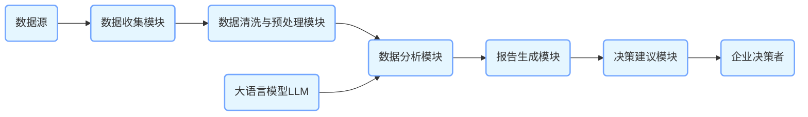

# 智能财务分析AI Agent：LLM在企业决策中的应用

> 关键词：智能财务分析、AI Agent、大语言模型（LLM）、企业决策、财务数据处理

> 摘要：本文聚焦于智能财务分析AI Agent在企业决策中的应用，探讨了大语言模型（LLM）在这一领域的关键作用。详细介绍了智能财务分析AI Agent的核心概念、算法原理、数学模型，通过实际案例展示了其在企业中的具体应用。同时，提供了学习资源、开发工具和相关论文的推荐，最后对未来发展趋势与挑战进行了总结，并解答了常见问题。旨在帮助企业更好地利用智能财务分析AI Agent进行科学决策，提升竞争力。

## 1. 背景介绍 
### 1.1 目的和范围
随着企业数字化转型的加速，财务数据量呈爆炸式增长，传统的财务分析方法已难以满足企业快速、精准决策的需求。智能财务分析AI Agent结合了大语言模型（LLM）的强大语言理解和生成能力，能够对海量财务数据进行深入分析，为企业决策提供有力支持。本文的目的在于全面介绍智能财务分析AI Agent的原理、应用和发展趋势，探讨其在企业决策中的具体应用场景和价值。范围涵盖了从核心概念的解释到实际案例的分析，以及相关工具和资源的推荐。

### 1.2 预期读者
本文预期读者包括企业财务管理人员、决策者、IT技术人员、人工智能研究者以及对智能财务分析和企业决策感兴趣的人士。财务管理人员可以从中了解如何利用新技术提升财务分析效率和准确性；决策者可以掌握智能财务分析对企业战略决策的重要性；IT技术人员可以学习相关技术的实现方法；人工智能研究者可以关注该领域的最新发展动态；而对相关领域感兴趣的人士则可以获得全面的知识普及。

### 1.3 文档结构概述
本文将按照以下结构展开：首先介绍核心概念与联系，包括智能财务分析AI Agent和大语言模型的定义、原理和架构；接着详细阐述核心算法原理和具体操作步骤，并给出Python源代码示例；然后介绍数学模型和公式，通过具体例子进行说明；再通过项目实战展示代码的实际应用和详细解释；之后探讨实际应用场景；推荐相关的工具和资源；总结未来发展趋势与挑战；提供常见问题的解答；最后列出扩展阅读和参考资料。

### 1.4 术语表
#### 1.4.1 核心术语定义
- **智能财务分析AI Agent**：一种基于人工智能技术的智能体，能够自动收集、处理和分析财务数据，生成财务分析报告，并为企业决策提供建议。
- **大语言模型（LLM）**：一种基于深度学习的自然语言处理模型，具有强大的语言理解和生成能力，能够处理各种自然语言任务，如文本生成、问答系统等。
- **企业决策**：企业为了实现特定的目标，在多个可行方案中选择最优方案的过程。
- **财务数据**：企业在生产经营过程中产生的各种经济数据，包括财务报表、会计凭证、税务数据等。

#### 1.4.2 相关概念解释
- **自然语言处理（NLP）**：研究计算机与人类语言之间交互的技术，包括文本分类、情感分析、机器翻译等任务。大语言模型是自然语言处理领域的重要成果之一。
- **机器学习**：一门多领域交叉学科，涉及概率论、统计学、逼近论、凸分析、算法复杂度理论等多门学科。它专门研究计算机怎样模拟或实现人类的学习行为，以获取新的知识或技能，重新组织已有的知识结构使之不断改善自身的性能。智能财务分析AI Agent通常会使用机器学习算法进行数据处理和分析。

#### 1.4.3 缩略词列表
- **LLM**：Large Language Model（大语言模型）
- **AI**：Artificial Intelligence（人工智能）
- **NLP**：Natural Language Processing（自然语言处理）

## 2. 核心概念与联系 

### 智能财务分析AI Agent的定义
智能财务分析AI Agent是一种具备自主学习和决策能力的智能系统，它可以模拟人类财务分析师的思维和行为，对企业的财务数据进行全面、深入的分析。该智能体能够自动从各种数据源中收集财务数据，进行数据清洗和预处理，运用先进的分析方法和模型对数据进行挖掘和分析，最后以自然语言的形式生成财务分析报告，并为企业决策提供有针对性的建议。

### 大语言模型（LLM）的原理
大语言模型基于深度学习技术，通常采用Transformer架构。Transformer架构通过自注意力机制（Self-Attention）来捕捉输入序列中不同位置之间的依赖关系，从而能够更好地理解和处理长文本。大语言模型在大规模的文本数据上进行无监督学习，学习到语言的语法、语义和上下文信息。在训练过程中，模型通过预测下一个单词或字符来优化自身的参数，从而不断提高语言理解和生成能力。

### 智能财务分析AI Agent与LLM的联系
智能财务分析AI Agent可以利用大语言模型的强大语言能力来处理和分析财务数据。具体来说，LLM可以用于以下几个方面：
- **数据理解**：LLM能够理解财务数据中的自然语言描述，如财务报表中的注释、会计政策说明等，从而更好地解读数据背后的含义。
- **报告生成**：将分析结果以自然语言的形式生成详细、易懂的财务分析报告，方便企业决策者阅读和理解。
- **决策建议**：根据财务数据和分析结果，为企业决策提供合理的建议，这些建议可以用自然语言清晰地表达出来。

### 架构示意图


这个架构图展示了智能财务分析AI Agent的主要组成部分和工作流程。首先，数据收集模块从各种数据源中收集财务数据，然后经过数据清洗与预处理模块进行数据清理和转换。数据分析模块利用大语言模型和其他分析方法对数据进行深入分析。报告生成模块将分析结果转化为自然语言报告，决策建议模块根据分析结果为企业决策者提供建议。

## 3. 核心算法原理 & 具体操作步骤 

### 核心算法原理
智能财务分析AI Agent的核心算法主要包括数据处理算法、分析算法和大语言模型的应用算法。

#### 数据处理算法
数据处理算法主要用于数据的收集、清洗和预处理。常见的数据处理算法包括：
- **数据收集算法**：可以使用网络爬虫技术从企业内部数据库、财务报表网站等数据源中收集财务数据。例如，使用Python的`requests`库和`BeautifulSoup`库可以实现简单的网页数据爬取。
```python
import requests
from bs4 import BeautifulSoup

url = 'https://example.com/financial-statements'
response = requests.get(url)
soup = BeautifulSoup(response.text, 'html.parser')
# 解析网页数据，提取财务信息
financial_data = soup.find_all('td', class_='financial-data')
```
- **数据清洗算法**：用于去除数据中的噪声、重复值和缺失值。例如，可以使用Python的`pandas`库进行数据清洗。
```python
import pandas as pd

# 假设data是一个包含财务数据的DataFrame
data = pd.read_csv('financial_data.csv')
# 去除重复值
data = data.drop_duplicates()
# 处理缺失值
data = data.fillna(0)
```
- **数据预处理算法**：包括数据归一化、编码等操作，以便后续的分析和建模。例如，可以使用`sklearn`库进行数据归一化。
```python
from sklearn.preprocessing import MinMaxScaler

scaler = MinMaxScaler()
normalized_data = scaler.fit_transform(data)
```

#### 分析算法
分析算法用于对财务数据进行深入分析，常见的分析算法包括：
- **财务比率分析**：计算各种财务比率，如偿债能力比率、盈利能力比率、营运能力比率等，以评估企业的财务状况。
```python
# 计算流动比率（流动资产 / 流动负债）
current_ratio = data['current_assets'] / data['current_liabilities']
```
- **趋势分析**：分析财务数据随时间的变化趋势，以预测企业的未来发展。可以使用时间序列分析方法，如ARIMA模型。
```python
from statsmodels.tsa.arima.model import ARIMA

# 假设financial_series是一个时间序列数据
model = ARIMA(financial_series, order=(1, 1, 1))
model_fit = model.fit()
forecast = model_fit.forecast(steps=10)
```

#### 大语言模型的应用算法
大语言模型的应用算法主要用于文本生成和问答系统。可以使用开源的大语言模型，如Hugging Face的Transformers库中的模型。
```python
from transformers import AutoTokenizer, AutoModelForCausalLM

tokenizer = AutoTokenizer.from_pretrained("gpt2")
model = AutoModelForCausalLM.from_pretrained("gpt2")

input_text = "请分析这家企业的财务状况"
input_ids = tokenizer.encode(input_text, return_tensors='pt')
output = model.generate(input_ids, max_length=100, num_beams=5, no_repeat_ngram_size=2)
generated_text = tokenizer.decode(output[0], skip_special_tokens=True)
print(generated_text)
```

### 具体操作步骤
1. **数据收集**：确定财务数据的来源，使用合适的数据收集算法从数据源中获取数据。
2. **数据清洗与预处理**：对收集到的数据进行清洗，去除噪声和缺失值，然后进行预处理，如归一化、编码等。
3. **数据分析**：运用各种分析算法对预处理后的数据进行分析，计算财务比率、进行趋势分析等。
4. **报告生成**：使用大语言模型将分析结果转化为自然语言报告。
5. **决策建议**：根据分析结果和报告，为企业决策提供建议。

## 4. 数学模型和公式 & 详细讲解 & 举例说明 

### 财务比率分析公式
#### 偿债能力比率
- **流动比率**：衡量企业短期偿债能力的指标，计算公式为：
$$流动比率 = \frac{流动资产}{流动负债}$$
例如，某企业的流动资产为100万元，流动负债为50万元，则流动比率为：
$$流动比率 = \frac{100}{50} = 2$$
一般来说，流动比率大于2表示企业具有较强的短期偿债能力。

- **资产负债率**：反映企业长期偿债能力的指标，计算公式为：
$$资产负债率 = \frac{负债总额}{资产总额} \times 100\%$$
假设某企业的负债总额为200万元，资产总额为500万元，则资产负债率为：
$$资产负债率 = \frac{200}{500} \times 100\% = 40\%$$
资产负债率越低，说明企业的长期偿债能力越强。

#### 盈利能力比率
- **毛利率**：衡量企业盈利能力的指标之一，计算公式为：
$$毛利率 = \frac{营业收入 - 营业成本}{营业收入} \times 100\%$$
若某企业的营业收入为300万元，营业成本为200万元，则毛利率为：
$$毛利率 = \frac{300 - 200}{300} \times 100\% \approx 33.33\%$$
毛利率越高，说明企业的盈利能力越强。

- **净利率**：反映企业最终盈利能力的指标，计算公式为：
$$净利率 = \frac{净利润}{营业收入} \times 100\%$$
假设某企业的净利润为50万元，营业收入为300万元，则净利率为：
$$净利率 = \frac{50}{300} \times 100\% \approx 16.67\%$$

#### 营运能力比率
- **存货周转率**：衡量企业存货管理效率的指标，计算公式为：
$$存货周转率 = \frac{营业成本}{平均存货余额}$$
其中，平均存货余额 = （期初存货余额 + 期末存货余额）/ 2。
例如，某企业的营业成本为200万元，期初存货余额为30万元，期末存货余额为50万元，则平均存货余额为（30 + 50）/ 2 = 40万元，存货周转率为：
$$存货周转率 = \frac{200}{40} = 5$$
存货周转率越高，说明企业的存货管理效率越高。

### 时间序列分析模型
#### ARIMA模型
ARIMA（Autoregressive Integrated Moving Average）模型是一种常用的时间序列分析模型，用于预测时间序列数据的未来值。其一般形式为ARIMA(p, d, q)，其中p表示自回归阶数，d表示差分阶数，q表示移动平均阶数。

ARIMA模型的数学公式为：
$$\phi(B)(1 - B)^d Y_t = \theta(B) \epsilon_t$$
其中，$Y_t$ 是时间序列数据，$B$ 是滞后算子，$\phi(B)$ 是自回归多项式，$\theta(B)$ 是移动平均多项式，$\epsilon_t$ 是白噪声序列。

例如，对于一个ARIMA(1, 1, 1)模型，其具体形式为：
$$(1 - \phi_1 B)(1 - B) Y_t = (1 + \theta_1 B) \epsilon_t$$
其中，$\phi_1$ 和 $\theta_1$ 是模型的参数。

### 举例说明
假设我们有一家企业过去12个月的销售额数据，我们可以使用ARIMA模型对未来3个月的销售额进行预测。

```python
import pandas as pd
from statsmodels.tsa.arima.model import ARIMA

# 假设sales_data是一个包含过去12个月销售额的Series
sales_data = pd.Series([100, 120, 130, 150, 160, 180, 200, 220, 230, 250, 260, 280])

# 拟合ARIMA(1, 1, 1)模型
model = ARIMA(sales_data, order=(1, 1, 1))
model_fit = model.fit()

# 预测未来3个月的销售额
forecast = model_fit.forecast(steps=3)
print(forecast)
```

## 5. 项目实战：代码实际案例和详细解释说明 

### 5.1  开发环境搭建
#### 安装Python
首先，需要安装Python环境，建议使用Python 3.7及以上版本。可以从Python官方网站（https://www.python.org/downloads/）下载并安装Python。

#### 安装必要的库
使用`pip`命令安装项目所需的库，包括`pandas`、`numpy`、`scikit-learn`、`transformers`等。
```bash
pip install pandas numpy scikit-learn transformers
```

### 5.2  源代码详细实现和代码解读
```python
import pandas as pd
from sklearn.preprocessing import MinMaxScaler
from statsmodels.tsa.arima.model import ARIMA
from transformers import AutoTokenizer, AutoModelForCausalLM

# 数据收集与预处理
def collect_and_preprocess_data(file_path):
    # 读取财务数据
    data = pd.read_csv(file_path)
    # 去除重复值
    data = data.drop_duplicates()
    # 处理缺失值
    data = data.fillna(0)
    # 数据归一化
    scaler = MinMaxScaler()
    numerical_columns = data.select_dtypes(include=['number']).columns
    data[numerical_columns] = scaler.fit_transform(data[numerical_columns])
    return data

# 财务比率分析
def financial_ratio_analysis(data):
    # 计算流动比率
    current_ratio = data['current_assets'] / data['current_liabilities']
    # 计算资产负债率
    debt_ratio = data['total_liabilities'] / data['total_assets']
    return current_ratio, debt_ratio

# 时间序列分析
def time_series_analysis(data, column_name):
    # 假设column_name是需要进行时间序列分析的列名
    series = data[column_name]
    # 拟合ARIMA(1, 1, 1)模型
    model = ARIMA(series, order=(1, 1, 1))
    model_fit = model.fit()
    # 预测未来10个周期的值
    forecast = model_fit.forecast(steps=10)
    return forecast

# 报告生成
def generate_report(current_ratio, debt_ratio, forecast):
    tokenizer = AutoTokenizer.from_pretrained("gpt2")
    model = AutoModelForCausalLM.from_pretrained("gpt2")

    input_text = f"企业的流动比率为{current_ratio.mean()}, 资产负债率为{debt_ratio.mean()}. 未来10个周期的预测值为{forecast.tolist()}. 请分析这家企业的财务状况并给出决策建议。"
    input_ids = tokenizer.encode(input_text, return_tensors='pt')
    output = model.generate(input_ids, max_length=200, num_beams=5, no_repeat_ngram_size=2)
    report = tokenizer.decode(output[0], skip_special_tokens=True)
    return report

# 主函数
def main():
    file_path = 'financial_data.csv'
    data = collect_and_preprocess_data(file_path)
    current_ratio, debt_ratio = financial_ratio_analysis(data)
    forecast = time_series_analysis(data, 'sales')
    report = generate_report(current_ratio, debt_ratio, forecast)
    print(report)

if __name__ == "__main__":
    main()
```

### 5.3  代码解读与分析
- **数据收集与预处理**：`collect_and_preprocess_data`函数用于读取财务数据文件，去除重复值和处理缺失值，然后对数值型数据进行归一化处理。
- **财务比率分析**：`financial_ratio_analysis`函数计算企业的流动比率和资产负债率，这两个指标可以反映企业的偿债能力。
- **时间序列分析**：`time_series_analysis`函数使用ARIMA模型对指定列的数据进行时间序列分析，并预测未来10个周期的值。
- **报告生成**：`generate_report`函数使用大语言模型将分析结果转化为自然语言报告。
- **主函数**：`main`函数调用上述函数，完成数据处理、分析和报告生成的整个流程，并打印生成的报告。

## 6. 实际应用场景 
### 财务风险评估
智能财务分析AI Agent可以通过分析企业的财务数据，计算各种财务比率和风险指标，如资产负债率、流动比率、利息保障倍数等，对企业的财务风险进行评估。根据评估结果，为企业提供风险预警和应对建议，帮助企业及时发现和解决潜在的财务问题。

### 投资决策支持
在企业进行投资决策时，智能财务分析AI Agent可以对投资项目的财务状况进行深入分析，包括预测项目的未来收益、现金流和风险等。通过与同行业其他项目进行比较，为企业提供投资建议，帮助企业选择最优的投资项目。

### 预算编制与控制
智能财务分析AI Agent可以根据企业的历史财务数据和业务发展计划，预测未来的收入、成本和利润等指标，为企业的预算编制提供依据。在预算执行过程中，实时监控预算执行情况，及时发现偏差并提供调整建议，帮助企业实现预算目标。

### 战略规划制定
通过对企业的财务数据和市场环境进行分析，智能财务分析AI Agent可以为企业的战略规划制定提供支持。例如，分析企业的优势和劣势、市场机会和威胁，帮助企业确定战略方向和目标，制定相应的战略措施。

## 7. 工具和资源推荐
### 7.1 学习资源推荐
#### 7.1.1 书籍推荐
- 《Python for Data Analysis》：介绍了使用Python进行数据处理和分析的方法和技巧，是数据科学领域的经典书籍。
- 《Hands-On Machine Learning with Scikit-Learn, Keras, and TensorFlow》：详细讲解了机器学习和深度学习的理论和实践，适合想要深入学习人工智能技术的读者。
- 《Financial Statement Analysis》：全面介绍了财务报表分析的方法和技术，对于理解企业财务状况和进行财务分析非常有帮助。

#### 7.1.2 在线课程
- Coursera上的“Data Science Specialization”：由多所知名大学的教授授课，涵盖了数据科学的各个方面，包括数据处理、机器学习、深度学习等。
- edX上的“Artificial Intelligence for Trading”：介绍了人工智能在金融交易领域的应用，包括量化交易、风险评估等。
- Udemy上的“Python for Finance: Investment Fundamentals & Data Analytics”：专门讲解了使用Python进行金融数据分析和投资决策的方法。

#### 7.1.3 技术博客和网站
- Towards Data Science：一个专注于数据科学和人工智能的博客平台，上面有很多优秀的技术文章和案例分析。
- Medium上的AI and Machine Learning：汇集了人工智能和机器学习领域的最新技术和研究成果。
- Kaggle：一个数据科学竞赛平台，上面有很多真实的数据集和优秀的解决方案，可以学习到很多实用的数据分析和机器学习技巧。

### 7.2 开发工具框架推荐
#### 7.2.1 IDE和编辑器
- PyCharm：一款专业的Python集成开发环境，具有代码编辑、调试、版本控制等功能，适合开发Python项目。
- Jupyter Notebook：一个交互式的开发环境，支持Python、R等多种编程语言，非常适合进行数据探索和分析。
- Visual Studio Code：一款轻量级的代码编辑器，支持多种编程语言和插件，具有丰富的扩展功能。

#### 7.2.2 调试和性能分析工具
- PDB：Python自带的调试工具，可以帮助开发者逐步调试代码，查找问题。
- cProfile：Python的性能分析工具，可以分析代码的运行时间和函数调用情况，帮助开发者优化代码性能。
- TensorBoard：TensorFlow的可视化工具，可以帮助开发者可视化模型的训练过程和性能指标。

#### 7.2.3 相关框架和库
- Pandas：一个强大的数据处理和分析库，提供了DataFrame等数据结构，方便进行数据清洗、转换和分析。
- Scikit-learn：一个常用的机器学习库，提供了各种机器学习算法和工具，如分类、回归、聚类等。
- Transformers：Hugging Face开发的自然语言处理库，提供了多种预训练的大语言模型，方便进行文本生成、问答系统等任务。

### 7.3 相关论文著作推荐
#### 7.3.1 经典论文
- “Attention Is All You Need”：介绍了Transformer架构，是大语言模型的基础。
- “A Systematic Framework for Intelligent Financial Analysis Using Machine Learning Techniques”：提出了一种使用机器学习技术进行智能财务分析的系统框架。
- “Financial Ratio Analysis: A Review of the Literature”：对财务比率分析的相关文献进行了综述。

#### 7.3.2 最新研究成果
- 可以关注顶级学术会议和期刊，如NeurIPS、ICML、Journal of Financial Economics等，获取智能财务分析和大语言模型领域的最新研究成果。

#### 7.3.3 应用案例分析
- 一些知名企业和研究机构会发布智能财务分析的应用案例，可以通过企业官网、研究报告等渠道获取这些案例，学习实际应用中的经验和方法。

## 8. 总结：未来发展趋势与挑战
### 未来发展趋势
- **多模态融合**：未来的智能财务分析AI Agent将不仅仅局限于处理文本数据，还会融合图像、语音等多模态数据，实现更全面、深入的财务分析。例如，通过分析企业的财务报表图像、财务会议语音记录等，获取更多的财务信息。
- **个性化定制**：根据不同企业的行业特点、规模和需求，提供个性化的财务分析服务和决策建议。智能财务分析AI Agent将能够更好地理解企业的业务模式和战略目标，为企业量身定制分析方案。
- **与区块链技术结合**：区块链技术具有去中心化、不可篡改等特点，可以提高财务数据的安全性和可信度。智能财务分析AI Agent与区块链技术结合，将能够更好地处理和分析区块链上的财务数据，为企业提供更可靠的决策支持。
- **实时分析与决策**：随着数据处理技术和通信技术的不断发展，智能财务分析AI Agent将能够实现实时的数据收集、处理和分析，为企业提供实时的决策建议。企业可以根据实时的财务信息及时调整战略和决策，提高市场竞争力。

### 挑战
- **数据质量问题**：财务数据的质量直接影响智能财务分析的准确性和可靠性。然而，企业的财务数据往往存在噪声、缺失值和错误等问题，需要进行大量的数据清洗和预处理工作。此外，数据的安全性和隐私保护也是一个重要的问题。
- **模型可解释性**：大语言模型等人工智能模型通常是黑盒模型，其决策过程和结果难以解释。在企业决策中，决策者需要了解模型的决策依据和原理，以便做出合理的决策。因此，提高模型的可解释性是一个亟待解决的问题。
- **技术成本**：开发和应用智能财务分析AI Agent需要投入大量的技术资源和资金，包括硬件设备、软件开发、数据存储等方面的成本。对于一些中小企业来说，可能难以承担这些成本。
- **法律法规和伦理问题**：智能财务分析AI Agent的应用涉及到大量的企业财务数据和个人信息，需要遵守相关的法律法规和伦理规范。例如，数据的使用和共享需要获得用户的授权，避免数据泄露和滥用等问题。

## 9. 附录：常见问题与解答
### 问题1：智能财务分析AI Agent能否完全替代人类财务分析师？
解答：虽然智能财务分析AI Agent具有强大的数据分析和处理能力，但目前还不能完全替代人类财务分析师。人类财务分析师具有丰富的经验和专业知识，能够进行复杂的判断和决策，同时还能与企业内部和外部的人员进行沟通和协作。智能财务分析AI Agent可以作为人类财务分析师的辅助工具，帮助他们提高工作效率和准确性。

### 问题2：如何确保智能财务分析AI Agent的分析结果准确可靠？
解答：为了确保分析结果的准确可靠，需要从以下几个方面入手：
- **数据质量**：保证财务数据的准确性、完整性和一致性，进行充分的数据清洗和预处理。
- **模型选择和训练**：选择合适的分析模型，并使用大量的高质量数据进行训练和优化。
- **模型评估和验证**：使用多种评估指标对模型进行评估和验证，确保模型的性能和稳定性。
- **人工审核**：对分析结果进行人工审核和验证，结合人类的经验和判断进行综合分析。

### 问题3：智能财务分析AI Agent需要哪些数据？
解答：智能财务分析AI Agent需要企业的各种财务数据，包括财务报表（如资产负债表、利润表、现金流量表）、会计凭证、税务数据等。此外，还可以结合企业的业务数据、市场数据等进行综合分析，以获取更全面的信息。

### 问题4：如何选择适合企业的智能财务分析AI Agent？
解答：选择适合企业的智能财务分析AI Agent需要考虑以下几个因素：
- **功能需求**：根据企业的具体需求，选择具有相应功能的AI Agent，如财务风险评估、投资决策支持等。
- **数据兼容性**：确保AI Agent能够支持企业现有的数据格式和数据源，方便数据的导入和处理。
- **性能和稳定性**：选择性能稳定、处理速度快的AI Agent，以满足企业的实时分析需求。
- **可扩展性**：考虑AI Agent的可扩展性，以便在企业发展和需求变化时能够进行功能扩展和升级。
- **成本**：综合考虑AI Agent的购买成本、使用成本和维护成本，选择性价比高的产品。

## 10. 扩展阅读 & 参考资料
- 《人工智能：现代方法》
- 《数据挖掘：概念与技术》
- 维基百科上关于智能财务分析、大语言模型等相关词条
- 相关行业报告和研究机构发布的资料

作者：AI天才研究院/AI Genius Institute & 禅与计算机程序设计艺术 /Zen And The Art of Computer Programming