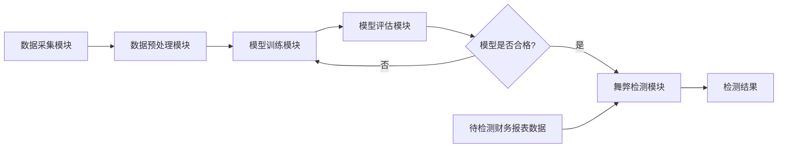

# 智能财务报表舞弊检测系统

> 关键词：智能财务报表舞弊检测、数据挖掘、机器学习、深度学习、异常检测

> 摘要：本文围绕智能财务报表舞弊检测系统展开深入探讨。首先介绍了该系统开发的背景、目的、预期读者及文档结构，明确了相关术语。接着阐述了核心概念，包括财务报表舞弊的类型及检测系统的架构，并通过 Mermaid 流程图进行展示。详细讲解了核心算法原理，结合 Python 代码说明具体操作步骤。同时给出了数学模型和公式，并举例说明。通过项目实战，从开发环境搭建、源代码实现到代码解读，全面呈现系统开发过程。分析了该系统的实际应用场景，推荐了学习资源、开发工具框架及相关论文著作。最后总结了系统未来发展趋势与挑战，还设置了常见问题解答和扩展阅读参考资料。旨在为读者全面呈现智能财务报表舞弊检测系统的技术全貌和应用前景。

## 1. 背景介绍 
### 1.1 目的和范围
财务报表作为企业财务状况和经营成果的重要反映，其真实性和可靠性对于投资者、债权人、监管机构等利益相关者至关重要。然而，财务报表舞弊现象时有发生，给市场秩序和投资者利益带来了严重损害。智能财务报表舞弊检测系统的目的在于利用先进的信息技术和数据分析方法，快速、准确地识别财务报表中的舞弊行为，为利益相关者提供决策支持，维护市场的公平、公正和稳定。

本系统的范围涵盖了常见的财务报表舞弊类型，如收入操纵、费用隐瞒、资产高估、负债低估等。通过对财务报表数据、企业经营数据以及相关外部数据的分析，挖掘潜在的舞弊线索。同时，系统具备可扩展性，能够适应不同行业、不同规模企业的财务报表检测需求。

### 1.2 预期读者
- **投资者**：帮助投资者识别投资对象的财务报表真实性，降低投资风险，做出更明智的投资决策。
- **债权人**：评估借款企业的财务状况和信用风险，确保债权的安全。
- **监管机构**：提高监管效率，及时发现企业的财务违规行为，维护市场秩序。
- **企业内部审计人员**：辅助内部审计工作，发现企业内部可能存在的财务舞弊问题，加强企业内部控制。
- **科研人员**：为财务报表舞弊检测领域的研究提供实践参考和技术思路。

### 1.3 文档结构概述
本文将按照以下结构进行阐述：
- 核心概念与联系：介绍财务报表舞弊的核心概念、类型以及检测系统的架构。
- 核心算法原理 & 具体操作步骤：详细讲解用于舞弊检测的核心算法，并给出 Python 代码示例。
- 数学模型和公式 & 详细讲解 & 举例说明：建立数学模型，给出相关公式，并通过实际例子进行说明。
- 项目实战：代码实际案例和详细解释说明，包括开发环境搭建、源代码实现和代码解读。
- 实际应用场景：分析智能财务报表舞弊检测系统在不同场景下的应用。
- 工具和资源推荐：推荐学习资源、开发工具框架和相关论文著作。
- 总结：未来发展趋势与挑战：总结系统的发展趋势和面临的挑战。
- 附录：常见问题与解答：解答读者可能遇到的常见问题。
- 扩展阅读 & 参考资料：提供相关的扩展阅读材料和参考资料。

### 1.4 术语表
#### 1.4.1 核心术语定义
- **财务报表舞弊**：企业管理层或相关人员为了达到特定目的，故意操纵财务报表数据，使其不能真实反映企业的财务状况和经营成果的行为。
- **异常检测**：通过对数据的分析，识别出与正常模式偏离较大的数据点或数据模式，这些异常可能是舞弊行为的表现。
- **机器学习**：让计算机通过数据学习模式和规律，从而对未知数据进行预测和分类的技术。
- **深度学习**：机器学习的一个分支，通过构建多层神经网络，自动学习数据的深层次特征和模式。
- **特征工程**：从原始数据中提取有价值的特征，以提高模型的性能和准确性。

#### 1.4.2 相关概念解释
- **数据挖掘**：从大量数据中发现有价值的信息和知识的过程，包括数据预处理、特征选择、模型构建等步骤。
- **模型评估**：使用评估指标（如准确率、召回率、F1 值等）来衡量模型的性能和效果。
- **过拟合**：模型在训练数据上表现良好，但在测试数据上表现不佳的现象，通常是由于模型过于复杂导致的。
- **欠拟合**：模型在训练数据和测试数据上的表现都不佳的现象，通常是由于模型过于简单导致的。

#### 1.4.3 缩略词列表
- **PCA**：Principal Component Analysis，主成分分析
- **SVM**：Support Vector Machine，支持向量机
- **ANN**：Artificial Neural Network，人工神经网络
- **LSTM**：Long Short-Term Memory，长短期记忆网络
- **ROC**：Receiver Operating Characteristic，受试者工作特征曲线
- **AUC**：Area Under the Curve，曲线下面积

## 2. 核心概念与联系 
### 2.1 财务报表舞弊的类型
财务报表舞弊的类型多种多样，常见的有以下几种：
- **收入舞弊**：通过虚构销售交易、提前确认收入、推迟确认销售退回等方式来虚增收入。例如，企业可能与关联方签订虚假销售合同，或者在商品尚未发出时就确认收入。
- **费用舞弊**：隐瞒或推迟确认费用，以虚增利润。比如，企业可能将应计入当期的费用资本化，或者将一些费用推迟到以后期间确认。
- **资产舞弊**：高估资产价值，如虚增存货、固定资产等的账面价值。企业可能通过虚构存货数量、高估固定资产的折旧年限等方式来达到目的。
- **负债舞弊**：低估负债，如隐瞒债务、推迟确认负债等。例如，企业可能不披露或推迟披露未决诉讼、担保责任等潜在负债。

### 2.2 智能财务报表舞弊检测系统的架构
智能财务报表舞弊检测系统主要由以下几个部分组成：
- **数据采集模块**：负责收集企业的财务报表数据、经营数据以及相关的外部数据，如行业数据、宏观经济数据等。
- **数据预处理模块**：对采集到的数据进行清洗、转换和特征工程，以提高数据的质量和可用性。
- **模型训练模块**：使用机器学习或深度学习算法对预处理后的数据进行训练，构建舞弊检测模型。
- **模型评估模块**：使用评估指标对训练好的模型进行评估，选择性能最优的模型。
- **舞弊检测模块**：将待检测的财务报表数据输入到训练好的模型中，进行舞弊检测，并输出检测结果。

### 2.3 核心概念的联系
财务报表舞弊的类型是舞弊检测的目标，而智能财务报表舞弊检测系统的各个模块则是为了实现对这些舞弊类型的准确检测。数据采集模块为后续的分析提供了数据基础，数据预处理模块对数据进行清洗和转换，以便模型能够更好地学习数据中的模式和规律。模型训练模块根据不同的算法和数据构建舞弊检测模型，模型评估模块确保模型的性能和准确性。最后，舞弊检测模块利用训练好的模型对新的财务报表数据进行检测，识别潜在的舞弊行为。

### 2.4 文本示意图
```plaintext
智能财务报表舞弊检测系统
|-- 数据采集模块
|   |-- 财务报表数据
|   |-- 经营数据
|   |-- 外部数据
|-- 数据预处理模块
|   |-- 数据清洗
|   |-- 数据转换
|   |-- 特征工程
|-- 模型训练模块
|   |-- 机器学习算法
|   |-- 深度学习算法
|-- 模型评估模块
|   |-- 评估指标
|-- 舞弊检测模块
|   |-- 检测结果
```

### 2.5 Mermaid 流程图


## 3. 核心算法原理 & 具体操作步骤 
### 3.1 主成分分析（PCA）
#### 3.1.1 算法原理
主成分分析是一种无监督学习算法，用于数据降维和特征提取。其基本思想是通过线性变换将原始数据转换为一组互不相关的主成分，其中第一主成分具有最大的方差，后续主成分的方差依次递减。通过保留方差较大的主成分，可以在减少数据维度的同时保留数据的主要信息。

#### 3.1.2 Python 代码实现
```python
import numpy as np
from sklearn.decomposition import PCA

# 生成示例数据
X = np.array([[1, 2, 3], [4, 5, 6], [7, 8, 9], [10, 11, 12]])

# 创建 PCA 对象，指定要保留的主成分数量
pca = PCA(n_components=2)

# 拟合数据并进行降维
X_pca = pca.fit_transform(X)

print("原始数据形状:", X.shape)
print("降维后数据形状:", X_pca.shape)
```

#### 3.1.3 具体操作步骤
1. 数据标准化：对原始数据进行标准化处理，使每个特征的均值为 0，标准差为 1。
2. 计算协方差矩阵：计算标准化后数据的协方差矩阵。
3. 特征值分解：对协方差矩阵进行特征值分解，得到特征值和特征向量。
4. 选择主成分：根据特征值的大小选择前 k 个特征向量，组成投影矩阵。
5. 数据投影：将原始数据投影到投影矩阵上，得到降维后的数据。

### 3.2 支持向量机（SVM）
#### 3.2.1 算法原理
支持向量机是一种有监督学习算法，用于分类和回归分析。其基本思想是在特征空间中找到一个最优的超平面，将不同类别的数据分隔开来，使得不同类别的数据到超平面的距离最大。对于线性可分的数据，SVM 可以找到一个线性超平面进行分类；对于线性不可分的数据，SVM 可以通过核函数将数据映射到高维空间，使其在高维空间中线性可分。

#### 3.2.2 Python 代码实现
```python
from sklearn import datasets
from sklearn.model_selection import train_test_split
from sklearn.svm import SVC
from sklearn.metrics import accuracy_score

# 加载鸢尾花数据集
iris = datasets.load_iris()
X = iris.data
y = iris.target

# 划分训练集和测试集
X_train, X_test, y_train, y_test = train_test_split(X, y, test_size=0.3, random_state=42)

# 创建 SVM 分类器
clf = SVC(kernel='linear')

# 训练模型
clf.fit(X_train, y_train)

# 预测测试集
y_pred = clf.predict(X_test)

# 计算准确率
accuracy = accuracy_score(y_test, y_pred)
print("准确率:", accuracy)
```

#### 3.2.3 具体操作步骤
1. 数据准备：将数据集划分为训练集和测试集。
2. 模型选择：选择合适的核函数（如线性核、多项式核、径向基核等）和参数。
3. 模型训练：使用训练集对 SVM 模型进行训练。
4. 模型预测：使用训练好的模型对测试集进行预测。
5. 模型评估：使用评估指标（如准确率、召回率、F1 值等）对模型的性能进行评估。

### 3.3 人工神经网络（ANN）
#### 3.3.1 算法原理
人工神经网络是一种模仿人类神经系统的计算模型，由大量的神经元组成。每个神经元接收输入信号，经过加权求和和非线性激活函数处理后，输出一个结果。多个神经元按照一定的层次结构连接在一起，形成神经网络。通过调整神经元之间的连接权重，神经网络可以学习数据中的模式和规律，从而进行分类、回归等任务。

#### 3.3.2 Python 代码实现
```python
import tensorflow as tf
from tensorflow.keras.datasets import mnist
from tensorflow.keras.models import Sequential
from tensorflow.keras.layers import Dense, Flatten

# 加载 MNIST 数据集
(x_train, y_train), (x_test, y_test) = mnist.load_data()

# 数据预处理
x_train = x_train / 255.0
x_test = x_test / 255.0

# 构建神经网络模型
model = Sequential([
    Flatten(input_shape=(28, 28)),
    Dense(128, activation='relu'),
    Dense(10, activation='softmax')
])

# 编译模型
model.compile(optimizer='adam',
              loss='sparse_categorical_crossentropy',
              metrics=['accuracy'])

# 训练模型
model.fit(x_train, y_train, epochs=5)

# 评估模型
test_loss, test_acc = model.evaluate(x_test, y_test)
print("测试准确率:", test_acc)
```

#### 3.3.3 具体操作步骤
1. 数据准备：对数据进行预处理，如归一化、编码等。
2. 模型构建：选择合适的神经网络结构，包括输入层、隐藏层和输出层的神经元数量和激活函数。
3. 模型编译：指定损失函数、优化器和评估指标。
4. 模型训练：使用训练集对神经网络模型进行训练，调整神经元之间的连接权重。
5. 模型评估：使用测试集对训练好的模型进行评估，检查模型的性能和准确性。

## 4. 数学模型和公式 & 详细讲解 & 举例说明 
### 4.1 主成分分析（PCA）的数学模型和公式
#### 4.1.1 协方差矩阵
设 $X$ 是一个 $n\times p$ 的数据矩阵，其中 $n$ 是样本数量，$p$ 是特征数量。$X$ 的协方差矩阵 $S$ 定义为：
$$S = \frac{1}{n - 1}(X - \bar{X})^T(X - \bar{X})$$
其中，$\bar{X}$ 是 $X$ 的均值矩阵。

#### 4.1.2 特征值分解
对协方差矩阵 $S$ 进行特征值分解，得到特征值 $\lambda_1, \lambda_2, \cdots, \lambda_p$ 和对应的特征向量 $u_1, u_2, \cdots, u_p$，满足：
$$Su_i = \lambda_iu_i, \quad i = 1, 2, \cdots, p$$

#### 4.1.3 主成分
将原始数据 $X$ 投影到特征向量 $u_i$ 上，得到第 $i$ 个主成分 $z_i$：
$$z_i = X u_i$$

#### 4.1.4 举例说明
假设我们有一个二维数据集 $X = \begin{bmatrix}1 & 2 \\ 3 & 4 \\ 5 & 6\end{bmatrix}$，首先计算均值矩阵 $\bar{X}$：
$$\bar{X} = \begin{bmatrix}\frac{1 + 3 + 5}{3} & \frac{2 + 4 + 6}{3}\end{bmatrix} = \begin{bmatrix}3 & 4\end{bmatrix}$$
然后计算协方差矩阵 $S$：
$$S = \frac{1}{3 - 1}\begin{bmatrix}-2 & -2 \\ 0 & 0 \\ 2 & 2\end{bmatrix}^T\begin{bmatrix}-2 & -2 \\ 0 & 0 \\ 2 & 2\end{bmatrix} = \begin{bmatrix}4 & 4 \\ 4 & 4\end{bmatrix}$$
对协方差矩阵 $S$ 进行特征值分解，得到特征值 $\lambda_1 = 8$，$\lambda_2 = 0$，对应的特征向量 $u_1 = \begin{bmatrix}\frac{1}{\sqrt{2}} \\ \frac{1}{\sqrt{2}}\end{bmatrix}$，$u_2 = \begin{bmatrix}-\frac{1}{\sqrt{2}} \\ \frac{1}{\sqrt{2}}\end{bmatrix}$。选择第一个主成分 $z_1 = X u_1$，得到降维后的数据。

### 4.2 支持向量机（SVM）的数学模型和公式
#### 4.2.1 线性可分情况下的 SVM
对于线性可分的二分类问题，假设数据集为 $(x_1, y_1), (x_2, y_2), \cdots, (x_n, y_n)$，其中 $x_i \in \mathbb{R}^p$ 是特征向量，$y_i \in \{-1, 1\}$ 是类别标签。SVM 的目标是找到一个超平面 $w^T x + b = 0$，使得不同类别的数据到超平面的距离最大。这个问题可以转化为以下优化问题：
$$\min_{w, b} \frac{1}{2}||w||^2$$
$$\text{s.t. } y_i(w^T x_i + b) \geq 1, \quad i = 1, 2, \cdots, n$$
其中，$w$ 是超平面的法向量，$b$ 是截距。

#### 4.2.2 引入松弛变量的 SVM
对于线性不可分的情况，引入松弛变量 $\xi_i \geq 0$，允许一些样本点违反约束条件。优化问题变为：
$$\min_{w, b, \xi} \frac{1}{2}||w||^2 + C\sum_{i = 1}^{n}\xi_i$$
$$\text{s.t. } y_i(w^T x_i + b) \geq 1 - \xi_i, \quad \xi_i \geq 0, \quad i = 1, 2, \cdots, n$$
其中，$C$ 是惩罚参数，用于控制模型的复杂度和分类误差之间的平衡。

#### 4.2.3 核函数
为了处理非线性可分的问题，引入核函数 $K(x_i, x_j)$，将原始数据映射到高维空间。优化问题变为：
$$\min_{\alpha} \frac{1}{2}\sum_{i = 1}^{n}\sum_{j = 1}^{n}\alpha_i\alpha_jy_iy_jK(x_i, x_j) - \sum_{i = 1}^{n}\alpha_i$$
$$\text{s.t. } \sum_{i = 1}^{n}\alpha_iy_i = 0, \quad 0 \leq \alpha_i \leq C, \quad i = 1, 2, \cdots, n$$
其中，$\alpha_i$ 是拉格朗日乘子。

#### 4.2.4 举例说明
假设有一个二维数据集，包含两个类别，通过 SVM 找到一个最优的超平面将两个类别分隔开来。可以使用不同的核函数（如线性核、径向基核）来处理线性可分和非线性可分的情况。

### 4.3 人工神经网络（ANN）的数学模型和公式
#### 4.3.1 神经元模型
神经元是神经网络的基本单元，其输入为 $x_1, x_2, \cdots, x_n$，对应的权重为 $w_1, w_2, \cdots, w_n$，偏置为 $b$。神经元的输出 $y$ 可以表示为：
$$y = f(\sum_{i = 1}^{n}w_ix_i + b)$$
其中，$f$ 是激活函数，常见的激活函数有 sigmoid 函数、ReLU 函数等。

#### 4.3.2 前向传播
对于一个多层神经网络，输入层的输入为 $x$，经过隐藏层的计算，最终输出层的输出为 $\hat{y}$。前向传播的过程可以表示为：
$$z^{(l)} = W^{(l)}a^{(l - 1)} + b^{(l)}$$
$$a^{(l)} = f(z^{(l)})$$
其中，$l$ 表示层数，$W^{(l)}$ 是第 $l$ 层的权重矩阵，$b^{(l)}$ 是第 $l$ 层的偏置向量，$a^{(l)}$ 是第 $l$ 层的激活值。

#### 4.3.3 反向传播
反向传播是用于训练神经网络的算法，通过计算损失函数对权重和偏置的梯度，更新权重和偏置的值，使得损失函数最小化。损失函数通常使用交叉熵损失函数、均方误差损失函数等。

#### 4.3.4 举例说明
以一个简单的两层神经网络为例，输入层有 2 个神经元，隐藏层有 3 个神经元，输出层有 1 个神经元。通过前向传播计算输出值，然后使用反向传播算法更新权重和偏置，不断迭代直到损失函数收敛。

## 5. 项目实战：代码实际案例和详细解释说明 
### 5.1  开发环境搭建
#### 5.1.1 安装 Python
首先，需要安装 Python 环境。可以从 Python 官方网站（https://www.python.org/downloads/）下载适合自己操作系统的 Python 安装包，并按照安装向导进行安装。建议安装 Python 3.7 及以上版本。

#### 5.1.2 安装必要的库
在命令行中使用以下命令安装必要的 Python 库：
```sh
pip install numpy pandas scikit-learn tensorflow matplotlib
```
- `numpy`：用于数值计算和数组操作。
- `pandas`：用于数据处理和分析。
- `scikit-learn`：提供了丰富的机器学习算法和工具。
- `tensorflow`：用于构建和训练深度学习模型。
- `matplotlib`：用于数据可视化。

### 5.2  源代码详细实现和代码解读
#### 5.2.1 数据加载和预处理
```python
import pandas as pd
from sklearn.preprocessing import StandardScaler
from sklearn.model_selection import train_test_split

# 加载数据集
data = pd.read_csv('financial_statements.csv')

# 分离特征和标签
X = data.drop('is_fraud', axis=1)
y = data['is_fraud']

# 数据标准化
scaler = StandardScaler()
X_scaled = scaler.fit_transform(X)

# 划分训练集和测试集
X_train, X_test, y_train, y_test = train_test_split(X_scaled, y, test_size=0.2, random_state=42)
```
代码解读：
- 使用 `pandas` 库的 `read_csv` 函数加载财务报表数据集。
- 分离特征和标签，其中 `is_fraud` 列表示是否存在舞弊行为。
- 使用 `StandardScaler` 对特征数据进行标准化处理，使得每个特征的均值为 0，标准差为 1。
- 使用 `train_test_split` 函数将数据集划分为训练集和测试集，测试集占比为 20%。

#### 5.2.2 模型训练和评估
```python
from sklearn.svm import SVC
from sklearn.metrics import accuracy_score, recall_score, f1_score

# 创建 SVM 分类器
clf = SVC(kernel='linear')

# 训练模型
clf.fit(X_train, y_train)

# 预测测试集
y_pred = clf.predict(X_test)

# 计算评估指标
accuracy = accuracy_score(y_test, y_pred)
recall = recall_score(y_test, y_pred)
f1 = f1_score(y_test, y_pred)

print("准确率:", accuracy)
print("召回率:", recall)
print("F1 值:", f1)
```
代码解读：
- 使用 `SVC` 类创建一个线性核的 SVM 分类器。
- 使用训练集对 SVM 模型进行训练。
- 使用训练好的模型对测试集进行预测。
- 使用 `accuracy_score`、`recall_score` 和 `f1_score` 函数计算准确率、召回率和 F1 值，评估模型的性能。

#### 5.2.3 使用深度学习模型
```python
import tensorflow as tf
from tensorflow.keras.models import Sequential
from tensorflow.keras.layers import Dense

# 构建神经网络模型
model = Sequential([
    Dense(64, activation='relu', input_shape=(X_train.shape[1],)),
    Dense(32, activation='relu'),
    Dense(1, activation='sigmoid')
])

# 编译模型
model.compile(optimizer='adam',
              loss='binary_crossentropy',
              metrics=['accuracy'])

# 训练模型
model.fit(X_train, y_train, epochs=10, batch_size=32, validation_data=(X_test, y_test))

# 评估模型
test_loss, test_acc = model.evaluate(X_test, y_test)
print("测试准确率:", test_acc)
```
代码解读：
- 使用 `Sequential` 模型构建一个简单的神经网络，包含两个隐藏层和一个输出层。
- 使用 `adam` 优化器和 `binary_crossentropy` 损失函数编译模型。
- 使用训练集对神经网络模型进行训练，设置训练轮数为 10，批次大小为 32。
- 使用测试集对训练好的模型进行评估，输出测试准确率。

### 5.3  代码解读与分析
#### 5.3.1 数据预处理的重要性
数据预处理是模型训练的重要步骤，通过标准化处理可以消除特征之间的量纲差异，使得模型能够更好地学习数据中的模式和规律。同时，将数据集划分为训练集和测试集可以评估模型的泛化能力，避免过拟合。

#### 5.3.2 SVM 模型的优缺点
SVM 模型的优点是在处理小样本、高维数据时表现良好，能够找到全局最优解，并且具有较好的泛化能力。缺点是对大规模数据集的训练效率较低，需要选择合适的核函数和参数。

#### 5.3.3 深度学习模型的特点
深度学习模型具有强大的特征学习能力，能够自动学习数据的深层次特征和模式。通过构建多层神经网络，可以处理复杂的非线性问题。然而，深度学习模型需要大量的训练数据和计算资源，并且容易出现过拟合问题，需要进行适当的正则化处理。

## 6. 实际应用场景 
### 6.1 投资者决策支持
投资者在进行投资决策时，需要对企业的财务状况进行评估。智能财务报表舞弊检测系统可以帮助投资者识别财务报表中的舞弊行为，降低投资风险。投资者可以根据检测结果，选择财务状况良好、信誉可靠的企业进行投资。

### 6.2 债权人风险评估
债权人在向企业提供贷款或信用时，需要评估企业的还款能力和信用风险。智能财务报表舞弊检测系统可以帮助债权人发现企业财务报表中的潜在问题，判断企业是否存在隐瞒债务、虚增资产等舞弊行为，从而做出更合理的信贷决策。

### 6.3 监管机构监管执法
监管机构负责维护市场秩序，打击财务报表舞弊行为。智能财务报表舞弊检测系统可以作为监管机构的辅助工具，帮助监管机构快速、准确地发现企业的财务违规行为，提高监管效率。监管机构可以根据检测结果，对涉嫌舞弊的企业进行调查和处罚。

### 6.4 企业内部审计
企业内部审计部门负责对企业的财务状况和内部控制进行审计。智能财务报表舞弊检测系统可以帮助内部审计人员发现企业内部可能存在的财务舞弊问题，加强企业内部控制。内部审计人员可以根据检测结果，对相关业务流程进行审查和改进，防范财务风险。

## 7. 工具和资源推荐
### 7.1 学习资源推荐
#### 7.1.1 书籍推荐
- 《Python 机器学习》（Sebastian Raschka 著）：介绍了使用 Python 进行机器学习的基本原理和方法，包括数据预处理、模型选择、评估等内容。
- 《深度学习》（Ian Goodfellow、Yoshua Bengio 和 Aaron Courville 著）：深度学习领域的经典著作，全面介绍了深度学习的理论和应用。
- 《数据挖掘：概念与技术》（Jiawei Han、Jian Pei 和 Micheline Kamber 著）：详细介绍了数据挖掘的基本概念、算法和应用，包括关联规则挖掘、分类、聚类等内容。

#### 7.1.2 在线课程
- Coursera 上的“机器学习”课程（Andrew Ng 教授）：经典的机器学习课程，涵盖了机器学习的基本概念、算法和应用。
- edX 上的“深度学习专业课程”：由深度学习领域的知名学者授课，深入介绍了深度学习的理论和实践。
- Kaggle 上的“微课程”：提供了丰富的数据分析和机器学习实践课程，通过实际案例帮助学习者提高技能。

#### 7.1.3 技术博客和网站
- Medium：一个技术博客平台，有许多机器学习和数据分析领域的优秀文章。
- Towards Data Science：专注于数据科学和机器学习领域的博客，提供了大量的技术文章和实践经验。
- Kaggle：一个数据科学竞赛平台，不仅可以参与竞赛，还可以学习其他选手的优秀代码和解决方案。

### 7.2 开发工具框架推荐
#### 7.2.1 IDE和编辑器
- PyCharm：一款专业的 Python 集成开发环境，提供了丰富的代码编辑、调试和项目管理功能。
- Jupyter Notebook：一个交互式的编程环境，适合进行数据分析和模型开发，支持 Markdown 文本和代码的混合编写。
- Visual Studio Code：一款轻量级的代码编辑器，支持多种编程语言，通过安装插件可以实现 Python 开发的功能。

#### 7.2.2 调试和性能分析工具
- TensorBoard：TensorFlow 提供的可视化工具，用于监控模型训练过程中的损失函数、准确率等指标，以及可视化模型的结构和参数。
- Py-Spy：一个轻量级的 Python 性能分析工具，可以分析 Python 程序的 CPU 使用率和函数调用时间。
- cProfile：Python 标准库中的性能分析模块，用于分析 Python 程序的性能瓶颈。

#### 7.2.3 相关框架和库
- scikit-learn：一个简单易用的机器学习库，提供了丰富的机器学习算法和工具，包括分类、回归、聚类等。
- TensorFlow：一个开源的深度学习框架，支持构建和训练各种深度学习模型，如神经网络、卷积神经网络、循环神经网络等。
- PyTorch：另一个流行的深度学习框架，具有动态图机制，适合快速开发和实验。

### 7.3 相关论文著作推荐
#### 7.3.1 经典论文
- “Support-Vector Networks”（Cortes 和 Vapnik 著）：介绍了支持向量机的基本原理和算法，是支持向量机领域的经典论文。
- “Gradient-Based Learning Applied to Document Recognition”（LeCun 等人著）：提出了卷积神经网络（CNN）的概念，为图像识别领域的发展奠定了基础。
- “Long Short-Term Memory”（Hochreiter 和 Schmidhuber 著）：介绍了长短期记忆网络（LSTM）的基本原理和算法，解决了传统循环神经网络的梯度消失问题。

#### 7.3.2 最新研究成果
- 关注顶级学术会议（如 NeurIPS、ICML、CVPR 等）和期刊（如 Journal of Machine Learning Research、Artificial Intelligence 等）上的最新研究成果，了解智能财务报表舞弊检测领域的前沿技术和方法。

#### 7.3.3 应用案例分析
- 可以参考一些实际的应用案例，了解智能财务报表舞弊检测系统在不同行业和场景下的应用效果和经验教训。例如，一些金融机构和监管机构发布的关于财务报表舞弊检测的报告和案例分析。

## 8. 总结：未来发展趋势与挑战
### 8.1 未来发展趋势
#### 8.1.1 多模态数据融合
未来的智能财务报表舞弊检测系统将不仅仅依赖于财务报表数据，还会融合企业的经营数据、文本数据（如年报、公告等）、图像数据（如发票、合同等）等多模态数据，以更全面地了解企业的财务状况和经营情况，提高舞弊检测的准确性。

#### 8.1.2 深度学习技术的深入应用
随着深度学习技术的不断发展，未来的系统将更多地采用深度学习模型，如卷积神经网络（CNN）、循环神经网络（RNN）、生成对抗网络（GAN）等，以自动学习数据的深层次特征和模式，提高模型的性能和泛化能力。

#### 8.1.3 实时监测和预警
未来的系统将具备实时监测和预警功能，能够实时分析企业的财务数据和经营数据，及时发现潜在的舞弊行为，并发出预警信号。这将有助于监管机构和企业及时采取措施，防范财务风险。

#### 8.1.4 可解释性模型的发展
由于深度学习模型通常被视为“黑盒”模型，其决策过程难以解释。未来的研究将更加关注可解释性模型的发展，使得模型的决策过程具有可解释性，提高用户对模型的信任度。

### 8.2 挑战
#### 8.2.1 数据质量和可用性
财务报表数据通常存在数据缺失、错误、不一致等问题，需要进行大量的数据清洗和预处理工作。此外，获取高质量的外部数据也存在一定的困难，这将影响模型的性能和准确性。

#### 8.2.2 模型的泛化能力
不同行业、不同规模企业的财务报表具有不同的特点和规律，模型需要具备良好的泛化能力，能够适应不同的数据集和应用场景。然而，目前的模型在泛化能力方面还存在一定的不足。

#### 8.2.3 对抗性攻击
随着智能财务报表舞弊检测系统的广泛应用，不法分子可能会采用对抗性攻击的手段来绕过检测系统。例如，通过修改财务报表数据的某些特征，使得模型无法识别出舞弊行为。如何应对对抗性攻击是未来需要解决的一个重要问题。

#### 8.2.4 法律法规和伦理问题
智能财务报表舞弊检测系统的应用涉及到大量的企业财务数据和个人隐私信息，需要遵守相关的法律法规和伦理准则。如何在保护数据安全和隐私的前提下，合理使用和共享数据，是未来需要面对的一个挑战。

## 9. 附录：常见问题与解答
### 9.1 数据预处理的方法有哪些？
数据预处理的方法包括数据清洗（处理缺失值、异常值等）、数据转换（如标准化、归一化、编码等）和特征工程（选择和提取有价值的特征）。具体的方法可以根据数据的特点和模型的需求进行选择。

### 9.2 如何选择合适的机器学习算法？
选择合适的机器学习算法需要考虑数据的特点（如数据规模、特征数量、数据类型等）、问题的类型（如分类、回归、聚类等）和模型的性能要求（如准确率、召回率、F1 值等）。可以通过实验比较不同算法的性能，选择最优的算法。

### 9.3 如何评估模型的性能？
评估模型的性能可以使用各种评估指标，如准确率、召回率、F1 值、ROC 曲线、AUC 等。对于分类问题，通常使用准确率、召回率和 F1 值来评估模型的性能；对于回归问题，通常使用均方误差（MSE）、均方根误差（RMSE）、平均绝对误差（MAE）等指标来评估模型的性能。

### 9.4 如何避免模型过拟合和欠拟合？
避免模型过拟合的方法包括增加训练数据、使用正则化方法（如 L1 正则化、L2 正则化）、减少模型复杂度（如减少神经网络的层数和神经元数量）等。避免模型欠拟合的方法包括增加模型复杂度、选择更合适的模型和特征等。

### 9.5 如何处理不平衡数据集？
处理不平衡数据集的方法包括过采样（如随机过采样、SMOTE 算法等）、欠采样（如随机欠采样、Tomek Links 算法等）和使用代价敏感学习方法（如调整分类器的损失函数）等。可以根据数据集的特点和问题的需求选择合适的方法。

## 10. 扩展阅读 & 参考资料
### 10.1 扩展阅读
- 《人工智能时代的财务转型》：探讨了人工智能技术在财务领域的应用和发展趋势，以及企业如何进行财务转型。
- 《大数据与财务决策》：介绍了大数据技术在财务决策中的应用，包括数据挖掘、预测分析等方法。
- 《智能审计：技术与应用》：详细介绍了智能审计的概念、技术和应用案例，对于理解智能财务报表舞弊检测系统有一定的帮助。

### 10.2 参考资料
- 相关学术论文和研究报告，可以通过学术数据库（如 IEEE Xplore、ACM Digital Library、ScienceDirect 等）进行查找。
- 行业标准和规范，如会计准则、审计准则等，可以参考相关的官方网站和出版物。
- 开源代码库，如 GitHub 上的相关项目，可以学习和借鉴其他开发者的代码和经验。

作者：AI天才研究院/AI Genius Institute & 禅与计算机程序设计艺术 /Zen And The Art of Computer Programming