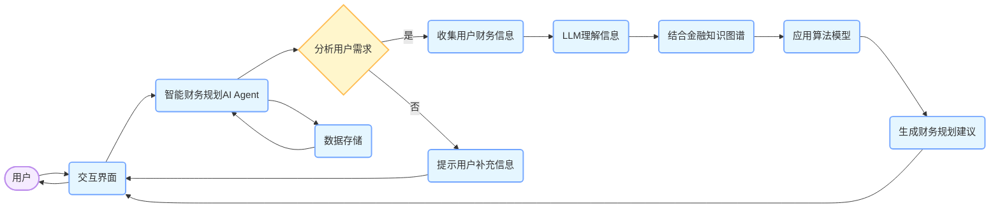

# 智能财务规划AI Agent：LLM在个人理财中的应用

> 关键词：智能财务规划、AI Agent、大语言模型（LLM）、个人理财、金融科技

> 摘要：本文聚焦于智能财务规划AI Agent在个人理财中的应用，深入探讨了基于大语言模型（LLM）构建的AI Agent如何革新个人理财领域。文章首先介绍了智能财务规划及相关概念的背景，接着详细阐述了核心概念与联系、核心算法原理及具体操作步骤，同时给出了数学模型和公式。通过项目实战案例，展示了代码的实现与解读。分析了智能财务规划AI Agent在不同场景下的实际应用，推荐了学习、开发所需的工具和资源。最后总结了未来发展趋势与挑战，并对常见问题进行了解答，为读者全面了解智能财务规划AI Agent在个人理财中的应用提供了系统而深入的指导。

## 1. 背景介绍 
### 1.1 目的和范围
随着金融市场的日益复杂和个人财富管理需求的不断增长，传统的个人理财方式面临着诸多挑战。智能财务规划AI Agent作为一种新兴的金融科技应用，旨在利用大语言模型（LLM）的强大能力，为个人提供更加个性化、智能化的财务规划服务。本文的目的在于深入研究智能财务规划AI Agent在个人理财中的应用原理、技术实现和实际效果，探讨其在不同场景下的应用价值和发展前景。文章的范围涵盖了智能财务规划AI Agent的核心概念、算法原理、数学模型、项目实战、实际应用场景以及相关的工具和资源推荐等方面。

### 1.2 预期读者
本文的预期读者包括金融科技从业者、个人理财爱好者、人工智能研究人员以及对智能财务规划领域感兴趣的专业人士。对于金融科技从业者，本文可以提供技术实现和应用案例的参考；对于个人理财爱好者，有助于了解如何借助智能工具进行更科学的理财规划；对于人工智能研究人员，可作为探索LLM在金融领域应用的研究资料；而对于其他感兴趣的专业人士，能帮助其拓宽对新兴金融科技应用的认知。

### 1.3 文档结构概述
本文将按照以下结构展开：首先介绍智能财务规划相关的背景知识，包括目的、预期读者和文档结构概述，同时给出术语表；接着阐述核心概念与联系，通过文本示意图和Mermaid流程图展示其原理和架构；然后详细讲解核心算法原理及具体操作步骤，并使用Python源代码进行说明；再介绍数学模型和公式，并举例说明其应用；通过项目实战展示代码的实际案例和详细解释；分析智能财务规划AI Agent的实际应用场景；推荐相关的学习、开发工具和资源；总结未来发展趋势与挑战；提供常见问题与解答的附录；最后列出扩展阅读和参考资料。

### 1.4 术语表
#### 1.4.1 核心术语定义
- **智能财务规划AI Agent**：基于人工智能技术，特别是大语言模型（LLM），能够理解用户的财务状况、目标和需求，为用户提供个性化财务规划建议和决策支持的智能代理。
- **大语言模型（LLM）**：一种基于深度学习的人工智能模型，通过对大量文本数据的学习，能够生成自然语言文本、理解语义和上下文，具备强大的语言处理和知识推理能力。
- **个人理财**：个人根据自身的财务状况、目标和风险承受能力，对收入、支出、储蓄、投资等进行合理规划和管理的过程。
- **金融科技（Fintech）**：金融与科技的融合，利用信息技术和创新思维推动金融服务和产品的变革与发展。

#### 1.4.2 相关概念解释
- **个性化财务规划**：根据每个用户的独特财务状况、目标、风险偏好等因素，量身定制的财务规划方案，以满足用户的特定需求。
- **知识图谱**：一种语义网络，用于表示实体之间的关系和知识，能够帮助AI Agent更好地理解金融领域的知识和信息。
- **强化学习**：一种机器学习方法，通过智能体与环境的交互，根据环境反馈的奖励信号来学习最优的行为策略。

#### 1.4.3 缩略词列表
- **LLM**：Large Language Model（大语言模型）
- **AI**：Artificial Intelligence（人工智能）
- **Fintech**：Financial Technology（金融科技）

## 2. 核心概念与联系 

### 核心概念原理
智能财务规划AI Agent的核心原理是利用大语言模型（LLM）的强大语言理解和生成能力，结合金融领域的知识和算法，为用户提供个性化的财务规划服务。具体来说，AI Agent通过与用户的交互，收集用户的财务信息、目标和风险偏好等数据，然后利用LLM对这些数据进行分析和理解，结合金融知识图谱和算法模型，生成适合用户的财务规划建议。

### 架构的文本示意图
```plaintext
用户 <-> 交互界面 <-> 智能财务规划AI Agent
                        |
                        | 数据存储（用户信息、金融知识等）
                        |
                        | 大语言模型（LLM）
                        |
                        | 金融知识图谱
                        |
                        | 算法模型（投资组合优化、风险评估等）
```

### Mermaid流程图


## 3. 核心算法原理 & 具体操作步骤 

### 核心算法原理
智能财务规划AI Agent的核心算法主要包括以下几个方面：

#### 1. 自然语言处理算法
利用大语言模型（LLM）进行自然语言处理，包括文本分类、情感分析、命名实体识别等，以理解用户的需求和财务信息。以下是一个简单的使用Python和Hugging Face的Transformers库进行文本分类的示例代码：
```python
from transformers import AutoTokenizer, AutoModelForSequenceClassification
import torch

# 加载预训练的模型和分词器
tokenizer = AutoTokenizer.from_pretrained("distilbert-base-uncased-finetuned-sst-2-english")
model = AutoModelForSequenceClassification.from_pretrained("distilbert-base-uncased-finetuned-sst-2-english")

# 输入文本
text = "我想制定一个短期的理财计划"
inputs = tokenizer(text, return_tensors="pt")

# 进行推理
with torch.no_grad():
    logits = model(**inputs).logits

# 获取预测结果
predicted_class_id = logits.argmax().item()
label = model.config.id2label[predicted_class_id]
print(f"预测结果: {label}")
```

#### 2. 投资组合优化算法
使用现代投资组合理论（MPT）等方法，根据用户的风险承受能力和投资目标，优化投资组合，以实现风险和收益的平衡。以下是一个简单的使用Python的`pandas`和`numpy`库进行投资组合优化的示例代码：
```python
import pandas as pd
import numpy as np

# 假设有三种资产的历史收益率数据
returns = pd.DataFrame({
    'Asset1': [0.05, 0.03, 0.02, 0.04, 0.06],
    'Asset2': [0.03, 0.02, 0.01, 0.03, 0.05],
    'Asset3': [0.06, 0.04, 0.03, 0.05, 0.07]
})

# 计算协方差矩阵和平均收益率
cov_matrix = returns.cov()
mean_returns = returns.mean()

# 定义目标收益率
target_return = 0.04

# 定义投资组合优化函数
def portfolio_optimization(mean_returns, cov_matrix, target_return):
    num_assets = len(mean_returns)
    constraints = ({'type': 'eq', 'fun': lambda x: np.sum(x) - 1},
                   {'type': 'eq', 'fun': lambda x: np.dot(x, mean_returns) - target_return})
    bounds = tuple((0, 1) for asset in range(num_assets))
    initial_guess = num_assets * [1. / num_assets,]
    from scipy.optimize import minimize
    result = minimize(lambda x: np.dot(x.T, np.dot(cov_matrix, x)), initial_guess,
                      method='SLSQP', bounds=bounds, constraints=constraints)
    return result.x

# 进行投资组合优化
optimal_weights = portfolio_optimization(mean_returns, cov_matrix, target_return)
print(f"最优投资组合权重: {optimal_weights}")
```

#### 3. 风险评估算法
通过分析用户的财务状况、投资组合和市场环境等因素，评估用户面临的风险水平，并提供相应的风险应对建议。以下是一个简单的风险评估示例代码：
```python
def risk_assessment(portfolio_weights, cov_matrix):
    portfolio_variance = np.dot(portfolio_weights.T, np.dot(cov_matrix, portfolio_weights))
    portfolio_standard_deviation = np.sqrt(portfolio_variance)
    return portfolio_standard_deviation

# 计算最优投资组合的风险
risk = risk_assessment(optimal_weights, cov_matrix)
print(f"最优投资组合的风险（标准差）: {risk}")
```

### 具体操作步骤
1. **用户交互**：用户通过交互界面（如网页、移动应用等）与智能财务规划AI Agent进行交互，输入自己的财务信息、目标和风险偏好等数据。
2. **数据收集与预处理**：AI Agent收集用户输入的数据，并进行预处理，包括数据清洗、格式转换等操作，以便后续的分析和处理。
3. **需求理解**：利用大语言模型（LLM）对用户的需求进行理解和分析，确定用户的财务目标和需求类型。
4. **知识查询与推理**：结合金融知识图谱，查询相关的金融知识和信息，并进行推理和分析，为用户提供合理的财务规划建议。
5. **算法应用**：根据用户的需求和财务状况，应用投资组合优化、风险评估等算法，生成个性化的财务规划方案。
6. **结果输出**：将生成的财务规划建议通过交互界面反馈给用户，并提供相应的解释和说明。
7. **用户反馈与调整**：用户对财务规划建议进行反馈，AI Agent根据用户的反馈进行调整和优化，以提供更符合用户需求的服务。

## 4. 数学模型和公式 & 详细讲解 & 举例说明 

### 现代投资组合理论（MPT）
现代投资组合理论（MPT）由哈里·马科维茨（Harry Markowitz）于1952年提出，其核心思想是通过分散投资来降低风险，实现风险和收益的平衡。

#### 数学模型和公式
设投资组合中有 $n$ 种资产，第 $i$ 种资产的权重为 $w_i$，收益率为 $r_i$，则投资组合的收益率 $R_p$ 为：
$$R_p = \sum_{i=1}^{n} w_i r_i$$
投资组合的方差 $\sigma_p^2$ 为：
$$\sigma_p^2 = \sum_{i=1}^{n} \sum_{j=1}^{n} w_i w_j \sigma_{ij}$$
其中，$\sigma_{ij}$ 是资产 $i$ 和资产 $j$ 的协方差。

#### 详细讲解
投资组合的收益率是各种资产收益率的加权平均值，权重表示投资在每种资产上的比例。投资组合的方差衡量了投资组合的风险，它不仅与每种资产的方差有关，还与资产之间的协方差有关。通过合理选择资产的权重，可以在一定的收益率水平下降低投资组合的风险。

#### 举例说明
假设有两种资产 $A$ 和 $B$，它们的收益率分别为 $r_A = 0.1$ 和 $r_B = 0.2$，方差分别为 $\sigma_A^2 = 0.04$ 和 $\sigma_B^2 = 0.09$，协方差为 $\sigma_{AB} = 0.03$。设投资在资产 $A$ 上的权重为 $w_A = 0.6$，投资在资产 $B$ 上的权重为 $w_B = 0.4$。

则投资组合的收益率为：
$$R_p = w_A r_A + w_B r_B = 0.6 \times 0.1 + 0.4 \times 0.2 = 0.14$$
投资组合的方差为：
$$\sigma_p^2 = w_A^2 \sigma_A^2 + w_B^2 \sigma_B^2 + 2 w_A w_B \sigma_{AB}$$
$$= 0.6^2 \times 0.04 + 0.4^2 \times 0.09 + 2 \times 0.6 \times 0.4 \times 0.03$$
$$= 0.0144 + 0.0144 + 0.0144 = 0.0432$$
投资组合的标准差为：
$$\sigma_p = \sqrt{\sigma_p^2} = \sqrt{0.0432} \approx 0.208$$

### 资本资产定价模型（CAPM）
资本资产定价模型（CAPM）用于描述资产的预期收益率与市场风险之间的关系。

#### 数学模型和公式
资产 $i$ 的预期收益率 $E(R_i)$ 为：
$$E(R_i) = R_f + \beta_i (E(R_m) - R_f)$$
其中，$R_f$ 是无风险收益率，$E(R_m)$ 是市场组合的预期收益率，$\beta_i$ 是资产 $i$ 的贝塔系数，衡量了资产 $i$ 的收益率对市场组合收益率的敏感程度。

#### 详细讲解
CAPM模型认为，资产的预期收益率由两部分组成：无风险收益率和风险溢价。风险溢价是资产的贝塔系数乘以市场风险溢价（市场组合的预期收益率减去无风险收益率）。贝塔系数大于1表示资产的波动比市场组合大，贝塔系数小于1表示资产的波动比市场组合小。

#### 举例说明
假设无风险收益率 $R_f = 0.03$，市场组合的预期收益率 $E(R_m) = 0.1$，资产 $A$ 的贝塔系数 $\beta_A = 1.2$。

则资产 $A$ 的预期收益率为：
$$E(R_A) = R_f + \beta_A (E(R_m) - R_f)$$
$$= 0.03 + 1.2 \times (0.1 - 0.03)$$
$$= 0.03 + 1.2 \times 0.07 = 0.114$$

## 5. 项目实战：代码实际案例和详细解释说明 

### 5.1  开发环境搭建
#### 操作系统
推荐使用Linux或macOS系统，因为它们对Python开发环境的支持较好。如果使用Windows系统，也可以通过安装WSL（Windows Subsystem for Linux）来搭建类似Linux的开发环境。

#### Python环境
安装Python 3.7及以上版本。可以从Python官方网站（https://www.python.org/downloads/）下载并安装。安装完成后，建议使用虚拟环境来管理项目的依赖，避免不同项目之间的依赖冲突。可以使用`venv`或`conda`来创建虚拟环境。以下是使用`venv`创建虚拟环境的示例命令：
```bash
python -m venv myenv
source myenv/bin/activate  # 在Linux或macOS上激活虚拟环境
.\myenv\Scripts\activate  # 在Windows上激活虚拟环境
```

#### 依赖库安装
安装项目所需的依赖库，包括`transformers`、`pandas`、`numpy`、`scipy`等。可以使用`pip`来安装这些库，示例命令如下：
```bash
pip install transformers pandas numpy scipy
```

### 5.2  源代码详细实现和代码解读
以下是一个简单的智能财务规划AI Agent的示例代码：
```python
import pandas as pd
import numpy as np
from transformers import AutoTokenizer, AutoModelForSequenceClassification
import torch

# 加载预训练的模型和分词器
tokenizer = AutoTokenizer.from_pretrained("distilbert-base-uncased-finetuned-sst-2-english")
model = AutoModelForSequenceClassification.from_pretrained("distilbert-base-uncased-finetuned-sst-2-english")

# 模拟用户输入的财务信息
user_input = "我有10万元的闲置资金，想在一年内获得10%的收益，风险承受能力中等"

# 进行文本分类，理解用户需求
inputs = tokenizer(user_input, return_tensors="pt")
with torch.no_grad():
    logits = model(**inputs).logits
predicted_class_id = logits.argmax().item()
label = model.config.id2label[predicted_class_id]
print(f"预测结果: {label}")

# 解析用户输入的资金和收益目标
import re
match = re.search(r"有(\d+)万元的闲置资金", user_input)
if match:
    capital = float(match.group(1)) * 10000
match = re.search(r"想在(\d+)年内获得(\d+)%的收益", user_input)
if match:
    years = int(match.group(1))
    target_return_rate = float(match.group(2)) / 100

# 假设有三种资产的历史收益率数据
returns = pd.DataFrame({
    'Asset1': [0.05, 0.03, 0.02, 0.04, 0.06],
    'Asset2': [0.03, 0.02, 0.01, 0.03, 0.05],
    'Asset3': [0.06, 0.04, 0.03, 0.05, 0.07]
})

# 计算协方差矩阵和平均收益率
cov_matrix = returns.cov()
mean_returns = returns.mean()

# 定义目标收益率
target_return = target_return_rate / years

# 定义投资组合优化函数
def portfolio_optimization(mean_returns, cov_matrix, target_return):
    num_assets = len(mean_returns)
    constraints = ({'type': 'eq', 'fun': lambda x: np.sum(x) - 1},
                   {'type': 'eq', 'fun': lambda x: np.dot(x, mean_returns) - target_return})
    bounds = tuple((0, 1) for asset in range(num_assets))
    initial_guess = num_assets * [1. / num_assets,]
    from scipy.optimize import minimize
    result = minimize(lambda x: np.dot(x.T, np.dot(cov_matrix, x)), initial_guess,
                      method='SLSQP', bounds=bounds, constraints=constraints)
    return result.x

# 进行投资组合优化
optimal_weights = portfolio_optimization(mean_returns, cov_matrix, target_return)
print(f"最优投资组合权重: {optimal_weights}")

# 计算各资产的投资金额
investment_amounts = capital * optimal_weights
print(f"各资产的投资金额: {investment_amounts}")

# 计算最优投资组合的风险
def risk_assessment(portfolio_weights, cov_matrix):
    portfolio_variance = np.dot(portfolio_weights.T, np.dot(cov_matrix, portfolio_weights))
    portfolio_standard_deviation = np.sqrt(portfolio_variance)
    return portfolio_standard_deviation

risk = risk_assessment(optimal_weights, cov_matrix)
print(f"最优投资组合的风险（标准差）: {risk}")
```

### 5.3  代码解读与分析
1. **文本分类**：使用`transformers`库加载预训练的文本分类模型，对用户输入的文本进行分类，以理解用户的需求类型。
2. **信息解析**：使用正则表达式从用户输入的文本中解析出资金、投资期限和收益目标等信息。
3. **数据准备**：假设有三种资产的历史收益率数据，计算协方差矩阵和平均收益率。
4. **投资组合优化**：定义投资组合优化函数，使用`scipy.optimize.minimize`函数求解最优投资组合权重，以实现目标收益率下的风险最小化。
5. **投资金额计算**：根据最优投资组合权重和用户的资金，计算各资产的投资金额。
6. **风险评估**：定义风险评估函数，计算最优投资组合的风险（标准差）。

## 6. 实际应用场景 
### 个人理财规划
智能财务规划AI Agent可以根据用户的财务状况、目标和风险偏好，为用户制定个性化的理财规划方案，包括储蓄计划、投资组合建议、保险规划等。例如，对于一个年轻的上班族，AI Agent可以建议他每月将一定比例的收入存入活期储蓄账户，以应对突发情况；同时，根据他的风险承受能力，推荐一些股票型基金或指数基金进行长期投资，以实现资产的增值。

### 投资决策支持
在投资决策过程中，AI Agent可以为用户提供实时的市场信息、投资分析和建议。例如，当用户考虑投资某只股票时，AI Agent可以分析该股票的基本面、技术面和市场趋势，评估其投资价值和风险，并给出投资建议。此外，AI Agent还可以根据用户的投资组合，实时监测市场变化，提醒用户进行调整和优化。

### 退休规划
对于即将退休或已经退休的人群，智能财务规划AI Agent可以帮助他们制定退休规划，确保他们在退休后有足够的资金维持生活。AI Agent可以根据用户的退休目标、现有资产和收入情况，计算出每月需要储蓄的金额和投资组合的配置，以实现退休目标。同时，AI Agent还可以考虑通货膨胀、医疗费用等因素，对退休规划进行动态调整。

### 债务管理
对于有债务的用户，AI Agent可以帮助他们制定债务管理计划，合理安排还款顺序和金额，以减少利息支出和债务负担。例如，对于同时有信用卡欠款和房贷的用户，AI Agent可以分析两种债务的利率和还款期限，建议用户优先偿还高利率的信用卡欠款，同时合理安排房贷的还款计划。

## 7. 工具和资源推荐
### 7.1 学习资源推荐
#### 7.1.1 书籍推荐
- 《智能时代》（吴军著）：介绍了人工智能的发展历程、技术原理和应用场景，以及对社会和经济的影响。
- 《Python数据分析实战》（李金洪著）：详细介绍了使用Python进行数据分析的方法和技巧，包括数据处理、可视化、机器学习等方面。
- 《金融科技：框架与实践》（谢平、邹传伟著）：系统阐述了金融科技的概念、技术和应用，对智能财务规划等领域有深入的探讨。

#### 7.1.2 在线课程
- Coursera上的“Machine Learning”（Andrew Ng教授授课）：经典的机器学习课程，涵盖了机器学习的基本概念、算法和应用。
- edX上的“Artificial Intelligence”（麻省理工学院授课）：介绍了人工智能的核心技术和方法，包括搜索算法、知识表示、机器学习等。
- 中国大学MOOC上的“金融科技前沿：技术应用与趋势”：由国内知名高校的教授授课，讲解了金融科技的最新发展和应用。

#### 7.1.3 技术博客和网站
- Towards Data Science：一个专注于数据科学和机器学习的技术博客，提供了大量的技术文章和案例分析。
- Medium：一个综合性的写作平台，有很多关于人工智能、金融科技等领域的优质文章。
- 金融界网站：提供了丰富的金融资讯和数据，对于了解金融市场和投资知识有很大的帮助。

### 7.2 开发工具框架推荐
#### 7.2.1 IDE和编辑器
- PyCharm：一款专业的Python集成开发环境，提供了丰富的代码编辑、调试和项目管理功能。
- Visual Studio Code：一款轻量级的代码编辑器，支持多种编程语言和插件扩展，适合快速开发和调试。
- Jupyter Notebook：一个交互式的编程环境，适合进行数据分析和模型训练的实验和演示。

#### 7.2.2 调试和性能分析工具
- pdb：Python自带的调试器，可以帮助开发者定位和解决代码中的问题。
- cProfile：Python的性能分析工具，可以分析代码的运行时间和内存使用情况，帮助开发者优化代码性能。
- TensorBoard：一个用于可视化深度学习模型训练过程和结果的工具，对于调试和优化深度学习模型非常有帮助。

#### 7.2.3 相关框架和库
- Transformers：Hugging Face开发的一个用于自然语言处理的开源库，提供了大量的预训练模型和工具，方便开发者进行文本分类、情感分析等任务。
- Pandas：一个用于数据处理和分析的Python库，提供了高效的数据结构和数据操作方法，适合处理金融数据和时间序列数据。
- NumPy：一个用于科学计算的Python库，提供了高效的多维数组对象和数学函数，是许多机器学习和数据分析库的基础。

### 7.3 相关论文著作推荐
#### 7.3.1 经典论文
- Markowitz, H. M. (1952). Portfolio Selection. The Journal of Finance, 7(1), 77-91. 这篇论文提出了现代投资组合理论（MPT），奠定了投资组合优化的基础。
- Sharpe, W. F. (1964). Capital Asset Prices: A Theory of Market Equilibrium Under Conditions of Risk. The Journal of Finance, 19(3), 425-442. 这篇论文提出了资本资产定价模型（CAPM），用于描述资产的预期收益率与市场风险之间的关系。

#### 7.3.2 最新研究成果
- 在IEEE、ACM等学术会议和期刊上，有很多关于人工智能在金融领域应用的最新研究成果，如基于深度学习的金融风险预测、智能投资顾问系统等。可以通过学术搜索引擎（如IEEE Xplore、ACM Digital Library等）查找相关的论文。

#### 7.3.3 应用案例分析
- 《金融科技案例解析》（何松琦、董兴荣著）：通过实际案例分析，介绍了金融科技在支付清算、信贷融资、财富管理等领域的应用和创新。
- 一些金融科技公司的官方网站和博客也会分享他们的应用案例和实践经验，可以关注这些资源了解最新的行业动态。

## 8. 总结：未来发展趋势与挑战
### 未来发展趋势
#### 个性化服务的深化
随着人工智能技术的不断发展，智能财务规划AI Agent将能够更深入地了解用户的需求和偏好，提供更加个性化、定制化的财务规划服务。例如，结合用户的生活习惯、消费行为等多维度数据，为用户制定更加贴合实际的理财方案。

#### 多模态交互的普及
未来的智能财务规划AI Agent将支持多模态交互方式，如语音交互、手势交互等，使用户与AI Agent的沟通更加自然和便捷。同时，结合图像识别、视频分析等技术，AI Agent可以更好地理解用户的意图和需求。

#### 与金融机构的深度合作
智能财务规划AI Agent将与银行、证券、保险等金融机构进行更深度的合作，整合金融机构的产品和服务资源，为用户提供一站式的金融服务解决方案。例如，用户可以通过AI Agent直接在金融机构开设账户、购买理财产品等。

#### 区块链技术的应用
区块链技术具有去中心化、不可篡改、安全可靠等特点，将其应用于智能财务规划领域，可以提高数据的安全性和可信度，保障用户的隐私和权益。例如，利用区块链技术实现用户财务数据的安全存储和共享。

### 挑战
#### 数据隐私和安全问题
智能财务规划AI Agent需要收集和处理大量的用户财务数据，这些数据涉及用户的隐私和敏感信息。因此，如何保障数据的隐私和安全是一个重要的挑战。需要采取有效的数据加密、访问控制等技术手段，防止数据泄露和滥用。

#### 模型的可解释性和可靠性
大语言模型（LLM）等人工智能模型通常具有较高的复杂度和黑盒性，其决策过程和结果难以解释和理解。在金融领域，模型的可解释性和可靠性至关重要，因为用户需要了解AI Agent给出的财务规划建议的依据和风险。因此，如何提高模型的可解释性和可靠性是一个亟待解决的问题。

#### 监管和合规问题
智能财务规划AI Agent作为一种新兴的金融科技应用，面临着严格的监管和合规要求。不同国家和地区的监管政策和法规存在差异，如何确保AI Agent的运营符合相关的监管要求，是金融科技公司需要面对的挑战。

#### 技术创新和人才短缺
人工智能技术发展迅速，智能财务规划领域需要不断进行技术创新和升级，以满足用户日益增长的需求。然而，目前人工智能领域的专业人才短缺，如何吸引和培养高素质的技术人才，是推动智能财务规划AI Agent发展的关键。

## 9. 附录：常见问题与解答
### 1. 智能财务规划AI Agent的建议一定准确吗？
智能财务规划AI Agent的建议是基于其算法模型和所掌握的金融知识生成的，但金融市场具有不确定性和复杂性，因此其建议并不能保证完全准确。AI Agent可以根据历史数据和市场趋势提供合理的建议，但实际的投资收益和风险可能会受到多种因素的影响，如宏观经济环境、政策变化等。用户在参考AI Agent的建议时，应结合自己的实际情况和判断，谨慎做出决策。

### 2. 使用智能财务规划AI Agent需要付费吗？
这取决于具体的AI Agent产品和服务提供商。有些智能财务规划AI Agent提供免费的基础服务，如简单的财务规划建议和风险评估；而有些则提供付费的高级服务，如个性化的投资组合管理、专属的理财顾问等。用户可以根据自己的需求和预算选择适合自己的服务。

### 3. 智能财务规划AI Agent会取代理财顾问吗？
虽然智能财务规划AI Agent可以提供高效、便捷的财务规划服务，但它并不能完全取代理财顾问。理财顾问具有丰富的专业知识和实践经验，能够与用户进行面对面的沟通和交流，深入了解用户的需求和情况，提供更加个性化、人性化的服务。而AI Agent则更适合处理大量的数据和信息，提供快速、标准化的建议。在未来，智能财务规划AI Agent和理财顾问可能会相互补充，共同为用户提供更好的财务规划服务。

### 4. 智能财务规划AI Agent如何保障用户的数据安全？
智能财务规划AI Agent通常会采取多种技术手段来保障用户的数据安全，如数据加密、访问控制、备份恢复等。在数据传输过程中，使用SSL/TLS等加密协议对数据进行加密，防止数据在传输过程中被窃取和篡改；在数据存储方面，采用安全可靠的数据库和存储系统，对数据进行备份和恢复，以防止数据丢失。同时，AI Agent的开发和运营团队也会遵守相关的法律法规和行业标准，加强内部管理和安全审计，确保用户数据的安全和隐私。

## 10. 扩展阅读 & 参考资料
### 扩展阅读
- 《人工智能简史》（尼克著）：全面介绍了人工智能的发展历程、重要事件和关键技术，有助于读者了解人工智能的全貌。
- 《财务自由之路》（博多·舍费尔著）：提供了个人理财和财富管理的实用方法和策略，对于提高个人的理财意识和能力有很大的帮助。
- 《金融炼金术》（乔治·索罗斯著）：作者分享了自己的投资理念和实践经验，对于理解金融市场的运行规律和投资策略有一定的启示。

### 参考资料
- Hugging Face官方文档：https://huggingface.co/docs
- Pandas官方文档：https://pandas.pydata.org/docs/
- NumPy官方文档：https://numpy.org/doc/
- Scipy官方文档：https://docs.scipy.org/doc/

作者：AI天才研究院/AI Genius Institute & 禅与计算机程序设计艺术 /Zen And The Art of Computer Programming