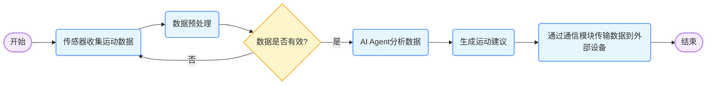

# 智能跑鞋：AI Agent的运动数据收集

> 关键词：智能跑鞋、AI Agent、运动数据收集、传感器技术、数据分析

> 摘要：本文聚焦于智能跑鞋中AI Agent的运动数据收集技术。详细介绍了智能跑鞋及AI Agent的背景知识，深入剖析了核心概念和联系，阐述了相关核心算法原理及操作步骤，通过数学模型和公式对数据收集进行了理论解读。同时，给出了项目实战案例，包括开发环境搭建、代码实现与解读。探讨了智能跑鞋运动数据收集的实际应用场景，推荐了学习资源、开发工具框架以及相关论文著作。最后对该领域的未来发展趋势与挑战进行了总结，并解答了常见问题，提供了扩展阅读和参考资料，旨在为读者全面呈现智能跑鞋中AI Agent运动数据收集的技术全貌。

## 1. 背景介绍 
### 1.1 目的和范围
随着科技的不断发展，智能穿戴设备在运动领域的应用越来越广泛。智能跑鞋作为其中的一种重要设备，能够为用户提供丰富的运动数据，帮助用户更好地了解自己的运动状态和健康状况。本文的目的在于深入探讨智能跑鞋中AI Agent（人工智能代理）如何进行运动数据的收集，涵盖从传感器技术到数据处理的整个流程，分析其原理、算法以及实际应用。

### 1.2 预期读者
本文适合对智能穿戴设备、人工智能、运动科技等领域感兴趣的技术爱好者、开发者、研究人员阅读。对于想要了解智能跑鞋工作原理、从事相关产品开发的人员，以及关注运动数据收集和分析的专业人士都具有一定的参考价值。

### 1.3 文档结构概述
本文将按照以下结构展开：首先介绍核心概念与联系，包括智能跑鞋和AI Agent的基本概念以及它们之间的关系；接着阐述核心算法原理和具体操作步骤，通过Python代码进行详细说明；然后给出数学模型和公式，并结合实例进行讲解；之后进行项目实战，包括开发环境搭建、源代码实现和代码解读；再探讨实际应用场景；推荐相关的工具和资源；最后总结未来发展趋势与挑战，解答常见问题，并提供扩展阅读和参考资料。

### 1.4 术语表
#### 1.4.1 核心术语定义
- **智能跑鞋**：集成了多种传感器和计算模块的跑鞋，能够实时收集和处理运动相关的数据，并通过无线通信技术将数据传输到外部设备。
- **AI Agent**：人工智能代理，是一种能够感知环境、自主决策并采取行动的智能实体。在智能跑鞋中，AI Agent负责对收集到的运动数据进行分析和处理。
- **运动数据收集**：指通过传感器获取与运动相关的各种数据，如步数、距离、速度、加速度、心率等。

#### 1.4.2 相关概念解释
- **传感器技术**：用于感知物理量并将其转换为电信号的技术。在智能跑鞋中，常用的传感器包括加速度计、陀螺仪、压力传感器等。
- **数据分析**：对收集到的数据进行清洗、整理、统计和挖掘，以提取有价值的信息和知识。
- **无线通信技术**：用于实现智能跑鞋与外部设备之间的数据传输，常见的无线通信技术包括蓝牙、Wi-Fi等。

#### 1.4.3 缩略词列表
- **MEMS**：Micro-Electro-Mechanical Systems，微机电系统，常用于制造传感器。
- **IMU**：Inertial Measurement Unit，惯性测量单元，通常包含加速度计和陀螺仪。
- **BLE**：Bluetooth Low Energy，低功耗蓝牙。

## 2. 核心概念与联系 

### 智能跑鞋的基本架构
智能跑鞋的基本架构主要由传感器模块、数据处理模块、存储模块和通信模块组成。传感器模块负责收集运动数据，数据处理模块对数据进行初步处理和分析，存储模块用于临时或长期保存数据，通信模块则将处理后的数据传输到外部设备。

以下是智能跑鞋架构的文本示意图：

|模块|功能|
| ---- | ---- |
|传感器模块|收集运动数据，如加速度、角速度、压力等|
|数据处理模块|对传感器收集的数据进行滤波、特征提取等处理|
|存储模块|临时或长期保存运动数据|
|通信模块|将处理后的数据传输到外部设备，如手机、电脑等|

### AI Agent在智能跑鞋中的作用
AI Agent在智能跑鞋中扮演着智能决策和数据分析的角色。它可以根据收集到的运动数据，实时分析用户的运动状态，如跑步姿势、运动强度等，并提供相应的建议和反馈。同时，AI Agent还可以对历史数据进行挖掘和分析，帮助用户制定个性化的运动计划。

### Mermaid流程图


## 3. 核心算法原理 & 具体操作步骤 

### 加速度计数据处理算法
加速度计是智能跑鞋中常用的传感器之一，用于测量跑步过程中的加速度变化。通过对加速度数据的处理，可以计算出步数、步幅、速度等运动参数。

以下是一个简单的Python代码示例，用于实现基于加速度计数据的步数检测算法：

```python
import numpy as np

def step_detection(acceleration_data, threshold=1.5):
    """
    步数检测算法
    :param acceleration_data: 加速度数据
    :param threshold: 步数检测阈值
    :return: 步数
    """
    steps = 0
    prev_acc = acceleration_data[0]
    for acc in acceleration_data[1:]:
        if prev_acc < threshold and acc >= threshold:
            steps += 1
        prev_acc = acc
    return steps

# 示例数据
acceleration_data = np.array([1.2, 1.3, 1.6, 1.8, 1.4, 1.1, 1.7, 1.9])
steps = step_detection(acceleration_data)
print(f"检测到的步数: {steps}")
```

### 具体操作步骤
1. **传感器数据采集**：通过加速度计等传感器实时采集运动数据。
2. **数据预处理**：对采集到的数据进行滤波、降噪等处理，以提高数据的质量。
3. **特征提取**：从预处理后的数据中提取有用的特征，如加速度的峰值、谷值等。
4. **步数检测**：根据提取的特征和预设的阈值，判断是否发生了一步。
5. **其他参数计算**：根据步数和其他相关数据，计算步幅、速度等运动参数。

## 4. 数学模型和公式 & 详细讲解 & 举例说明 

### 步数检测的数学模型
步数检测的基本数学模型可以表示为一个阈值判断过程。假设加速度数据为 $a(t)$，阈值为 $T$，则当 $a(t - 1) < T$ 且 $a(t) \geq T$ 时，认为发生了一步。

### 步幅计算的数学模型
步幅的计算通常基于经验公式，例如：
$$S = k \times \sqrt{\frac{\sum_{i = 1}^{n} a_i^2}{n}}$$
其中，$S$ 表示步幅，$k$ 是一个经验系数，$a_i$ 是加速度数据，$n$ 是数据的长度。

### 速度计算的数学模型
速度可以通过步幅和步数来计算，公式如下：
$$v = \frac{S \times N}{t}$$
其中，$v$ 表示速度，$S$ 表示步幅，$N$ 表示步数，$t$ 表示运动时间。

### 举例说明
假设我们采集到的加速度数据为 $[1.2, 1.3, 1.6, 1.8, 1.4, 1.1, 1.7, 1.9]$，阈值 $T = 1.5$。根据步数检测算法，我们可以计算出步数为 3。

假设经验系数 $k = 0.5$，则步幅为：
$$S = 0.5 \times \sqrt{\frac{1.2^2 + 1.3^2 + 1.6^2 + 1.8^2 + 1.4^2 + 1.1^2 + 1.7^2 + 1.9^2}{8}} \approx 0.85$$

如果运动时间 $t = 10$ 秒，步数 $N = 3$，则速度为：
$$v = \frac{0.85 \times 3}{10} = 0.255 \text{ m/s}$$

## 5. 项目实战：代码实际案例和详细解释说明 

### 5.1  开发环境搭建
#### 硬件环境
- **智能跑鞋开发板**：选择一款集成了加速度计、陀螺仪等传感器的开发板，如Arduino、Raspberry Pi等。
- **计算机**：用于开发和调试代码。

#### 软件环境
- **Python**：选择Python 3.x版本，并安装相关的库，如NumPy、Pandas等。
- **开发工具**：可以使用PyCharm、Jupyter Notebook等开发工具。

### 5.2  源代码详细实现和代码解读
以下是一个完整的智能跑鞋运动数据收集和处理的Python代码示例：

```python
import numpy as np
import time

# 模拟传感器数据采集
def collect_sensor_data():
    """
    模拟传感器数据采集
    :return: 加速度数据
    """
    # 这里简单模拟加速度数据
    acceleration_data = np.random.uniform(1.0, 2.0, 100)
    return acceleration_data

# 数据预处理
def preprocess_data(data):
    """
    数据预处理，简单的均值滤波
    :param data: 原始数据
    :return: 预处理后的数据
    """
    kernel_size = 3
    smoothed_data = np.convolve(data, np.ones(kernel_size) / kernel_size, mode='same')
    return smoothed_data

# 步数检测
def step_detection(data, threshold=1.5):
    """
    步数检测算法
    :param data: 加速度数据
    :param threshold: 步数检测阈值
    :return: 步数
    """
    steps = 0
    prev_acc = data[0]
    for acc in data[1:]:
        if prev_acc < threshold and acc >= threshold:
            steps += 1
        prev_acc = acc
    return steps

# 主程序
if __name__ == "__main__":
    while True:
        # 采集传感器数据
        raw_data = collect_sensor_data()
        
        # 数据预处理
        processed_data = preprocess_data(raw_data)
        
        # 步数检测
        steps = step_detection(processed_data)
        
        print(f"检测到的步数: {steps}")
        
        # 每隔1秒采集一次数据
        time.sleep(1)
```

### 代码解读与分析
1. **数据采集**：`collect_sensor_data` 函数模拟了传感器数据的采集过程，返回一个包含100个随机加速度数据的数组。
2. **数据预处理**：`preprocess_data` 函数对采集到的原始数据进行均值滤波处理，以减少噪声的影响。
3. **步数检测**：`step_detection` 函数根据预处理后的数据和预设的阈值，计算出步数。
4. **主程序**：在主程序中，使用一个无限循环不断采集数据、进行预处理和步数检测，并将结果打印输出。每隔1秒采集一次数据。

## 6. 实际应用场景 
### 运动健康监测
智能跑鞋可以实时监测用户的运动数据，如步数、距离、消耗的卡路里等，帮助用户了解自己的运动情况，制定合理的运动计划。同时，通过对运动数据的分析，还可以检测用户的运动姿势是否正确，预防运动损伤。

### 运动训练辅助
对于运动员和健身爱好者来说，智能跑鞋可以提供更精准的运动数据和分析，帮助他们优化训练方案，提高训练效果。例如，通过分析步幅、步频等参数，调整跑步节奏和姿势，提高跑步速度和耐力。

### 竞赛活动
在一些跑步竞赛活动中，智能跑鞋可以作为计时和成绩记录的工具，提高竞赛的公正性和准确性。同时，还可以为参赛选手提供实时的运动数据反馈，增加竞赛的趣味性和互动性。

### 社交互动
智能跑鞋可以与手机应用或社交媒体平台连接，用户可以将自己的运动数据分享到社交网络上，与朋友和其他运动爱好者进行互动和交流。这种社交互动可以增加用户的运动动力和参与度。

## 7. 工具和资源推荐
### 7.1 学习资源推荐
#### 7.1.1 书籍推荐
- 《传感器技术与应用》：全面介绍了各种传感器的原理、设计和应用，对于理解智能跑鞋中的传感器技术有很大帮助。
- 《Python数据分析实战》：详细讲解了Python在数据分析领域的应用，包括数据处理、可视化等方面的知识，适合用于智能跑鞋运动数据的分析。
- 《人工智能基础》：介绍了人工智能的基本概念、算法和应用，有助于深入理解AI Agent在智能跑鞋中的作用。

#### 7.1.2 在线课程
- Coursera上的“传感器技术与物联网”课程：提供了传感器技术和物联网应用的系统学习，涵盖了智能跑鞋相关的技术知识。
- edX上的“Python数据科学入门”课程：通过实际案例介绍Python在数据科学中的应用，对于智能跑鞋数据处理和分析很有帮助。
- Udemy上的“人工智能实战”课程：介绍了人工智能的实际应用案例，包括AI Agent的开发和应用。

#### 7.1.3 技术博客和网站
- 博客园：有很多开发者分享关于传感器技术、人工智能和智能穿戴设备的技术文章。
- 开源中国：提供了大量的开源项目和技术资源，对于智能跑鞋的开发有一定的参考价值。
- IEEE Xplore：收录了大量的学术论文和技术报告，可用于深入研究智能跑鞋相关的技术。

### 7.2 开发工具框架推荐
#### 7.2.1 IDE和编辑器
- PyCharm：功能强大的Python集成开发环境，提供了代码编辑、调试、版本控制等功能，适合Python开发。
- Jupyter Notebook：交互式的开发环境，支持Python代码的实时运行和可视化展示，方便进行数据分析和实验。
- Visual Studio Code：轻量级的代码编辑器，支持多种编程语言，具有丰富的插件扩展功能。

#### 7.2.2 调试和性能分析工具
- PDB：Python自带的调试工具，可以帮助开发者定位和解决代码中的问题。
- Py-Spy：用于分析Python程序的性能，找出性能瓶颈。
- Memory Profiler：可以分析Python程序的内存使用情况，优化内存性能。

#### 7.2.3 相关框架和库
- NumPy：用于科学计算和数组处理，提供了高效的数组操作和数学函数。
- Pandas：用于数据处理和分析，提供了数据结构和数据分析工具，方便处理智能跑鞋的运动数据。
- TensorFlow：开源的深度学习框架，可以用于开发AI Agent的模型，进行运动数据的分析和预测。

### 7.3 相关论文著作推荐
#### 7.3.1 经典论文
- “Accelerometer-based Step Detection and Activity Classification”：介绍了基于加速度计的步数检测和活动分类算法，是该领域的经典论文。
- “A Survey on Wearable Sensor-Based Human Activity Recognition”：对基于穿戴式传感器的人类活动识别技术进行了全面的综述。
- “Machine Learning for Activity Recognition from Wearable Sensors”：探讨了机器学习在穿戴式传感器活动识别中的应用。

#### 7.3.2 最新研究成果
- 每年的ACM SIGKDD、IEEE ICML等学术会议上都会有关于智能穿戴设备和运动数据处理的最新研究成果发表。
- 一些知名学术期刊，如《IEEE Transactions on Biomedical Engineering》、《Journal of Medical Internet Research》等，也会刊登相关的研究论文。

#### 7.3.3 应用案例分析
- 一些科技公司的官方博客和技术报告中会分享智能跑鞋等穿戴式设备的应用案例和实践经验，如苹果、小米等公司的相关资料。

## 8. 总结：未来发展趋势与挑战
### 未来发展趋势
- **传感器技术的不断进步**：未来智能跑鞋中的传感器将更加精确、小型化和低功耗，能够收集更多种类和更准确的运动数据。
- **AI Agent的智能化提升**：AI Agent将具备更强的学习和推理能力，能够提供更个性化的运动建议和健康管理方案。
- **与其他设备的融合**：智能跑鞋将与手机、智能手表、运动手环等其他设备进行更深度的融合，实现数据的共享和交互，为用户提供更全面的运动体验。
- **虚拟现实和增强现实技术的应用**：结合虚拟现实和增强现实技术，智能跑鞋可以为用户创造更加沉浸式的运动场景，增加运动的趣味性和互动性。

### 挑战
- **数据隐私和安全问题**：智能跑鞋收集的运动数据涉及用户的个人隐私，如何保障数据的安全和隐私是一个重要的挑战。
- **算法的准确性和可靠性**：运动数据的分析和处理需要准确可靠的算法，如何提高算法的性能和适应性是需要解决的问题。
- **用户体验和接受度**：智能跑鞋的设计和功能需要满足用户的需求和期望，提高用户的体验和接受度是推广智能跑鞋的关键。
- **成本和市场竞争**：降低智能跑鞋的生产成本，提高产品的性价比，同时应对激烈的市场竞争，是企业面临的挑战。

## 9. 附录：常见问题与解答
### 智能跑鞋的数据准确性如何保证？
智能跑鞋的数据准确性主要通过以下几个方面来保证：
- **高质量的传感器**：选择精度高、稳定性好的传感器，能够减少测量误差。
- **数据预处理和校准**：对采集到的数据进行预处理和校准，去除噪声和误差，提高数据的质量。
- **优化的算法**：采用先进的算法进行数据处理和分析，提高算法的准确性和可靠性。

### 智能跑鞋的续航能力如何？
智能跑鞋的续航能力取决于多个因素，如电池容量、传感器和模块的功耗、使用频率等。一般来说，通过优化硬件设计和采用低功耗的传感器和模块，可以延长智能跑鞋的续航时间。一些智能跑鞋的续航时间可以达到数天甚至数周。

### 智能跑鞋可以防水吗？
部分智能跑鞋具备一定的防水功能，但防水等级不同。一般来说，防水等级较高的智能跑鞋可以在小雨或潮湿环境中正常使用，但不建议长时间浸泡在水中。在购买智能跑鞋时，可以查看产品的说明书了解其防水性能。

### 智能跑鞋的数据可以与哪些设备同步？
智能跑鞋的数据通常可以通过蓝牙、Wi-Fi等无线通信技术与手机、电脑、智能手表等设备同步。用户可以通过相应的手机应用或软件查看和分析运动数据。

## 10. 扩展阅读 & 参考资料
### 扩展阅读
- 《智能穿戴设备的未来发展趋势》
- 《人工智能在运动健康领域的应用研究》
- 《传感器技术的最新进展》

### 参考资料
- [IEEE Xplore](https://ieeexplore.ieee.org/)
- [ACM Digital Library](https://dl.acm.org/)
- [Arduino官方文档](https://www.arduino.cc/en/Reference/HomePage)
- [Raspberry Pi官方文档](https://www.raspberrypi.org/documentation/)

作者：AI天才研究院/AI Genius Institute & 禅与计算机程序设计艺术 /Zen And The Art of Computer Programming