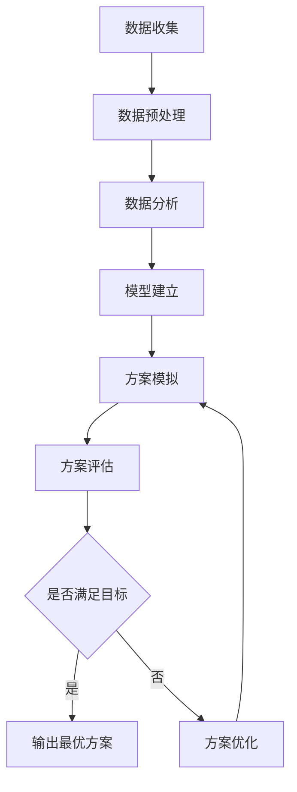

# 智能退休计划优化器

> 关键词：智能退休计划、优化器、财务规划、人工智能、机器学习、风险评估、养老金

> 摘要：本文围绕智能退休计划优化器展开，详细介绍了其核心概念、算法原理、数学模型等内容。通过Python代码阐述了具体的算法实现，结合项目实战展示了开发环境搭建、代码实现与解读。探讨了其实际应用场景，推荐了相关的学习资源、开发工具框架和论文著作。最后对智能退休计划优化器的未来发展趋势与挑战进行了总结，并提供了常见问题解答和扩展阅读参考资料，旨在为读者全面深入地了解智能退休计划优化器提供指导。

## 1. 背景介绍 
### 1.1 目的和范围
智能退休计划优化器的主要目的是帮助人们更科学、合理地规划退休生活。随着社会经济的发展和人口老龄化的加剧，退休后的财务保障成为人们关注的焦点。传统的退休计划制定往往依赖于经验和简单的计算，难以全面考虑各种复杂因素，如通货膨胀、投资市场波动、个人收入变化等。本优化器旨在利用先进的人工智能和数据分析技术，综合考虑多方面因素，为用户提供个性化、动态的退休计划方案，以确保用户在退休后能够维持理想的生活水平。

其范围涵盖了个人退休财务规划的各个方面，包括收入预测、支出规划、资产配置、养老金计算、风险评估等。通过对这些因素的综合分析和优化，帮助用户制定出最适合自己的退休计划。

### 1.2 预期读者
本文的预期读者主要包括以下几类人群：
1. **普通大众**：希望为自己的退休生活进行合理规划，了解如何利用智能工具优化退休计划的个人。
2. **金融从业者**：如理财顾问、保险代理人等，他们需要借助先进的工具和方法为客户提供更优质的退休规划服务。
3. **技术人员**：对人工智能、机器学习等技术在金融领域的应用感兴趣，希望深入了解智能退休计划优化器的实现原理和技术细节的专业人士。
4. **研究人员**：从事金融规划、风险管理、人工智能等相关领域研究的学者和科研人员，可从本文中获取相关的研究思路和方法。

### 1.3 文档结构概述
本文将按照以下结构进行详细阐述：
1. **核心概念与联系**：介绍智能退休计划优化器的核心概念、原理和架构，通过文本示意图和Mermaid流程图进行直观展示。
2. **核心算法原理 & 具体操作步骤**：详细讲解优化器所使用的核心算法原理，并使用Python源代码进行具体实现和解释。
3. **数学模型和公式 & 详细讲解 & 举例说明**：阐述优化器背后的数学模型和公式，通过具体例子进行详细说明。
4. **项目实战：代码实际案例和详细解释说明**：展示如何搭建开发环境，实现智能退休计划优化器的源代码，并对代码进行详细解读和分析。
5. **实际应用场景**：探讨智能退休计划优化器在不同场景下的实际应用。
6. **工具和资源推荐**：推荐相关的学习资源、开发工具框架和论文著作，帮助读者进一步深入学习和研究。
7. **总结：未来发展趋势与挑战**：对智能退休计划优化器的未来发展趋势进行展望，并分析可能面临的挑战。
8. **附录：常见问题与解答**：回答读者在使用智能退休计划优化器过程中可能遇到的常见问题。
9. **扩展阅读 & 参考资料**：提供相关的扩展阅读材料和参考资料，方便读者进一步探索。

### 1.4 术语表
#### 1.4.1 核心术语定义
1. **智能退休计划**：利用先进的技术和算法，综合考虑个人的财务状况、收入、支出、投资等因素，为个人制定的个性化退休规划方案。
2. **优化器**：一种能够根据特定的目标和约束条件，对问题进行求解和优化的算法或工具。在本文中，智能退休计划优化器是指通过对退休计划的各个要素进行分析和优化，以实现退休目标的工具。
3. **财务规划**：对个人或家庭的财务状况进行全面分析和规划，包括收入、支出、资产、负债等方面，以实现财务目标的过程。
4. **风险评估**：对投资、经济等方面可能面临的风险进行评估和分析，以确定风险的大小和可能性，并采取相应的措施进行管理和控制。
5. **养老金**：在退休后，个人或家庭从政府、企业或其他机构获得的定期收入，用于维持生活开销。

#### 1.4.2 相关概念解释
1. **通货膨胀**：指在货币流通条件下，因货币供给大于货币实际需求，也即现实购买力大于产出供给,导致货币贬值，而引起的一段时间内物价持续而普遍地上涨现象。在退休计划中，通货膨胀会影响到退休后的生活成本，需要在规划中进行考虑。
2. **投资回报率**：指通过投资而应返回的价值，即企业从一项投资活动中得到的经济回报。在退休计划中，合理的投资回报率可以帮助个人实现资产的增值，提高退休后的财务保障。
3. **资产配置**：指根据投资需求将投资资金在不同资产类别之间进行分配，通常是将资产在低风险、低收益证券与高风险、高收益证券之间进行分配。合理的资产配置可以降低投资风险，提高投资收益。

#### 1.4.3 缩略词列表
1. **AI**：Artificial Intelligence，人工智能
2. **ML**：Machine Learning，机器学习
3. **ROI**：Return on Investment，投资回报率
4. **CPI**：Consumer Price Index，消费者物价指数

## 2. 核心概念与联系 

### 核心概念原理
智能退休计划优化器的核心原理是基于人工智能和数据分析技术，对个人的财务状况、收入、支出、投资等多方面数据进行收集、整理和分析。通过建立数学模型和算法，模拟不同的退休计划方案，并根据用户设定的退休目标和风险偏好，对这些方案进行评估和优化，最终为用户提供最优的退休计划建议。

其主要涉及以下几个核心概念：
1. **数据收集**：收集个人的基本信息、财务信息、收入情况、支出情况、投资情况等数据，作为退休计划优化的基础。
2. **数据分析**：对收集到的数据进行清洗、预处理和分析，挖掘数据中的潜在信息和规律。
3. **模型建立**：根据数据分析的结果，建立数学模型和算法，模拟不同的退休计划方案。
4. **方案评估**：根据用户设定的退休目标和风险偏好，对模拟出的退休计划方案进行评估和比较。
5. **方案优化**：根据评估结果，对退休计划方案进行优化和调整，以实现最优的退休目标。

### 架构的文本示意图
智能退休计划优化器的架构主要包括以下几个部分：
1. **数据层**：负责收集、存储和管理个人的相关数据，包括基本信息、财务信息、收入数据、支出数据、投资数据等。
2. **处理层**：对数据层收集到的数据进行清洗、预处理和分析，建立数学模型和算法，模拟不同的退休计划方案。
3. **优化层**：根据用户设定的退休目标和风险偏好，对模拟出的退休计划方案进行评估和优化，选择最优的方案。
4. **展示层**：将优化后的退休计划方案以直观的方式展示给用户，如报表、图表等。

### Mermaid 流程图


## 3. 核心算法原理 & 具体操作步骤 

### 核心算法原理
智能退休计划优化器主要使用以下几种核心算法：
1. **线性规划算法**：用于在一定的约束条件下，求解目标函数的最优解。在退休计划优化中，可以利用线性规划算法来优化资产配置，在满足风险约束的前提下，实现投资收益的最大化。
2. **蒙特卡罗模拟算法**：通过随机抽样的方法，模拟不同的市场情景和投资结果，以评估退休计划的风险和不确定性。在退休计划优化中，可以利用蒙特卡罗模拟算法来模拟未来的投资收益和生活成本，为退休计划的制定提供参考。
3. **遗传算法**：一种模拟自然选择和遗传机制的优化算法，通过不断地迭代和进化，寻找最优解。在退休计划优化中，可以利用遗传算法来优化退休计划的各个参数，如储蓄率、投资组合等，以实现退休目标的最大化。

### 具体操作步骤及 Python 源代码

#### 线性规划算法示例
线性规划算法的目标是在一定的约束条件下，求解目标函数的最优解。以下是一个简单的线性规划问题的 Python 实现示例，用于优化资产配置：

```python
from scipy.optimize import linprog

# 目标函数系数，这里假设我们要最大化投资收益
c = [-0.1, -0.15]  # 负号表示最大化

# 不等式约束条件的系数矩阵
A = [[1, 1], [0.5, 0.3]]
# 不等式约束条件的右侧常数
b = [100, 30]

# 变量的取值范围
x_bounds = (0, None)
y_bounds = (0, None)
bounds = [x_bounds, y_bounds]

# 求解线性规划问题
res = linprog(c, A_ub=A, b_ub=b, bounds=bounds)

print("最优解：", res.x)
print("最优目标值：", -res.fun)  # 因为前面取了负号，所以这里要再取负
```

#### 蒙特卡罗模拟算法示例
蒙特卡罗模拟算法通过随机抽样的方法，模拟不同的市场情景和投资结果。以下是一个简单的蒙特卡罗模拟示例，用于模拟股票投资的未来收益：

```python
import numpy as np
import matplotlib.pyplot as plt

# 初始投资金额
initial_investment = 10000
# 投资年限
years = 10
# 预期年化收益率
mean_return = 0.08
# 年化波动率
volatility = 0.15
# 模拟次数
num_simulations = 1000

# 存储每次模拟的最终资产值
final_values = []

for _ in range(num_simulations):
    portfolio_value = initial_investment
    for _ in range(years):
        # 生成随机收益率
        random_return = np.random.normal(mean_return, volatility)
        # 计算下一年的资产值
        portfolio_value *= (1 + random_return)
    final_values.append(portfolio_value)

# 绘制模拟结果的直方图
plt.hist(final_values, bins=50)
plt.xlabel('Final Portfolio Value')
plt.ylabel('Frequency')
plt.title('Monte Carlo Simulation of Stock Investment')
plt.show()
```

#### 遗传算法示例
遗传算法通过不断地迭代和进化，寻找最优解。以下是一个简单的遗传算法示例，用于优化退休计划的储蓄率：

```python
import random

# 目标函数：计算退休时的资产值
def objective_function(savings_rate):
    # 初始投资金额
    initial_investment = 10000
    # 投资年限
    years = 30
    # 预期年化收益率
    mean_return = 0.08
    portfolio_value = initial_investment
    for _ in range(years):
        # 每年的储蓄金额
        savings = portfolio_value * savings_rate
        portfolio_value += savings
        # 计算下一年的资产值
        portfolio_value *= (1 + mean_return)
    return portfolio_value

# 遗传算法参数
population_size = 100
num_generations = 50
mutation_rate = 0.01

# 初始化种群
population = [random.uniform(0, 1) for _ in range(population_size)]

for generation in range(num_generations):
    # 计算适应度值
    fitness_values = [objective_function(savings_rate) for savings_rate in population]
    
    # 选择操作：轮盘赌选择
    total_fitness = sum(fitness_values)
    selection_probabilities = [fitness / total_fitness for fitness in fitness_values]
    new_population = []
    for _ in range(population_size):
        selected_index = random.choices(range(population_size), weights=selection_probabilities)[0]
        new_population.append(population[selected_index])
    
    # 交叉操作
    for i in range(0, population_size, 2):
        parent1 = new_population[i]
        parent2 = new_population[i + 1]
        crossover_point = random.uniform(0, 1)
        child1 = crossover_point * parent1 + (1 - crossover_point) * parent2
        child2 = crossover_point * parent2 + (1 - crossover_point) * parent1
        new_population[i] = child1
        new_population[i + 1] = child2
    
    # 变异操作
    for i in range(population_size):
        if random.random() < mutation_rate:
            new_population[i] = random.uniform(0, 1)
    
    population = new_population

# 找到最优解
best_savings_rate = max(population, key=objective_function)
best_value = objective_function(best_savings_rate)

print("最优储蓄率：", best_savings_rate)
print("最优资产值：", best_value)
```

## 4. 数学模型和公式 & 详细讲解 & 举例说明 

### 线性规划模型
线性规划模型的一般形式为：

$$
\begin{align*}
\max_{x} \quad & c^T x \\
\text{s.t.} \quad & A_{ub} x \leq b_{ub} \\
& A_{eq} x = b_{eq} \\
& l \leq x \leq u
\end{align*}
$$

其中，$x$ 是决策变量向量，$c$ 是目标函数的系数向量，$A_{ub}$ 和 $b_{ub}$ 是不等式约束条件的系数矩阵和右侧常数向量，$A_{eq}$ 和 $b_{eq}$ 是等式约束条件的系数矩阵和右侧常数向量，$l$ 和 $u$ 是决策变量的下限和上限向量。

在退休计划优化中，线性规划模型可以用于优化资产配置。例如，假设我们有两种资产 $x_1$ 和 $x_2$，它们的预期收益率分别为 $r_1$ 和 $r_2$，我们的目标是在总投资金额不超过 $M$，且风险不超过一定阈值的前提下，最大化投资收益。则线性规划模型可以表示为：

$$
\begin{align*}
\max_{x_1, x_2} \quad & r_1 x_1 + r_2 x_2 \\
\text{s.t.} \quad & x_1 + x_2 \leq M \\
& \sigma_1^2 x_1^2 + 2 \rho \sigma_1 \sigma_2 x_1 x_2 + \sigma_2^2 x_2^2 \leq \sigma_{max}^2 \\
& x_1 \geq 0, x_2 \geq 0
\end{align*}
$$

其中，$\sigma_1$ 和 $\sigma_2$ 分别是两种资产的波动率，$\rho$ 是它们的相关系数，$\sigma_{max}^2$ 是风险阈值。

### 蒙特卡罗模拟模型
蒙特卡罗模拟模型的基本思想是通过随机抽样的方法，模拟不同的市场情景和投资结果。假设投资资产的收益率 $r$ 服从正态分布 $N(\mu, \sigma^2)$，其中 $\mu$ 是预期收益率，$\sigma$ 是波动率。则在第 $t$ 期的资产值 $V_t$ 可以表示为：

$$
V_t = V_{t - 1} (1 + r_t)
$$

其中，$r_t$ 是第 $t$ 期的随机收益率，通过从正态分布 $N(\mu, \sigma^2)$ 中抽样得到。

例如，假设初始投资金额为 $V_0 = 10000$，预期年化收益率 $\mu = 0.08$，年化波动率 $\sigma = 0.15$，投资年限为 $T = 10$ 年。则通过蒙特卡罗模拟可以得到不同情景下的最终资产值。

### 遗传算法模型
遗传算法的基本思想是模拟自然选择和遗传机制，通过不断地迭代和进化，寻找最优解。遗传算法主要包括以下几个步骤：
1. **初始化种群**：随机生成一组初始解，作为种群。
2. **计算适应度值**：根据目标函数，计算每个解的适应度值。
3. **选择操作**：根据适应度值，选择一部分解作为父代，用于繁殖后代。
4. **交叉操作**：对父代解进行交叉，生成子代解。
5. **变异操作**：对子代解进行变异，引入新的基因。
6. **更新种群**：用子代解替换部分父代解，更新种群。
7. **终止条件判断**：如果满足终止条件（如达到最大迭代次数），则停止迭代，输出最优解；否则，返回步骤 2。

在退休计划优化中，遗传算法可以用于优化退休计划的各个参数，如储蓄率、投资组合等。

### 举例说明
假设一个人计划在 30 年后退休，初始投资金额为 10000 元，预期年化收益率为 0.08，他希望在