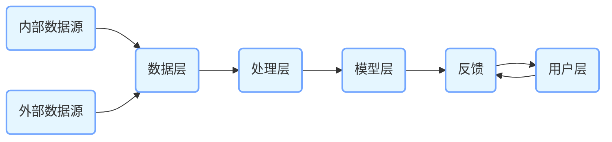

# 智能银行不良资产管理系统

> 关键词：智能银行、不良资产管理、风险管理、数据挖掘、人工智能、系统架构、金融科技

> 摘要：本文围绕智能银行不良资产管理系统展开，详细阐述了该系统的背景、核心概念、算法原理、数学模型、项目实战等内容。通过深入分析智能银行不良资产管理的需求和挑战，介绍了系统的架构设计和实现方法，包括核心算法的Python代码实现和数学模型的详细讲解。同时，结合实际应用场景，展示了系统的应用价值。此外，还推荐了相关的学习资源、开发工具和论文著作，最后对系统的未来发展趋势与挑战进行了总结，并提供了常见问题解答和扩展阅读参考资料，旨在为智能银行不良资产管理系统的研究和开发提供全面的技术指导。

## 1. 背景介绍 
### 1.1 目的和范围
在金融行业中，银行不良资产的管理一直是一个关键且具有挑战性的问题。不良资产的存在不仅会影响银行的资产质量和盈利能力，还可能对金融系统的稳定性造成威胁。智能银行不良资产管理系统的目的在于利用先进的信息技术和数据分析手段，对银行的不良资产进行全面、高效、智能的管理。

本系统的范围涵盖了不良资产的识别、评估、处置和监控等整个生命周期。从数据的收集和整合，到风险的评估和预测，再到处置策略的制定和执行，系统将各个环节有机地结合起来，实现不良资产管理的科学化、智能化和精细化。

### 1.2 预期读者
本文的预期读者主要包括金融行业的从业者，如银行风险管理部门的工作人员、信贷审批人员、资产处置人员等，他们可以通过本文了解智能银行不良资产管理系统的原理和应用，从而更好地开展工作。同时，对于从事金融科技研究和开发的技术人员，本文也提供了详细的技术实现和算法原理，有助于他们进行系统的开发和优化。此外，对金融风险管理和人工智能应用感兴趣的学者和研究人员也可以从本文中获取有价值的信息。

### 1.3 文档结构概述
本文将按照以下结构进行组织：首先介绍智能银行不良资产管理系统的背景，包括目的、范围、预期读者和文档结构概述等内容。接着阐述系统的核心概念与联系，通过文本示意图和Mermaid流程图进行详细说明。然后讲解核心算法原理和具体操作步骤，并使用Python源代码进行详细阐述。之后介绍数学模型和公式，并通过举例进行详细讲解。再通过项目实战展示代码实际案例和详细解释说明。随后探讨系统的实际应用场景。接着推荐相关的工具和资源，包括学习资源、开发工具框架和相关论文著作。最后总结系统的未来发展趋势与挑战，并提供常见问题解答和扩展阅读参考资料。

### 1.4 术语表
#### 1.4.1 核心术语定义
- **不良资产**：指银行持有的次级、可疑和损失类贷款，以及其他可能无法按照原定条款和条件收回全部或部分本金和利息的资产。
- **智能银行**：利用先进的信息技术和数据分析手段，实现业务流程自动化、智能化，提供个性化金融服务的银行模式。
- **风险管理**：识别、评估和应对风险的过程，旨在降低风险对银行的影响，保障银行的稳健运营。
- **数据挖掘**：从大量的数据中发现潜在的模式、关系和知识的过程，为决策提供支持。
- **人工智能**：模拟人类智能的技术，包括机器学习、深度学习、自然语言处理等，用于解决复杂的问题。

#### 1.4.2 相关概念解释
- **风险评估**：对不良资产的风险程度进行评估，通常基于资产的信用状况、还款能力、抵押品价值等因素。
- **处置策略**：针对不同类型的不良资产，制定的具体处置方案，如清收、重组、转让、核销等。
- **数据整合**：将来自不同数据源的相关数据进行收集、清洗、转换和存储，形成统一的数据视图。
- **模型训练**：使用历史数据对机器学习模型进行训练，使其能够学习数据中的模式和规律，从而进行预测和决策。

#### 1.4.3 缩略词列表
- **AI**：Artificial Intelligence（人工智能）
- **ML**：Machine Learning（机器学习）
- **DL**：Deep Learning（深度学习）
- **NLP**：Natural Language Processing（自然语言处理）
- **CRM**：Customer Relationship Management（客户关系管理）
- **ERP**：Enterprise Resource Planning（企业资源计划）

## 2. 核心概念与联系 

### 核心概念原理
智能银行不良资产管理系统的核心概念基于数据驱动的风险管理和智能化决策。系统通过收集和整合银行内部和外部的多源数据，包括客户信息、贷款信息、信用评级、市场数据等，构建全面的不良资产数据库。利用数据挖掘和人工智能技术，对这些数据进行分析和挖掘，发现潜在的风险因素和规律。

在风险评估方面，系统采用多种评估模型，如信用评分模型、违约概率模型、损失预测模型等，对不良资产的风险程度进行量化评估。根据评估结果，系统可以制定个性化的处置策略，提高处置效率和回收率。

在决策支持方面，系统利用机器学习和深度学习算法，对历史数据进行学习和训练，建立智能决策模型。这些模型可以根据实时数据和业务规则，自动生成最优的处置方案和决策建议，为银行的管理人员提供有力的支持。

### 架构的文本示意图
智能银行不良资产管理系统主要由数据层、处理层、模型层、应用层和用户层组成。

- **数据层**：负责收集和存储银行内部和外部的多源数据，包括客户信息、贷款信息、信用评级、市场数据等。数据可以来自银行的核心业务系统、CRM系统、ERP系统、外部数据源等。
- **处理层**：对数据层收集到的数据进行清洗、转换和整合，去除噪声和冗余数据，将数据转换为统一的格式和结构，以便后续的分析和处理。
- **模型层**：利用数据挖掘和人工智能技术，构建各种评估模型和决策模型，如信用评分模型、违约概率模型、损失预测模型、智能决策模型等。这些模型可以根据不同的业务需求和场景进行选择和应用。
- **应用层**：基于模型层的输出结果，开发各种应用系统，如风险评估系统、处置策略制定系统、决策支持系统等。这些应用系统可以为银行的管理人员和业务人员提供具体的业务功能和服务。
- **用户层**：包括银行的管理人员、业务人员、风险管理人员等不同角色的用户。用户可以通过用户界面与应用层的系统进行交互，获取所需的信息和服务。

### Mermaid 流程图


## 3. 核心算法原理 & 具体操作步骤 

### 核心算法原理
智能银行不良资产管理系统中常用的核心算法包括逻辑回归、决策树、随机森林、支持向量机、神经网络等。下面以逻辑回归算法为例，详细介绍其原理。

逻辑回归是一种常用的分类算法，用于预测二分类问题的概率。在不良资产管理中，逻辑回归可以用于预测客户的违约概率。逻辑回归的基本原理是通过线性回归模型预测一个连续值，然后将这个连续值通过逻辑函数（如Sigmoid函数）转换为一个概率值。

逻辑回归的线性回归模型可以表示为：
$$z = \theta_0 + \theta_1x_1 + \theta_2x_2 + \cdots + \theta_nx_n$$
其中，$z$ 是线性回归的输出值，$\theta_0, \theta_1, \cdots, \theta_n$ 是模型的参数，$x_1, x_2, \cdots, x_n$ 是输入的特征变量。

逻辑函数（Sigmoid函数）的表达式为：
$$\sigma(z) = \frac{1}{1 + e^{-z}}$$
逻辑函数将线性回归的输出值 $z$ 转换为一个介于0和1之间的概率值，表示样本属于正类的概率。

### 具体操作步骤
1. **数据准备**：收集和整理不良资产相关的数据，包括客户信息、贷款信息、信用评级等。对数据进行清洗、转换和归一化处理，去除噪声和异常值，将数据转换为适合模型训练的格式。
2. **特征选择**：从数据中选择与不良资产风险相关的特征变量，如客户的年龄、收入、信用评分、贷款金额、贷款期限等。可以使用相关性分析、卡方检验、信息增益等方法进行特征选择。
3. **模型训练**：将准备好的数据分为训练集和测试集，使用训练集对逻辑回归模型进行训练。训练过程中，通过最小化损失函数（如对数损失函数）来调整模型的参数，使模型的预测结果与实际结果尽可能接近。
4. **模型评估**：使用测试集对训练好的模型进行评估，计算模型的准确率、召回率、F1值等评估指标，评估模型的性能。
5. **模型应用**：将训练好的模型应用到实际的不良资产管理中，根据客户的特征变量预测其违约概率，为风险评估和处置策略制定提供依据。

### Python源代码实现
```python
import numpy as np
from sklearn.linear_model import LogisticRegression
from sklearn.model_selection import train_test_split
from sklearn.metrics import accuracy_score, recall_score, f1_score

# 生成示例数据
np.random.seed(0)
X = np.random.randn(100, 5)
y = np.random.randint(0, 2, 100)

# 划分训练集和测试集
X_train, X_test, y_train, y_test = train_test_split(X, y, test_size=0.2, random_state=0)

# 创建逻辑回归模型
model = LogisticRegression()

# 模型训练
model.fit(X_train, y_train)

# 模型预测
y_pred = model.predict(X_test)

# 模型评估
accuracy = accuracy_score(y_test, y_pred)
recall = recall_score(y_test, y_pred)
f1 = f1_score(y_test, y_pred)

print(f"Accuracy: {accuracy}")
print(f"Recall: {recall}")
print(f"F1 Score: {f1}")
```

## 4. 数学模型和公式 & 详细讲解 & 举例说明 

### 逻辑回归的损失函数
逻辑回归的损失函数通常使用对数损失函数（也称为交叉熵损失函数）。对数损失函数的表达式为：
$$J(\theta) = -\frac{1}{m}\sum_{i=1}^{m}[y^{(i)}\log(h_{\theta}(x^{(i)})) + (1 - y^{(i)})\log(1 - h_{\theta}(x^{(i)}))]$$
其中，$m$ 是样本数量，$y^{(i)}$ 是第 $i$ 个样本的真实标签（0或1），$h_{\theta}(x^{(i)})$ 是第 $i$ 个样本的预测概率，$\theta$ 是模型的参数。

对数损失函数的目的是最小化模型预测概率与真实标签之间的差异。当 $y^{(i)} = 1$ 时，损失函数的第一项 $y^{(i)}\log(h_{\theta}(x^{(i)}))$ 起作用，希望 $h_{\theta}(x^{(i)})$ 尽可能接近1；当 $y^{(i)} = 0$ 时，损失函数的第二项 $(1 - y^{(i)})\log(1 - h_{\theta}(x^{(i)}))$ 起作用，希望 $h_{\theta}(x^{(i)})$ 尽可能接近0。

### 梯度下降法求解参数
为了最小化损失函数 $J(\theta)$，可以使用梯度下降法。梯度下降法的基本思想是沿着损失函数的负梯度方向更新模型的参数，直到损失函数收敛到最小值。

梯度下降法的更新公式为：
$$\theta_j := \theta_j - \alpha\frac{\partial J(\theta)}{\partial \theta_j}$$
其中，$\theta_j$ 是模型的第 $j$ 个参数，$\alpha$ 是学习率，$\frac{\partial J(\theta)}{\partial \theta_j}$ 是损失函数 $J(\theta)$ 关于 $\theta_j$ 的偏导数。

对数损失函数 $J(\theta)$ 关于 $\theta_j$ 的偏导数为：
$$\frac{\partial J(\theta)}{\partial \theta_j} = \frac{1}{m}\sum_{i=1}^{m}(h_{\theta}(x^{(i)}) - y^{(i)})x_j^{(i)}$$

### 举例说明
假设有一个简单的二分类问题，数据集包含3个样本，每个样本有2个特征变量。数据集如下：

| 样本编号 | $x_1$ | $x_2$ | $y$ |
| ---- | ---- | ---- | ---- |
| 1 | 1 | 2 | 1 |
| 2 | 2 | 3 | 1 |
| 3 | 3 | 4 | 0 |

初始参数 $\theta_0 = 0, \theta_1 = 0, \theta_2 = 0$，学习率 $\alpha = 0.1$。

1. **计算线性回归的输出值 $z$**：
对于样本1：$z_1 = \theta_0 + \theta_1x_1 + \theta_2x_2 = 0 + 0\times1 + 0\times2 = 0$
对于样本2：$z_2 = \theta_0 + \theta_1x_1 + \theta_2x_2 = 0 + 0\times2 + 0\times3 = 0$
对于样本3：$z_3 = \theta_0 + \theta_1x_1 + \theta_2x_2 = 0 + 0\times3 + 0\times4 = 0$

2. **计算预测概率 $h_{\theta}(x)$**：
$h_{\theta}(x_1) = \sigma(z_1) = \frac{1}{1 + e^{-0}} = 0.5$
$h_{\theta}(x_2) = \sigma(z_2) = \frac{1}{1 + e^{-0}} = 0.5$
$h_{\theta}(x_3) = \sigma(z_3) = \frac{1}{1 + e^{-0}} = 0.5$

3. **计算损失函数 $J(\theta)$**：
$J(\theta) = -\frac{1}{3}[(1\times\log(0.5) + (1 - 1)\times\log(1 - 0.5)) + (1\times\log(0.5) + (1 - 1)\times\log(1 - 0.5)) + (0\times\log(0.5) + (1 - 0)\times\log(1 - 0.5))] = -\frac{1}{3}[\log(0.5) + \log(0.5) + \log(0.5)] = -\log(0.5) \approx 0.693$

4. **计算偏导数 $\frac{\partial J(\theta)}{\partial \theta_j}$**：
$\frac{\partial J(\theta)}{\partial \theta_0} = \frac{1}{3}[(0.5 - 1)\times1 + (0.5 - 1)\times1 + (0.5 - 0)\times1] = \frac{1}{3}[-0.5 - 0.5 + 0.5] = -\frac{1}{6}$
$\frac{\partial J(\theta)}{\partial \theta_1} = \frac{1}{3}[(0.5 - 1)\times1 + (0.5 - 1)\times2 + (0.5 - 0)\times3] = \frac{1}{3}[-0.5 - 1 + 1.5] = 0$
$\frac{\partial J(\theta)}{\partial \theta_2} = \frac{1}{3}[(0.5 - 1)\times2 + (0.5 - 1)\times3 + (0.5 - 0)\times4] = \frac{1}{3}[-1 - 1.5 + 2] = -\frac{1}{6}$

5. **更新参数 $\theta_j$**：
$\theta_0 := \theta_0 - \alpha\frac{\partial J(\theta)}{\partial \theta_0} = 0 - 0.1\times(-\frac{1}{6}) = \frac{1}{60} \approx 0.017$
$\theta_1 := \theta_1 - \alpha\frac{\partial J(\theta)}{\partial \theta_1} = 0 - 0.1\times0 = 0$
$\theta_2 := \theta_2 - \alpha\frac{\partial J(\theta)}{\partial \theta_2} = 0 - 0.1\times(-\frac{1}{6}) = \frac{1}{60} \approx 0.017$

重复以上步骤，直到损失函数收敛到最小值。

## 5. 项目实战：代码实际案例和详细解释说明 

### 5.1  开发环境搭建
1. **安装Python**：从Python官方网站（https://www.python.org/downloads/）下载并安装Python 3.x版本。
2. **安装必要的库**：使用pip命令安装以下必要的库：
```sh
pip install numpy pandas scikit-learn matplotlib
```
3. **选择开发工具**