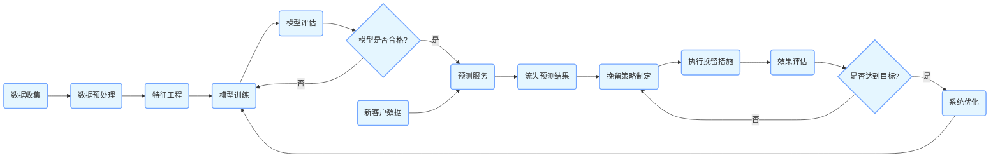

# 智能银行客户流失预防系统

> 关键词：智能银行、客户流失预防、数据分析、机器学习、预测模型

> 摘要：本文围绕智能银行客户流失预防系统展开，深入探讨其核心概念、算法原理、数学模型等内容。首先介绍了该系统的背景信息，包括目的、预期读者等。接着阐述核心概念与联系，给出原理和架构示意图。详细讲解核心算法原理及操作步骤，并用 Python 代码进行说明。通过数学模型和公式进一步剖析系统机制，结合项目实战展示代码实现与解读。分析实际应用场景，推荐相关工具和资源。最后总结未来发展趋势与挑战，还设有附录解答常见问题并提供扩展阅读与参考资料，旨在为银行构建有效的客户流失预防系统提供全面的技术指导。

## 1. 背景介绍 
### 1.1 目的和范围
在当今竞争激烈的金融市场环境下，银行面临着客户流失的严峻挑战。客户流失不仅意味着直接的业务收入损失，还可能影响银行的市场声誉和长期发展。智能银行客户流失预防系统的主要目的是通过对银行客户数据的深入分析，提前预测可能流失的客户，并采取相应的措施来挽留这些客户，从而降低客户流失率，提高银行的经济效益和市场竞争力。

本系统的范围涵盖了从数据收集、预处理、模型构建、预测到制定挽留策略的整个流程。涉及的数据包括客户的基本信息、交易记录、账户信息、客服交互记录等多方面的数据。通过对这些数据的综合分析，系统能够识别出客户流失的潜在风险因素，并为银行提供针对性的决策支持。

### 1.2 预期读者
本文的预期读者主要包括银行的管理人员、数据分析师、技术研发人员以及对智能银行和客户关系管理感兴趣的专业人士。银行管理人员可以从本文中了解客户流失预防系统的重要性和实际应用价值，为银行的战略决策提供参考。数据分析师可以学习到如何运用数据分析和机器学习技术来构建有效的客户流失预测模型。技术研发人员则可以获取系统开发的具体技术细节和实现方案。

### 1.3 文档结构概述
本文将按照以下结构进行详细阐述：首先介绍智能银行客户流失预防系统的核心概念与联系，包括系统的原理和架构；接着讲解核心算法原理及具体操作步骤，并给出相应的 Python 代码实现；然后介绍系统所涉及的数学模型和公式，并通过举例进行说明；之后通过项目实战展示系统的代码实际案例和详细解释；分析系统在实际中的应用场景；推荐相关的工具和资源，包括学习资源、开发工具框架和相关论文著作；最后总结系统的未来发展趋势与挑战，并在附录中解答常见问题，提供扩展阅读和参考资料。

### 1.4 术语表
#### 1.4.1 核心术语定义
- **客户流失**：指客户停止与银行进行业务往来，关闭账户或不再使用银行的服务。
- **流失预测模型**：通过对客户数据的分析和建模，预测客户是否会流失的数学模型。
- **特征工程**：从原始数据中提取和选择对模型预测有重要影响的特征的过程。
- **机器学习算法**：一类通过数据学习模式和规律，并进行预测和决策的算法，如逻辑回归、决策树、随机森林等。
- **挽留策略**：针对预测可能流失的客户，银行采取的一系列措施，如优惠活动、个性化服务等，以挽留客户。

#### 1.4.2 相关概念解释
- **数据挖掘**：从大量数据中发现有价值信息和知识的过程，是构建客户流失预测模型的基础。
- **模型评估**：对构建的预测模型进行评估，衡量模型的性能和准确性，常用的评估指标有准确率、召回率、F1 值等。
- **过拟合**：模型在训练数据上表现良好，但在测试数据上表现不佳的现象，需要通过正则化等方法进行避免。
- **欠拟合**：模型过于简单，无法捕捉数据中的复杂模式和规律，导致预测性能低下的现象，需要调整模型结构或增加特征。

#### 1.4.3 缩略词列表
- **ROC**：Receiver Operating Characteristic，受试者工作特征曲线，用于评估分类模型的性能。
- **AUC**：Area Under the Curve，曲线下面积，是 ROC 曲线下的面积，用于衡量模型的分类能力。
- **KPI**：Key Performance Indicator，关键绩效指标，用于衡量银行客户流失预防系统的效果。
- **API**：Application Programming Interface，应用程序编程接口，用于系统与其他系统或应用之间的数据交互。

## 2. 核心概念与联系 
### 核心概念原理
智能银行客户流失预防系统的核心原理是基于数据分析和机器学习技术，通过对银行客户的历史数据进行挖掘和分析，构建客户流失预测模型。该模型可以根据客户的当前状态和行为特征，预测客户在未来一段时间内流失的概率。

具体来说，系统首先收集客户的各种数据，包括基本信息、交易记录、账户信息等。然后对这些数据进行预处理，包括数据清洗、特征提取和特征选择等操作，以提高数据的质量和可用性。接着，使用机器学习算法对预处理后的数据进行训练，构建客户流失预测模型。最后，将新的客户数据输入到模型中，得到客户流失的预测结果。

### 架构示意图


### 架构解释
- **数据收集**：从银行的各个业务系统中收集客户的相关数据，包括客户信息系统、交易系统、客服系统等。
- **数据预处理**：对收集到的数据进行清洗、转换和集成，去除噪声数据和缺失值，统一数据格式。
- **特征工程**：从预处理后的数据中提取和选择对客户流失预测有重要影响的特征，如客户的年龄、账户余额、交易频率等。
- **模型训练**：使用机器学习算法对特征工程后的数据进行训练，构建客户流失预测模型。
- **模型评估**：使用评估指标对训练好的模型进行评估，判断模型的性能和准确性。
- **预测服务**：将新的客户数据输入到训练好的模型中，得到客户流失的预测结果。
- **挽留策略制定**：根据预测结果，为可能流失的客户制定相应的挽留策略，如提供优惠活动、个性化服务等。
- **执行挽留措施**：将挽留策略付诸实践，与客户进行沟通和互动，尝试挽留客户。
- **效果评估**：对挽留措施的效果进行评估，判断是否达到预期目标。
- **系统优化**：根据效果评估的结果，对系统进行优化和改进，提高系统的性能和预测准确性。

## 3. 核心算法原理 & 具体操作步骤 
### 逻辑回归算法原理
逻辑回归是一种常用的分类算法，用于解决二分类问题，如客户是否会流失。其基本原理是通过对输入特征进行线性组合，然后通过逻辑函数将线性组合的结果映射到 0 到 1 之间的概率值。

逻辑函数的表达式为：
$$
\sigma(z)=\frac{1}{1 + e^{-z}}
$$
其中，$z$ 是输入特征的线性组合，即：
$$
z = \theta_0 + \theta_1x_1 + \theta_2x_2 + \cdots + \theta_nx_n
$$
$\theta_0, \theta_1, \cdots, \theta_n$ 是模型的参数，$x_1, x_2, \cdots, x_n$ 是输入特征。

逻辑回归模型的输出是客户流失的概率 $P(y = 1|x)$，其中 $y = 1$ 表示客户流失，$y = 0$ 表示客户不流失。概率值可以通过以下公式计算：
$$
P(y = 1|x) = \sigma(\theta^T x)
$$
其中，$\theta$ 是参数向量，$x$ 是输入特征向量。

### 具体操作步骤
1. **数据准备**：收集客户的相关数据，并进行预处理，包括数据清洗、特征提取和特征选择等操作。
2. **划分数据集**：将预处理后的数据划分为训练集和测试集，一般按照 7:3 或 8:2 的比例进行划分。
3. **模型训练**：使用训练集数据对逻辑回归模型进行训练，通过最小化损失函数来估计模型的参数。逻辑回归的损失函数通常使用对数损失函数，其表达式为：
$$
J(\theta)=-\frac{1}{m}\sum_{i = 1}^{m}[y^{(i)}\log(P(y^{(i)} = 1|x^{(i)}))+(1 - y^{(i)})\log(1 - P(y^{(i)} = 1|x^{(i)}))]
$$
其中，$m$ 是训练样本的数量，$y^{(i)}$ 是第 $i$ 个样本的真实标签，$P(y^{(i)} = 1|x^{(i)})$ 是第 $i$ 个样本的预测概率。

4. **模型评估**：使用测试集数据对训练好的模型进行评估，计算评估指标，如准确率、召回率、F1 值等。
5. **预测服务**：将新的客户数据输入到训练好的模型中，得到客户流失的预测结果。

### Python 代码实现
```python
import pandas as pd
from sklearn.model_selection import train_test_split
from sklearn.linear_model import LogisticRegression
from sklearn.metrics import accuracy_score, recall_score, f1_score

# 读取数据
data = pd.read_csv('customer_data.csv')

# 划分特征和标签
X = data.drop('Churn', axis=1)
y = data['Churn']

# 划分训练集和测试集
X_train, X_test, y_train, y_test = train_test_split(X, y, test_size=0.3, random_state=42)

# 创建逻辑回归模型
model = LogisticRegression()

# 模型训练
model.fit(X_train, y_train)

# 模型预测
y_pred = model.predict(X_test)

# 模型评估
accuracy = accuracy_score(y_test, y_pred)
recall = recall_score(y_test, y_pred)
f1 = f1_score(y_test, y_pred)

print(f'Accuracy: {accuracy}')
print(f'Recall: {recall}')
print(f'F1 Score: {f1}')
```

## 4. 数学模型和公式 & 详细讲解 & 举例说明 
### 逻辑回归模型的数学推导
逻辑回归模型的目标是找到一组参数 $\theta$，使得模型对训练数据的预测结果尽可能接近真实标签。这可以通过最小化损失函数来实现。

对数损失函数的梯度可以通过求导得到：
$$
\frac{\partial J(\theta)}{\partial \theta_j}=\frac{1}{m}\sum_{i = 1}^{m}(\sigma(\theta^T x^{(i)}) - y^{(i)})x_j^{(i)}
$$
其中，$j = 0, 1, \cdots, n$。

通过梯度下降算法，可以迭代更新参数 $\theta$，使得损失函数 $J(\theta)$ 逐渐减小。梯度下降算法的更新公式为：
$$
\theta_j := \theta_j-\alpha\frac{\partial J(\theta)}{\partial \theta_j}
$$
其中，$\alpha$ 是学习率，控制参数更新的步长。

### 举例说明
假设我们有一个简单的客户流失数据集，包含两个特征：客户的年龄和账户余额，以及一个标签：客户是否流失。数据集如下：

| 年龄 | 账户余额 | 流失 |
|------|----------|------|
| 25   | 1000     | 0    |
| 30   | 2000     | 0    |
| 35   | 3000     | 1    |
| 40   | 4000     | 1    |

我们可以使用逻辑回归模型对这个数据集进行训练和预测。

```python
import numpy as np
from sklearn.linear_model import LogisticRegression

# 特征数据
X = np.array([[25, 1000], [30, 2000], [35, 3000], [40, 4000]])

# 标签数据
y = np.array([0, 0, 1, 1])

# 创建逻辑回归模型
model = LogisticRegression()

# 模型训练
model.fit(X, y)

# 新客户数据
new_customer = np.array([[32, 2500]])

# 预测新客户是否会流失
prediction = model.predict(new_customer)

print(f'Prediction: {prediction}')
```

在这个例子中，我们使用逻辑回归模型对新客户是否会流失进行了预测。模型根据客户的年龄和账户余额，输出了预测结果。

## 5. 项目实战：代码实际案例和详细解释说明 
### 5.1  开发环境搭建
在进行智能银行客户流失预防系统的开发之前，需要搭建相应的开发环境。以下是具体的搭建步骤：

1. **安装 Python**：建议使用 Python 3.7 及以上版本，可以从 Python 官方网站（https://www.python.org/downloads/）下载并安装。
2. **安装必要的库**：使用以下命令安装必要的 Python 库：
```bash
pip install pandas numpy scikit-learn matplotlib seaborn
```
3. **选择开发工具**：可以选择使用 Jupyter Notebook、PyCharm 等开发工具进行代码编写和调试。

### 5.2  源代码详细实现和代码解读
以下是一个完整的智能银行客户流失预防系统的代码实现：

```python
import pandas as pd
import numpy as np
from sklearn.model_selection import train_test_split
from sklearn.linear_model import LogisticRegression
from sklearn.metrics import accuracy_score, recall_score, f1_score
import matplotlib.pyplot as plt
import seaborn as sns

# 读取数据
data = pd.read_csv('customer_data.csv')

# 数据探索性分析
print('数据基本信息：')
data.info()

# 查看数据集行数和列数
rows, columns = data.shape

if rows < 1000:
    # 小样本数据（行数少于1000）查看全量数据信息
    print('数据全部内容信息：')
    print(data.to_csv(sep='\t', na_rep='nan'))
else:
    # 大样本数据查看数据前几行信息
    print('数据前几行内容信息：')
    print(data.head().to_csv(sep='\t', na_rep='nan'))

# 查看数据集行数和列数
rows, columns = data.shape

# 查看特征和标签的唯一值
for col in data.columns:
    if len(data[col].unique()) < 20:
        # 唯一值少于20查看全量唯一值信息
        print(f'{col}全部内容唯一值信息：{data[col].unique()}')
    else:
        # 唯一值多于20查看前几行唯一值信息
        print(f'{col}前几行内容唯一值信息：{data[col].unique()[:20]}')

# 数据可视化
# 统计流失情况
churn_counts = data['Churn'].value_counts()

# 绘制流失情况柱状图
plt.figure(figsize=(8, 6))
sns.barplot(x=churn_counts.index, y=churn_counts.values)
plt.xlabel('Churn')
plt.ylabel('Count')
plt.title('Customer Churn Distribution')
plt.show()

# 划分特征和标签
X = data.drop('Churn', axis=1)
y = data['Churn']

# 划分训练集和测试集
X_train, X_test, y_train, y_test = train_test_split(X, y, test_size=0.3, random_state=42)

# 创建逻辑回归模型
model = LogisticRegression()

# 模型训练
model.fit(X_train, y_train)

# 模型预测
y_pred = model.predict(X_test)

# 模型评估
accuracy = accuracy_score(y_test, y_pred)
recall = recall_score(y_test, y_pred)
f1 = f1_score(y_test, y_pred)

print(f'Accuracy: {accuracy}')
print(f'Recall: {recall}')
print(f'F1 Score: {f1}')
```

### 代码解读与分析
1. **数据读取**：使用 `pandas` 库的 `read_csv` 函数读取客户数据文件。
2. **数据探索性分析**：使用 `info` 方法查看数据的基本信息，使用 `head` 方法查看数据的前几行信息，使用 `unique` 方法查看特征和标签的唯一值。
3. **数据可视化**：使用 `seaborn` 库绘制客户流失情况的柱状图，直观地展示客户流失的分布情况。
4. **数据划分**：使用 `train_test_split` 函数将数据划分为训练集和测试集，比例为 7:3。
5. **模型训练**：创建逻辑回归模型，并使用训练集数据对模型进行训练。
6. **模型预测**：使用训练好的模型对测试集数据进行预测。
7. **模型评估**：使用 `accuracy_score`、`recall_score` 和 `f1_score` 函数计算模型的准确率、召回率和 F1 值，评估模型的性能。

## 6. 实际应用场景 
### 银行市场营销
智能银行客户流失预防系统可以帮助银行在市场营销方面做出更精准的决策。通过预测客户流失的概率，银行可以针对可能流失的客户制定个性化的营销活动，如提供专属的理财产品、优惠利率、现金返还等，以提高客户的忠诚度和满意度。同时，银行还可以根据客户的流失风险对客户进行分层管理，将营销资源集中在高风险客户上，提高营销效果和投资回报率。

### 客户服务优化
系统可以为银行的客户服务部门提供有价值的信息。当客户被预测为有流失风险时，客户服务人员可以及时与客户进行沟通，了解客户的需求和问题，并提供个性化的解决方案。例如，为客户提供更加便捷的服务渠道、解决客户的投诉和纠纷等，从而提高客户的满意度和留存率。

### 产品优化与创新
通过对客户流失原因的分析，银行可以发现现有产品和服务存在的问题和不足，从而进行产品优化和创新。例如，如果发现大量客户因为某一产品的手续费过高而流失，银行可以考虑降低该产品的手续费；如果发现客户对某一服务的体验不佳，银行可以对该服务进行改进和升级。此外，银行还可以根据客户的需求和偏好，开发新的产品和服务，以满足客户的多样化需求。

### 风险管理
客户流失不仅会影响银行的业务收入，还可能带来一定的风险。例如，流失客户可能会拖欠贷款、信用卡欠款等，给银行带来信用风险。智能银行客户流失预防系统可以帮助银行提前识别这些风险客户，并采取相应的风险控制措施，如加强催收力度、调整信用额度等，以降低银行的风险损失。

## 7. 工具和资源推荐
### 7.1 学习资源推荐
#### 7.1.1 书籍推荐
- 《Python 数据分析实战》：本书详细介绍了使用 Python 进行数据分析的方法和技巧，包括数据清洗、数据可视化、机器学习等内容，对于学习智能银行客户流失预防系统的数据分析部分非常有帮助。
- 《机器学习实战》：通过实际案例介绍了多种机器学习算法的原理和应用，包括逻辑回归、决策树、随机森林等，是学习机器学习算法的经典书籍。
- 《Python 机器学习》：系统地介绍了 Python 在机器学习领域的应用，包括数据预处理、模型选择、模型评估等内容，适合初学者学习。

#### 7.1.2 在线课程
- Coursera 上的《机器学习》课程：由斯坦福大学教授 Andrew Ng 主讲，是全球最受欢迎的机器学习课程之一，内容涵盖了机器学习的基本概念、算法和应用。
- edX 上的《数据科学微硕士项目》：该项目包含多个数据科学相关的课程，如数据分析、机器学习、深度学习等，适合系统学习数据科学知识。
- 阿里云天池的《Python 数据分析与机器学习实战》：结合实际案例，介绍了 Python 在数据分析和机器学习中的应用，对于实际项目的开发有很大的帮助。

#### 7.1.3 技术博客和网站
- Kaggle：全球最大的数据科学社区，提供了丰富的数据集、竞赛和教程，对于学习和实践数据科学非常有帮助。
- Towards Data Science：一个专注于数据科学和机器学习的技术博客，上面有很多优秀的文章和教程，涵盖了各种数据分析和机器学习的主题。
- 博客园：国内知名的技术博客平台，有很多数据科学和机器学习领域的博主分享他们的经验和心得。

### 7.2 开发工具框架推荐
#### 7.2.1 IDE和编辑器
- PyCharm：一款专业的 Python 集成开发环境，具有代码编辑、调试、版本控制等功能，适合开发大型的 Python 项目。
- Jupyter Notebook：一个交互式的笔记本环境，可以在浏览器中编写和运行代码，支持多种编程语言，非常适合数据分析和机器学习的实验和演示。
- Visual Studio Code：一款轻量级的代码编辑器，支持多种编程语言和插件，具有丰富的扩展功能，适合快速开发和调试代码。

#### 7.2.2 调试和性能分析工具
- Py-Spy：一个轻量级的 Python 性能分析工具，可以实时监控 Python 程序的性能，找出性能瓶颈。
- cProfile：Python 内置的性能分析模块，可以对 Python 程序进行详细的性能分析，输出函数调用时间、调用次数等信息。
- PDB：Python 内置的调试器，可以在代码中设置断点，逐行调试代码，帮助开发者找出代码中的错误。

#### 7.2.3 相关框架和库
- Pandas：一个强大的数据分析库，提供了数据结构和数据分析工具，方便进行数据清洗、数据处理和数据分析。
- NumPy：一个用于科学计算的 Python 库，提供了高性能的多维数组对象和数学函数，是许多数据分析和机器学习库的基础。
- Scikit-learn：一个常用的机器学习库，提供了多种机器学习算法和工具，如分类、回归、聚类等，方便进行机器学习模型的构建和评估。

### 7.3 相关论文著作推荐
#### 7.3.1 经典论文
- 《The Elements of Statistical Learning》：统计学习领域的经典著作，系统地介绍了统计学习的基本理论、方法和算法，对于理解机器学习的原理和方法非常有帮助。
- 《Pattern Recognition and Machine Learning》：模式识别和机器学习领域的经典教材，涵盖了模式识别和机器学习的各个方面，包括概率模型、线性模型、神经网络等。
- 《Data Mining: Concepts and Techniques》：数据挖掘领域的经典著作，介绍了数据挖掘的基本概念、方法和应用，对于学习数据挖掘技术非常有帮助。

#### 7.3.2 最新研究成果
- 《Customer Churn Prediction in the Telecommunication Industry Using Machine Learning Techniques》：该论文研究了如何使用机器学习技术预测电信行业的客户流失，提出了一些新的模型和方法，对于智能银行客户流失预防系统的研究具有一定的参考价值。
- 《A Comparative Study of Machine Learning Algorithms for Customer Churn Prediction》：比较了多种机器学习算法在客户流失预测中的性能，为选择合适的算法提供了参考。
- 《Using Deep Learning for Customer Churn Prediction in the Banking Industry》：探讨了如何使用深度学习技术进行银行客户流失预测，展示了深度学习在该领域的应用潜力。

#### 7.3.3 应用案例分析
- 《Case Studies in Data Mining》：通过实际案例介绍了数据挖掘在各个领域的应用，包括客户关系管理、市场营销等，对于理解智能银行客户流失预防系统的实际应用有很大的帮助。
- 《Real-World Machine Learning》：结合实际案例，介绍了机器学习在现实世界中的应用，包括客户流失预测、欺诈检测等，提供了一些实用的解决方案和经验教训。

## 8. 总结：未来发展趋势与挑战
### 未来发展趋势
- **智能化和自动化**：随着人工智能技术的不断发展，智能银行客户流失预防系统将越来越智能化和自动化。系统将能够自动收集、处理和分析数据，自动调整模型参数，自动制定挽留策略，减少人工干预，提高系统的效率和准确性。
- **多模态数据融合**：未来的系统将不仅仅依赖于传统的结构化数据，还将融合更多的多模态数据，如文本数据、图像数据、音频数据等。通过对多模态数据的综合分析，系统可以更全面地了解客户的需求和行为，提高客户流失预测的准确性。
- **实时预测和预警**：为了及时采取挽留措施，未来的系统将具备实时预测和预警功能。系统可以实时监测客户的行为和状态，一旦发现客户有流失风险，立即发出预警信号，提醒银行采取相应的措施。
- **个性化服务**：未来的系统将更加注重个性化服务，根据每个客户的特点和需求，提供个性化的挽留策略和服务。通过个性化服务，提高客户的满意度和忠诚度，降低客户流失率。

### 挑战
- **数据质量和安全**：智能银行客户流失预防系统需要大量的客户数据来进行分析和建模，数据的质量和安全至关重要。银行需要确保数据的准确性、完整性和一致性，同时还要保护客户的数据隐私和安全，防止数据泄露和滥用。
- **模型解释性**：虽然机器学习模型在客户流失预测中取得了很好的效果，但大多数模型都是黑盒模型，缺乏解释性。银行需要了解模型的决策过程和依据，以便更好地制定挽留策略和决策。因此，如何提高模型的解释性是未来需要解决的一个重要问题。
- **技术更新换代**：人工智能技术发展迅速，新的算法和模型不断涌现。银行需要不断学习和掌握新的技术，及时更新和优化系统，以保持系统的先进性和竞争力。
- **业务融合**：智能银行客户流失预防系统不仅仅是一个技术系统，还需要与银行的业务流程和管理体系相结合。如何将系统的预测结果转化为实际的业务行动，如何协调各个部门之间的工作，是未来需要解决的另一个挑战。

## 9. 附录：常见问题与解答
### 问题 1：数据预处理的重要性是什么？
数据预处理是构建智能银行客户流失预防系统的重要步骤，其重要性主要体现在以下几个方面：
- **提高数据质量**：原始数据中可能存在噪声数据、缺失值、异常值等问题，这些问题会影响模型的训练和预测效果。通过数据预处理，可以清洗和处理这些问题，提高数据的质量。
- **减少数据维度**：原始数据中可能包含大量的特征，其中一些特征可能对模型的预测没有帮助，甚至会增加模型的复杂度和过拟合的风险。通过特征选择和降维技术，可以减少数据的维度，提高模型的效率和准确性。
- **统一数据格式**：不同数据源的数据格式可能不同，需要进行数据转换和集成，统一数据格式，以便后续的分析和处理。

### 问题 2：如何选择合适的机器学习算法？
选择合适的机器学习算法需要考虑以下几个因素：
- **问题类型**：根据问题的类型，选择合适的算法。例如，如果是分类问题，可以选择逻辑回归、决策树、随机森林等算法；如果是回归问题，可以选择线性回归、岭回归、Lasso 回归等算法。
- **数据特点**：根据数据的特点，选择合适的算法。例如，如果数据量较小，可以选择简单的算法，如逻辑回归；如果数据量较大，可以选择复杂的算法，如深度学习算法。
- **模型性能**：根据模型的性能指标，如准确率、召回率、F1 值等，选择合适的算法。可以通过交叉验证等方法对不同的算法进行评估和比较，选择性能最优的算法。
- **解释性要求**：如果对模型的解释性有较高的要求，可以选择解释性较好的算法，如决策树、逻辑回归等；如果对模型的解释性要求不高，可以选择性能较好但解释性较差的算法，如深度学习算法。

### 问题 3：如何评估客户流失预测模型的性能？
评估客户流失预测模型的性能可以使用以下几种指标：
- **准确率（Accuracy）**：预测正确的样本数占总样本数的比例，反映了模型的整体预测能力。
- **召回率（Recall）**：预测为正例的样本中实际为正例的比例，反映了模型对正例的识别能力。在客户流失预测中，召回率越高，说明模型能够识别出更多的流失客户。
- **F1 值（F1 Score）**：准确率和召回率的调和平均数，综合考虑了模型的准确率和召回率。F1 值越高，说明模型的性能越好。
- **ROC 曲线和 AUC 值**：ROC 曲线是描述分类器在不同阈值下的真正率（True Positive Rate）和假正率（False Positive Rate）之间的关系的曲线。AUC 值是 ROC 曲线下的面积，反映了模型的分类能力。AUC 值越接近 1，说明模型的性能越好。

### 问题 4：如何制定有效的挽留策略？
制定有效的挽留策略需要考虑以下几个方面：
- **了解客户需求**：通过与客户进行沟通和互动，了解客户的需求和问题，找出客户流失的原因。
- **个性化服务**：根据客户的特点和需求，提供个性化的挽留策略和服务。例如，为高价值客户提供专属的优惠活动和服务，为低价值客户提供基本的挽留措施。
- **及时响应**：当发现客户有流失风险时，及时与客户进行沟通和互动，采取相应的挽留措施。响应时间越短，挽留成功的概率越高。
- **持续跟进**：挽留客户不是一次性的工作，需要持续跟进客户的情况，了解客户的满意度和忠诚度，及时调整挽留策略。

## 10. 扩展阅读 & 参考资料
### 扩展阅读
- 《人工智能时代的银行转型》：探讨了人工智能技术在银行领域的应用和发展趋势，对于了解智能银行的发展方向有很大的帮助。
- 《客户关系管理》：介绍了客户关系管理的基本概念、方法和策略，对于提高银行的客户满意度和忠诚度有很大的启示。
- 《大数据时代的金融创新》：分析了大数据技术在金融领域的应用和创新，对于了解智能银行客户流失预防系统的数据驱动特点有很大的帮助。

### 参考资料
- 《Python 数据分析实战》，作者：[美] Wes McKinney，机械工业出版社
- 《机器学习实战》，作者：[美] Peter Harrington，人民邮电出版社
- 《Python 机器学习》，作者：[德] Sebastian Raschka，人民邮电出版社
- 《The Elements of Statistical Learning》，作者：[美] Trevor Hastie、Robert Tibshirani、Jerome Friedman，Springer
- 《Pattern Recognition and Machine Learning》，作者：[英] Christopher M. Bishop，Springer
- 《Data Mining: Concepts and Techniques》，作者：[加] Jiawei Han、[加] Micheline Kamber、[澳] Jian Pei，机械工业出版社

作者：AI天才研究院/AI Genius Institute & 禅与计算机程序设计艺术 /Zen And The Art of Computer Programming