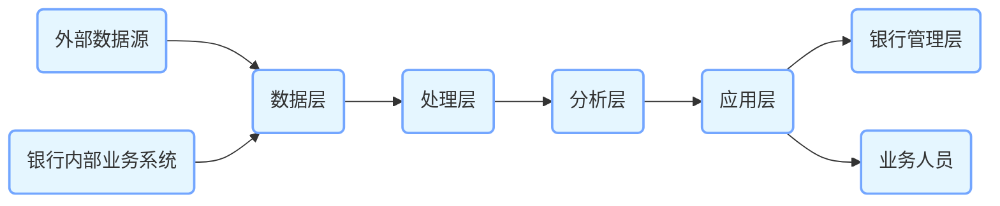

# 智能银行资产负债管理系统

> 关键词：智能银行、资产负债管理系统、风险管理、数据分析、金融科技

> 摘要：本文聚焦于智能银行资产负债管理系统，旨在全面深入地探讨该系统的各个方面。从背景介绍出发，明确其目的、范围、预期读者等信息，详细阐述核心概念与联系，包括系统原理和架构，并以流程图呈现。深入剖析核心算法原理，结合 Python 源代码进行说明，同时给出数学模型和公式并举例讲解。通过项目实战，展示开发环境搭建、源代码实现及解读。分析系统的实际应用场景，推荐相关学习资源、开发工具框架和论文著作。最后总结系统未来发展趋势与挑战，解答常见问题并提供扩展阅读和参考资料，为智能银行资产负债管理提供全面且深入的技术指导。

## 1. 背景介绍 
### 1.1 目的和范围
智能银行资产负债管理系统的主要目的是帮助银行有效管理其资产和负债，以实现风险控制、利润最大化和战略目标。该系统能够实时监控银行的资产负债状况，分析各种风险因素，如利率风险、流动性风险等，并提供决策支持，帮助银行管理层做出合理的资产配置和风险管理决策。

其范围涵盖了银行的各类资产和负债，包括贷款、存款、债券、金融衍生品等。系统不仅要处理日常的业务数据，还要进行复杂的风险分析和预测，为银行的长期发展提供战略规划支持。

### 1.2 预期读者
本文的预期读者主要包括银行的管理人员、风险管理专家、金融科技开发者以及对智能银行资产负债管理感兴趣的研究人员。银行管理人员可以通过本文了解系统的功能和价值，为银行的信息化建设提供决策依据；风险管理专家可以深入学习系统的风险分析方法和技术；金融科技开发者可以获取系统开发的技术细节和实践经验；研究人员可以从理论和实践的角度对智能银行资产负债管理进行更深入的研究。

### 1.3 文档结构概述
本文将按照以下结构进行阐述：首先介绍智能银行资产负债管理系统的背景信息，包括目的、范围、预期读者和文档结构概述；接着详细讲解系统的核心概念与联系，通过文本示意图和 Mermaid 流程图展示系统原理和架构；然后深入分析核心算法原理，并使用 Python 源代码进行详细阐述，同时给出数学模型和公式并举例说明；通过项目实战，介绍开发环境搭建、源代码实现和代码解读；分析系统的实际应用场景；推荐相关的学习资源、开发工具框架和论文著作；最后总结系统的未来发展趋势与挑战，解答常见问题并提供扩展阅读和参考资料。

### 1.4 术语表
#### 1.4.1 核心术语定义
- **资产负债管理**：是指银行对其资产和负债的规模、结构、期限、利率等方面进行综合管理，以实现风险控制和利润最大化的目标。
- **利率风险**：是指由于市场利率波动而导致银行资产和负债价值发生变化的风险。
- **流动性风险**：是指银行无法及时满足客户提款需求或支付到期债务的风险。
- **金融衍生品**：是指一种基于基础金融资产（如股票、债券、货币等）的金融合约，其价值取决于基础金融资产的价格变化。

#### 1.4.2 相关概念解释
- **资产负债表**：是银行财务报表的重要组成部分，反映了银行在某一特定日期的资产、负债和所有者权益状况。
- **风险度量模型**：是用于量化各种风险的数学模型，如 VaR（Value at Risk）模型、久期模型等。
- **压力测试**：是一种风险评估方法，通过模拟极端市场情况，评估银行在不利条件下的风险承受能力。

#### 1.4.3 缩略词列表
- **ALM**：Asset Liability Management（资产负债管理）
- **VaR**：Value at Risk（风险价值）
- **IRRBB**：Interest Rate Risk in the Banking Book（银行账簿利率风险）

## 2. 核心概念与联系 

### 核心概念原理
智能银行资产负债管理系统的核心原理是通过对银行资产和负债的全面监控和分析，实现风险的有效管理和资源的优化配置。系统主要基于以下几个核心概念：

- **资产负债匹配**：银行需要确保其资产和负债在期限、利率、流动性等方面相互匹配，以降低风险。例如，银行可以通过调整贷款和存款的期限结构，避免出现期限错配的情况。
- **风险评估与度量**：系统需要对各种风险进行准确的评估和度量，如利率风险、流动性风险等。常用的风险度量方法包括 VaR 模型、久期模型等。
- **决策支持**：系统根据风险评估结果和银行的战略目标，为银行管理层提供决策支持，帮助他们做出合理的资产配置和风险管理决策。

### 架构的文本示意图
智能银行资产负债管理系统通常由数据层、处理层、分析层和应用层组成。

- **数据层**：负责收集和存储银行的各类业务数据，包括资产数据、负债数据、市场数据等。数据可以来自银行内部的业务系统，也可以从外部数据源获取。
- **处理层**：对数据层收集的数据进行清洗、转换和整合，以确保数据的准确性和一致性。处理层还可以进行数据的加密和备份，以保障数据的安全性。
- **分析层**：运用各种风险分析模型和算法，对处理后的数据进行分析和计算，评估银行的风险状况和资产负债状况。分析层可以生成各种报表和图表，直观地展示分析结果。
- **应用层**：为银行管理层和业务人员提供各种应用功能，如风险监控、决策支持、资产配置等。应用层可以通过 Web 界面、移动应用等方式提供服务，方便用户使用。

### Mermaid 流程图


## 3. 核心算法原理 & 具体操作步骤 

### 核心算法原理
智能银行资产负债管理系统中常用的核心算法包括利率风险度量算法、流动性风险度量算法和资产配置算法。

#### 利率风险度量算法 - VaR 模型
VaR 模型是一种常用的风险度量方法，用于衡量在一定置信水平下，银行资产组合在未来一段时间内可能遭受的最大损失。其基本原理是通过对历史数据的分析，估计资产组合的收益率分布，然后根据收益率分布计算在一定置信水平下的最大损失。

#### 流动性风险度量算法 - 流动性覆盖率（LCR）
流动性覆盖率是指银行优质流动性资产储备与未来 30 天内净现金流出量的比率。其目的是确保银行在压力情况下有足够的流动性来满足其短期债务需求。计算公式为：

$$LCR = \frac{优质流动性资产储备}{未来30天内净现金流出量}$$

#### 资产配置算法 - 均值 - 方差模型
均值 - 方差模型是由马科维茨提出的一种资产配置方法，其基本思想是在给定风险水平下，通过优化资产组合的权重，使资产组合的预期收益率最大化；或者在给定预期收益率下，使资产组合的风险最小化。

### 具体操作步骤及 Python 源代码

#### 利率风险度量 - VaR 模型的 Python 实现
```python
import numpy as np
import pandas as pd
from scipy.stats import norm

# 生成模拟收益率数据
np.random.seed(0)
returns = np.random.normal(0, 0.01, 1000)

# 计算 VaR
confidence_level = 0.95
VaR = norm.ppf(1 - confidence_level, np.mean(returns), np.std(returns))

print(f"在 {confidence_level * 100}% 的置信水平下，VaR 为: {VaR:.4f}")
```

#### 流动性风险度量 - LCR 的 Python 实现
```python
# 假设优质流动性资产储备为 1000 万元，未来 30 天内净现金流出量为 800 万元
high_quality_liquid_assets = 1000
net_cash_outflow_30_days = 800

# 计算 LCR
LCR = high_quality_liquid_assets / net_cash_outflow_30_days

print(f"流动性覆盖率 (LCR) 为: {LCR:.2f}")
```

#### 资产配置 - 均值 - 方差模型的 Python 实现
```python
import pandas as pd
import numpy as np
from pypfopt.efficient_frontier import EfficientFrontier
from pypfopt import risk_models
from pypfopt import expected_returns

# 假设我们有三种资产的历史收益率数据
data = {
    'Asset1': [0.01, 0.02, 0.03, 0.04, 0.05],
    'Asset2': [0.02, 0.03, 0.04, 0.05, 0.06],
    'Asset3': [0.03, 0.04, 0.05, 0.06, 0.07]
}
df = pd.DataFrame(data)

# 计算预期收益率和协方差矩阵
mu = expected_returns.mean_historical_return(df)
S = risk_models.sample_cov(df)

# 创建有效前沿对象
ef = EfficientFrontier(mu, S)

# 最大化夏普比率
weights = ef.max_sharpe()
cleaned_weights = ef.clean_weights()

print("最优资产配置权重:")
print(cleaned_weights)
```

## 4. 数学模型和公式 & 详细讲解 & 举例说明 

### 利率风险度量 - VaR 模型
#### 数学公式
VaR 模型的基本公式为：

$$VaR = \mu - z_{\alpha} \sigma$$

其中，$\mu$ 是资产组合的预期收益率，$\sigma$ 是资产组合的收益率标准差，$z_{\alpha}$ 是标准正态分布的分位数，对应于置信水平 $1 - \alpha$。

#### 详细讲解
VaR 模型的核心思想是通过对资产组合的收益率分布进行建模，估计在一定置信水平下的最大损失。在实际应用中，通常假设资产组合的收益率服从正态分布，因此可以使用标准正态分布的分位数来计算 VaR。

#### 举例说明
假设某银行的资产组合预期收益率为 5%，收益率标准差为 10%，置信水平为 95%。查标准正态分布表可知，$z_{0.05} = 1.645$。则该资产组合的 VaR 为：

$$VaR = 0.05 - 1.645 \times 0.1 = -0.1145$$

这意味着在 95% 的置信水平下，该资产组合在未来一段时间内可能遭受的最大损失为 11.45%。

### 流动性风险度量 - 流动性覆盖率（LCR）
#### 数学公式
$$LCR = \frac{优质流动性资产储备}{未来30天内净现金流出量}$$

#### 详细讲解
流动性覆盖率的目的是确保银行在压力情况下有足够的流动性来满足其短期债务需求。优质流动性资产储备是指银行持有的可以在短期内变现的资产，如现金、国债等；未来 30 天内净现金流出量是指银行在未来 30 天内预计的现金流出减去现金流入的差额。

#### 举例说明
假设某银行的优质流动性资产储备为 5000 万元，未来 30 天内净现金流出量为 4000 万元。则该银行的流动性覆盖率为：

$$LCR = \frac{5000}{4000} = 1.25$$

这意味着该银行的优质流动性资产储备是未来 30 天内净现金流出量的 1.25 倍，说明该银行在短期内具有较强的流动性。

### 资产配置 - 均值 - 方差模型
#### 数学公式
均值 - 方差模型的目标是在给定风险水平下最大化预期收益率，或者在给定预期收益率下最小化风险。其数学表达式为：

$$\min_{w} w^T \Sigma w$$

$$s.t. \quad w^T \mu = \mu_p$$

$$\sum_{i=1}^{n} w_i = 1$$

其中，$w$ 是资产组合的权重向量，$\Sigma$ 是资产收益率的协方差矩阵，$\mu$ 是资产的预期收益率向量，$\mu_p$ 是资产组合的目标预期收益率。

#### 详细讲解
均值 - 方差模型的核心思想是通过优化资产组合的权重，使资产组合的风险和收益达到最优平衡。在实际应用中，可以使用拉格朗日乘数法来求解上述优化问题。

#### 举例说明
假设我们有两种资产，资产 A 的预期收益率为 10%，收益率标准差为 20%；资产 B 的预期收益率为 15%，收益率标准差为 30%。两种资产的收益率相关系数为 0.5。我们的目标是构建一个预期收益率为 12% 的资产组合。

首先，计算资产的预期收益率向量 $\mu$ 和协方差矩阵 $\Sigma$：

$$\mu = \begin{bmatrix} 0.1 \\ 0.15 \end{bmatrix}$$

$$\Sigma = \begin{bmatrix} 0.2^2 & 0.5 \times 0.2 \times 0.3 \\ 0.5 \times 0.2 \times 0.3 & 0.3^2 \end{bmatrix} = \begin{bmatrix} 0.04 & 0.03 \\ 0.03 & 0.09 \end{bmatrix}$$

然后，使用拉格朗日乘数法求解优化问题，得到资产组合的最优权重为：

$$w_A = 0.6$$

$$w_B = 0.4$$

这意味着我们应该将 60% 的资金投资于资产 A，40% 的资金投资于资产 B，以实现预期收益率为 12% 的目标。

## 5. 项目实战：代码实际案例和详细解释说明 

### 5.1  开发环境搭建
#### 操作系统
建议使用 Linux 或 macOS 操作系统，因为这些操作系统对 Python 开发环境的支持较好。如果使用 Windows 操作系统，也可以通过安装 Anaconda 来搭建 Python 开发环境。

#### Python 版本
建议使用 Python 3.7 及以上版本，因为新版本的 Python 包含了更多的新特性和优化。

#### 安装必要的库
在项目中，我们需要使用一些 Python 库来实现智能银行资产负债管理系统的功能，如 pandas、numpy、scipy、pypfopt 等。可以使用以下命令来安装这些库：

```bash
pip install pandas numpy scipy pypfopt
```

### 5.2  源代码详细实现和代码解读
#### 数据加载和预处理
```python
import pandas as pd

# 加载数据
data = pd.read_csv('bank_data.csv')

# 数据清洗
data = data.dropna()

# 数据转换
# 假设数据中包含日期列，将其转换为日期类型
data['date'] = pd.to_datetime(data['date'])

print(data.head())
```

**代码解读**：
- `pd.read_csv('bank_data.csv')`：从 CSV 文件中加载银行数据。
- `data.dropna()`：删除数据中的缺失值。
- `pd.to_datetime(data['date'])`：将日期列转换为日期类型，方便后续的时间序列分析。

#### 利率风险度量
```python
import numpy as np
from scipy.stats import norm

# 假设数据中包含收益率列
returns = data['returns']

# 计算 VaR
confidence_level = 0.95
VaR = norm.ppf(1 - confidence_level, np.mean(returns), np.std(returns))

print(f"在 {confidence_level * 100}% 的置信水平下，VaR 为: {VaR:.4f}")
```

**代码解读**：
- `data['returns']`：从数据中提取收益率列。
- `norm.ppf(1 - confidence_level, np.mean(returns), np.std(returns))`：使用正态分布的分位数函数计算 VaR。

#### 流动性风险度量
```python
# 假设数据中包含优质流动性资产储备和未来 30 天内净现金流出量列
high_quality_liquid_assets = data['high_quality_liquid_assets']
net_cash_outflow_30_days = data['net_cash_outflow_30_days']

# 计算 LCR
LCR = high_quality_liquid_assets / net_cash_outflow_30_days

print("流动性覆盖率 (LCR):")
print(LCR)
```

**代码解读**：
- `data['high_quality_liquid_assets']` 和 `data['net_cash_outflow_30_days']`：从数据中提取优质流动性资产储备和未来 30 天内净现金流出量列。
- `high_quality_liquid_assets / net_cash_outflow_30_days`：计算流动性覆盖率。

#### 资产配置
```python
from pypfopt.efficient_frontier import EfficientFrontier
from pypfopt import risk_models
from pypfopt import expected_returns

# 假设数据中包含多种资产的收益率列
asset_returns = data[['asset1_returns', 'asset2_returns', 'asset3_returns']]

# 计算预期收益率和协方差矩阵
mu = expected_returns.mean_historical_return(asset_returns)
S = risk_models.sample_cov(asset_returns)

# 创建有效前沿对象
ef = EfficientFrontier(mu, S)

# 最大化夏普比率
weights = ef.max_sharpe()
cleaned_weights = ef.clean_weights()

print("最优资产配置权重:")
print(cleaned_weights)
```

**代码解读**：
- `data[['asset1_returns', 'asset2_returns', 'asset3_returns']]`：从数据中提取多种资产的收益率列。
- `expected_returns.mean_historical_return(asset_returns)` 和 `risk_models.sample_cov(asset_returns)`：计算预期收益率和协方差矩阵。
- `EfficientFrontier(mu, S)`：创建有效前沿对象。
- `ef.max_sharpe()`：最大化夏普比率，得到最优资产配置权重。

### 5.3  代码解读与分析
#### 数据加载和预处理
数据加载和预处理是项目的基础步骤，确保数据的准确性和一致性对于后续的分析和建模至关重要。在代码中，我们使用 pandas 库来加载和处理数据，通过删除缺失值和转换日期类型，为后续的分析做好准备。

#### 利率风险度量
利率风险度量使用 VaR 模型，通过对收益率数据的分析，计算在一定置信水平下的最大损失。在代码中，我们使用 scipy 库的正态分布分位数函数来计算 VaR，简单直观。

#### 流动性风险度量
流动性风险度量使用流动性覆盖率（LCR），通过计算优质流动性资产储备与未来 30 天内净现金流出量的比率，评估银行的流动性状况。在代码中，我们直接进行除法运算，得到 LCR 的值。

#### 资产配置
资产配置使用均值 - 方差模型，通过优化资产组合的权重，实现风险和收益的最优平衡。在代码中，我们使用 pypfopt 库来计算预期收益率、协方差矩阵和最优资产配置权重，简化了计算过程。

## 6. 实际应用场景 
### 风险管理
智能银行资产负债管理系统可以帮助银行有效管理各种风险，如利率风险、流动性风险等。通过实时监控资产负债状况，系统可以及时发现潜在的风险，并提供相应的风险预警和应对措施。例如，当利率波动较大时，系统可以评估银行资产和负债的价值变化，为银行管理层提供调整资产负债结构的建议，以降低利率风险。

### 资产配置决策
系统可以根据银行的战略目标和风险偏好，为银行管理层提供合理的资产配置建议。通过分析各种资产的预期收益率和风险水平，系统可以优化资产组合的权重，实现资产的最优配置。例如，银行可以根据系统的建议，调整贷款和投资的比例，提高资产的收益率。

### 战略规划
智能银行资产负债管理系统可以为银行的战略规划提供支持。通过对市场趋势和银行自身状况的分析，系统可以预测未来的资产负债状况和风险水平，为银行的长期发展提供决策依据。例如，银行可以根据系统的预测结果，制定合理的业务发展计划和风险管理策略。

### 监管合规
银行需要遵守各种监管要求，如巴塞尔协议等。智能银行资产负债管理系统可以帮助银行满足监管要求，通过准确计算各种风险指标和监管指标，如 VaR、LCR 等，确保银行的资产负债管理符合监管标准。

## 7. 工具和资源推荐
### 7.1 学习资源推荐
#### 7.1.1 书籍推荐
- 《银行风险管理》：全面介绍了银行风险管理的理论和实践，包括信用风险、市场风险、流动性风险等方面的内容。
- 《金融数学》：介绍了金融领域中常用的数学模型和方法，如期权定价模型、风险度量模型等，对于理解智能银行资产负债管理系统的数学原理有很大帮助。
- 《Python 金融数据分析实战》：结合 Python 编程语言，介绍了金融数据分析的方法和技巧，包括数据获取、清洗、分析和可视化等方面的内容。

#### 7.1.2 在线课程
- Coursera 上的“Financial Markets”课程：由耶鲁大学教授罗伯特·席勒（Robert Shiller）授课，介绍了金融市场的基本原理和运作机制。
- edX 上的“Python for Finance”课程：教授如何使用 Python 进行金融数据分析和建模，包括数据处理、风险分析、资产定价等方面的内容。

#### 7.1.3 技术博客和网站
- 金融界网站：提供金融行业的新闻、资讯和分析报告，对于了解金融市场动态和银行资产负债管理的最新趋势有很大帮助。
- Python 官方文档：对于学习 Python 编程语言和相关库的使用非常有帮助。
- Towards Data Science：一个专注于数据科学和机器学习的技术博客，上面有很多关于金融数据分析和建模的文章。

### 7.2 开发工具框架推荐
#### 7.2.1 IDE和编辑器
- PyCharm：一款专业的 Python 集成开发环境，提供了丰富的代码编辑、调试和分析功能，适合开发大型的 Python 项目。
- Jupyter Notebook：一个交互式的开发环境，支持 Python、R 等多种编程语言，适合进行数据分析和模型实验。
- Visual Studio Code：一款轻量级的代码编辑器，支持多种编程语言和插件扩展，适合快速开发和调试 Python 代码。

#### 7.2.2 调试和性能分析工具
- Py-Spy：一个 Python 性能分析工具，可以实时监测 Python 程序的 CPU 使用率和函数调用情况，帮助开发者找出性能瓶颈。
- pdb：Python 内置的调试器，可以在代码中设置断点，逐行调试程序，帮助开发者定位和解决问题。

#### 7.2.3 相关框架和库
- pandas：一个强大的数据分析库，提供了高效的数据结构和数据处理功能，适合处理金融数据。
- numpy：一个用于科学计算的 Python 库，提供了高效的数组操作和数学函数，是很多金融数据分析和建模库的基础。
- scipy：一个用于科学计算和统计分析的 Python 库，提供了丰富的数学模型和算法，如优化算法、插值算法等。
- pypfopt：一个用于资产配置和投资组合优化的 Python 库，提供了多种资产配置模型和算法，如均值 - 方差模型、风险平价模型等。

### 7.3 相关论文著作推荐
#### 7.3.1 经典论文
- Markowitz, H. M. (1952). Portfolio Selection. The Journal of Finance, 7(1), 77 - 91. 这篇论文提出了均值 - 方差模型，开创了现代资产组合理论的先河。
- Jorion, P. (1996). Value at Risk: The New Benchmark for Managing Financial Risk. 这本书系统地介绍了 VaR 模型的原理和应用，是风险度量领域的经典著作。

#### 7.3.2 最新研究成果
- 关注国际金融学术期刊，如 The Journal of Financial Economics、The Review of Financial Studies 等，上面会发表关于银行资产负债管理、风险管理等方面的最新研究成果。

#### 7.3.3 应用案例分析
- 可以参考各大银行的年报和研究报告，了解它们在资产负债管理方面的实践经验和应用案例。同时，一些咨询公司和研究机构也会发布相关的研究报告和案例分析。

## 8. 总结：未来发展趋势与挑战
### 未来发展趋势
#### 智能化和自动化
随着人工智能和机器学习技术的不断发展，智能银行资产负债管理系统将越来越智能化和自动化。系统可以自动收集和分析数据，自动生成风险报告和决策建议，提高管理效率和决策的准确性。

#### 数据驱动的决策
未来的智能银行资产负债管理系统将更加注重数据的价值，通过对大量的业务数据和市场数据的分析，为银行管理层提供更加科学、合理的决策依据。数据驱动的决策将成为银行资产负债管理的主流模式。

#### 与金融科技的融合
智能银行资产负债管理系统将与金融科技的其他领域，如区块链、云计算、大数据等深度融合。例如，区块链技术可以提高数据的安全性和可信度，云计算技术可以提供强大的计算能力，大数据技术可以帮助银行更好地理解客户需求和市场趋势。

### 挑战
#### 数据质量和安全
智能银行资产负债管理系统需要处理大量的敏感数据，数据质量和安全是系统面临的重要挑战。银行需要加强数据治理，确保数据的准确性、完整性和一致性，同时采取有效的安全措施，保护数据不被泄露和滥用。

#### 技术更新换代
人工智能和机器学习技术发展迅速，智能银行资产负债管理系统需要不断更新和升级，以适应新技术的发展。银行需要投入大量的人力和物力，培养专业的技术人才，确保系统的技术水平始终处于领先地位。

#### 监管要求的变化
金融监管政策不断变化，银行需要确保智能银行资产负债管理系统符合最新的监管要求。系统需要具备灵活性和可扩展性，能够及时调整和优化，以满足监管要求的变化。

## 9. 附录：常见问题与解答
### 问题 1：智能银行资产负债管理系统与传统的资产负债管理系统有什么区别？
**解答**：智能银行资产负债管理系统引入了人工智能和机器学习技术，具有更强的数据分析和处理能力。它可以自动收集和分析大量的数据，实时监测资产负债状况，提供更加准确的风险评估和决策支持。而传统的资产负债管理系统主要依赖人工操作和简单的统计分析，效率较低，决策的准确性也相对较差。

### 问题 2：如何确保智能银行资产负债管理系统的安全性？
**解答**：为确保系统的安全性，银行可以采取以下措施：
- 数据加密：对敏感数据进行加密处理，防止数据在传输和存储过程中被泄露。
- 访问控制：设置严格的访问权限，只有授权人员才能访问系统和数据。
- 安全审计：定期对系统进行安全审计，及时发现和处理安全漏洞。
- 备份和恢复：定期对数据进行备份，确保在数据丢失或损坏时能够及时恢复。

### 问题 3：智能银行资产负债管理系统的实施难度大吗？
**解答**：智能银行资产负债管理系统的实施难度相对较大，主要体现在以下几个方面：
- 数据整合：银行需要整合来自不同业务系统和数据源的数据，确保数据的一致性和准确性。
- 技术要求：系统需要运用人工智能、机器学习等先进技术，对开发团队的技术水平要求较高。
- 业务流程改造：系统的实施可能需要对银行的业务流程进行改造，涉及到多个部门的协作和沟通。

### 问题 4：智能银行资产负债管理系统可以应用于哪些类型的银行？
**解答**：智能银行资产负债管理系统适用于各种类型的银行，包括大型商业银行、股份制银行、城市商业银行、农村信用社等。不同类型的银行可以根据自身的业务特点和需求，对系统进行定制化开发和应用。

## 10. 扩展阅读 & 参考资料
### 扩展阅读
- 《金融科技前沿：技术驱动的金融创新》：介绍了金融科技的最新发展趋势和应用案例，对于了解智能银行资产负债管理系统与金融科技的融合有很大帮助。
- 《人工智能在金融领域的应用》：探讨了人工智能技术在金融领域的应用场景和挑战，包括风险管理、资产配置等方面的内容。

### 参考资料
- 巴塞尔银行监管委员会发布的相关文件和报告，如《巴塞尔协议 III》等，对于了解银行资产负债管理的监管要求有重要参考价值。
- 各大银行的年报和研究报告，如中国工商银行、中国建设银行等，这些报告中包含了银行在资产负债管理方面的实践经验和数据。

作者：AI天才研究院/AI Genius Institute & 禅与计算机程序设计艺术 /Zen And The Art of Computer Programming