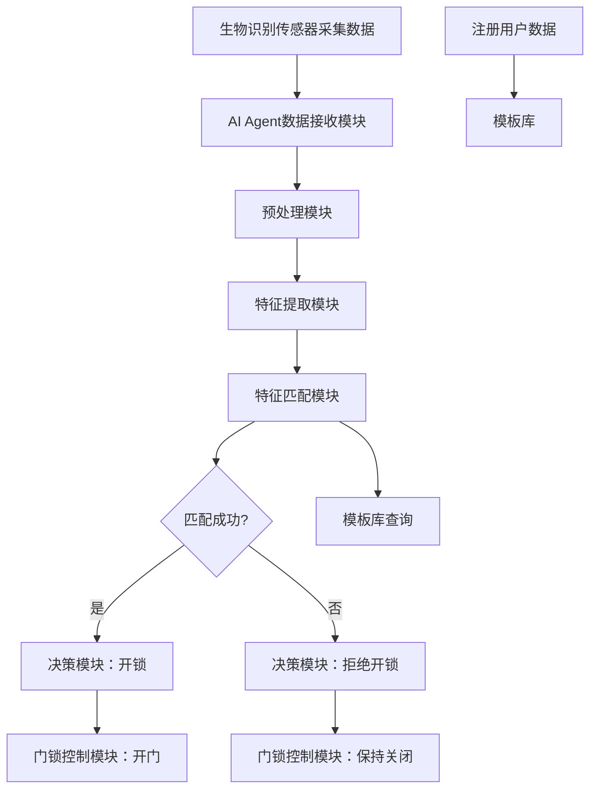

# 智能门锁：AI Agent的生物识别技术

> 关键词：智能门锁、AI Agent、生物识别技术、人脸识别、指纹识别、虹膜识别、声纹识别

> 摘要：本文深入探讨了智能门锁中AI Agent的生物识别技术。首先介绍了智能门锁生物识别技术的背景，包括目的、预期读者、文档结构和相关术语。接着阐述了核心概念，如AI Agent和各种生物识别技术的原理与联系，并通过文本示意图和Mermaid流程图进行展示。详细讲解了核心算法原理，结合Python代码进行说明，还分析了相关的数学模型和公式。通过项目实战，展示了开发环境搭建、源代码实现和代码解读。列举了智能门锁生物识别技术的实际应用场景，推荐了学习资源、开发工具框架和相关论文著作。最后总结了未来发展趋势与挑战，并提供了常见问题解答和扩展阅读参考资料。

## 1. 背景介绍 
### 1.1 目的和范围
智能门锁作为智能家居的重要组成部分，其安全性和便捷性一直是人们关注的焦点。生物识别技术凭借其独特性和不可复制性，成为提高智能门锁安全性的关键技术。本文的目的是深入探讨智能门锁中AI Agent的生物识别技术，包括各种生物识别技术的原理、算法、应用场景等，旨在为相关开发者、研究人员和智能家居爱好者提供全面的技术参考。范围涵盖了人脸识别、指纹识别、虹膜识别和声纹识别等常见的生物识别技术在智能门锁中的应用。

### 1.2 预期读者
本文的预期读者包括智能门锁开发人员、人工智能研究人员、智能家居行业从业者以及对生物识别技术感兴趣的技术爱好者。对于开发人员，本文提供了详细的算法原理和代码实现，有助于他们在实际项目中应用生物识别技术；对于研究人员，本文深入分析了相关的数学模型和最新研究成果，为他们的研究提供参考；对于行业从业者，本文介绍了实际应用场景和市场趋势，有助于他们了解行业动态；对于技术爱好者，本文以通俗易懂的语言讲解了生物识别技术的基本原理，让他们对这一领域有更深入的了解。

### 1.3 文档结构概述
本文共分为十个部分。第一部分是背景介绍，包括目的、预期读者、文档结构和术语表；第二部分阐述核心概念与联系，通过文本示意图和Mermaid流程图展示AI Agent和生物识别技术的原理与架构；第三部分讲解核心算法原理和具体操作步骤，结合Python代码进行详细说明；第四部分分析数学模型和公式，并举例说明；第五部分进行项目实战，包括开发环境搭建、源代码实现和代码解读；第六部分列举实际应用场景；第七部分推荐学习资源、开发工具框架和相关论文著作；第八部分总结未来发展趋势与挑战；第九部分是附录，提供常见问题与解答；第十部分提供扩展阅读和参考资料。

### 1.4 术语表
#### 1.4.1 核心术语定义
- **智能门锁**：一种具备智能化功能的门锁，通过电子技术、通信技术和生物识别技术等实现门锁的自动化控制和管理。
- **AI Agent**：人工智能代理，是一种能够感知环境、做出决策并采取行动的智能实体。在智能门锁中，AI Agent可以对生物识别数据进行处理和分析，做出开锁或拒绝开锁的决策。
- **生物识别技术**：利用人体固有的生理特征（如指纹、人脸、虹膜等）或行为特征（如声纹等）进行身份识别的技术。
- **特征提取**：从生物特征样本中提取出具有代表性和独特性的特征向量的过程。
- **特征匹配**：将提取的特征向量与预先存储的特征模板进行比对，计算相似度得分，以确定身份是否匹配的过程。

#### 1.4.2 相关概念解释
- **模板库**：存储已注册用户生物特征模板的数据库，用于特征匹配时的比对。
- **误识率（FAR）**：在生物识别系统中，将非授权用户误识别为授权用户的概率。
- **拒识率（FRR）**：在生物识别系统中，将授权用户误识别为非授权用户的概率。
- **ROC曲线**：受试者工作特征曲线，用于描述生物识别系统在不同阈值下的误识率和拒识率之间的关系。

#### 1.4.3 缩略词列表
- **AI**：Artificial Intelligence，人工智能
- **FAR**：False Acceptance Rate，误识率
- **FRR**：False Rejection Rate，拒识率
- **ROC**：Receiver Operating Characteristic，受试者工作特征曲线

## 2. 核心概念与联系 

### 核心概念原理
#### AI Agent
AI Agent是智能门锁生物识别系统的核心决策模块。它接收生物识别传感器采集到的生物特征数据，对其进行预处理、特征提取和特征匹配等操作，根据匹配结果做出开锁或拒绝开锁的决策。AI Agent可以采用机器学习、深度学习等算法进行训练，以提高识别的准确性和可靠性。

#### 生物识别技术
- **人脸识别**：通过摄像头采集人脸图像，对图像进行预处理（如灰度化、归一化等），然后提取人脸特征（如眼睛、鼻子、嘴巴等的位置和形状特征），最后将提取的特征与模板库中的特征进行比对，判断是否匹配。
- **指纹识别**：利用指纹传感器采集指纹图像，对图像进行增强、细化等预处理，提取指纹的特征点（如断点、分叉点等），将特征点组成特征向量，与模板库中的特征向量进行比对。
- **虹膜识别**：使用近红外摄像头采集虹膜图像，对图像进行定位、归一化等处理，提取虹膜的纹理特征，通过特征匹配确定身份。
- **声纹识别**：麦克风采集语音信号，对信号进行特征提取（如梅尔频率倒谱系数MFCC等），将提取的特征与模板库中的声纹特征进行比对。

### 架构的文本示意图
```plaintext
智能门锁系统
|-- AI Agent
|   |-- 数据接收模块（接收生物识别传感器数据）
|   |-- 预处理模块（对数据进行降噪、归一化等处理）
|   |-- 特征提取模块（提取生物特征向量）
|   |-- 特征匹配模块（与模板库进行比对）
|   |-- 决策模块（根据匹配结果做出开锁或拒绝开锁决策）
|-- 生物识别传感器
|   |-- 摄像头（用于人脸识别、虹膜识别）
|   |-- 指纹传感器（用于指纹识别）
|   |-- 麦克风（用于声纹识别）
|-- 模板库（存储已注册用户的生物特征模板）
|-- 门锁控制模块（根据AI Agent的决策控制门锁开关）
```

### Mermaid流程图


## 3. 核心算法原理 & 具体操作步骤 

### 人脸识别算法原理及Python实现
#### 原理
人脸识别通常采用基于深度学习的方法，如卷积神经网络（CNN）。常用的人脸识别模型有FaceNet、ArcFace等。这些模型通过大量的人脸图像数据进行训练，学习人脸的特征表示。在识别时，将输入的人脸图像输入到训练好的模型中，得到人脸的特征向量，然后与模板库中的特征向量进行比对，计算相似度得分。

#### Python代码实现
```python
import cv2
import face_recognition

# 加载已知人脸图像并编码
known_image = face_recognition.load_image_file("known_person.jpg")
known_encoding = face_recognition.face_encodings(known_image)[0]

# 加载待识别的人脸图像
unknown_image = face_recognition.load_image_file("unknown_person.jpg")
unknown_encodings = face_recognition.face_encodings(unknown_image)

for unknown_encoding in unknown_encodings:
    # 比较特征向量
    results = face_recognition.compare_faces([known_encoding], unknown_encoding)
    face_distances = face_recognition.face_distance([known_encoding], unknown_encoding)
    if results[0]:
        print(f"识别成功，相似度得分: {1 - face_distances[0]}")
    else:
        print("识别失败")
```

### 指纹识别算法原理及Python实现
#### 原理
指纹识别的核心是特征点提取和匹配。常见的特征点有断点和分叉点。首先对指纹图像进行预处理，增强图像质量，然后提取特征点，将特征点的位置和方向信息组成特征向量，最后通过匹配特征向量来判断指纹是否匹配。

#### Python代码实现
```python
import cv2
import numpy as np

def fingerprint_feature_extraction(image):
    # 预处理：灰度化、二值化
    gray = cv2.cvtColor(image, cv2.COLOR_BGR2GRAY)
    _, binary = cv2.threshold(gray, 127, 255, cv2.THRESH_BINARY)
    # 细化
    skeleton = cv2.ximgproc.thinning(binary)
    # 特征点提取
    harris = cv2.cornerHarris(skeleton, 2, 3, 0.04)
    _, features = cv2.threshold(harris, 0.01 * harris.max(), 255, 0)
    features = np.uint8(features)
    return features

# 加载指纹图像
known_fingerprint = cv2.imread("known_fingerprint.jpg")
unknown_fingerprint = cv2.imread("unknown_fingerprint.jpg")

# 提取特征
known_features = fingerprint_feature_extraction(known_fingerprint)
unknown_features = fingerprint_feature_extraction(unknown_fingerprint)

# 特征匹配（简单示例，计算特征点重合度）
match_count = np.sum(np.logical_and(known_features, unknown_features))
total_count = np.sum(known_features) + np.sum(unknown_features) - match_count
similarity = match_count / total_count

if similarity > 0.5:
    print("指纹识别成功")
else:
    print("指纹识别失败")
```

### 虹膜识别算法原理及Python实现
#### 原理
虹膜识别主要包括虹膜定位、归一化、特征提取和匹配等步骤。首先定位虹膜的内外边界，然后将虹膜图像进行归一化处理，消除尺度和旋转的影响，接着提取虹膜的纹理特征，最后通过特征匹配确定身份。

#### Python代码实现
```python
import cv2
import numpy as np

def iris_localization(image):
    # 灰度化
    gray = cv2.cvtColor(image, cv2.COLOR_BGR2GRAY)
    # 高斯模糊
    blurred = cv2.GaussianBlur(gray, (5, 5), 0)
    # 边缘检测
    edges = cv2.Canny(blurred, 50, 150)
    # 霍夫圆检测定位虹膜外边界
    circles = cv2.HoughCircles(edges, cv2.HOUGH_GRADIENT, 1, 20, param1=50, param2=30, minRadius=0, maxRadius=0)
    if circles is not None:
        circles = np.round(circles[0, :]).astype("int")
        for (x, y, r) in circles:
            cv2.circle(image, (x, y), r, (0, 255, 0), 2)
    return image

# 加载虹膜图像
iris_image = cv2.imread("iris_image.jpg")
localized_image = iris_localization(iris_image)
cv2.imshow("Localized Iris", localized_image)
cv2.waitKey(0)
cv2.destroyAllWindows()
```

### 声纹识别算法原理及Python实现
#### 原理
声纹识别首先对语音信号进行预处理，如降噪、分帧等，然后提取特征，常用的特征是梅尔频率倒谱系数（MFCC），最后将提取的特征与模板库中的特征进行比对。

#### Python代码实现
```python
import librosa
import numpy as np

def extract_mfcc(audio_file):
    # 加载音频文件
    y, sr = librosa.load(audio_file)
    # 提取MFCC特征
    mfccs = librosa.feature.mfcc(y=y, sr=sr, n_mfcc=13)
    return mfccs

# 加载已知声纹和待识别声纹
known_mfcc = extract_mfcc("known_voice.wav")
unknown_mfcc = extract_mfcc("unknown_voice.wav")

# 计算相似度（简单示例，计算均方误差）
mse = np.mean((known_mfcc - unknown_mfcc) ** 2)
if mse < 100:
    print("声纹识别成功")
else:
    print("声纹识别失败")
```

## 4. 数学模型和公式 & 详细讲解 & 举例说明 

### 特征匹配相似度计算
#### 欧氏距离
欧氏距离是最常用的相似度计算方法之一，用于计算两个特征向量之间的距离。设两个特征向量 $\mathbf{x}=(x_1,x_2,\cdots,x_n)$ 和 $\mathbf{y}=(y_1,y_2,\cdots,y_n)$，则它们之间的欧氏距离 $d(\mathbf{x},\mathbf{y})$ 计算公式为：
$$d(\mathbf{x},\mathbf{y})=\sqrt{\sum_{i = 1}^{n}(x_i - y_i)^2}$$
欧氏距离越小，说明两个特征向量越相似。

**举例**：假设有两个特征向量 $\mathbf{x}=(1,2,3)$ 和 $\mathbf{y}=(2,3,4)$，则它们之间的欧氏距离为：
$$d(\mathbf{x},\mathbf{y})=\sqrt{(1 - 2)^2+(2 - 3)^2+(3 - 4)^2}=\sqrt{1 + 1+1}=\sqrt{3}\approx1.73$$

#### 余弦相似度
余弦相似度用于衡量两个向量之间的夹角余弦值，它反映了两个向量的方向相似性。设两个特征向量 $\mathbf{x}$ 和 $\mathbf{y}$，则它们的余弦相似度 $s(\mathbf{x},\mathbf{y})$ 计算公式为：
$$s(\mathbf{x},\mathbf{y})=\frac{\mathbf{x}\cdot\mathbf{y}}{\|\mathbf{x}\|\|\mathbf{y}\|}=\frac{\sum_{i = 1}^{n}x_iy_i}{\sqrt{\sum_{i = 1}^{n}x_i^2}\sqrt{\sum_{i = 1}^{n}y_i^2}}$$
余弦相似度的值越接近1，说明两个向量越相似。

**举例**：对于特征向量 $\mathbf{x}=(1,2,3)$ 和 $\mathbf{y}=(2,3,4)$，它们的点积 $\mathbf{x}\cdot\mathbf{y}=1\times2 + 2\times3+3\times4 = 2 + 6 + 12 = 20$，$\|\mathbf{x}\|=\sqrt{1^2+2^2+3^2}=\sqrt{14}$，$\|\mathbf{y}\|=\sqrt{2^2+3^2+4^2}=\sqrt{29}$，则余弦相似度为：
$$s(\mathbf{x},\mathbf{y})=\frac{20}{\sqrt{14}\sqrt{29}}\approx\frac{20}{6.48\times5.39}\approx0.57$$

### ROC曲线与误识率、拒识率
ROC曲线是描述生物识别系统在不同阈值下误识率（FAR）和拒识率（FRR）之间关系的曲线。误识率是将非授权用户误识别为授权用户的概率，拒识率是将授权用户误识别为非授权用户的概率。

设相似度得分阈值为 $t$，真阳性率（TPR）即识别正确的授权用户比例，假阳性率（FPR）即误识的非授权用户比例。ROC曲线以FPR为横轴，TPR为纵轴。

在生物识别系统中，我们希望在保证较低误识率的前提下，尽可能降低拒识率。通过调整相似度得分阈值 $t$，可以得到不同的FPR和TPR组合，从而绘制出ROC曲线。

### 人脸识别中的损失函数
在人脸识别的深度学习模型中，常用的损失函数有交叉熵损失函数、Triplet损失函数等。

#### 交叉熵损失函数
对于多分类问题，交叉熵损失函数用于衡量模型预测结果与真实标签之间的差异。设模型的预测概率分布为 $\mathbf{p}=(p_1,p_2,\cdots,p_n)$，真实标签的概率分布为 $\mathbf{q}=(q_1,q_2,\cdots,q_n)$，则交叉熵损失 $L$ 计算公式为：
$$L=-\sum_{i = 1}^{n}q_i\log(p_i)$$
在人脸识别中，通过最小化交叉熵损失函数，可以使模型的预测结果更接近真实标签。

#### Triplet损失函数
Triplet损失函数用于学习人脸特征的度量空间，使同类人脸特征之间的距离尽可能小，不同类人脸特征之间的距离尽可能大。设锚点样本 $a$、正样本 $p$（与锚点属于同一类）和负样本 $n$（与锚点属于不同类）的特征向量分别为 $\mathbf{f}(a)$、$\mathbf{f}(p)$ 和 $\mathbf{f}(n)$，则Triplet损失 $L_{triplet}$ 计算公式为：
$$L_{triplet}=\max(0,\|\mathbf{f}(a)-\mathbf{f}(p)\|^2-\|\mathbf{f}(a)-\mathbf{f}(n)\|^2+\alpha)$$
其中 $\alpha$ 是一个正的间隔参数，用于控制同类和不同类特征之间的距离差异。

## 5. 项目实战：代码实际案例和详细解释说明 

### 5.1  开发环境搭建
#### 硬件环境
- **智能门锁开发板**：选择一款支持生物识别传感器接口的开发板，如树莓派、Arduino等。
- **生物识别传感器**：根据需求选择摄像头（用于人脸识别、虹膜识别）、指纹传感器、麦克风（用于声纹识别）等。
- **门锁执行机构**：如电磁锁、电机锁等。

#### 软件环境
- **操作系统**：选择适合开发板的操作系统，如Raspbian（树莓派）、Arduino IDE（Arduino）。
- **开发语言**：Python是首选的开发语言，因为它具有丰富的库和工具，适合生物识别算法的实现。
- **相关库和框架**：安装OpenCV（用于图像处理）、face_recognition（用于人脸识别）、librosa（用于声纹识别）等库。

### 5.2  源代码详细实现和代码解读
以下是一个简单的智能门锁人脸识别系统的Python代码示例：

```python
import cv2
import face_recognition
import RPi.GPIO as GPIO  # 树莓派GPIO控制库

# 初始化GPIO
GPIO.setmode(GPIO.BCM)
GPIO.setup(18, GPIO.OUT)  # 假设门锁控制引脚为18

# 加载已知人脸图像并编码
known_image = face_recognition.load_image_file("known_person.jpg")
known_encoding = face_recognition.face_encodings(known_image)[0]

# 打开摄像头
video_capture = cv2.VideoCapture(0)

while True:
    # 读取摄像头帧
    ret, frame = video_capture.read()

    # 转换为RGB格式
    rgb_frame = frame[:, :, ::-1]

    # 检测人脸位置
    face_locations = face_recognition.face_locations(rgb_frame)
    face_encodings = face_recognition.face_encodings(rgb_frame, face_locations)

    for face_encoding in face_encodings:
        # 比较特征向量
        matches = face_recognition.compare_faces([known_encoding], face_encoding)
        face_distances = face_recognition.face_distance([known_encoding], face_encoding)
        best_match_index = np.argmin(face_distances)
        if matches[best_match_index]:
            print("识别成功，开门")
            GPIO.output(18, GPIO.HIGH)  # 打开门锁
        else:
            print("识别失败，保持关闭")
            GPIO.output(18, GPIO.LOW)  # 关闭门锁

    # 显示视频帧
    cv2.imshow('Video', frame)

    # 按 'q' 键退出循环
    if cv2.waitKey(1) & 0xFF == ord('q'):
        break

# 释放摄像头和GPIO资源
video_capture.release()
cv2.destroyAllWindows()
GPIO.cleanup()
```

### 5.3  代码解读与分析
- **导入库**：导入OpenCV、face_recognition和RPi.GPIO库，分别用于图像处理、人脸识别和树莓派GPIO控制。
- **初始化GPIO**：设置门锁控制引脚为输出模式。
- **加载已知人脸图像并编码**：使用face_recognition库加载已知人脸图像，并提取其特征向量。
- **打开摄像头**：使用cv2.VideoCapture打开摄像头。
- **循环读取视频帧**：在循环中不断读取摄像头帧，并将其转换为RGB格式。
- **检测人脸位置和编码**：使用face_recognition库检测人脸位置，并提取人脸特征向量。
- **特征匹配**：将提取的特征向量与已知特征向量进行比对，根据匹配结果控制门锁开关。
- **显示视频帧**：使用cv2.imshow显示视频帧。
- **释放资源**：循环结束后，释放摄像头和GPIO资源。

## 6. 实际应用场景 
### 家庭住宅
在家庭住宅中，智能门锁的生物识别技术为居民提供了便捷、安全的出入方式。居民无需携带钥匙，只需通过人脸识别、指纹识别或声纹识别即可轻松开锁。同时，生物识别技术的不可复制性大大提高了家庭的安全性，有效防止了钥匙丢失或被盗带来的安全隐患。此外，智能门锁还可以与智能家居系统集成，实现远程控制和监控功能，方便居民随时随地了解家庭的出入情况。

### 商业场所
在商业场所，如写字楼、酒店、商场等，智能门锁的生物识别技术可以提高场所的安全性和管理效率。写字楼可以为员工分配生物识别权限，只有授权员工才能进入特定区域，有效防止外来人员进入。酒店可以为客人提供人脸识别开锁服务，提高客人的入住体验。商场可以在仓库、办公室等重要区域安装智能门锁，保障商业机密和财物安全。

### 公共设施
在公共设施中，如学校、医院、图书馆等，智能门锁的生物识别技术可以加强对人员的管理和安全保障。学校可以在教室、实验室等区域安装智能门锁，只有授权的教师和学生才能进入，防止无关人员进入造成安全事故。医院可以在药品仓库、手术室等重要区域安装智能门锁，保障医疗安全。图书馆可以在书库、档案室等区域安装智能门锁，保护图书和档案的安全。

### 工业领域
在工业领域，如工厂、矿山、油田等，智能门锁的生物识别技术可以提高工作场所的安全性和管理效率。工厂可以在车间、仓库等区域安装智能门锁，只有授权的工人才能进入，防止非工作人员进入造成安全事故。矿山可以在井口、配电室等重要区域安装智能门锁，保障矿山的安全生产。油田可以在油井、泵站等区域安装智能门锁，防止石油资源被盗。

## 7. 工具和资源推荐
### 7.1 学习资源推荐
#### 7.1.1 书籍推荐
- 《深度学习》（Deep Learning）：由Ian Goodfellow、Yoshua Bengio和Aaron Courville撰写，是深度学习领域的经典教材，涵盖了神经网络、卷积神经网络、循环神经网络等内容，对于理解生物识别技术中的深度学习算法有很大帮助。
- 《数字图像处理（第3版）》（Digital Image Processing, 3rd Edition）：由Rafael C. Gonzalez和Richard E. Woods撰写，详细介绍了数字图像处理的基本原理和方法，包括图像增强、滤波、特征提取等，是学习人脸识别、指纹识别等生物识别技术的重要参考书籍。
- 《语音信号处理》（Speech Signal Processing）：由Xuedong Huang、Alex Acero和Hengju Huang撰写，系统介绍了语音信号处理的基本理论和方法，包括语音识别、声纹识别等，对于学习声纹识别技术有很大帮助。

#### 7.1.2 在线课程
- Coursera上的“深度学习专项课程”（Deep Learning Specialization）：由Andrew Ng教授授课，包括神经网络和深度学习、改善深层神经网络、结构化机器学习项目、卷积神经网络、序列模型等五门课程，是学习深度学习的优质在线课程。
- edX上的“数字图像处理”（Digital Image Processing）：由华盛顿大学开设，介绍了数字图像处理的基本概念、算法和应用，适合初学者学习。
- Udemy上的“人脸识别实战”（Face Recognition in Practice）：通过实际项目讲解人脸识别技术的应用，包括人脸检测、特征提取、特征匹配等内容，具有很强的实践性。

#### 7.1.3 技术博客和网站
- Medium：是一个技术博客平台，上面有很多关于人工智能、生物识别技术的优质文章，可以关注一些知名作者和博客，如Towards Data Science、AI in Plain English等。
- GitHub：是一个代码托管平台，上面有很多生物识别技术的开源项目，可以学习和参考他人的代码实现。
- Kaggle：是一个数据科学竞赛平台，上面有很多生物识别相关的数据集和竞赛项目，可以通过参与竞赛提高自己的技术水平。

### 7.2 开发工具框架推荐
#### 7.2.1 IDE和编辑器
- PyCharm：是一款专门为Python开发设计的集成开发环境（IDE），具有代码编辑、调试、版本控制等功能，适合开发智能门锁生物识别系统。
- Visual Studio Code：是一款轻量级的代码编辑器，支持多种编程语言和插件扩展，具有丰富的代码提示和调试功能，也可以用于Python开发。
- Jupyter Notebook：是一个交互式的开发环境，适合进行数据探索、算法实验和代码演示，在生物识别技术的研究和开发中经常使用。

#### 7.2.2 调试和性能分析工具
- pdb：是Python自带的调试工具，可以在代码中设置断点，逐行调试代码，帮助查找和解决问题。
- cProfile：是Python的性能分析工具，可以分析代码的运行时间和函数调用次数，帮助优化代码性能。
- TensorBoard：是TensorFlow的可视化工具，可以可视化模型的训练过程、损失函数变化、特征分布等，帮助理解和优化深度学习模型。

#### 7.2.3 相关框架和库
- OpenCV：是一个开源的计算机视觉库，提供了丰富的图像处理和计算机视觉算法，如人脸检测、图像滤波、特征提取等，在生物识别技术中广泛应用。
- TensorFlow：是一个开源的深度学习框架，提供了高效的神经网络构建和训练工具，支持多种深度学习模型，如卷积神经网络、循环神经网络等，可用于人脸识别、虹膜识别等生物识别任务。
- PyTorch：是另一个流行的深度学习框架，具有简洁的API和动态图机制，适合快速开发和实验深度学习模型，在生物识别技术的研究和开发中也有广泛应用。
- face_recognition：是一个基于dlib库的人脸识别库，提供了简单易用的人脸识别接口，可用于人脸检测、特征提取和特征匹配等任务。
- librosa：是一个用于音频信号处理的Python库，提供了丰富的音频特征提取方法，如MFCC、谱图等，可用于声纹识别任务。

### 7.3 相关论文著作推荐
#### 7.3.1 经典论文
- "FaceNet: A Unified Embedding for Face Recognition and Clustering"：提出了FaceNet人脸识别模型，通过学习人脸的嵌入向量实现高效的人脸识别和聚类。
- "ArcFace: Additive Angular Margin Loss for Deep Face Recognition"：提出了ArcFace损失函数，在人脸识别任务中取得了很好的效果。
- "Fingerprint Image Enhancement: Algorithm and Performance Evaluation"：介绍了指纹图像增强算法及其性能评估方法，是指纹识别领域的经典论文。
- "Iris Recognition: An Emerging Biometric Technology"：对虹膜识别技术进行了全面的介绍，包括虹膜的特征、识别算法和应用场景等。

#### 7.3.2 最新研究成果
- 关注顶级学术会议，如CVPR（计算机视觉与模式识别会议）、ICCV（国际计算机视觉会议）、ECCV（欧洲计算机视觉会议）等，这些会议上会发布生物识别技术的最新研究成果。
- 查阅学术期刊，如IEEE Transactions on Pattern Analysis and Machine Intelligence、Pattern Recognition等，这些期刊上发表了很多生物识别技术的高质量研究论文。

#### 7.3.3 应用案例分析
- 一些科技公司的官方博客和技术报告中会分享智能门锁生物识别技术的应用案例，如小米、华为、三星等公司的智能家居产品相关技术文档，可以从中了解实际应用中的技术挑战和解决方案。
- 行业研究机构的报告，如Gartner、IDC等发布的智能家居市场研究报告，会分析智能门锁生物识别技术的市场趋势和应用案例。

## 8. 总结：未来发展趋势与挑战
### 未来发展趋势
#### 多模态生物识别技术融合
单一的生物识别技术存在一定的局限性，如人脸识别在光照变化、遮挡等情况下识别准确率会下降，指纹识别在手指潮湿或磨损时可能无法正常工作。未来，智能门锁将越来越多地采用多模态生物识别技术融合，如人脸识别与指纹识别、虹膜识别与声纹识别等相结合，提高识别的准确性和可靠性。

#### 与智能家居系统深度集成
智能门锁作为智能家居的入口，将与其他智能家居设备进行更深度的集成。例如，当智能门锁识别到主人回家后，自动开启灯光、调节空调温度、播放音乐等，为用户提供更加智能化、个性化的家居体验。

#### 云端计算与边缘计算结合
随着物联网和云计算技术的发展，智能门锁可以将生物识别数据上传到云端进行处理和存储，利用云端强大的计算能力和数据资源提高识别准确率。同时，为了保证数据的安全性和实时性，部分处理任务也可以在本地边缘设备上完成，实现云端计算与边缘计算的结合。

#### 生物识别技术的不断创新
随着人工智能和机器学习技术的不断发展，生物识别技术也将不断创新。例如，基于DNA、掌静脉等新的生物特征识别技术可能会逐渐应用于智能门锁领域，进一步提高识别的准确性和安全性。

### 挑战
#### 安全与隐私问题
生物识别数据属于个人敏感信息，一旦泄露可能会给用户带来严重的安全和隐私风险。因此，如何保障生物识别数据的安全性和隐私性是智能门锁生物识别技术面临的重要挑战。需要采用加密技术、访问控制技术等手段对生物识别数据进行保护。

#### 环境适应性问题
生物识别技术的准确性容易受到环境因素的影响，如光照、温度、湿度等。例如，人脸识别在强光或弱光环境下识别准确率会下降，指纹识别在潮湿环境下可能无法正常工作。如何提高生物识别技术的环境适应性，是需要解决的问题。

#### 成本问题
目前，一些先进的生物识别技术，如虹膜识别，成本较高，限制了其在智能门锁领域的广泛应用。如何降低生物识别技术的成本，提高产品的性价比，是智能门锁制造商需要面对的挑战。

#### 标准与规范问题
目前，智能门锁生物识别技术缺乏统一的标准和规范，不同厂家的产品在识别准确率、安全性等方面存在差异。建立统一的标准和规范，有助于推动智能门锁生物识别技术的健康发展。

## 9. 附录：常见问题与解答
### 生物识别技术的准确率如何？
生物识别技术的准确率受到多种因素的影响，如生物特征的质量、环境条件、算法的优劣等。一般来说，在理想条件下，人脸识别的准确率可以达到98%以上，指纹识别的准确率可以达到99%以上，虹膜识别的准确率可以达到99.9%以上。但在实际应用中，由于环境因素和个体差异的影响，准确率可能会有所下降。

### 生物识别数据安全吗？
生物识别数据属于个人敏感信息，其安全性至关重要。正规的智能门锁制造商通常会采用加密技术对生物识别数据进行加密存储和传输，防止数据泄露。同时，还会采取访问控制、权限管理等措施，确保只有授权人员才能访问生物识别数据。然而，随着黑客技术的不断发展，生物识别数据仍然存在一定的安全风险。

### 智能门锁的生物识别技术容易被破解吗？
一般来说，正规的智能门锁生物识别技术具有较高的安全性，不容易被破解。例如，人脸识别技术采用了活体检测技术，能够有效防止照片、视频等假冒手段；指纹识别技术采用了高精度的传感器和复杂的特征匹配算法，能够准确识别真实指纹。但是，如果智能门锁存在安全漏洞或使用了低质量的生物识别技术，仍然可能被破解。

### 生物识别技术在不同环境下的表现如何？
生物识别技术的表现会受到环境因素的影响。例如，人脸识别在强光、弱光、逆光等光照条件下，识别准确率可能会下降；指纹识别在手指潮湿、磨损或有污渍的情况下，可能无法正常工作；虹膜识别在眼睛有炎症、佩戴美瞳等情况下，识别准确率也会受到影响。为了提高生物识别技术在不同环境下的表现，需要采用先进的算法和传感器技术。

### 多模态生物识别技术有什么优势？
多模态生物识别技术结合了多种生物特征的识别方法，具有更高的准确性和可靠性。例如，人脸识别与指纹识别相结合，可以在人脸识别失败的情况下，通过指纹识别进行验证，提高了识别的成功率。同时，多模态生物识别技术还可以增加破解的难度，提高系统的安全性。

## 10. 扩展阅读 & 参考资料
### 扩展阅读
- 《人工智能：现代方法（第4版）》（Artificial Intelligence: A Modern Approach, 4th Edition）：全面介绍了人工智能的基本概念、算法和应用，对于深入理解AI Agent在智能门锁中的应用有很大帮助。
- 《生物识别技术导论》（Introduction to Biometrics）：系统介绍了生物识别技术的基本原理、方法和应用，适合对生物识别技术感兴趣的读者阅读。
- 《智能家居系统设计与实现》：介绍了智能家居系统的架构、技术和应用，对于了解智能门锁与智能家居系统的集成有参考价值。

### 参考资料
- OpenCV官方文档：https://docs.opencv.org/
- TensorFlow官方文档：https://www.tensorflow.org/api_docs
- PyTorch官方文档：https://pytorch.org/docs/stable/
- face_recognition官方文档：https://face-recognition.readthedocs.io/
- librosa官方文档：https://librosa.org/doc/latest/

作者：AI天才研究院/AI Genius Institute & 禅与计算机程序设计艺术 /Zen And The Art of Computer Programming