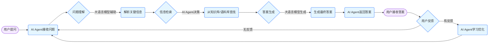

# 智能问答系统AI Agent：基于LLM的精确信息检索

> 关键词：智能问答系统、AI Agent、大语言模型（LLM）、精确信息检索、自然语言处理

> 摘要：本文围绕基于大语言模型（LLM）的智能问答系统AI Agent展开，深入探讨其在精确信息检索方面的应用。详细介绍了相关核心概念、算法原理、数学模型，并结合实际案例进行代码实现和分析。同时，阐述了该技术的实际应用场景，推荐了学习资源、开发工具和相关论文著作。最后对未来发展趋势与挑战进行了总结，为从事相关领域的研究者和开发者提供了全面而深入的参考。

## 1. 背景介绍 
### 1.1 目的和范围
在当今信息爆炸的时代，人们需要一种高效、准确的方式来获取所需信息。智能问答系统作为一种能够理解自然语言并提供准确答案的工具，具有重要的应用价值。本文的目的是深入研究基于大语言模型（LLM）的智能问答系统AI Agent在精确信息检索方面的技术原理和实现方法。范围涵盖了从核心概念的介绍到算法原理的讲解，再到实际项目的开发和应用场景的探讨，旨在为读者提供一个全面而深入的技术指南。

### 1.2 预期读者
本文预期读者包括人工智能领域的研究者、软件开发者、对智能问答系统感兴趣的技术爱好者以及相关企业的技术决策者。对于初学者，本文可以帮助他们建立起对基于LLM的智能问答系统的基本认识；对于有一定经验的开发者和研究者，本文可以提供深入的技术分析和实践指导。

### 1.3 文档结构概述
本文将按照以下结构进行组织：首先介绍相关的核心概念和它们之间的联系，包括智能问答系统、AI Agent和大语言模型等；接着详细讲解核心算法原理和具体操作步骤，并给出Python源代码示例；然后介绍数学模型和公式，并进行详细讲解和举例说明；通过实际项目案例，展示代码的实现和解读；探讨该技术的实际应用场景；推荐学习资源、开发工具和相关论文著作；最后总结未来发展趋势与挑战，并提供常见问题的解答和扩展阅读的参考资料。

### 1.4 术语表
#### 1.4.1 核心术语定义
- **智能问答系统（Intelligent Question Answering System）**：一种能够理解自然语言问题，并根据已知信息提供准确答案的计算机系统。
- **AI Agent**：一个能够感知环境、做出决策并采取行动以实现特定目标的智能实体。在智能问答系统中，AI Agent负责接收用户的问题，进行信息检索和处理，并生成相应的答案。
- **大语言模型（Large Language Model，LLM）**：基于深度学习技术，在大规模文本数据上训练得到的语言模型，能够生成自然流畅的文本，理解和处理自然语言任务。
- **精确信息检索（Precise Information Retrieval）**：从大量信息中准确地找到与用户问题相关的信息，并以合适的方式呈现给用户。

#### 1.4.2 相关概念解释
- **自然语言处理（Natural Language Processing，NLP）**：是人工智能的一个重要领域，主要研究如何让计算机理解、处理和生成自然语言。智能问答系统和大语言模型都依赖于自然语言处理技术。
- **向量空间模型（Vector Space Model）**：一种将文本表示为向量的数学模型，常用于信息检索和文本相似度计算。在智能问答系统中，可以将问题和文档表示为向量，通过计算向量之间的相似度来进行信息检索。

#### 1.4.3 缩略词列表
- **LLM**：Large Language Model（大语言模型）
- **NLP**：Natural Language Processing（自然语言处理）
- **VSM**：Vector Space Model（向量空间模型）

## 2. 核心概念与联系 

### 2.1 智能问答系统
智能问答系统是一种旨在通过自然语言与用户交互，理解用户问题并提供准确答案的系统。其基本架构通常包括问题理解、信息检索、答案生成和答案评估等模块。问题理解模块负责解析用户输入的自然语言问题，提取关键信息；信息检索模块根据问题信息从知识库或语料库中查找相关信息；答案生成模块根据检索到的信息生成最终的答案；答案评估模块对生成的答案进行质量评估。

### 2.2 AI Agent
AI Agent是一个具有自主性、反应性和社会性的智能实体。在智能问答系统中，AI Agent扮演着核心角色。它接收用户的问题，对问题进行分析和处理，决定采取何种策略进行信息检索，与外部数据源进行交互，最终生成并返回答案给用户。AI Agent可以根据用户的反馈不断学习和优化，提高回答问题的准确性和效率。

### 2.3 大语言模型（LLM）
大语言模型是近年来自然语言处理领域的重要突破。它通过在大规模文本数据上进行无监督学习，学习到语言的语法、语义和上下文信息。在智能问答系统中，LLM可以用于问题理解、答案生成等多个环节。例如，LLM可以对用户的问题进行语义理解，将问题转化为更易于处理的形式；在答案生成阶段，LLM可以根据检索到的信息生成自然流畅的答案。

### 2.4 核心概念的联系
智能问答系统、AI Agent和大语言模型之间存在着紧密的联系。AI Agent是智能问答系统的核心执行体，负责协调各个模块的工作。大语言模型为智能问答系统提供了强大的语言理解和生成能力，是实现精确信息检索和答案生成的关键技术。AI Agent可以利用大语言模型的能力来更好地理解用户问题和生成高质量的答案，而智能问答系统则为AI Agent和大语言模型提供了应用场景和实践平台。

### 2.5 文本示意图
```plaintext
智能问答系统
├── 问题理解模块
│   └── 大语言模型辅助理解
├── 信息检索模块
│   └── AI Agent决策检索策略
├── 答案生成模块
│   └── 大语言模型生成答案
└── 答案评估模块
    └── AI Agent根据反馈优化
```

### 2.6 Mermaid流程图


## 3. 核心算法原理 & 具体操作步骤 

### 3.1 核心算法原理
基于LLM的智能问答系统AI Agent在精确信息检索中主要涉及以下几个核心算法：

#### 3.1.1 问题向量化
将用户输入的自然语言问题转换为向量表示，以便于在向量空间中进行相似度计算。常用的方法是使用预训练的语言模型，如BERT、GPT等，将问题文本输入到模型中，获取其最后一层的隐藏状态作为问题的向量表示。

#### 3.1.2 信息检索
在向量空间中，通过计算问题向量与文档向量之间的相似度，找到与问题最相关的文档。常用的相似度计算方法有余弦相似度、欧几里得距离等。

#### 3.1.3 答案生成
利用大语言模型，根据检索到的相关文档和问题，生成最终的答案。可以采用微调大语言模型的方法，使其在特定的问答数据集上进行训练，以提高答案生成的准确性。

### 3.2 具体操作步骤

#### 3.2.1 问题预处理
对用户输入的问题进行预处理，包括去除停用词、词干提取、大小写转换等操作，以减少噪声并提高问题理解的准确性。

```python
import nltk
from nltk.corpus import stopwords
from nltk.stem import PorterStemmer
import string

nltk.download('stopwords')

def preprocess_question(question):
    # 转换为小写
    question = question.lower()
    # 去除标点符号
    question = question.translate(str.maketrans('', '', string.punctuation))
    # 分词
    tokens = question.split()
    # 去除停用词
    stop_words = set(stopwords.words('english'))
    tokens = [token for token in tokens if token not in stop_words]
    # 词干提取
    stemmer = PorterStemmer()
    tokens = [stemmer.stem(token) for token in tokens]
    return " ".join(tokens)

# 示例
question = "What is the capital of France?"
preprocessed_question = preprocess_question(question)
print(preprocessed_question)
```

#### 3.2.2 问题向量化
使用预训练的语言模型将预处理后的问题转换为向量表示。这里以Hugging Face的`transformers`库为例，使用BERT模型进行向量化。

```python
from transformers import AutoTokenizer, AutoModel
import torch

# 加载预训练的BERT模型和分词器
tokenizer = AutoTokenizer.from_pretrained('bert-base-uncased')
model = AutoModel.from_pretrained('bert-base-uncased')

def question_to_vector(question):
    # 对问题进行分词
    inputs = tokenizer(question, return_tensors='pt')
    # 输入模型
    outputs = model(**inputs)
    # 获取最后一层的隐藏状态
    last_hidden_state = outputs.last_hidden_state
    # 取[CLS]标记的向量作为问题的表示
    question_vector = last_hidden_state[:, 0, :].squeeze().detach().numpy()
    return question_vector

# 示例
question_vector = question_to_vector(preprocessed_question)
print(question_vector)
```

#### 3.2.3 信息检索
在文档向量数据库中，计算问题向量与文档向量之间的余弦相似度，找到相似度最高的文档。

```python
import numpy as np

def cosine_similarity(vector1, vector2):
    dot_product = np.dot(vector1, vector2)
    norm_vector1 = np.linalg.norm(vector1)
    norm_vector2 = np.linalg.norm(vector2)
    similarity = dot_product / (norm_vector1 * norm_vector2)
    return similarity

# 假设文档向量数据库
document_vectors = [np.random.rand(768) for _ in range(10)]

# 计算相似度
similarities = [cosine_similarity(question_vector, doc_vector) for doc_vector in document_vectors]
# 找到相似度最高的文档索引
most_similar_index = np.argmax(similarities)
print(f"Most similar document index: {most_similar_index}")
```

#### 3.2.4 答案生成
使用大语言模型根据检索到的相关文档和问题生成最终的答案。这里以OpenAI的GPT-3为例。

```python
import openai

# 设置OpenAI API密钥
openai.api_key = "your_api_key"

def generate_answer(question, document):
    prompt = f"Question: {question}\nDocument: {document}\nAnswer:"
    response = openai.Completion.create(
        engine="text-davinci-003",
        prompt=prompt,
        max_tokens=100,
        temperature=0.2
    )
    answer = response.choices[0].text.strip()
    return answer

# 示例
document = "France is a country in Western Europe. Its capital is Paris."
answer = generate_answer(question, document)
print(answer)
```

## 4. 数学模型和公式 & 详细讲解 & 举例说明 

### 4.1 向量空间模型（VSM）
向量空间模型是信息检索中常用的数学模型，它将文本表示为向量，通过计算向量之间的相似度来衡量文本之间的相关性。

#### 4.1.1 文本向量化
假设我们有一个包含 $n$ 个词的词汇表 $V = \{w_1, w_2, \cdots, w_n\}$，对于一个文本 $d$，可以将其表示为一个 $n$ 维向量 $\mathbf{d} = (d_1, d_2, \cdots, d_n)$，其中 $d_i$ 表示词 $w_i$ 在文本 $d$ 中的权重。常用的权重计算方法有词频 - 逆文档频率（TF-IDF）。

词频（TF）表示词 $w_i$ 在文本 $d$ 中出现的频率：
$$TF_{i,d} = \frac{freq_{i,d}}{max\{freq_{j,d} | j = 1, 2, \cdots, n\}}$$
其中 $freq_{i,d}$ 是词 $w_i$ 在文本 $d$ 中出现的次数，$max\{freq_{j,d} | j = 1, 2, \cdots, n\}$ 是文本 $d$ 中出现频率最高的词的频率。

逆文档频率（IDF）表示词 $w_i$ 在整个文档集合中的区分能力：
$$IDF_i = \log\frac{N}{df_i}$$
其中 $N$ 是文档集合中的文档总数，$df_i$ 是包含词 $w_i$ 的文档数。

TF-IDF权重为：
$$TF - IDF_{i,d} = TF_{i,d} \times IDF_i$$

#### 4.1.2 相似度计算
在向量空间模型中，常用的相似度计算方法是余弦相似度。对于两个向量 $\mathbf{d}_1$ 和 $\mathbf{d}_2$，它们的余弦相似度定义为：
$$\cos(\mathbf{d}_1, \mathbf{d}_2) = \frac{\mathbf{d}_1 \cdot \mathbf{d}_2}{\|\mathbf{d}_1\| \|\mathbf{d}_2\|}$$
其中 $\mathbf{d}_1 \cdot \mathbf{d}_2$ 是向量 $\mathbf{d}_1$ 和 $\mathbf{d}_2$ 的点积，$\|\mathbf{d}_1\|$ 和 $\|\mathbf{d}_2\|$ 分别是向量 $\mathbf{d}_1$ 和 $\mathbf{d}_2$ 的模。

### 4.2 举例说明
假设我们有一个包含三个文档的文档集合：
- $d_1$: "The cat sat on the mat."
- $d_2$: "The dog chased the cat."
- $d_3$: "The bird flew in the sky."

首先构建词汇表 $V = \{"the", "cat", "sat", "on", "mat", "dog", "chased", "bird", "flew", "in", "sky"\}$，共 11 个词。

计算文档 $d_1$ 的词频：
- $freq_{"the", d_1} = 2$
- $freq_{"cat", d_1} = 1$
- $freq_{"sat", d_1} = 1$
- $freq_{"on", d_1} = 1$
- $freq_{"mat", d_1} = 1$
- 其他词的频率为 0

$max\{freq_{j,d_1} | j = 1, 2, \cdots, 11\} = 2$

计算词频：
- $TF_{"the", d_1} = \frac{2}{2} = 1$
- $TF_{"cat", d_1} = \frac{1}{2} = 0.5$
- $TF_{"sat", d_1} = \frac{1}{2} = 0.5$
- $TF_{"on", d_1} = \frac{1}{2} = 0.5$
- $TF_{"mat", d_1} = \frac{1}{2} = 0.5$
- 其他词的 TF 为 0

计算逆文档频率：
- 包含 "the" 的文档数 $df_{"the"} = 3$，$IDF_{"the"} = \log\frac{3}{3} = 0$
- 包含 "cat" 的文档数 $df_{"cat"} = 2$，$IDF_{"cat"} = \log\frac{3}{2} \approx 0.405$
- 包含 "sat" 的文档数 $df_{"sat"} = 1$，$IDF_{"sat"} = \log\frac{3}{1} \approx 1.099$
- 以此类推

计算 TF-IDF 权重：
- $TF - IDF_{"the", d_1} = 1 \times 0 = 0$
- $TF - IDF_{"cat", d_1} = 0.5 \times 0.405 \approx 0.202$
- $TF - IDF_{"sat", d_1} = 0.5 \times 1.099 \approx 0.550$
- 以此类推

将文档 $d_1$ 表示为向量 $\mathbf{d}_1 = (0, 0.202, 0.550, \cdots)$

假设用户的问题是 "Where did the cat sit?"，同样进行向量化得到问题向量 $\mathbf{q}$，然后计算 $\mathbf{q}$ 与 $\mathbf{d}_1$、$\mathbf{d}_2$、$\mathbf{d}_3$ 的余弦相似度，找到最相关的文档。

## 5. 项目实战：代码实际案例和详细解释说明 

### 5.1  开发环境搭建
#### 5.1.1 安装Python
确保你的系统已经安装了Python 3.6或更高版本。可以从Python官方网站（https://www.python.org/downloads/）下载并安装。

#### 5.1.2 创建虚拟环境
为了避免不同项目之间的依赖冲突，建议使用虚拟环境。可以使用`venv`模块创建虚拟环境：
```bash
python -m venv myenv
```
激活虚拟环境：
- 在Windows上：
```bash
myenv\Scripts\activate
```
- 在Linux/Mac上：
```bash
source myenv/bin/activate
```

#### 5.1.3 安装依赖库
安装项目所需的依赖库，包括`transformers`、`openai`、`nltk`等：
```bash
pip install transformers openai nltk numpy
```

### 5.2  源代码详细实现和代码解读
以下是一个完整的基于LLM的智能问答系统AI Agent的代码示例：

```python
import nltk
from nltk.corpus import stopwords
from nltk.stem import PorterStemmer
import string
from transformers import AutoTokenizer, AutoModel
import torch
import numpy as np
import openai

# 下载nltk数据
nltk.download('stopwords')

# 设置OpenAI API密钥
openai.api_key = "your_api_key"

# 问题预处理函数
def preprocess_question(question):
    question = question.lower()
    question = question.translate(str.maketrans('', '', string.punctuation))
    tokens = question.split()
    stop_words = set(stopwords.words('english'))
    tokens = [token for token in tokens if token not in stop_words]
    stemmer = PorterStemmer()
    tokens = [stemmer.stem(token) for token in tokens]
    return " ".join(tokens)

# 问题向量化函数
def question_to_vector(question):
    tokenizer = AutoTokenizer.from_pretrained('bert-base-uncased')
    model = AutoModel.from_pretrained('bert-base-uncased')
    inputs = tokenizer(question, return_tensors='pt')
    outputs = model(**inputs)
    last_hidden_state = outputs.last_hidden_state
    question_vector = last_hidden_state[:, 0, :].squeeze().detach().numpy()
    return question_vector

# 余弦相似度计算函数
def cosine_similarity(vector1, vector2):
    dot_product = np.dot(vector1, vector2)
    norm_vector1 = np.linalg.norm(vector1)
    norm_vector2 = np.linalg.norm(vector2)
    similarity = dot_product / (norm_vector1 * norm_vector2)
    return similarity

# 信息检索函数
def retrieve_document(question_vector, document_vectors):
    similarities = [cosine_similarity(question_vector, doc_vector) for doc_vector in document_vectors]
    most_similar_index = np.argmax(similarities)
    return most_similar_index

# 答案生成函数
def generate_answer(question, document):
    prompt = f"Question: {question}\nDocument: {document}\nAnswer:"
    response = openai.Completion.create(
        engine="text-davinci-003",
        prompt=prompt,
        max_tokens=100,
        temperature=0.2
    )
    answer = response.choices[0].text.strip()
    return answer

# 主函数
def main():
    # 示例问题
    question = "What is the capital of France?"
    # 预处理问题
    preprocessed_question = preprocess_question(question)
    # 问题向量化
    question_vector = question_to_vector(preprocessed_question)
    # 假设文档向量数据库
    document_vectors = [np.random.rand(768) for _ in range(10)]
    # 信息检索
    most_similar_index = retrieve_document(question_vector, document_vectors)
    # 假设文档数据库
    documents = [
        "France is a country in Western Europe. Its capital is Paris.",
        "Germany is a country in Central Europe. Its capital is Berlin.",
        # 其他文档...
    ]
    most_similar_document = documents[most_similar_index]
    # 答案生成
    answer = generate_answer(question, most_similar_document)
    print(f"Question: {question}")
    print(f"Answer: {answer}")

if __name__ == "__main__":
    main()
```

### 5.3  代码解读与分析
- **问题预处理**：`preprocess_question`函数对用户输入的问题进行预处理，包括小写转换、去除标点符号、分词、去除停用词和词干提取等操作，以减少噪声并提高问题理解的准确性。
- **问题向量化**：`question_to_vector`函数使用预训练的BERT模型将预处理后的问题转换为向量表示。通过分词器将问题分词，输入到BERT模型中，获取最后一层的隐藏状态，取`[CLS]`标记的向量作为问题的表示。
- **信息检索**：`retrieve_document`函数计算问题向量与文档向量之间的余弦相似度，找到相似度最高的文档索引。
- **答案生成**：`generate_answer`函数使用OpenAI的GPT-3模型根据问题和检索到的文档生成最终的答案。通过构建合适的提示，将问题和文档输入到GPT-3模型中，获取模型生成的答案。
- **主函数**：`main`函数整合了以上各个步骤，从问题输入到答案输出，展示了整个智能问答系统的工作流程。

## 6. 实际应用场景 
### 6.1 智能客服
在企业的客户服务中，基于LLM的智能问答系统AI Agent可以自动回答客户的常见问题，提高客户服务效率和响应速度。例如，电商平台的客服系统可以通过智能问答系统快速解答客户关于商品信息、订单状态、退换货政策等问题。

### 6.2 知识问答平台
如百度知道、知乎等知识问答平台，可以利用智能问答系统为用户提供更准确、更及时的答案。通过精确信息检索，系统可以从海量的知识库中找到与用户问题相关的最佳答案，并呈现给用户。

### 6.3 智能教育
在教育领域，智能问答系统可以作为学生的学习助手，帮助学生解答学习过程中遇到的问题。例如，在在线学习平台上，学生可以向智能问答系统提问，系统可以根据课程内容和知识库提供详细的解答和指导。

### 6.4 智能政务
政府部门可以利用智能问答系统为市民提供政务咨询服务，解答关于政策法规、办事流程、民生保障等方面的问题。提高政务服务的透明度和便捷性。

### 6.5 金融服务
在金融领域，智能问答系统可以为客户提供金融产品信息、投资建议、账户查询等服务。帮助客户快速了解金融市场和产品，提高金融服务的质量和效率。

## 7. 工具和资源推荐
### 7.1 学习资源推荐
#### 7.1.1 书籍推荐
- 《自然语言处理入门》：这本书适合初学者，系统地介绍了自然语言处理的基本概念、方法和技术，包括词法分析、句法分析、语义理解等内容。
- 《深度学习》：由Ian Goodfellow、Yoshua Bengio和Aaron Courville合著，是深度学习领域的经典教材，对神经网络、深度学习模型和算法进行了深入的讲解。
- 《人工智能：一种现代的方法》：全面介绍了人工智能的各个领域，包括自然语言处理、机器学习、知识表示与推理等，是人工智能领域的权威教材。

#### 7.1.2 在线课程
- Coursera上的“Natural Language Processing Specialization”：由顶尖大学的教授授课，涵盖了自然语言处理的各个方面，包括词向量、循环神经网络、注意力机制等。
- edX上的“Deep Learning Specialization”：也是深度学习领域的经典课程，由Andrew Ng教授授课，对深度学习的基础和应用进行了详细的讲解。
- 哔哩哔哩（B站）上有很多关于自然语言处理和人工智能的免费视频教程，适合初学者快速入门。

#### 7.1.3 技术博客和网站
- Hugging Face博客：提供了关于自然语言处理、大语言模型等方面的最新技术和研究成果，同时也有很多实用的教程和代码示例。
- Towards Data Science：是一个数据科学和人工智能领域的博客平台，有很多专业人士分享的技术文章和实践经验。
- arXiv：是一个预印本论文库，提供了大量关于自然语言处理、人工智能等领域的最新研究论文。

### 7.2 开发工具框架推荐
#### 7.2.1 IDE和编辑器
- PyCharm：是一款专业的Python集成开发环境，提供了丰富的代码编辑、调试、版本控制等功能，适合Python开发者使用。
- Visual Studio Code：是一款轻量级的代码编辑器，支持多种编程语言，有丰富的插件和扩展，可以满足不同的开发需求。
- Jupyter Notebook：是一个交互式的开发环境，适合进行数据分析、模型训练和实验，支持Python、R等多种编程语言。

#### 7.2.2 调试和性能分析工具
- PDB：是Python自带的调试器，可以帮助开发者定位代码中的错误和问题。
- Py-Spy：是一个性能分析工具，可以实时监测Python程序的性能，找出性能瓶颈。
- TensorBoard：是TensorFlow的可视化工具，可以用于可视化模型的训练过程、损失函数变化等信息，帮助开发者优化模型。

#### 7.2.3 相关框架和库
- Hugging Face Transformers：是一个用于自然语言处理的开源库，提供了大量预训练的语言模型，如BERT、GPT等，方便开发者进行模型的加载和使用。
- OpenAI API：提供了访问OpenAI的大语言模型的接口，开发者可以使用这些模型进行文本生成、问答系统等应用开发。
- Scikit-learn：是一个用于机器学习的开源库，提供了丰富的机器学习算法和工具，如分类、回归、聚类等，适合进行数据预处理和模型训练。

### 7.3 相关论文著作推荐
#### 7.3.1 经典论文
- “Attention Is All You Need”：提出了Transformer模型，是自然语言处理领域的重要突破，为后续的大语言模型发展奠定了基础。
- “BERT: Pre-training of Deep Bidirectional Transformers for Language Understanding”：介绍了BERT模型，通过预训练和微调的方式，在多个自然语言处理任务上取得了优异的成绩。
- “GPT: Generative Pretrained Transformer”：是OpenAI提出的生成式预训练模型，开启了大语言模型在文本生成领域的应用。

#### 7.3.2 最新研究成果
- 关注arXiv上关于自然语言处理和大语言模型的最新论文，了解领域内的最新研究动态和技术发展趋势。
- 参加国际学术会议，如ACL（Association for Computational Linguistics）、EMNLP（Conference on Empirical Methods in Natural Language Processing）等，获取最新的研究成果和学术交流机会。

#### 7.3.3 应用案例分析
- 一些知名企业和研究机构会发布关于智能问答系统和大语言模型应用的案例分析报告，可以通过企业官网、研究机构网站等渠道获取这些资料，学习实际应用中的经验和技巧。

## 8. 总结：未来发展趋势与挑战
### 8.1 未来发展趋势
#### 8.1.1 多模态融合
未来的智能问答系统将不仅仅局限于文本输入和输出，还将融合图像、语音、视频等多种模态信息。例如，用户可以通过语音提问，系统可以通过图像或视频的方式提供更直观的答案。

#### 8.1.2 个性化服务
智能问答系统将更加注重个性化服务，根据用户的历史提问记录、兴趣偏好等信息，为用户提供更符合其需求的答案和推荐。

#### 8.1.3 知识图谱融合
将知识图谱与大语言模型相结合，可以为智能问答系统提供更丰富、更准确的知识支持。知识图谱可以帮助系统更好地理解问题的语义和上下文，提高答案的准确性和可靠性。

#### 8.1.4 跨语言问答
随着全球化的发展，跨语言问答的需求将越来越大。未来的智能问答系统将具备更好的跨语言处理能力，能够支持多种语言的输入和输出。

### 8.2 挑战
#### 8.2.1 数据质量和隐私问题
大语言模型的训练需要大量的数据，数据的质量和隐私问题是一个重要的挑战。如何获取高质量、多样化的数据，同时保护用户的隐私和数据安全，是需要解决的问题。

#### 8.2.2 计算资源和成本
训练和部署大语言模型需要大量的计算资源和成本，这对于一些小型企业和研究机构来说是一个巨大的挑战。如何降低计算资源的需求和成本，提高模型的效率和性能，是未来的研究方向之一。

#### 8.2.3 语义理解和推理能力
虽然大语言模型在自然语言处理方面取得了很大的进展，但在语义理解和推理能力方面仍然存在不足。如何让模型更好地理解问题的语义和上下文，进行复杂的推理和判断，是提高智能问答系统性能的关键。

#### 8.2.4 伦理和法律问题
随着智能问答系统的广泛应用，伦理和法律问题也越来越受到关注。例如，模型生成的答案可能存在偏见、虚假信息等问题，如何规范模型的使用和管理，保障用户的权益和社会的公共利益，是需要解决的问题。

## 9. 附录：常见问题与解答
### 9.1 如何选择合适的大语言模型？
选择合适的大语言模型需要考虑多个因素，如模型的性能、适用场景、计算资源需求等。如果对计算资源有限，可以选择一些轻量级的预训练模型；如果需要处理复杂的自然语言任务，可以选择一些大型的预训练模型，如GPT-3、BERT等。同时，还可以根据具体的应用场景对模型进行微调，以提高模型的性能。

### 9.2 如何提高智能问答系统的准确性？
可以从以下几个方面提高智能问答系统的准确性：
- 提高数据质量：使用高质量、多样化的数据进行模型训练，减少噪声和错误信息。
- 优化模型结构：选择合适的模型结构和算法，如Transformer架构，同时可以进行模型的微调以适应具体的任务。
- 融合知识图谱：将知识图谱与大语言模型相结合，为系统提供更丰富的知识支持。
- 进行答案评估和优化：建立答案评估机制，对生成的答案进行质量评估和优化，提高答案的准确性和可靠性。

### 9.3 智能问答系统可以处理多语言问题吗？
可以。一些大语言模型，如mBERT（Multilingual BERT）、XLM（Cross-lingual Language Model）等，具有跨语言处理能力，可以处理多种语言的输入和输出。同时，也可以通过对模型进行多语言数据的训练和微调，提高系统的多语言处理能力。

### 9.4 如何保障智能问答系统的安全性和隐私性？
可以采取以下措施保障智能问答系统的安全性和隐私性：
- 数据加密：对用户输入的数据和系统存储的数据进行加密处理，防止数据泄露。
- 访问控制：建立严格的访问控制机制，限制对系统和数据的访问权限。
- 合规性管理：遵守相关的法律法规和行业标准，确保系统的使用和管理符合规定。
- 模型审计：对模型的训练和使用过程进行审计，确保模型的输出不包含敏感信息和偏见。

## 10. 扩展阅读 & 参考资料
- 《自然语言处理实战》
- 《深度学习实战》
- Hugging Face官方文档：https://huggingface.co/docs
- OpenAI官方文档：https://platform.openai.com/docs
- arXiv论文库：https://arxiv.org/

作者：AI天才研究院/AI Genius Institute & 禅与计算机程序设计艺术 /Zen And The Art of Computer Programming