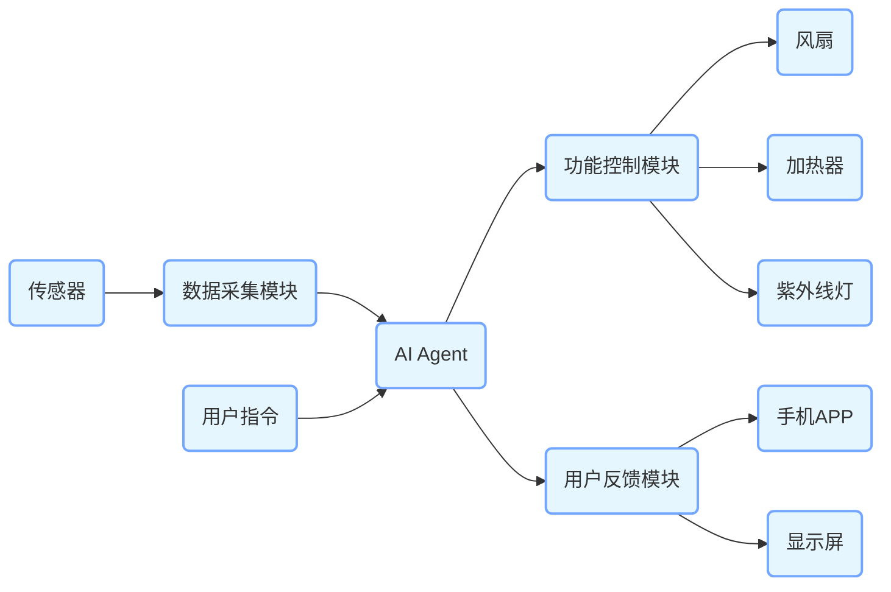

# 智能鞋柜：AI Agent的足部健康管理专家

> 关键词：智能鞋柜、AI Agent、足部健康管理、传感器技术、数据分析

> 摘要：本文聚焦于智能鞋柜作为AI Agent在足部健康管理方面的应用。详细介绍了智能鞋柜的背景知识，包括其目的、预期读者和文档结构等。深入探讨了智能鞋柜的核心概念、算法原理、数学模型，通过项目实战展示了其代码实现与解读。同时分析了智能鞋柜的实际应用场景，推荐了相关的学习资源、开发工具和论文著作。最后对智能鞋柜未来的发展趋势与挑战进行了总结，并给出常见问题解答和扩展阅读参考资料，旨在为读者全面呈现智能鞋柜在足部健康管理领域的重要作用和发展潜力。

## 1. 背景介绍 
### 1.1 目的和范围
智能鞋柜作为一种融合了先进技术的家居产品，其主要目的是为用户提供更加便捷、舒适且具有健康管理功能的足部护理体验。传统鞋柜仅仅用于存放鞋子，功能单一。而智能鞋柜借助AI Agent技术，能够实时监测鞋子内部的环境状况，如湿度、温度等，还可以对足部的健康信息进行收集和分析，例如足部的出汗情况、气味等，从而为用户提供个性化的足部健康建议。本文章的范围将涵盖智能鞋柜的技术原理、开发实现、实际应用以及未来发展等多个方面。

### 1.2 预期读者
本文的预期读者包括对智能家居产品感兴趣的普通消费者，他们希望了解智能鞋柜的功能和优势，以便在选择家居用品时做出更合适的决策；也包括从事智能家居领域开发的技术人员，他们可以从文章中获取智能鞋柜相关的技术细节和开发思路；此外，还包括对足部健康管理研究感兴趣的科研人员，智能鞋柜所收集的数据和分析结果可能为他们的研究提供新的视角和数据支持。

### 1.3 文档结构概述
本文将按照以下结构进行阐述：首先介绍智能鞋柜的背景知识，让读者对其有一个初步的了解；接着深入探讨智能鞋柜的核心概念与联系，包括其工作原理和架构；然后详细讲解智能鞋柜所涉及的核心算法原理和具体操作步骤，并通过Python代码进行说明；之后介绍智能鞋柜的数学模型和公式，以及相关的举例说明；通过项目实战展示智能鞋柜的代码实际案例和详细解释；分析智能鞋柜的实际应用场景；推荐与智能鞋柜相关的工具和资源；最后对智能鞋柜的未来发展趋势与挑战进行总结，同时给出常见问题解答和扩展阅读参考资料。

### 1.4 术语表
#### 1.4.1 核心术语定义
- **智能鞋柜**：集成了多种传感器和智能控制模块，能够实现自动除臭、除湿、杀菌等功能，并可通过AI Agent对足部健康信息进行收集和分析的鞋柜。
- **AI Agent**：人工智能代理，是一种能够感知环境、做出决策并采取行动以实现特定目标的软件实体。在智能鞋柜中，AI Agent可以根据传感器收集的数据进行分析和判断，为用户提供相应的服务和建议。
- **足部健康管理**：通过对足部的各种生理指标和使用环境进行监测和分析，采取相应的措施来维护和改善足部健康的过程。

#### 1.4.2 相关概念解释
- **传感器技术**：智能鞋柜中使用的传感器技术包括湿度传感器、温度传感器、气味传感器等，这些传感器能够实时采集鞋柜内部和鞋子的相关数据，为AI Agent的分析提供依据。
- **数据分析**：AI Agent对传感器收集的数据进行处理和分析，通过建立相应的模型和算法，挖掘数据背后的信息，从而为用户提供个性化的足部健康建议。

#### 1.4.3 缩略词列表
- **AI**：Artificial Intelligence，人工智能
- **IoT**：Internet of Things，物联网

## 2. 核心概念与联系 
### 核心概念原理
智能鞋柜的核心概念基于AI Agent和传感器技术的结合。传感器负责实时收集鞋柜内部和鞋子的各种数据，如湿度、温度、气味等。这些数据被传输到AI Agent中，AI Agent利用预先训练好的模型和算法对数据进行分析和处理。例如，通过对湿度数据的分析，可以判断鞋子是否过于潮湿，是否需要进行除湿处理；通过对气味数据的分析，可以检测鞋子是否存在异味，是否需要进行除臭杀菌。根据分析结果，AI Agent可以控制鞋柜的各种功能模块，如风扇、加热器、紫外线灯等，实现自动除湿、除臭、杀菌等功能。同时，AI Agent还可以将分析结果反馈给用户，为用户提供个性化的足部健康建议，如建议用户更换鞋垫、选择透气性更好的鞋子等。

### 架构示意图


该架构图展示了智能鞋柜的主要组成部分和数据流动方向。传感器负责采集数据，数据采集模块将数据传输到AI Agent。AI Agent接收用户指令，对数据进行分析和处理后，控制功能控制模块实现鞋柜的各种功能。同时，AI Agent将分析结果通过用户反馈模块反馈给用户，用户可以通过手机APP或显示屏获取相关信息。

## 3. 核心算法原理 & 具体操作步骤 
### 核心算法原理
智能鞋柜的核心算法主要包括数据处理算法和决策算法。数据处理算法用于对传感器收集的数据进行清洗、预处理和特征提取。例如，对于湿度数据，可能需要进行滤波处理，去除噪声干扰，然后提取湿度的均值、方差等特征。决策算法则根据处理后的数据和预设的规则进行决策，判断是否需要启动相应的功能模块。例如，如果湿度超过了预设的阈值，则启动除湿功能；如果气味检测到有异味，则启动除臭杀菌功能。

以下是一个简单的Python代码示例，展示了如何实现基于湿度阈值的除湿决策算法：
```python
# 模拟湿度传感器数据
humidity = 80  # 假设当前湿度为80%

# 预设湿度阈值
humidity_threshold = 60

# 决策算法
if humidity > humidity_threshold:
    print("湿度超过阈值，启动除湿功能")
else:
    print("湿度正常，无需除湿")
```

### 具体操作步骤
1. **数据采集**：通过湿度传感器、温度传感器、气味传感器等实时采集鞋柜内部和鞋子的相关数据。
2. **数据传输**：将采集到的数据传输到数据采集模块，数据采集模块对数据进行初步处理后，将其发送到AI Agent。
3. **数据处理**：AI Agent对接收的数据进行清洗、预处理和特征提取，为后续的决策分析做准备。
4. **决策分析**：根据处理后的数据和预设的规则，AI Agent进行决策分析，判断是否需要启动相应的功能模块。
5. **功能控制**：如果决策结果需要启动某个功能模块，AI Agent发送控制指令到功能控制模块，功能控制模块控制相应的设备（如风扇、加热器、紫外线灯等）工作。
6. **用户反馈**：AI Agent将分析结果和决策信息通过用户反馈模块反馈给用户，用户可以通过手机APP或显示屏查看相关信息。

## 4. 数学模型和公式 & 详细讲解 & 举例说明 
### 数学模型和公式
#### 湿度预测模型
假设我们使用简单的线性回归模型来预测未来一段时间内的湿度变化。线性回归模型的公式为：
$$y = \beta_0 + \beta_1x_1 + \beta_2x_2 + \cdots + \beta_nx_n + \epsilon$$
其中，$y$ 是预测的湿度值，$x_1, x_2, \cdots, x_n$ 是影响湿度的因素，如时间、温度等，$\beta_0, \beta_1, \cdots, \beta_n$ 是模型的系数，$\epsilon$ 是误差项。

在智能鞋柜中，我们可以简化模型，只考虑时间因素，公式变为：
$$y = \beta_0 + \beta_1t + \epsilon$$
其中，$t$ 是时间。

#### 气味浓度评估公式
气味浓度可以通过气味传感器采集的数据进行评估。假设气味传感器采集到的信号强度为 $S$，气味浓度 $C$ 可以通过以下公式计算：
$$C = kS$$
其中，$k$ 是一个比例系数，需要通过实验进行校准。

### 详细讲解
#### 湿度预测模型
线性回归模型的原理是通过对历史数据的拟合，找到最佳的系数 $\beta_0$ 和 $\beta_1$，使得预测值 $y$ 与实际值的误差最小。在智能鞋柜中，我们可以收集一段时间内的湿度数据和对应的时间信息，使用最小二乘法来估计系数 $\beta_0$ 和 $\beta_1$。通过预测未来的湿度值，我们可以提前做好除湿准备，提高鞋柜的使用效率。

#### 气味浓度评估公式
气味传感器采集到的信号强度 $S$ 与气味浓度 $C$ 之间存在一定的线性关系。比例系数 $k$ 的校准需要在不同的气味浓度环境下进行实验，记录传感器的信号强度，然后通过线性拟合得到 $k$ 的值。通过准确评估气味浓度，我们可以及时启动除臭杀菌功能，保持鞋柜内的空气清新。

### 举例说明
#### 湿度预测模型举例
假设我们收集了过去三天的湿度数据和对应的时间信息，如下表所示：

| 时间（小时） | 湿度（%） |
| ---- | ---- |
| 0 | 60 |
| 24 | 65 |
| 48 | 70 |

使用最小二乘法拟合线性回归模型，得到 $\beta_0 = 60$，$\beta_1 = 0.25$。那么，预测 72 小时后的湿度值为：
$$y = 60 + 0.25 \times 72 = 78$$
即预测 72 小时后的湿度为 78%，超过了预设的湿度阈值 60%，需要启动除湿功能。

#### 气味浓度评估公式举例
假设在一次实验中，当气味浓度为 10 ppm 时，气味传感器采集到的信号强度为 50。通过线性拟合得到比例系数 $k = 0.2$。如果当前传感器采集到的信号强度为 80，则气味浓度为：
$$C = 0.2 \times 80 = 16$$
即当前气味浓度为 16 ppm，超过了正常范围，需要启动除臭杀菌功能。

## 5. 项目实战：代码实际案例和详细解释说明 
### 5.1  开发环境搭建
#### 硬件环境
- **主控板**：选择一款性能稳定、支持多种接口的主控板，如 Arduino Uno 或 Raspberry Pi。
- **传感器**：配备湿度传感器（如 DHT11）、温度传感器（如 DS18B20）、气味传感器（如 MQ-135）等。
- **功能模块**：安装风扇、加热器、紫外线灯等设备，用于实现除湿、除臭、杀菌等功能。

#### 软件环境
- **开发语言**：使用 Python 作为开发语言，因为 Python 具有丰富的库和简洁的语法，适合快速开发。
- **开发工具**：选择合适的开发工具，如 PyCharm 或 Thonny，方便代码的编写、调试和运行。

### 5.2  源代码详细实现和代码解读
以下是一个简单的智能鞋柜项目的 Python 代码示例：
```python
import time
import Adafruit_DHT  # 用于读取湿度和温度传感器数据
import RPi.GPIO as GPIO  # 用于控制 GPIO 引脚

# 定义传感器引脚
DHT_PIN = 4
FAN_PIN = 17
HEATER_PIN = 27
UV_LIGHT_PIN = 22

# 初始化 GPIO
GPIO.setmode(GPIO.BCM)
GPIO.setup(FAN_PIN, GPIO.OUT)
GPIO.setup(HEATER_PIN, GPIO.OUT)
GPIO.setup(UV_LIGHT_PIN, GPIO.OUT)

# 预设湿度和温度阈值
HUMIDITY_THRESHOLD = 60
TEMPERATURE_THRESHOLD = 30

def read_sensor_data():
    """读取湿度和温度传感器数据"""
    humidity, temperature = Adafruit_DHT.read_retry(Adafruit_DHT.DHT11, DHT_PIN)
    return humidity, temperature

def control_devices(humidity, temperature):
    """根据传感器数据控制设备"""
    if humidity > HUMIDITY_THRESHOLD:
        GPIO.output(FAN_PIN, GPIO.HIGH)  # 启动风扇
    else:
        GPIO.output(FAN_PIN, GPIO.LOW)  # 关闭风扇

    if temperature < TEMPERATURE_THRESHOLD:
        GPIO.output(HEATER_PIN, GPIO.HIGH)  # 启动加热器
    else:
        GPIO.output(HEATER_PIN, GPIO.LOW)  # 关闭加热器

    # 简单模拟气味检测，实际需要使用气味传感器
    # 这里假设气味异常，启动紫外线灯
    GPIO.output(UV_LIGHT_PIN, GPIO.HIGH)

try:
    while True:
        humidity, temperature = read_sensor_data()
        if humidity is not None and temperature is not None:
            print(f"湿度: {humidity}%, 温度: {temperature}°C")
            control_devices(humidity, temperature)
        else:
            print("传感器读取失败")
        time.sleep(5)  # 每隔 5 秒读取一次数据

except KeyboardInterrupt:
    print("程序终止")
finally:
    GPIO.cleanup()  # 清理 GPIO 引脚
```

### 代码解读与分析
#### 代码结构
- **导入库**：导入所需的库，包括用于读取传感器数据的 `Adafruit_DHT` 库和用于控制 GPIO 引脚的 `RPi.GPIO` 库。
- **定义引脚和阈值**：定义传感器引脚和功能模块引脚，以及预设的湿度和温度阈值。
- **初始化 GPIO**：设置 GPIO 引脚的工作模式。
- **读取传感器数据**：定义 `read_sensor_data` 函数，用于读取湿度和温度传感器的数据。
- **控制设备**：定义 `control_devices` 函数，根据传感器数据控制风扇、加热器和紫外线灯的开关。
- **主循环**：在主循环中，不断读取传感器数据，调用 `control_devices` 函数控制设备，并每隔 5 秒读取一次数据。
- **异常处理**：使用 `try-except-finally` 语句捕获键盘中断异常，确保程序终止时清理 GPIO 引脚。

#### 代码功能
该代码实现了智能鞋柜的基本功能，即根据湿度和温度传感器的数据控制风扇和加热器的开关，同时简单模拟了气味检测，启动紫外线灯进行除臭杀菌。通过不断读取传感器数据，实现了实时监测和自动控制的功能。

## 6. 实际应用场景 
### 家庭场景
在家庭中，智能鞋柜可以放置在玄关处，方便家庭成员存放鞋子。它可以实时监测鞋子的湿度和气味，自动除湿、除臭、杀菌，保持鞋子的干爽和清洁。同时，根据家庭成员的足部健康状况，为每个成员提供个性化的足部健康建议，如提醒更换鞋垫、选择透气性更好的鞋子等。

### 商业场景
在商业场所，如健身房、游泳馆、酒店等，智能鞋柜可以为顾客提供更加舒适和健康的足部护理体验。它可以快速除湿、除臭，保证鞋子的卫生和舒适。同时，通过收集顾客的足部健康数据，商家可以为顾客提供更加个性化的服务，提高顾客的满意度。

### 医疗场景
在医疗领域，智能鞋柜可以用于足部疾病的预防和康复。例如，对于患有脚气、湿疹等足部疾病的患者，智能鞋柜可以实时监测足部的湿度和气味，及时采取除湿、杀菌等措施，帮助患者缓解症状。同时，通过收集患者的足部健康数据，医生可以更好地了解患者的病情，制定更加个性化的治疗方案。

## 7. 工具和资源推荐
### 7.1 学习资源推荐
#### 7.1.1 书籍推荐
- 《智能家居技术与应用》：全面介绍了智能家居的相关技术和应用案例，包括智能鞋柜的设计和开发。
- 《Python 数据分析实战》：详细讲解了 Python 在数据分析领域的应用，对于智能鞋柜的数据处理和分析有很大的帮助。
- 《传感器技术基础》：介绍了各种传感器的工作原理和应用，有助于深入了解智能鞋柜中使用的传感器技术。

#### 7.1.2 在线课程
- Coursera 上的 “智能家居系统设计与开发” 课程：系统地介绍了智能家居系统的设计和开发方法，包括智能鞋柜的相关内容。
- Udemy 上的 “Python 数据分析入门” 课程：适合初学者学习 Python 数据分析，为智能鞋柜的数据处理提供基础知识。
- edX 上的 “传感器技术与应用” 课程：深入讲解了传感器技术的原理和应用，对于理解智能鞋柜中的传感器有很大的帮助。

#### 7.1.3 技术博客和网站
- 智能家居网：提供了丰富的智能家居产品和技术信息，包括智能鞋柜的最新动态和评测。
- 开源中国：有很多关于智能家居开发的技术文章和开源项目，对于智能鞋柜的开发有很大的参考价值。
- 知乎：可以在知乎上搜索关于智能鞋柜和足部健康管理的相关话题，获取不同的观点和经验分享。

### 7.2 开发工具框架推荐
#### 7.2.1 IDE和编辑器
- PyCharm：功能强大的 Python 集成开发环境，支持代码自动补全、调试等功能，适合智能鞋柜项目的开发。
- Thonny：简单易用的 Python 编辑器，适合初学者使用，对于快速开发智能鞋柜的原型非常方便。

#### 7.2.2 调试和性能分析工具
- Wireshark：网络数据包分析工具，可以用于调试智能鞋柜与其他设备之间的通信。
- cProfile：Python 自带的性能分析工具，可以帮助开发者找出代码中的性能瓶颈。

#### 7.2.3 相关框架和库
- Flask：轻量级的 Python Web 框架，可以用于开发智能鞋柜的 Web 界面，方便用户远程控制和查看数据。
- Pandas：强大的 Python 数据分析库，用于处理和分析智能鞋柜收集到的数据。
- TensorFlow：开源的机器学习框架，可以用于训练智能鞋柜中的 AI 模型，提高足部健康管理的准确性。

### 7.3 相关论文著作推荐
#### 7.3.1 经典论文
- 《智能家居系统的架构设计与实现》：提出了智能家居系统的通用架构，对于智能鞋柜的架构设计有一定的参考价值。
- 《基于传感器技术的足部健康监测系统研究》：详细介绍了如何利用传感器技术实现足部健康监测，为智能鞋柜的足部健康管理功能提供了理论基础。

#### 7.3.2 最新研究成果
- 《基于深度学习的足部疾病诊断方法研究》：探讨了如何利用深度学习技术对足部疾病进行诊断，未来可以应用于智能鞋柜的足部健康诊断功能。
- 《智能鞋柜的节能优化策略研究》：研究了智能鞋柜的节能优化方法，有助于提高智能鞋柜的能源利用效率。

#### 7.3.3 应用案例分析
- 《某品牌智能鞋柜的市场应用分析》：分析了某品牌智能鞋柜在市场上的应用情况和用户反馈，为智能鞋柜的市场推广提供了参考。
- 《智能鞋柜在医疗康复中心的应用案例》：介绍了智能鞋柜在医疗康复中心的应用案例，展示了智能鞋柜在医疗领域的应用潜力。

## 8. 总结：未来发展趋势与挑战
### 未来发展趋势
#### 功能集成化
未来的智能鞋柜将集成更多的功能，如足部按摩、足部理疗等，为用户提供更加全面的足部健康管理服务。同时，智能鞋柜还将与其他智能家居设备进行联动，实现更加智能化的家居生活。

#### 数据智能化
随着人工智能技术的不断发展，智能鞋柜将能够更加准确地分析和处理收集到的数据，为用户提供更加个性化的足部健康建议。例如，通过对用户的足部运动数据进行分析，为用户推荐适合的运动鞋子和运动方式。

#### 设计个性化
未来的智能鞋柜将更加注重设计的个性化，满足不同用户的审美需求。同时，智能鞋柜的尺寸和形状也将更加多样化，可以根据不同的家居环境进行定制。

### 挑战
#### 数据安全与隐私保护
智能鞋柜收集了用户大量的足部健康数据，这些数据涉及用户的隐私。因此，如何保证数据的安全和隐私是智能鞋柜发展面临的一个重要挑战。需要采取有效的数据加密和访问控制措施，防止数据泄露。

#### 技术成本
智能鞋柜的研发和生产需要投入大量的技术成本，包括传感器技术、人工智能技术等。如何降低技术成本，提高产品的性价比，是智能鞋柜走向市场的关键。

#### 用户接受度
虽然智能鞋柜具有很多优势，但部分用户可能对其功能和使用方法不太了解，存在一定的接受障碍。因此，需要加强市场推广和用户教育，提高用户对智能鞋柜的认知度和接受度。

## 9. 附录：常见问题与解答
### 问题 1：智能鞋柜的除湿效果如何？
解答：智能鞋柜的除湿效果取决于其配备的除湿设备和传感器的精度。一般来说，智能鞋柜可以根据湿度传感器的数据实时调整除湿功能，保持鞋柜内的湿度在合适的范围内。在正常使用情况下，能够有效防止鞋子受潮发霉。

### 问题 2：智能鞋柜的除臭杀菌功能是如何实现的？
解答：智能鞋柜的除臭杀菌功能通常通过紫外线灯、臭氧发生器等设备实现。紫外线灯可以破坏细菌和病毒的 DNA 结构，达到杀菌的效果；臭氧具有强氧化性，可以分解异味分子，实现除臭的功能。同时，智能鞋柜还可以根据气味传感器的数据自动启动除臭杀菌功能。

### 问题 3：智能鞋柜的使用寿命有多长？
解答：智能鞋柜的使用寿命取决于其质量和使用环境。一般来说，质量较好的智能鞋柜可以使用 5 - 10 年。在使用过程中，需要注意定期维护和清洁，避免设备损坏。

### 问题 4：智能鞋柜可以远程控制吗？
解答：部分智能鞋柜支持远程控制功能。用户可以通过手机 APP 连接智能鞋柜，实现远程查看鞋柜内的环境数据、控制鞋柜的各种功能等。

## 10. 扩展阅读 & 参考资料
### 扩展阅读
- 《智能家居行业发展报告》：了解智能家居行业的整体发展趋势和市场动态。
- 《足部健康知识手册》：深入了解足部健康的相关知识，为智能鞋柜的足部健康管理功能提供理论支持。

### 参考资料
- [智能家居技术标准](https://www.example.com/standard)
- [传感器技术白皮书](https://www.example.com/whitepaper)

作者：AI天才研究院/AI Genius Institute & 禅与计算机程序设计艺术 /Zen And The Art of Computer Programming