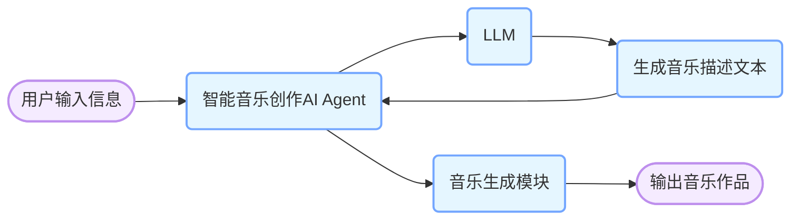

# 智能音乐创作AI Agent：LLM在艺术领域的创新应用

> 关键词：智能音乐创作、AI Agent、大语言模型（LLM）、艺术领域、创新应用

> 摘要：本文聚焦于智能音乐创作AI Agent这一前沿技术，深入探讨了大语言模型（LLM）在艺术领域特别是音乐创作方面的创新应用。首先介绍了研究的背景、目的、预期读者等信息，接着阐述了核心概念与联系，包括智能音乐创作AI Agent和LLM的原理及架构。详细讲解了相关核心算法原理和具体操作步骤，并给出了Python源代码示例。同时，引入数学模型和公式对其进行理论支撑。通过项目实战部分的代码实际案例，进一步展示了如何实现智能音乐创作。还探讨了其实际应用场景，推荐了相关的学习资源、开发工具框架以及论文著作。最后总结了未来发展趋势与挑战，解答了常见问题，并提供了扩展阅读和参考资料，为相关领域的研究和实践提供了全面且深入的指导。

## 1. 背景介绍 
### 1.1 目的和范围
随着人工智能技术的飞速发展，大语言模型（LLM）在各个领域展现出了强大的应用潜力。音乐创作作为艺术领域的重要组成部分，一直以来依赖于人类的创造力和专业知识。然而，智能音乐创作AI Agent的出现为音乐创作带来了新的可能性。本文的目的在于深入研究智能音乐创作AI Agent中LLM的应用，探索其在音乐创作过程中的原理、算法和实际应用。研究范围涵盖了智能音乐创作AI Agent的核心概念、相关算法、数学模型，以及通过实际项目展示其在音乐创作中的具体实现和应用场景。

### 1.2 预期读者
本文的预期读者包括人工智能领域的研究人员、开发者，对音乐创作和人工智能交叉领域感兴趣的艺术家、音乐爱好者，以及相关专业的学生。希望通过本文，能够为他们提供关于智能音乐创作AI Agent的全面知识和技术指导，激发他们在该领域的研究和实践热情。

### 1.3 文档结构概述
本文将按照以下结构进行阐述：首先介绍智能音乐创作AI Agent和LLM的核心概念与联系，包括其原理和架构；接着详细讲解核心算法原理和具体操作步骤，并给出Python源代码示例；引入数学模型和公式对其进行理论支撑；通过项目实战部分展示代码实际案例和详细解释；探讨其实际应用场景；推荐相关的学习资源、开发工具框架以及论文著作；最后总结未来发展趋势与挑战，解答常见问题，并提供扩展阅读和参考资料。

### 1.4 术语表
#### 1.4.1 核心术语定义
- **智能音乐创作AI Agent**：一种基于人工智能技术的智能体，能够模拟人类的音乐创作过程，根据输入的信息生成具有一定音乐风格和质量的音乐作品。
- **大语言模型（LLM）**：一种基于深度学习的自然语言处理模型，通过在大规模文本数据上进行训练，学习语言的模式和规律，能够生成自然流畅的文本。
- **音乐生成**：指利用计算机技术自动生成音乐的过程，包括旋律、和声、节奏等音乐元素的生成。
- **艺术领域**：涵盖了音乐、绘画、舞蹈、戏剧等各种艺术形式的领域，强调创造力和审美价值。

#### 1.4.2 相关概念解释
- **生成式人工智能**：一种能够自动生成新的内容，如图像、文本、音乐等的人工智能技术。智能音乐创作AI Agent就是生成式人工智能在音乐领域的应用。
- **模型微调**：在预训练模型的基础上，使用特定的数据集对模型进行进一步训练，以使其适应特定的任务和领域。在智能音乐创作中，可对LLM进行微调以更好地生成音乐相关的文本。

#### 1.4.3 缩略词列表
- **LLM**：Large Language Model（大语言模型）
- **AI**：Artificial Intelligence（人工智能）

## 2. 核心概念与联系 

### 智能音乐创作AI Agent原理
智能音乐创作AI Agent的核心目标是生成高质量的音乐作品。它通常由多个模块组成，包括输入模块、处理模块和输出模块。输入模块接收用户提供的信息，如音乐风格、主题、情感等。处理模块利用人工智能技术对输入信息进行分析和处理，生成音乐的各个元素。输出模块将生成的音乐元素组合成完整的音乐作品，并以合适的格式输出。

### 大语言模型（LLM）原理
大语言模型是基于Transformer架构的深度学习模型。它通过在大规模文本数据上进行无监督学习，学习语言的语法、语义和上下文信息。LLM的核心是注意力机制，它能够自动捕捉文本中不同位置之间的依赖关系，从而生成自然流畅的文本。

### 两者联系
智能音乐创作AI Agent可以利用LLM的强大语言理解和生成能力。在音乐创作过程中，LLM可以将用户输入的文本信息转化为音乐相关的描述，如旋律走向、和声变化等。同时，LLM还可以生成歌词、音乐评论等与音乐相关的文本内容，为音乐创作提供更多的灵感和支持。

### 架构的文本示意图
智能音乐创作AI Agent与LLM的架构关系可以描述为：用户通过输入模块向AI Agent提供音乐创作的相关信息，AI Agent将这些信息传递给LLM。LLM对信息进行处理和分析，生成音乐相关的文本描述。AI Agent再根据这些描述，利用音乐生成模块生成具体的音乐作品，并通过输出模块输出。

### Mermaid流程图


## 3. 核心算法原理 & 具体操作步骤 

### 核心算法原理
智能音乐创作AI Agent中使用的核心算法主要基于生成式对抗网络（GAN）和循环神经网络（RNN），结合LLM的文本生成能力。GAN由生成器和判别器组成，生成器负责生成音乐数据，判别器负责判断生成的音乐是否真实。RNN则用于处理序列数据，如音乐的音符序列。

### 具体操作步骤
1. **数据预处理**：收集大量的音乐数据，包括不同风格、类型的音乐作品。对这些数据进行清洗、标注和特征提取，将音乐数据转化为适合模型输入的格式。
2. **LLM微调**：使用音乐相关的文本数据对预训练的LLM进行微调，使其能够更好地理解和生成音乐相关的文本。
3. **模型训练**：将预处理后的音乐数据和微调后的LLM结合，训练生成式对抗网络和循环神经网络。在训练过程中，不断调整模型的参数，以提高生成音乐的质量。
4. **音乐生成**：在模型训练完成后，用户输入音乐创作的相关信息，如风格、主题等。AI Agent将这些信息传递给LLM，生成音乐描述文本。然后，根据这些描述文本，使用训练好的生成式对抗网络和循环神经网络生成具体的音乐作品。

### Python源代码示例
```python
import torch
import torch.nn as nn
import torch.optim as optim
from transformers import GPT2LMHeadModel, GPT2Tokenizer

# 加载预训练的LLM
tokenizer = GPT2Tokenizer.from_pretrained('gpt2')
model = GPT2LMHeadModel.from_pretrained('gpt2')

# 定义生成式对抗网络的生成器和判别器
class Generator(nn.Module):
    def __init__(self, input_size, output_size):
        super(Generator, self).__init__()
        self.fc = nn.Linear(input_size, output_size)

    def forward(self, x):
        return self.fc(x)

class Discriminator(nn.Module):
    def __init__(self, input_size):
        super(Discriminator, self).__init__()
        self.fc = nn.Linear(input_size, 1)
        self.sigmoid = nn.Sigmoid()

    def forward(self, x):
        return self.sigmoid(self.fc(x))

# 初始化生成器和判别器
input_size = 100
output_size = 128
generator = Generator(input_size, output_size)
discriminator = Discriminator(output_size)

# 定义损失函数和优化器
criterion = nn.BCELoss()
generator_optimizer = optim.Adam(generator.parameters(), lr=0.001)
discriminator_optimizer = optim.Adam(discriminator.parameters(), lr=0.001)

# 训练模型
num_epochs = 100
for epoch in range(num_epochs):
    # 生成随机噪声
    noise = torch.randn(1, input_size)
    # 生成音乐数据
    generated_music = generator(noise)
    # 判别器训练
    discriminator_optimizer.zero_grad()
    real_labels = torch.ones(1, 1)
    fake_labels = torch.zeros(1, 1)
    real_output = discriminator(real_music)
    real_loss = criterion(real_output, real_labels)
    fake_output = discriminator(generated_music.detach())
    fake_loss = criterion(fake_output, fake_labels)
    discriminator_loss = real_loss + fake_loss
    discriminator_loss.backward()
    discriminator_optimizer.step()
    # 生成器训练
    generator_optimizer.zero_grad()
    output = discriminator(generated_music)
    generator_loss = criterion(output, real_labels)
    generator_loss.backward()
    generator_optimizer.step()

    if (epoch + 1) % 10 == 0:
        print(f'Epoch [{epoch+1}/{num_epochs}], Generator Loss: {generator_loss.item():.4f}, Discriminator Loss: {discriminator_loss.item():.4f}')

# 音乐生成
input_text = "一首欢快的流行歌曲"
input_ids = tokenizer.encode(input_text, return_tensors='pt')
output = model.generate(input_ids, max_length=100, num_beams=5, no_repeat_ngram_size=2, early_stopping=True)
music_description = tokenizer.decode(output[0], skip_special_tokens=True)
print(music_description)
```

## 4. 数学模型和公式 & 详细讲解 & 举例说明 

### 生成式对抗网络（GAN）数学模型
生成式对抗网络由生成器 $G$ 和判别器 $D$ 组成。生成器的目标是生成尽可能真实的样本，判别器的目标是区分真实样本和生成样本。GAN的目标函数可以表示为：

$$
\min_G \max_D V(D, G) = \mathbb{E}_{x \sim p_{data}(x)}[\log D(x)] + \mathbb{E}_{z \sim p_z(z)}[\log(1 - D(G(z)))]
$$

其中，$p_{data}(x)$ 是真实数据的分布，$p_z(z)$ 是噪声分布，$x$ 是真实样本，$z$ 是噪声样本。

### 详细讲解
在训练过程中，判别器 $D$ 试图最大化目标函数 $V(D, G)$，即尽可能准确地区分真实样本和生成样本。生成器 $G$ 试图最小化目标函数 $V(D, G)$，即生成的样本能够欺骗判别器。通过不断的迭代训练，生成器和判别器的性能不断提高，最终生成器能够生成高质量的样本。

### 举例说明
假设我们要生成手写数字图像。真实数据是从MNIST数据集获取的手写数字图像，噪声样本是随机生成的向量。生成器将噪声向量作为输入，生成手写数字图像。判别器接收真实图像和生成图像作为输入，判断其是否为真实图像。在训练过程中，判别器会逐渐学会区分真实图像和生成图像，而生成器会不断改进生成的图像，使其更接近真实图像。

### 循环神经网络（RNN）数学模型
循环神经网络是一种用于处理序列数据的神经网络。对于一个时间步 $t$，RNN的隐藏状态 $h_t$ 可以表示为：

$$
h_t = \tanh(W_{hh}h_{t-1} + W_{xh}x_t + b_h)
$$

其中，$W_{hh}$ 是隐藏状态到隐藏状态的权重矩阵，$W_{xh}$ 是输入到隐藏状态的权重矩阵，$b_h$ 是偏置向量，$x_t$ 是时间步 $t$ 的输入，$h_{t-1}$ 是上一个时间步的隐藏状态。

### 详细讲解
RNN通过不断更新隐藏状态来处理序列数据。在每个时间步，RNN根据当前输入和上一个时间步的隐藏状态计算当前时间步的隐藏状态。隐藏状态包含了之前时间步的信息，因此RNN能够捕捉序列数据中的时间依赖关系。

### 举例说明
在音乐生成中，输入序列可以是音乐的音符序列。RNN可以根据之前的音符预测下一个音符。例如，在一个简单的音乐生成任务中，输入序列是一串音符，RNN会根据这些音符生成下一个可能的音符，从而实现音乐的生成。

## 5. 项目实战：代码实际案例和详细解释说明 

### 5.1  开发环境搭建
1. **安装Python**：建议使用Python 3.7及以上版本。可以从Python官方网站（https://www.python.org/downloads/）下载并安装。
2. **安装必要的库**：使用pip安装以下库：
    - `torch`：用于深度学习模型的构建和训练。
    - `transformers`：用于加载和使用预训练的大语言模型。
    - `numpy`：用于数值计算。
    - `matplotlib`：用于数据可视化。

```bash
pip install torch transformers numpy matplotlib
```

### 5.2  源代码详细实现和代码解读
```python
import torch
import torch.nn as nn
import torch.optim as optim
from transformers import GPT2LMHeadModel, GPT2Tokenizer

# 加载预训练的LLM
tokenizer = GPT2Tokenizer.from_pretrained('gpt2')
model = GPT2LMHeadModel.from_pretrained('gpt2')

# 定义生成式对抗网络的生成器和判别器
class Generator(nn.Module):
    def __init__(self, input_size, output_size):
        super(Generator, self).__init__()
        self.fc = nn.Linear(input_size, output_size)

    def forward(self, x):
        return self.fc(x)

class Discriminator(nn.Module):
    def __init__(self, input_size):
        super(Discriminator, self).__init__()
        self.fc = nn.Linear(input_size, 1)
        self.sigmoid = nn.Sigmoid()

    def forward(self, x):
        return self.sigmoid(self.fc(x))

# 初始化生成器和判别器
input_size = 100
output_size = 128
generator = Generator(input_size, output_size)
discriminator = Discriminator(output_size)

# 定义损失函数和优化器
criterion = nn.BCELoss()
generator_optimizer = optim.Adam(generator.parameters(), lr=0.001)
discriminator_optimizer = optim.Adam(discriminator.parameters(), lr=0.001)

# 模拟真实音乐数据
real_music = torch.randn(1, output_size)

# 训练模型
num_epochs = 100
for epoch in range(num_epochs):
    # 生成随机噪声
    noise = torch.randn(1, input_size)
    # 生成音乐数据
    generated_music = generator(noise)
    # 判别器训练
    discriminator_optimizer.zero_grad()
    real_labels = torch.ones(1, 1)
    fake_labels = torch.zeros(1, 1)
    real_output = discriminator(real_music)
    real_loss = criterion(real_output, real_labels)
    fake_output = discriminator(generated_music.detach())
    fake_loss = criterion(fake_output, fake_labels)
    discriminator_loss = real_loss + fake_loss
    discriminator_loss.backward()
    discriminator_optimizer.step()
    # 生成器训练
    generator_optimizer.zero_grad()
    output = discriminator(generated_music)
    generator_loss = criterion(output, real_labels)
    generator_loss.backward()
    generator_optimizer.step()

    if (epoch + 1) % 10 == 0:
        print(f'Epoch [{epoch+1}/{num_epochs}], Generator Loss: {generator_loss.item():.4f}, Discriminator Loss: {discriminator_loss.item():.4f}')

# 音乐生成
input_text = "一首欢快的流行歌曲"
input_ids = tokenizer.encode(input_text, return_tensors='pt')
output = model.generate(input_ids, max_length=100, num_beams=5, no_repeat_ngram_size=2, early_stopping=True)
music_description = tokenizer.decode(output[0], skip_special_tokens=True)
print(music_description)
```

### 代码解读与分析
1. **加载预训练的LLM**：使用`transformers`库加载预训练的GPT-2模型和分词器。
2. **定义生成式对抗网络的生成器和判别器**：生成器是一个简单的全连接层，将随机噪声转换为音乐数据。判别器也是一个全连接层，输出一个概率值，表示输入数据是真实音乐的概率。
3. **初始化模型和优化器**：初始化生成器、判别器、损失函数和优化器。
4. **训练模型**：在每个训练周期中，首先生成随机噪声，使用生成器生成音乐数据。然后训练判别器，使其能够区分真实音乐和生成音乐。最后训练生成器，使其生成的音乐能够欺骗判别器。
5. **音乐生成**：使用LLM根据用户输入的文本生成音乐描述文本。

## 6. 实际应用场景 
### 音乐创作辅助
智能音乐创作AI Agent可以为音乐家和音乐创作者提供创作灵感和辅助。创作者可以输入一些基本的信息，如音乐风格、主题、情感等，AI Agent可以生成相关的音乐元素，如旋律、和声、节奏等，帮助创作者快速完成音乐创作。

### 个性化音乐推荐
结合用户的音乐偏好和历史播放记录，智能音乐创作AI Agent可以生成个性化的音乐作品。用户可以根据自己的喜好定制音乐的风格、节奏、情感等，AI Agent可以为用户生成符合其需求的独特音乐。

### 音乐教育
在音乐教育领域，智能音乐创作AI Agent可以作为教学工具，帮助学生学习音乐理论和创作技巧。学生可以通过与AI Agent互动，了解不同音乐风格的特点，学习如何构建旋律、和声等音乐元素。

### 游戏和影视配乐
在游戏和影视制作中，需要大量的配乐来增强氛围和情感表达。智能音乐创作AI Agent可以根据游戏或影视的情节、场景和风格，快速生成合适的配乐，提高制作效率和质量。

## 7. 工具和资源推荐
### 7.1 学习资源推荐
#### 7.1.1 书籍推荐
- 《深度学习》（Deep Learning）：由Ian Goodfellow、Yoshua Bengio和Aaron Courville所著，是深度学习领域的经典教材，涵盖了神经网络、深度学习模型、优化算法等方面的知识。
- 《Python深度学习》（Deep Learning with Python）：由Francois Chollet所著，结合Python和Keras框架，介绍了深度学习的基本概念和实践应用。
- 《音乐信息检索》（Music Information Retrieval）：由Meinard Müller所著，详细介绍了音乐信息检索的相关技术和方法，包括音乐特征提取、音乐分类、音乐生成等。

#### 7.1.2 在线课程
- Coursera上的“深度学习专项课程”（Deep Learning Specialization）：由Andrew Ng教授授课，包括神经网络和深度学习、改善深层神经网络、结构化机器学习项目等多个课程，系统地介绍了深度学习的理论和实践。
- edX上的“音乐信息检索”（Music Information Retrieval）：由巴黎第六大学的研究团队授课，介绍了音乐信息检索的基本概念、技术和应用。

#### 7.1.3 技术博客和网站
- Towards Data Science：一个专注于数据科学和人工智能的技术博客平台，上面有许多关于深度学习、音乐生成等方面的文章和教程。
- arXiv：一个预印本数据库，提供了大量关于人工智能、机器学习、音乐信息检索等领域的最新研究论文。

### 7.2 开发工具框架推荐
#### 7.2.1 IDE和编辑器
- PyCharm：一款专业的Python集成开发环境，提供了代码编辑、调试、版本控制等功能，适合开发Python项目。
- Jupyter Notebook：一个交互式的开发环境，支持Python、R等多种编程语言，适合进行数据探索、模型训练和可视化。

#### 7.2.2 调试和性能分析工具
- TensorBoard：一个用于可视化深度学习模型训练过程的工具，可以展示模型的损失函数、准确率、梯度等信息，帮助开发者调试和优化模型。
- PyTorch Profiler：PyTorch提供的性能分析工具，可以分析模型的计算时间、内存使用等情况，帮助开发者找出性能瓶颈。

#### 7.2.3 相关框架和库
- PyTorch：一个开源的深度学习框架，提供了丰富的神经网络层和优化算法，支持GPU加速，适合开发深度学习模型。
- Transformers：Hugging Face开发的自然语言处理库，提供了大量预训练的大语言模型，如GPT-2、BERT等，方便开发者进行文本生成、文本分类等任务。
- Music21：一个用于音乐分析、创作和生成的Python库，提供了音乐表示、音乐理论计算、音乐文件读写等功能。

### 7.3 相关论文著作推荐
#### 7.3.1 经典论文
- “Generative Adversarial Nets”：由Ian Goodfellow等人发表的论文，首次提出了生成式对抗网络（GAN）的概念，为生成式人工智能的发展奠定了基础。
- “Attention Is All You Need”：由Vaswani等人发表的论文，提出了Transformer架构，是大语言模型的核心技术之一。

#### 7.3.2 最新研究成果
- “Jukebox: A Generative Model for Music”：OpenAI发表的论文，介绍了Jukebox模型，该模型可以生成多种风格的音乐作品。
- “MusicLM: Generating Music From Text”：Google发表的论文，提出了MusicLM模型，通过文本输入生成高质量的音乐。

#### 7.3.3 应用案例分析
- “AI-Generated Music in the Music Industry: Opportunities and Challenges”：分析了人工智能生成音乐在音乐产业中的应用机会和挑战，包括音乐创作、音乐发行、音乐版权等方面。

## 8. 总结：未来发展趋势与挑战
### 未来发展趋势
- **更高质量的音乐生成**：随着人工智能技术的不断发展，智能音乐创作AI Agent将能够生成更高质量、更具创新性的音乐作品。模型将能够更好地理解音乐的语义和情感，生成的音乐将更加符合人类的审美需求。
- **多模态融合**：未来的智能音乐创作AI Agent将不仅仅局限于文本输入，还将结合图像、视频等多模态信息进行音乐创作。例如，根据电影的画面和情节生成与之匹配的音乐。
- **个性化和交互性增强**：AI Agent将能够更好地理解用户的个性化需求和偏好，提供更加个性化的音乐创作服务。同时，用户与AI Agent之间的交互将更加自然和灵活，用户可以实时调整音乐的生成过程。

### 挑战
- **音乐理解和创造力**：虽然人工智能在音乐生成方面取得了一定的进展，但目前还无法完全理解音乐的深层含义和创造力。如何让AI Agent具有真正的音乐理解和创造力是未来需要解决的重要问题。
- **版权和伦理问题**：人工智能生成的音乐作品的版权归属和伦理问题是一个复杂的问题。例如，如何确定AI Agent生成的音乐的版权所有者，如何避免AI Agent生成的音乐侵犯他人的版权等。
- **计算资源和效率**：训练和运行智能音乐创作AI Agent需要大量的计算资源和时间。如何提高模型的训练效率和运行效率，降低计算成本，是未来需要解决的技术挑战。

## 9. 附录：常见问题与解答
### 问题1：智能音乐创作AI Agent生成的音乐是否具有版权？
解答：目前关于AI生成作品的版权问题还存在争议。在大多数国家和地区，版权通常授予创作者。由于AI本身不具有法律人格，因此AI生成的音乐的版权归属可能需要根据具体情况进行判断。一些观点认为，AI的开发者或使用者可以被视为版权所有者，而另一些观点则认为需要制定专门的法律来规范AI生成作品的版权问题。

### 问题2：智能音乐创作AI Agent能否替代人类音乐家？
解答：虽然智能音乐创作AI Agent可以生成高质量的音乐作品，但它目前还无法完全替代人类音乐家。人类音乐家具有独特的创造力、情感表达和审美能力，能够将自己的人生经历和情感融入到音乐创作中。AI Agent更多地是作为一种辅助工具，为音乐家提供创作灵感和支持。

### 问题3：如何评估智能音乐创作AI Agent生成的音乐质量？
解答：评估AI生成的音乐质量是一个复杂的问题，目前还没有统一的标准。可以从多个方面进行评估，如音乐的旋律、和声、节奏是否和谐，是否具有创新性和情感表达，是否符合用户的需求和偏好等。此外，还可以通过用户的反馈和评价来评估音乐的质量。

## 10. 扩展阅读 & 参考资料
### 扩展阅读
- 《人工智能时代的音乐创作与表演》：探讨了人工智能在音乐创作和表演领域的应用和影响。
- 《音乐人工智能：从算法到艺术》：介绍了音乐人工智能的基本概念、技术和应用，以及其在艺术领域的发展前景。

### 参考资料
- Goodfellow, I. J., et al. (2014). Generative adversarial nets. Advances in neural information processing systems.
- Vaswani, A., et al. (2017). Attention is all you need. Advances in neural information processing systems.
- OpenAI. (2022). Jukebox: A Generative Model for Music.
- Google. (2023). MusicLM: Generating Music From Text.

作者：AI天才研究院/AI Genius Institute & 禅与计算机程序设计艺术 /Zen And The Art of Computer Programming