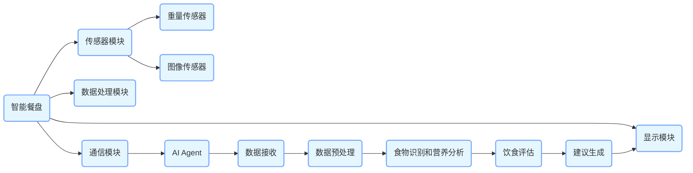

# 智能餐盘：AI Agent的饮食平衡建议

> 关键词：智能餐盘、AI Agent、饮食平衡建议、人工智能、健康饮食、数据分析、传感器技术

> 摘要：本文聚焦于智能餐盘结合AI Agent为用户提供饮食平衡建议这一创新应用。首先介绍了智能餐盘和AI Agent的背景知识，阐述了其目的、预期读者和文档结构。接着深入讲解核心概念，包括智能餐盘的工作原理和AI Agent的决策机制，并通过文本示意图和Mermaid流程图进行直观展示。详细分析了核心算法原理，给出Python代码示例，同时介绍相关数学模型和公式。通过项目实战，展示了开发环境搭建、源代码实现和代码解读。探讨了实际应用场景，推荐了学习资源、开发工具框架和相关论文著作。最后总结了未来发展趋势与挑战，并提供常见问题解答和扩展阅读参考资料，旨在帮助读者全面了解智能餐盘与AI Agent在饮食平衡建议方面的应用和技术原理。

## 1. 背景介绍 
### 1.1 目的和范围
随着人们生活水平的提高，健康饮食越来越受到关注。然而，很多人并不清楚如何实现饮食的平衡。智能餐盘结合AI Agent技术，旨在为用户提供个性化的饮食平衡建议。本文章的范围涵盖了智能餐盘和AI Agent的核心概念、算法原理、数学模型、项目实战、实际应用场景等方面，帮助读者全面了解这一技术及其应用。

### 1.2 预期读者
本文预期读者包括对人工智能在健康领域应用感兴趣的技术爱好者、从事相关研究的科研人员、智能餐盘开发的工程师以及关注健康饮食的普通大众。

### 1.3 文档结构概述
本文将按照以下结构进行阐述：首先介绍核心概念与联系，包括智能餐盘和AI Agent的原理和架构；接着讲解核心算法原理和具体操作步骤，并给出Python代码示例；然后介绍相关的数学模型和公式，并举例说明；通过项目实战展示代码的实际案例和详细解释；探讨实际应用场景；推荐学习资源、开发工具框架和相关论文著作；最后总结未来发展趋势与挑战，提供常见问题解答和扩展阅读参考资料。

### 1.4 术语表
#### 1.4.1 核心术语定义
- **智能餐盘**：一种配备了传感器和通信模块的餐盘，能够获取食物的相关信息，如重量、种类等。
- **AI Agent**：人工智能代理，是一种能够感知环境、做出决策并采取行动的智能实体。在本文中，AI Agent根据智能餐盘获取的信息，为用户提供饮食平衡建议。
- **饮食平衡**：指人体摄入的各种营养素（如碳水化合物、蛋白质、脂肪、维生素、矿物质等）在种类和数量上达到合理的比例，以维持身体的正常生理功能和健康状态。

#### 1.4.2 相关概念解释
- **传感器技术**：智能餐盘通过传感器来获取食物的信息，常见的传感器包括重量传感器、图像传感器等。重量传感器可以测量食物的重量，图像传感器可以识别食物的种类。
- **数据分析**：AI Agent对智能餐盘获取的信息进行分析，结合用户的个人信息（如年龄、性别、身高、体重、运动量等）和饮食目标（如减肥、增肌、维持健康等），生成个性化的饮食平衡建议。
- **机器学习算法**：用于训练AI Agent，使其能够准确地识别食物种类和分析营养成分。常见的机器学习算法包括卷积神经网络（CNN）、支持向量机（SVM）等。

#### 1.4.3 缩略词列表
- **AI**：Artificial Intelligence，人工智能
- **CNN**：Convolutional Neural Network，卷积神经网络
- **SVM**：Support Vector Machine，支持向量机

## 2. 核心概念与联系 

### 智能餐盘的工作原理
智能餐盘主要由以下几个部分组成：传感器模块、数据处理模块、通信模块和显示模块。

传感器模块：包括重量传感器和图像传感器。重量传感器用于测量食物的重量，图像传感器用于拍摄食物的照片，以便识别食物的种类。

数据处理模块：对传感器获取的数据进行处理，如对图像进行特征提取和分类，计算食物的营养成分等。

通信模块：将处理后的数据传输到AI Agent或云端服务器，以便进行进一步的分析和处理。

显示模块：可以显示食物的相关信息，如重量、种类、营养成分等，也可以显示AI Agent提供的饮食平衡建议。

### AI Agent的决策机制
AI Agent根据智能餐盘传输的数据和用户的个人信息、饮食目标，运用机器学习算法和规则引擎进行分析和决策。具体步骤如下：

1. 数据接收：接收智能餐盘传输的食物信息和用户的个人信息。
2. 数据预处理：对接收的数据进行清洗、归一化等预处理操作，以便后续的分析和处理。
3. 食物识别和营养分析：利用机器学习算法对食物图像进行识别，确定食物的种类，并根据食物的种类和重量计算其营养成分。
4. 饮食评估：根据用户的个人信息和饮食目标，评估当前饮食的合理性，判断是否达到饮食平衡。
5. 建议生成：如果当前饮食不符合饮食平衡的要求，AI Agent根据分析结果生成个性化的饮食平衡建议，如增加某种营养素的摄入、减少某种食物的食用等。

### 核心概念的架构示意图


## 3. 核心算法原理 & 具体操作步骤 

### 食物识别算法
食物识别是智能餐盘和AI Agent的关键环节之一。这里我们使用卷积神经网络（CNN）来实现食物识别。CNN是一种专门用于处理具有网格结构数据（如图像）的深度学习模型，具有强大的特征提取能力。

以下是一个简单的基于Keras库的CNN食物识别模型的Python代码示例：

```python
import tensorflow as tf
from tensorflow.keras import layers, models

# 构建CNN模型
model = models.Sequential()
model.add(layers.Conv2D(32, (3, 3), activation='relu', input_shape=(150, 150, 3)))
model.add(layers.MaxPooling2D((2, 2)))
model.add(layers.Conv2D(64, (3, 3), activation='relu'))
model.add(layers.MaxPooling2D((2, 2)))
model.add(layers.Conv2D(128, (3, 3), activation='relu'))
model.add(layers.MaxPooling2D((2, 2)))
model.add(layers.Flatten())
model.add(layers.Dense(128, activation='relu'))
model.add(layers.Dense(10, activation='softmax'))  # 假设识别10种不同的食物

# 编译模型
model.compile(optimizer='adam',
              loss='categorical_crossentropy',
              metrics=['accuracy'])

# 加载数据集并进行训练
# 这里省略了数据集加载和训练的代码，实际应用中需要根据具体情况进行处理
```

### 营养分析算法
在识别出食物的种类后，需要根据食物的种类和重量计算其营养成分。可以建立一个食物营养数据库，存储各种食物的营养成分信息。以下是一个简单的营养分析算法的Python代码示例：

```python
# 食物营养数据库
food_nutrition_db = {
    '苹果': {'碳水化合物': 13.8, '蛋白质': 0.3, '脂肪': 0.2},
    '香蕉': {'碳水化合物': 22.8, '蛋白质': 1.1, '脂肪': 0.3},
    '牛奶': {'碳水化合物': 4.7, '蛋白质': 3.2, '脂肪': 3.2}
}

def analyze_nutrition(food_name, weight):
    if food_name in food_nutrition_db:
        nutrition = food_nutrition_db[food_name]
        result = {}
        for nutrient, value in nutrition.items():
            result[nutrient] = value * weight / 100  # 根据重量计算营养成分
        return result
    else:
        return None

# 示例使用
food_name = '苹果'
weight = 200
nutrition = analyze_nutrition(food_name, weight)
print(nutrition)
```

### 饮食评估和建议生成算法
根据用户的个人信息和饮食目标，评估当前饮食的合理性，并生成个性化的饮食平衡建议。以下是一个简单的饮食评估和建议生成算法的Python代码示例：

```python
# 用户信息和饮食目标
user_info = {
    '年龄': 30,
    '性别': '男',
    '身高': 175,
    '体重': 70,
    '运动量': '中等'
}

diet_goal = {
    '碳水化合物': 200,
    '蛋白质': 80,
    '脂肪': 60
}

def evaluate_diet(nutrition):
    evaluation = {}
    for nutrient, goal in diet_goal.items():
        if nutrient in nutrition:
            intake = nutrition[nutrient]
            if intake < goal * 0.8:
                evaluation[nutrient] = '摄入不足'
            elif intake > goal * 1.2:
                evaluation[nutrient] = '摄入过量'
            else:
                evaluation[nutrient] = '摄入合理'
        else:
            evaluation[nutrient] = '未摄入'
    return evaluation

def generate_suggestion(evaluation):
    suggestions = []
    for nutrient, status in evaluation.items():
        if status == '摄入不足':
            suggestions.append(f'建议增加{nutrient}的摄入，可以多吃一些富含{nutrient}的食物。')
        elif status == '摄入过量':
            suggestions.append(f'建议减少{nutrient}的摄入，控制此类食物的食用量。')
    return suggestions

# 示例使用
nutrition = {'碳水化合物': 150, '蛋白质': 70, '脂肪': 50}
evaluation = evaluate_diet(nutrition)
suggestions = generate_suggestion(evaluation)
print(evaluation)
print(suggestions)
```

## 4. 数学模型和公式 & 详细讲解 & 举例说明 

### 营养成分计算
营养成分的计算主要基于食物的重量和每100克食物中各种营养成分的含量。设食物的重量为 $w$（单位：克），每100克食物中某种营养成分的含量为 $n_{100}$，则该食物中该营养成分的含量 $n$ 可以通过以下公式计算：

$$n = \frac{w}{100} \times n_{100}$$

例如，一个200克的苹果，每100克苹果中碳水化合物的含量为13.8克，则该苹果中碳水化合物的含量为：

$$n = \frac{200}{100} \times 13.8 = 27.6 \text{ 克}$$

### 饮食评估指标
饮食评估可以使用营养成分的摄入量与目标摄入量的比例来进行。设某种营养成分的摄入量为 $n_{intake}$，目标摄入量为 $n_{goal}$，则评估指标 $r$ 可以通过以下公式计算：

$$r = \frac{n_{intake}}{n_{goal}}$$

根据 $r$ 的值，可以判断该营养成分的摄入情况：
- 当 $r < 0.8$ 时，认为该营养成分摄入不足；
- 当 $0.8 \leq r \leq 1.2$ 时，认为该营养成分摄入合理；
- 当 $r > 1.2$ 时，认为该营养成分摄入过量。

例如，用户的蛋白质目标摄入量为80克，实际摄入量为70克，则蛋白质的评估指标为：

$$r = \frac{70}{80} = 0.875$$

由于 $0.8 \leq 0.875 \leq 1.2$，所以蛋白质的摄入情况为合理。

## 5. 项目实战：代码实际案例和详细解释说明 

### 5.1  开发环境搭建
要实现智能餐盘和AI Agent的饮食平衡建议系统，需要搭建以下开发环境：

- **操作系统**：可以选择Windows、Linux或macOS。
- **编程语言**：Python，版本建议使用3.7及以上。
- **深度学习框架**：TensorFlow和Keras，用于构建和训练食物识别模型。
- **数据库**：可以使用SQLite或MySQL，用于存储食物营养数据库和用户信息。

以下是安装所需库的命令：

```bash
pip install tensorflow keras numpy pandas sqlite3
```

### 5.2  源代码详细实现和代码解读
#### 食物识别模块
```python
import tensorflow as tf
from tensorflow.keras.preprocessing.image import load_img, img_to_array
import numpy as np

# 加载预训练的食物识别模型
model = tf.keras.models.load_model('food_recognition_model.h5')

def recognize_food(image_path):
    # 加载图像并进行预处理
    img = load_img(image_path, target_size=(150, 150))
    img = img_to_array(img)
    img = np.expand_dims(img, axis=0)
    img = img / 255.0  # 归一化

    # 进行预测
    predictions = model.predict(img)
    food_index = np.argmax(predictions)
    # 假设食物类别列表
    food_classes = ['苹果', '香蕉', '牛奶', '面包', '鸡蛋', '鸡肉', '鱼肉', '蔬菜沙拉', '米饭', '面条']
    food_name = food_classes[food_index]
    return food_name

# 示例使用
image_path = 'test_image.jpg'
food_name = recognize_food(image_path)
print(f'识别出的食物是：{food_name}')
```

代码解读：
- 首先加载预训练的食物识别模型。
- 定义 `recognize_food` 函数，该函数接受图像路径作为输入。
- 加载图像并进行预处理，包括调整图像大小、转换为数组和归一化。
- 使用模型进行预测，得到预测结果。
- 根据预测结果的索引，从食物类别列表中获取食物名称。

#### 营养分析模块
```python
import sqlite3

# 连接到食物营养数据库
conn = sqlite3.connect('food_nutrition.db')
cursor = conn.cursor()

def analyze_nutrition(food_name, weight):
    # 从数据库中查询食物的营养信息
    cursor.execute("SELECT 碳水化合物, 蛋白质, 脂肪 FROM food_nutrition WHERE 食物名称 =?", (food_name,))
    result = cursor.fetchone()
    if result:
        carbohydrate, protein, fat = result
        carbohydrate = carbohydrate * weight / 100
        protein = protein * weight / 100
        fat = fat * weight / 100
        nutrition = {
            '碳水化合物': carbohydrate,
            '蛋白质': protein,
            '脂肪': fat
        }
        return nutrition
    else:
        return None

# 示例使用
food_name = '苹果'
weight = 200
nutrition = analyze_nutrition(food_name, weight)
print(nutrition)

# 关闭数据库连接
conn.close()
```

代码解读：
- 连接到食物营养数据库。
- 定义 `analyze_nutrition` 函数，该函数接受食物名称和重量作为输入。
- 从数据库中查询该食物的营养信息。
- 根据重量计算该食物中各种营养成分的含量。
- 返回营养成分信息。

#### 饮食评估和建议生成模块
```python
# 用户信息和饮食目标
user_info = {
    '年龄': 30,
    '性别': '男',
    '身高': 175,
    '体重': 70,
    '运动量': '中等'
}

diet_goal = {
    '碳水化合物': 200,
    '蛋白质': 80,
    '脂肪': 60
}

def evaluate_diet(nutrition):
    evaluation = {}
    for nutrient, goal in diet_goal.items():
        if nutrient in nutrition:
            intake = nutrition[nutrient]
            if intake < goal * 0.8:
                evaluation[nutrient] = '摄入不足'
            elif intake > goal * 1.2:
                evaluation[nutrient] = '摄入过量'
            else:
                evaluation[nutrient] = '摄入合理'
        else:
            evaluation[nutrient] = '未摄入'
    return evaluation

def generate_suggestion(evaluation):
    suggestions = []
    for nutrient, status in evaluation.items():
        if status == '摄入不足':
            suggestions.append(f'建议增加{nutrient}的摄入，可以多吃一些富含{nutrient}的食物。')
        elif status == '摄入过量':
            suggestions.append(f'建议减少{nutrient}的摄入，控制此类食物的食用量。')
    return suggestions

# 示例使用
nutrition = {'碳水化合物': 150, '蛋白质': 70, '脂肪': 50}
evaluation = evaluate_diet(nutrition)
suggestions = generate_suggestion(evaluation)
print(evaluation)
print(suggestions)
```

代码解读：
- 定义用户信息和饮食目标。
- 定义 `evaluate_diet` 函数，该函数接受营养成分信息作为输入，根据饮食目标评估各种营养成分的摄入情况。
- 定义 `generate_suggestion` 函数，该函数接受评估结果作为输入，根据评估结果生成饮食建议。

### 5.3  代码解读与分析
通过以上代码，我们实现了一个简单的智能餐盘和AI Agent的饮食平衡建议系统。该系统包括食物识别、营养分析、饮食评估和建议生成四个模块。

食物识别模块使用预训练的CNN模型对食物图像进行识别，得到食物的名称。营养分析模块根据食物名称和重量，从数据库中查询该食物的营养信息，并计算其营养成分含量。饮食评估模块根据用户的饮食目标，评估当前饮食中各种营养成分的摄入情况。建议生成模块根据评估结果，生成个性化的饮食平衡建议。

整个系统的核心在于数据的处理和分析，通过对食物图像和营养信息的处理，为用户提供准确的饮食平衡建议。

## 6. 实际应用场景 
### 家庭健康饮食管理
在家庭环境中，智能餐盘可以帮助家庭成员了解自己的饮食情况，特别是对于关注健康饮食的人群，如减肥者、健身爱好者、患有慢性疾病的人群等。通过AI Agent提供的饮食平衡建议，家庭成员可以调整自己的饮食结构，实现健康饮食的目标。

### 学校食堂
学校食堂每天为大量学生提供餐饮服务。智能餐盘可以安装在食堂的餐桌上，学生在就餐时，餐盘可以自动识别食物的种类和重量，并为学生提供饮食平衡建议。学校可以根据学生的饮食情况，优化食堂的菜品搭配，提高学生的饮食质量。

### 医院营养科
在医院营养科，智能餐盘可以辅助医生为患者制定个性化的饮食方案。医生可以根据患者的病情和身体状况，设定饮食目标，智能餐盘结合AI Agent可以实时监测患者的饮食摄入情况，并提供相应的建议，帮助患者更好地恢复健康。

### 餐饮企业
餐饮企业可以利用智能餐盘和AI Agent技术，为顾客提供更加个性化的餐饮服务。例如，根据顾客的健康状况和饮食偏好，推荐适合的菜品，并提供营养分析和饮食建议，提高顾客的满意度和忠诚度。

## 7. 工具和资源推荐
### 7.1 学习资源推荐
#### 7.1.1 书籍推荐
- 《深度学习》（Deep Learning）：由Ian Goodfellow、Yoshua Bengio和Aaron Courville撰写，是深度学习领域的经典教材，涵盖了深度学习的基本概念、算法和应用。
- 《Python机器学习》（Python Machine Learning）：由Sebastian Raschka和Vahid Mirjalili撰写，介绍了使用Python进行机器学习的方法和技术，包括数据预处理、模型选择、深度学习等内容。
- 《健康饮食的科学与艺术》：从营养学的角度介绍了健康饮食的原则和方法，对于理解饮食平衡的概念和重要性有很大帮助。

#### 7.1.2 在线课程
- Coursera上的“深度学习专项课程”（Deep Learning Specialization）：由Andrew Ng教授授课，包括神经网络和深度学习、改善深层神经网络、结构化机器学习项目、卷积神经网络、序列模型等五个课程，是学习深度学习的优质资源。
- edX上的“人工智能基础”（Introduction to Artificial Intelligence）：介绍了人工智能的基本概念、算法和应用，帮助学习者建立人工智能的基础知识体系。
- 中国大学MOOC上的“营养学基础”：系统地介绍了营养学的基本理论和知识，包括营养素的作用、食物的营养成分、饮食与健康的关系等内容。

#### 7.1.3 技术博客和网站
- TensorFlow官方博客：提供了TensorFlow框架的最新动态、技术文章和案例分享，对于学习和使用TensorFlow进行深度学习开发有很大帮助。
- Medium上的人工智能和机器学习相关博客：有很多专业人士分享的关于人工智能和机器学习的技术文章和实践经验，内容丰富多样。
- 丁香医生：一个专业的健康科普网站，提供了大量关于健康饮食、营养知识、疾病防治等方面的文章和信息。

### 7.2 开发工具框架推荐
#### 7.2.1 IDE和编辑器
- PyCharm：一款专门为Python开发设计的集成开发环境（IDE），具有代码编辑、调试、自动补全、版本控制等功能，是Python开发者的首选工具之一。
- Jupyter Notebook：一个基于网页的交互式开发环境，支持多种编程语言，特别适合进行数据探索、模型训练和可视化等工作。
- Visual Studio Code：一款轻量级的代码编辑器，支持多种编程语言和插件扩展，具有丰富的功能和良好的用户体验。

#### 7.2.2 调试和性能分析工具
- TensorBoard：TensorFlow提供的可视化工具，可以帮助开发者监控模型的训练过程、分析模型的性能、可视化模型的结构等。
- Py-Spy：一个Python性能分析工具，可以实时分析Python程序的CPU使用率、函数调用时间等信息，帮助开发者找出程序中的性能瓶颈。
- PDB：Python自带的调试器，可以在程序运行过程中设置断点、查看变量值、单步执行等，方便开发者进行调试。

#### 7.2.3 相关框架和库
- TensorFlow：一个开源的深度学习框架，提供了丰富的工具和接口，支持各种深度学习模型的构建和训练。
- Keras：一个高级神经网络API，基于TensorFlow、Theano等后端，简单易用，适合快速搭建和训练深度学习模型。
- Pandas：一个用于数据处理和分析的Python库，提供了高效的数据结构和数据操作方法，方便进行数据清洗、转换和分析。

### 7.3 相关论文著作推荐
#### 7.3.1 经典论文
- LeCun, Y., Bengio, Y., & Hinton, G. (2015). Deep learning. Nature, 521(7553), 436-444. 这篇论文是深度学习领域的经典综述，介绍了深度学习的发展历程、基本原理和应用领域。
- Krizhevsky, A., Sutskever, I., & Hinton, G. E. (2012). ImageNet classification with deep convolutional neural networks. In Advances in neural information processing systems (pp. 1097-1105). 这篇论文介绍了AlexNet模型，开启了深度学习在图像识别领域的热潮。

#### 7.3.2 最新研究成果
- 关注IEEE Transactions on Pattern Analysis and Machine Intelligence、Journal of Artificial Intelligence Research等顶级学术期刊，以及NeurIPS、ICML、CVPR等重要学术会议，了解智能餐盘和AI Agent在饮食平衡建议方面的最新研究成果。

#### 7.3.3 应用案例分析
- 可以查阅一些关于智能健康设备在饮食管理方面的应用案例分析报告，了解实际应用中遇到的问题和解决方案，以及取得的效果和经验教训。

## 8. 总结：未来发展趋势与挑战
### 未来发展趋势
- **多传感器融合**：未来的智能餐盘可能会融合更多类型的传感器，如气味传感器、温度传感器等，以获取更全面的食物信息，提高食物识别和营养分析的准确性。
- **个性化定制**：AI Agent将能够根据用户的基因信息、肠道菌群信息等更加个性化的因素，为用户提供更加精准的饮食平衡建议，实现真正的个性化健康饮食管理。
- **与其他设备和系统的集成**：智能餐盘可以与智能手环、智能体重秤等健康设备集成，实现数据的共享和互通，为用户提供更加全面的健康管理服务。同时，还可以与医院的信息系统、学校的管理系统等集成，提高应用的效率和便利性。
- **智能化交互**：智能餐盘将具备更加智能化的交互功能，如语音交互、手势交互等，使用户能够更加方便地获取饮食平衡建议和相关信息。

### 挑战
- **数据准确性**：食物识别和营养分析的准确性是智能餐盘和AI Agent应用的关键。然而，由于食物的种类繁多、外观和成分复杂，以及图像采集环境的影响，食物识别和营养分析的准确性仍然存在一定的挑战。需要不断改进算法和模型，提高数据的准确性。
- **隐私保护**：智能餐盘和AI Agent需要收集用户的个人信息和饮食数据，这些数据涉及用户的隐私。如何确保数据的安全和隐私，防止数据泄露和滥用，是一个需要解决的重要问题。
- **用户接受度**：智能餐盘作为一种新型的健康设备，用户对其功能和使用方法可能存在一定的陌生感和疑虑。如何提高用户的接受度，让更多的人愿意使用智能餐盘和AI Agent来管理自己的饮食，是推广应用的关键。
- **成本问题**：智能餐盘的研发和生产成本较高，这可能会限制其市场推广和普及。如何降低成本，提高产品的性价比，是智能餐盘产业发展面临的一个挑战。

## 9. 附录：常见问题与解答
### 智能餐盘的食物识别准确率有多高？
智能餐盘的食物识别准确率受到多种因素的影响，如食物的种类、图像的质量、光照条件等。目前，一些先进的智能餐盘的食物识别准确率可以达到80%以上，但在复杂情况下，准确率可能会有所下降。随着技术的不断发展，食物识别准确率有望进一步提高。

### 智能餐盘如何保证数据的安全和隐私？
智能餐盘通常采用多种技术手段来保证数据的安全和隐私，如数据加密、访问控制、匿名化处理等。在数据传输过程中，使用加密协议对数据进行加密，防止数据在传输过程中被窃取。在数据存储方面，对数据进行访问控制，只有授权人员才能访问数据。同时，对用户的个人信息进行匿名化处理，保护用户的隐私。

### 智能餐盘的电池续航能力如何？
智能餐盘的电池续航能力取决于餐盘的设计和使用情况。一般来说，智能餐盘采用低功耗的设计，一次充电可以使用数天甚至数周。具体的续航时间可以参考产品的说明书。

### 智能餐盘可以识别所有类型的食物吗？
目前，智能餐盘还不能识别所有类型的食物。由于食物的种类繁多，且不断有新的食物出现，智能餐盘的食物识别模型需要不断更新和优化。一般来说，智能餐盘可以识别常见的食物，但对于一些特殊的食物或混合食物，可能无法准确识别。

## 10. 扩展阅读 & 参考资料
- 《智能健康设备技术与应用》
- 《人工智能在医疗健康领域的应用研究》
- 各大科技媒体关于智能餐盘和AI Agent的报道和分析文章
- 相关学术数据库中关于食物识别、营养分析、饮食管理等方面的研究论文

作者：AI天才研究院/AI Genius Institute & 禅与计算机程序设计艺术 /Zen And The Art of Computer Programming