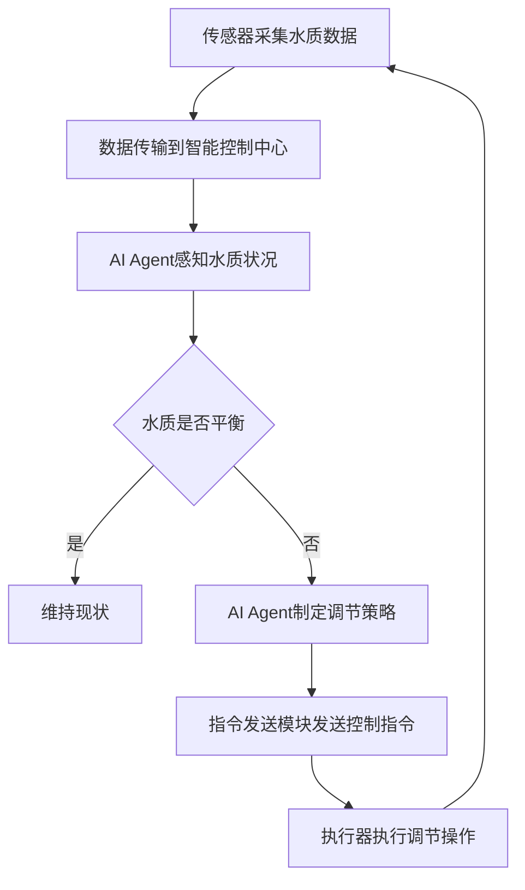

# 智能鱼缸：AI Agent的水质平衡维护

> 关键词：智能鱼缸、AI Agent、水质平衡维护、传感器技术、自动化控制

> 摘要：本文围绕智能鱼缸中AI Agent对水质平衡维护展开深入探讨。首先介绍了智能鱼缸及水质平衡维护的背景知识，包括目的、预期读者、文档结构和相关术语。接着阐述了核心概念与联系，如AI Agent和水质平衡的原理及架构。详细讲解了核心算法原理与具体操作步骤，并给出Python代码示例。同时，分析了相关数学模型和公式，结合实际例子进行说明。通过项目实战，展示了开发环境搭建、源代码实现及代码解读。还探讨了实际应用场景，推荐了学习资源、开发工具框架和相关论文著作。最后总结了未来发展趋势与挑战，提供常见问题解答和扩展阅读参考资料，旨在为智能鱼缸水质平衡维护的研究和实践提供全面的技术指导。

## 1. 背景介绍 
### 1.1 目的和范围
智能鱼缸水质平衡维护是现代水产养殖和家居水族箱管理中的重要课题。随着人们对水族观赏和水产养殖品质要求的提高，传统的人工水质监测和调节方式已难以满足需求。本文章的目的在于深入探讨如何利用AI Agent实现智能鱼缸的水质平衡维护，通过自动化和智能化的手段，实时监测水质参数，并根据监测结果进行精准调节，确保鱼缸内水质始终处于适宜水生生物生存的状态。

文章的范围涵盖了从AI Agent的核心概念、算法原理到实际项目开发和应用的全过程。具体包括水质参数监测传感器技术、AI Agent的决策机制、水质调节执行器的控制方法，以及相关的数学模型和代码实现。同时，还将探讨智能鱼缸水质平衡维护在不同场景下的应用，如家庭水族箱、商业水族馆和水产养殖场等。

### 1.2 预期读者
本文预期读者主要包括以下几类人群：
1. **水族爱好者**：希望通过智能技术提升鱼缸管理水平，为水生生物创造更健康的生存环境，享受更便捷、高效的水族养殖体验。
2. **软件开发人员**：对人工智能在物联网领域的应用感兴趣，希望了解如何开发智能鱼缸水质平衡维护系统，掌握相关的算法和编程技巧。
3. **水产养殖从业者**：寻求利用先进技术提高水产养殖效率和质量，降低养殖成本和风险，实现可持续发展的水产养殖模式。
4. **科研人员**：关注智能水族系统的研究和创新，希望深入了解AI Agent在水质平衡维护中的应用原理和方法，为相关领域的研究提供参考。

### 1.3 文档结构概述
本文将按照以下结构进行组织：
1. **核心概念与联系**：介绍智能鱼缸、AI Agent和水质平衡的核心概念，阐述它们之间的联系，并给出原理和架构的文本示意图及Mermaid流程图。
2. **核心算法原理 & 具体操作步骤**：详细讲解AI Agent用于水质平衡维护的核心算法原理，包括数据采集、数据分析和决策制定，并给出Python源代码示例。
3. **数学模型和公式 & 详细讲解 & 举例说明**：分析水质平衡维护中的数学模型和公式，如水质参数的动态变化模型、AI Agent的决策模型等，并结合实际例子进行详细讲解。
4. **项目实战：代码实际案例和详细解释说明**：通过一个具体的项目实战，展示如何搭建开发环境、实现源代码，并对代码进行详细解读和分析。
5. **实际应用场景**：探讨智能鱼缸水质平衡维护在不同场景下的应用，如家庭水族箱、商业水族馆和水产养殖场等。
6. **工具和资源推荐**：推荐相关的学习资源、开发工具框架和论文著作，帮助读者进一步深入学习和研究。
7. **总结：未来发展趋势与挑战**：总结智能鱼缸水质平衡维护的发展现状，分析未来的发展趋势和面临的挑战。
8. **附录：常见问题与解答**：提供常见问题的解答，帮助读者解决在学习和实践过程中遇到的问题。
9. **扩展阅读 & 参考资料**：列出相关的扩展阅读资料和参考文献，供读者进一步查阅和学习。

### 1.4 术语表
#### 1.4.1 核心术语定义
1. **智能鱼缸**：一种具备自动化监测和控制功能的鱼缸，通过传感器实时采集水质参数，并利用智能算法对数据进行分析和处理，实现对鱼缸水质的自动调节。
2. **AI Agent**：人工智能代理，是一种能够感知环境、进行决策并采取行动的智能实体。在智能鱼缸中，AI Agent通过接收水质传感器的数据，分析水质状况，并根据预设的规则或模型发出控制指令，调节水质参数。
3. **水质平衡**：指鱼缸内各种水质参数，如酸碱度（pH值）、溶解氧（DO）、氨氮（NH₃-N）、亚硝酸盐（NO₂⁻）等，保持在适宜水生生物生存的稳定范围内。
4. **传感器**：用于实时采集鱼缸水质参数的设备，常见的水质传感器包括pH传感器、溶解氧传感器、氨氮传感器、亚硝酸盐传感器等。
5. **执行器**：根据AI Agent的控制指令，对鱼缸水质进行调节的设备，如水泵、增氧机、加药装置等。

#### 1.4.2 相关概念解释
1. **物联网（IoT）**：通过各种信息传感器、射频识别技术、全球定位系统等技术和设备，实时采集任何需要监控、连接、互动的物体或过程，采集其声、光、热、电、力学、化学、生物、位置等各种需要的信息，通过各类可能的网络接入，实现物与物、物与人的泛在连接，实现对物品和过程的智能化感知、识别和管理。在智能鱼缸中，物联网技术用于连接传感器和执行器，实现数据的传输和设备的远程控制。
2. **机器学习**：一门多领域交叉学科，涉及概率论、统计学、逼近论、凸分析、算法复杂度理论等多门学科。它专门研究计算机怎样模拟或实现人类的学习行为，以获取新的知识或技能，重新组织已有的知识结构使之不断改善自身的性能。在智能鱼缸水质平衡维护中，机器学习算法可用于分析水质数据，建立水质预测模型和决策模型。
3. **数据分析**：指用适当的统计分析方法对收集来的大量数据进行分析，将它们加以汇总和理解并消化，以求最大化地开发数据的功能，发挥数据的作用。在智能鱼缸中，数据分析用于处理传感器采集的水质数据，提取有价值的信息，为AI Agent的决策提供依据。

#### 1.4.3 缩略词列表
1. **pH**：酸碱度，是衡量水体酸碱度的指标。
2. **DO**：溶解氧，指溶解在水中的分子态氧。
3. **NH₃-N**：氨氮，指水中以游离氨（NH₃）和铵离子（NH₄⁺）形式存在的氮。
4. **NO₂⁻**：亚硝酸盐，是水体中含氮有机物分解的中间产物。
5. **IoT**：物联网（Internet of Things）

## 2. 核心概念与联系 

### 核心概念原理
#### 智能鱼缸
智能鱼缸是传统鱼缸与现代信息技术相结合的产物。它的核心原理是通过安装在鱼缸内的各种传感器实时采集水质参数，如pH值、溶解氧、氨氮、亚硝酸盐等。这些传感器将采集到的模拟信号转换为数字信号，并通过物联网技术将数据传输到智能控制中心。智能控制中心根据预设的水质标准和算法对数据进行分析和处理，判断水质是否处于平衡状态。如果水质出现异常，智能控制中心将发出控制指令，通过执行器对水质进行调节，如启动水泵换水、开启增氧机增加溶解氧、投放药剂调节酸碱度等。

#### AI Agent
AI Agent是智能鱼缸水质平衡维护的核心决策单元。它具有感知、决策和行动三个基本功能。感知功能通过接收传感器采集的水质数据，了解鱼缸的水质状况；决策功能根据预设的规则或模型对水质数据进行分析和处理，制定相应的调节策略；行动功能通过向执行器发送控制指令，实现对水质的调节。AI Agent可以采用多种人工智能技术，如规则引擎、机器学习、深度学习等，以提高决策的准确性和智能化水平。

#### 水质平衡
水质平衡是指鱼缸内各种水质参数保持在适宜水生生物生存的稳定范围内。不同的水生生物对水质参数的要求不同，因此水质平衡的标准也会有所差异。一般来说，常见的水质参数包括pH值、溶解氧、氨氮、亚硝酸盐等。pH值通常应保持在6.5 - 8.5之间，溶解氧应保持在5 - 8mg/L以上，氨氮和亚硝酸盐的含量应尽可能低。当水质参数超出适宜范围时，会对水生生物的生长、繁殖和健康造成不利影响，甚至导致死亡。

### 架构的文本示意图
```plaintext
智能鱼缸水质平衡维护系统架构

|-------------------|
|   智能控制中心   |
|-------------------|
|  AI Agent         |
|  数据处理模块     |
|  决策制定模块     |
|  指令发送模块     |
|-------------------|
|  传感器网络       |
|  - pH传感器       |
|  - 溶解氧传感器   |
|  - 氨氮传感器     |
|  - 亚硝酸盐传感器 |
|-------------------|
|  执行器网络       |
|  - 水泵           |
|  - 增氧机         |
|  - 加药装置       |
|-------------------|
```

### Mermaid流程图


## 3. 核心算法原理 & 具体操作步骤 

### 核心算法原理
#### 数据采集与预处理
智能鱼缸中的传感器实时采集水质参数，如pH值、溶解氧、氨氮、亚硝酸盐等。由于传感器采集的数据可能存在噪声和误差，因此需要进行预处理。常见的预处理方法包括滤波、归一化等。滤波可以去除数据中的噪声，提高数据的准确性；归一化可以将不同范围的数据映射到相同的区间，便于后续的数据分析和处理。

#### 数据分析与决策制定
AI Agent接收到预处理后的水质数据后，需要对数据进行分析，判断水质是否处于平衡状态。可以采用多种方法进行数据分析，如规则引擎、机器学习、深度学习等。

- **规则引擎**：根据预设的规则对水质数据进行判断。例如，如果pH值低于6.5，则判定水质偏酸，需要添加碱性药剂进行调节；如果溶解氧低于5mg/L，则判定溶解氧不足，需要开启增氧机增加溶解氧。
- **机器学习**：通过训练机器学习模型，对水质数据进行分类和预测。例如，可以使用支持向量机（SVM）、决策树、神经网络等算法训练模型，根据水质数据判断水质是否平衡，并预测未来水质的变化趋势。
- **深度学习**：利用深度学习模型对水质数据进行更复杂的分析和处理。例如，可以使用卷积神经网络（CNN）、循环神经网络（RNN）等算法训练模型，学习水质数据的特征和规律，提高水质判断和预测的准确性。

#### 控制指令生成与执行
根据数据分析和决策制定的结果，AI Agent生成相应的控制指令，并通过指令发送模块将指令发送给执行器。执行器接收到控制指令后，执行相应的调节操作，如启动水泵换水、开启增氧机增加溶解氧、投放药剂调节酸碱度等。

### 具体操作步骤

#### 数据采集
使用Python编写代码，通过串口通信或网络通信从传感器读取水质数据。以下是一个简单的示例代码，假设使用串口通信读取pH传感器的数据：

```python
import serial

# 打开串口
ser = serial.Serial('COM3', 9600)

try:
    while True:
        # 读取串口数据
        data = ser.readline().decode('utf-8').strip()
        try:
            # 将数据转换为浮点数
            ph_value = float(data)
            print(f"当前pH值: {ph_value}")
        except ValueError:
            print("数据格式错误")
except KeyboardInterrupt:
    # 关闭串口
    ser.close()
```

#### 数据预处理
对采集到的水质数据进行滤波和归一化处理。以下是一个简单的示例代码，使用移动平均滤波和Min-Max归一化：

```python
import numpy as np

# 移动平均滤波函数
def moving_average(data, window_size):
    window = np.ones(int(window_size))/float(window_size)
    return np.convolve(data, window, 'same')

# Min-Max归一化函数
def min_max_normalization(data):
    min_val = np.min(data)
    max_val = np.max(data)
    return (data - min_val) / (max_val - min_val)

# 示例数据
ph_data = [7.0, 7.1, 7.2, 7.3, 7.4, 7.5, 7.6, 7.7, 7.8, 7.9]

# 移动平均滤波
filtered_data = moving_average(ph_data, 3)

# Min-Max归一化
normalized_data = min_max_normalization(filtered_data)

print("滤波后的数据:", filtered_data)
print("归一化后的数据:", normalized_data)
```

#### 数据分析与决策制定
使用规则引擎进行水质判断和决策制定。以下是一个简单的示例代码：

```python
# 预设的水质标准
ph_min = 6.5
ph_max = 8.5

# 当前pH值
ph_value = 7.2

# 判断水质是否平衡
if ph_value < ph_min:
    decision = "水质偏酸，需要添加碱性药剂"
elif ph_value > ph_max:
    decision = "水质偏碱，需要添加酸性药剂"
else:
    decision = "水质正常，无需调节"

print(decision)
```

#### 控制指令生成与执行
根据决策结果生成控制指令，并通过串口通信或网络通信将指令发送给执行器。以下是一个简单的示例代码，假设使用串口通信控制水泵：

```python
import serial

# 打开串口
ser = serial.Serial('COM4', 9600)

# 决策结果
decision = "水质偏酸，需要添加碱性药剂"

if "需要添加碱性药剂" in decision:
    # 生成控制指令
    command = "ADD_ALKALINE"
    # 发送控制指令
    ser.write(command.encode('utf-8'))
    print("已发送添加碱性药剂指令")
else:
    print("无需发送控制指令")

# 关闭串口
ser.close()
```

## 4. 数学模型和公式 & 详细讲解 & 举例说明 

### 水质参数的动态变化模型
水质参数的动态变化可以用微分方程来描述。以溶解氧为例，溶解氧的变化主要受到水体中氧气的溶解、水生生物的呼吸作用和有机物的分解等因素的影响。可以用以下微分方程来描述溶解氧的动态变化：

$$
\frac{dDO}{dt} = k_L a (DO_{sat} - DO) - R_{bio} - R_{org}
$$

其中，$\frac{dDO}{dt}$ 表示溶解氧随时间的变化率，$k_L a$ 是氧气的总传质系数，$DO_{sat}$ 是溶解氧的饱和浓度，$DO$ 是当前溶解氧浓度，$R_{bio}$ 是水生生物的呼吸速率，$R_{org}$ 是有机物的分解速率。

### 详细讲解
- $k_L a$：氧气的总传质系数，反映了水体中氧气的溶解能力。它与水体的温度、盐度、水流速度等因素有关。一般来说，温度越高、水流速度越快，$k_L a$ 值越大，氧气的溶解能力越强。
- $DO_{sat}$：溶解氧的饱和浓度，是指在一定温度、压力和盐度条件下，水体中能够溶解的最大氧气量。它可以通过经验公式计算得到，例如：

$$
DO_{sat} = 14.652 - 0.41022T + 0.007991T^2 - 0.000077774T^3
$$

其中，$T$ 是水体的温度（℃）。

- $R_{bio}$：水生生物的呼吸速率，与水生生物的种类、数量和活动强度有关。一般来说，水生生物的数量越多、活动强度越大，$R_{bio}$ 值越大。
- $R_{org}$：有机物的分解速率，与水体中有机物的含量、温度和微生物的活性有关。一般来说，有机物的含量越高、温度越高，$R_{org}$ 值越大。

### 举例说明
假设一个鱼缸的水体体积为100L，水温为25℃，溶解氧的初始浓度为6mg/L，氧气的总传质系数 $k_L a$ 为0.1h⁻¹，水生生物的呼吸速率 $R_{bio}$ 为0.2mg/L/h，有机物的分解速率 $R_{org}$ 为0.1mg/L/h。根据上述微分方程，可以计算出溶解氧随时间的变化情况。

首先，计算溶解氧的饱和浓度：

$$
DO_{sat} = 14.652 - 0.41022\times25 + 0.007991\times25^2 - 0.000077774\times25^3 \approx 8.3mg/L
$$

然后，使用欧拉法对微分方程进行数值求解。欧拉法的基本思想是将微分方程转化为差分方程，通过迭代计算得到数值解。具体公式如下：

$$
DO_{n+1} = DO_n + \Delta t \times \frac{dDO}{dt}
$$

其中，$DO_n$ 是第 $n$ 个时间步的溶解氧浓度，$\Delta t$ 是时间步长。

以下是使用Python实现的代码：

```python
import numpy as np
import matplotlib.pyplot as plt

# 参数设置
kLa = 0.1  # 氧气的总传质系数 (h^-1)
DO_sat = 8.3  # 溶解氧的饱和浓度 (mg/L)
R_bio = 0.2  # 水生生物的呼吸速率 (mg/L/h)
R_org = 0.1  # 有机物的分解速率 (mg/L/h)
DO_0 = 6  # 溶解氧的初始浓度 (mg/L)
dt = 0.1  # 时间步长 (h)
t_end = 24  # 模拟时间 (h)

# 初始化数组
t = np.arange(0, t_end, dt)
DO = np.zeros_like(t)
DO[0] = DO_0

# 欧拉法求解微分方程
for i in range(len(t) - 1):
    dDO_dt = kLa * (DO_sat - DO[i]) - R_bio - R_org
    DO[i+1] = DO[i] + dt * dDO_dt

# 绘制溶解氧随时间的变化曲线
plt.plot(t, DO)
plt.xlabel('时间 (h)')
plt.ylabel('溶解氧浓度 (mg/L)')
plt.title('溶解氧随时间的变化')
plt.grid(True)
plt.show()
```

运行上述代码，可以得到溶解氧随时间的变化曲线。通过分析曲线，可以了解溶解氧的变化趋势，为水质调节提供依据。

## 5. 项目实战：代码实际案例和详细解释说明 

### 5.1  开发环境搭建
#### 硬件环境
- **智能鱼缸**：选择合适的智能鱼缸，确保其具备安装传感器和执行器的接口。
- **传感器**：购买pH传感器、溶解氧传感器、氨氮传感器、亚硝酸盐传感器等，用于实时采集水质参数。
- **执行器**：准备水泵、增氧机、加药装置等执行器，用于调节水质。
- **开发板**：选择一款性能稳定、易于开发的开发板，如Arduino、Raspberry Pi等，作为智能控制中心。

#### 软件环境
- **操作系统**：根据开发板的类型选择合适的操作系统，如Arduino IDE支持Windows、Mac OS和Linux系统，Raspberry Pi可以安装Raspbian操作系统。
- **开发工具**：安装Python开发环境，建议使用Anaconda进行Python环境的管理和配置。同时，安装相关的开发库，如pyserial、numpy、matplotlib等。

### 5.2  源代码详细实现和代码解读
#### 整体架构
智能鱼缸水质平衡维护系统的整体架构包括数据采集模块、数据处理模块、决策制定模块和指令执行模块。以下是一个简单的Python代码示例，实现了智能鱼缸水质平衡维护的基本功能：

```python
import serial
import time
import numpy as np

# 串口配置
ser_sensor = serial.Serial('COM3', 9600)  # 传感器串口
ser_actuator = serial.Serial('COM4', 9600)  # 执行器串口

# 预设的水质标准
ph_min = 6.5
ph_max = 8.5
do_min = 5
do_max = 8

# 数据采集函数
def collect_data():
    try:
        # 读取pH传感器数据
        ph_data = ser_sensor.readline().decode('utf-8').strip()
        ph_value = float(ph_data)

        # 读取溶解氧传感器数据
        do_data = ser_sensor.readline().decode('utf-8').strip()
        do_value = float(do_data)

        return ph_value, do_value
    except Exception as e:
        print(f"数据采集错误: {e}")
        return None, None

# 数据处理函数
def process_data(ph_value, do_value):
    # 简单的数据预处理，这里可以添加更复杂的处理逻辑
    return ph_value, do_value

# 决策制定函数
def make_decision(ph_value, do_value):
    decision = []

    if ph_value < ph_min:
        decision.append("ADD_ALKALINE")
    elif ph_value > ph_max:
        decision.append("ADD_ACID")

    if do_value < do_min:
        decision.append("TURN_ON_AERATOR")
    elif do_value > do_max:
        decision.append("TURN_OFF_AERATOR")

    return decision

# 指令执行函数
def execute_commands(commands):
    for command in commands:
        ser_actuator.write(command.encode('utf-8'))
        print(f"已发送指令: {command}")
        time.sleep(1)  # 等待执行器响应

# 主循环
while True:
    # 数据采集
    ph_value, do_value = collect_data()

    if ph_value is not None and do_value is not None:
        # 数据处理
        ph_processed, do_processed = process_data(ph_value, do_value)

        # 决策制定
        commands = make_decision(ph_processed, do_processed)

        # 指令执行
        execute_commands(commands)

    time.sleep(5)  # 每隔5秒采集一次数据
```

#### 代码解读
1. **数据采集模块**：`collect_data` 函数通过串口通信从传感器读取pH值和溶解氧数据，并将数据转换为浮点数。如果数据采集过程中出现错误，将打印错误信息并返回 `None`。
2. **数据处理模块**：`process_data` 函数对采集到的水质数据进行简单的预处理，这里可以添加更复杂的处理逻辑，如滤波、归一化等。
3. **决策制定模块**：`make_decision` 函数根据预设的水质标准对处理后的水质数据进行判断，生成相应的控制指令。如果pH值低于下限，将添加碱性药剂；如果pH值高于上限，将添加酸性药剂；如果溶解氧低于下限，将开启增氧机；如果溶解氧高于上限，将关闭增氧机。
4. **指令执行模块**：`execute_commands` 函数将生成的控制指令通过串口通信发送给执行器，并打印已发送的指令信息。为了确保执行器有足够的时间响应指令，每次发送指令后将等待1秒。
5. **主循环**：在主循环中，每隔5秒调用一次数据采集、数据处理、决策制定和指令执行函数，实现对水质的实时监测和调节。

### 5.3  代码解读与分析
#### 优点
- **结构清晰**：代码采用模块化设计，将数据采集、数据处理、决策制定和指令执行分别封装成独立的函数，提高了代码的可读性和可维护性。
- **易于扩展**：可以根据需要添加更多的传感器和执行器，以及更复杂的数据处理和决策制定算法，实现对更多水质参数的监测和调节。
- **实时性强**：通过主循环每隔5秒采集一次数据并进行处理和决策，能够实时响应水质的变化，及时调节水质。

#### 缺点
- **简单规则决策**：决策制定模块采用简单的规则引擎，只能根据预设的水质标准进行判断，缺乏对水质变化的预测和自适应能力。
- **缺乏数据存储和分析**：代码没有对采集到的水质数据进行存储和分析，无法对水质的长期变化趋势进行监测和评估。
- **容错性较差**：代码对串口通信错误和传感器故障的处理比较简单，缺乏有效的容错机制，可能会导致系统不稳定。

#### 改进建议
- **引入机器学习算法**：可以使用机器学习算法对水质数据进行分析和预测，建立更智能的决策模型，提高系统的自适应能力。
- **添加数据存储和分析功能**：使用数据库对采集到的水质数据进行存储，并开发数据分析工具，对水质的长期变化趋势进行监测和评估。
- **增强容错机制**：在串口通信和传感器数据采集过程中添加错误处理和重试机制，提高系统的稳定性和可靠性。

## 6. 实际应用场景 
### 家庭水族箱
在家庭水族箱中，智能鱼缸水质平衡维护系统可以为水族爱好者提供便捷、高效的鱼缸管理方式。通过实时监测水质参数，如pH值、溶解氧、氨氮、亚硝酸盐等，系统可以及时发现水质异常并自动调节，确保水生生物的健康生长。同时，用户可以通过手机APP远程监控鱼缸水质和设备状态，随时随地了解鱼缸的情况。

### 商业水族馆
商业水族馆通常拥有大量的水生生物和复杂的水族生态系统，对水质的要求非常高。智能鱼缸水质平衡维护系统可以实现对水族馆内各个鱼缸的集中监测和管理，实时掌握水质状况，及时采取调节措施，保证水生生物的生存环境稳定。此外，系统还可以记录和分析水质数据，为水族馆的运营管理提供决策依据。

### 水产养殖场
在水产养殖场中，水质的好坏直接影响到水产养殖的产量和质量。智能鱼缸水质平衡维护系统可以实时监测养殖水体的水质参数，如溶解氧、氨氮、亚硝酸盐等，根据水质变化自动调节增氧机、水泵等设备的运行，保证养殖水体的水质稳定。同时，系统还可以通过数据分析预测水质变化趋势，提前采取预防措施，降低养殖风险。

## 7. 工具和资源推荐
### 7.1 学习资源推荐
#### 7.1.1 书籍推荐
- 《人工智能：一种现代的方法》：这是一本经典的人工智能教材，全面介绍了人工智能的基本概念、算法和应用，对于理解AI Agent的原理和实现具有重要的参考价值。
- 《Python数据分析实战》：本书详细介绍了Python在数据分析领域的应用，包括数据采集、数据处理、数据分析和数据可视化等方面的内容，对于开发智能鱼缸水质平衡维护系统的数据处理模块非常有帮助。
- 《物联网开发实战》：本书介绍了物联网的基本概念、技术和应用，以及如何使用Python和Arduino等工具开发物联网应用，对于开发智能鱼缸水质平衡维护系统的硬件和软件部分都有很大的帮助。

#### 7.1.2 在线课程
- Coursera上的“人工智能基础”课程：由斯坦福大学教授授课，系统介绍了人工智能的基本概念、算法和应用，是学习人工智能的入门课程。
- edX上的“Python for Data Science”课程：由微软公司提供，介绍了Python在数据分析领域的应用，包括数据处理、数据分析和数据可视化等方面的内容。
- Udemy上的“物联网开发实战”课程：由专业讲师授课，详细介绍了物联网的基本概念、技术和应用，以及如何使用Arduino和Raspberry Pi等硬件平台开发物联网应用。

#### 7.1.3 技术博客和网站
- Medium：一个知名的技术博客平台，上面有很多关于人工智能、物联网和数据分析等领域的文章和教程，可以帮助你了解最新的技术动态和发展趋势。
- Stack Overflow：一个全球知名的技术问答社区，上面有很多关于编程和技术问题的讨论和解答，可以帮助你解决在开发过程中遇到的问题。
- GitHub：一个全球最大的开源代码托管平台，上面有很多关于人工智能、物联网和数据分析等领域的开源项目，可以帮助你学习和借鉴他人的代码和经验。

### 7.2 开发工具框架推荐
#### 7.2.1 IDE和编辑器
- PyCharm：一款专业的Python集成开发环境，具有代码编辑、调试、测试等功能，支持多种Python框架和库，是开发Python项目的首选工具。
- Visual Studio Code：一款轻量级的代码编辑器，支持多种编程语言和插件扩展，具有强大的代码编辑和调试功能，适合开发物联网和人工智能项目。
- Arduino IDE：一款专门用于Arduino开发的集成开发环境，具有简单易用、功能强大的特点，支持多种硬件平台和传感器模块，是开发物联网硬件项目的常用工具。

#### 7.2.2 调试和性能分析工具
- Py-Spy：一款Python性能分析工具，可以实时监测Python程序的CPU使用率、内存使用率等性能指标，帮助你找出程序中的性能瓶颈。
- Wireshark：一款网络协议分析工具，可以捕获和分析网络数据包，帮助你调试和优化物联网设备之间的通信。
- Arduino Serial Monitor：Arduino IDE自带的串口监视器工具，可以实时查看Arduino与计算机之间的串口通信数据，帮助你调试和测试硬件设备。

#### 7.2.3 相关框架和库
- TensorFlow：一个开源的机器学习框架，由Google开发，提供了丰富的机器学习算法和工具，支持深度学习、强化学习等多种机器学习技术，适合开发智能鱼缸水质平衡维护系统的决策模型。
- PyTorch：一个开源的深度学习框架，由Facebook开发，具有简洁易用、高效灵活的特点，支持动态图和静态图两种编程方式，适合开发深度学习模型。
- Flask：一个轻量级的Python Web框架，具有简单易用、灵活可扩展的特点，适合开发智能鱼缸水质平衡维护系统的Web应用程序，实现远程监控和控制功能。

### 7.3 相关论文著作推荐
#### 7.3.1 经典论文
- "Artificial Intelligence: A Modern Approach"：这是人工智能领域的经典教材，系统介绍了人工智能的基本概念、算法和应用，对于理解AI Agent的原理和实现具有重要的参考价值。
- "A Survey of Artificial Intelligence Techniques for Water Quality Monitoring and Prediction"：该论文综述了人工智能技术在水质监测和预测领域的应用，包括机器学习、深度学习、模糊逻辑等方法，对于了解人工智能在水质平衡维护中的应用具有重要的参考价值。
- "Internet of Things (IoT) for Smart Aquaculture: A Review"：该论文综述了物联网技术在智能水产养殖中的应用，包括传感器技术、通信技术、数据分析技术等方面的内容，对于开发智能鱼缸水质平衡维护系统具有重要的参考价值。

#### 7.3.2 最新研究成果
- 关注IEEE、ACM等计算机领域顶级学术会议和期刊上发表的关于人工智能、物联网和水质监测等方面的最新研究成果，了解该领域的最新技术和发展趋势。
- 查阅相关的科研机构和高校的研究报告和论文，了解他们在智能鱼缸水质平衡维护方面的研究进展和成果。

#### 7.3.3 应用案例分析
- 参考一些实际的智能鱼缸水质平衡维护系统的应用案例，了解他们的系统架构、技术选型和实现方法，从中获取灵感和经验。
- 分析一些商业水族馆和水产养殖场的水质管理方案和实践经验，了解他们在水质监测和调节方面的成功案例和面临的挑战。

## 8. 总结：未来发展趋势与挑战
### 未来发展趋势
#### 智能化程度不断提高
随着人工智能技术的不断发展，智能鱼缸水质平衡维护系统的智能化程度将不断提高。未来的系统将能够自动学习和适应不同的水质环境和水生生物需求，实现更加精准和智能的水质调节。例如，系统可以根据水生生物的生长阶段、季节变化等因素自动调整水质参数的标准和调节策略。

#### 与物联网技术深度融合
物联网技术将为智能鱼缸水质平衡维护系统带来更强大的功能和更广泛的应用场景。未来的系统将能够实现与其他智能家居设备的互联互通，如与智能温控器、智能照明系统等联动，为水生生物创造更加舒适和适宜的生存环境。同时，系统还可以通过云平台实现远程监控和管理，用户可以随时随地通过手机APP或网页查看鱼缸水质和设备状态，并进行远程控制。

#### 数据驱动的决策支持
未来的智能鱼缸水质平衡维护系统将更加注重数据的收集、分析和利用。通过对大量水质数据的分析和挖掘，系统可以建立更加准确的水质预测模型和决策模型，为水质调节提供更加科学和合理的建议。例如，系统可以根据历史水质数据预测未来水质的变化趋势，提前采取预防措施，避免水质恶化。

#### 可持续发展理念的融入
随着人们对环境保护和可持续发展的重视，未来的智能鱼缸水质平衡维护系统将更加注重资源的节约和环境的保护。例如，系统可以采用节能型的设备和技术，减少能源消耗；可以通过水循环利用和污水处理技术，减少水资源的浪费和环境污染。

### 面临的挑战
#### 数据质量和安全问题
智能鱼缸水质平衡维护系统需要大量的水质数据来支持其决策和调节功能。然而，传感器采集的数据可能存在噪声、误差和缺失等问题，影响数据的质量和准确性。同时，数据的安全也是一个重要的问题，如何保护用户的隐私和数据安全，防止数据泄露和恶意攻击，是未来需要解决的挑战之一。

#### 复杂环境适应性问题
不同的鱼缸环境和水生生物对水质的要求不同，智能鱼缸水质平衡维护系统需要能够适应各种复杂的环境条件。例如，鱼缸的大小、形状、材质、水温、光照等因素都会影响水质的变化，系统需要能够根据不同的环境条件调整其监测和调节策略。此外，水生生物的种类、数量、生长阶段等因素也会对水质产生影响，系统需要能够识别和适应这些变化。

#### 成本和可靠性问题
智能鱼缸水质平衡维护系统的开发和应用需要投入一定的成本，包括硬件设备的采购、软件开发和维护等方面的费用。如何降低系统的成本，提高系统的性价比，是推广和应用该系统的关键。同时，系统的可靠性也是一个重要的问题，如何确保系统在长时间运行过程中稳定可靠，避免出现故障和误操作，是未来需要解决的挑战之一。

#### 标准和规范缺失问题
目前，智能鱼缸水质平衡维护系统还缺乏统一的标准和规范，不同厂家生产的设备和系统之间可能存在兼容性问题。这给用户的选择和使用带来了一定的困难，也不利于该行业的健康发展。因此，制定统一的标准和规范，促进设备和系统的互联互通和互操作性，是未来需要解决的挑战之一。

## 9. 附录：常见问题与解答
### 1. 智能鱼缸水质平衡维护系统需要哪些硬件设备？
智能鱼缸水质平衡维护系统通常需要以下硬件设备：
- 传感器：如pH传感器、溶解氧传感器、氨氮传感器、亚硝酸盐传感器等，用于实时采集水质参数。
- 执行器：如水泵、增氧机、加药装置等，用于调节水质。
- 开发板：如Arduino、Raspberry Pi等，作为智能控制中心，负责数据处理和决策制定。
- 通信模块：如Wi-Fi模块、蓝牙模块等，用于实现设备之间的通信和数据传输。

### 2. 如何安装和配置智能鱼缸水质平衡维护系统？
安装和配置智能鱼缸水质平衡维护系统的步骤如下：
1. 安装传感器和执行器：将传感器安装在鱼缸内合适的位置，确保能够准确采集水质参数；将执行器安装在鱼缸外部，连接好电源和控制线路。
2. 连接开发板和通信模块：将开发板与传感器和执行器连接起来，同时安装通信模块，确保开发板能够与其他设备进行通信。
3. 配置开发环境：根据开发板的类型选择合适的开发环境，如Arduino IDE、Raspberry Pi的Raspbian操作系统等，并安装相关的开发库和工具。
4. 编写和上传代码：使用Python等编程语言编写智能鱼缸水质平衡维护系统的代码，并将代码上传到开发板中。
5. 测试和调试：启动系统，测试传感器和执行器的工作情况，根据实际情况进行调试和优化。

### 3. 智能鱼缸水质平衡维护系统的精度和可靠性如何？
智能鱼缸水质平衡维护系统的精度和可靠性取决于多个因素，如传感器的精度、执行器的性能、算法的准确性等。一般来说，选择质量可靠、精度高的传感器和执行器，采用先进的算法和技术，可以提高系统的精度和可靠性。同时，定期对系统进行维护和校准，及时更换损坏的设备和部件，也可以保证系统的正常运行。

### 4. 智能鱼缸水质平衡维护系统可以远程控制吗？
可以。通过使用通信模块和云平台，智能鱼缸水质平衡维护系统可以实现远程控制。用户可以通过手机APP或网页随时随地查看鱼缸水质和设备状态，并进行远程控制。例如，用户可以远程开启或关闭水泵、增氧机等设备，调节水质参数。

### 5. 智能鱼缸水质平衡维护系统需要定期维护吗？
需要。智能鱼缸水质平衡维护系统需要定期进行维护，以确保系统的正常运行和水质的稳定。定期维护的内容包括：
- 清洁传感器：定期清洁传感器的探头，防止污垢和杂质影响传感器的精度。
- 校准传感器：定期对传感器进行校准，确保传感器采集的数据准确可靠。
- 检查执行器：定期检查执行器的工作情况，如水泵的流量、增氧机的氧气供应量等，及时更换损坏的部件。
- 更换药剂：如果系统使用了加药装置，需要定期更换药剂，确保药剂的有效性。
- 备份数据：定期备份系统采集的水质数据，以便后续分析和处理。

## 10. 扩展阅读 & 参考资料
### 扩展阅读
- 《智能水族箱系统的设计与实现》：详细介绍了智能水族箱系统的设计原理、硬件架构和软件实现，对于开发智能鱼缸水质平衡维护系统具有重要的参考价值。
- 《基于物联网的水产养殖水质监测与控制系统研究》：探讨了物联网技术在水产养殖水质监测与控制中的应用，包括传感器技术、通信技术、数据分析技术等方面的内容，对于了解智能鱼缸水质平衡维护系统的发展趋势和技术应用具有重要的参考价值。
- 《人工智能在环境监测与治理中的应用》：介绍了人工智能技术在环境监测与治理领域的应用，包括水质监测、大气污染监测、土壤污染监测等方面的内容，对于了解人工智能在水质平衡维护中的应用原理和方法具有重要的参考价值。

### 参考资料
1. 周志华. 机器学习. 清华大学出版社, 2016.
2. Stuart Russell, Peter Norvig. Artificial Intelligence: A Modern Approach. Pearson Education, 2020.
3. IEEE Transactions on Industrial Informatics.
4. ACM Transactions on Sensor Networks.
5. Journal of Aquaculture Research and Development.

作者：AI天才研究院/AI Genius Institute & 禅与计算机程序设计艺术 /Zen And The Art of Computer Programming