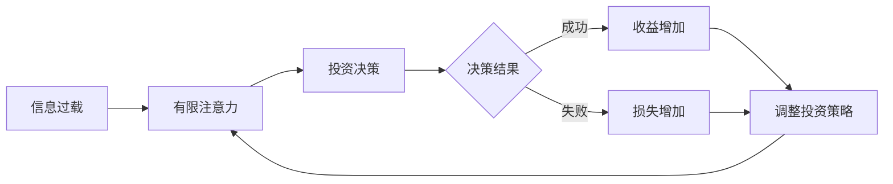

# 有限注意力：信息过载时代的投资决策挑战

> 关键词：有限注意力、信息过载、投资决策、挑战、应对策略

> 摘要：在当今信息爆炸的时代，投资者面临着海量信息的冲击，而人类的注意力是有限的。本文深入探讨了有限注意力在信息过载背景下给投资决策带来的挑战，分析了相关的核心概念、算法原理、数学模型等内容，并通过项目实战展示了实际应用。同时，介绍了该领域的实际应用场景、推荐了相关工具和资源，最后总结了未来发展趋势与挑战，旨在为投资者更好地应对这一复杂局面提供全面的理论和实践指导。

## 1. 背景介绍 
### 1.1 目的和范围
在信息时代，每天产生的数据量呈爆炸式增长，金融市场的信息更是纷繁复杂。投资者需要从海量信息中筛选出对投资决策有价值的内容。然而，人类的注意力资源是有限的，这就导致在信息过载的情况下，投资决策面临诸多挑战。本文的目的在于深入剖析这些挑战，探讨其背后的原理和机制，并提出相应的应对策略。范围涵盖了从信息过载的现状、有限注意力的理论基础，到投资决策过程中的各个环节，以及相关的技术和方法在实际中的应用。

### 1.2 预期读者
本文预期读者包括金融领域的投资者，如个人投资者、机构投资者等，他们希望在信息过载的环境中提高投资决策的准确性和效率；金融分析师和研究人员，他们对投资决策的理论和实践有深入研究的需求；计算机科学和人工智能领域的从业者，他们关注如何利用技术手段解决金融领域的信息处理问题；以及对金融和信息科学交叉领域感兴趣的学生和学者。

### 1.3 文档结构概述
本文首先介绍背景信息，包括目的、预期读者和文档结构概述等。接着阐述核心概念与联系，通过文本示意图和 Mermaid 流程图展示有限注意力、信息过载和投资决策之间的关系。然后讲解核心算法原理和具体操作步骤，用 Python 源代码详细阐述。再介绍数学模型和公式，并举例说明。之后通过项目实战展示代码实际案例和详细解释。随后探讨实际应用场景，推荐相关工具和资源。最后总结未来发展趋势与挑战，提供常见问题与解答和扩展阅读及参考资料。

### 1.4 术语表
#### 1.4.1 核心术语定义
- **有限注意力**：指人类在一定时间内能够集中关注和处理信息的能力是有限的，无法同时对所有信息进行深入分析和理解。
- **信息过载**：指信息的数量超过了个人或系统能够有效处理的能力，导致信息处理效率下降，决策质量受到影响。
- **投资决策**：指投资者在进行投资活动时，根据自身的投资目标、风险承受能力和市场情况等因素，选择合适的投资对象和投资时机的过程。

#### 1.4.2 相关概念解释
- **认知负荷**：指个体在进行信息处理时所需要的心理资源的总量。当信息过载时，认知负荷会增加，导致注意力分散和决策失误。
- **信息筛选**：指从海量信息中选择出对特定任务或决策有价值的信息的过程。在投资决策中，信息筛选是提高决策效率和质量的关键环节。
- **决策偏差**：指由于认知局限、心理因素等原因，导致投资者在决策过程中偏离理性决策的现象。常见的决策偏差包括过度自信、羊群效应等。

#### 1.4.3 缩略词列表
- **AI**：Artificial Intelligence，人工智能
- **ML**：Machine Learning，机器学习
- **NLP**：Natural Language Processing，自然语言处理

## 2. 核心概念与联系 

### 核心概念原理
有限注意力是人类认知系统的一个基本特征。由于大脑的处理能力有限，人们在面对大量信息时，只能选择性地关注其中一部分信息，而忽略其他信息。信息过载则是现代社会的一个普遍现象，随着信息技术的发展，信息的传播速度和数量都大幅增加，使得人们面临的信息压力越来越大。在投资决策中，投资者需要从海量的金融信息中获取有用的信息，以评估投资对象的价值和风险。然而，有限注意力使得投资者无法对所有信息进行全面的分析和评估，从而导致决策偏差和失误。

### 架构的文本示意图
```plaintext
               信息过载
                  |
                  v
有限注意力 <----> 投资决策
```
这个示意图表示信息过载是一个外部环境因素，它对有限注意力产生影响。而有限注意力又直接影响着投资决策的过程和结果。投资者在有限注意力的限制下，需要在信息过载的环境中做出合理的投资决策。

### Mermaid 流程图

这个流程图展示了信息过载、有限注意力和投资决策之间的动态关系。信息过载影响有限注意力，有限注意力影响投资决策，投资决策的结果又会反馈回来影响后续的投资策略和注意力分配。

## 3. 核心算法原理 & 具体操作步骤 

### 算法原理
在信息过载的环境下，为了帮助投资者更好地进行投资决策，我们可以采用信息筛选和注意力分配的算法。其中一个重要的算法是基于机器学习的文本分类算法，用于对海量的金融信息进行分类和筛选。例如，我们可以使用朴素贝叶斯算法对新闻文章进行分类，判断其是否与特定的投资对象相关。

### Python 源代码详细阐述
```python
import numpy as np
from sklearn.feature_extraction.text import CountVectorizer
from sklearn.naive_bayes import MultinomialNB
from sklearn.model_selection import train_test_split

# 示例数据
corpus = [
    "The stock price of Company A has increased significantly.",
    "Company B is planning a major expansion.",
    "The economic situation is improving, which may affect all stocks.",
    "This article is about a new technology startup, not related to stocks."
]
labels = [1, 1, 1, 0]  # 1 表示与投资相关，0 表示与投资无关

# 特征提取
vectorizer = CountVectorizer()
X = vectorizer.fit_transform(corpus)

# 划分训练集和测试集
X_train, X_test, y_train, y_test = train_test_split(X, labels, test_size=0.2, random_state=42)

# 训练模型
clf = MultinomialNB()
clf.fit(X_train, y_train)

# 预测
new_text = ["Company C is expected to release a new product next month."]
new_X = vectorizer.transform(new_text)
prediction = clf.predict(new_X)
print("预测结果:", prediction)
```
### 具体操作步骤
1. **数据收集**：收集大量的金融信息，包括新闻文章、公司公告、研究报告等。
2. **数据预处理**：对收集到的数据进行清洗和标注，将其分为与投资相关和与投资无关两类。
3. **特征提取**：使用文本特征提取方法，如词袋模型（CountVectorizer），将文本数据转换为数值特征。
4. **模型训练**：选择合适的机器学习模型，如朴素贝叶斯分类器（MultinomialNB），对数据进行训练。
5. **模型评估**：使用测试集对训练好的模型进行评估，计算准确率、召回率等指标。
6. **预测应用**：将训练好的模型应用于新的金融信息，筛选出与投资相关的信息。

## 4. 数学模型和公式 & 详细讲解 & 举例说明 

### 朴素贝叶斯算法的数学模型
朴素贝叶斯算法基于贝叶斯定理，其基本公式为：
$$P(c|x)=\frac{P(x|c)P(c)}{P(x)}$$
其中，$P(c|x)$ 表示在给定特征 $x$ 的情况下，类别 $c$ 的后验概率；$P(x|c)$ 表示在类别 $c$ 下特征 $x$ 的条件概率；$P(c)$ 表示类别 $c$ 的先验概率；$P(x)$ 表示特征 $x$ 的概率。

在文本分类中，我们通常假设特征之间是相互独立的（朴素假设），因此可以将 $P(x|c)$ 分解为各个特征的条件概率的乘积：
$$P(x|c)=\prod_{i=1}^{n}P(x_i|c)$$
其中，$x_i$ 表示第 $i$ 个特征。

### 详细讲解
在朴素贝叶斯分类器中，我们需要计算每个类别的先验概率 $P(c)$ 和每个特征在每个类别下的条件概率 $P(x_i|c)$。先验概率可以通过训练数据中每个类别的样本数占总样本数的比例来估计。条件概率可以通过在每个类别下每个特征的出现频率来估计。

### 举例说明
假设我们有一个简单的文本分类问题，要判断一个句子是关于体育还是科技。训练数据如下：
| 句子 | 类别 |
| ---- | ---- |
| "The basketball game was exciting." | 体育 |
| "The new smartphone has great features." | 科技 |
| "The football match ended in a draw." | 体育 |
| "The latest computer technology is amazing." | 科技 |

我们可以计算出先验概率：
$P(体育)=\frac{2}{4}=0.5$
$P(科技)=\frac{2}{4}=0.5$

对于特征 “basketball”，在 “体育” 类别下的条件概率为：
$P(basketball|体育)=\frac{1}{2}=0.5$

对于一个新的句子 “The basketball player scored a lot of points.”，我们可以根据朴素贝叶斯算法计算其属于 “体育” 和 “科技” 类别的后验概率，然后选择后验概率最大的类别作为预测结果。

## 5. 项目实战：代码实际案例和详细解释说明 

### 5.1  开发环境搭建
- **操作系统**：可以选择 Windows、Linux 或 macOS 等常见操作系统。
- **Python 版本**：建议使用 Python 3.6 及以上版本。
- **开发工具**：可以使用 PyCharm、Jupyter Notebook 等集成开发环境。
- **相关库安装**：在命令行中使用以下命令安装所需的库：
```sh
pip install numpy scikit-learn
```

### 5.2  源代码详细实现和代码解读
```python
import numpy as np
from sklearn.feature_extraction.text import CountVectorizer
from sklearn.naive_bayes import MultinomialNB
from sklearn.model_selection import train_test_split

# 模拟收集到的金融新闻数据
news_corpus = [
    "The earnings report of Company X shows a significant profit increase.",
    "Company Y is facing a lawsuit, which may impact its stock price.",
    "The central bank is expected to raise interest rates soon.",
    "This is a general news article not related to finance."
]
# 对应的标签，1 表示与投资相关，0 表示与投资无关
news_labels = [1, 1, 1, 0]

# 特征提取：使用 CountVectorizer 将文本转换为词频矩阵
vectorizer = CountVectorizer()
X = vectorizer.fit_transform(news_corpus)

# 划分训练集和测试集
X_train, X_test, y_train, y_test = train_test_split(X, news_labels, test_size=0.2, random_state=42)

# 训练朴素贝叶斯分类器
clf = MultinomialNB()
clf.fit(X_train, y_train)

# 评估模型
accuracy = clf.score(X_test, y_test)
print("模型准确率:", accuracy)

# 对新的新闻进行预测
new_news = ["Company Z is planning a major acquisition."]
new_X = vectorizer.transform(new_news)
prediction = clf.predict(new_X)
print("新新闻的预测结果:", prediction)
```
### 代码解读
1. **数据准备**：定义了一个包含金融新闻的语料库 `news_corpus` 和对应的标签 `news_labels`。
2. **特征提取**：使用 `CountVectorizer` 将文本数据转换为词频矩阵 `X`，以便机器学习模型能够处理。
3. **数据划分**：使用 `train_test_split` 函数将数据划分为训练集和测试集，其中测试集占总数据的 20%。
4. **模型训练**：使用 `MultinomialNB` 类创建一个朴素贝叶斯分类器，并使用训练集进行训练。
5. **模型评估**：使用 `score` 方法计算模型在测试集上的准确率。
6. **预测应用**：对新的新闻进行特征提取和预测，输出预测结果。

### 5.3  代码解读与分析
- **优点**：朴素贝叶斯算法简单高效，训练速度快，对于文本分类问题有较好的效果。`CountVectorizer` 可以方便地将文本数据转换为数值特征，便于机器学习模型处理。
- **缺点**：朴素贝叶斯算法的朴素假设在实际应用中可能不成立，导致模型的性能受到影响。词袋模型忽略了文本的语义信息，可能会丢失一些重要的特征。
- **改进方向**：可以考虑使用更复杂的文本特征提取方法，如词嵌入（Word Embedding），来捕捉文本的语义信息。也可以尝试使用其他机器学习模型，如支持向量机（SVM）、深度学习模型等，来提高模型的性能。

## 6. 实际应用场景 
### 个人投资者
个人投资者在进行投资决策时，通常会面临大量的金融信息，如新闻报道、研究报告、社交媒体评论等。有限注意力使得他们无法对所有信息进行全面分析，容易受到信息过载的影响。通过使用信息筛选和注意力分配的技术，个人投资者可以快速筛选出与自己投资目标相关的信息，提高决策效率和准确性。例如，个人投资者可以使用金融信息分类系统，将新闻文章分为股票、基金、债券等不同类别，然后重点关注与自己投资组合相关的类别。

### 机构投资者
机构投资者通常管理着大量的资金，投资决策的复杂性和风险更高。他们需要处理海量的金融数据和信息，包括宏观经济数据、公司财务报表、行业研究报告等。有限注意力和信息过载给机构投资者带来了巨大的挑战。为了应对这些挑战，机构投资者可以使用数据分析和人工智能技术，对信息进行深度挖掘和分析。例如，机构投资者可以使用自然语言处理技术对新闻文章进行情感分析，了解市场情绪对投资决策的影响。

### 金融分析师
金融分析师的主要工作是对金融市场和投资对象进行研究和分析，为投资者提供投资建议。在信息过载的环境下，金融分析师需要快速准确地获取和分析信息，以提高研究报告的质量和价值。他们可以使用信息筛选和知识图谱技术，构建金融信息知识体系，帮助自己更好地理解和分析信息。例如，金融分析师可以使用知识图谱技术将公司、行业、产品等信息关联起来，形成一个完整的知识网络，从而更全面地了解投资对象的情况。

## 7. 工具和资源推荐
### 7.1 学习资源推荐
#### 7.1.1 书籍推荐
- 《机器学习》（周志华）：介绍了机器学习的基本概念、算法和应用，是学习机器学习的经典教材。
- 《Python 数据分析实战》（Sebastian Raschka）：详细介绍了使用 Python 进行数据分析的方法和技巧，包括数据处理、可视化、机器学习等方面。
- 《金融市场与金融机构》（弗雷德里克·S·米什金）：全面介绍了金融市场和金融机构的基本原理和运作机制，是学习金融知识的重要书籍。

#### 7.1.2 在线课程
- Coursera 上的 “机器学习” 课程（Andrew Ng 教授）：由斯坦福大学的 Andrew Ng 教授主讲，是全球最受欢迎的机器学习课程之一。
- edX 上的 “数据科学与机器学习微硕士” 课程：提供了系统的数据分析和机器学习课程体系，适合有一定基础的学习者。
- 中国大学 MOOC 上的 “金融市场学” 课程：由国内知名高校的教授主讲，介绍了金融市场的基本理论和实践。

#### 7.1.3 技术博客和网站
- Medium：一个开放的技术博客平台，上面有很多关于机器学习、数据分析、金融科技等领域的优质文章。
- Towards Data Science：专注于数据科学和机器学习领域的博客网站，提供了很多实用的技术教程和案例分析。
- 雪球网：一个专注于金融投资的社区网站，提供了丰富的金融信息和投资分析工具。

### 7.2 开发工具框架推荐
#### 7.2.1 IDE和编辑器
- PyCharm：一款专业的 Python 集成开发环境，提供了丰富的代码编辑、调试、版本控制等功能。
- Jupyter Notebook：一个交互式的笔记本环境，适合进行数据分析和机器学习的实验和演示。
- Visual Studio Code：一款轻量级的代码编辑器，支持多种编程语言，并且有丰富的插件扩展。

#### 7.2.2 调试和性能分析工具
- PDB：Python 自带的调试工具，可以帮助开发者定位代码中的问题。
- Py-Spy：一个用于分析 Python 程序性能的工具，可以实时查看程序的运行状态和性能瓶颈。
- TensorBoard：一个用于可视化深度学习模型训练过程和结果的工具，帮助开发者更好地理解和优化模型。

#### 7.2.3 相关框架和库
- Scikit-learn：一个常用的机器学习库，提供了丰富的机器学习算法和工具，如分类、回归、聚类等。
- NLTK：一个自然语言处理库，提供了多种文本处理和分析的工具，如分词、词性标注