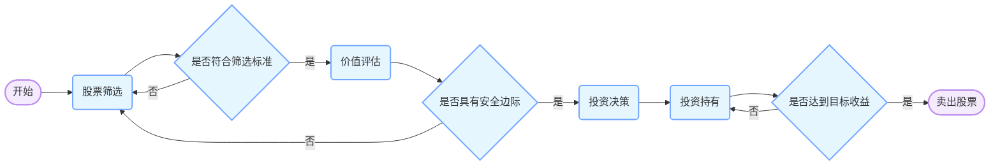

# 本杰明·格雷厄姆的“烟蒂股”策略现代解读

> 关键词：烟蒂股策略、本杰明·格雷厄姆、价值投资、现代金融市场、投资分析

> 摘要：本文深入探讨了本杰明·格雷厄姆的“烟蒂股”策略在现代金融市场中的应用与解读。首先介绍了该策略的背景，包括其目的、适用读者、文档结构和相关术语。接着阐述了“烟蒂股”的核心概念、联系及架构，详细讲解了核心算法原理和操作步骤，并结合数学模型和公式进行分析。通过项目实战案例，展示了该策略在实际中的应用和代码实现。同时，探讨了“烟蒂股”策略的实际应用场景，推荐了相关的学习资源、开发工具和论文著作。最后总结了该策略的未来发展趋势与挑战，解答了常见问题，并提供了扩展阅读和参考资料，旨在帮助投资者更好地理解和运用“烟蒂股”策略。

## 1. 背景介绍 
### 1.1 目的和范围
本杰明·格雷厄姆作为价值投资的鼻祖，其“烟蒂股”策略在投资界具有深远的影响。本文的目的在于对这一经典策略进行现代解读，分析其在当今复杂多变的金融市场中的适用性和局限性。通过深入研究“烟蒂股”策略的核心原理、算法和实际应用，为投资者提供更全面、更深入的投资思路和方法。范围涵盖了“烟蒂股”策略的理论基础、数学模型、实际案例以及在不同市场环境下的表现。

### 1.2 预期读者
本文预期读者主要包括专业投资者、金融分析师、投资学学生以及对价值投资感兴趣的个人。对于专业投资者和金融分析师，本文可以为他们提供新的投资视角和分析方法；对于投资学学生，有助于他们深入理解价值投资理论和实践；对于普通投资者，能够帮助他们掌握一种有效的投资策略，提高投资决策的科学性和准确性。

### 1.3 文档结构概述
本文将按照以下结构进行阐述：首先介绍“烟蒂股”策略的背景和相关术语，为后续的讨论奠定基础；接着深入分析“烟蒂股”的核心概念、联系及架构，帮助读者建立起对该策略的整体认识；然后详细讲解核心算法原理和具体操作步骤，并结合数学模型和公式进行分析；通过项目实战案例，展示该策略在实际中的应用和代码实现；探讨“烟蒂股”策略的实际应用场景；推荐相关的学习资源、开发工具和论文著作；最后总结该策略的未来发展趋势与挑战，解答常见问题，并提供扩展阅读和参考资料。

### 1.4 术语表
#### 1.4.1 核心术语定义
- **烟蒂股（Cigar - butt stocks）**：指那些价格极其低廉，看上去就像被人丢弃的烟蒂，但可能还残留着一点可吸价值的股票。通常这类股票的公司经营状况不佳，但股价已经充分反映了其负面因素，具有一定的安全边际。
- **价值投资（Value investing）**：一种投资策略，强调通过分析公司的内在价值，寻找被市场低估的股票进行投资，以获取长期的投资回报。
- **安全边际（Margin of safety）**：指股票的内在价值与市场价格之间的差额。安全边际越大，投资的风险越低。
- **净流动资产价值（Net current asset value，NCAV）**：是衡量公司内在价值的一个重要指标，计算公式为：净流动资产价值 = 流动资产 - 总负债。

#### 1.4.2 相关概念解释
- **内在价值（Intrinsic value）**：公司的内在价值是指其未来现金流的现值。它是一个理论上的价值，不受市场短期波动的影响，是价值投资者判断股票是否被低估的重要依据。
- **市场效率（Market efficiency）**：市场效率是指市场价格反映所有可用信息的程度。在有效市场中，股票价格能够迅速反映所有公开信息，因此很难找到被低估的股票。而“烟蒂股”策略的前提是市场并非完全有效，存在一些被市场忽视或错误定价的股票。

#### 1.4.3 缩略词列表
- **NCAV**：净流动资产价值（Net current asset value）
- **P/E**：市盈率（Price - to - Earnings ratio）
- **P/B**：市净率（Price - to - Book ratio）

## 2. 核心概念与联系 

### 核心概念原理
“烟蒂股”策略的核心原理基于价值投资的理念，即寻找被市场低估的股票。本杰明·格雷厄姆认为，市场有时会过度反应公司的负面消息，导致一些公司的股价远远低于其内在价值。这些公司就像被丢弃的烟蒂，虽然经营状况不佳，但仍然具有一定的价值。投资者可以通过购买这些低价股票，等待市场重新发现其价值，从而获得投资回报。

### 架构的文本示意图
```plaintext
烟蒂股策略
|
|--核心原理
|   |--价值投资理念
|   |--寻找被低估股票
|
|--筛选标准
|   |--低市盈率
|   |--低市净率
|   |--高净流动资产价值
|
|--投资流程
|   |--股票筛选
|   |--价值评估
|   |--投资决策
|
|--风险控制
|   |--分散投资
|   |--安全边际
```

### Mermaid 流程图


## 3. 核心算法原理 & 具体操作步骤 

### 核心算法原理
“烟蒂股”策略的核心算法主要围绕股票的估值展开，常用的估值指标包括市盈率（P/E）、市净率（P/B）和净流动资产价值（NCAV）。

#### 市盈率（P/E）
市盈率是指股票价格与每股收益的比率，计算公式为：
```python
def calculate_pe(stock_price, earnings_per_share):
    if earnings_per_share == 0:
        return None
    return stock_price / earnings_per_share
```
市盈率反映了市场对公司盈利的预期。一般来说，低市盈率的股票可能被市场低估。

#### 市净率（P/B）
市净率是指股票价格与每股净资产的比率，计算公式为：
```python
def calculate_pb(stock_price, book_value_per_share):
    if book_value_per_share == 0:
        return None
    return stock_price / book_value_per_share
```
市净率反映了市场对公司净资产的估值。低市净率的股票可能具有较高的安全边际。

#### 净流动资产价值（NCAV）
净流动资产价值是指公司的流动资产减去总负债后的价值，计算公式为：
```python
def calculate_ncav(current_assets, total_liabilities):
    return current_assets - total_liabilities
```
如果股票价格低于净流动资产价值的一定比例（如 66%），则该股票可能被视为“烟蒂股”。

### 具体操作步骤
1. **数据收集**：收集股票的相关数据，包括股票价格、每股收益、每股净资产、流动资产、总负债等。
```python
# 示例数据
stock_price = 10
earnings_per_share = 1
book_value_per_share = 5
current_assets = 1000
total_liabilities = 500
```
2. **计算估值指标**：根据上述公式计算市盈率、市净率和净流动资产价值。
```python
pe = calculate_pe(stock_price, earnings_per_share)
pb = calculate_pb(stock_price, book_value_per_share)
ncav = calculate_ncav(current_assets, total_liabilities)
```
3. **筛选股票**：根据估值指标筛选出符合条件的股票。例如，选择市盈率低于行业平均水平、市净率低于 1 且股票价格低于净流动资产价值 66% 的股票。
```python
industry_average_pe = 15
if pe is not None and pe < industry_average_pe and pb < 1 and stock_price < 0.66 * ncav:
    print("该股票符合烟蒂股筛选条件")
else:
    print("该股票不符合烟蒂股筛选条件")
```
4. **价值评估**：对筛选出的股票进行更深入的价值评估，考虑公司的财务状况、行业前景、竞争优势等因素。
5. **投资决策**：根据价值评估结果，做出投资决策。如果认为股票具有足够的安全边际和投资价值，则可以考虑买入。

## 4. 数学模型和公式 & 详细讲解 & 举例说明 

### 数学模型和公式
#### 市盈率（P/E）
$P/E=\frac{P}{EPS}$
其中，$P$ 表示股票价格，$EPS$ 表示每股收益。

#### 市净率（P/B）
$P/B=\frac{P}{BVPS}$
其中，$P$ 表示股票价格，$BVPS$ 表示每股净资产。

#### 净流动资产价值（NCAV）
$NCAV = CA - TL$
其中，$CA$ 表示流动资产，$TL$ 表示总负债。

### 详细讲解
- **市盈率（P/E）**：市盈率是衡量股票估值的常用指标之一。较低的市盈率可能意味着股票被低估，但也可能反映了公司的盈利前景不佳。因此，在使用市盈率进行估值时，需要结合公司的行业特点、盈利增长情况等因素进行综合分析。
- **市净率（P/B）**：市净率反映了市场对公司净资产的估值。一般来说，市净率低于 1 的股票可能被视为低估。但对于一些轻资产行业的公司，市净率可能不具有代表性，需要结合其他指标进行分析。
- **净流动资产价值（NCAV）**：净流动资产价值是一种较为保守的估值方法，它只考虑了公司的流动资产和负债，不考虑固定资产和无形资产。如果股票价格低于净流动资产价值的一定比例，说明公司的股价已经充分反映了其负面因素，具有一定的安全边际。

### 举例说明
假设某公司的股票价格为 $10$ 元，每股收益为 $1$ 元，每股净资产为 $5$ 元，流动资产为 $1000$ 万元，总负债为 $500$ 万元。

- **计算市盈率**：
$P/E=\frac{10}{1}=10$
该公司的市盈率为 $10$，如果行业平均市盈率为 $15$，则该公司的市盈率低于行业平均水平，可能被低估。

- **计算市净率**：
$P/B=\frac{10}{5}=2$
该公司的市净率为 $2$，如果市净率的合理范围在 $1 - 3$ 之间，则该公司的市净率处于合理范围内。

- **计算净流动资产价值**：
$NCAV = 1000 - 500 = 500$（万元）
假设该公司的总股本为 $100$ 万股，则每股净流动资产价值为 $5$ 元。如果股票价格低于每股净流动资产价值的 $66\%$，即低于 $3.3$ 元，则该股票可能被视为“烟蒂股”。

## 5. 项目实战：代码实际案例和详细解释说明 

### 5.1  开发环境搭建
为了实现“烟蒂股”策略的代码，我们需要搭建以下开发环境：
- **编程语言**：Python
- **开发工具**：Jupyter Notebook 或 PyCharm
- **相关库**：pandas、numpy、yfinance

可以使用以下命令安装所需的库：
```sh
pip install pandas numpy yfinance
```

### 5.2  源代码详细实现和代码解读
```python
import yfinance as yf
import pandas as pd

# 定义股票列表
tickers = ['AAPL', 'MSFT', 'GOOG', 'TSLA']

# 初始化空列表用于存储筛选结果
selected_stocks = []

# 遍历股票列表
for ticker in tickers:
    try:
        # 获取股票数据
        stock = yf.Ticker(ticker)
        info = stock.info
        
        # 获取股票价格
        stock_price = info.get('regularMarketPrice')
        
        # 获取每股收益
        earnings_per_share = info.get('trailingEps')
        
        # 获取每股净资产
        book_value_per_share = info.get('bookValue')
        
        # 获取流动资产和总负债
        balance_sheet = stock.balance_sheet
        current_assets = balance_sheet.loc['Total Current Assets'].iloc[0]
        total_liabilities = balance_sheet.loc['Total Liab'].iloc[0]
        
        # 计算市盈率
        pe = calculate_pe(stock_price, earnings_per_share)
        
        # 计算市净率
        pb = calculate_pb(stock_price, book_value_per_share)
        
        # 计算净流动资产价值
        ncav = calculate_ncav(current_assets, total_liabilities)
        
        # 假设行业平均市盈率为 20
        industry_average_pe = 20
        
        # 筛选条件
        if pe is not None and pe < industry_average_pe and pb < 1 and stock_price < 0.66 * ncav:
            selected_stocks.append(ticker)
            print(f"{ticker} 符合烟蒂股筛选条件")
        else:
            print(f"{ticker} 不符合烟蒂股筛选条件")
    
    except Exception as e:
        print(f"获取 {ticker} 数据时出现错误: {e}")

print("筛选出的烟蒂股列表:", selected_stocks)
```
### 代码解读与分析
- **导入库**：导入 `yfinance` 库用于获取股票数据，导入 `pandas` 库用于数据处理。
- **定义股票列表**：定义需要筛选的股票列表。
- **遍历股票列表**：使用 `for` 循环遍历股票列表，对每只股票进行筛选。
- **获取股票数据**：使用 `yfinance` 库的 `Ticker` 类获取股票的基本信息和资产负债表数据。
- **计算估值指标**：根据前面定义的函数计算市盈率、市净率和净流动资产价值。
- **筛选条件判断**：根据筛选条件判断股票是否符合“烟蒂股”的标准，如果符合则将其添加到筛选结果列表中。
- **异常处理**：使用 `try - except` 语句捕获可能出现的异常，确保程序的稳定性。

## 6. 实际应用场景 
### 熊市环境
在熊市中，市场整体下跌，许多股票的价格被低估。“烟蒂股”策略可以帮助投资者在熊市中寻找那些被过度抛售的股票，以较低的价格买入，等待市场反弹。例如，在 2008 年金融危机期间，许多金融股的价格大幅下跌，一些符合“烟蒂股”标准的金融股在随后的市场反弹中表现出色。

### 小型股和冷门股市场
小型股和冷门股往往容易被市场忽视，其价格可能无法充分反映公司的内在价值。“烟蒂股”策略可以帮助投资者挖掘这些被忽视的股票，发现潜在的投资机会。例如，一些小型制造业公司或区域性企业，可能由于规模较小、知名度不高而被市场低估。

### 价值投资组合构建
“烟蒂股”策略可以作为价值投资组合的一部分，与其他投资策略相结合，实现投资组合的多元化。通过投资不同行业、不同规模的“烟蒂股”，可以降低投资组合的风险，提高投资回报的稳定性。

## 7. 工具和资源推荐
### 7.1 学习资源推荐
#### 7.1.1 书籍推荐
- 《聪明的投资者》（The Intelligent Investor）：本杰明·格雷厄姆的经典著作，详细阐述了价值投资的理念和方法，是学习“烟蒂股”策略的必读之书。
- 《证券分析》（Security Analysis）：同样是本杰明·格雷厄姆的著作，对证券分析的基本原理和方法进行了系统的介绍，为投资者提供了深入研究公司基本面的工具。
- 《怎样选择成长股》（Common Stocks and Uncommon Profits）：菲利普·费雪的著作，强调了寻找具有成长潜力的公司的重要性，与“烟蒂股”策略相互补充。

#### 7.1.2 在线课程
- Coursera 上的“投资学原理”（Principles of Investing）：该课程由知名教授授课，涵盖了投资学的基本原理和方法，包括价值投资策略的讲解。
- edX 上的“金融市场”（Financial Markets）：耶鲁大学教授罗伯特·席勒主讲的课程，对金融市场的运行机制和投资策略进行了深入的分析。

#### 7.1.3 技术博客和网站
- Seeking Alpha：提供大量的股票分析和投资建议，有许多关于价值投资和“烟蒂股”策略的文章。
- GuruFocus：专注于价值投资领域，提供公司基本面分析、估值模型等工具，以及价值投资者的观点和研究报告。

### 7.2 开发工具框架推荐
#### 7.2.1 IDE和编辑器
- Jupyter Notebook：适合数据探索和代码调试，支持 Python 等多种编程语言，方便进行股票数据的分析和可视化。
- PyCharm：专业的 Python 开发环境，具有强大的代码编辑、调试和项目管理功能，适合开发复杂的投资分析程序。

#### 7.2.2 调试和性能分析工具
- pdb：Python 内置的调试工具，可以帮助开发者定位代码中的错误和问题。
- cProfile：Python 标准库中的性能分析工具，可以分析代码的运行时间和函数调用情况，帮助优化代码性能。

#### 7.2.3 相关框架和库
- yfinance：用于获取股票数据的 Python 库，提供了简单易用的接口，可以方便地获取股票的基本信息、历史数据等。
- pandas：强大的数据处理和分析库，支持数据的读取、清洗、转换和统计分析，是进行股票数据分析的常用工具。

### 7.3 相关论文著作推荐
#### 7.3.1 经典论文
- “The Superinvestors of Graham - and - Doddsville”：沃伦·巴菲特撰写的论文，介绍了本杰明·格雷厄姆的价值投资理念和其弟子们的成功投资案例，证明了“烟蒂股”策略的有效性。
- “Value versus Growth: The International Evidence”：由 Eugene F. Fama 和 Kenneth R. French 撰写的论文，对价值投资和成长投资的表现进行了国际比较研究，为“烟蒂股”策略提供了理论支持。

#### 7.3.2 最新研究成果
- 近年来，许多学者对“烟蒂股”策略进行了改进和拓展，提出了一些新的估值指标和筛选方法。例如，一些研究结合了机器学习算法，提高了“烟蒂股”筛选的准确性。
- 关于“烟蒂股”策略在不同市场环境下的表现和适应性的研究也在不断深入，为投资者提供了更全面的参考。

#### 7.3.3 应用案例分析
- 一些投资机构和个人投资者分享了他们运用“烟蒂股”策略的实际案例和经验教训。通过分析这些案例，可以了解“烟蒂股”策略在实际应用中的操作方法和风险控制措施。

## 8. 总结：未来发展趋势与挑战
### 未来发展趋势
- **与科技融合**：随着人工智能、机器学习等技术的发展，“烟蒂股”策略将与科技深度融合。通过运用大数据分析和机器学习算法，可以更准确地筛选出具有投资价值的“烟蒂股”，提高投资决策的效率和准确性。
- **国际化拓展**：“烟蒂股”策略将不再局限于国内市场，而是向国际市场拓展。投资者可以在全球范围内寻找被低估的股票，实现投资组合的国际化多元化。
- **与其他策略结合**：未来，“烟蒂股”策略将与其他投资策略，如成长投资、股息投资等相结合，形成更加综合的投资策略。通过不同策略的互补，可以降低投资风险，提高投资回报。

### 挑战
- **市场有效性提高**：随着金融市场的发展和信息传播的加速，市场的有效性不断提高。这意味着寻找被低估的“烟蒂股”将变得更加困难，投资者需要具备更强的分析能力和洞察力。
- **公司基本面变化**：“烟蒂股”通常是那些经营状况不佳的公司，其基本面可能随时发生变化。如果公司的经营状况持续恶化，可能导致股票价格进一步下跌，给投资者带来损失。
- **宏观经济环境不确定性**：宏观经济环境的不确定性，如经济衰退、利率波动、汇率变化等，将对“烟蒂股”策略的实施产生影响。投资者需要密切关注宏观经济环境的变化，及时调整投资策略。

## 9. 附录：常见问题与解答
### 问题 1：“烟蒂股”策略是否适用于所有投资者？
答：“烟蒂股”策略并不适用于所有投资者。该策略需要投资者具备一定的财务分析能力和耐心，能够深入研究公司的基本面。同时，“烟蒂股”通常是一些经营状况不佳的公司，投资风险相对较高。因此，该策略更适合那些风险承受能力较强、追求长期投资回报的投资者。

### 问题 2：如何判断“烟蒂股”的投资价值？
答：判断“烟蒂股”的投资价值需要综合考虑多个因素。除了市盈率、市净率和净流动资产价值等估值指标外，还需要考虑公司的财务状况、行业前景、竞争优势等因素。同时，需要关注公司的管理层能力和治理结构，以及是否存在潜在的风险因素。

### 问题 3：“烟蒂股”策略的投资周期一般是多长？
答：“烟蒂股”策略的投资周期通常较长，可能需要数年甚至更长时间。因为“烟蒂股”的价值发现需要一个过程，市场对其重新定价也需要时间。投资者需要有足够的耐心，等待公司的基本面改善和市场对其价值的认可。

### 问题 4：如何控制“烟蒂股”投资的风险？
答：控制“烟蒂股”投资风险的方法包括：分散投资，避免将所有资金集中在一只或几只“烟蒂股”上；设置止损点，当股票价格下跌到一定程度时及时卖出，避免损失进一步扩大；密切关注公司的基本面变化，及时调整投资策略。

## 10. 扩展阅读 & 参考资料
### 扩展阅读
- 《金融炼金术》（The Alchemy of Finance）：乔治·索罗斯的著作，探讨了金融市场的运行机制和投资者的心理因素，对理解市场的不确定性和投资风险具有重要意义。
- 《漫步华尔街》（A Random Walk Down Wall Street）：伯顿·马尔基尔的著作，介绍了有效市场假说和随机漫步理论，对投资策略的选择提供了不同的视角。

### 参考资料
- Graham, Benjamin. The Intelligent Investor. HarperBusiness, 2003.
- Graham, Benjamin, and David L. Dodd. Security Analysis. McGraw - Hill, 1934.
- Fisher, Philip A. Common Stocks and Uncommon Profits. Harper & Row, 1958.

作者：AI天才研究院/AI Genius Institute & 禅与计算机程序设计艺术 /Zen And The Art of Computer Programming